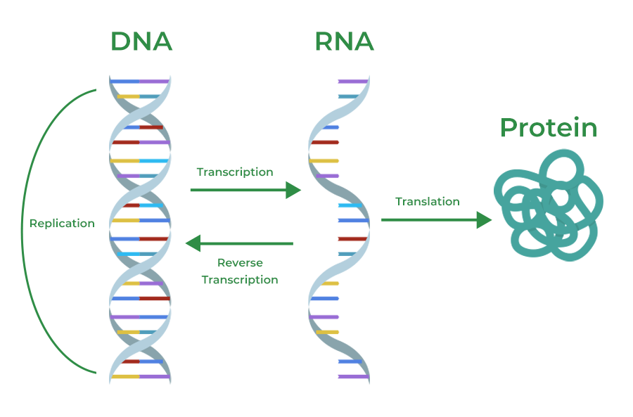

# Quick intro: 생명과학 모델링

[🏠 Portfolio](https://github.com/heoneyzi) › [📚 Study](../../README.md) › [🧬 Genomics](../README.md) › [📘 Primer](README.md)

> ✍️ **정유민 (teammate)** · 📅 ≈ 2026-01 (kick-off) · 🗂️ Source: Notion — *Functional Genomics › 개인 아카이브*

---

- 이 분야를 이해하는 데 가장 중요한 지식으로, DNA → RNA → 단백질 순으로 유전자가 발현되는 과정인 central dogma가 있음.
- 얕고 넓게 다루되 부족한 지식이 있는 경우 GPT등을 이용해 공부하면 좋음.

#### Central dogma

DNA: 모든 세포 핵에 염색체의 형태로 존재하는 보존서고의 개념 (평생 유지됨). 단위: nucleotide (ATGC)

RNA: 염색체에서 일부 긁어온 원문복사한 전사본의 개념 (반감기 짦음). 단위: nucleotide (AUGC)

단백질: RNA가 ribosome이라는 세포내 기구에 의해 만드는 물질 - 생명현상의 거의 대부분을 설명. 단위: amino acid (20가지)

#### 생명현상에 대한 딥러닝의 적용

<b>DNA 수준의 모델</b>

- Evo, Evo-2
- DNABERT 등 오래된 approach..

<b>DNA-RNA 과정의 모델</b>

- SpliceAI: 스플라이싱 (Splicing) 과정 예측에 특화된 모델
- AlphaGenome (2025): DNA → RNA 생성 결과를 정밀한 수준으로 모델링 [www.biorxiv.org](https://www.biorxiv.org/content/10.1101/2025.06.25.661532v1)
    - DNA sequence로부터 RNA-Seq, epigenetics를 복원함
- Virtual cell challenge: Perturbation 결과를 예측 (see also: [Perturb-seq](https://en.wikipedia.org/wiki/Perturb-seq))
    - *Perturbation as an action?*

<b>단백질 수준의 모델</b>

<b>단백질 접힘 모델 (Protein Folding Model)</b>

- 단백질 서열에서 3차원 구조를 복원

**예시**

- AlphaFold1/2/3
- RoseTTAFold
- AlphaFold-NA, All-Atom, etc.
- ESMFold
- SimpleFold: 단백질 전용 특별한 attention 구조 없이도 어느 정도 성능 나옴

<b>단백질 언어 모델 (Protein Language Model)</b>

- Encoder-only Transformer + MLM (BERT style)
    - ESM-1b/ESM-2, ProtBert, ProteinBERT, MSA Transformer
    - **트레이드오프:** 생성 자체(긴 서열을 자연스럽게 뽑는)는 GPT류보다 덜 직접적(MLM이라 “inpainting” 스타일이 기본).
- Encoder-Decoder Transformer + Denoising (T5 style)
    - ProtT5(ProtTrans)
    - **트레이드오프:** encoder-decoder는 추론/파인튜닝이 encoder-only보다 무거울 수 있고, 생성은 가능하지만(복원/번역로서) GPT식 자유 생성과는 결이 다름.
- Decoder-only Transformer + Autoregressive (GPT style)
    - ProGen, ProGen2, ProtGPT
    - **트레이드오프:** decoder-only는 본질적으로 “생성”에 최적화되어 있어, 고정 임베딩이 필요한 태스크는 설계/추론이 번거로울 수 있음.
- 구조 정보까지 넣는 구조 조건 / 멀티모달
    - SaProt, ESM-IF1, ProtT5
    - **트레이드오프:** 구조 토큰을 만들기 위한 구조 소스(실험 구조/예측 구조)가 필요해져서 데이터 파이프라인이 복잡해짐.

<b>단백질 기능 예측</b>

- Gene ontology 예측 (단백질의 기능적 카테고리 예측): CAFA challenge와 연결 → [CAFA 6 Protein Function Prediction](https://www.kaggle.com/competitions/cafa-6-protein-function-prediction/overview)
- 기능을 아는 단백질의 기능 수준을 예측 (regression): [ProteinGym](https://proteingym.org/) 등을 생각할 수 있을 듯
    - BERT 스타일 단백질 언어모델 fine-tuning도 가능
    - RL의 적용 가능성
        - [NeurIPS  Functional Alignment of Protein Language Models via Reinforcement Learning with Experimental Feedback](https://neurips.cc/virtual/2024/102489)
        - [NeurIPS Poster Steering Generative Models with Experimental Data for Protein Fitness Optimization](https://neurips.cc/virtual/2025/loc/san-diego/poster/118787)
        - [ICLR: Model-based reinforcement learning for biological sequence design](https://iclr.cc/virtual_2020/poster_HklxbgBKvr.html)
- 단백질 언어 모델이 기능도 tokenize해서 예측하거나 conditioning 하는 경우도 존재 (ESM-3) [Simulating 500 million years of evolution with a language model](https://www.science.org/doi/10.1126/science.ads0018)

<b>Inverse folding model</b>

- 단백질의 구조 → 서열을 복원
- ProteinMPNN: [Robust deep learning–based protein sequence design using ProteinMPNN](https://www.science.org/doi/10.1126/science.add2187)

<b>기타 Generative model ~ 신약 개발</b>

- 원하는 구조 부분(모티프)에 결합하는 단백질을 생성하는 모델
    - RFdiffusion 등

---

제안

1. 저널클럽 톡방을 따로 파는 것은 어떨지
2. 양방향 자유로운 대화를 위해 반말을 씁시다
