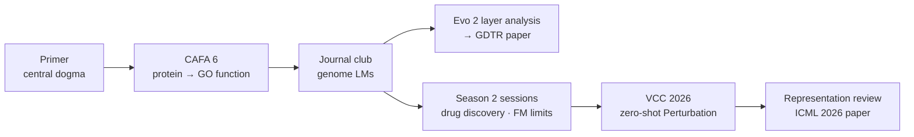

[🏠 Portfolio](https://github.com/heoneyzi) › [📚 Study](../README.md) › **🧬 Genomics**

# 🧬 Genomics — two seasons of Functional Genomics study notes

**How does a DNA sequence turn into what a cell does — and how much of that path can today's models follow?**

    

[📘 Start here](#-start-here) · [📚 Every note](#-index-of-every-note) · [🧫 01_Medical/CAFA6](https://github.com/heoneyzi/Medical/blob/main/CAFA6/README.md) · [🧪 01_Medical/VCC_2026](https://github.com/heoneyzi/Medical/blob/main/VCC_2026/README.md) · [📄 02_Paper/GDTR](https://github.com/heoneyzi/Paper/blob/main/GDTR/README.md)

> [!TIP]
> **TL;DR** — 69 curated notes from the YAI Functional Genomics study team. **Season 1** (Jan – Apr 2026) went from protein-function prediction (CAFA 6, team Bronze Medal) to a journal club on genome language models; its last meeting proposed the layer-by-layer Evo 2 analysis that became **GDTR**. **Season 2** (Jul 2026 –, which I lead) turned to single-cell Perturbation biology and the **Virtual Cell Challenge 2026**.

| | |
|---|---|
| **Period** | Season 1: Jan – Apr 2026 · Season 2: Jul 2026 – ongoing |
| **Teams** | Season 1 — 5 members: 조윤진, 구민선, 박수빈, 정유민, 강지헌 (CAFA 6 team lead: 조윤진) · Season 2 — 6 members: **강지헌 (lead)**, 정유민, 김민석, 김서진, 김서연, 이동현 |
| **My role** | YAI **Functional Genomics Team Lead** (Jun 2026 –) and **VCC 2026 Team Lead** · season-1 member: journal-club week-2 presenter, CAFA 6 dataset notes and the ProtT5 branch |
| **What is here** | 65 notes converted from Notion (original Korean) + 4 local write-ups; 3 of my CAFA 6 notes live in [01_Medical/CAFA6](https://github.com/heoneyzi/Medical/blob/main/CAFA6/notes/README.md) |
| **Status** | 🔄 Ongoing — VCC 2026 is ranked on an unseen test set released 2026-10-22 (per the team's notes) |

## 🗺️ Map

<table>
<tr>
<td width="33%" valign="top">

 <b><a href="00_primer/README.md">📘 Primer</a></b>
 Biology for ML people (2 notes): the central dogma and which model lives at each level.
 <b>Start here</b>
</td>
<td width="33%" valign="top">

 <b><a href="season1_functional_genomics/README.md">Season 1 · Functional Genomics</a></b>
 CAFA 6 → journal club on genome LMs (43 notes).
 <b>CAFA 6 Bronze (team) · my week-2 talk · seed of GDTR</b>
</td>
<td width="33%" valign="top">

 <b><a href="season2_functional_genomics_2/README.md">Season 2 · Functional Genomics 2</a></b>
 Perturbation biology → VCC 2026 (24 notes).
 <b>Team I lead · frozen-baseline analysis · representation review</b>
</td>
</tr>
</table>

## 🧭 The story

**Season 1 — from proteins to genome language models.** The team started from the central dogma and picked CAFA 6 as a fast way to touch real biological data: predict Gene Ontology functions from protein sequences before the 2 Feb 2026 deadline. Each member took one route (GO retriever, ESM-C, ProtT5 — mine, JEPA), and the team finished with a Bronze Medal. The journal club then read five papers on genome LMs — a survey, my talk on whether gLM embeddings beat one-hot baselines (mostly they do not), Ctrl-DNA, Evo 2 and AlphaGenome — and kept returning to one question: should biological priors be built in, or learned from scale? The last meeting proposed tracking how Evo 2's predictions settle layer by layer; that thread became the YAICON project and the GDTR paper.

**Season 2 — Perturbation biology and VCC 2026.** I opened season 2 with AI for drug discovery; teammates followed with the limits of single-cell foundation models, optimal-transport drug-response models and the lessons of VCC 2025. VCC 2026 asks for zero-shot predictions — 3 unseen cell lines × 300 CRISPRi knockdowns × 400 cells × 18,533 genes, given only unperturbed control cells. Each member explored a route (retrieval from public screens, CCLE/Chronos transfer, Stack, my frozen-embedding baselines). The recurring finding — transferring already-measured effects carries the score while the representation adds little — led to my review of an ICML 2026 paper on what makes a representation good for Perturbation prediction.

## 🗓️ Timeline

| When | What happened | Notes |
|---|---|---|
| 2026-01-17 | Season 1 kick-off — enter CAFA 6 first | [1차 회의](season1_functional_genomics/meetings/01_meeting01_2026-01-17.md) |
| 2026-01-21 | CAFA 6 task split — I take the ProtT5 (T5) embeddings | [3차 회의](season1_functional_genomics/meetings/03_meeting03_2026-01-21.md) |
| 2026-02-02 | CAFA 6 final submission — the team earned a Bronze Medal | [CAFA 6 notes](season1_functional_genomics/cafa6/README.md) |
| 2026-02-03 | Midterm report — four-phase plan ending in a gene-level challenge | [중간보고서](season1_functional_genomics/meetings/05_midterm_report_2026-02-03.md) |
| 2026-02-15 → 04 | Journal club weeks 1–5; my talk on 02-18 | [journal club](season1_functional_genomics/journal_club/README.md) |
| 2026-04 | 11th meeting: probe Evo 2 with SAEs and a DTR-style layer analysis → YAICON → GDTR (ICML 2026 GenBio Workshop, oral) | [11차 회의](season1_functional_genomics/meetings/10_meeting11_2026-04-05.md) · [02_Paper/GDTR](https://github.com/heoneyzi/Paper/blob/main/GDTR/README.md) |
| 2026-07-28 | Season 2 kick-off (I lead): AI for drug discovery | [FG 개요 1](season2_functional_genomics_2/sessions/01_fg_overview1_drug_discovery_2026-07-28.md) |
| 2026-08-04 → 15 | FM limits · OT drug response · VCC 2025 lessons | [sessions](season2_functional_genomics_2/sessions/README.md) |
| 2026-08-22 | VCC 2026 kick-off — datasets, metrics, baseline first | [kick-off](season2_functional_genomics_2/sessions/05_vcc2026_meeting1_2026-08-22.md) |
| 2026-09-06 | Mid-challenge review; team retrieval line at 30 / 181 on the validation board | [review](season2_functional_genomics_2/sessions/06_vcc2026_direction_meeting_2026-09-06.md) · [hub](season2_functional_genomics_2/vcc2026/08_week1_hub.md) |
| 2026-09-26 → 27 | My representation review for FG2 | [reviews](season2_functional_genomics_2/reviews/README.md) |
| 2026-10-22 | VCC 2026 test set released for the final ranking (per team notes) | [SUMMARY](season2_functional_genomics_2/vcc2026/08a_summary.md) |

## 📘 Start here

No biology background needed — read in this order:
1. [Quick intro: 생명과학 모델링](00_primer/02_quick_intro_bio_modeling.md) — the central dogma and a map of models per level.
2. [Basic biology notes](00_primer/01_basic_biology_notes.md) — DNA, RNA, proteins, splicing, mutations (my first pass).
3. [CREs & TFs in plain words](season1_functional_genomics/journal_club/02a_cre_tf_explainer.md) → [Week 1 · gLM survey](season1_functional_genomics/journal_club/01_week1_glm_survey.md).
4. [Week 2 · my gLM-evaluation talk](season1_functional_genomics/journal_club/02_week2_glm_evaluating.md) → [my inductive-bias essay](season1_functional_genomics/essays/01_inductive_bias_in_glms.md).
5. [VCC 2025 lessons](season2_functional_genomics_2/sessions/04_vcc2025_review_2026-08-15.md) → [my dataset map](season2_functional_genomics_2/vcc2026/01_datasets_perturb_essentials.md) → [my baseline analysis](season2_functional_genomics_2/vcc2026/07_baseline_analysis.md).
6. [The representation review](season2_functional_genomics_2/reviews/01_what_makes_a_representation_good.md) — ties seasons together.

## 📚 Index of every note

Author: **(me)** = Jiheon; 🤖 = AI-generated text or an AI note-taker summary (flagged inside the note); ↗ = kept in another portfolio folder.

<b>📘 Primer</b> — 2 notes · <a href="00_primer/README.md">folder</a>

| Note | Author | Date | What it is |
|---|---|---|---|
| [기본 생명과학 정리 · basic biology](00_primer/01_basic_biology_notes.md) | 강지헌 (me) | S1 | Proteins, nucleic acids, DNA vs RNA, splicing and mutation types (point, frameshift, splicing, chromosomal) — a non-biologist's first pass. |
| [Quick intro: 생명과학 모델링](00_primer/02_quick_intro_bio_modeling.md) | 정유민 | 2026-01 | Central dogma and a map of deep-learning models per level: Evo 2, SpliceAI, AlphaGenome, AlphaFold, protein LMs, ProteinMPNN, RFdiffusion. |

<b>Season 1 › CAFA 6</b> — 10 notes · <a href="season1_functional_genomics/cafa6/README.md">folder</a>

| Note | Author | Date | What it is |
|---|---|---|---|
| [프로젝트 방향성 · project direction](season1_functional_genomics/cafa6/01_project_direction.md) | 조윤진 · 🤖 | 2026-01 | Kick-off proposal: enter CAFA 6 first (deadline 2 Feb) vs. aim straight at the Virtual Cell Challenge; pasted ChatGPT reading lists on Perturbation-prediction models. |
| [Challenge · candidate challenges](season1_functional_genomics/cafa6/02_challenge_candidates.md) | 조윤진 | 2026-01 | Side-by-side comparison of candidate challenges (CAGI7 RGP-CRAM, CAFA 6, Virtual Cell Challenge, DREAM Target 2035): task, data, access, metric, prizes. |
| [perplexity가 알려준 논문 · leads](season1_functional_genomics/cafa6/03_perplexity_paper_leads.md) | 조윤진 · 🤖 | 2026-01 | Perplexity-generated leads: single-cell foundation models, Nicheformer, GNN-based GRN inference, plant single-cell FMs, Genos. |
| [[유민] CAFA6 첫주 · week-1 survey](season1_functional_genomics/cafa6/04_yumin_cafa6_week1.md) | 정유민 | 2026-01-21 | Public CAFA 6 kernels and datasets (GOA + ProtT5 ensembles, shared pLM embeddings) and notes on top CAFA 5 solutions (GCN refinement). |
| [[지헌] CAFA6 톺아보기 ↗](https://github.com/heoneyzi/Medical/blob/main/CAFA6/notes/README.md) | 강지헌 (me) | 2026-01 | Hub of my CAFA 6 notes (kept in **01_Medical/CAFA6**, not duplicated here). |
| [데이터셋 정리 · dataset walkthrough ↗](https://github.com/heoneyzi/Medical/blob/main/CAFA6/notes/01_dataset.md) | 강지헌 (me) | 2026-01 | File-by-file guide to the CAFA 6 data (FASTA, GO terms, taxonomy, `go-basic.obo`, IA weights, submission format). Canonical copy of 4 identical Notion copies. |
| [아이디어 · modeling ideas ↗](https://github.com/heoneyzi/Medical/blob/main/CAFA6/notes/02_ideas.md) | 강지헌 (me) | 2026-01 | Ideas: GOA-based distillation into ESM-2 + classifier, GO-term tokenization (ESM-3 style), text contrast, DAG-aware losses. |
| [[윤진] 코드 1차 시도 · first attempt](season1_functional_genomics/cafa6/05_yoonjin_code_attempt1.md) | 조윤진 | 2026-01 | ESM-C embeddings with mean / mean⊕max / CLS pooling + linear heads; plan for a GO-DAG GCN; what the IA (information accretion) weights mean. |
| [Method · planned variants](season1_functional_genomics/cafa6/06_yoonjin_method.md) | 조윤진 | 2026-01 | Four planned variants (pooling × GCN over the GO DAG) with the parent ≥ child constraint and CAFA F-max evaluation. |
| [[수빈] CAFA6 시도 · JEPA](season1_functional_genomics/cafa6/07_subin_cafa6_jepa.md) | 박수빈 | 2026-02 | JEPA-style label-representation learning for GO prediction (code: SOL1archive/CAFA6) and reflections on the first submission. |

<b>Season 1 › Journal club</b> — 10 notes · <a href="season1_functional_genomics/journal_club/README.md">folder</a>

| Note | Author | Date | What it is |
|---|---|---|---|
| [Week 1 · GLM survey](season1_functional_genomics/journal_club/01_week1_glm_survey.md) | 조윤진 | 2026-02-15 | Long summary of *A comprehensive survey of genome language models in bioinformatics*: why gLMs, Transformer/Hyena/SSM, tokenization, pretraining data, evaluation, benchmarks, open problems. |
| [둘이 뭐가 다른데? · Evo 2 vs AlphaGenome](season1_functional_genomics/journal_club/01a_evo2_vs_alphagenome_representations.md) | 조윤진 · 🤖 | 2026-02 | ChatGPT explanation of what an autoregressive gLM's hidden states encode (sequence statistics) vs a sequence-to-function model (functional signal). |
| [뭔 말이냐면 · task-specific models](season1_functional_genomics/journal_club/01b_why_task_specific_models_win.md) | 조윤진 · 🤖 | 2026-02 | ChatGPT explainer: sequence-to-signal regression and variant scoring — why Enformer, DeepSEA, ChromBPNet and CADD still beat general gLMs. |
| [Week 2 · gLM evaluating (my talk)](season1_functional_genomics/journal_club/02_week2_glm_evaluating.md) | 강지헌 (me) | 2026-02-18 | My week-2 talk on *Evaluating the representational power of pre-trained DNA language models for regulatory genomics* (Genome Biology 2025): six tasks, attribution maps, why gLM probes rarely beat one-hot CNNs. |
| [부가설명 · CREs & TFs](season1_functional_genomics/journal_club/02a_cre_tf_explainer.md) | 강지헌 (me) | 2026-02-18 | Plain-language side note: cis-regulatory elements (promoter, enhancer, silencer, insulator) and transcription factors. |
| [저널 2 리뷰 · companion notes](season1_functional_genomics/journal_club/02b_week2_review_notes.md) | 강지헌 (me) | 2026-02 | Which gLMs were compared, how embeddings were probed (penultimate layer, CLS/mean → ridge/MLP/CNN), and my discussion questions. |
| [Week 3 · Ctrl-DNA](season1_functional_genomics/journal_club/03_week3_ctrl_dna.md) | 박수빈 | 2026-03-02 | Ctrl-DNA: constrained RL (CMDP, Lagrangian primal–dual, GRPO-style advantages, TFBS regularizer) for cell-type-specific regulatory DNA design. |
| [Week 4 · Evo 2](season1_functional_genomics/journal_club/04_week4_evo2.md) | 정유민 | 2026-04 | Figure-by-figure Evo 2 review (OpenGenome2, 1 Mb context, zero-shot variant effects, SAE features, genome-scale generation) with discussion prompts on inductive bias. |
| [Week 5 · AlphaGenome](season1_functional_genomics/journal_club/05_week5_alphagenome.md) | 구민선 | 2026-04 | AlphaGenome deep dive: genome tracks, splice-junction modeling, teacher–student distillation, variant case studies (TAL1), MPRA benchmarks, limitations. |
| [전체세션 발표 구성 · talk outline](season1_functional_genomics/journal_club/06_allhands_talk_outline.md) | — | S1 | Outline of an all-hands talk on genome LMs: "Genome GPT?", the 98 % non-coding problem, representation under scrutiny, toward conditional multimodal gLMs. |

<b>Season 1 › Paper proposals</b> — 14 notes · <a href="season1_functional_genomics/journal_club/proposals/README.md">folder</a>

| Note | Author | Date | What it is |
|---|---|---|---|
| [[윤진] DNA LM representational power](season1_functional_genomics/journal_club/proposals/01_yoonjin_dna_lm_representational_power.md) | 조윤진 | 1주차 | Pitch for the gLM-evaluation paper as a background builder — became my week-2 presentation. |
| [[민선] gLM survey](season1_functional_genomics/journal_club/proposals/02_minseon_glm_survey.md) | 구민선 / 정유민 | 1주차 | Pitch for the gLM survey (Brief. Bioinform.) — read together in week 1. |
| [[수빈, 민선] AlphaGenome](season1_functional_genomics/journal_club/proposals/03_subin_minseon_alphagenome.md) | 박수빈 · 구민선 | 1주차 | Two pitches for AlphaGenome: one model for many functional-genomics tracks; regulatory variant effects. |
| [[지헌] scGeneScope](season1_functional_genomics/journal_club/proposals/04_jiheon_scgenescope.md) | 강지헌 (me) | 1주차 | My pitch: paired imaging + scRNA-seq benchmark for predicting drug treatment — an on-ramp to virtual-cell problems. |
| [[유민] μProtein · RL protein engineering](season1_functional_genomics/journal_club/proposals/05_yumin_protein_engineering_rl.md) | 정유민 | 1주차 | μProtein (Nat. Mach. Intell. 2025): μFormer fitness model + RL search (μSearch) for multi-mutant protein design. |
| [[민선] AlphaFold](season1_functional_genomics/journal_club/proposals/06_minseon_alphafold.md) | 구민선 | 3주차 | AlphaFold as a contrast to gLMs: sequence + MSA → 3D structure. |
| [[윤진] personalized expression review](season1_functional_genomics/journal_club/proposals/07_yoonjin_personalized_expression_review.md) | 조윤진 | 3주차 | Review of personalized expression prediction: S2F models vs gLMs and why both miss individual-level variant effects. |
| [cf) S2F model 계보](season1_functional_genomics/journal_club/proposals/07a_s2f_model_lineage.md) | 조윤진 | 3주차 | Reading roadmap of sequence-to-function models: DeepSEA → Basset → Basenji(2) → ExPecto → BPNet → Enformer → Sei → Borzoi → AlphaGenome. |
| [[수빈] Ctrl-DNA](season1_functional_genomics/journal_club/proposals/08_subin_ctrl_dna.md) | 박수빈 | 3주차 | Ctrl-DNA pitch (constrained RL for cell-type-specific CRE design) — became the week-3 session. |
| [[유민] Evo 2](season1_functional_genomics/journal_club/proposals/09_yumin_evo2.md) | 정유민 | 3주차 | Evo 2 pitch: strongest zero-shot variant-effect gLM, generative capability, BRCA1 fine-tuning recipe — became week 4. |
| [[유민] PLM-guided directed evolution](season1_functional_genomics/journal_club/proposals/10_yumin_directed_evolution_plm.md) | 정유민 | 기타 | PLM-picked single mutants + double-mutant epistasis modeling to extrapolate high-order combinations (Science). |
| [[민선] DNA-Diffusion](season1_functional_genomics/journal_club/proposals/11_minseon_dna_diffusion.md) | 구민선 | 기타 | Cell-type-conditioned DDPM that designs 200 bp regulatory elements; contrast with Evo 2's genome-scale design. |
| [[윤진] week-1 candidate table](season1_functional_genomics/journal_club/proposals/12_yoonjin_week1_candidates.md) | 조윤진 | 1주차 | Candidate table: MxDNA, DNAChunker, DNAMotifTokenizer (tokenization), Borzoi (RNA-seq coverage), Isoformer. |
| [Nicheformer memo](season1_functional_genomics/journal_club/proposals/13_nicheformer_memo.md) | — | — | One-line memo on Nicheformer (Nature Methods 2025): single-cell + spatial transcriptomics in one model. |

<b>Season 1 › Meetings</b> — 10 notes · <a href="season1_functional_genomics/meetings/README.md">folder</a>

| Note | Author | Date | What it is |
|---|---|---|---|
| [1차 회의 · kick-off](season1_functional_genomics/meetings/01_meeting01_2026-01-17.md) | 🤖 team | 2026-01-17 | Kick-off: single-cell basics, central dogma, DL models per level; decision to enter CAFA 6 first; action items. |
| [2차 회의](season1_functional_genomics/meetings/02_meeting02_2026-01-20.md) | team | 2026-01-20 | Online check-in; the working notes live in 유민's CAFA 6 week-1 page. |
| [3차 회의 · task split](season1_functional_genomics/meetings/03_meeting03_2026-01-21.md) | team | 2026-01-21 | Task split for CAFA 6: 유민 → GO retriever, 윤진 → ESM-C, 지헌 → ProtT5 (T5) embeddings. |
| [4차 회의 · CAFA 6 progress](season1_functional_genomics/meetings/04_meeting04_2026-01-29.md) | 🤖 team | 2026-01-29 | CAFA 6 progress: ESM-C pooling baselines, why exact GO prediction is hard, late fusion with a GO retriever, propagation post-processing; next: T5 comparison (지헌), JEPA (수빈). |
| [중간보고서 · midterm report](season1_functional_genomics/meetings/05_midterm_report_2026-02-03.md) | team | 2026-02-03 | Project overview, background and four-phase plan (central dogma → CAFA 6 → journal club → a new challenge such as VCC); data sources. |
| [5차 회의 · journal-club rules](season1_functional_genomics/meetings/06_meeting05_2026-02-05.md) | team | 2026-02-05 | Journal-club format: weekly paper, presenter chosen the day before, where to find papers (ICLR/NeurIPS/ICML, Nature/Cell/Science, NAR…). |
| [6차 회의 · journal club #1](season1_functional_genomics/meetings/07_meeting06_jc1_2026-02-15.md) | 🤖 team | 2026-02-15 | Journal club #1 recap: gLM architectures (Transformer, Hyena/StripedHyena), tokenization (k-mer, BPE), MLM vs CLM, evaluation, limits. |
| [7차 회의 · journal club #2 (my talk)](season1_functional_genomics/meetings/08_meeting07_jc2_2026-02-18.md) | 🤖 team | 2026-02-18 | Discussion after my talk: weak Pearson baselines, fairness of the comparison, one-hot + gLM fusion, tokenization limits, non-coding learning. |
| [8차 회의 · journal club #3](season1_functional_genomics/meetings/09_meeting08_jc3_2026-03-02.md) | 🤖 team | 2026-03-02 | Journal club #3 recap (Ctrl-DNA): RL basics, CMDP, Lagrangian primal–dual, PPO vs GRPO, reward hacking, Q&A. |
| [11차 회의 · Evo 2, AlphaGenome, next](season1_functional_genomics/meetings/10_meeting11_2026-04-05.md) | 🤖 team | 2026-04-05 | Evo 2 and AlphaGenome recaps, the inductive-bias debate, and the plan to probe Evo 2 with SAEs and a Deep-Thinking-Ratio (DTR) layer analysis — the seed of GDTR. |

<b>Season 1 › Essays</b> — 2 notes · <a href="season1_functional_genomics/essays/README.md">folder</a>

| Note | Author | Date | What it is |
|---|---|---|---|
| [Inductive bias in gLMs? (essay)](season1_functional_genomics/essays/01_inductive_bias_in_glms.md) | 강지헌 (me) | 2026 S1 | My essay: does "less inductive bias" (the bitter lesson) suit genome LMs? DNABERT → NT → DNABERT-2/HyenaDNA → Caduceus/Evo → Evo 2, and where biological priors re-enter. |
| [야이콘 방향성 · gDTR & ΔH](season1_functional_genomics/essays/02_yaicon_direction_gdtr.md) | 강지헌 (me) | 2026 | Reflection on the YAICON project: Task 1 gDTR (layer-wise settling) and Task 2 ΔH (representative vs load-bearing layers) — open questions and metric ideas. |

<b>Season 2 › Home</b> — 1 note · <a href="season2_functional_genomics_2/README.md">folder</a>

| Note | Author | Date | What it is |
|---|---|---|---|
| [모델 참고 · Arc virtual-cell stack](season2_functional_genomics_2/00_arc_model_reference.md) | (quoted) | 2026-07 | Arc Institute's virtual-cell stack as listed in the VCC 2026 announcement: State, Stack, Evo 2, scBaseCount, Proto, CodonFM. |

<b>Season 2 › Team sessions</b> — 7 notes · <a href="season2_functional_genomics_2/sessions/README.md">folder</a>

| Note | Author | Date | What it is |
|---|---|---|---|
| [FG 개요 1 · AI for drug discovery](season2_functional_genomics_2/sessions/01_fg_overview1_drug_discovery_2026-07-28.md) | 🤖 강지헌 · 정유민 | 2026-07-28 | "Lab in the Loop" AI-for-drug-R&D overview, then PhenoCompass (cell-painting × structure joint embedding for scaffold hopping) and TranscriptFormer, with discussion. |
| [Lab-in-the-Loop slide notes](season2_functional_genomics_2/sessions/01a_lab_in_the_loop_slide_notes.md) | 강지헌 (me) | 2026-07-28 | My notes on a 32-slide conference session: what each slide says, why it matters, and follow-up reading (inavolisib, Decima, Perturb atlases, Biomni, VoxBind, PhenoCompass…). |
| [FG 개요 2 · genomic FM limits](season2_functional_genomics_2/sessions/02_fg_overview2_genomic_fm_limits_2026-08-04.md) | 🤖 김민석 | 2026-08-04 | Limits of single-cell FMs: PCA / SC-TOP baselines matching FMs, Perturbation benchmarks, GEARS, and a call for harder tasks (spatial, multi-omics). |
| [FG 개요 3 · OT for drug response](season2_functional_genomics_2/sessions/03_fg_overview3_ot_drug_response_2026-08-08.md) | 🤖 김서진 | 2026-08-08 | Single-cell drug-response prediction (CPA/ChemCPA, CellOT) and a conditional-OT model (named "SIMMONS" in the summary) with Sinkhorn + Monge-gap loss; VCC plan. |
| [VCC 2025 정리 · lessons](season2_functional_genomics_2/sessions/04_vcc2025_review_2026-08-15.md) | 🤖 김서연 · 이동현 | 2026-08-15 | VCC 2025 recap: task, metrics (DES/PDS/MAE), winning solutions, the PDS-metric critique, and the PRiMeFlow (1st place) paper. |
| [VCC 2026 1차 회의 · kick-off](season2_functional_genomics_2/sessions/05_vcc2026_meeting1_2026-08-22.md) | 🤖 team | 2026-08-22 | VCC 2026 kick-off: dataset survey converged, new metric definitions, baseline-first strategy, candidate models (GEARS, State, X-Cell), cell-line context ideas. |
| [Mid-challenge review (09-06)](season2_functional_genomics_2/sessions/06_vcc2026_direction_meeting_2026-09-06.md) | 🤖 team | 2026-09-06 | Mid-challenge review: frozen-embedding and delta-transfer results, the retrieval pipeline, leaderboard limits → refocus on Perturbation-modeling research. |

<b>Season 2 › VCC 2026</b> — 13 notes · <a href="season2_functional_genomics_2/vcc2026/README.md">folder</a>

| Note | Author | Date | What it is |
|---|---|---|---|
| [Perturb 필수 데이터셋 · my dataset map](season2_functional_genomics_2/vcc2026/01_datasets_perturb_essentials.md) | 강지헌 (me) | 2026-08 | My map of datasets for zero-shot Perturbation prediction: Jiang24 (multi-cell-line), Replogle 2022, primary CD4⁺ T, scBaseCount/CELLxGENE, VCC 2025 H1, X-Atlas/Orion, GSE264667. |
| [2026 VCC Datasets + New](season2_functional_genomics_2/vcc2026/02_datasets_vcc2026_and_new.md) | 김서연 | 2026-08 | VCC 2026 data spec (3 contexts × 300 targets × 400 cells × 18,533 genes), Arc Virtual Cell Atlas, public gene/chemical Perturbation sets, lineage-coverage gap table. |
| [Lineage-gap datasets](season2_functional_genomics_2/vcc2026/03_datasets_lineage_gap_candidates.md) | 이동현 | 2026-08 | Prioritized candidates for missing lineages: TeloHAEC endothelial, iPSC neurons/astrocytes, iAssembloids, cortical neurogenesis, THP-1 LPS, IGVF cardiomyocytes. |
| [X-Atlas/Pisces & more](season2_functional_genomics_2/vcc2026/04_datasets_pisces_and_more.md) | 정유민 | 2026-08 | X-Atlas/Pisces (25.6M cells, 16 contexts), Feng 2026 iPSC donors, sci-Plex-GxE, Replogle 2020, Perturb-CITE-seq, PerturbAI mouse atlas — priorities and caveats. |
| [Replogle-호환 Dataset](season2_functional_genomics_2/vcc2026/05_datasets_replogle_compatible.md) | 김민석 | 2026-08 | Replogle-compatible additions: the KOLF2.1J hiPSC atlas (same QC) and DepMap/Chronos as gene-importance context. |
| [Replogle Nadig Preprint](season2_functional_genomics_2/vcc2026/06_datasets_replogle_nadig.md) | 김서진 | 2026-08 | Arc's Replogle–Nadig bundle (K562, RPE1, HepG2, Jurkat) as the baseline training set; scPerturb as an alternative. |
| [Baseline 분석 · frozen baselines](season2_functional_genomics_2/vcc2026/07_baseline_analysis.md) | 강지헌 (me) | 2026-09 | My analysis: the big jump comes from transferring already-measured CRISPRi effects; the representation used for matching (raw/PCA vs frozen FM embeddings) adds little and is condition-dependent. |
| [1st week · hub](season2_functional_genomics_2/vcc2026/08_week1_hub.md) | 정유민 | 2026-09 | Hub page: fully zero-shot setup; validation leaderboard 30 / 181 (KIMCHI-3, Overall +0.0876); STATE failed → retrieval from the Replogle genome-wide screen. |
| [SUMMARY · KIMCHI line](season2_functional_genomics_2/vcc2026/08a_summary.md) | 정유민 | 2026-09-06 | Write-up of the KIMCHI line: submissions table, emission fixes (rank 73 → 30), holdout→leaderboard transfer rates, oracle decomposition, rejected ideas, next steps. |
| [PROGRESS · day 1](season2_functional_genomics_2/vcc2026/08b_progress_day1.md) | 정유민 | 2026-08-24 | Day-1 log: the 272/300 genome-wide coverage discovery, cell-eval vs cell-eval2 mismatch, cross-cell-line transfer correlations, KIMCHI-2 configuration. |
| [DAY2 · day 2](season2_functional_genomics_2/vcc2026/08c_day2.md) | 정유민 | 2026-08-24 | Day-2 log: FID anchor mismatch, stochastic rounding, shared basal cells, panel centering, response dispersion; rejected shrinkage/rank transfer; uncovered targets. |
| [하윙 · Stack context transfer](season2_functional_genomics_2/vcc2026/09_stack_context_transfer.md) | 김서진 | 2026-09 | Ran Arc's Stack (T=1 vs T=5) on an RTX 3090, validated the submission pipeline (control baseline Overall −0.312), planned multi-source context transfer. |
| [CCLE & Chronos · retrieval + transfer](season2_functional_genomics_2/vcc2026/10_ccle_chronos_retrieval.md) | 김민석 | 2026-09 | Retrieval + transfer with CCLE context routing and DepMap-Chronos magnitude calibration; internal gains did not transfer to the leaderboard — lessons. |

<b>Season 2 › Reviews</b> — 3 notes · <a href="season2_functional_genomics_2/reviews/README.md">folder</a>

| Note | Author | Date | What it is |
|---|---|---|---|
| [What makes a representation good? (review)](season2_functional_genomics_2/reviews/01_what_makes_a_representation_good.md) | 강지헌 (me) | 2026-09-27 | My main FG2 review of *What Makes a Representation Good for Single-Cell Perturbation Prediction?* (ICML 2026), then re-reading FG2 models and VCC through its "shared effect + background-dependent modulation" lens. |
| [Talk plan (slide by slide)](season2_functional_genomics_2/reviews/02_talk_plan.md) | 강지헌 (me) | 2026-09 | Slide-by-slide plan for presenting the review: flow, figures and charts, speaker notes. |
| [Embedding-centric edition (09-26)](season2_functional_genomics_2/reviews/03_embedding_centric_review_2026-09-26.md) | 강지헌 (me) | 2026-09-26 | Earlier embedding-centric edition of the review (superseded by 01; kept for its model-comparison tables). |

## 🧹 How this was curated

- **Complete:** all 107 pages and databases under Notion *Genomics* were crawled; each maps to a note, is merged into one, or is excluded for a stated reason; every note header names its Notion source.
- **Deduplicated:** 10 duplicate Notion pages (copies in *Genomics (1)*, CAFA 6 dataset copies, session rows vs meeting one-pagers) → one canonical note each; duplicates are named in each note header.
- **Excluded:** blank pages, a photo-only meeting (10차), two AI transcript summaries with personal chatter, and 5 meeting screenshots/photos (video-call tiles with names and departments, a chat screenshot showing meeting passwords, a team photo).
- **Sanitized:** e-mail addresses, server paths, GPU budget/vendor plans, a society-politics item, private transcript and ChatGPT-share links.
- **Kept as written:** notes stay in Korean; teammates are credited by name; AI-generated passages are flagged, not rewritten.

## 🔗 Links

Projects built on these notes: [01_Medical/CAFA6](https://github.com/heoneyzi/Medical/blob/main/CAFA6/README.md) · [01_Medical/VCC_2026](https://github.com/heoneyzi/Medical/blob/main/VCC_2026/README.md) · [02_Paper/GDTR](https://github.com/heoneyzi/Paper/blob/main/GDTR/README.md) · [01_Medical/GDTR](https://github.com/heoneyzi/Medical/blob/main/GDTR/README.md) — public briefs: [heoneyzi/CAFA6](https://github.com/heoneyzi/CAFA6) · [heoneyzi/Virtual-Cell-Challenge-2026](https://github.com/heoneyzi/Virtual-Cell-Challenge-2026) · [TDiG (GDTR team code)](https://github.com/YAICON-8th-Think-Deep-in-Genome/TDiG)

---
[← Prev: Hallucination](../Hallucination/README.md) · [🏠 Portfolio](https://github.com/heoneyzi) · [Next: NLP · Persona chatbot →](https://github.com/heoneyzi/Deep_Daiv/blob/main/Project/NLP/README.md)
