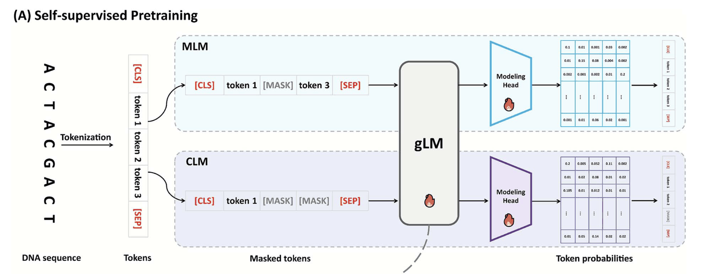
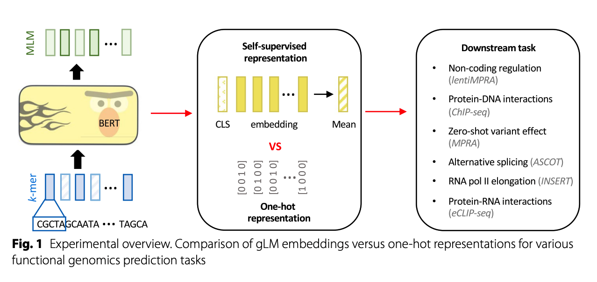
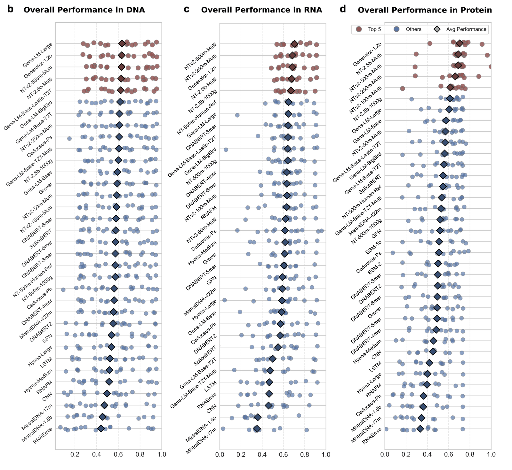

[🏠 Portfolio](https://github.com/heoneyzi) › [📚 Study](../../README.md) › [🧬 Genomics](../README.md) › **Season 1 · Functional Genomics**

# Season 1 · Functional Genomics (Jan – Apr 2026)

The YAI Functional Genomics team's first season: learn the central dogma, get hands-on with CAFA 6, then read the genome-language-model literature together — ending with the question that became GDTR.

| | |
|---|---|
| **Period** | 2026-01-17 (kick-off) → 2026-04 (11th meeting) |
| **Team** | 5 members — 조윤진 (CAFA 6 team lead), 구민선, 박수빈, 정유민, 강지헌 |
| **My role** | Member · CAFA 6: ProtT5 (T5) embedding branch, [dataset walkthrough](https://github.com/heoneyzi/Medical/blob/main/CAFA6/notes/01_dataset.md) and [ideas](https://github.com/heoneyzi/Medical/blob/main/CAFA6/notes/02_ideas.md) · journal club: [week-2 talk](journal_club/02_week2_glm_evaluating.md), [scGeneScope proposal](journal_club/proposals/04_jiheon_scgenescope.md) · [two essays](essays/README.md) · later GDTR co-author |
| **Notes** | 43 in this folder + 3 in 01_Medical/CAFA6 |

## 🗺️ Sections

| | Section | What | Highlight |
|---|---|---|---|
|  | [CAFA 6](cafa6/README.md) | Protein function prediction (Kaggle) (7 notes) | Bronze Medal (team) · my ProtT5 branch + dataset notes |
|  | [Journal club](journal_club/README.md) | Five sessions on genome language models (10 notes) | my week-2 talk on gLM evaluation |
|  | [Paper proposals](journal_club/proposals/README.md) | 11 proposals + a candidate table + a memo (14 notes) | 4 read together |
|  | [Meetings](meetings/README.md) | 11 meetings + midterm report (10 notes) | where DTR/GDTR first came up |
|  | [Essays](essays/README.md) | My own takes (2 notes) | inductive bias in gLMs · YAICON directions |

## 💡 What the season concluded

- **Protein first was the right warm-up.** CAFA 6 forced the team through a full bio-ML pipeline (sequences, ontology labels, IA-weighted F-max) in about two weeks ([CAFA 6](cafa6/README.md)).
- **gLM embeddings are not a free lunch.** On cell-type-specific regulatory tasks, probing pre-trained gLMs rarely beat one-hot CNNs trained from scratch ([week 2](journal_club/02_week2_glm_evaluating.md), [discussion](meetings/08_meeting07_jc2_2026-02-18.md)).
- **Scale vs priors is not either/or.** Evo 2 re-introduces priors (up-weighting genic regions, down-weighting repeats); the team debated this in the [11th meeting](meetings/10_meeting11_2026-04-05.md) and in my [essay](essays/01_inductive_bias_in_glms.md).
- **Next step: look inside the model.** Tracking how Evo 2's layer-wise predictions settle became the YAICON project and [GDTR](https://github.com/heoneyzi/Paper/blob/main/GDTR/README.md) ([directions note](essays/02_yaicon_direction_gdtr.md)).

---
[← Primer](../00_primer/README.md) · [🧬 Genomics](../README.md) · [Season 2 →](../season2_functional_genomics_2/README.md)
