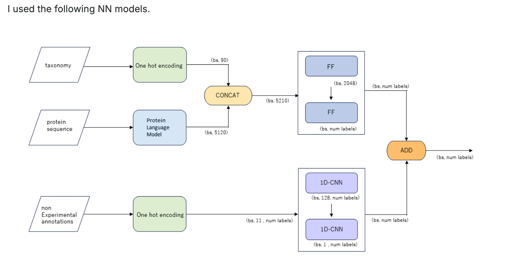

# 프로젝트 방향성 — project direction

[🏠 Portfolio](https://github.com/heoneyzi) › [📚 Study](../../../README.md) › [🧬 Genomics](../../README.md) › [Season 1 · Functional Genomics](../README.md) › [CAFA 6](README.md)

> ✍️ **조윤진 (teammate)** · 📅 ≈ 2026-01 (kick-off) · 🗂️ Source: Notion — *Functional Genomics › 개인 아카이브*

> [!NOTE]
> 🤖 The two collapsible reading lists (*Background 논문/사이트*, *모델 계열별로 정리*) are **ChatGPT answers pasted for reference** (their links carried `utm_source=chatgpt.com`, stripped here).

---

#### 1. Target challenge

- 📄 [Challenge](02_challenge_candidates.md)

#### 2. 윤진 제안 :

1. 이거 registration하고, 죽이되든 밥이되든 제출해보는 것 어떰? (기한 - team merge 1/26, model submission 2/2) [CAFA 6 Protein Function Prediction](https://www.kaggle.com/competitions/cafa-6-protein-function-prediction/discussion/612014)
    1. 보면 GO(gene ontology)랑 아미노산 서열로 protein function 예측하는 거라, 여기의 데이터 다뤄보는 것 자체가 공부일듯.
    2. CAFA5는 순위높은 사람들 solution도 공개되어 있어서 그거 공부해도 좋을듯
        1. ex. [https://www.kaggle.com/competitions/cafa-5-protein-function-prediction/writeups/tito-3rd-place-solution-for-the-cafa-5-protein-fun](https://www.kaggle.com/competitions/cafa-5-protein-function-prediction/writeups/tito-3rd-place-solution-for-the-cafa-5-protein-fun)

        

    3. 제출하고 쓰거나 쓰면 좋았을 model들 공부하면 전반기 될듯 ?
1. 위 challenge에서 Virtual Cell Challenge 로 처음부터 목표 잡자. 
    1. Background Knowledge
        

        
<b>Backgroud 논문/사이트</b>

        ---

        ### 1) 꼭 알아야 하는 “필수” 논문/리소스 (VCC 직접 대비)

        #### (1) VCC 공식 자료: 데이터·평가·지표 관점 잡기

        - **VCC Evaluation / Datasets (공식)**
            어떤 입력(초기 cell state + perturbation)으로 어떤 출력(perturbed expression)을 맞추는지, 그리고 MAE/DES/PDS가 왜 같이 쓰이는지 먼저 잡아야 함. ([Virtual Cell Challenge](https://virtualcellchallenge.org/evaluation))
        - **Behind the Data of the Virtual Cell Challenge (Arc Institute)**
            “MAE는 평균을 잘 맞추면 생각보다 잘 나올 수 있다” 같은 함정과, DES/PDS가 왜 필요한지(평균회귀 모델이 지는 지점) 설명이 좋아. ([arcinstitute.org](https://arcinstitute.org/news/behind-the-data-virtual-cell-challenge))
        - **VCC 개요/포지션 페이퍼(PDF)**
            챌린지 설계 배경(대략 300개 유전자 KD 등)과 문제 맥락을 한 번에 정리하는 문서. ([bookcafe.yuntsg.com](https://bookcafe.yuntsg.com/ueditor/jsp/upload/file/20250722/1753169716236042750.pdf))

        > 팁: VCC는 “MAE만 낮아도” 상위권이 되기 어렵고, DES/PDS에서 진짜 차별화가 나는 구조로 설계돼 있다는 점을 초반에 못 박고 시작하는 게 좋아. (arcinstitute.org)

        ---

        #### (2) 유전자 perturbation 예측의 대표 SOTA(유전 perturbation 쪽)

        - **GEARS (Nature Biotechnology)**
            지금도 “유전 perturbation(특히 조합 perturbation까지)” 예측 분야에서 가장 자주 기준점으로 쓰이는 축 중 하나야.

            핵심 포인트: *gene-gene 관계(네트워크/사전지식) + perturbation set*을 모델 안에서 어떻게 표현하고, **미관측 perturbation 조합**을 어떻게 일반화하는지. ([Nature](https://www.nature.com/articles/s41587-023-01905-6))

        ---

        #### (3) “벤치마크/비교” 논문: 어디서 성능이 갈리는지 감 잡기

        - **Nature Methods 2025: “딥러닝 유전자 perturbation 예측이 아직 선형 베이스라인을 못 이김” 류의 대형 비교**
            파운데이션(scGPT/scFoundation 등) 포함해, \*“기대만큼 안 되는 이유가 무엇인지”\*를 굉장히 실전적으로 보여줘서 꼭 읽을 가치가 커. ([Nature](https://www.nature.com/articles/s41592-025-02772-6))
        - **Systematic comparison / standardized evaluation 프레임워크(2024–2025 버전)**
            여러 데이터셋·여러 메트릭에서 “어떤 모델은 글로벌 MAE는 좋은데 DE 쪽이 약하고, 어떤 모델은 그 반대” 같은 트레이드오프가 반복해서 나온다는 걸 확인해두면, VCC에서 어떤 방향(예: DE 타겟 강화)을 택할지 빨라져. ([BioRxiv](https://www.biorxiv.org/content/10.1101/2024.12.23.630036v2.full-text))
        - **PerturBench (arXiv 2024)**
            perturbation 예측 모델을 폭넓게 정리/비교하는 벤치마크 흐름 파악에 좋음. ([arXiv](https://arxiv.org/pdf/2408.10609))
        - **PDS 자체의 민감도 분석(2025 arXiv)**
            PDS가 거리(metric)나 스케일에 민감할 수 있다는 점은 “리더보드 최적화”할 때 진짜 중요해(스케일 보정/캘리브레이션 전략이 점수에 영향). ([arXiv](https://arxiv.org/html/2511.16954v1))

        ---

        #### (4) “Perturbation prediction” 커뮤니티 표준 벤치마크

        - **OpenProblems: Perturbation Prediction 트랙(주로 약물 쪽이지만, 평가/프레이밍 참고)** ([Open Problems in Single-Cell Analysis](https://openproblems.bio/results/perturbation_prediction/))
        - **Kaggle Open Problems – Single-Cell Perturbations (PBMC perturbation 데이터로 유명)** ([kaggle.com](https://www.kaggle.com/competitions/open-problems-single-cell-perturbations/data))

        ---

        ### 2) “추가류 application”을 위한 최신 논문: 파운데이션 모델, 적응, RL/능동설계

        여기는 “VCC에서 최신 시도”를 하려면 가치가 큰 축들이야. 다만 최근 벤치마크들이 공통으로 말하는 건: **파운데이션을 ‘그대로’ 쓰면(특히 zero-shot) 생각보다 안 나온다 → ‘어댑터/특화/사전지식 결합’이 관건**이란 흐름이야. ([PMC](https://pmc.ncbi.nlm.nih.gov/articles/PMC12016270/))

        #### (A) 파운데이션 모델을 perturbation 예측에 쓰는 법: “그냥 쓰지 말고, 적응시켜라”

        - **PertAdapt (bioRxiv 2025)**
            “단순 파운데이션 임베딩”이 아니라, **조건(perturbation)을 잘 먹이는 어댑터/어텐션 구조**로 성능을 끌어올리려는 방향. VCC에 바로 가져오기 좋은 아이디어(Condition-sensitive adaptation)들이 있어. ([BioRxiv](https://www.biorxiv.org/content/10.1101/2025.11.21.689655v1.full.pdf))
        - **PertEval-scFM (OpenReview/ICML 2025)**
            - “zero-shot scFM 임베딩이 baseline 대비 별로다”\*를 비교적 정교하게 보여주는 쪽. “왜 파운데이션이 바로 안 먹히는지”를 반례로 갖고 가기 좋고, 실험 설계(어떤 setting에서 이득이 나는지)를 잡는 데 도움 돼. ([OpenReview](https://openreview.net/forum?id=t04D9bkKUq&noteId=cVQ96mwheg))
        - **Zero-shot 평가로 드러난 scFM 한계(Genome Biology 2025)**
            Geneformer/scGPT 같은 모델이 “주장한 것 대비” zero-shot 일반화에서 취약할 수 있음을 체계적으로 보여주는 쪽. VCC에서 <b>OOD(미관측 perturbation/상태)</b>를 다루는 전략을 세울 때 참고가 돼. ([Springer](https://link.springer.com/article/10.1186/s13059-025-03574-x))
        - **(리뷰/정리) single-cell foundation models 리뷰(2025)**
            scGPT 같은 계열이 어떤 토크나이징/마스킹 가정 위에 서 있는지 빠르게 훑기 좋음. ([PMC](https://pmc.ncbi.nlm.nih.gov/articles/PMC12586647/))

        #### (B) “파운데이션 + 그래프/사전지식 결합” (유전자 네트워크를 섞는 방향)

        - **GenoHoption (arXiv 2024)**
            scFM 표현에 **gene network graph**를 섞어서 perturbation prediction을 끌어올리려는 방향. GEARS류(그래프/사전지식 활용)와 파운데이션을 연결하는 브릿지 아이디어로 참고 가치 있음. ([arXiv](https://arxiv.org/abs/2411.06331))

        #### (C) RL / 실험 설계 / “목표 상태로 유도하는 perturbation 찾기”

        - **RL로 single-cell foundation model 기반 perturbation 최적화/설계( bioRxiv 2025-12 )**
            “예측”을 넘어서 **어떤 perturbation을 하면 원하는 상태로 가나**를 RL로 찾는 흐름. VCC의 본 제출은 예측이지만, *후속 응용/논문화*로 확장하기 좋다. ([BioRxiv](https://www.biorxiv.org/content/10.64898/2025.12.09.693267v1.full.pdf))
        - **원하는 상태를 만드는 최적 perturbation을 찾는 프레임( Cell Systems 2025 )**
            perturbation→state control 관점에서, 예측모델을 “inverse design”로 쓰는 형태. ([Cell](https://www.cell.com/cell-systems/fulltext/S2405-4712%2825%2900238-8?rss=yes))

        #### (D) 최신 방법 아카이브(업데이트 추적용)

        - **awesome-foundation-model-single-cell-papers (GitHub 리스트)**
            2025년 논문들이 계속 추가되는 인덱스라서, “최신 파운데이션/벤치마크/적응 기법” 추적용으로 유용. ([GitHub](https://github.com/OmicsML/awesome-foundation-model-single-cell-papers))

        ---

        ### VCC 대비용 “권장 독서 순서” (최소 비용으로 감 잡기)

        1. **VCC evaluation + Behind the Data**로 MAE/DES/PDS 감각 잡기 ([Virtual Cell Challenge](https://virtualcellchallenge.org/evaluation))
        2. **GEARS**로 유전 perturbation 예측의 정석 구조 파악 ([Nature](https://www.nature.com/articles/s41587-023-01905-6))
        3. **Nature Methods 2025 / Csendes 2025**로 “파운데이션이 왜 바로 안 되는지” 현실 인지 ([Nature](https://www.nature.com/articles/s41592-025-02772-6))
        4. <b>PertAdapt + (그래프 결합류)</b>로 “최신 시도(어댑터/사전지식 결합)” 방향 설정 ([BioRxiv](https://www.biorxiv.org/content/10.1101/2025.11.21.689655v1.full.pdf))
        5. (응용 확장) **RL/optimal perturbation**으로 논문화 가능한 추가 기여 포인트 마련 ([BioRxiv](https://www.biorxiv.org/content/10.64898/2025.12.09.693267v1.full.pdf))

        ---

        

    2. SOTA models
        

        
<b>모델 계열별로 정리</b>

        ---

        ### 1) 유전 perturbation 예측의 대표 축: “unseen perturbation / 조합까지”를 겨냥한 모델들

        #### GEARS (그래프 + 사전지식, 강력한 기준점)

        - **GEARS**: gene–gene interaction network(사전 네트워크) + perturbation 토큰을 결합해서 **single + multi-gene perturbation**을 예측하는 대표 SOTA 라인.
            VCC에서도 “베이스라인+그래프”로 출발할 때 자주 참조되는 타입. ([Nature](https://www.nature.com/articles/s41467-025-59926-5))

        #### scLAMBDA (조합 perturbation + LLM 기반 gene embedding)

        - **scLAMBDA (2024)**: **single + combinatorial multi-gene perturbation**을 다루고, gene embedding을(LLM에서) 가져와서 prior로 쓰는 계열.
            “기저 cell state”와 “perturbation-induced effect”를 분리(disentangle)하려는 설계가 VCC랑 잘 맞아. ([PMC](https://pmc.ncbi.nlm.nih.gov/articles/PMC11643044/))

        #### MORPH (unseen perturbation + 조합/새 컨텍스트까지)

        - **MORPH (2025)**: discrepancy-based VAE + attention으로 **미관측 perturbation/조합/새 cellular context**까지 일반화를 강조.
            attention 덕분에 “어떤 유전자 상호작용이 중요한지” 해석 파이프도 붙이기 쉬움. ([PMC](https://pmc.ncbi.nlm.nih.gov/articles/PMC12236822/))

        #### “Unperturbed program을 분리해서 조합 예측” (ICLR/NeurIPS 스타일 최신 아이디어)

        - **Identifying Unperturbed Cellular Programs… (OpenReview, 2025)**:
            조합 perturbation에서 흔한 실패(효과가 기저 프로그램에 흡수돼 버리는 confounding)를 막기 위해 **unperturbed program vs perturbation effect를 분리**해 SOTA를 주장.

            VCC에서 DES/PDS까지 올리려면 이런 “effect 분리”가 진짜 도움 될 때가 많음. ([OpenReview](https://openreview.net/forum?id=cOJbPwOSLQ))

        ---

        ### 2) 생성모델 계열: VAE/GAN로 “조건부 생성”해서 post-perturb 분포를 맞추는 라인

        #### PerturbNet (raw counts + ZINB likelihood, 예측 안정성)

        - **PerturbNet (2025)**: scRNA-seq **raw counts를 ZINB likelihood로 직접 모델링**하는 VAE 계열.
            “카운트 분포를 제대로 다루면” unseen perturbation 예측이 좋아진다는 메시지가 명확해서, VCC에서도 count-space modeling 할 때 참고 가치 큼. ([PMC](https://pmc.ncbi.nlm.nih.gov/articles/PMC12322087/))

        #### scPreGAN (GAN 기반 perturbation response 예측)

        - **scPreGAN (Bioinformatics, 2022)**: encoder로 “공통 latent”을 뽑고, 조건별 generator로 control/perturbed 분포를 학습해 대응.
            GAN 류를 쓰고 싶다면 가장 정석적인 참조점 중 하나. ([OUP Academic](https://academic.oup.com/bioinformatics/article/38/13/3377/6593485))

        #### scREPA (파운데이션 임베딩을 “정렬”해서 생성모델 강화)

        - **scREPA (2025)**: VAE 기반 생성모델 latent를 **pretrained single-cell foundation model 임베딩과 representation alignment**(cycle-consistent 포함)으로 맞춰서 예측을 끌어올리는 프레임.
            “파운데이션을 그냥 쓰지 말고, 생성모델의 latent를 파운데이션 표현에 맞춰라”라는 VCC에 유용한 아이디어. ([ScienceDirect](https://www.sciencedirect.com/science/article/pii/S1476927125003731))

        ---

        ### 3) “인과/OT(Optimal Transport)” 계열: perturbation effect를 더 ‘엄밀하게’ 분리·추정

        #### CINEMA-OT (causal + OT로 perturbation effect 추정)

        - **CINEMA-OT (Nature Methods, 2023)**: single-cell perturbation 분석을 **인과 프레임**으로 정리하고, OT를 활용해 효과를 추정하는 접근.
            “예측”만이 아니라, **효과를 어떻게 정의/분리할지**를 세우는 데 도움 돼서 VCC에서 DES 설계(어떤 DE를 맞춰야 하는가)에도 간접적으로 좋음. ([Nature](https://www.nature.com/articles/s41592-023-02040-5))

        #### scCausalVI (structural causal model + counterfactual prediction)

        - **scCausalVI (bioRxiv, 2025)**: 구조적 인과모델을 통합해서 **hypothetical perturbation(반사실) 하의 발현을 예측**하는 방향.
            VCC의 “unseen perturbation generalization”을 인과적으로 정식화하고 싶다면 핵심 후보. ([biorxiv.org](https://www.biorxiv.org/content/10.1101/2025.02.02.636136v1.full-text))

        ---

        ### 4) “파운데이션 모델이 실제로 perturbation 예측에서 어떤가?”를 잡아주는 벤치/비판/가이드

        - **Benchmarking foundation cell models for post-perturbation RNA-seq prediction (2025)**:
            scFM(파운데이션)이 perturbation 예측에서 **어디서 잘/못되는지**를 비교해주는 벤치. “그냥 임베딩 쓰면 끝”이 아니라는 걸 실험적으로 보여줌. ([PMC](https://pmc.ncbi.nlm.nih.gov/articles/PMC12016270/))
        - **A Systematic Comparison of Single-Cell Perturbation Response Prediction Methods (2025, bioRxiv v2)**:
            perturbation prediction 방법들을 넓게 비교. VCC 세팅(특히 split 방식)과 비슷한 조건에서 어떤 모델이 강한지 감 잡기 좋음. ([biorxiv.org](https://www.biorxiv.org/content/10.1101/2024.12.23.630036v2.full-text))
        - **Addressing Mode Collapse… (arXiv, 2025)**:
            “평균만 예측해도 점수가 잘 나오는” 현상을 **메트릭/델타 정의의 아티팩트**로 분석. VCC에서 MAE/DES/PDS를 함께 올리려면 이런 함정을 알아야 함. ([arXiv](https://arxiv.org/html/2506.22641v1))

        ---

        ### 5) 한 번에 훑는 큐레이션/리뷰

        - **Single-Cell Perturbation Modeling & Prediction(리스트/가이드, 2016–2025)**: 관련 논문을 카테고리로 잘 모아둔 페이지(입문+레퍼런스 추적용). ([xqiu625.github.io](https://xqiu625.github.io/ai4bio-concepts/single-cell-analysis/perturbation-prediction_modeling.html))
        - **mini-review / CSBJ 2025 perturbation modeling 리뷰**: 약물/유전 perturbation을 포함해 분석 프레임과 방법론을 정리. ([ScienceDirect](https://www.sciencedirect.com/science/article/pii/S2001037024001417))

        ---

        

