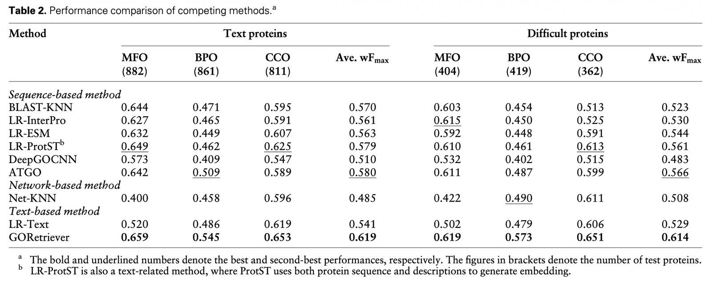
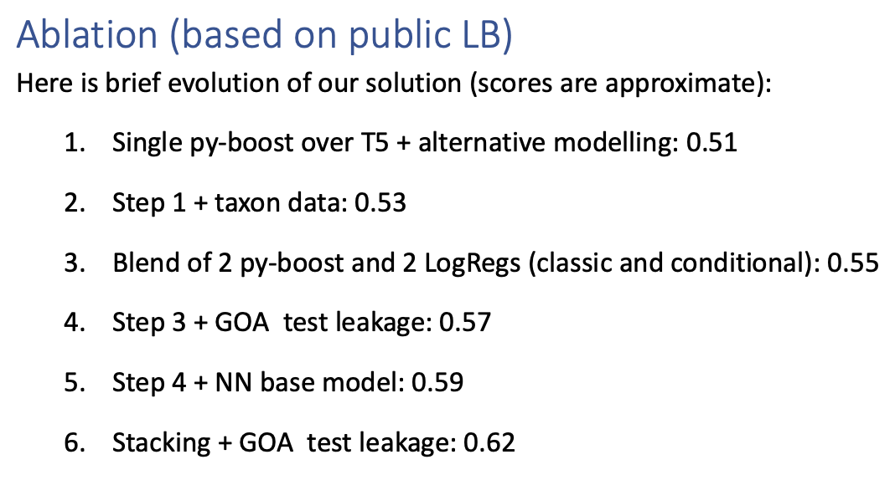

# [유민] CAFA6 첫주 — week-1 survey

[🏠 Portfolio](https://github.com/heoneyzi) › [📚 Study](../../../README.md) › [🧬 Genomics](../../README.md) › [Season 1 · Functional Genomics](../README.md) › [CAFA 6](README.md)

> ✍️ **정유민 (teammate)** · 📅 2026-01-20 → 01-21 (week 1) · 🗂️ Source: Notion — *Functional Genomics › 개인 아카이브*

---

**CAFA6 solutions**

Yusaku씨가 공유한 예측치 [https://www.kaggle.com/datasets/ymuroya47/cafa6-goa-predictions/data](https://www.kaggle.com/datasets/ymuroya47/cafa6-goa-predictions/data)

- Yusaku씨가 공유한 노트북 [https://www.kaggle.com/code/ymuroya47/cafa-6-goa-prott5-ensemble-0-370](https://www.kaggle.com/code/ymuroya47/cafa-6-goa-prott5-ensemble-0-370) (0.370) - 앙상블함, 코드가 제일 깔끔
- 파생1: [https://www.kaggle.com/code/ibrahimqasimi/0-375-biological-function-of-a-protein](https://www.kaggle.com/code/ibrahimqasimi/0-375-biological-function-of-a-protein) (0.375) - 앙상블 비율 조정

올려주신 데이터 = GOA + ProtT5/InterPro

- GOA 온라인에 단백질 각각에 대응되는 정보가 이미 있어서 이걸 우리도 raw를 가져오면 좋을 것 같음. ⇒ 실제 결과 1
- (ESM-2 + classifier head) 로 위의 정보를 맞추는게 가능한지 확인.
    - (knowledge distillation) ⇒ 예측치 1

(윤진) GO term이 포함관계가 있음 - 일반적인 classification ?

- obonet 쓰면 ㄱㅊ

---

**임베딩 공유 (ESM-2, ProtT5, etc.)**

[https://www.kaggle.com/datasets/kaitonmh/cafa-6-embeddings/data](https://www.kaggle.com/datasets/kaitonmh/cafa-6-embeddings/data)

[https://www.kaggle.com/code/kaitonmh/goa-negative-propagation](https://www.kaggle.com/code/kaitonmh/goa-negative-propagation)

↳ pLM 임베딩 공유한 사람이 올린 코드인데, NOT 태그에 집중

GOA 자체를 공유한 사람도 있음 - 근데 온라인에서 다운 가능

[https://www.kaggle.com/datasets/kaitonmh/protein-go-annotations](https://www.kaggle.com/datasets/kaitonmh/protein-go-annotations)

---

### Notes on Jan 21

1st place: text +

- pLM embeddings: mean pooling
- GORetriever랑

2nd place solution: GCN based refinement

