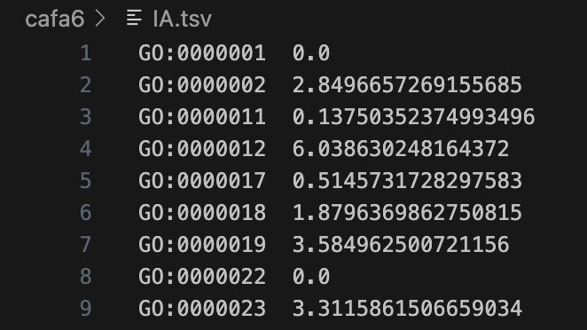
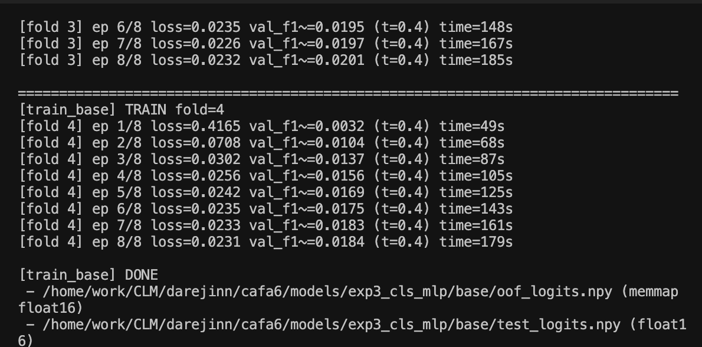
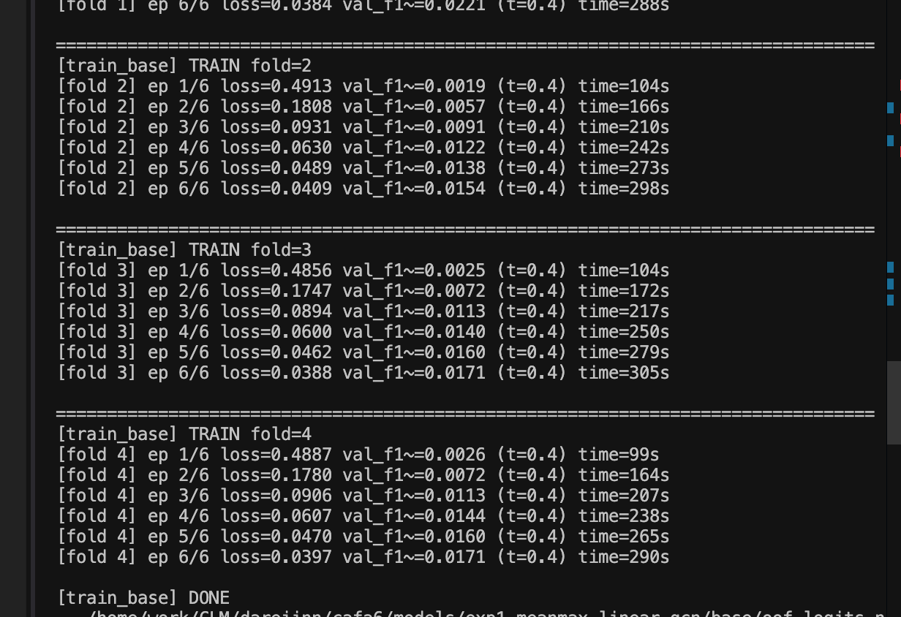

# [윤진] 코드 1차 시도 — first code attempt

[🏠 Portfolio](https://github.com/heoneyzi) › [📚 Study](../../../README.md) › [🧬 Genomics](../../README.md) › [Season 1 · Functional Genomics](../README.md) › [CAFA 6](README.md)

> ✍️ **조윤진 (teammate)** · 📅 2026-01 (weeks 2–3) · 🗂️ Source: Notion — *Functional Genomics › 개인 아카이브*
>
> A link to a private ChatGPT conversation was removed.

---

#### 참조 코드

1. **CAFA6 GOA + ProtT5 IC-Aware Pruning**
    [https://www.kaggle.com/code/maryamkhaled67/cafa6-goa-prott5-ic-aware](https://www.kaggle.com/code/maryamkhaled67/cafa6-goa-prott5-ic-aware)

#### IDEA

1. 일단 (1) protein LLM, (2) gene ontology layer는 둘 다 써야 할듯
2. protein LLM의 임베딩을 어떻게 합치느냐가 중요한데, 기존 CAFA 5 3rd 에서는 1dCNN, CAFA 5 2nd에서는 mean pooling 후 GCN 씀. 근데 참조코드1에 따르면, GCN은 이번 CAFA6에서는 별로 안좋은듯(일단 한번 따라해보긴 할 예정)
3. 1D CNN은 kernel(weight)을 공유하는데, 다른 source 간 GO를 합산하는 기준이 같으면 안된다고 봄. 어떻게 합칠 것인가… 에서
    1. LLM 임베딩끼리는 이런 방법은 어떨까?
        *(ChatGPT 대화 공유 링크 — 공개본에서 생략)*
4. IA의 반영
    

    
<b>IA</b>

    CAFA에서 IA.tsv의 IA는 보통 “Information Accretion(정보 누적량)”을 뜻해요. 쉽게 말해:

    - **GO term(기능 용어)** 하나가 얼마나 *구체적이고 정보량이 큰지*를 점수로 만든 것
    - **더 일반적인(term가 흔하고 상위 개념)** → IA가 낮음
    - **더 구체적인(term가 드물고 하위 개념)** → IA가 높음

    

    

#### Implementation

- 📄 [Method](06_yoonjin_method.md)

1. ESM-C embedding + Linear layer
    1. (mean pooling)
    2. (mean pooling), (max pooling) concat
    3. CLS token

    GCN을 안쓰고 그냥 얻은 token MLP 써서 BCE 구했더니 아래처럼 나옴. 1) CLS

    

    2)mean pooling

    

