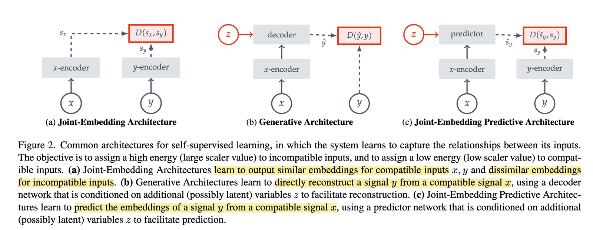

# [수빈] CAFA6 시도 — JEPA label representations

[🏠 Portfolio](https://github.com/heoneyzi) › [📚 Study](../../../README.md) › [🧬 Genomics](../../README.md) › [Season 1 · Functional Genomics](../README.md) › [CAFA 6](README.md)

> ✍️ **박수빈 (teammate)** · 📅 ≈ 2026-02-02 (final submission) · 🗂️ Source: Notion — *Functional Genomics › 개인 아카이브*

---

### Introduction

Gene Ontology Prediction Task에서 Vector Representation을 바탕으로 예측하는 접근이 많았음.

→ 다양한 Representation Learning 기법을 적용해보자

→ 최근에 다양한 Task에서 Promising한 성능을 제공하는 JEPA를 도입

### Method

> 자세한 건 아래 코드 링크 참조
> [GitHub - SOL1archive/CAFA6](https://github.com/SOL1archive/CAFA6)

I-JEPA에서 가져온 이미지. 요약하자면, MAE와 같이 Pixel Space (다른 Domain이라면 Target Data Space) 대신 상대적으로 Low Dimension인 Representation Space에서 예측을 하여 안정성과 성능을 챙김.

JEPA 방식으로 Label Representation Learning 후 예측함.

### Experiments

사실상 첫 제출이라 잠재력이 있는지 없는지 알기가 어려움

이미 공개된, 높은 성능의 Evaluation 결과를 그대로 제출한 팀들이 중상위권 대부분을 차지한 상황이라 좀 더 시도해볼 기회가 있었으면 좋았을 듯 ㅠㅠ
