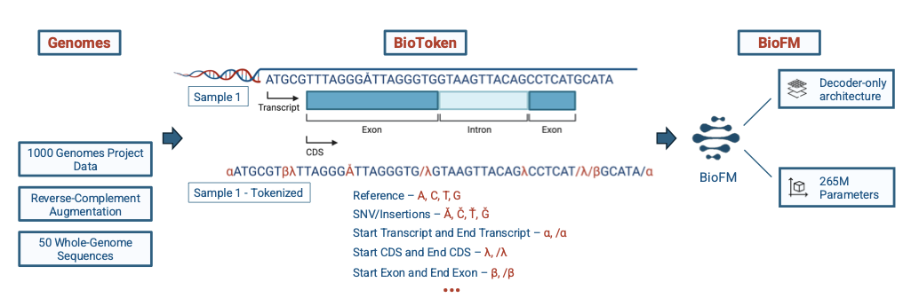
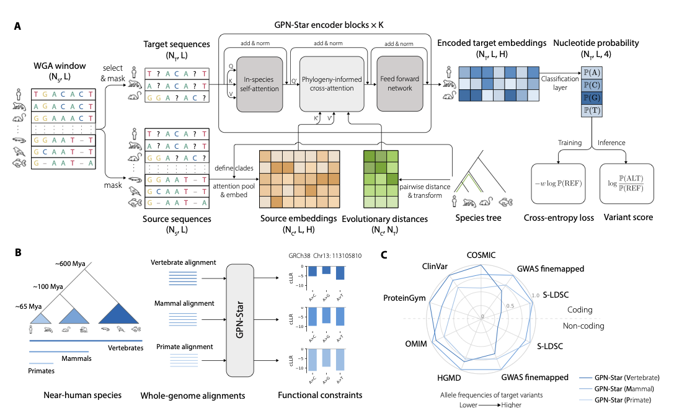

# 과연 Inductive Bias를 줄이는 것이 gLM에게 현명한 선택일까?

[🏠 Portfolio](https://github.com/heoneyzi) › [📚 Study](../../../README.md) › [🧬 Genomics](../../README.md) › [Season 1 · Functional Genomics](../README.md) › [Essays](README.md)

> ✍️ **강지헌 (me)** · 📅 spring 2026 (season 1) · 🗂️ Source: Notion — *Functional Genomics › 개인 아카이브*
>
> 🔁 Duplicate in Notion, not reproduced: *Genomics (1) › 과연 Inductive Bias를 줄이는 것이…* (identical).
>
> Two lines tagged *GPT 피셜* in the original are AI-sourced claims; they are kept with that tag.

---

## Inductive Bias In gLM?

Richard Sutton “The Bitter Lesson”이 얼마나 통할 것인가?

### Genome VS Language

> - 무의미한 Sequence의 존재 ← Noncoding Region
> - 거대하고 복잡한 규칙과 기능적 요소 ← 수십억 년의 진화 결과물

### Timeline

지금까지의 gLM은 어떻게 변화해 왔을까?

#### 1세대

##### DNABERT

> 💡 인간 참조 게놈(GRCh38, \~3B bp) 단일 종 데이터 → 강한 종 특이적 Prior
>
> 6-mer 오버래핑 토크나이저 → 연속된 염기 조합이 생물학적 의미를 내포한다는 Prior, 오버래핑까지 한다는 건 context보다도 6-mer 토큰 자체에 더 집중한다고 볼 수 있지 않을까?
>
> BERT식 Masking

DNABERT는 모델 크기는 110M 파라미터(BERT-base 구조), 컨텍스트 길이 512 bp로 제한적

##### Nucleotide Transformer

> 💡 3,202개 다양한 인간 게놈과 850개 타 종 게놈을 포함해 500M\~2.5B 파라미터 규모로 확장했으며, multi-species 데이터를 처음 도입

DNABERT → NT : 구조적인 차이보다, 데이터의 양과 다양성에 영향을 받음. Scailing의 효과

#### 2세대

##### DNABERT-2

> 💡 BERT 구조에 BPE(Byte Pair Encoding)와 FlashAttention 도입
>
> Multi-species에 대한 학습
>
> BPE(Byte Pair Encoding) ← k-mer보다 약한 prior이지만 '자주 등장하는 염기 조합이 의미 단위'라는 빈도 기반 귀납 편향을 내포한다 .
>
> 136종 Genome Data ← 다종(multi-species) 데이터는 '진화적으로 보존된 서열이 기능적으로 중요하다'는 phylogeny 신호를 암묵적으로 제공

DNABERT-2는 6-mer를 BPE(Byte Pair Encoding)로 교체해 21배 파라미터 절감·92배 GPU 시간 절감을 달성했고, 136종 게놈 다종 데이터를 학습했다 .

##### HyenaDNA

> - Hyena Hierarchy (Long Convolution 기반)
>
> → 단일 염기(Single Nucleotide) 해상도로 무려 **100만 bp(1Mb)** 이상의 컨텍스트를 볼 수 있게 됨
>
> - 인간 참조 Genome 학습
> - 단일 뉴클레오타이드 토크나이저는 'less inductive bias' 원칙에 가장 충실하다←개별 SNP 수준의 변이를 직접 모델링 가능
> - CLM(Causal/Autoregressive)
> - Hyena convolution operator ← 'k 거리 이내의 염기만 상호작용한다'는 locality를 완화하지만, 여전히 convolution의 translation-equivariance bias를 가짐
>
> 데이터 규모는 DNABERT \~3B nt → HyenaDNA 인간 게놈 단독(\~3.2B) 유지지만 컨텍스트 활용도가 500배 증가

#### 3세대

##### Caduceus

> - Bi-Mamba (SSM)
> - 인간 및 다종 Genome
> - MLM
> - 뉴클레오타이드 토크나이저 + 인간 참조 게놈 사전학습으로 컨텍스트 160kb
> - MambaDNA 블록 ← Mamba SSM에 양방향성(BiMamba)과 역상보(RC-equivariance) 등변성을 명시적으로 부여 = 두 가닥은 생물학적으로 동등한 정보를 담고 있다'는 가장 명시적인 생물학적 prior의 아키텍처 내재화

##### Evo-1

> - prokaryote-only 학습 ← Prokaryotic genome이 central dogma를 단순하게 표현한다는 데이터 선택 bias
> - StripedHyena (Attention과 Hyena의 하이브리드)
> - CLM으로 학습
> - StripedHyena 하이브리드 ← 지역 패턴은 conv로, 전역 의존성은 attention으로 = 계층적 prior 완화
> - 단백질·RNA·DNA 기능 예측을 zero-shot으로 수행

#### 4세대

##### Evo-2

> - 데이터 규모에서 Evo-1의 300B nt 대비 약 31배 증가한 9.3T 다양한 종의 뉴클레오타이드를 사용
> - SE(Short-Exp) → MR(Mid-Range) → LI(Long-range Implicit)의 3종 Hyena operator ← bias 감소 방향
> - Pretraining 단계에서 genic region(유전자 본체·프로모터·인핸서)의 서열 비율을 전장 게놈 기준 자연 분포보다 인위적으로 높게 설정했다. ← 기능 서열이 반복·비기능 서열보다 학습 가치가 높다는 생물학적 판단을 데이터 샘플링 수준에서 강제 or 지역 모티프를 먼저 학습하고 장거리 의존성은 나중에 학습해야 한다
> - Modified cross-entropy loss에서 반복 서열에 0.1의 낮은 가중치를 부여 ← satellite DNA의 정확한 반복 예측은 모델 능력 향상에 기여하지 않는다는 명시적 prior

### 느낀점

##### 효율성이 매우매우 중요

모델의 발전과정에서 가장 중요한 관점 중 하나는 염기의 해상도와 입력 컨텍스트의 길이 ← 아직까지 Scailing의 단계에서 못 벗어난 것 같음

1번 염색체 하나만 해도 약 2억 5천만 bp → 필연적으로 복잡도를 줄이는 과정이 중요해짐 → 파이프라인의 효율성도 매우매우 중요함

##### Tokenization 방법

위의 얘기와 이어지는데, 결국 Bias를 줄이면서 염기의 해상도를 높이는 방향으로 가는 중!

현실적인 자원이 발목을 잡았다면, 그걸 점차 이겨내면서 결국 근래에는 거의 단일 뉴클레오타이드 토크나이저를 사용하는 것 같음

##### 파이프라인 & 학습

비슷하게, 사용할 수 있는 효율적인 파이프라인 속에서 Inductive Bias를 줄이려는 모습을 볼 수 있음 (Evo-1 →2)

하지만 결국 다양한 방법으로 Inductive Bias를 넣어야 데이터를 가장 유의미하게 잘 사용할 수 있다는 것을 볼 수 있음 ← 이건 현재의 수준이 그렇기 때문인 것이 아닐까? 점차 나아질수도

### 다양한 연구

#### Evaluating gLM

저널2 내용

#### Genomic Foundationless Models

[www.biorxiv.org](https://www.biorxiv.org/content/10.1101/2024.12.18.628606v3.full.pdf)

7개 GFM을 52개 task에서 평가했을 때 무작위 초기화 모델이 사전학습 모델을 동등하거나 능가하는 경우가 빈번함을 보였음

gLM의 사전학습이 NLP에서처럼 강력한 일반 표현을 학습하지 못하고 있음을 시사하며,  단순히 ***더 많은 데이터 + 더 큰 모델***이 충분하지 않음을 보여주는 사례

#### Genomic Touchstone 벤치마크

[www.biorxiv.org](https://www.biorxiv.org/content/10.1101/2025.06.25.661622v1.full.pdf)

다양화된 벤치마크.

모델 크기 증가가 항상 성능 향상으로 이어지지 않음을 확인

#### BioToken/BioFM

[www.biorxiv.org](https://www.biorxiv.org/content/10.1101/2025.03.27.645711v2.full.pdf)

**토크나이징도 굉장히 중요하다!!**

단일 염기(Evo-2 방식)보다는 효율적이고, 기존 BPE보다는 생물학적 정보 손실이 훨씬 적은 스윗 스팟을 찾아내기 → 효율성 증가를 위한 노력 → 더 많고 긴 데이터를 다룰 수 있게 됨.

게놈 변이(SNP)와 기능적 영역 주석을 토크나이저에 직접 인코딩하여(메타데이터와 결합하기) 훨씬 적은 파라미터로 SOTA 성능을 달성

**LucaOne(**[https://www.nature.com/articles/s42256-025-01044-4](https://www.nature.com/articles/s42256-025-01044-4))과 같은 통합 핵산-단백질 모델은 DNA/RNA/단백질을 단일 표현 공간에서 공동 학습함으로써 central dogma의 연속성을 모델에 반영

토크나이저에 인코딩하는 것이 265M 파라미터로 7B 파라미터 모델들과 경쟁적이거나 우월한 성능을 달성할 수 있음을 보임

#### GPN-Star(phylogeny-aware gLM)

[www.biorxiv.org](https://www.biorxiv.org/content/10.1101/2025.09.21.677619v1.full.pdf)

학습 과정에서 계통수(Phylogenetic Tree) 정보를 직접 주입해서 어떤 종들이 유전적으로 가깝고 먼지를 모델이 인지한 상태에서 서열의 변화를 관찰

전체 genome alignment와 species tree를 직접 아키텍처에 통합하는 phylogeny-aware gLM

phylogeny-aware 아키텍처로 variant effect prediction SOTA를 달성

#### **유전체 매니폴드 가설(Genomic Manifold Hypothesis)**

[www.biorxiv.org](https://www.biorxiv.org/content/10.1101/2025.01.30.635558v2.full.pdf)

가설: NLP에서 처음 나온 가설로써 전체 데이터는 겉보기에는 엄청나게 복잡하고 고차원이지만, 실제로는 훨씬 단순한 저차원의 구조(매니폴드) 위에 놓여 있다

GenomeOcean과 EVO-2의 임베딩 공간이 강한 선형 상관관계를 보임을 확인했으며, 이는 두 모델이 서로 다른 경로를 통해 게놈의 보편적인 물리화학적·진화적 제약 조건을 동일하게 학습했음을 시사  → 결국 다양한 모델이 비슷한 방향으로 학습하고 있다.

이러한 현상은 NLP 모델들이 규모가 커짐에 따라 보편적인 표현으로 수렴하는 것과 궤를 같이하며, 유전체학에서도 '충분한 규모'의 학습이 이루어지면 데이터 속에 숨겨진 근본적인 생물학적 질서가 드러난다는 쓴 교훈의 강력한 증거가 된다?? → GPT 피셜

근데 내 생각에는 현재 gLM들이 모두 Bottleneck에 있기 때문인거 아닐까? 단순히 저차원에 매핑만 가능했기 때문일 수도 있겠다는 나의 생각

#### decode-gLM

[www.biorxiv.org](https://www.biorxiv.org/content/10.1101/2025.10.31.685860v1.full.pdf)

SAE로 gLM이 자연 발견한 생물학적 특징을 추출

gLM의 은닉 표현에서 100개 이상의 다양한 기능적 주석이 자동으로 인코딩됨을 발견

그럼에도 gLM에 많은 내용이 내포되어 있다 → 발전 가능성을 시사

### 앞으로의 방향성

- DNA 시퀀스 데이터가 더 많이 들어갈 수 있을까? → 싱글 셀(Single-cell) 데이터가 들어갈 수 있지 않을까?
- 유전자 구조 데이터, 단일 세포 전사체 데이터, 단백질 데이터 등을 통합적으로 처리하는 멀티모달 구조를 취하지 않을까? → 더 많은 데이터와 인과관계를 학습할 수 있는 하나의 모델로 발전할 가능성

*Evo2HiC와 같이 gLM을 3차원 유전체 분석에 이식하려는 시도가 성공을 거두고 있으며, 이는 선형 서열 속에 숨겨진 공간적 제약 조건을 모델이 직접 이해하게 함으로써 더욱 강력한 예측 능력을 제공할 것 ← GPT 피셜*

- 점차 고도화된 학습 방법이 등장하지 않을까? → 더 많은 Inductive Bias, 마치 Evo-2처럼
- '어떤 서열이 진화적으로 보존되어 있는가'는 기능적 중요성의 강력한 proxy이며, 이를 학습 목적 함수나 아키텍처에 인코딩하는 것은 필수적이고 정당화된 방식이라고 생각함
