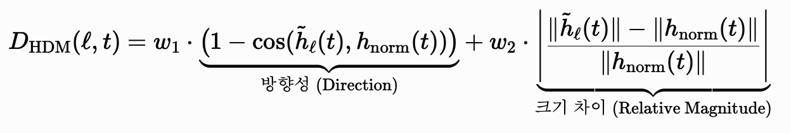

# 야이콘 방향성 — YAICON directions (gDTR · ΔH)

[🏠 Portfolio](https://github.com/heoneyzi) › [📚 Study](../../../README.md) › [🧬 Genomics](../../README.md) › [Season 1 · Functional Genomics](../README.md) › [Essays](README.md)

> ✍️ **강지헌 (me)** · 📅 undated (after the YAICON experiments) · 🗂️ Source: Notion — *Genomics › Genomics (1) — personal notes folder*

---

#### Task1. gDTR

핵심 아이디어: DTR의 레이어별 변화량을 통한 해석이 유의미할까? → 유의미했다.

- C(t)의 사용이 과연 합리적인 것일까?
    - 사실상 코사인 유사도의 차이가 특정 시점의 아래가 될 때를 C(t)로 잡는 것인데, 너무 aggressive하지는 않는가?
        - C(t)의 차이가 가지는 정확한 의미 도출
            - DTR의 핵심 아이디어와 가장 유사한 방법론
            - 빨리 Settle → 적게 생각해도 된다? = 모델이 쉽게 잡아낸다?
                - 사실 아니었음 (실험2) → 그래서 좀 더 유의미한? 직접적인? 결과로 이어질 수 있어야한다 생각함
        - 다른 데이터셋에 대해서도, 다른 모델에 대해서도 적용해볼 필요성
        - 그리고 이를 어떻게 활용할 수 있을까?
            - Hallucination을 잡아낼 수 있을까? Contrast Decoding처럼 사용하기?
- 전체 dim에 대한 cos 차이를 이용한 실험
    - C(t)가 레이어별 해석이었다면, 전체 레이어에서 변화량 분석은 좀 더 자세하면서 많은 내용이 들어간다고 느껴짐 → 할 게 더 많다?
    - 지금의 내용도 유의미한 실험 결과가 나왔다고 생각함. → 하지만 세부적인 혹은 추가적인 실험으로 더 자세한 의미 분석이 가능할 수도 있을 것 같음.
- 다양한 모델에 대한 분석
    - 현재 사용한 모델 외에도 비교할 수 있을까?
        - 이를 모델의 구조나 학습 방법에 대해서 분석하기
- 해석 패러다임 발전 방향성
    - 모델마다 layer별 특성을 사용할 수 있다는 점은 새로운 관점
    - Settled Layer에 대한 추가적인 연구 방향성
    - cos 차이를 사용한 레이어별 변화를 해석하고, 다른 패러다임과의 병합 방법

#### Task2. delta H

핵심 아이디어: gLM이 중요하게 여기는 레이어와 실제로 특징이 잘 살아남은 레이어는 같을까? → 다르다.

사실상 추가적인 방향성이라고 해도, Limitation에 적은 내용이 사실 거의 맞다고 생각이 듦.

- 기존의 NLP에서 사용하는 방법론을 적극적으로 활용하되, genome 분야에 적용을 위해서 변화를 줌
    - L2 Norm 사용하기 → 가장 minimal하면서 genome에 오히려 특화되었다고 생각함
    - 그러나 L2 Norm 사용이 가장 최적의 방법일까?
        - 단순 스칼라 값이라서 최선인지에 대한 의문점이 생김
    - Linear Regression을 사용하는 방법 → Minimal한 단단한 방법이라고 생각함
        - 하지만 비선형적인 특징을 무시해도 될까에 대한 의문점
        - 특히나 하나의 레이어만 빼고 사용하는 Load-bearing layer에서는 더 크게 작용될 수 있다는 생각? → 물론 Representative layer과 비교를 위해 Linear Regression을 사용한 점은 실험으로써는 타당하다고 생각함.
- Hyena VS Evo-2
    - 비슷한 하이에나 블럭을 사용하는 모델을 비교하는 방식이라 좋았음
        - 다른 데이터셋에서도 해볼 필요성
    - 다른 모델들에 대해서도 해볼 필요가 있지 않을까?
        - 그리고 각 모델에서 다른 이유도 찾아봐야할 듯 → 추가적인 실험 필요
        - MLM VS CLM ?
- 레이어의 가중치가 다르다는 점을 어떻게 사용할까?
    - Min pooling 대신 가중치를 준 Pooling 방법을 사용하기?
        - 다른 방법도 있을까?
    - 다른 데이터셋에서도 모델마다 비슷한 결과가 나올까? → gDTR에 의하면 아닐 거 같긴 함 ㅎ
- 해석 패러다임 발전 방향성
    - 모델마다 layer별 특성을 사용할 수 있다는 점은 새로운 관점
    - Load-bearing layer + SAE 등으로 사용할 수 있지 않을까?
        - **Feature-level representative**: SAE latent 중 single-feature AUROC가 가장 높은 latent
        - **Feature-level load-bearing**: SAE latent를 joint classifier에 넣고 가장 drop 큰 latent
        - Evo 2 SAE가 이미 발견한 특징과 비교해봐도 좋을 것 같음!!
    - Steering과 같은 방향성으로 Layer 세부 조사
        - 오히려 적은 자원으로 사용할 수 있는 유용한 방안일지도?

gDTR에 대한 메트릭 생각

- 제대로 settle 되는지 확인하는 방법
    - peak에 대한 점의 제거 이후 보기?? 혹은 특정 모델마다의 경향성 확인이 가능할까? 데이터셋마다 다를 수 있나?
- Superposition 해결 ⇒ 방향성 + 크기 사용하기
    - 단순하게 방향이 맞다고 해서 settle 되었다고 보기 어려울까
    - 둘을 합치던지 2step으로 하던지.
        

    -
