# [저널클럽 1주차] GLM survey

<sub>[🏠 Portfolio](https://github.com/heoneyzi) › [📚 Study](../../../README.md) › [🧬 Genomics](../../README.md) › [Season 1 · Functional Genomics](../README.md) › [Journal club](README.md)</sub>

> ✍️ **조윤진 (teammate)** · 📅 week 1 · session 2026-02-15 · 🗂️ Source: Notion — *Functional Genomics › 개인 아카이브*

---

## Genome Language Models in Bioinformatics: 종합 서베이

### 1. Introduction

#### 1.1 배경 및 동기

지난 10년간 genomics 분야는 deep learning 기술의 발전으로 혁신적인 진보를 이루었다. DeepSEA, Borzoi 같은 모델들이 variant effect prediction, epigenetic trajectory modeling, single-cell omics analysis 등에서 높은 성능을 보였다.

그러나 여전히 중요한 한계들이 존재한다:

- 인간 genome의 약 2%만이 단백질을 encoding하며, 나머지 98%의 non-coding regulatory elements의 기능적 grammar는 대부분 알려지지 않음
- Regulatory elements는 long-range interactions에 관여하며, 이는 multiscale 3D chromatin architecture에 의해 영향을 받음
- 기존 deep learning 모델들은 이러한 distant interactions를 포착하는 데 한계가 있음

#### 1.2 Large Language Models의 영향

NLP 분야의 LLM들(BERT, GPT 등)은 복잡한 semantics, contextual dependencies, long-range interactions를 모델링하는 데 탁월한 능력을 보였다. 이는 bioinformatics, 특히 protein structure prediction(AlphaFold)에서 paradigm shift를 가져왔다.

#### 1.3 Genome Language Models의 등장

gLMs는 DNA와 RNA sequences를 biological "texts"로 개념화하여:

- Long-range dependencies와 hierarchical context를 포착
- DNABERT, Nucleotide Transformer(NT) 같은 선구적 모델들이 regulatory region classification, functional annotation, variant effect prediction 등에서 significant improvements 달성
- Genomics와 transcriptomics 모두에서 활용 가능

#### 1.4 핵심 질문들

이 review는 다음 네 가지 fundamental questions에 초점을 맞춤:

1. **Why**: gLMs가 왜 필요한가?
2. **How to design**: Tokenization strategies와 model architectures는 어떻게 설계해야 하는가?
3. **How to pretrain**: Pretraining practices와 dataset selection은 어떻게 해야 하는가?
4. **How to evaluate**: 어떻게 평가하고 benchmark해야 하는가?

---

### 2. Why Genome Language Models?

#### 2.1 기존 Deep Learning 모델의 한계

**CNNs와 RNNs의 문제점:**

- Vision과 short-text tasks를 위해 개발되어 genomics에 최적화되지 않음
- Limited receptive fields 또는 recurrent memory로 인해 long-range dependencies(예: distal enhancers와 target promoters 간 상호작용) 모델링 어려움
- Handcrafted filters나 shallow motif detectors에 의존하여 motif presence는 포착하지만 regulatory context나 functional semantics는 포착하지 못함
- Sequencing costs 감소와 reference databases의 확장(trillions of bases)에 따라 task-specific models와 manually designed features는 점점 부적합해짐

#### 2.2 gLMs의 해결책

**세 가지 주요 개선 방향:**

1. **Modern Architectures**
    - Transformer, Hyena, Mamba 등 활용
    - Recurrence와 local convolution 제거
    - Megabase-scale sequences에서 local과 long-range dependencies 모두 포착
2. **Self-supervised Pretraining**
    - Labeled examples에 의존하지 않음
    - Masked token prediction, next token prediction 등의 objectives 사용
    - Raw sequences로부터 직접 rich, context-aware representations 추출
    - Regulatory syntax, motif structure, functional consequences 포착
    - 모든 unlabeled nucleotide를 training signal로 활용
3. **Large-scale Data Integration**
    - Entire pangenomes 수용 가능
    - Tasks와 species 간 knowledge transfer

#### 2.3 Impact

gLMs는 genomics와 transcriptomics 모두에서 transformative shift를 대표:

- Unlabeled data로부터 general-purpose representations 학습
- Diverse downstream tasks에 적응 가능
- Functional annotation, variant effect prediction, regulatory element discovery를 위한 scalable, flexible foundation 제공
- Disease variant interpretation, synthetic biology, precision medicine, evolutionary studies 등에 broad implications

<p align="center">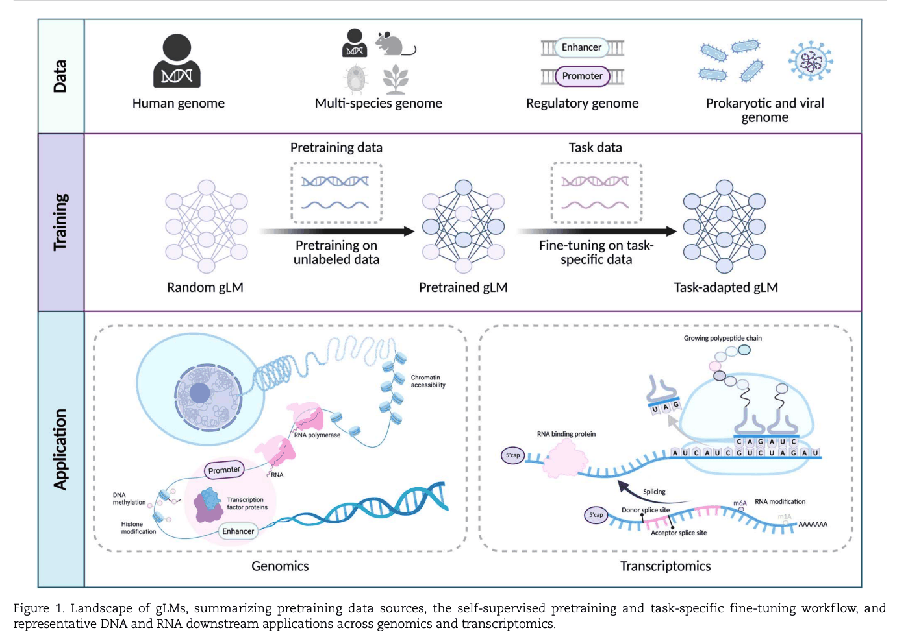</p>

---

### 3. Model Architectures and Tokenization Strategies

#### 3.1 Model Architectures

gLMs는 design paradigm에 따라 네 가지 유형으로 분류됨:

#### 3.1.1 Transformer Encoder Architectures

**특징:**

- Bidirectional self-attention 활용
- 각 position이 upstream과 downstream context를 동시에 attend
- Context integration이 중요한 classification tasks에 적합

**대표 모델:**

- **NT**: Billions of parameters로 scale, multi-kilobase inputs 처리, robust genomic predictors 생성
- **DNABERT-2**: Multi-species genomes에서 pretrain, 적은 parameters로 state-of-the-art accuracy

#### 3.1.2 Transformer Decoder Architectures

**특징:**

- Unidirectional Transformer design
- Generative tasks에 자연스럽게 적합 (realistic genomic sequences 생성, sequence gaps 채우기)
- Long-range dependencies 처리에 challenge (standard decoders는 few thousand tokens로 제한)
- Hierarchical/multiscale mechanisms 도입으로 receptive field 확장

**대표 모델:**

- **megaDNA**: Multiscale Transformer decoder, entire bacteriophage genomes를 single-nucleotide resolution에서 pretrain
- **DNAGPT**: Generative genomic modeling에 대한 관심 증대

#### 3.1.3 Hyena-based Architectures

**특징:**

<p align="center">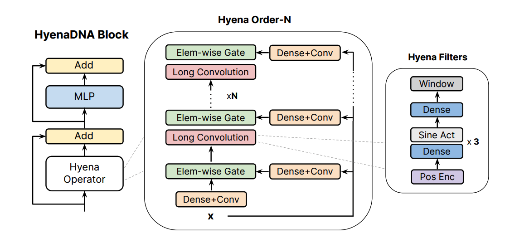</p>

<p align="center">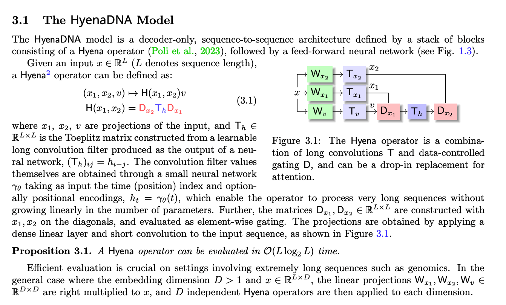</p>

<p align="center">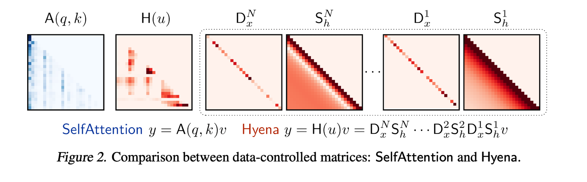</p>

<p align="center">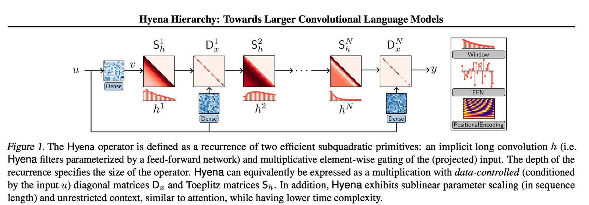</p>

- Attention mechanisms 완전히 제거
- Long convolutional operators with gating 사용
- Ultra-long-range sequence modeling 효율적으로 수행
- Data-driven convolutional filter: thousands to millions of positions span 가능

**동기:**

- Genomic phenomena는 ultra-long-range dependencies 포함 (enhancer–promoter interactions, chromatin domains 등)
- 10\^5–10\^6 bases 수준의 context 처리 가능

**대표 모델:**

- **HyenaDNA**:
    - 첫 Hyena convolutions 기반 genomic foundation model
    - Single-nucleotide token inputs와 next token prediction objective 사용
    - 23개 genomic tasks에서 state-of-the-art (regulatory elements, chromatin profiles, species-level classification 등)
- **Evo**:
    ```shell
    StripedHyena = Hyena + Attention (alternating)
    
    Layer pattern:
    ┌─────────────────────┐
    │   Hyena Block 1     │  ← Long-range modeling
    ├─────────────────────┤
    │   Attention Block 1 │  ← Local refinement
    ├─────────────────────┤
    │   Hyena Block 2     │  ← Long-range modeling
    ├─────────────────────┤
    │   Attention Block 2 │  ← Local refinement
    ├─────────────────────┤
    │        ...          │
    ├─────────────────────┤
    │   Hyena Block N     │
    ├─────────────────────┤
    │   Attention Block N │
    └─────────────────────┘
    
    Ratio: 7 Hyena : 1 Attention
    Total layers: 32
      - 28 Hyena layers
      - 4 Attention layers (strategic placement)
    ```

    - StripedHyena hybrid architecture 채택
    - Ultra-long-range dependencies와 intricate local interactions 모두 포착

#### 3.1.4 State Space Model (SSM)-based Architectures

**특징:**

- Continuous-time dynamical systems에서 영감
- Learned linear dynamics와 non-linear updates로 latent state 진화
- Excellent long-range memory를 가진 recurrent model
- Linear time complexity와 high expressivity (S4, Mamba 등)

**장점:**

- Very long sequences (tens of thousands of tokens 이상) 자연스럽게 처리
- Chromosome-length sequences도 few million parameters로 처리 가능

**대표 모델:**

- **Caduceus**:
    - Mamba 기반으로 구축
    - BiMamba block: forward와 reverse directions 모두 처리
    - MambaDNA block: Reverse-complement (RC) equivariance 강제
    - RC-equivariant BiMamba layers 쌓아서 bidirectional long-range DNA LM 생성

#### 3.2 Sequence Tokenization Methods

Tokenization은 continuous nucleotide strand를 discrete "tokens"로 변환하는 과정. Token granularity가 모든 downstream dimensions 결정:

- Sequence length after tokenization
- Memory of self-attention
- Vocabulary size
- Prevalence of special symbols
- Biological patterns의 resolution

#### 3.2.1 One-hot Encoding

**특징:**

- 각 nucleotide를 distinct binary vector로 표현 (typically length 4: A, C, G, T)
- 예: "A" = \[1,0,0,0\], "C" = \[0,1,0,0\]
- Unknown bases (N)는 all-zero vector

**장점:**

- Full sequence information 보존 (no compression/abstraction)
- No bias or information loss
- Raw form으로 model이 sequence 인식

**단점:**

- Very long input sequences (각 base가 separate input vector)
- Sequence length가 nucleotides 수에 linear하게 증가
- Long genomic regions에서 computationally prohibitive

**사용 예:**

- Enformer: 200 kb one-hot encoded sequences 입력

#### 3.2.2 Single-nucleotide Embedding

**특징:**

- 각 nucleotide(와 N 같은 special characters)를 vocabulary의 token으로 처리
- Learnable dense vector로 embedding
- Simplicity와 fidelity로 인해 많은 gLMs가 채택

**장점:**

- Base-level information 보존
- Vocabulary 단순화
- SNP effects 직접 모델링 가능

**단점:**

- Longer inputs
- Higher compute
- Higher-order motifs의 weaker representation

**사용 예:**

- **HyenaDNA**: Single-nucleotide tokens 명시적 채택하여 SNPs의 fine-grained information 손실 방지
- **EpiGePT**: 5' UTR-CDS에서 mRNA embedding, epigenetic modifications와 chromatin accessibility 예측

#### 3.2.3 k-mer Tokenization

**특징:**

- k개의 연속 nucleotides를 single tokens로 처리
- 두 가지 variants:
    1. **Overlapping k-mers**: Sliding window (stride \< k, often stride 1)
    2. **Non-overlapping k-mers**: Disjoint chunks of length k

**Overlapping k-mers:**

- 장점: Near single-base positional continuity 보존 (adjacent tokens이 1 nucleotide씩 shift)
- 단점: Highly redundant inputs, 원래 sequence length에 가까운 길이, computational cost 증가
- 예: DNABERT (k ∈ \{3, ..., 6\})

**Non-overlapping k-mers:**

- 장점: Token count를 k배 감소, longer effective context 모델링 가능, frequent short motifs 직접 포착
- 단점: Positional detail blur at block boundaries, trailing bases drop when sequence length가 k의 배수가 아닐 때
- 예: 6-mers 사용 시 sequence length를 약 6배 압축

#### 3.2.4 Byte Pair Encoding (BPE) and Subword Methods

**특징:**

- Data-driven approach (fixed-length segments 대신)
- Base vocabulary로 시작하여 가장 빈번한 adjacent token pairs를 iteratively merge
- Varying length tokens 생성: common sequences는 longer tokens, rare sequences는 smaller units

**BPE 작동 방식:**

- 원래 text compression과 NLP를 위해 개발
- Desired vocabulary size에 도달할 때까지 merge
- Common motifs, repeats, sequence fragments를 tokens로 생성 가능

**장점:**

- Compact, data-adapted vocabularies
- Input length 감소
- Computation 가속화
- Recurrent biological motifs 포착

**단점:**

- Base-level resolution 모호해질 수 있음
- Corpus와 vocabulary size에 따라 tokens 달라짐
- 적용이 다른 tokenization methods보다 복잡

**사용 예:**

- **DNABERT-2**: k-mer tokenizer를 BPE로 교체, k-mer tokenization이 major bottleneck이라 주장
    <p align="center">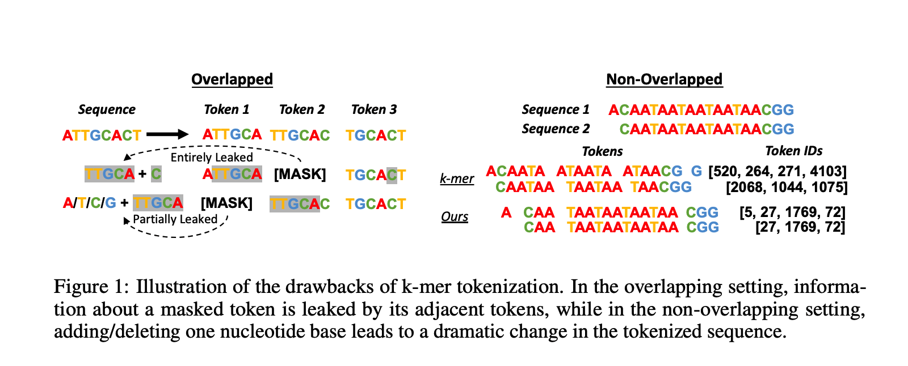</p>

    <p align="center">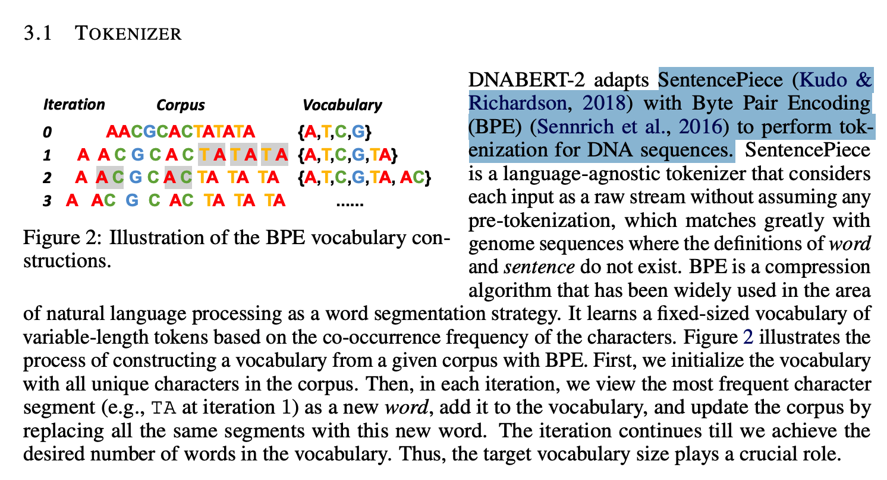</p>

    - source : [https://openreview.net/pdf?id=oMLQB4EZE1](https://openreview.net/pdf?id=oMLQB4EZE1) (DNABERT)
- **GenomeOcean**: 4B parameters gLM, terabases of data에서 BPE 사용, character-level model 대비 최대 150× 빠른 sequence generation
- **MuLan-Methyl**: Custom WordPiece vocabulary (25,000 tokens)
- **Omni-NA**: SentencePiece로 vocabulary 구성

**기타 Subword Methods:**

- WordPiece, SentencePiece: BPE와 개념적으로 유사하나 merge scoring/implementation에서 차이

---

### 4. Pretraining Objectives and Data Resources

#### 4.1 Pretraining Paradigms and Optimization Strategies

gLMs의 effectiveness는 pretraining objectives 설계에 critically depend. NLP의 counterparts와 유사하게 self-supervised learning paradigms 채택.

<p align="center">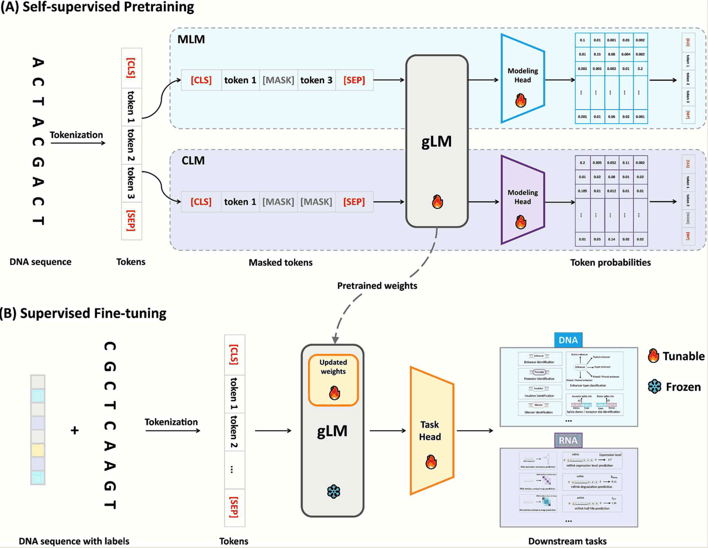</p>

#### 4.1.1 Masked Language Modeling (MLM)

**특징:**

- Bidirectional pretraining approach (BERT에서 popularize)
- Input tokens를 randomly mask하고 surrounding context로부터 예측
- 전체 sequence 관찰 가능

**장점:**

- Motifs와 signals 식별에 우수 (upstream과 downstream context 모두 필요, 예: splice site prediction)
- Synonymous sequence patterns와 syntax rules를 implicitly 학습
- Biologically similar sequences를 embedding space에서 cluster

**단점:**

- Explicit left-to-right generative process 정의하지 않음
- Pretraining 중 각 masked position이 independently 예측되어 certain sequential dependencies를 under-emphasize할 수 있음

**사용 예:**

- **GROVER**: Human genome의 masked-language foundation model, long-range dependencies와 DNA의 linguistic-like rules 포착

#### 4.1.2 Causal Language Modeling (CLM)

**특징:**

- 모든 previous tokens로부터 next token 예측 (unidirectional)
- Model이 token by token sequence 생성 가능
- Probability distribution over sequences 학습

**동기:**

1. Autoregressive models는 inherently novel sequences 생성 가능 (in silico sequence design에 유용)
2. Sequential processing으로 long sequences 처리 가능
3. Sequential dependencies와 nucleotide ordering constraints를 더 directly 포착

**장점:**

- Sequence generation 가능
- Long sequences를 iteratively generating tokens로 처리
- Sequential dependencies 직접 포착

**단점:**

- Past context만 의존하여 purely predictive tasks에서 data efficiency 낮을 수 있음
- Motif classification 같은 tasks에서 MLM 대비 larger model sizes나 more data 필요

**사용 예:**

- **HyenaDNA**: CLM 기반, enhancer–promoter interaction prediction, chromatin profile modeling 등에서 competitive performance
- **regLM**: CLM으로 desired properties를 가진 synthetic cis-regulatory elements 생성

#### 4.1.3 Hybrid Pretraining Paradigms

<p align="center">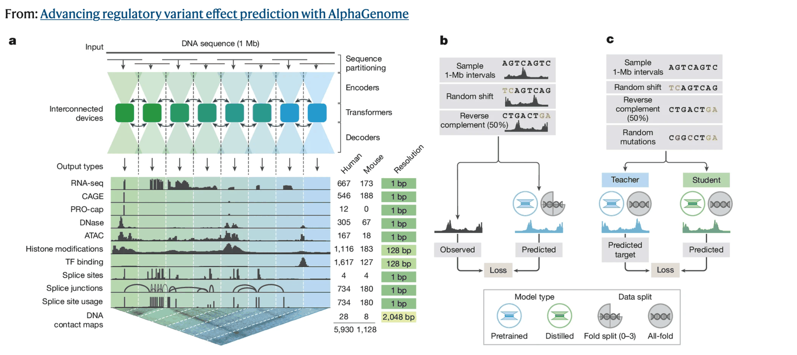</p>

**특징:**

- Multiple distinct pretraining objectives 결합
- 각 method의 strengths 활용
- Domain-specific knowledge 주입

**장점:**

- 복잡한 biological sequences 처리 가능
- Data-driven learning과 domain knowledge 결합

**단점:**

- Training complexity 증가
- Multiple loss functions/modalities balancing 필요
- Curated knowledge나 data 필요

**사용 예:**

- **UTR-LM**: Semi-supervised 5' UTR LM
    - Multiple objectives: masked nucleotide prediction, secondary structure prediction, minimum free energy regression
    - Sequence reconstruction과 structural property prediction을 jointly train
    - Sequence content와 folding/function 모두 encoding

- 📄 [둘이 뭐가 다른데?](01a_evo2_vs_alphagenome_representations.md)

#### 4.2 Pretraining Datasets

Pretraining datasets의 선택은 scale뿐 아니라 biological knowledge의 유형과 downstream applications에 critically depend됨

#### 4.2.1 Human Reference Genome

**특징:**

- Human genomic grammar, long-range dependencies, chromosome-scale organization 학습 가능
- 3.2 billion base human genomic backbone

**주요 Datasets:**

- **GRCh38**: Latest assembly, well-annotated coding/non-coding regions
- **GRCh37/hg19**: Predecessor assembly
- **1000 Genomes Project**:
    - 2,504 individuals, diverse populations
    - Common SNPs와 structural variants 포함
    - Intra-species diversity 도입

**사용 예:**

- **NT Human Ref 500M**: GRCh38에서 pretrain, human DNA의 transcriptional grammar 포착, regulatory prediction tasks와 zero-shot variant prioritization에서 강력한 성능
- **NT**: 3,202 high-coverage human genomes (1000 Genomes Project), naturally occurring genetic diversity 노출

#### 4.2.2 Cross-species Genomic Data

**특징:**

- Evolutionary diversity와 scale 크게 확장
- Stronger generalization 가능
- Non-model organisms로의 transfer learning 지원
- Zero-shot prediction 가능

**주요 Archives:**

- **NCBI RefSeq**:
    - Tens of trillions of nucleotide bases
    - Millions of sequences
    - 500,000 species (bacteria, archaea, viruses, plants, animals)
    - Complete reference genomes부터 environmental metagenomic fragments까지
- **UCSC Genome Browser**: Hundreds of annotated genome assemblies (\>100 species)
- **Ensembl**: High-quality annotated genomes for vertebrates and model organisms

**장점:**

- Phylogenetically diverse data로 wide variety of genomic architectures와 sequence motifs 노출
- Universal genomic features와 context-dependent patterns 학습
- Species 간 transfer 가능

**사용 예:**

- **ProkBERT family**: Hundreds of thousands of bacterial, archaeal, viral, fungal genomes에서 pretrain, promoter identification과 phage detection에서 강력한 generalization

#### 4.2.3 Regulatory and Functional Genomics Datasets

<p align="center">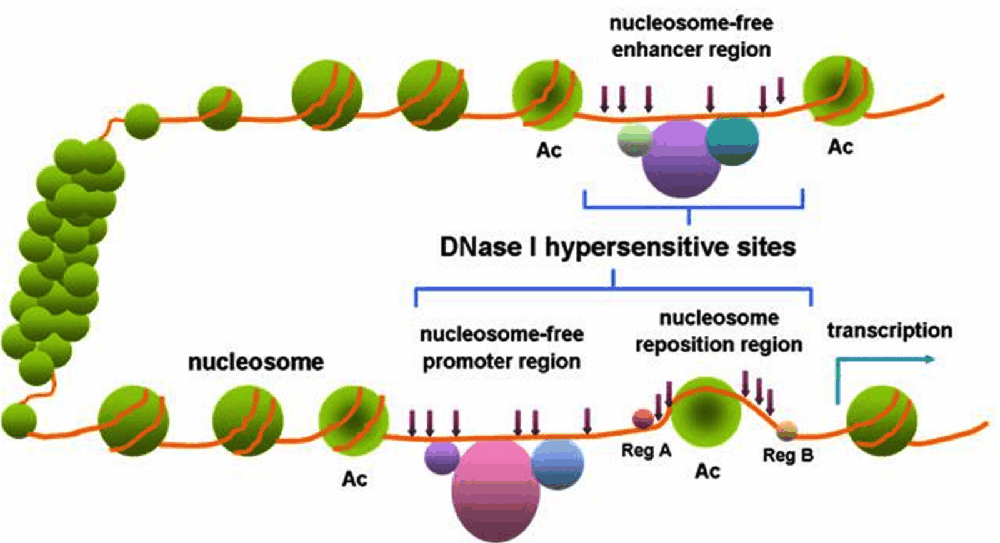</p>

**특징:**

- Gene regulation의 grammar를 explicitly incorporate
- Regulatory elements identification 성능 향상

**주요 Datasets:**

- **EPDnew (Eukaryotic Promoter Database)**:
    - Tens of thousands of experimentally validated promoters
    - Humans와 other eukaryotes
    - <ins>**Core promoter elements와 motif signatures**</ins>
- **DeepSEA**:
    - Regulatory DNA sequences with epigenomic profiles (ENCODE, Roadmap Epigenomics)
    - <ins>**Open chromatin regions, TF binding sites**</ins>
- **ENCODE Project**:
    - Candidate functional elements catalog
    - <ins>**DNase-seq, ChIP-seq, RNA-seq assays**</ins>

**현재 활용:**

- 주로 downstream fine-tuning이나 evaluation benchmarks로 사용
- 일부 연구에서 ENCODE-like data로 pretrain한 supervised models가 unguided gLMs보다 regulatory motifs를 더 효과적으로 포착한다고 보고

**의의:**

- Regulatory/functional annotations를 pretraining에 포함하면 gene content와 regulatory context 모두 포착 가능

#### 4.2.4 RNA and Transcriptomic Datasets

**특징:**

- RNA의 linguistic features 학습
- RNA-specific post-transcriptional/regulatory processes 모델링

**주요 Datasets:**

1. **RNAcentral**:
    - Millions of RNA sequences
    - Dozens of specialized databases aggregation
    - miRNAs, lncRNAs, tRNAs, rRNAs 등 포함
    - 사용 예: **RNAErnie** (23M ncRNA sequences에서 pretrain, RNA-specific masking과 RNA-type tokens 활용)
2. **Rfam**:
    - Alignment-based RNA family datasets
    - Evolutionarily conserved RNA sequences
    - Characterized structural/functional motifs
    - 사용 예: **RNA-MSM** (MLM으로 pretrain, common secondary structure patterns 포착)
3. **PanglaoDB**:
    - Transcripts expressed across diverse cell types
    - In vivo expressed mRNAs
    - Alternative splicing isoforms

**의의:**

- Splicing patterns, RNA structural motifs, expression dynamics 모델링 가능
- Transcriptomics와 ncRNA function prediction의 downstream tasks에 crucial

#### 4.2.5 Prokaryotic, Viral, and Metagenomic Sequences

**특징:**

- Training corpus의 scale을 massively expand
- Rare motifs와 long-context modeling에 robustness 향상

**주요 Databases:**

1. **BV-BRC (Bacterial and Viral Bioinformatics Resource Center)**:
    - Tens of thousands of complete bacterial/bacteriophage genomes
    - Eukaryotes에 없거나 rare한 genomic features (densely packed operons, extreme GC-content regions, diverse viral genome organizations)
2. **OpenGenome**:
    - \~80,000 bacterial and archaeal genomes
    - 사용 예: **Evo** (extremely long contexts 처리, gene context와 operon structure를 genome scale에서 모델링, gene design과 phage discovery 성능 향상)
3. **MGnify**:
    - Millions of assembled contigs from environmental microbiomes
4. **OMG (Open MetaGenomic)**:
    - 사용 예: **gLM2** (functional annotation tasks와 variant effect prediction 성능 향상)

**장점:**

- Rich repertoire of rare sequence patterns
- Training volume을 orders of magnitude 증가
- High-capacity models training 지원
- Overfitting 완화
- Highly generalizable representations 개발

---

### 5. Evaluation Settings, Fine-tuning Paradigms, Downstream Tasks, and Benchmarking

#### 5.1 Evaluation Settings

gLMs의 practical capabilities를 종합적으로 평가하기 위해 세 가지 evaluation paradigms 사용:

#### 5.1.1 Supervised Evaluation

**특징:**

- Labeled data로 fully task-specific adapted 후 성능 평가
- gLMs의 predominant evaluation setting

**사용 예:**

- <b>DNABERT</b>: Human reference genome에서 pretrain 후 <ins><b>promoter recognition, splice site prediction, TF binding site classificatio</b></ins><b>n </b>등에서 fine-tuning 평가
- **NT v2, GROVER, HyenaDNA**: Supervised evaluation에서 강력한 성능

**한계:**

- Limited labeled data나 multiple task settings에서 challenges

#### 5.1.2 Zero-shot Evaluation

**특징:**

- Task-specific fine-tuning 없이 pretrained gLM을 downstream tasks에 직접 적용
- Learned representation을 직접 활용하여 predictions

**Generative gLMs의 활용:**

- Sequences에 likelihoods 할당
- In silico variant effect prediction

**사용 예:**

- **GPN**: Reference/alternative alleles 간 log-likelihood ratio로 각 genetic variant의 functional impact 점수 부여, <ins>**deleterious SNPs 식별**</ins> (추가 training 없이)
- **megaDNA**: Generative gLM으로 essential genes를 zero-shot으로 예측
- **EpiGePT**: Multi-task setting에서 chromatin signals 예측 훈련 후 새로운 cell types로 직접 generalize (fine-tuning 없이)

#### 5.1.3 Few-shot Evaluation

**특징:**

- 소수의 labeled examples만으로 model 평가
- <ins>**In-context learning 또는 very limited dataset에서 fine-tuning**</ins>

**In-context Learning:**

- GPT-3 style prompting에서 영감
- Few example sequences와 labels를 포함한 prompt 제공
- Model weights update 없이 새로운 query sequence의 label 예측

**사용 예:**

- **HyenaDNA**: Soft prompt tuning (learnable embeddings를 input sequences에 prepend), frozen model이 fully fine-tuned counterparts와 유사한 성능
    <p align="center">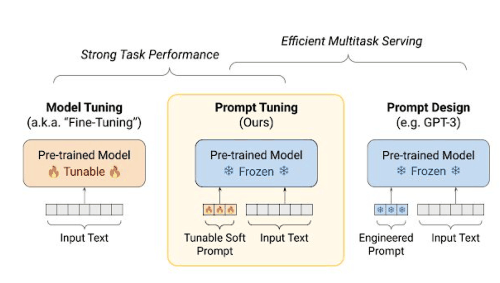</p>
- **NT**: Larger gLMs가 low-data regimes에서 더 robust, minimal fine-tuning data로 good accuracy

#### 5.2 Fine-tuning Paradigms

Effective adaptation strategies는 pretrained knowledge 활용과 task-specific requirements 균형 필요.

#### 5.2.1 Full Fine-tuning

**특징:**

- Task-specific fine-tuning 중 모든 model parameters 업데이트
- Pretrained model을 weight initialization으로 활용
- Downstream data로 re-train

**장점:**

- 많은 benchmarks에서 excellent performance

**단점:**

- Large model (millions/billions of parameters)은 significant memory와 compute 필요
- Overfitting 우려 (특히 limited training samples에서)
- Tiny dataset에서 tuning하면 noise 암기하고 pretrained general features 손실 가능

**사용 예:**

- **DNABERT-2**: 전체 model parameters를 각 task에서 fine-tune하여 diverse tasks에서 state-of-the-art

#### 5.2.2 Selective Fine-tuning

**특징:**

- Model parameters의 subset만 업데이트
- 나머지 parameters는 fixed

**Strategies:**

1. **Linear Probing**:
    - Model backbone freeze
    - 새로운 output layer (classifier/regressor)만 train
    - 예: **Species LM** (90M parameters model freeze, embeddings에 logistic regression train하여 gene regulatory activity 예측)
2. **Partial Layer Tuning**:
    - 특정 layers만 fine-tune (typically top few transformer blocks)
    - Early layers는 frozen
    - Higher-level features encoding

**장점:**

- Strong performance
- Trainable parameters 수 significantly reduce

#### 5.2.3 Parameter-efficient Fine-tuning (PEFT)

**특징:**

- Small number of additional parameters를 insert/adjust
- 모든 pretrained weights 수정하지 않음
- NLP에서 borrowed techniques

**주요 Techniques:**

1. **Adapter Modules**:
    - Lightweight neural networks를 transformer layers 사이에 insert
    - Pretrained model weights frozen
    - Task-specific adapter layers 학습
    - Adapter는 typically full model보다 orders of magnitude 적은 parameters
    - Training requirements dramatically reduce
2. **LoRA (Low-Rank Adaptation)**:
    - Pretrained weights에 low-rank updates 학습
    - Original weights fixed
    - Per layer two small trainable matrices 도입 (weight updates approximate)
    - 예: **DNABERT-2** (certain attention layers를 LoRA rank decompositions로 fine-tune하여 longer input sequences 효율적 처리)
3. **Prompt Tuning**:
    - Small task-specific embeddings 학습
    - Backbone model frozen
    - Trainable continuous embeddings ("soft prompts")를 input sequence에 prepend
    - 예: **HyenaDNA** (up to 32k soft prompt tokens 학습, minimal trainable parameters로 competitive classification performance, full fine-tuning에 가까운 결과)

#### 5.3 Taxonomy of Downstream Tasks for gLMs

<p align="center">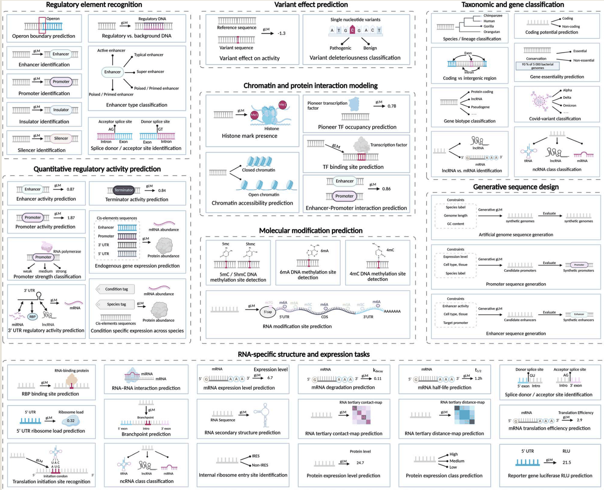</p>

#### 5.3.1 Regulatory Element Recognition

**목표:**

- Promoters, enhancers, silencers, insulators 등 gene transcription 제어 DNA sequences 식별

**Typical Task:**

- Putative transcription start site를 중심으로 한 human genomic sequence 입력
- Token-level 또는 pooled embeddings 도출
- Linear classification head로 regulatory category 예측 (promoter, enhancer, silencer, insulator, background)

**사용 예:**

- **DNABERT-2**: BPE tokenizer, multi-species genomes에서 pretrain, GUE benchmark의 promoter/enhancer classification에서 최고 성능과 comparable
- **NT**: Embeddings에서 promoters, enhancers, UTRs, 기타 genomic elements separable
- **SegmentNT**: Pretrained NT encoder + U-Net-style segmentation head, 14 classes의 genic/regulatory elements annotate, gene annotation, splice site detection, regulatory element localization에서 state-of-the-art

#### 5.3.2 Quantitative Regulatory Activity Prediction

**목표:**

- Regulatory sequence가 gene expression이나 other molecular outputs를 어느 정도 drive하는지 모델링
- Continuous measurements 예측 (expression levels, reporter activity)

**Typical Tasks:**

- Endogenous gene expression
- Enhancer activity
- Promoter activity/strength
- Terminator activity
- 3' UTR regulatory activity

**사용 예:**

- **Species LM**:
    - Hundreds of genomes에서 pretrain (wide evolutionary distances)
    - Shallow regressors와 결합하여 endogenous gene expression과 MPRA outputs 예측
    - Promoter와 3' UTR activity를 species 간 예측에서 convolutional baselines보다 높은 정확도
- **AgroNT**:
    - Transformer-based plant gLM (48 crop/model species genomes)
    - Promoter/terminator strength, tissue-specific gene expression 예측에서 state-of-the-art
    - In silico variant prioritization과 synthetic regulatory elements의 rational design 가능
- **regLM**:
    - Autoregressive DNA LM + supervised sequence-to-function oracle networks
    - Promoter/enhancer activity assays로 train
    - Yeast와 human cells에서 defined expression levels를 가진 cis-regulatory elements 설계

#### 5.3.3 Variant Effect Prediction

**목표:**

- Single-nucleotide variants (SNVs)나 small indels가 gene regulation/function에 미치는 영향 평가
- With/without variant sequences를 native genomic context에서 비교
- Molecular phenotypes (transcription, splicing, chromatin accessibility) 영향 추정

**사용 예:**

- **NT**:
    - Embeddings와 likelihood-based scores로 coding/regulatory regions의 mutations 영향 예측
    - Conservation-based metrics와 task-specific deep learning models를 match/surpass
- **GPN-MSA**:
    - Alignment-aware masked language model
    - \~9 billion possible human SNVs에 대한 precomputed scores 제공
    - Coding/non-coding variants의 deleteriousness prediction에서 state-of-the-art
- **Caduceus**:
    - Reverse complement-equivariant BiMamba DNA LM
    - Megabase-scale genomic context와 strand symmetry jointly model
    - Challenging long-range non-coding variant effect prediction benchmarks에서 larger transformer baselines substantially outperform

#### 5.3.4 Chromatin and Protein Interaction Modeling

**목표:**

- DNA–protein, RNA–protein interactions와 epigenetic states를 sequence data로부터 직접 예측

**Typical Tasks:**

- TF binding sites prediction
- Chromatin accessibility
- Histone mark presence
- Enhancer–promoter interactions

**의의:**

- Regulatory proteins와 chromatin modifications의 genome-wide distribution 밝힘
- Regulatory grammar의 functional interpretation 제공

**사용 예:**

- **NT**:
    - DeepSEA-style chromatin profiling tasks로 fine-tune
    - DNase I hypersensitive sites, histone modifications, TF binding (hundreds of cell types)
    - Multispecies 2.5B NT model이 919 chromatin profiles에서 DeepSEA baseline과 comparable ROC–AUC
- **RNA-FM**:
    - Large-scale unlabeled transcripts로부터 informative representations 학습
    - Protein–RNA binding preference prediction을 위한 downstream models substantially enhance

#### 5.3.5 Molecular Modification Prediction

**목표:**

- Site-specific chemical modifications of nucleic acids 추론
- DNA: 5mC, 6mA, 4mC, 5hmC
- RNA: m6A

**Challenges:**

- Subtle sequence determinants와 long-range context 학습 필요
- Modified/unmodified sites를 diverse genomic backgrounds에서 구분

**DNA 사용 예:**

- **iDNA-ABF**:
    - Multiscale deep biological language learning framework
    - k-mer tokenization + hierarchical convolutional/recurrent modules
    - 5mC, 6mA, 4mC sites 예측 (multiple species)
- **MuLan-Methyl**:
    - Five transformer-based LMs ensemble
    - Three types of DNA methylation (6mA, 4mC, 5hmC) 예측
    - Complementary gLM backbones 결합으로 robustness와 accuracy 향상

**RNA 사용 예:**

- **Rm-LR**:
    - Two large-scale pretrained RNA LMs integration
    - Bilinear attention network
    - 10 types of RNA modifications를 primary sequence만으로 정확히 예측

#### 5.3.6 Taxonomic and Gene Classification

**목표:**

- Organism-level과 gene-level annotation of genomic sequences

**Organismal Level:**

- Metagenomic/anonymous DNA fragments를 species, genus, higher taxonomic ranks에 assign

**Gene-centric Tasks:**

- Coding vs non-coding sequences discrimination
- Biotype classification of genes/transcripts
- Genome annotation at nucleotide resolution

**사용 예:**

- **Hwang et al.**:
    - Millions of metagenomic contigs로 gLM train
    - Linear probes로 taxonomy prediction, enzyme function, operon structure, paralog identification
- **NT**:
    - Unsupervised detection of gene structure
    - Intermediate representations가 intergenic/genic regions differentiate
    - 2.5B parameters NT model: first layer에서 intergenic/genic separation, deeper layers에서 5' UTRs와 other genic regions 구분

#### 5.3.7 Generative Sequence Design

**목표:**

- Explicit functional constraints를 만족하는 novel DNA/RNA sequences sampling
- Constraints 예: promoter strength, protein-coding capacity, species label

**Process:**

- Target species와 desired expression level 제공
- gLM이 special tokens로 constraints encode
- Autoregressively generate coding DNA sequence (codon usage와 predicted expression levels 최적화)

**사용 예:**

- **Evo**:
    - 7B parameters long-context gLM
    - 2.7M microbial genomes에서 single-nucleotide resolution train
    - Discriminative/generative use 모두 지원
    - Conditional sampling과 in silico evolution으로 coding sequences와 cis-regulatory elements 설계
    - Open reading frames 보존, desired expression/fitness readouts 달성
- **megaDNA**:
    - Multiscale transformer gLM
    - Unannotated bacteriophage genomes에서 pretrain
    - Autoregressively sample하여 synthetic viral genomes (tens of kilobases) 생성
    - Gene organization, regulatory signals, natural phage composition aspects 재현
    - Essential gene prediction과 variant effect scoring 가능

#### 5.3.8 RNA-specific Structure and Expression Tasks

**목표:**

- RNA secondary/tertiary structure, stability, translation output 예측
- 5' UTR ribosome load prediction, translation efficiency

**Typical Process:**

- Human mRNA 5' UTR sequence를 RNA gLM이 contextual embeddings로 encode
- Regression head로 pooled embedding 해석하여 quantitative properties 추정 (mean ribosome load, translation efficiency)
- Structured prediction head로 base-pair probability matrix나 dot-bracket representation 생성

**사용 예:**

- **RNA-FM**:
    - 첫 large-scale RNA LM 중 하나
    - MLM objective로 \~23M ncRNA sequences (RNAcentral)에서 pretrain
    - Structural labels 없이도 contextual embeddings 학습
    - RNA secondary structure, tertiary contact/distance maps, RNA–protein binding preferences, gene expression regulation, SARS-CoV-2 genome structure 등 downstream predictors substantially improve
- **UniRNA**:
    - Largest RNA sequence corpora 중 하나로 pretraining scale
    - Single universal RNA LM을 wide panel of structure/function tasks에 fine-tune하여 strong performance
    - Secondary structure prediction, subcellular localization 포함
- **RiNALMo**:
    - 650M parameters BERT-style RNA LM
    - 36M ncRNA sequences로 train
    - Secondary structure, multi-species splice site prediction, mean ribosome loading, translation efficiency, expression level prediction에서 state-of-the-art

#### 5.4 Benchmarking and Datasets

#### 5.4.1 주요 Benchmarks

**1. DART-Eval**

- Non-coding regulatory sequences와 sequence variation consequences에 집중
- 5 progressively challenging task groups:
    1. Regulatory regions vs genomic background 구분
    2. Known TF motifs에 대한 sensitivity
    3. Cell-type-specific regulatory activity 예측
    4. Regulatory activity readouts의 quantitative prediction
    5. Regulatory elements의 variant effects의 counterfactual prediction

**2. BEND**

- DNA LMs를 위한 benchmark
- Realistic and biologically meaningful tasks (human genome)
- 7 curated datasets: gene finding, enhancer annotation, chromatin accessibility, histone modification, CpG methylation, non-coding variant effects (gene expression, disease susceptibility)

**3. GenBench**

- gLMs의 unified benchmarking framework
- Attention-based transformers, CNNs, SSMs 비교
- Diverse sequence lengths와 task types
- Short/long-range categories: enhancers, promoters, splice sites, TF binding, higher-order genome structure

**4. Genomics LRB (Long-Range Benchmark)**

- Long-range modeling capabilities 평가
- Contextual ranges가 existing benchmarks보다 substantially 확장
- 9 tasks (human genome): causal eQTL prediction, pathogenic variant classification (ClinVar, OMIM), bulk RNA-seq expression prediction, promoter/enhancer identification, CAGE profile prediction, histone mark prediction, chromatin accessibility analysis

**5. BEACON**

- 첫 large-scale benchmark dedicated to RNA LMs
- Structural analysis, functional prediction, engineering applications
- Physical RNA folding principles와 sequences의 regulatory grammar 모두 포착하는지 평가

**6. RNA Sequence-related Predictive Benchmark**

- Sequence-based prediction tasks throughout RNA life cycle
- Pretrained RNA LMs의 generalization across diverse RNA prediction problems 평가
- Tasks: ncRNA function classification, RNA modification site prediction, splice donor/acceptor site identification, tissue-specific splice site usage prediction, mRNA translation efficiency prediction

**7. COMET**

- Comprehensive multi-omics benchmark
- 17 tasks: DNA, RNA, proteins, cross-molecular contexts, multi-molecular interactions
- Omics-specific/multi-omics LMs의 knowledge transfer across central dogma 평가
- Unified models가 specialized ones와 comparable performance 달성하는지 평가

#### 5.4.2 Performance Trends

**1. No Universal Superiority:**

- Single model family가 모든 benchmarks에서 우위 보이지 않음
- **Attention-based transformers** (NT, DNABERT-2, GENA-LM):
    - Short-range regulatory tasks에서 우세 (DART-Eval, BEND, GenBench)
    - Enhancer/promoter identification, motif-sensitive classification, local chromatin state prediction
- **Convolutional/SSMs** (ChromBPNet, HyenaDNA, Caduceus):
    - Specific quantitative/long-range tasks에서 competitive 또는 superior
    - Chromatin profile regression, genome structure prediction

**2. Domain-specific Pretraining Advantages:**

- **RNA-specialized models** (RNA-FM, SpliceBERT, 3UTRBERT, RNAErnie):
    - ncRNA function, RNA modification, splicing, translation-related tasks에서 superior (RNA benchmark, BEACON)
- **Multi-omics models** (LucaOne):
    - Programmable RNA switches, enhancer–promoter interactions, siRNA efficiency prediction에서 우수 (COMET)
    - Sequence–sequence interactions modeling이 crucial한 tasks

**3. Specialized Architectures:**

- Sequence-to-signal regression과 variant scoring에 최적화된 architectures가 가장 demanding quantitative/variant-centric tasks에서 gLMs outperform
- **Enformer, CADD**: eQTLs, pathogenic variants (ClinVar, OMIM), bulk RNA expression prediction에서 leading (LRB)
- **DeepSEA, ChromBPNet**: Chromatin accessibility, histone mark prediction에서 strong baselines
- Current gLMs는 naive baselines outperform하지만 generally fine-grained variant effect prediction에서 task-specific models에 뒤짐
    - 📄 [뭔 말이냐면](01b_why_task_specific_models_win.md)

**4. Limitations:**

- Extreme contextual ranges/inter-molecular interactions (long-range tasks in GenBench, LRB, COMET)에서 current gLMs의 limitations 강조
- Model size/context length scaling만으로는 robust long-range reasoning/interaction modeling capabilities 보장 안 됨
- Richer benchmarks와 targeted architectural innovations 필요
- Future gLMs는 scalable long-range sequence modeling과 explicit mechanisms (3D genome organization, RNA/protein structure, multi-molecular interactions) 통합 필요

---

### 6. Challenges and Future Directions

#### 6.1 Data

**주요 과제:**

1. **Label Scarcity and Bias:**
    - Labeled DNA/RNA datasets가 humans와 few model organisms에 disproportionately concentrated
    - Representational biases로 인해 species 간 model generalization impair
2. **Data Quality Issues:**
    - Sequencing errors
    - Annotation inconsistencies
    - Batch effects
    - Reliable supervision과 standardization hinder

**Future Directions:**

- Broader species coverage
- Harmonized workflows
- Few-shot learning techniques 개발 (label sparsity 완화)

#### 6.2 Model

**주요 과제:**

1. **Long-range Dependencies:**
    - Genomic sequences는 hundreds of kilobases의 dependencies 포착 필요
    - Standard transformer architectures의 limits 초과
2. **Computational Demands:**
    - Recent advances (Enformer, HyenaDNA, JanusDNA)가 context windows를 1 Mbp까지 확장
    - 그러나 substantial computational demands 수반

**Current Solutions:**

- Sparse attention
- Memory compression (Longformer, BigBird, FlashAttention)
- Model optimization (distillation, pruning, quantization)

**Future Directions:**

- Biological relevance와 computational efficiency 균형
- Tailored hardware-algorithm co-design

#### 6.3 Evaluation

**주요 과제:**

1. **Lack of Standardization:**
    - NLP의 GLUE, SuperGLUE 같은 unified evaluation suites 부재
    - Disparate tasks (TF binding sites prediction, splicing, promoter classification)
    - Different datasets와 evaluation protocols 사용
    - Comparisons 어려움
2. **Generalization Assessment:**
    - Species와 cell types 간 generalization ability rarely assessed

**Future Directions:**

- Generalizability를 explicitly test하는 evaluation protocols
- Biologically meaningful standard evaluation metrics 필요

#### 6.4 Interpretability

**주요 과제:**

- gLMs의 interpretability는 open challenge
- Model internals와 biological phenomena를 meaningfully link하는 tools 필요

**Promising Developments:**

- Unsupervised analyses: embeddings와 attention patterns이 biological elements reflect
- Attention heads의 functional specialization (enhancers/promoters에 focus)

**Future Directions:**

- Interpretability methods의 continued innovation
- Insights를 actionable biological understanding으로 translate

#### 6.5 Key Takeaways

**Users를 위한 Guidance:**

1. Task 정의
2. Model 선택 (context length, GPN models, model performance 고려)
3. Data 준비 (selection, processing, tokenization)
4. Adaptation (full fine-tuning, selective fine-tuning, PEFT)
5. Evaluation (metrics, biological plausibility, interpretability)

**Developers를 위한 Guidance:**

1. Data Strategy (source, sequence diversity, multi-species considerations)
2. Tokenization Strategy (existing tokenization 또는 new tokenization)
3. Architecture Development (backbone: Transformer encoder/decoder, Hyena, SSM 등; architecture tweaks: long-range attention, retrieval/BR-positional encodings 등)
4. Pretraining Task (MLM, CLM, auxiliary tasks)
5. Evaluation (benchmarking: GUE, BEND, BEACON; evaluation setting: zero-shot, few-shot; interpretability)

---

### 7. Conclusion

이 comprehensive survey는 genome language models의 현재 상태를 다음과 같이 정리한다:

1. **Necessity**: gLMs는 기존 deep learning models의 한계(limited receptive fields, handcrafted features, task-specific nature)를 극복하여 genomics와 transcriptomics에서 transformative shift를 대표한다.
2. **Design**: 다양한 architectures (Transformer encoders/decoders, Hyena, SSMs)와 tokenization strategies (one-hot, single-nucleotide, k-mers, BPE)가 각기 장단점을 가지며, task에 따라 적절히 선택되어야 한다.
3. **Pretraining**: MLM, CLM, hybrid paradigms와 다양한 datasets (human genome, cross-species, regulatory/functional, RNA, prokaryotic/viral/metagenomic)를 활용하여 rich representations 학습한다.
4. **Evaluation**: Supervised, zero-shot, few-shot settings와 다양한 fine-tuning paradigms를 통해 평가되며, extensive taxonomy of downstream tasks와 representative benchmarks가 존재한다.
5. **Challenges**: Data scarcity/quality, computational demands, lack of standardized evaluation, interpretability 등이 주요 challenges로 남아있으며, 이를 해결하기 위한 future directions가 제시되었다.

gLMs는 functional annotation, variant effect prediction, regulatory element discovery, disease variant interpretation, synthetic biology, precision medicine, evolutionary studies 등에 broad implications를 가지며, bioinformatics의 foundational tools로 빠르게 자리잡고 있다.
