# [저널클럽 2주차] gLM evaluating — my presentation

[🏠 Portfolio](https://github.com/heoneyzi) › [📚 Study](../../../README.md) › [🧬 Genomics](../../README.md) › [Season 1 · Functional Genomics](../README.md) › [Journal club](README.md)

> ✍️ **강지헌 (me)** · 📅 week 2 · presented 2026-02-18 · 🗂️ Source: Notion — *Functional Genomics › 개인 아카이브*
>
> 🔁 Duplicate in Notion, not reproduced: *Genomics (1) › 저널클럽 2주차* (older copy without the closing 코멘트 section).

---

## Evaluating the representational power of pre‑trained DNA language models for regulatory genomics

### Background

#### gLM의 등장

LLM은 noncoding genome을 이해하는데 새로운 패러다임을 가지고 왔음

- 시스 조절 요소(CREs)의 활성을 제어하는 전사 인자(TFs) 간의 복잡한 상호작용을 파악하는 데 도움
    - 📄 [부가설명 (CREs & TFs)](02a_cre_tf_explainer.md)
- 돌연변이의 기능적 결과를 더 정확하게 예측 → 질병 관련 변이의 우선순위를 정하는 데 기여
- 원하는 기능을 가진 새로운 조절 서열을 설계하는 데 활용 가능
- 진화적 변동이 심해 어려운 과제였던 종 간 noncoding genome의 기능적 비교를 지원

#### gLM 모델링

- **마스크 언어 모델링(MLM):** 서열 중 일부 토큰을 mask로 가리거나 무작위 토큰으로 바꾼 뒤, 주변 문맥을 이용해 원래 토큰이 무엇인지 예측하며 학습
- **인과적 언어 모델링(CLM):** 이전 토큰들이 주어졌을 때 다음에 올 토큰을 예측하는 autoregressive한 방식으로 학습

gLM의 가장 큰 장점은 생물학적으로 의미 있는 특징을 pre-training 단계에서 미리 배운다는 점  → downstream tasks에서 이를 활용할 수 있고, 처음부터 다시 학습해야 하는 번거로움을 피할 수 있음

#### Tokenizing

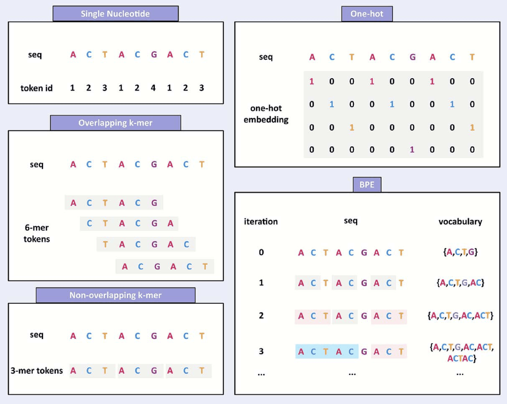

- **단일 염기 (Single Nucleotide)**
- **원 핫 서열 (One-hot Encoding)**
- **k-mer**
- **가변 크기 바이트 쌍 인코딩 (BPE)**

#### gLM의 기본 아키텍처

- **트랜스포머 (Transformer):** 가장 일반적인 구조로, 멀티 헤드 셀프 어텐션을 층층이 쌓기. 계산 효율을 위해 Flash Attention이나 Sparse Attention 사용하기도 함.
- **대안적 구조:** 연산 속도나 긴 서열 처리를 위해 확장 컨볼루션(Dilated Convolution) → GPN (Genomic Pre-trained Network) 상태 공간 모델(State-Space Models) → Hyena, Mamba 등의 구조를 활용하기도 함.
    *GPN 모델 Dilated CNN = 딜레이션은 필터 사이의 간격을 벌려주는 기법→ 이를 통해 모델은 적은 파라미터로도 Long-range dependency까지 효율적으로 파악 가능*

지금까지 gLM의 성능을 측정할 때는 대부분 특정 Task에 맞춰 모델의 가중치를 Finetuning 방식을 사용함.

- 모든 층의 가중치를 조정하거나, LoRA, Prompt tuning, $`(IA)^3`$와 같은 효율적인 매개변수 PEFT 기법들이 사용.
- Fintuning을 통해 성능 향상을 이루어 냈지만, 하지만 모델의 성능 향상 이유를 명확히 알 수 없음 **Pre-training을 통해 얻은 일반적인 생물학적 지식 VS Finetuning 과정에서 해당 Task에 Overfitting**

#### 문제 고찰

- cis-regulatory mechanisms*(유전자 발현을 실제로 제어하는 작동 원리)*을 담지 못하는 단순한 벤치마크 (이진 분류 문제등의 쉬운 문제)
- 너무나 약한 Baseline (SOTA와 비교하지 않는 등) → gLM의 과대평가 가능성

***→ gLM은 진정한 Foundation Model로 삼을 수 있을 것인가??***

= 가중치 수정 없이(Zero-shot) 얼마나 새로운 데이터를 잘 예측할 수 있을까?

#### 실험의 큰 구성

평가 gLM 모델 :

- Nucleotide Transformer
- DNABERT2
- HyenaDNA
- 인간 참조 genome으로 학습시킨 커스텀 GPN 모델

(단 모델은 전혀 수정하지 않고, 모델이 생성한 결과만을 가지고 평가함)

<b>*gLM 임베딩을 어떻게 사용하나요?</b>*  → 각 gLM의 마지막에서 두 번째 층(penultimate layer)에서 임베딩을 추출 → 표준적 관행 (왜냐하면 마지막 층은 너무 Task Specific적임)  1. 서열 전체 정보를 요약하기 위해 <b>분류 토큰(CLS)</b> 과 mean embedding을 사용  2. 추출된 임베딩을 받아 선형모델(Ridge)나 MLP 혹은 <b>CNN(</b>요약된 정보뿐만 아니라 임베딩 전체를 분석하기 위해서)까지 사용해 베이스라인 형성

VS

비교 모델:

- 전통적인 One-hot encoded CNN 방식
- 레이블이 있는 데이터로 학습된 지도학습 기반 파운데이션 모델 (Sei, Enformer 등)
- 해당 데이터셋에 맞춰 One-hot 서열로 처음부터(From Scratch) 학습시킨 지도학습 모델

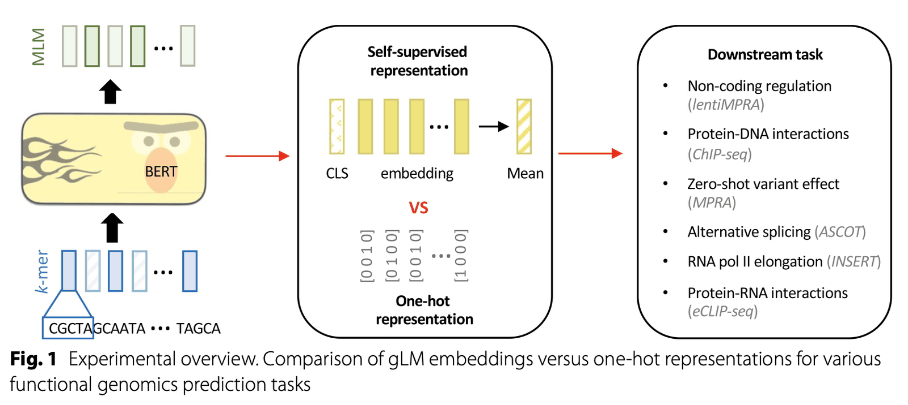

### Task1

**lentiMPRA 데이터를 활용한 세포 유형 특이적 조절 활성 예측**

이는 시스 조절 요소(CRE)의 활성을 구동하는 메커니즘을 이해하는 것 →세포 유형마다 다르게 나타나는 전사 인자(TF) 결합의 복잡한 규칙 때문에 까다로움

#### Task1 실험

<b><i>lentiMPRA:</i></b> <i>렌티바이러스 기반의 대규모 병렬 기자 분석(lentiMPRA)을 통해 실험적으로 측정된 인핸서(Enhancer) 활성 데이터를 사용</i>

- Input: 230개 뉴클레오타이드 길이의 DNA 서열을 입력으로 사용하며, 이를 <b>gLM 임베딩</b> 또는 One-hot<b> 서열</b>로 표현하여 비교 *← 길이가 230으로 고정된 이유는 길이가 변수도 들어가는 것을 막기 위해?*
- HepG2(간암 세포선)와 K562(백혈병 세포선) 두 가지를 고려하여, 모델이 세포 유형별로 서로 다른 조절 활성(Enhancer Activity Score)을 포착할 수 있는지 평가

비교 모델

- **One-hot sequence CNN**
- <b>Sei (</b>21,907개의 크로마틴 프로파일링 데이터셋으로 사전 학습된 지도학습 기반 파운데이션 모델)<b> </b>크로마틴:<b> <b>DNA가 히스톤에 감겨 뭉쳐 있는 상태 → </b>세포 안에서 DNA의 물리적 상태를 찍은 스냅샷</b>
- **MPRAnn** (lentiMPRA 원본 연구에서 제시된 지도학습 기반 베이스라인 모델)
- <b>ResNet </b>(One-hot sequence을 사용하여 처음부터(from scratch) 학습시킨 지도학습 모델)

| **분류** | **모델명** | **입력 데이터 형태** | **학습 상태** | **특징 및 역할** |
|---|---|---|---|---|
| **실험 대상 (gLM)** | **NT (Nucleotide Transformer)** | gLM 임베딩 | **Frozen** | BERT 기반, k-mer 토큰화 사용  |
|  | **DNABERT2** | gLM 임베딩 | **Frozen** | BERT 기반, BPE 및 Flash Attention 사용 |
|  | **HyenaDNA** | gLM 임베딩 | **Frozen** | 상태 공간 모델(SSM), 단일 염기 처리  |
|  | **GPN (Human)** | gLM 임베딩 | **Frozen** | CNN 기반(확장 컨볼루션), 단일 염기 처리 |
| **지도학습 파운데이션** | **Sei** | Sei 임베딩 | **Frozen** | 2만 개 이상의 크로마틴 데이터를 미리 학습한 모델  |
| One-hot<b> 베이스라인</b> | <b>One-hot CNN</b> | One-hot 서열 | <b>Trained</b> | 가장 기본적인 CNN 구조의 베이스라인 |
|  | **ResNet** | One-hot 서열 | **Trained** | 성능을 높인 정교한 구조의 지도 학습 모델  |
|  | **MPRAnn** | One-hot 서열 | **Trained** | Task 1 원본 연구에서 사용된 전용 모델  |
| **최신 SOTA 모델 (지도학습 파운데이션)** | **Enformer** | One-hot 서열 | **Pre-trained** | 긴 서열(196kb)을 처리하는 현재 가장 강력한 모델 |

#### Task1 실험 결과

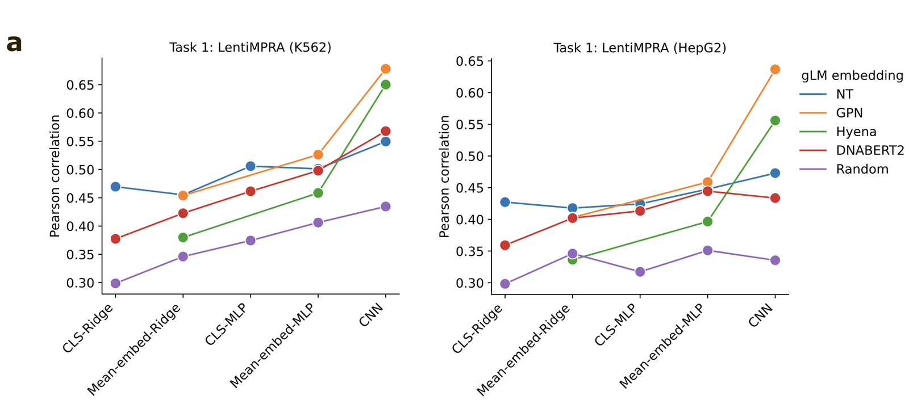

- gLM 사용시, CLS나 Mean embedding보다 CNN을 사용하는 것이 성능이 좋음
    → gLM의 **요약된 표현**이 세포 유형 특이적인 조절 활성을 예측할 만큼의 충분한 정보가 들어있지 않음을 시사

    → MLP가 선형 모델보다 나은 성적을 거둔 것을 통해, 모델이 배운 표현형과 실제 생물학적 활성 수치 사이의 관계가 매우 복잡하고 비선형적임 (그래서 CNN이 제일 높은 것일지도…)

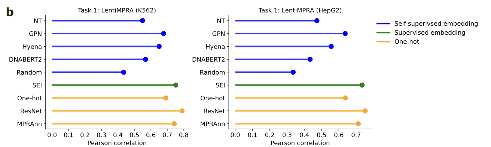

- 연구진이 직접 인간 유전체로 학습시킨 **GPN** 모델을 제외하면, 대부분의 gLM 임베딩 기반 CNN은 거의 모든 **One-hot sequence 기반 모델보다 성능이 낮음**
- **지도학습 파운데이션 Sei**나 **Enformer** 기반 모델들의 성능이 gLM보다 훨씬 뛰어남
- 사전 학습된 모델을 전혀 쓰지 않고 해당 데이터셋에서 처음부터(from scratch) One-hot 서열로 학습시킨 **ResNet** 모델이 가장 좋은 성능을 기록 → 기존 Foundation 모델의 성능에 대한 의문

---

***만약 dataset에 Finetuning을 했다면 결과가 달랐을까?***

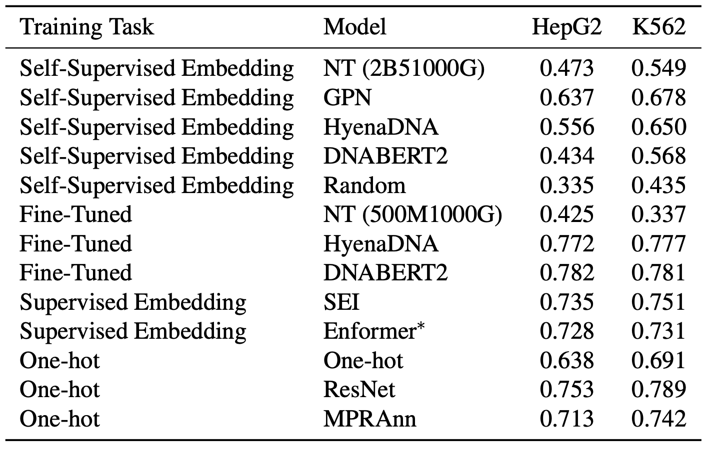

- gLM의 가중치를 직접 업데이트하여 학습시키면 성능이 대폭 올라서 ResNet과 비슷한 수준에 도달 →이는 gLM이 사전 학습 과정에서 lentiMPRA 작업에 도움을 줄 만한 추가적인 맥락을 제대로 배우지 못했음을 의미 → One-hot sequence에서 배울 수 있는 것 이상의 무언가를 gLM이 제공하지 못하고 있다고 볼 수 있음

물론 Layer 선택의 문제도 아니었음… 가장 잘나온 층인 10 Layer도 상황은 비슷했다고 함.

---

### Task2

<b>전사 인자(TF) 결합 </b>→ 이는 어떤 세포냐에 따라 달라지는 Cell-type specific한 현상

- 기존 gLM의 사전 학습 방식(MLM, CLM)은 특정 세포의 정보를 알지 못한 채 서열 그 자체만 학습  → 저자는 앞선 lentiMPRA에서 gLM의 성능이 낮았던 이유가 사전 학습 과정에서 핵심 모티프(TF가 결합하는 특정 서열 패턴)에 대한 정보를 소실했기 때문이라고 추측해서 실험을 진행 인핸서 활성도가 결국 TF 모티프에 TF가 얼마나 달라붙는지를 의미하는 것이기 때문

#### Task2 실험

이를 검증하기 위해 **ChIP-seq** 실험 데이터를 사용함

- 단백질(전사 인자)이 DNA의 어느 부위에 결합하는지 찾아내는 실험 기법 Chromatin Immunoprecipitation sequencing으로, 특정 단백질과 그에 붙은 DNA 조절 부위를 통째로 낚아채는 기술
- 평가는 Binary Classification ← 모델에게 200 길이의 DNA 서열을 주고, 이 자리가 특정 전사 인자가 결합하는 피크 지점인지 아닌지를 맞추게 함
- 200개 뉴클레오타이드(nt) 서열을 사용하며, 이를 <b>gLM 임베딩</b> 또는 One-hot<b> 서열</b>로 변환하여 입력
- GM12878 세포선에서 측정된 10가지 서로 다른 전사 인자(TFs)의 데이터를 활용
- 각 전사 인자마다 별도의 단일 작업 모델을 훈련시켜 성능을 측정

#### Task2 실험 결과

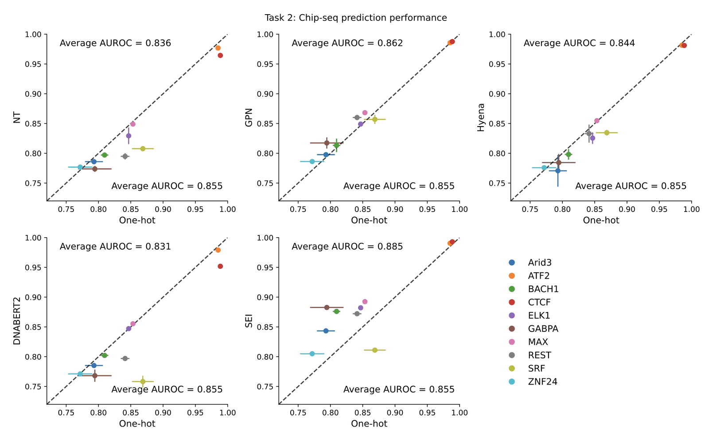

- One-hot 서열로만 학습된 CNN이 DNABERT2, HyenaDNA, Nucleotide Transformer의 임베딩을 사용한 모델보다 더 나은 성능을 보임
- gLM중 커스텀 GPN만이 가끔씩 더 나은 성능을 보여줌
- Sei의 매우 높은 성능  → 사전 학습 과정에 이미 해당 태스크가 포함되어 있었던 Data Leakage에 대한의문

One-hot 인코딩이 gLM 임베딩과 비슷하거나 더 나음 **= gLM이 사전 학습 중에 TF 모티프에 대한 명시적인 정보를 능동적으로 학습하지 않았음을 시사**

gLM 임베딩은 단지 하위 모델(CNN 등)이 모티프를 스스로 학습할 수 있도록 Low level의 서열 정보를 유지하고 있을 뿐이며, 이는 아무런 생물학적 정보가 없는 One-hot 서열과 다를 바 없는 역할을 수행하고 있다는 의미

---

***CNN이 아니라 CLS를 사용하는 MLP였으면 달랐을까? ***= gLM이 잘 요약할 수 있을까?

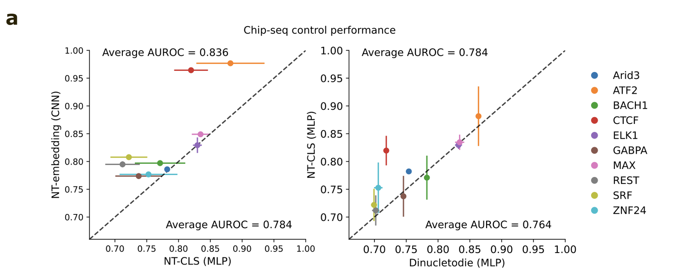

gLM이 서열의 의미를 요약했다는 **CLS**의 유효성을 검증하기 위해 대조 실험을 진행

- <b>CNN vs CLS: </b>CNN이 CLS 토큰을 사용한 MLP보다 높은 성능냄
- <b>Bag-of-dinucleotide VS</b> <b>CLS: </b>토큰 모델은 기초 통계 모델과 성능이 비슷함 → 이는 CLS 토큰이 고차원적인 생물학적 의미를 담기보다는, 저수준의 통계 수치보다 아주 조금 더 나은 수준임을 의미 Bag-of-dinucleotide: 단순히 염기쌍(AA, AC, ...)의 빈도만 센 아주 기초적인 통계 모델

CNN은 사전 학습된 gLM의 도움 없이도 서열로부터 직접 모티프 특징을 학습할 수 있으며, 이 방식이 훨씬 일관되게 높은 성능을 냄

CNN이 전체 임베딩에서는 유효한 패턴을 찾아낼 수 있지만, 요약된 CLS 토큰만으로는 그 패턴을 찾아내지 못했다는 사실이 gLM 요약 기능의 한계를 명확히 보여줌

---

### Task3

돌연변이의 결과 예측 → 비부호화 영역 돌연변이가 가져올 기능적 결과를 예측하는 것

- 기존의 Nucleotide Transformer(NT)나 GPN은 결과가 있긴 하지만, 기존의 연구에서는 대부분 변이 유무만 따지는 이진 분류 작업에 그침 → 세포 유형에 대한 정보 없이 전체 genome으로만 학습된 gLM이, 어떻게 세포마다 다르게 나타나는 변이 효과를 맞출 수 있을지(Zero-shot)는 여전히 의문

#### Task3 실험

**CAGI5 챌린지** 데이터를 사용하여 gLM이 변이 효과를 얼마나 정량적으로 잘 예측하는지 확인

- **대상 모델**: Nucleotide Transformer, GPN, HyenaDNA.
- **데이터**: HepG2 세포(3개 CRE)와 K562 세포(1개 CRE)에서 측정된 MPRA 데이터.
- **평가 지표**: 모델이 예측한 점수와 실험으로 측정된 실제 변이 효과 사이의 피어슨 상관계수(Pearson correlation coefficient)를 계산 피어슨 상관계수를 보겠다 = 변이에 따른 변화의 경향성을 보겠다

모델의 특성에 따라 서로 다른 수학적 접근법을 사용해 점수로 활용

- <b>NT & Hyena: <b>야생형(Wild-type) 서열과 돌연변이(Mutant) 서열을 각각 모델에 넣었을 때 나오는 </b>임베딩 벡터 사이의 코사인 유사도</b>를 계산하여 변이 효과 점수로 활용
- **GPN**: 단일 뉴클레오타이드를 마스킹한 후, 모델이 예측한 야생형 대비 돌연변이 염기의 확률 로그 비(log2-ratio)를 계산하여 점수로 활용

<b>NT는 <b>6-mer 토큰을 사용하고 </b>HyenaDNA</b>는 아주 긴 문맥을 벡터로 담아냄.<b>  <b>만약 A→G로 한 글자가 바뀌면, 그 글자가 포함된 토큰 자체가 아예 다른 것으로 바뀜.  이 모델들에게 특정 위치에 A가 올 확률을 묻는 것보다, 원래 서열 벡터와 변이 서열 벡터 사이의 각도를 묻는 것이 모델의 임베딩 능력을 가장 잘 활용하는 방법임.  </b>GPN<b>은 </b>MLM (Masked Language Modeling)</b>으로써 설계 목적 자체가 특정 자리에 어떤 염기가 오는 것이지를 맞추는 모델임. GPN에게는 굳이 복잡하게 벡터 사이의 각도를 재는 대신, 모델이 원래 염기를 선택할 확률과 변이 염기를 선택할 확률 비율을 보는 것이 훨씬 정확함.

#### Task3 실험 결과

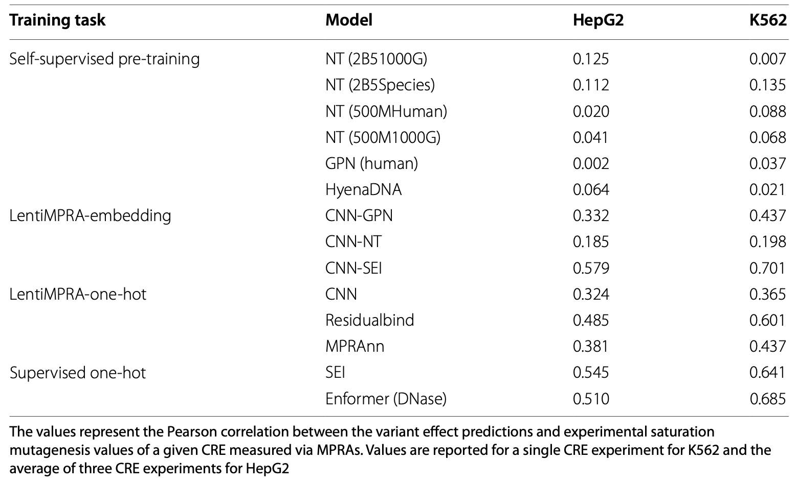

- gLM은 zeroshot 예측에 거의 실패함
- 3,202명의 인간 genome과 850종의 생물 genome을 학습한 Bert 기반 2.5B 파라미터의 Nucleotide Transformer조차 제로샷 예측에서는 무력  **→ 모델의 크기를 키우고 더 많은 데이터를 쏟아붓는 것만으로는, 세포마다 다르게 나타나는 정교한 유전체 조절 논리를 깨우치기에 부족함**
- CNN의 Finetuning을 거치게 되면 좋은 성능을 보이게 됨 ← gLM 임베딩을 입력으로 받아 lentiMPRA 데이터로 학습시킨 CNN 모델들은 사전 학습 상태의 모델들보다 훨씬 나은 성능을 보임

그럼에도 gLM 방식은 기존의 강력한 지도 학습 모델들과 비교했을 때 여전히 큰 격차를 보임

- One-hot 서열을 직접 학습한 **Enformer**와 **Sei**는 gLM 기반의 그 어떤 CNN 모델보다 뛰어난 성능을 보여줌
- **Sei의 임베딩을 입력으로 받아 lentiMPRA 데이터로 학습시킨 CNN** 모델에서 나왔습니다. 이는 고도로 정제된 지도 학습 기반의 특징(Sei)이 단순한 서열 정보보다 더 강력할 수 있음을 보여줍니다.

→ gLM들이 보여주는 제로샷 성능은 최신 기술(State-of-the-art)과 비교했을 때 심각한 수준의 격차

---

***gLM의 직접 가중치를 변경하는 것도 좋은 성능을 보일까?***

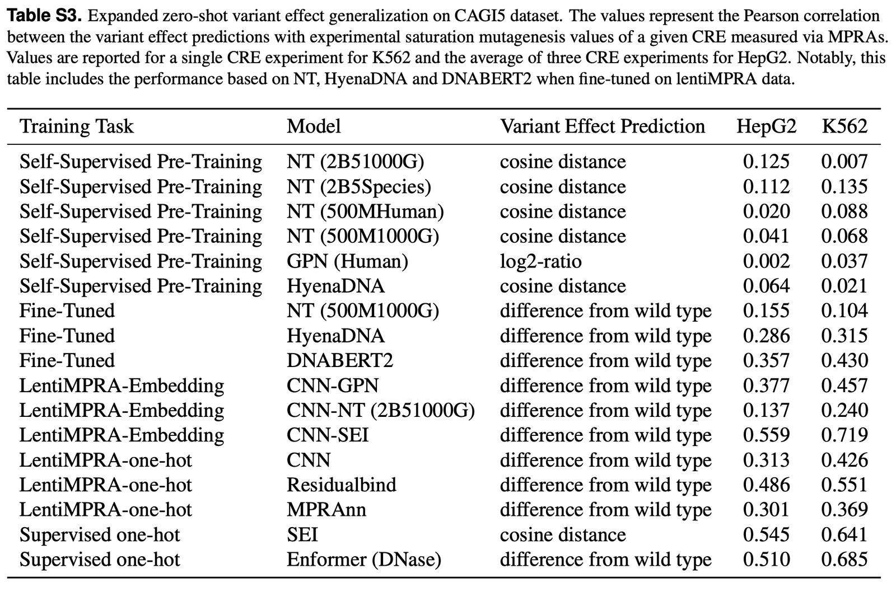

gLM의 가중치를 직접 업데이트했을 때도 성능 향상이 관찰

→ gLM 안에 아주 기초적인 정보는 들어있을지 모르나, 이를 실제 예측에 활용하려면 추가적인 학습이 필연적임

→ gLM들은 인간 유전체의 조절 영역을 해석하고 변이 효과를 예측하는 진정한 의미의 파운데이션 모델이라고 불리기에는 성능이 부족함

### Task4

RNA‑seq data로부터의 대안적 스플라이싱(Alternative Splicing)

- 이전 연구들(Nucleotide Transformer, GPN)에서 이 모델들이 유전자 정의(gene definition)나 스플라이싱 부위(splice sites)와 관련된 속성들을 이미 어느 정도 학습했음을 보여줌  → 따라서 연구진은 전체 genome으로 사전 학습된 gLM들이 DNA 조절 태스크보다 RNA 조절 관련 태스크에서 더 유익한 정보(embeddings)를 제공할 것이라고 추측했습니다.

DNA 조절 Task는 세포가 현재 어떤 상태인지(크로마틴이 열린 정도 등)가 결정적임.  서열은 똑같은데 환경에 따라 답이 변함. RNA 조절 Task: DNA가 RNA로 복사된 이후의 과정은 상대적으로 서열 안에 답이 정해져 있는 경우가 많음. (스플라이싱은 RNA 서열에 박혀 있는 특정 신호를 보고 잘라냄)  어느 세포에서든 그 서열을 만나면 비슷하게 작동함.  gLM은 서열만 공부했지 세포 환경은 모르잖아? 그러니까 환경을 많이 타는 DNA Task보다는, 서열 속에 답이 있는 RNA 태스크를 더 잘 맞추겠지!

#### Task4 실험

- RNA-seq 데이터로 측정된 **ASCOT 데이터셋**을 활용하여 mRNA의 대안적 스플라이싱 예측 **ASCOT**은 **Alternative Splicing Catalog of Tissues**의 약자로, 몸의 다양한 조직에서 RNA 스플라이싱이 어떻게 다르게 일어나는지 정리해둔 데이터 - 간과 생쥐의 수많은 조직에서 어떤 서열 조각(Exon)이 얼마나 포함되었는지를 수치로 기록
- 56개 조직에 걸친 PSI(Percentage-Spliced-In, 엑손 포함 비율) 수치를 예측하는 다중 작업 회귀(multi-task regression) 과제
- 스플라이싱이 일어나는 두 지점의 서열을 입력으로 사용
    - 수용체(Acceptor) 부위: 상류 300nt + 하류 100nt 서열 (인트론이 끝나고 다음 엑손이 시작되는 절단 지점)
    - 공여자(Donor) 부위: 상류 100nt + 하류 300nt 서열 (엑손이 끝나고 인트론이 시작되는 절단 지점)
- 앞선 DNA 분석과 마찬가지로, 베이스라인 CNN 모델을 사용함
    - CNN은 gLM에서 추출한 전체 임베딩(full embeddings) 또는 비교 대상인 사전 학습된 지도 학습 모델의 임베딩을 입력받아 학습

#### Task4 실험 결과

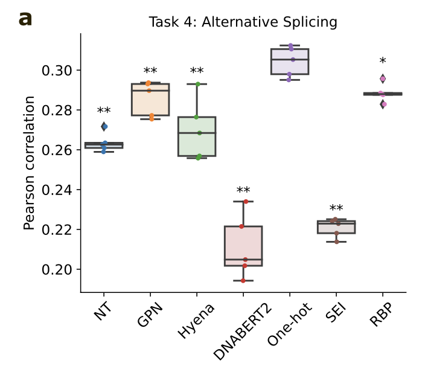

- DNA 조절 Task과 마찬가지로, gLM 임베딩을 사용한 모델들은 One-hot<b> </b>인코딩 기반 모델보다 성능이 낮음 → 범용적으로 학습된 gLM이 RNA 스플라이싱이라는 복잡한 조절 과정을 설명하기에는 여전히 구체적인 정보가 부족하다는 점을 다시 한번 확인해줌
- DNA 조절 작업에서는 강력했던 Sei의 임베딩이, RNA 스플라이싱에서는 대부분의 gLM보다도 현저히 낮은 성능을 보임 ← Sei는 크로마틴이나 DNA 결합 위주(DNA-based functional genomics)로 사전 학습되었기 때문. 즉, DNA 수준의 특징들은 RNA 조절(스플라이싱)로 잘 전이(Transfer)되지 않는다는 생물학적 차이를 명확히 보여줌

---

***그렇다면 RNA 지식을 직접 가르친 모델은 어떨까?***

- 120개의 RNA 결합 단백질(RBP) 결합 부위 데이터(eCLIP-seq)를 사용하여 **ResidualBind 형태의 멀티태스크 모델**을 학습 RBP는 RNA의 단백질 생성 과정에서 품질 및 유통 제어 (편집, 수송, 번역) eCLIP-seq: K562라는 표준 혈액 세포선 내에 존재하는 120종의 서로 다른 RBP 결합 정보  1,000nt 길이의 RNA 서열 하나를 입력했을 때, 120개의 단백질 각각에 대해 "붙는다(1)" 혹은 "안 붙는다(0)"라는 라벨이 붙어 있는 형태. 마치 120개의 서로 다른 이진 분류 문제를 동시에 해결 
    
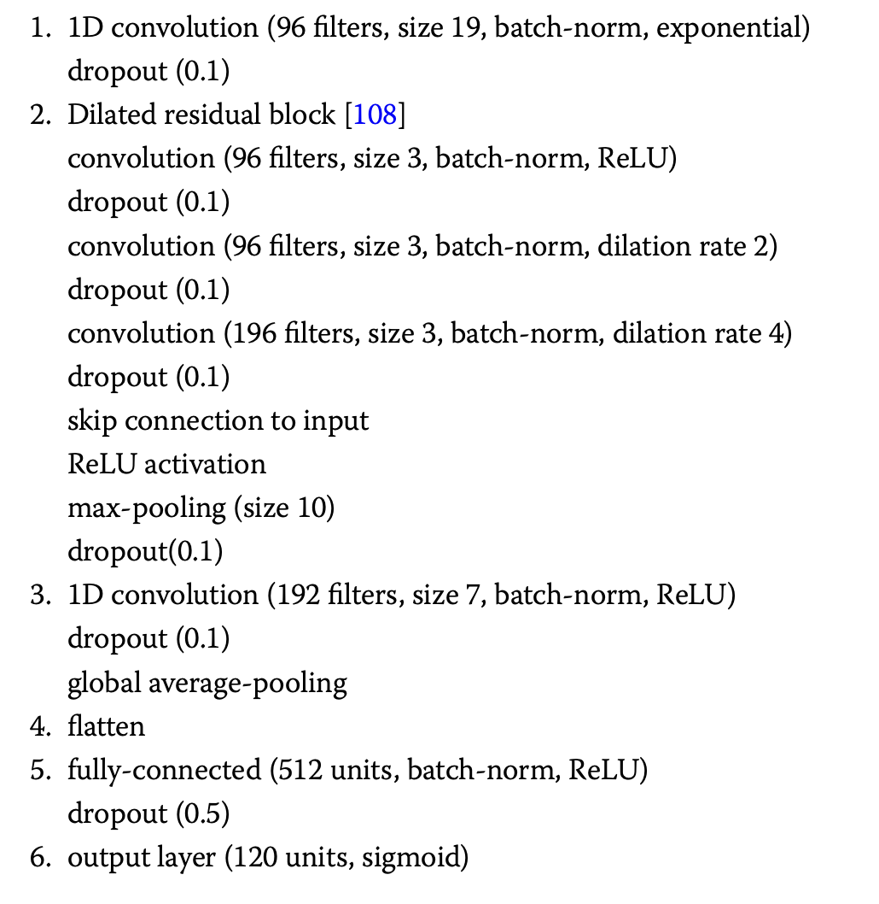

    
RPB 모델 파이프라인

- **RBP 특화 모델의 임베딩**은 gLM들보다 **월등히 좋은 성능**을 기록함 → 범용적인 사전 학습보다, 해당 도메인(RNA)에 밀접한 관련이 있는 작업을 통해 배운 특징이 훨씬 더 유익하다는 것을 보임
- 여러 gLM 중 **GPN**만은 예외적으로 RBP 특화 모델과 **대등한 성능**을 보임. → 이는 GPN의 아키텍처(Conv 기반)나 학습 방식이 스플라이싱 부위와 같은 RNA 수준의 특징을 포착하는 데 다른 모델들보다 더 적합했을 가능성을 시사

---

### Task5

**RNA 중합효소 II(RNA pol II)의 신장(Elongation) 잠재력 예측하기**

→ 데이터가 부족할 때 gLM의 진가가 발휘될까?

- 딥러닝 모델은 데이터가 많을수록 유리함. 하지만 실제 생물학 실험에서는 샘플을 얻기 힘든 경우가 많음  → 아무것도 모르는 상태인 **One-hot** 방식은 데이터가 적으면 패턴을 배우기 전에 데이터를 통째로 외워버리는 과적합에 빠지기 쉽지 않을까? 반면에 이미 유전체 문법을 공부한 **gLM**은 적은 데이터로도 핵심을 짚어낼 수 있지 않을까? 라는 추측

#### Task5 실험

- RNA 중합효소 II(RNA pol II)의 신장(Elongation) 잠재력을 예측하는 것  = 유전 정보가 RNA로 전사되는 과정에서 중합효소가 얼마나 잘 나아가는지를 나타내는 수치  RNA 중합효소 II(RNA pol II)가 전사를 시작한 직후(보통 20\~60bp 지점), 여러 가지 이유(서열의 복잡성, 물리적 구조 등)로 인해 멈춰버리거나 DNA에서 떨어져 나가는 현상이 빈번하게 발생함. 여기서 일시 정지 상태를 뚫고 유전자의 끝까지 완주할 수 있는 능력(Elongation Potential)을 의미하며, 잠재력이 높을수록 막힘없이 RNA 전사가 일어남.
- INSERT-seq dataset으로 173개 뉴클레오타이드(nt) 길이의 RNA 서열을 사용함. 데이터는 10774개의 서열로 구성됨 → 개수가 적음

전체 과정

1. 프로모터가 중합효소를 불러모음
2. 중합효소가 173nt를 통과하려고 시도함
3. 무사히 통과한 녀석들만 뒤에 있는 바코드를 찍어냄
4. 결국 gLM이 173nt 서열의 꼬임 정도나 물리적 성질을 보고 바코드의 개수 예상하는 Task

= 데이터가 아주 적은 환경이라면, 과연 gLM 임베딩이 One-hot seq 방식보다 확실한 우위를 점할 수 있는가?

#### Task5 실험 결과

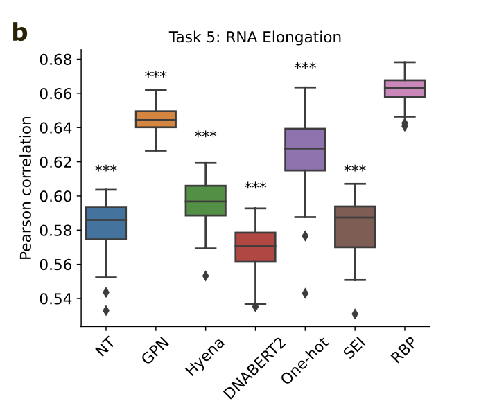

- 다른 과제들과 마찬가지로, gLM 임베딩을 사용한 베이스라인 CNN 모델들은 대부분 One-hot RNA 서열을 직접 사용한 모델보다 성능이 낮음
- **커스텀 GPN** 모델만은 One-hot 방식보다 약간 더 나은 성능을 보여줌

<b>→ </b>DNA에 특화된 Sei는 성적이 가장 나빴던 반면, RNA-단백질 결합을 공부한 RBP 지도학습 모델의 임베딩이 가장 좋은 성적을 거둠.  어떤 지식을 배웠느냐가 응용에서 중요하다는 의미

---

***데이터 양이 더 줄어들면 gLM이 배운 사전 지식이 One-hot 방식을 압도하지 않을까?***

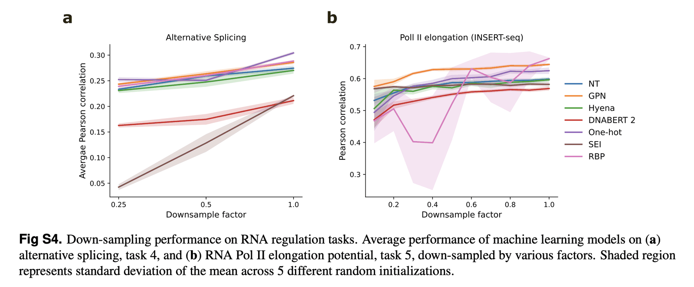

- 대안적 스플라이싱(Task4)과 INSERT-seq 데이터셋(Task5)의 크기를 의도적으로 더 줄여서 모델들을 다시 학습시킴
- 데이터 양이 매우 적은 상황에서는 GPN 임베딩이 One-hot 방식을 포함한 다른 모든 방식보다 일관되게 좋은 성능을 냄
    - 데이터가 적을 때는 사전학습한 gLM이 genome의 특정 영역에서 더 효과적으로 전문화될 수 있음
    - 논문에서는 이 데이터셋에서 성능을 결정하는 가장 핵심은 5′ 스플라이스 부위 (Donor site)를 포착하는 능력이라고 언급.  GPN은 사전 학습 과정에서 이 특징을 매우 잘 습득했기 때문에, 데이터가 부족한 상황에서도 이를 바탕으로 정확한 예측을 할 수 있었던 것으로 추정
        - NT나 Hyena는 너무 넓은 문맥(Global context)을 보느라, 정작 스플라이싱에 필요한 모티프 신호를 뭉개버렸을 가능성이 큼

→ 단순히 genome 전체를 학습시키는 것이 모든 하위 작업에 만능은 아님

<b>→ </b>gLM이 어떤 특징을 잘 배우고 있는지(예: GPN의 스플라이싱 부위 포착 능력)를 먼저 이해해야, 그 모델이 실력을 발휘할 수 있는 적절한 하위 작업을 찾아 연결해 줄 수 있음

데이터가 많을 때는 모델이 스스로 배울 수 있게(One-hot) 두는 것이 좋지만, 데이터가 극도로 부족할 때는 전문 지식을 미리 배운 모델(GPN)의 도움을 받는 것이 유리함

---

### Task6

**RNA 결합 단백질(RBP, RNA-binding protein)의 결합 부위 예측**

← RNA 결합 단백질(RBP)은 RNA가 만들어지고, 편집되고, 단백질로 번역되는 모든 과정(RNA processing stages)에서 필수적인 역할임

#### Task6 실험

- 주어진 서열이 eCLIP-seq에서 확인된 결합 피크(peak)인지 아닌지를 맞추는 이진 분류<b> </b>과제입니다. eCLIP-seq 데이터는 게놈 타임라인 위에 솟아오른 피크(Peak) 형태
- 200개 뉴클레오타이드(nt) 길이의 DNA 서열을 입력으로 사용
- 10가지 RBP에 대한 데이터를 사용하여 모델의 범용성을 테스트 진행
- 다양한 서열 인코딩 방식(gLM 임베딩 vs One-hot 서열)을 입력으로 받는 **베이스라인 CNN** 모델을 학습시켜 성능을 비교

= gLM이 DNA 수준의 결합(Task 2)뿐만 아니라, RNA 수준에서 일어나는 단백질과의 결합 패턴도 임베딩 안에 잘 담고 있을까?

#### Task6 실험 결과

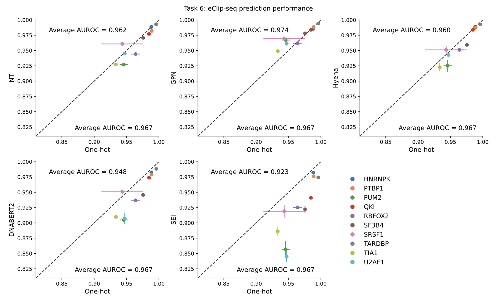

- 전체 gLM 임베딩을 사용하여 학습시킨 CNN 모델들은 One-hot 서열을 사용한 모델보다 평균적으로 약간 낮은 성능을 기록
- DNA 수준에서 TF 결합을 예측했던 Task2의 결과와 일치  → DNA든 RNA든 단백질 결합 예측에서 gLM은 단순 서열 정보(One-hot)를 압도 못함
- **Sei**의 임베딩은 이 RNA 작업에서 성능이 대폭 하락
    - 이는 적절한 pre-training tasks을 선택하는 것이 얼마나 중요한지를 다시 한번 강조하는 결과 → DNA의 크로마틴 구조를 잘 아는 것으로는RNA 수준에서 일어나는 결합 규칙을 설명하기에는 부족하다는 의미

<ins>**그럼에도 모티프 정보가 없지는 않다**</ins>

RNA의 모티프는?<ins>** **</ins>**서열 모티프 (Sequence Motif):** DNA와 마찬가지로 특정 RBP가 선호하는 선형적인 염기 서열 패턴 **구조적 모티프 (Structural Motif):** RNA는 스스로 접히기 때문에, 서열뿐만 아니라 **고리(Loop)나 줄기(Stem) 같은 3차원 모양** 자체가 모티프가 되기도 함

- gLM 임베딩 모델과 One-hot 모델 사이의 성능 격차가 매우 좁음

→ 이는 gLM이 사전 학습 과정에서 RNA 결합 단백질(RBP)이 인식하는 모티프 정보를 완전히 잃어버리지는 않았음을 의미. 다만, One-hot 방식보다 더 효과적으로 활용할 수 있는 고차원적 지능까지는 도달하지 못했을 뿐

*원-핫 벡터보다 덜 효율적이다라는 의미? 아니면 CNN의 과정이 부족하거나 Fit하지 않은건 아닐까..?*

---

<b>CLS 토큰 재확인  → gLM은 잘 요약할 수 있을까? </b>

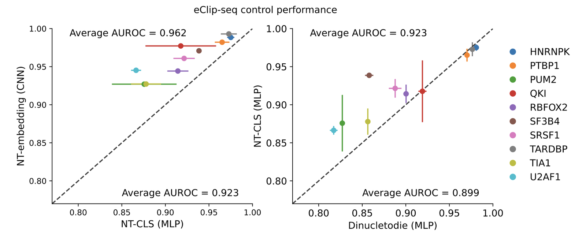

- MLP를 사용하는 CLS 토큰이 CNN 사용했을 때보다 현저히 낮은 성능을 기록
- 단순히 염기쌍 빈도(dinucleotide frequencies)만 계산한 기초 모델과도 비교 (오른쪽 그래프)
    - Nucleotide Transformer의 **CLS 토큰**을 사용한 모델이 기초 통계 모델보다 **약간 더 나은 성능**을 보임
    - gLM 임베딩이 RNA 조절 영역에서 단순한 통계 수치보다는 약간 더 정보력이 있는<b> </b>내용을 담고 있다는 것을 의미

현재의 gLM은 원본 서열 정보를 그럭저럭 잘 보존하고 있고, 기초적인 통계보다는 똑똑한 위치. 하지만 세포 특이적인 조절 논리를 꿰뚫어 보는 파운데이션 모델이 되기에는 아직 학습 방식이 너무 일반적이며, 도메인 특화된 학습이 병행되어야만 실제 SOTA 모델들을 넘어설 수 있을 것이라고 예상함

### **속성 분석(Attribution Analysis)**

#### Attribution Map

→ 도대체 DNA의 어떤 부분(모티프)을 보고 판단하는가?

gLM은 자연어 모델과 유사한 구조를 가지므로, 특정 위치를 가렸을 때 모델이 얼마나 당황하는지를 측정하는 방식을 사용함

- 분석 방법: 서열의 입력 토큰을 하나씩 순차적으로 Masking
    - GPN은<b> </b>단일 뉴클레오타이드(1bp) 단위로 가림
    - Nucleotide Transformer은 겹치지 않는 k-mer 단위로 가림

    이 둘이 MLM이라서 보는 것 같음
- **지표 (ΔEntropy)**: 가려진 토큰에 대해 모델이 예측한 확률 분포의 **엔트로피**를 계산함
    - 전체 서열 중 최대 엔트로피 값에서 각 위치의 엔트로피 값을 뺀 값을 사용함  → 이 값이 클수록 해당 위치의 염기가 모델에게 매우 중요한 정보를 제공하고 있다는 의미

One-hot 서열로 학습된 CNN 모델에 대해 기울기 보정 살리엔시 맵(Gradient-corrected Saliency Maps)을 생성합니다.

- 입력을 아주 미세하게 바꿨을 때, 출력이 얼마나 변화하는지 기울기를 보는 것 → 기울기가 크다는 것은 중요하다는 의미를 가짐
- 이는 딥러닝 모델이 예측 결과를 내기 위해 입력 데이터의 어느 부분을 가장 중요하게 참조했는지 시각화하는 표준적인 기법

다양한 시스템과 난이도에서 모델의 해석 능력을 포괄적으로 검증하기 두 가지 데이터를 집중적으로 분석

- **lentiMPRA**: 복잡한 조절 규칙이 필요한 데이터
- **CTCF ChIP-seq**: 특정 단백질(CTCF)의 결합 패턴이 명확한 데이터

lentiMPRA는 인핸서의 활성도를 측정합니다. 인핸서는 유전자 발현을 증폭시키는 장치인데, 이 장치는 작동 방식이 훨씬 까다로움 CTCF는 약 15\~20bp 정도의 상당히 길고 보존이 잘 된 특정 서열(모티프)을 좋아해서 이 서열만 있으면 CTCF는 거의 확실하게 달라붙음

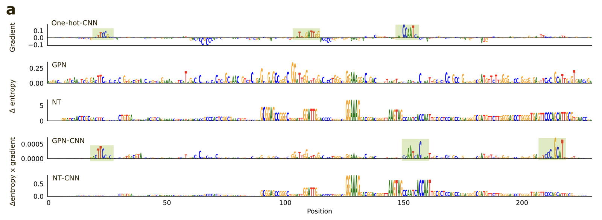

pre trained gLM이 생성한 속성 지도를 분석

- lentiMPRA와 ChIP-seq 데이터 모두에서 사전 학습된 gLM의 속성 지도는 알려진 생물학적 모티프를 전혀 반영하지 못함
- One-hot 서열로 학습된 CNN이 찾아낸 패턴과도 전혀 일치하지 않음

gLM의 Attribution Map이 모티프와 동떨어져 보이는 이유

1. 여러 세포의 모티프가 겹쳐 보이면서 복잡한 지도가 형성되어 개별 세포의 특이적 패턴을 알아보기 힘들 수 있음 = Cell-specificity를 잡아내는 데 실패했다
2. 모델이 생물학적 의미를 배운 것이 아니라, genome 전체에 걸쳐 나타나는 단순한 서열 통계 수치(low-level statistics)를 그대로 암기했기 때문일 수도 있습니다.  Shortcut Learning → 생물학적 로직 대신, 계산하기 훨씬 쉬운 통계적 특징들에 집착

gLM의 임베딩을 입력으로 받아 Task를 수행하는 **하위 CNN 모델의 정보도** 결합해서 확인함

- gLM의 엔트로피 기반 Attribution Map를 하위 CNN에서 계산된 **최대 Gradients 값으로 스케일링**
    ← gLM이 가진 광범위한 정보 중에<b> </b>중요한 정보만 필터링하여 강조한 것

GPN vs. Nucleotide Transformer 이 필터링된 지도를 시각적으로 비교했을 때 흥미로운 차이가 발견

- GPN을 통해 생성된 Attribution Map는 One-hot 기반 CNN의 Map과 시각적으로 매우 일치
- NT는 k-mer 토큰화로 인해 발생하는 블록 형태의 구조적 노이즈를 감안하더라도, GPN만큼 생물학적 패턴과 잘 일치하지 않음

이러한 경향은 다른 유전체 위치에서도 동일하게 관찰

다른 예시

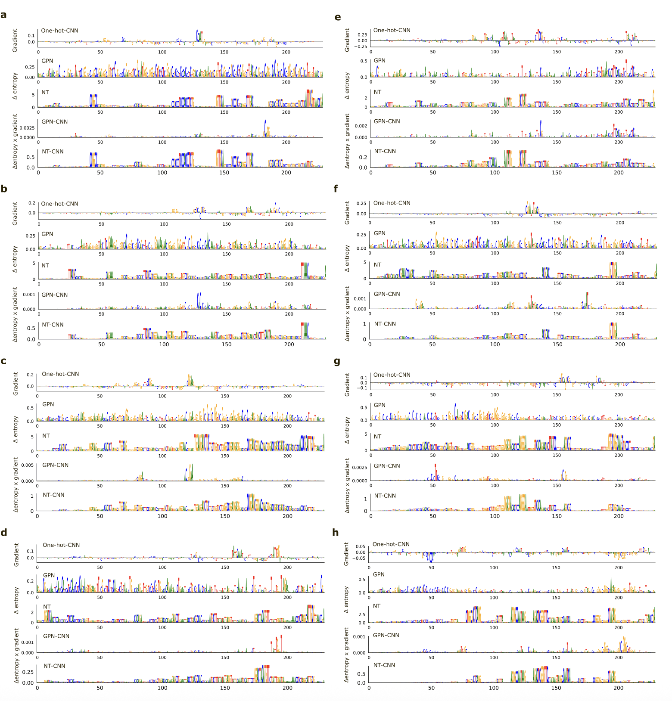

사전 학습된 gLM 자체는 생물학적 모티프를 전혀 인지하지 못하지만, 하위 모델(CNN)과 결합하여 특정 작업에 맞춰 필터링되었을 때 비로소 유의미한 패턴을 보여줌

gLM이 사전 학습만으로는 조절 문법을 완전히 이해하지 못하지만,  GPN과 같은 특정 아키텍처는 하위 모델과 결합했을 때 생물학적 모티프를 찾아낼 수 있는 잠재적인 특징을 더 잘 보존하고 있음을 의미

Nucleotide Transformer 같은 모델은 정보를 너무 덩어리(k-mer)로 처리하거나 요약하는 과정에서 세밀한 조절 신호를 상대적으로 더 많이 놓치고 있을 가능성을 시사

#### GIA(Global Importance Analysis)

모델이 중요하다고 찍은 모티프(패턴)들이 실제로 유전체 기능을 구동할 만큼 강력한지 확인 = Attribution Map에서 찍은 모티프가 실제로 작동할 때도 되는지 확인

- 인핸서 활성이 거의 없는 배경 서열(shuffled sequences)에 모델이 찾아낸 모티프 패턴을 삽입해봄
- One-hot<b> 기반 CNN</b>이 찾아낸 모티프를 넣었을 때가 GPN-CNN이 찾아낸 모티프를 넣었을 때보다 실제 야생형(Wild-type) 활성에 훨씬 더 가깝게 수치를 회복  → One-hot 모델이 학습한 모티프가 다른 맥락 없이 그 패턴만으로도 기능을 발휘하는 능력이 더 뛰어남을 의미

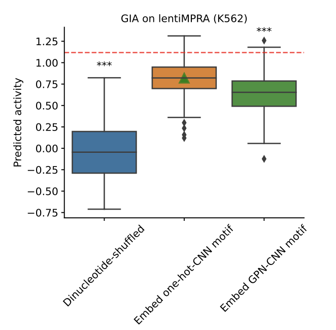

#### 속성 지도(Attribution Map)의 상관관계 분석

One-hot 모델과 서로 다른 모델들이 DNA의 같은 지점을 중요하게 보고 있는지도 확인

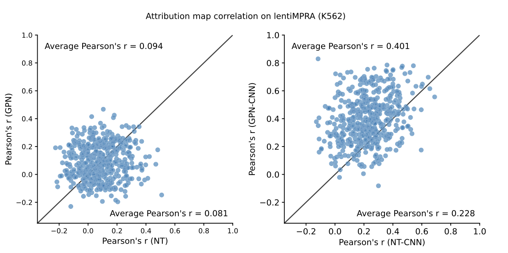

- Pre-trained gLM들은 서로 일치하지 않았을 뿐만 아니라, One-hot 모델과도 전혀 다른 지점을 중요하다고 판단
- 하지만 gLM 임베딩을 입력으로 받아 학습된 CNN들은 One-hot 모델이 찾은 패턴과 훨씬 더 높은 일치율을 보dla

<b>→ <b>gLM은 사전 학습 중에 생물학적 조절 규칙과는 조금 다른 데이터 분포를 배우지만, 하위 모델인 CNN이 이 정보 중에서 </b>세포 특이적인 모티프를 골라내어 재구성</b>할 수 있음을 보여줌

사전 학습된 gLM이 보여주는 속성 지도는 매우 확산된 형태이며, 이는 생물학적 의미보다는 유전체 서열의 low-level statistics를 반영하는 것으로 보임

그럼에도 불구하고, 특히 GPN과 같은 모델의 임베딩은 겉보기에는 무의미해 보여도 하위 모델이 이를 가공하여 세포 특이적 조절 특징을 구축하는 데 필요한 핵심 정보를 담고 있음

---

### 결론

#### 1. CLS 토큰은 유효한가?

모든 과제에서 CLS 토큰을 사용한 모델보다, gLM의 전체 임베딩을 직접 입력받아 학습한 CNN의 성능이 훨씬 뛰어남 → 현재의 gLM이 서열 전체의 복잡한 조절 정보를 CLS 토큰이라는 Bottleneck 안으로 제대로 압축하지 못하고 있음을 시사

CLS 토큰이 담고 있는 정보는 단순히 염기 쌍의 빈도를 센 bag-of-dinucleotide 통계치보다 아주 조금 더 나은 수준에 불과  = CLS 토큰은 고차원적인 생물학적 조절 규칙을 배우기보다는, 서열의 아주 기초적이고 물리적인 특징Low-level properties만 잡고 있다는 뜻

#### 2. Scailing은 답이 아니다.

파라미터가 엄청나게 많은 거대 모델보다 상대적으로 작은 모델들이 더 똑똑한 모습을 보임

- Convolution 기반의 GPN은 훨씬 더 무거운 BERT 스타일 모델보다 유전체 비부호화 영역에서 더 유익한 표현형을 생성
- 가벼운 SSM인 HyenaDNA는 GPN과 대등한 성능을 보였으며, 덩치가 큰 파운데이션 모델들을 지속적으로 압도

GPN과 HyenaDNA는 다른 gLM보다 파라미터 수가 현저히 적음 → 이는 유전체 조절 분야에서 무조건 모델 크기를 키우는 Scaling이 정답이 아님을 시사

- GPN의 **컨볼루션 구조**는 국소적인 패턴(모티프)을 감지하는 데 도움을 줍니다. 이는 신호가 sparse하고 변동성이 큰 비부호화 서열에서 매우 유용

즉, 유전체라는 데이터의 물리적 특성에 맞는 아키텍처 설계가 단순히 거대 모델을 가져다 쓰는 것보다 훨씬 효율적

#### 3. 왜 gLM이 인간의 비부호화 영역에서는 고전하는가?

- Focused Pre-training의 효과
    - 전체 genome을 학습시키는 것보다 코딩 영역(유전자), UTR(비번역 지역), 프로모터 등 특정 기능이 명확한 지역만 골라 학습시킬 때 성적이 더 좋았음 ← 전체 genome으로 확장하면 이런 핵심 신호들이 희석되어 버리기 때문
- 코딩 영역 vs. 비부호화 영역의 "문법" 차이
    연구진은 유전체를 하나의 언어로 볼 때, 두 영역의 문법 체계가 완전히 다르다고 지적함

    - **코딩 영역 (단백질 서열)**:
        - 시작과 끝이 분명하고, 2차 구조나 도메인이 같은 High level의 문법이 존재함
        - 종이 달라도 구조가 비슷하게 유지되는 경우가 많아 모델이 규칙을 배우기 쉬움
    - **비부호화 영역 (조절 영역)**:
        - 모티프들이 무작위처럼 보이는 DNA 바다 사이에 아주 sparse하게 흩어져 있음
        - 위치나 세포 유형에 따라 규칙이 제각각이고, 종 간에 보존되는 성질도 매우 낮음
        - 유전자의 순서가 유지되는 성질도 비부호화 영역에서는 쉽게 무너짐 전위 인자 개입, 역위, 중복, 삭제 등 
- 비부호화 영역의 대부분은 모델 입장에서 무작위 서열(random nucleotides)처럼 느껴질 것임 → 단순히 해당 데이터를 **통째로 외워버리는 Memorization**방식으로 대응하게 됨

모든 염기 위치를 동일하게 중요하게 취급하는 현재의 gLM 방식으로는, 의미 없는 노이즈를 예측하는 데 모델의 역량을 낭비하게 되어이해에 도달하기 어려움 

- 그럼에도 왜 하등 생물(박테리아, 효모 등)에서는 잘 되는가?
    - 박테리아나 애기장대, 효모 같은 생물들은 genome이 매우 조밀하고 junk DNA라고 불리는 비기능적 서열이 훨씬 적음
    - genome이 콤팩트할수록 모델이 배울 수 있는 의미 있는 신호의 밀도가 높기 때문에 gLM이 조절 특징을 더 잘 찾아낼 수 있었던 것 → 인간의 sparse한 경우는 이 방식이 한계에 부딪힘

#### 4. 지도학습 기반 파운데이션 모델 VS 비지도학습 기반 언어 모델(gLM)

***지도학습 기반 모델(Enformer 등)***

최근 각광받는 Enformer같은 모델들이 파운데이션 모델로서의 잠재력을 더 잘 보여줄 수 있다고 인정하면서도, 몇 가지 치명적인 약점을 지적함

- 서열 길이의 불일치함<b> </b>= 이 모델들은 보통 거대한 서열을 입력으로 받음 lentiMPRA(230nt) 같은 짧은 서열 태스크에 적용하려면 문제가 생김 → 짧은 서열을 넣기 위해 남는 공간을 0으로 채우는 제로 패딩(Zero-padding)을 하면 데이터 분포가 틀어지는 공변량 변화가 생길 수 있고, 이를 해결하기 위한 문맥 처리 전략은 계산 비용이 너무 많이 듦
- 이 모델들은 워낙 방대한 실험 데이터를 학습했기 때문에, 평가 데이터와 학습 데이터가 겹쳐서 성능이 부풀려졌을 가능성이 항상 존재함 → 연구에서 SEI가 이와 관련된 예시. 특정 실험 조건에 편향될 가능성이 있음

***pre-trained gLM***

비지도학습 기반 gLM이 매력적인 이유와 실제 성능 사이의 차이를 지적

- 라벨이 없는 데이터를 쓰기 때문에, 지도학습 모델이 놓칠 수 있는 유전체의 일반적인 패턴을 포착할 수 있다는 장점을 가짐
- 현재의 gLM은 세포 특이적인 유전자 조절 작업에서 해당 작업에만 특화된 기존의 소형 맞춤형 모델(Bespoke modeling)보다 나은 점이 거의 없음  → 아직은 조절 유전체학의 Foundation을 충분히 학습했다고 보기 어렵습니다.

단순히 라벨 없는 데이터를 많이 읽히는 것(gLM)만으로는 부족하며, 지도학습 모델처럼 날카로운 판별력을 가지면서도 편향되지 않은 새로운 형태의 파운데이션 모델이 필요함

그럼에도 gLM이 downstream task에 빠르게 적용될 수 있는 점은 충분히 매력적임

#### 5. 결국 생물학적 모티프를 담지 못했다.

- 사전 학습된 gLM의 Attribution maps는 알려진 조절 특징인 모티프와 일치하지 않음.  = 모델이 생물학적으로 의미 있는 모티프를 배운 것이 아니라, 서열 전반에 퍼져 있는 low-level sequence statistics를 반영하고 있을 가능성을 시사

모델이 DNA의 모티프를 배운 게 아니라, 단지 A, C, G, T의 출현 빈도나 결합 확률 같은 기초적인 데이터 분포만 희미하게 파악하고 있다는 비판적인 분석으로 해석 가능

단순히 기존 NLP 도구를 빌려오는 것이 아니라, gLM이 어떤 특징을 인코딩하는지 명확히 할 수 있는 원리적이고 도메인 중심적인 해석 도구와 평가 벤치마크가 개발 필요 (Long-range Interactions 등)

#### 6. NLP 그대로 가지고 와서 써도 되는걸까?

NLP에서는 모델이 커지면 갑자기 추론 능력이 생기기도 하지만, 유전체에서는 단순히 서열을 맞추는 것과 실제 기능을 이해하는 것 사이에 거대한 Semantic gap이 존재함

- NLP의 사전 학습 목표를 유전체에 그대로 가져오는 방식은 비부호화 영역에 대한 깊은 이해를 제공하기 어려움
- 비부호화 genome은 신호가 매우 드물고, 무작위성이 높은 특성을 가짐.  단백질 모델링조차 아미노산 서열만으로는 기능 예측에 한계가 있는데, 구조적 제약이 훨씬 느슨한 비부호화 DNA는 오죽하겠냐고 함

진정한 유전체 파운데이션 모델이 되려면, 단순히 서열만 보는 범용 언어 모델링을 넘어 도메인 기반의 혁신 필요

<b>코멘트</b>

- gLM의 불확실성 + 연구의 불확실성
- S2F 모델에서도?  최신모델도 마찬가지일까? Evo-2 랑 Alphagenome의 위치는? 물량공세의 승리?
- cell specific한 task에 대한 모델의 변화는 필수 → 효율적인 학습?  모델 단에서 효율적으로 건드릴 수 있을까?

