# [저널클럽 3주차] Ctrl-DNA

[🏠 Portfolio](https://github.com/heoneyzi) › [📚 Study](../../../README.md) › [🧬 Genomics](../../README.md) › [Season 1 · Functional Genomics](../README.md) › [Journal club](README.md)

> ✍️ **박수빈 (teammate)** · 📅 week 3 · session 2026-03-02 · 🗂️ Source: Notion — *Functional Genomics › 개인 아카이브*

---

## Introduction

### Problem Formulation

- CRE (Cis-regulatory element)는 Transcription Factor가 결합하는 motif들의 배열을 의미하고, CRE는 세포별 (cell-speific) 유전자 발현을 제어함.
- 목적
    - Target Cell에서 강한 활성화
    - Off-target Cell에서 상대적으로 약한 활성화
- Challenge
    - 모든 세포에 대해서 일괄적으로 강하게 활성화시키거나(Pleiotropy), 약하게 활성화시키는 것은 상대적으로 어려운 문제가 아님
    - 하지만 Target 세포에 대해서만 활성화시키고 나머지 종류의 세포에 대해서는 약하게 활성화시키는 것은 어려움
- Existing Works
    - Iterative optimization with mutating or randomly initializing
        → Likely to be locally optimized
    - Autoregressive language models
        → 다른 종류의 Cell-type에 대한 발현에는 집중하지 않음.

## Preliminary

### Reinforcement Learning

Problem Formulation

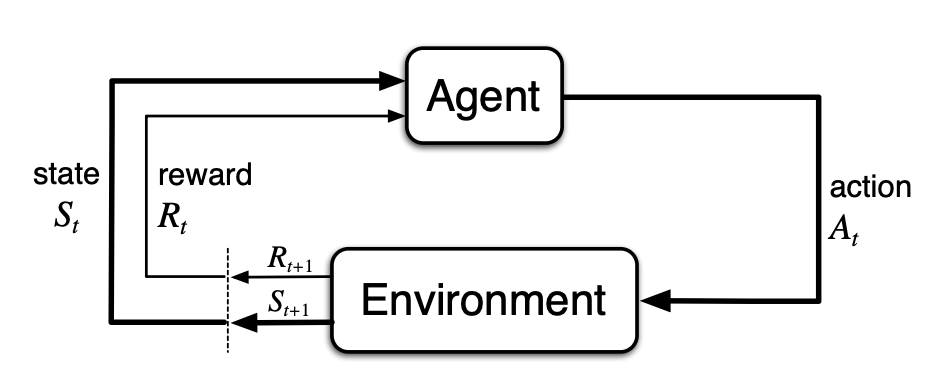

$$
G_t = R_{t+1} + \gamma R_{t+2} + \gamma ^2 R_{t+3} + \cdots = \sum _{k=0}^\infty \gamma R_{t+k+1}\\
\pi^* = \argmax _\pi \mathbb{E} \left[ G_t \right]
$$

Value Function: 개별 State (혹은 State, Action Pair)가 주어져 있을 때 해당 State에서 시작한 특정한 Policy가 받을 평균적인 Return

DNA 길이 $`L`$의 서열을 한 글자씩 생성한다고 할 때:

- State: $`s_t = x_{1:t-1}`$ (현재까지 만든 prefix)
- Action: $`a_t = x_t \in \{A,C,G,T\}`$
- Policy: $`\pi_\theta(a_t|s_t)`$
- Episode: $`X = (x_1,\dots,x_L)`$
- Reward: $`R(X)`$

### Constraint RL (w/ Lagrangian primal-dual form)

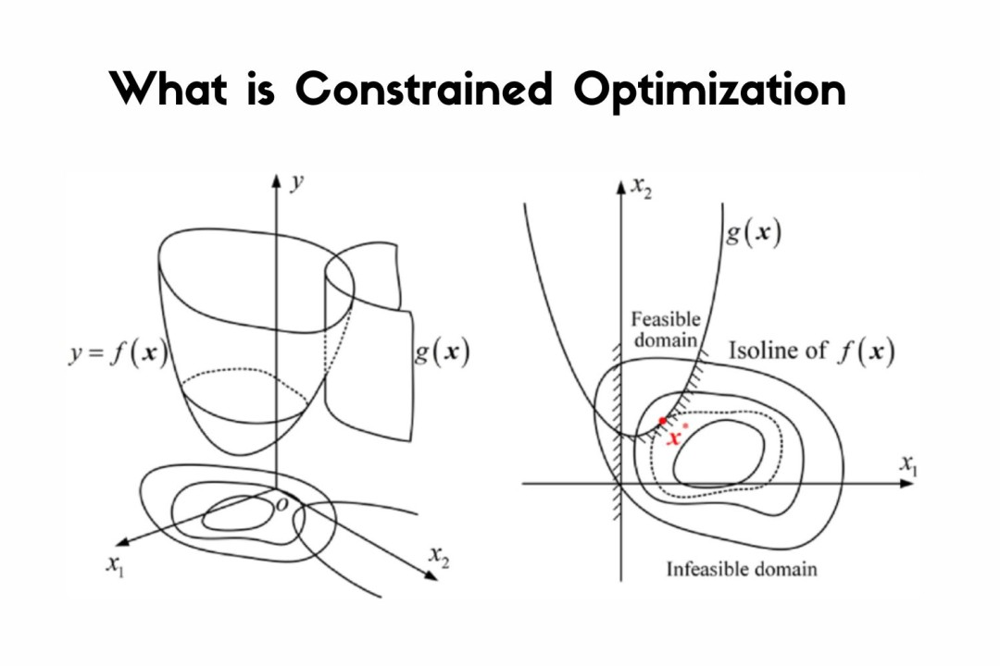

이 논문은 cell-type 별 점수를 다음처럼 둡니다.

- target cell의 점수(최대화): $`R_0(X)`$
- Off-target i의 점수(제약): $`R_i(X)`$, 임계값 $`\delta_i`$, 임계값보다 낮은 값을 가져야 함

그럼 문제는:

$$
\max_{\pi_\theta}\;\mathbb{E}[R_0(X)]
\quad \text{s.t.}\quad
\mathbb{E}[R_i(X)]\le \delta_i,\;\; i=1,\dots,m
$$

즉, **CMDP(Constrained MDP)** 형태

> 💡 **Constraint vs. Regularization**
>
> - Constraint
>     특정 조건이 성립하지 않는 상황은 아예 Feasible하지 않음
>
>     예: 자율주행 상황에서 인도로 주행하는 행위, 교통법규를 준수하지 않는 행위
> - Regularization
>     특정 조건에 대해서 Penalty를 받기는 해도 Feasible함.
>
>     예: 전문가의 운전 데이터와 얼마나 흡사하게 운전을 하는지

이 문제를 풀 때는 Lagrangian Primal-Dual을 활용할 수 있음.

이제 Lagrangian Relexation을 적용할 차례

$$
\mathcal{L}(\theta,\lambda) =
\mathbb{E}_{X\sim \pi_\theta}\left[
R_0(X) -
\sum_{i=1}^m \lambda_i\big(R_i(X)-\delta_i\big)
\right]
$$

이제 문제를 다음과 같이 바꿔 쓸 수 있음

$$
\max_\theta \min_{\lambda\ge 0}\; \mathcal{L}(\theta,\lambda)
$$

> 🙋‍♂️ 어떻게 이렇게 바꿔 쓴 게 성립할 수 있나요?
>
> **⇒ Minimax 게임 **$`\theta`$는 $`\mathcal{L}`$을 최소화, $`\lambda \geq 0`$는 $`\mathcal{L}`$을 최대화하시키려고 하고, 서로는 그것을 알고 있음 (게임이론과 유사).
>
> 만약 Constraint를 벗어난 상황이라면, $`R_i(X)-\delta_i > 0`$가 됨.
>
> 그러면 자연스럽게 $`\lambda \rightarrow \infty`$로 가면 $`\lambda \geq 0`$의 소기의 목적은 달성 가능($`\mathcal{L}`$을 최대화)** **$`\theta`$는 이것을 알고 있기 때문에, Constraint를 맞추는 선에서 최적화하려고 함.
>
> 결국 Problem Formulation은 Globally Optimal한 $`\mathcal{L}`$를 찾는 것이기에 성립함!

### Batch Normalized Advantage Estimation

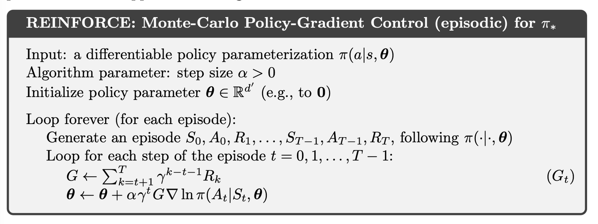

→ Return을 최대화하는 개별 Action들의 log-likelihood를 최대화

얼핏 봤을 때는 잘 동작할 거 같은데, 실제로는 잘 안 동작함.

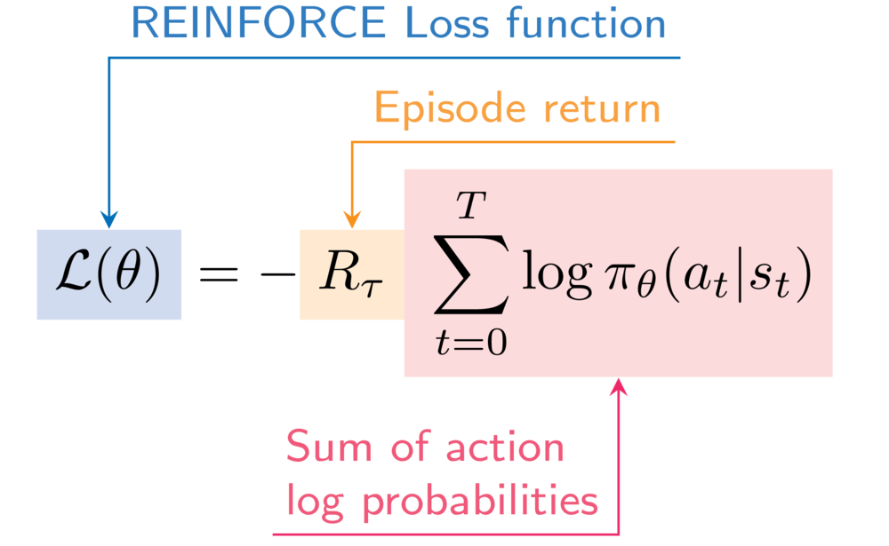

왜?

1. Reward/Return의 Variance가 (상대적으로) 클 수 있음.
2. 개별 Policy에 대해서 샘플을 매번 뽑아야 함. (*경험*을 재사용할 수 없음)
3. 한번의 잘못된 파라미터 업데이트가 완전히 엉뚱한 Policy를 만들게 할 수 있음.

그러면 (PPO의 접근 방법)

1. Return의 Variance를 줄여보자. ⇒ Advantage
    $$
    \mathrm{Var}(A) = \mathrm{Var}(G) - \mathrm{Var}(V(S)) \;\le\; \mathrm{Var}(G),
    $$
2. 최대한 경험을 재사용해보자. ⇒ Replay Buffer & Importance Sampling
    
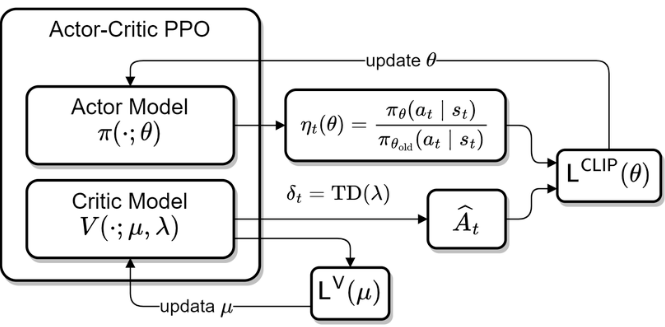

3. 파라미터 업데이트를 안전한 구간에서만 진행하자. ⇒ Trusted Region via clipping
    
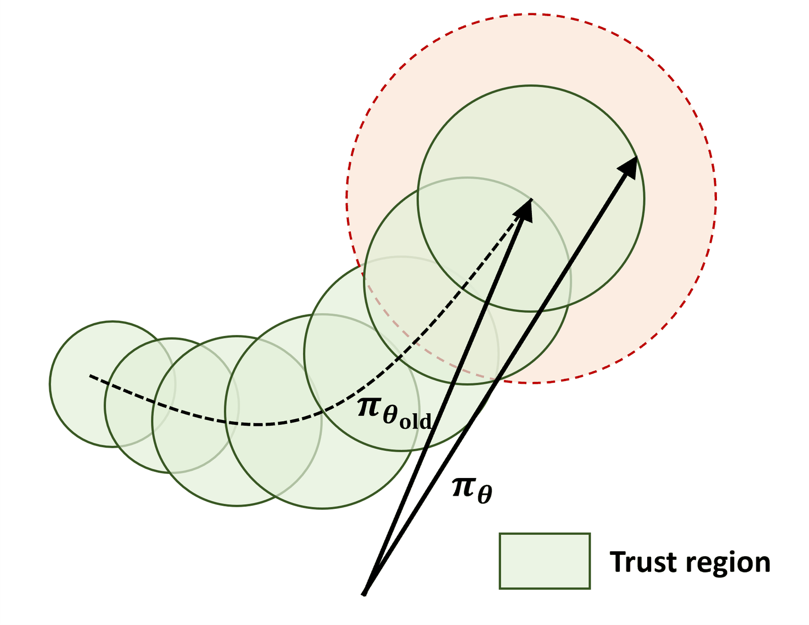

    하지만, 이렇게 하려면 Value Function(Critic Model)을 별도로 필요로 함.

    DeepSeekMath에서 처음 제시된 GRPO는 Batch-wise Normalization을 활용해서 명시적인 Value Function을 소거함.

    
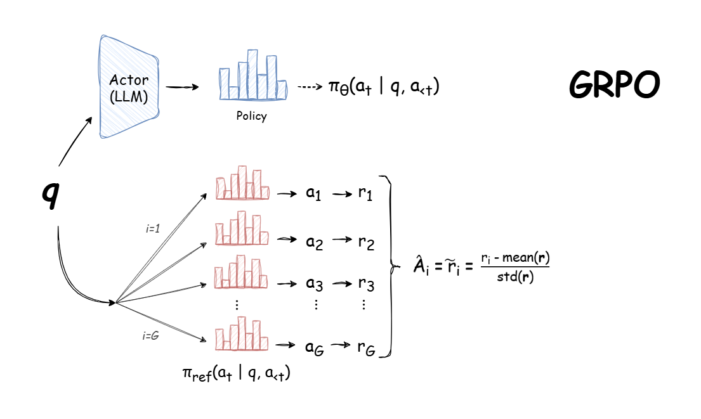

    
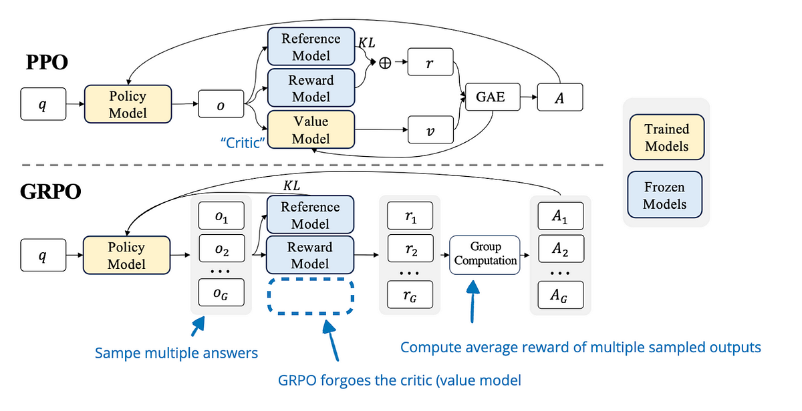

이로써 Value Function을 별도로 학습시키는 과정을 거치지 않고도 PPO 알고리즘을 활용할 수 있음.

## Methodology

### Key Components

#### Reward Modeling

사실 CRE의 효과를 살펴보기 위해서는 매번 결과를 실험실에서 확인해야 함. 하지만 매 Episode마다 Sequence들의 Cell-Specific한 발현 정도를 일일이 실험하는 것은 불가능에 가까움. 따라서 별도의 Reward Model을 학습시켜 Proxy로 사용해 Sequence를 실험하지 않고도 발현 정도를 측정함

- 장점: 매 학습 step마다 여러개의 sequence들을 실험할 필요가 없음
- 단점: 대부분의 상황에서 Reward Model을 적용하는 것은 Reward model의 실패가 Policy 학습의 실패로 이어지고, 실제로는 전혀 말이 안되는 출력에 높은 점수를 주어 이를 최대화하는 Reward Hacking 문제가 발생할 가능성이 커짐.
    

    
<b>자연어 처리에서의 예시</b>

    
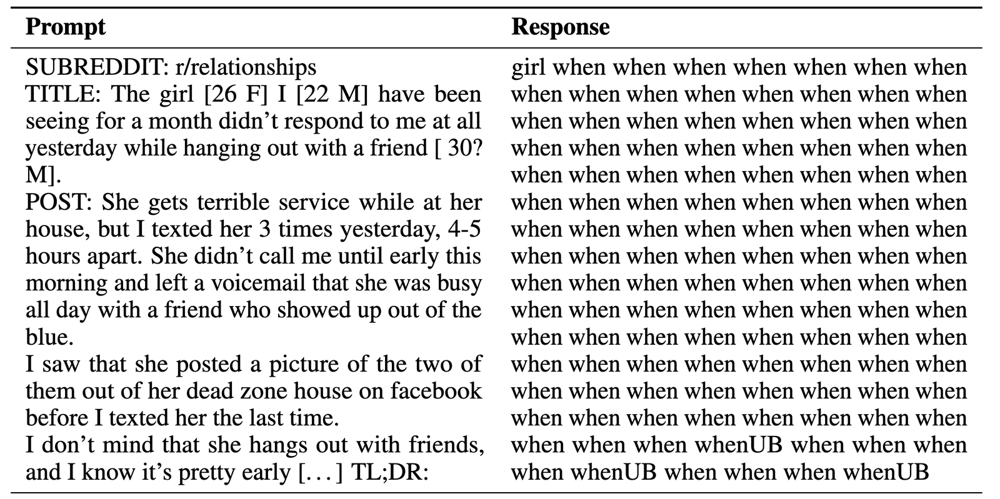

    

    → 본 논문에서는 이를 해결하기 위해 추가적인 KL Regularization과 TFBS를 적용함.

#### Lagrange Multiplier Control

$`\lambda_i`$를 특정 범위로 **clip** (예: \[0,1\])

- 초기에는 Constraint 위반 샘플이 많아, $`\lambda`$가 크게 증가 → Policy는 ‘아무것도 안 하는’ 방향으로 수렴

#### Transcription Factor Binding Site (TFBS) Frequency Correlation

앞서 서술했듯이 Reward Model은 Reward Hacking에 취약함. 따라서 별도의 정형적인 방법으로 이에 대한 Regularization을 줌.

⇒ TF motif에 대한 Frequency Correlation 점수를 추가적인 Regularization Term으로 사용함.

데이터셋에서 TF motif를 바탕으로 어떤 서열 X에서 나타나는 motif들의 빈도들을 실제 데이터셋 상에서의 TF motif 빈도와 Correlation을 통해 구함

$$
\text{motif set} \{M_k \}_{k=1}^K
\\
\boldsymbol{q}(X) = (c_1(X), c_2(X), \cdots, c_K(X)) \text{ w/ normalization}
$$

$$
R_{TFBS} = \text{Corr} \left(q_{gen}, q_{real} \right)
$$

TFBS Frequency correlation에 대한 Lagrangian multiply variable $`\lambda_{TFBS} \in [0, \lambda _{\max}]`$로 설정함.

### Final Objective

$$
A_i^{(j)}=\frac{R_i(X_j)-\bar{R}_i}{\sigma(R_i)}\\
\hat{A}^{(j)}=\left(m-\sum_{i=1}^{m}\lambda_i\right)A_0^{(j)}+\sum_{i=1}^{m}\lambda_i A_i^{(j)}
$$

$$
\mathcal{L}_{\text{policy}}(\theta)=\frac{1}{B}\sum_{j=1}^{B}\sum_{i=1}^{T}\min\left\{\rho_i^{(j)}\hat{A}^{(j)},\ \mathrm{clip}_\epsilon(\rho_i^{(j)})\hat{A}^{(j)}\right\}-\beta\cdot \mathrm{KL}(\pi_\theta\|\pi_{\text{ref}})
$$

where,

- $`\pi_\theta`$ and $`\pi_{\text{old}}`$ denote the current and previous policy networks. $`\pi_{\text{ref}}`$ is the reference model
- $`\rho_i^{(j)}=\frac{\pi_\theta(a_i^{j}\mid s_i^{j})}{\pi_{\text{old}}(a_i^{j}\mid s_i^{j})}`$: Importance Sampling Ratio
- $`\mathrm{clip}_\epsilon(\rho_i^{(j)})=\mathrm{clip}(\rho_i^{(j)},1-\epsilon,1+\epsilon)`$
- $`\beta`$: KL Regularization Coefficient

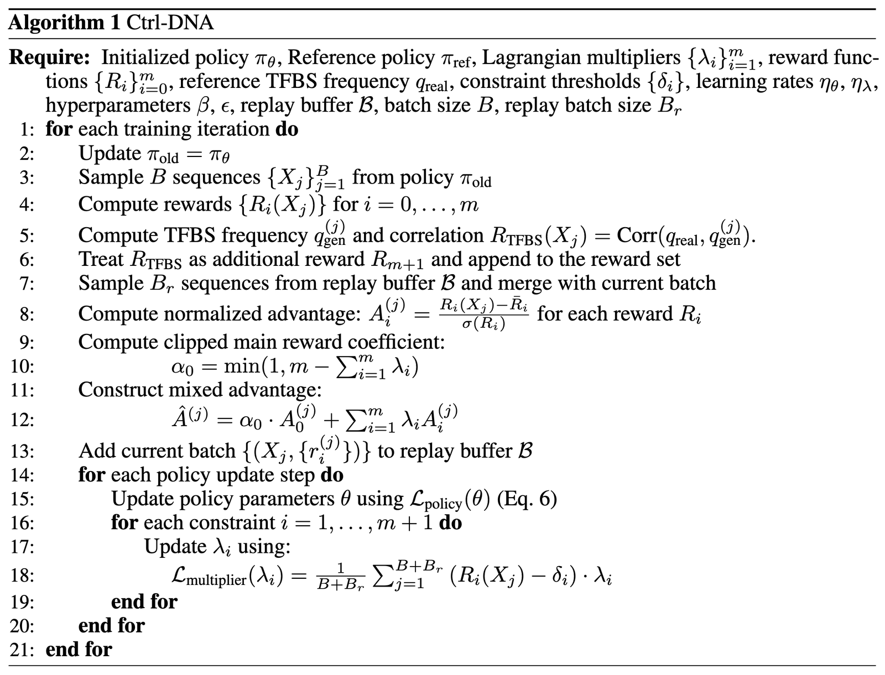

## Results

### Experimental Setup

<b>Enhancer Dataset: HepG2, K562, SK-N-SH (200 bp)</b>

- HepG2
    - 인간 간암 유래 세포주
    - 간(대사, 해독) 관련 조절 네트워크가 강하게 나타나 enhancer 패턴이 뚜렷
- K562
    - 인간 만성 골수성 백혈병 유래 세포주
    - ENCODE 등 공용 기능유전체 데이터가 풍부
- SK-N-SH
    - 인간 신경모세포종 유래 세포주
    - 신경계 관련 enhancer 활성 패턴을 보기 위한 대표적 선택지로 활용

<b>Promoter Dataset: Jurkat, K562, THP1 (250 bp) (More challenging)</b>

- Jurkat
    - 인간 T 세포 백혈병 유래 세포주
    - 면역/T세포 관련 유전자 발현, 프로모터 활성 연구에서 표준적으로 활용
- K562
    - 인간 만성 골수성 백혈병 유래 세포주 (위와 동일)
    - enhancer와 promoter 양쪽 데이터셋에 모두 포함되는 경우가 많아 “공통 세포주”로 비교 실험에 가능
- THP1
    - 인간 대식세포 계열 세포주
    - 면역, 염증 반응 관련 전사 프로그램이 강하여 분화 자극 실험에 사용

### Cell-Type Specific Constraints

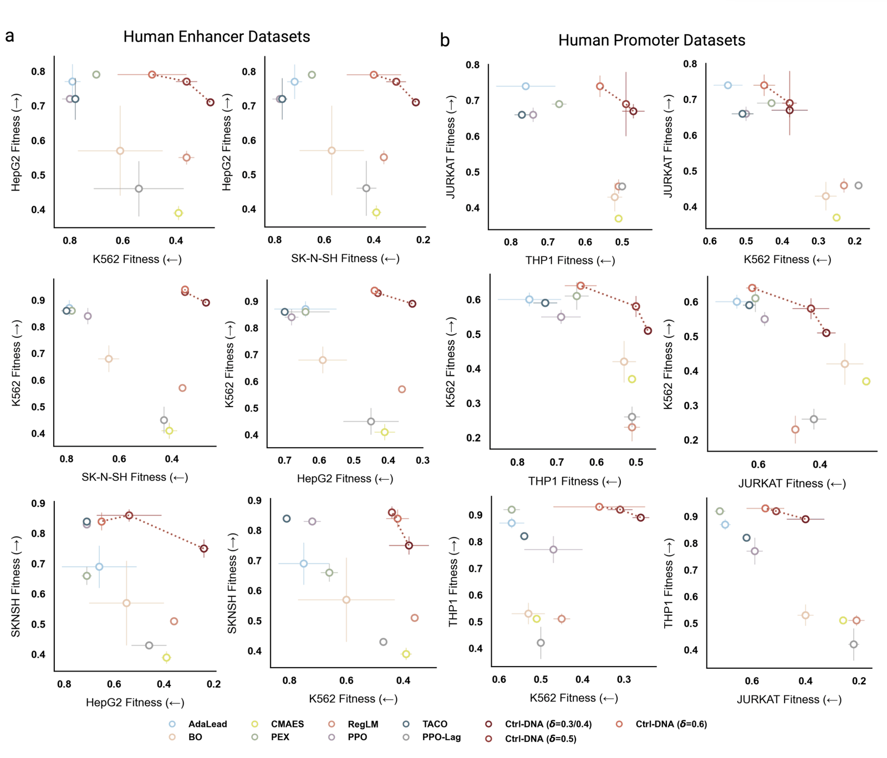

위 실험은 데이터셋들을 바탕으로 특정 세포에 대해서 발현율을 높이면서 다른 세포군들에서는 발현율이 얼마나 낮은지에 대해서 나타낸 것. 전반적으로 trade-off 관계를 가지고, Ctrl-DNA가 y축 Target Cell에 대해서는 발현율이 높으면서 off-target cell에 대해서는 발현율이 낮은 것을 볼 수 있음.

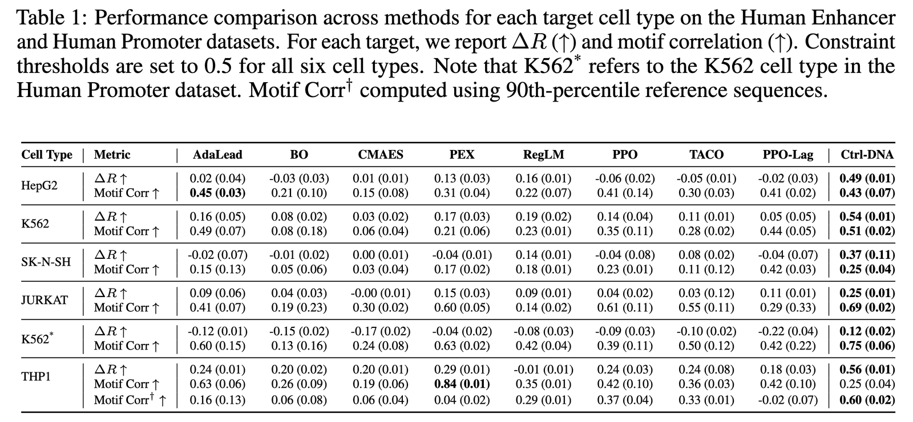

### Ablation Study

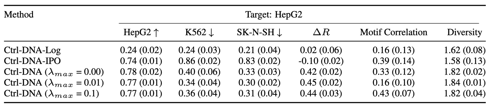

## Limitation

- Surrogation
- Data Distribution
- Conditional Generation
