# [저널클럽 4주차] Evo 2

[🏠 Portfolio](https://github.com/heoneyzi) › [📚 Study](../../../README.md) › [🧬 Genomics](../../README.md) › [Season 1 · Functional Genomics](../README.md) › [Journal club](README.md)

> ✍️ **정유민 (teammate)** · 📅 week 4 · discussed at the 11th meeting (Apr 2026) · 🗂️ Source: Notion — *Functional Genomics › 개인 아카이브*

---

**정리 규칙**

- Figure에 대한 설명과 지금까지 읽었던 논문 / 앞으로 읽을 연구와의 관련성을 중심으로 정리하였음.
- 주목할만한 technical details이 있는 경우 언급함.
- 특히 주목할만한 부분에는 **🔥 이모지로 표시함.**

---

**Glossary**

- SNV / non-SNV
    - A Single Nucleotide Variant (SNV) is a substitution of one DNA nucleotide base (A, C, T, or G) for another, whereas non-SNV variations involve larger or more complex structural changes.

<b>Exon / Intron</b>

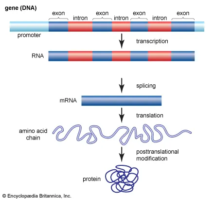

- Coding / non-coding

---

**Table of Contents**

---

#### Figure 1: Evo 2의 아키텍처, 학습 절차 및 데이터셋 개요

Evo 2가 어떻게 뉴클레오티드 수준부터 전체 유전체 규모까지 학습하도록 설계되었는지 보여줌.

<b>Subplot a, b, c, d, e: 모델링 범위 및 학습 데이터 구성</b>

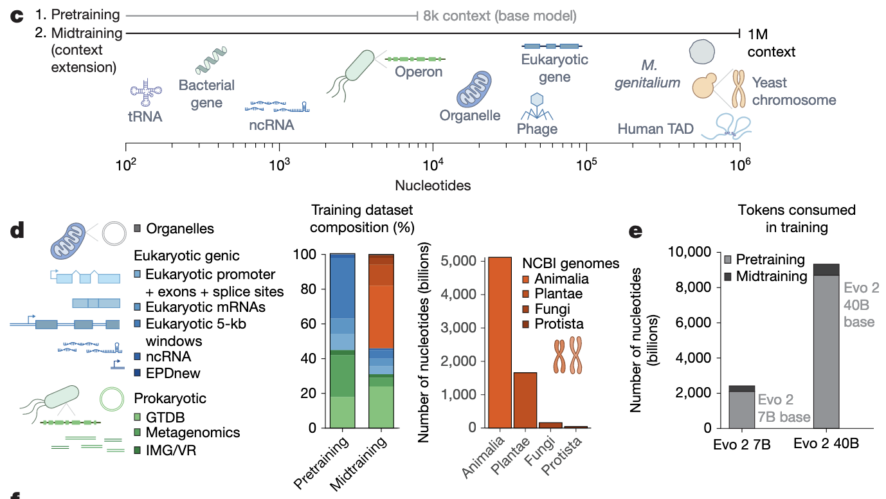

- **실험:**
    - 단일 뉴클레오타이드 해상도를 유지하면서 최대 100만(1M) 토큰의 문맥 길이를 학습할 수 있도록 2단계(사전 학습 및 중간 학습) 학습 전략을 사용함.
    - 학습에는 모든 생물계를 포괄하는 9조 개 이상의 뉴클레오타이드 데이터인 'OpenGenome2'가 사용됨. → HuggingFace에 공개 [arcinstitute/opengenome2 · Datasets at Hugging Face](https://huggingface.co/datasets/arcinstitute/opengenome2)
        

        
<b>데이터 규모 비교 (OpenGenome 1 vs 2) 🔥</b>

        Extended Data Figure 1a

        
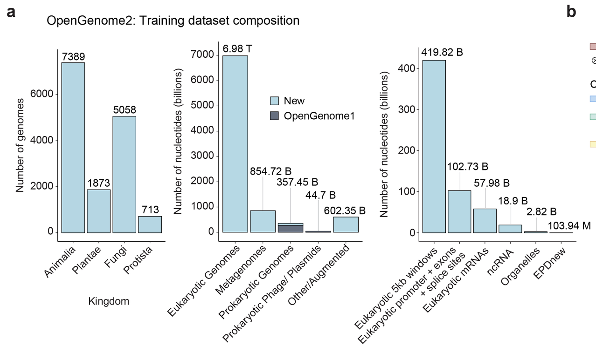

        

- UMAP 임베딩(b)을 통해 훈련 데이터가 박테리아, 고세균, 진핵생물에 걸쳐 얼마나 방대한 다양성을 지니고 있는지 확인할 수 있음.
    
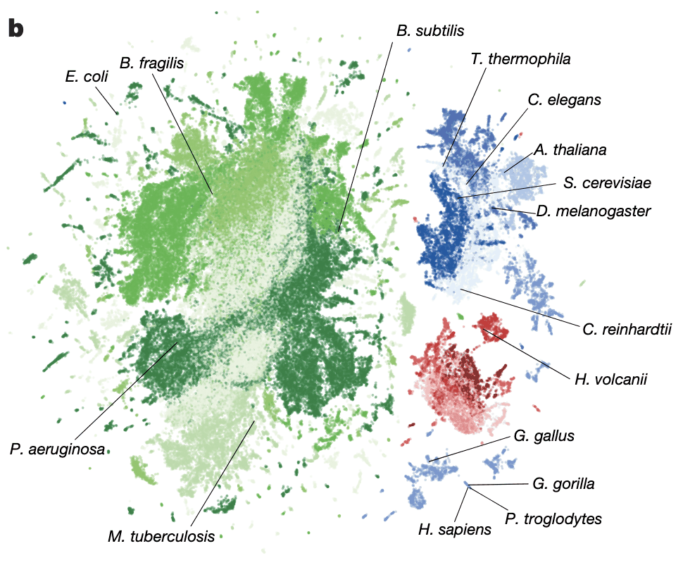

- **결론:** Evo 2는 생명의 모든 영역(domains of life)에서 수집된 유전체 서열을 바탕으로 중심 원리 전반의 작업을 수행할 수 있는 파운데이션 모델임
    

    
<b>기존 시도들과의 비교</b>

    #### **1. 기존 DNA 모델들의 훈련 데이터 한계 (Domains of Life 관점)**

    기존의 게놈 언어 모델(Genomic Language Models)은 단일 모달리티에 집중하거나 특정 생물군에 국한되어 훈련되는 경우가 대부분임: 다양한 생물계를 아우르는 훈련이 어려웠던 주된 이유는 다음과 같음.

    - **특정 생물군 편향:** 이전 모델인 Evo 1이나 GenSLM과 같은 모델들은 오직 원핵생물(prokaryotic) 데이터셋으로만 훈련됨.
        - Nucleotide Transformer와 같이 여러 종을 학습한 다종 DNA 언어 모델이 존재했으나, 이러한 모델들 역시 고도로 보존되지 않은 조절 서열(regulatory sequences)이나 진핵생물 변이 평가에서는 성능이 떨어짐.
    - **다중 서열 정렬(MSA, Multiple Sequence Alignments)에 대한 의존도:** 진핵생물의 변이 효과 예측 분야에서 기존 언어 모델들은 MSA를 사용하는 종 특이적(species-specific) 모델들에 비해 성능이 떨어짐. ↔ MSA는 inference time마다 query 해서 넣어줘야 하므로 비효율적이고 모델 자체가 진화에 대한 representation을 이해했다고 보기 어려움.
        

        
<b>참고: AlphaMissense</b>

        Input: Reference(MSA) + Variant ⇒ Output: pathogenicity (1/0, BCE)

        - Positive label: clinical pathogenic variants
        - Negative label: clinical benign variants common population variants primate substitutions
        - Excluded: rare variants with unknown effect

        
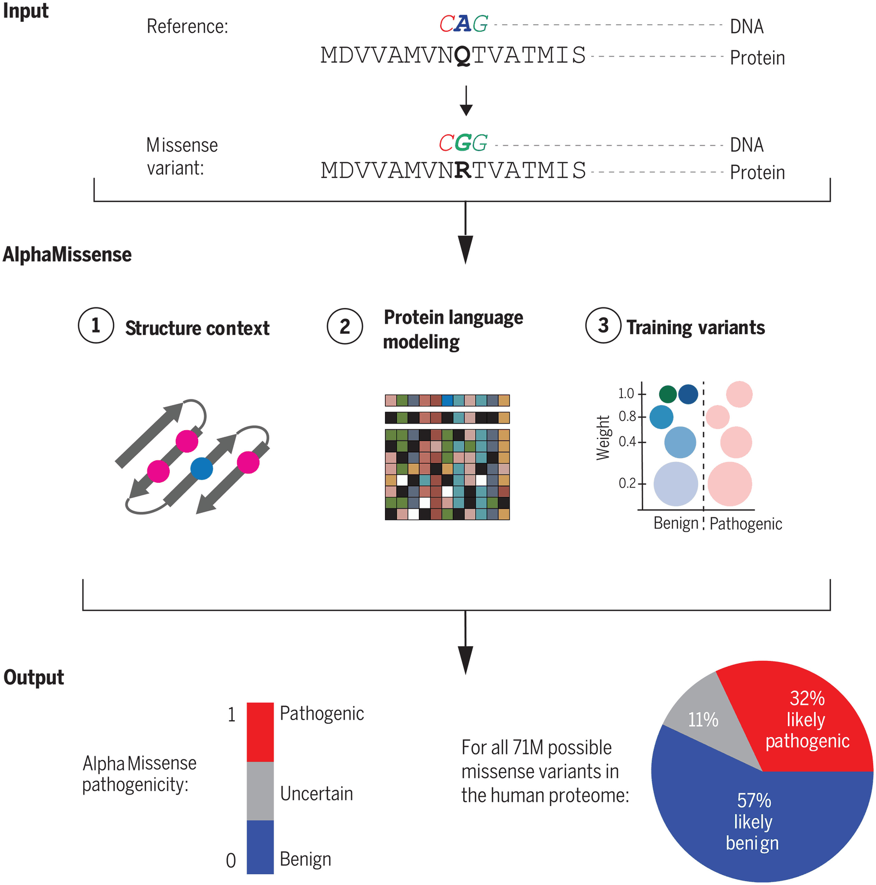

        

    - 생성 불가능한 지도 학습 모델: Enformer나 Borzoi와 같은 모델들은 인간이나 마우스 등 특정 진핵생물의 자연 유전체 데이터만 독점적으로 학습했으며, 이는 예측 전용일 뿐 새로운 서열을 디자인할 수 있는 생성형(generative) 모델이 아님.

    ↔ 반면, Evo 2는 박테리아, 고세균, 진핵생물, 파지(phage)를 모두 아우르는 9조 개의 염기쌍으로 구성된 유전체 아틀라스(OpenGenome2)를 단일 염기 해상도로 학습하여 기존 모델들의 도메인 한계를 극복함.

    #### 2. Evo 1 vs. Evo 2 핵심 차이점 비교

    | **비교 항목** | **Evo 1** | **Evo 2** |
    |---|---|---|
    | **훈련 데이터 범위** | 원핵생물(Prokaryotic) 유전체 서열 | 박테리아, 고세균, 진핵생물, 파지를 모두 포함하는 OpenGenome2 데이터셋 |
    | **모델 아키텍처** | StripedHyena 1 (긴 합성곱 기반 구조) | StripedHyena 2 (어텐션 및 3가지 다른 입력 의존적 합성곱 연산자를 결합한 다중 하이브리드 구조) |
    | **최대 문맥 길이 (Context Length)** | 최대 131k 토큰 | **최대 100만 (1M) 토큰** |
    | **연산 효율성 및 처리량** | 기본 수준 | 40B 파라미터 및 1M 문맥 길이 기준, 최적화된 트랜스포머 및 StripedHyena 1 대비 **최대 3배 빠른 처리량(throughput)** 및 개선된 손실 스케일링 달성 |
    | **주요 지원 기능 (Capabilities)** | 원핵생물 서열 생성 및 적합성 예측 | 원핵생물은 물론 **진핵생물 유전체 서열 생성, 인간 임상 변이 효과 예측, 포유류 크로마틴 접근성 설계** 등 중심 원리 전반의 작업 수행 |
    | **서열 생성 품질 (예: *M. genitalium*)** | 생성된 유전자 중 Pfam 도메인 히트율 약 18% | 생성된 유전자 중 Pfam 도메인 히트율 약 70%로 단백질 도메인 생성 품질 극적 향상 |

    - 두 모델 모두 생물보안(Biosafety)을 위해 진핵생물을 숙주로 삼는 바이러스(eukaryotic viruses)의 유전체 서열은 훈련 데이터에서 의도적으로 배제함.

    

<b>Subplot f, g: 모델 아키텍처 및 처리량</b>

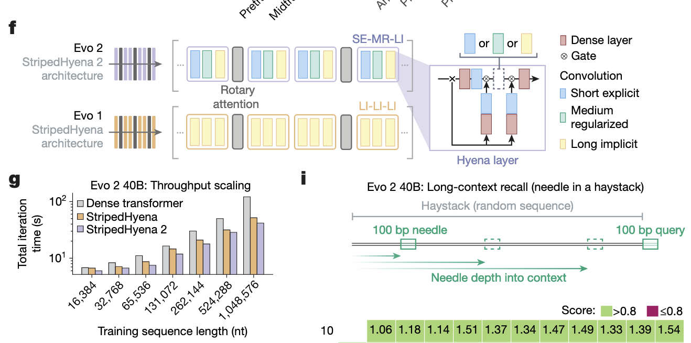

- **실험:** 트랜스포머의 한계를 극복하기 위해 합성곱(convolution)과 어텐션을 결합한 StripedHyena 2 다중 하이브리드 아키텍처를 도입함.
- **결과:** 40B 파라미터 스케일 및 1M 문맥 길이에서 최적화된 트랜스포머나 이전 세대 모델보다 최대 3배 빠른 처리량을 달성

<b>Hyena Layer: Short explicit convolution / Medium regularized convolution / Long implicit convolution ??</b>

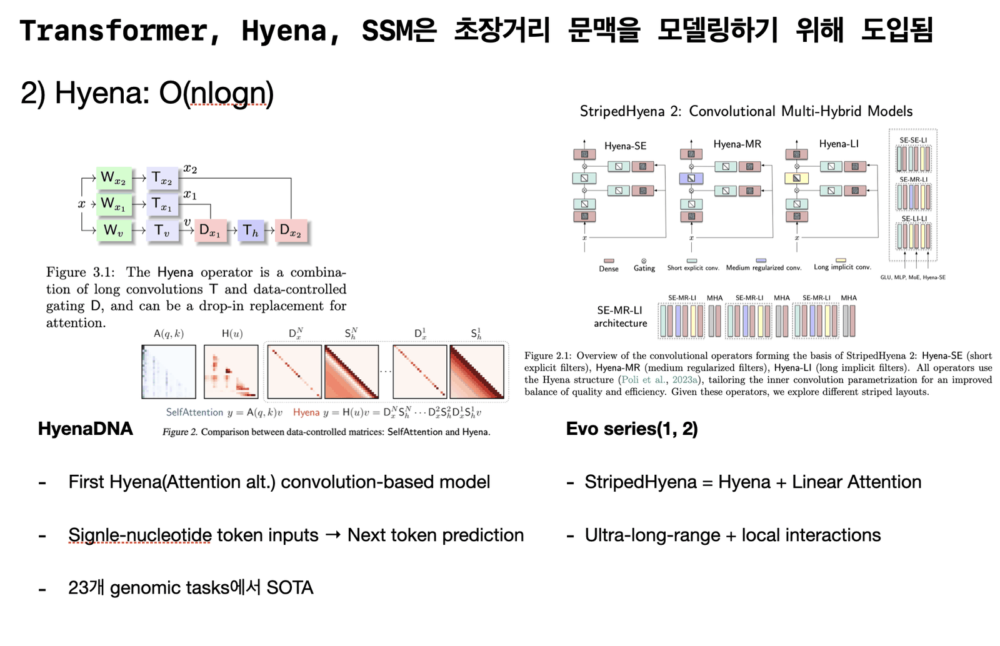

<b>Subplot h, i: 문맥 길이 확장 평가 🔥</b>

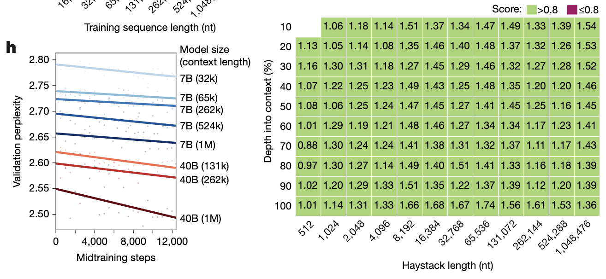

**Figure 1h: 모델 스케일 및 문맥 길이에 따른 검증 퍼플렉서티(Validation Perplexity) 평가**

- **실험 내용:** Evo 2의 중간 학습(midtraining) 단계에서는 모델이 한 번에 처리할 수 있는 문맥 길이를 최대 100만 토큰까지 다단계로 확장함(Figure 1c).  Figure 1h는 이 과정에서 모델(7B 및 40B 파라미터)이 32k, 65k, 262k, 524k, 1M 등 다양한 문맥 길이를 학습할 때의 검증 perplexity(예측 오류를 나타내는 지표로 낮을수록 좋음) 변화를 측정함.
- **결과 및 결론:** 학습 단계가 진행됨에 따라, 훈련되는 문맥 길이가 길어질수록 검증 perplexity가 지속적으로 감소함.
    - 모델이 긴 서열이 주어졌을 때 긴 문맥의 이점을 활용하여 예측 성능을 향상시키고 있음을 의미
    - 즉, 점진적 문맥 확장 midtraining 방식은 효과 있다!

**Figure 1i: 'Needle-in-a-haystack' (건초 더미에서 바늘 찾기) 장문맥 검색 능력 평가**

- **실험 디자인:** 장문맥(long-context) 모델이 주어진 방대한 입력 데이터의 어느 위치에 있는 정보든 소실 없이 정확히 검색할 수 있는지 검증하기 위해 고안된 synthetic quality check 태스크.
    - 최대 100만 염기쌍 길이의 무작위 DNA 서열을 건초 더미(haystack)로 설정함.
    - 내부의 다양한 깊이(위치)에 100 염기쌍 길이의 특정 타겟 서열인 바늘(needle)을 숨겨놓음.
    - 그런 다음 모델이 이 특정 100bp 서열의 값을 정확히 식별하고 예측해 낼 수 있는지 테스트함.
- **결과 및 결론:** 입력 문맥 길이가 짧은 구간부터 최대 100만 토큰에 이르는 구간(수평축)까지, 그리고 타겟 서열이 문맥의 앞이나 중간, 혹은 맨 끝에 위치하더라도(수직축, Depth into context) Evo 2는 숨겨진 정보를 효과적으로 recall
    - 이 결과는 Evo 2 모델이 100만 염기쌍이라는 전체 문맥 윈도우(context window) 안에서 어떠한 정보도 놓치지 않고 원활하게 검색하여 가져올 수 있음 보여줌.
- **결론:** Evo 2는 초장문 문맥에서 정보를 소실하지 않고 효과적으로 추론할 수 있다.

<b>0.8 score 기준 이유 🔥</b>

**1. 실험 세팅: '바늘'을 조작해 '쿼리'를 맞히기**

- **건초 더미(Haystack):** 512bp부터 최대 100만bp(1,048,576bp) 길이의 무작위 DNA 서열을 생성.
- **바늘(Needle):** 100bp 길이의 타겟 서열을 건초 더미의 다양한 깊이(10%\~90% 위치)에 숨김.
- <b>쿼리(Query):</b> 바늘과 완벽히 동일한 복제 서열을 건초 더미 <b>맨 끝(suffix)</b>에 배치함. 모델은 이 맨 끝의 쿼리를 예측해야 함.

1. **점수 측정 방식: 범주형 야코비안(Categorical Jacobian) 분석**
    - 정말로 숨겨진 바늘을 '보고' 있는지 확인하기 위해 **바늘 서열에 인위적으로 돌연변이(mutate)를 일으킴.**
    - 만약 모델이 앞의 바늘을 정확히 참조하고 있다면, 바늘 서열이 변할 때 맨 끝에 있는 쿼리에 대한 모델의 예측(logits) 결과도 민감하게 변해야 함.
        - 가정: 보고 있지 않다면 쿼리에 대한 logit은 많이 안 바뀔 것이다.
    - 이 예측값의 변화량(유클리드 거리 차이)을 계산하여 검색 점수(r)를 도출함. 수치가 높을수록 앞의 정보를 강력하게 참조(retrieval)했다는 의미
1. **0.8 기준의 통계적 증명: '완전한 우연' 배제**
    - Null distribution: 바늘 서열을 완전히 무작위로 섞은(shuffling) 뒤, 모델이 억지로 쿼리를 예측하게 하는 '가짜 실험'을 세팅함.
    - 건초 더미 길이, 숨긴 위치, 섞는 횟수를 바꿔가며 **총 1,040번**의 무작위 실험을 돌림.
    - 그 결과, **완전한 우연으로 나올 수 있는 가장 높은 점수는 겨우 0.037이었음.**
        - 즉, 모델이 **0.8점**을 넘었다는 것은 우연히 맞힐 확률이 0.1% 미만(P \< 0.001)인 기준점
            - 이는 모델이 100만 길이의 문맥 속에서 정보를 '진짜로' 찾아내서 읽었음을 보여줌.

**Extended Data Figure 1e**

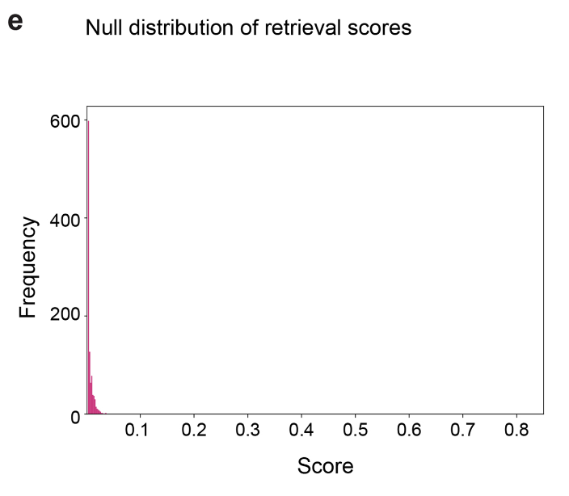

#### Figure 2: 제로샷(Zero-shot) 기반 돌연변이 효과 예측

Evo 2가 파인튜닝 없이도 DNA, RNA, 단백질 전반에 걸친 돌연변이의 기능적 영향을 어떻게 예측하는지 평가함.

<b>Subplot a, b, c, d, e: 서열 Likelihood 분석 및 코돈 사용 패턴</b>

<b>a, b: likelihood landscape와 species별 패턴</b>

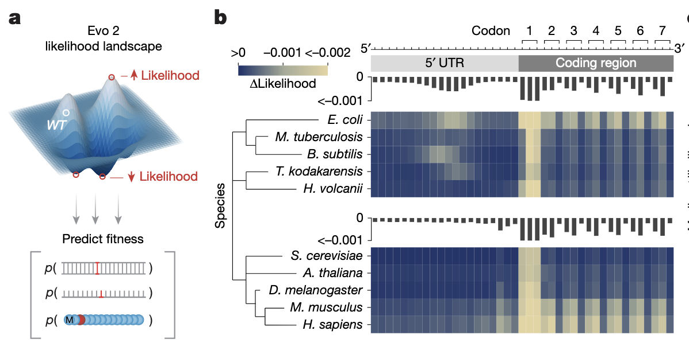

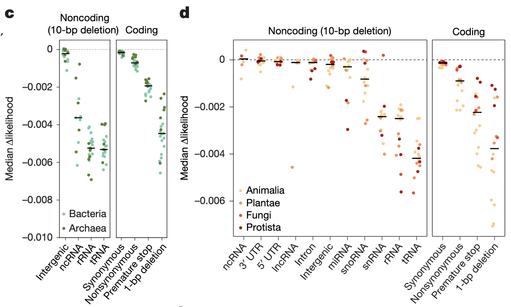

- **실험:** 단일 염기 변이(SNV)나 결실(deletion)을 가상으로 도입했을 때, 모델이 계산하는 서열 가능도의 변화($`\Delta \text{Likelihood}`$)를 측정함.
- **결과:** 시작/종결 코돈의 돌연변이나 프레임시프트, non-synonymous 변이, tRNA/rRNA의 결실 등 <ins>**생물학적으로 치명적인 변이일수록 서열 Likelihood**</ins>가 급격히 떨어짐.
- 모델은 종(species) 특이적인 종결 코돈 코드를 구별해 냄(e).
    
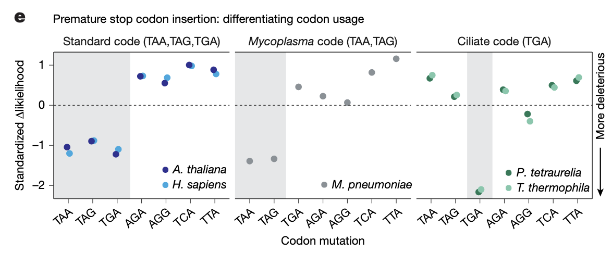

- **결론:** Evo 2는 진화적으로 보존된 중요 서열 패턴을 스스로 학습하여, 치명적인 돌연변이를 제로샷으로 정확히 식별함.

<b>Subplot f, j: 분자 및 유기체 적합성(Fitness) 검증 🔥</b>

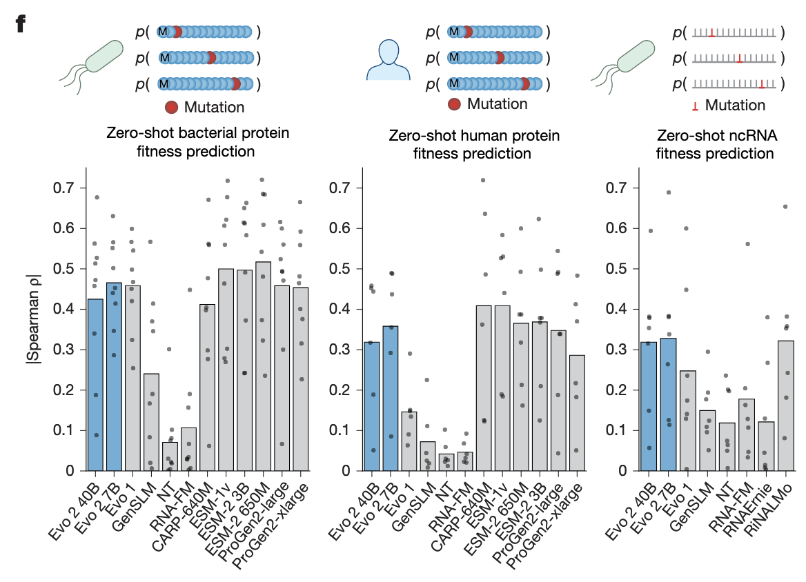

- **실험:** 모델의 likelihood 점수를 딥 뮤테이셔널 스캐닝(DMS) 실험 데이터(f) 및 유전자 필수성 실험 데이터(j)와 비교함. 비교 메트릭: Spearman rho

<b>j. 유전자 필수성(gene essentiality) 실험 데이터</b>

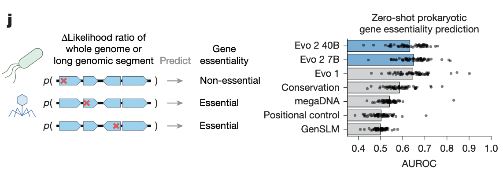

- 결과: 박테리아 및 인간 단백질, ncRNA의 적합도 실험 결과와 높은 스피어만 상관계수를 보임.
    - 그럼에도 불구하고 protein language model보다 성능이 떨어지는건 왜일까?
        - 데이터 모달리티와 표현 학습(Representation Learning)의 근본적 차이
        - 범용 모델(Generalist)과 특화 모델(Specialist)의 목적성 차이
        - 대규모 언어 모델의 성능 포화(Saturation) 현상
            - 모델이 훈련 데이터의 방대한 지엽적 패턴까지 과적합(Overfitting) 수준으로 모사하게 되면서, 단백질 피트니스를 평가하는 데 필요한 '진화적으로 보존된 핵심 패턴'의 일반화 성능(제로샷 추론 능력)이 상대적으로 희석되기 때문인 것으로 해석할 수 있음.

<b>Subplot g, h, i: 임베딩 기반 엑손(Exon) 분류기</b>

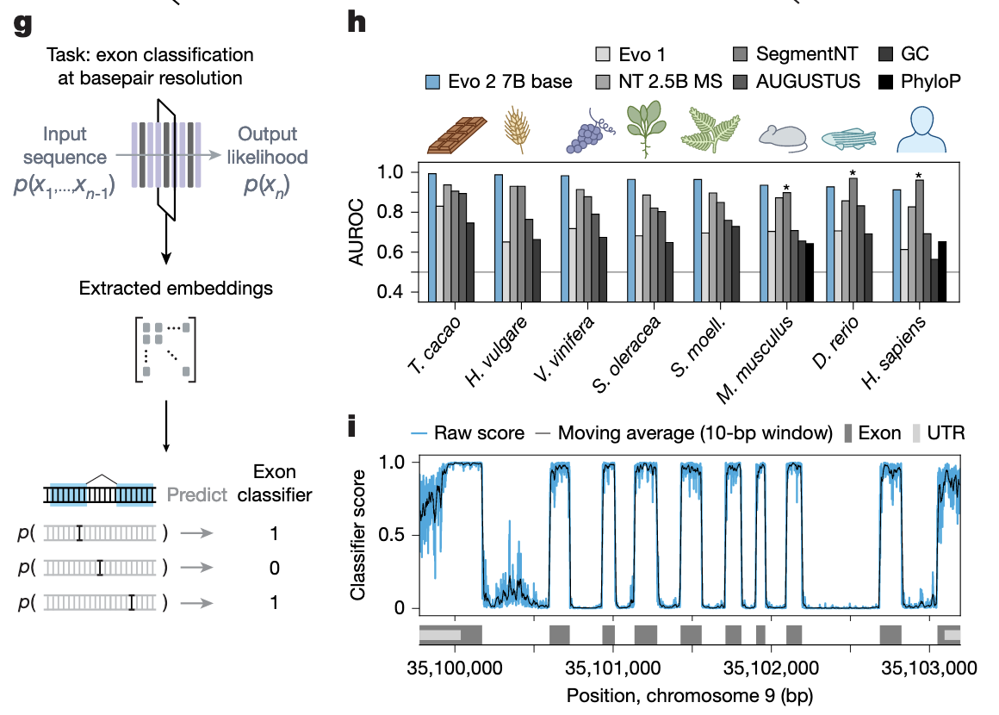

- **실험:** Evo 2의 베이스 임베딩을 추출하여 단일 염기 해상도로 엑손을 분류하는 가벼운 지도 학습 모델을 훈련함.
- **결과:** 학습에 사용되지 않은 8개 종의 평가에서 AUROC 0.91\~0.99의 높은 수치를 달성했으며(h), 인간 유전자좌(STOML2)의 엑손 구조(i)를 성공적으로 스캔함.
- **기존 방법과의 비교:** AUGUSTUS, Nucleotide Transformer, Evo 1 모델 기반 분류기보다 일관되게 우수한 성능을 보임.

#### Figure 3: 인간 임상 변이 효과 예측

<b>Subplot a, b, c, d: 제로샷 병원성(Pathogenicity) 및 스플라이싱 예측</b>

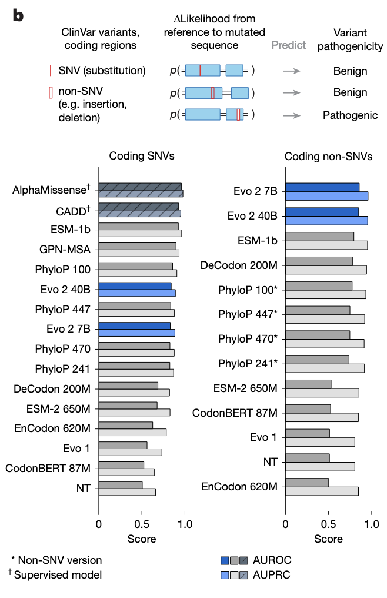

- **실험:** ClinVar의 코딩/논코딩 변이와 SpliceVarDB의 스플라이스 조절 변이를 대상으로 병원성(pathogenic)과 양성(benign)을 제로샷 likelihood로 구분함.
- **결과:**
    - coding, SNV: 기존 단백질 언어 모델에 다소 뒤처짐
    - coding, non-SNV: 모든 모델을 압도함
    - non-coding/splicing: 비지도 학습 모델 중 1위를 기록.
- **결론:** 모델은 SNV뿐만 아니라 기존 도구들이 처리하기 힘든 구조적 변이나 논코딩 영역 변이 평가에 특히 강력하다.

<b>Subplot c, d</b>

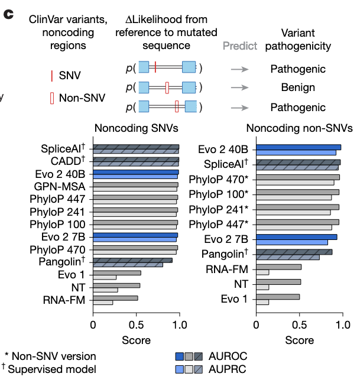

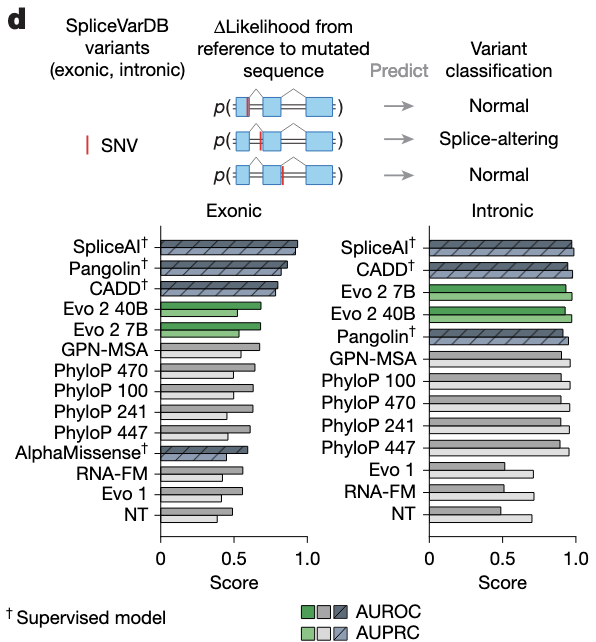

<b>Q. Fig. 3b, c에서 insertion, deletion의 delta likelihood는 어떻게 구하나?</b>

확률값(0과 1 사이의 값)을 수만, 수십만 번 곱하게 되면 컴퓨터 연산의 한계로 인해 값이 0으로 수렴하는 언더플로우(Underflow) 문제가 발생 → 이를 방지하고 연산을 효율적으로 하기 위해 확률들의 곱에 로그(Log)를 취하여 **덧셈**으로 변환함.

$`log P(S) = \log P(x_1) + \log P(x_2 | x_1) + \dots + \log P(x_L | x_1, \dots, x_{L-1})`$

즉, $`log P(S) = \sum_{i=1}^{L} \log P(x_i | x_{<i})`$

 결과적으로, 서열의 길이가 100bp든 100만bp(Evo 2의 최대 문맥 길이)든 상관없이, **모델이 출력한 각 자리의 타겟 염기 로그 확률값을 단순히 모두 더하기만 하면** 서열 전체의 로그 가능도가 도출됨.

- 확률은 1보다 작으므로 로그 확률은 음수임. 따라서 단순히 값을 더하기만 하면, **서열 길이가 길어질수록(항이 많아질수록) 전체 로그 가능도 값은 필연적으로 더 작아짐(음의 방향으로 커짐).**
- 삽입(Insertion)이나 결실(Deletion) 변이처럼 원본 서열(WT)과 돌연변이 서열 간에 물리적인 길이 차이가 발생할 때 이 합산값을 그대로 빼버리면 서열 길이에 의한 편향이 발생함. 모델은 이를 다음 두 가지 방식으로 보정(Normalization)하여 기능적 영향을 평가함.
    - **🔥 길이 정규화 (Length-adjustment):** 단순히 전체 합을 비교하는 것이 아니라, 합산된 전체 로그 가능도를 서열의 길이로 나누어 '염기당 평균 로그 가능도(Mean log-likelihood per nucleotide)'를 구하여 비교함. 실제로 논문에서도 인간 mRNA의 분해 속도(decay rate) 등을 예측할 때 길이에 의해 조정된(Length-adjusted) 가능도를 사용함.
    - **🔥 국소 윈도우(Local Window) 평가:** 전체 100만 bp의 합을 모두 구하는 대신, 돌연변이가 발생한 지점을 중심으로 충분한 문맥을 포함하는 특정 크기의 윈도우(예: 변이 주변 1,000bp) 내에서만 로그 가능도 변화량을 계산하여 노이즈를 줄이고 연산 효율성을 높임.

<b>Subplot e, f: 제로샷 BRCA1/2 변이 예측</b>

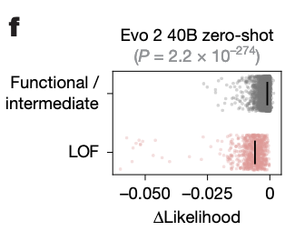

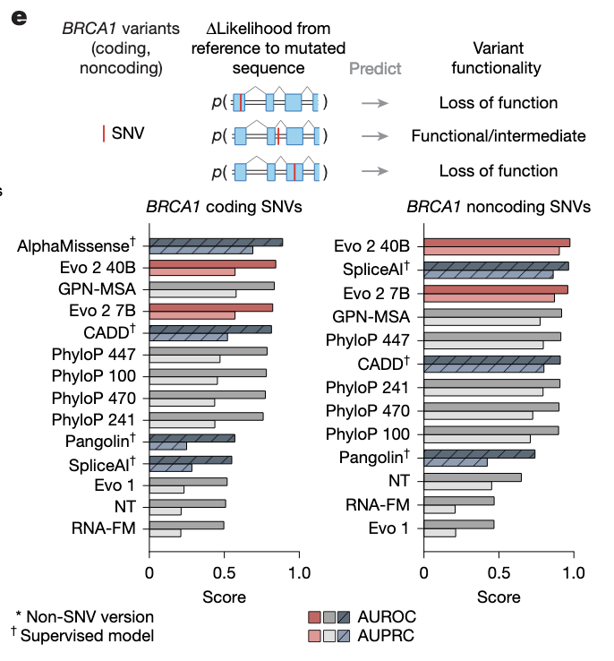

- **결과:** BRCA1 포화 돌연변이 실험 데이터에서 코딩 및 논코딩 SNV의 기능 상실(LOF) 여부를 우수하게 예측해냄.
    - coding에서는 AlphaMissense보다 살짝 못 미침(AM: MSA 사용, population genomics로 supervised)

<b>Subplot g, h, i: 임베딩을 활용한 지도 학습 기반 예측</b>

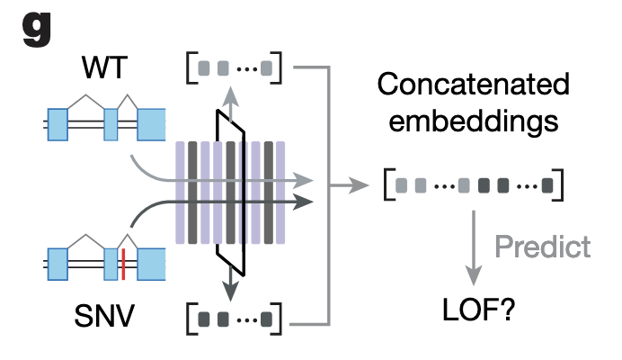

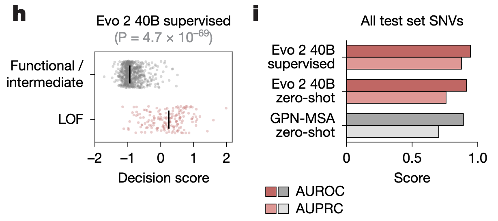

- **실험:** 제로샷 성능을 넘어, Evo 2 임베딩을 이용해 BRCA1 변이 전용 지도 학습 분류기(ridge regression)를 학습시킴.
- **결과:** 지도 학습 모델은 테스트 셋에서 정상/중간 기능 변이와 기능 상실(LOF) 변이를 AUROC 0.95로 잘 분리함(h, i).
- **결론:** Evo 2의 임베딩은 다운스트림 임상 진단 작업을 위한 지도 학습 모델 구축에 매우 우수한 기초 데이터로 활용될 수 있음.
    - 지난번 리뷰논문보다는 좋은 결과 같네요..

<b>Extended Data Figure 5: layer 20 선택, pooling window size 128 선택</b>

- 변이 위치를 중심으로 8,192bp 길이의 서열을 가져온 뒤, 총 4가지 변형 서열(참조 서열, 참조 서열의 역상보, 변이 서열, 변이 서열의 역상보)에 대해 Evo 2 40B 모델의 각 블록(사전 정규화 레이어)에서 임베딩을 추출
- 변이 위치 주변을 다양한 크기의 윈도우(16bp \~ 8,192bp)로 나누어 평균 풀링(mean-pooling)을 수행 → 4가지 서열에서 추출한 풀링 벡터들을 하나로 이어 붙여(concatenate) → ridge 회귀 모델의 입력 데이터

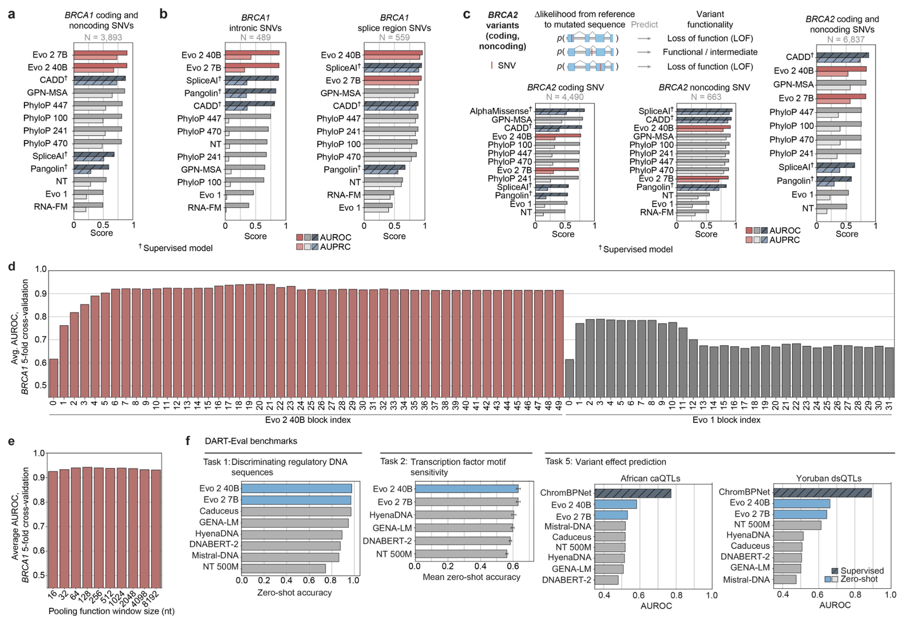

#### Figure 4: 희소 오토인코더(SAE)를 통한 기계론적 해석 가능성

블랙박스인 대형 모델 내부에서 생물학적으로 의미 있는 특징들이 어떻게 표현되는지 분석함.

<b>Subplot a: SAE 피처 추출</b>

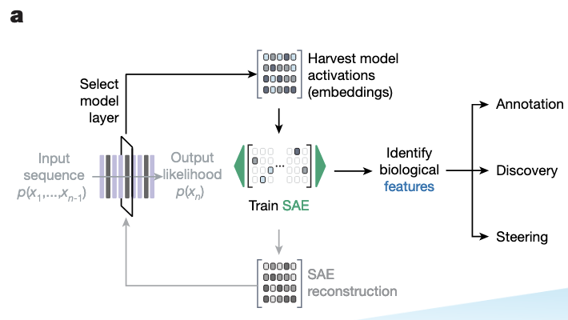

- **실험:** 어떠한 사전 생물학적 레이블링 없이, Evo 2의 활성화 값(layer 26)을 바탕으로 고차원 희소 오토인코더(SAE)를 학습시켜 해석 가능한 생물학적 피처를 도출.

<b>Subplot b, c, d: 원핵생물 내의 피처 발견</b>

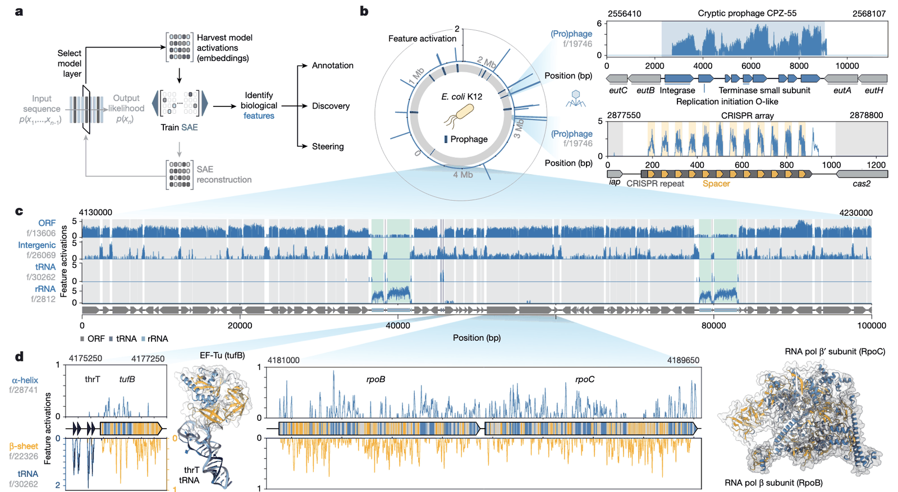

- **결과:** 모델은 대장균(E. coli) 유전체에서 잠복해 있는 프로파지(prophage)나 CRISPR 스페이서에서 강력하게 활성화되는 피처를 자체적으로 형성(b). 또한 ORF, rRNA 등(c)과 단백질 2차 구조(alpha-helix, beta-sheet)와 연관된 피처(d)를 발견함.
- **결론:** DNA 서열만을 학습했음에도 모델 내부에서는 3차원 단백질 구조와 같은 상위 수준의 생물학적 특징을 스스로 추상화하고 있음.

<b>Subplot e, f, g: 진핵생물 및 인간 유전체 피처 전이</b>

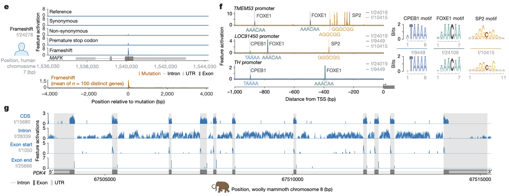

- **결과:** 인간 유전체 분석 시 프레임시프트 돌연변이 직후에 활성화되는 특징(e)과 전사인자 결합 모티프(TF motifs)에 반응하는 특징(f)을 식별함. 더욱이 인간을 바탕으로 추출된 엑손/인트론 경계 피처가 털매머드(woolly mammoth)의 유전체 서열에도 성공적으로 적용(g)됨.
- **결론:** Evo 2는 종을 초월하여 적용 가능한 범용적인 유전체 조절 요소 및 구조를 파악하는 능력을 갖추고 있음.

#### Figure 5: 생물계 전반에 걸친 유전체 규모 생성

Evo 2가 어떻게 미토콘드리아나 염색체 단위의 서열을 새롭게 디자인(생성)할 수 있는지 보여줌.

<b>Subplot a, b: 전반적 생성 태스크 및 서열 복원</b>

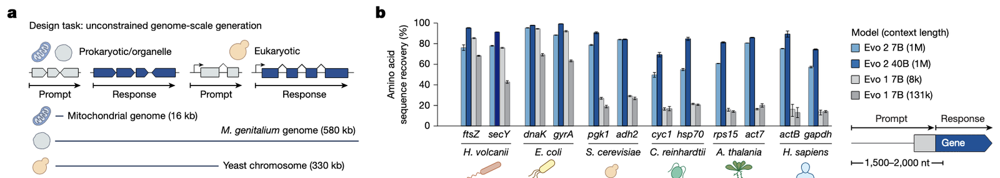

- **실험:** 고도로 보존된 유전자의 상위 서열을 프롬프트로 제공하고, 모델이 나머지 서열을 자가회귀적으로 생성하도록 한 뒤 실제 아미노산 서열 복원율을 측정.
- **결과:** 종을 가리지 않고 유전자 완성에서 매우 높은 아미노산 서열 복원율을 보였으며, 이는 모델 스케일이 클수록 더 향상됨.

<b>Subplot c, d, e, f: 인간 미토콘드리아 서열 생성</b>

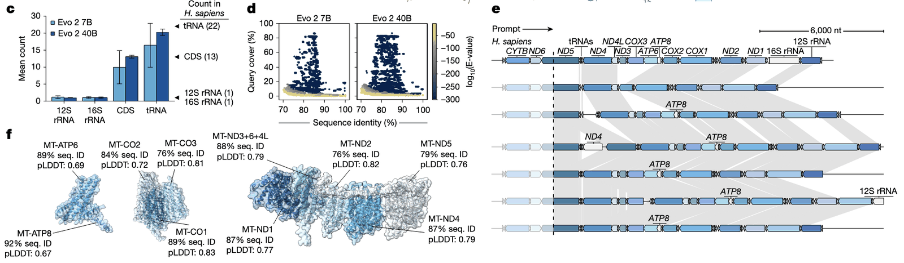

- **결과:** 생성된 16kb 미토콘드리아 유전체는 정상적인 수의 CDS, rRNA, tRNA를 가졌고(c) , 올바른 유전자 순서(synteny)를 유지함(e). 또한 AlphaFold 3 예측 시 실제와 흡사한 다중 단백질 복합체 구조를 성공적으로 형성함(f).

<b>Subplot g, h, i, j, k: M. genitalium (원핵생물) 생성</b>

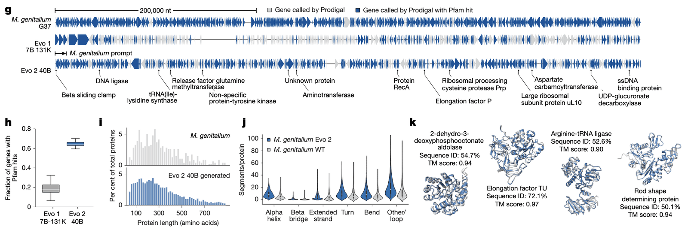

- **결과:** 580kb의 생성된 원핵생물 유전체(g)를 분석한 결과, 약 70%의 유전자가 유의미한 Pfam 도메인을 가졌으며(h) , 단백질 길이(i)와 2차 구조(j)의 분포가 자연 상태의 유전체와 흡사함.
- **기존 방법과의 비교:** 이전 Evo 1 모델(Pfam 도메인 히트 18%) 대비 단백질 생성의 질이 비약적으로 향상됨.

<b>Subplot l: 진핵생물 (효모) 염색체 생성</b>

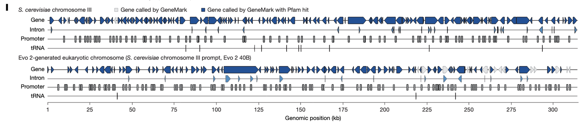

- **결론:** 인트론, 프로모터 등을 포함하는 진핵생물의 복잡한 염색체(S. cerevisiae) 스케일에서도 유의미한 DNA 생성 능력을 증명함.

#### Figure 6: inference time guidance를 통한 인공 <ins>크로마틴 접근성 패턴 설계</ins>

- Epigenetics(후성유전학)

외부 예측 모델을 스코어링 함수로 활용해, 원하는 형태의 기능적 서열을 제어 생성하는 기법을 입증.

<b>Subplot a, b, c, d: 빔 서치(Beam Search) 기반 서열 생성</b>

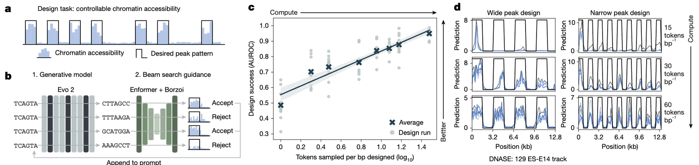

- **실험:** Evo 2로 128bp 단위의 DNA를 생성하고, Enformer 및 Borzoi 모델을 통해 크로마틴 접근성 프로파일(개방/폐쇄 패턴)을 점수화하는 빔 서치 알고리즘을 결합함.
    | **방법** | **설명** |
    |---|---|
    | Greedy | 매 단계 최고 1개만 선택 |
    | Beam Search | 상위 k개 유지 |
    | Exhaustive | 모든 경우 탐색 |
- **결과:** 추론 연산량(sampled tokens per bp)을 늘릴수록 목표 패턴과의 일치도(AUROC)가 로그-선형(log-linear) 관계로 확연히 개선됨(c).

<b>Subplot e, f, g, h: 모스 부호 메시지(mESC) 인비보 실험 검증</b>

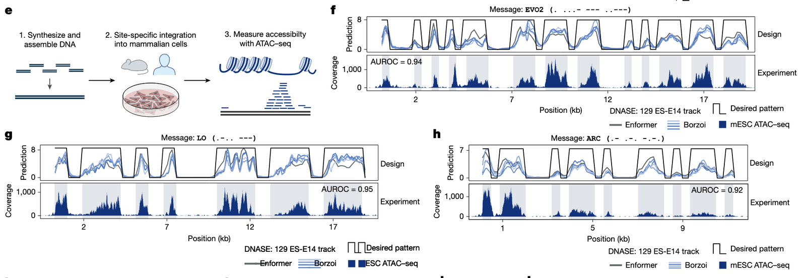

- **실험:** "EVO2", "LO", "ARC"라는 모스 부호를 목표 피크(접근성) 패턴으로 설정해 다중 킬로베이스 길이의 서열을 합성한 후, 마우스 배아줄기세포(mESC)에 주입하여 ATAC-seq으로 측정함.
- **결과:** 모델이 설계한 가상의 패턴이 실제 실험 데이터의 ATAC-seq 접근성 프로파일(AUROC 0.92\~0.95)과 놀라울 정도로 완벽하게 일치함.

#### 리뷰

> "생명의 언어인 DNA를 모든 생물에 걸쳐 읽고, 이해하고, 쓸 수 있는 역대 최대 규모의 생물학 foundation model"
> #### 학습 데이터: OpenGenome2 Atlas
>
> 8.85T nucleotide, 15,032개의 eukaryotic genome과 113,379개의 prokaryotic genome으로 학습. 진핵생물 데이터가 대규모로 포함되면서 인간 유전질환, 식물, 단세포 생물까지 커버함.
>
> #### 3 takeaways
>
> **1. Zero-shot variant effect prediction** fine-tuning 없이 noncoding pathogenic mutation부터 임상적으로 중요한 BRCA1 variant의 기능적 영향을 정확히 예측함.
>
> **2. Mechanistic interpretability — 스스로 생물학을 학습** Evo 2는 DNA sequence만으로 exon-intron boundary, transcription factor binding site, protein structural element 같은 생물학적 feature를 자율적으로 학습함. Sparse Autoencoder(SAE)를 이용해 α-helix, β-sheet, tRNA 같은 구조적 feature가 모델 내부에서 어떻게 표현되는지 확인함.
>
> **3. Genome-scale generation** 단순 세균 게놈 수준의 길이를 갖는 새로운 게놈을 설계하는 것도 가능함.
>
> #### 의의 및 한계
>
> **의의:**
>
> - Foundation model이 특정 task 없이도 variant → phenotype 관계를 일반화
> - 1Mb context → 유전자 조절 long-range interaction 포착 가능
> - 오픈소스 공개 (Arc GitHub + NVIDIA BioNeMo)
>
> **한계 / 열린 질문:**
>
> - 생성된 게놈의 실험적 검증은 아직 부족
> - 진핵생물 epigenetics (메틸화, 히스톤 수정 등)는 sequence만으로는 한계
> - 40B 모델은 NVIDIA Hopper GPU 필요 → 접근성 제한

#### 토론주제

1. Evo2를 발전시킨다면 종 내 변이는 어떻게 학습시키는게 좋을까? ref에서 변이 몇개 말고는 대부분이 같은데, 이러한 분포를 학습시키기에 적합한 구조인지..
2. 많은 데이터와 약한 inductive bias (bitter lesson) 를 주는 것이 유리하다는 머신러닝의 방향이 좋은가
3. ㅇㅈ: Pretraining단계에서 genic region 가중치를 주었고 satelite 가중치를 낮추었다고 하는데 맞나요? 그렇다면 생물학적 prior를 준것이 아닌가.. ↳ training phase 분리도 prior라고 생각됨 ↳ ㅇㅈ
