# [저널클럽 5주차] AlphaGenome

[🏠 Portfolio](https://github.com/heoneyzi) › [📚 Study](../../../README.md) › [🧬 Genomics](../../README.md) › [Season 1 · Functional Genomics](../README.md) › [Journal club](README.md)

> ✍️ **구민선 (teammate)** · 📅 week 5 · discussed at the 11th meeting (Apr 2026) · 🗂️ Source: Notion — *Functional Genomics › 개인 아카이브*

---

- 📎 `AlphaGenome_briefing.docx.pdf` (Notion attachment, not included)

**정리 규칙**

- 주목할만한 부분에는 **🔥 이모지로 표시함.**

---

**Glossary**

<b>Sequence-to-function model:</b>

- takes DNA sequence as an input and predicts genome tracks — a data format associating **each DNA base pair with a value** (representing a read coverage, count, or signal) derived from experimental assays performed in cell lines or tissues

<b>Track prediction에서 <ins>Track이란?</ins>:</b>

- genome은 수십억 개의 염기로 이루어진 아주 긴 선과 같음. **이 선 위의 특정 위치에서 일어나는 활동**(예: 단백질이 결합함, RNA가 만들어짐 등)을 수치화해서 그래프로 나타낸 것을 track이라 함.
    - Prediction은 왜 하는가?:
        - 보통 이런 트랙 데이터를 얻으려면 수천만 원의 비용과 수주의 시간이 드는 복잡한 실험(RNA-seq, ATAC-seq 등)을 직접 해야 함.
        - 대신, Alphagenome이 → DNA 서열을 보니 여기서는 유전자가 아주 활발하게 발현되겠네(높은 봉우리) 라고 **계산만으로 실험 결과와 똑같은 그래프**를 그려냄

<b>Splice junction:</b>

대부분의 유전체 데이터(ATAC-seq, ChIP-seq 등)는 1차원적인 신호임. 특정 위치에 단백질이 얼마나 붙어 있는지, 혹은 그 위치가 얼마나 열려 있는지를 숫자 하나로 표현할 수 있다

- 하지만 splice junction은:
    - **Donor (5' Splice Site)**: 인트론이 시작되는 지점
    - **Acceptor (3' Splice Site)**: 인트론이 끝나는 지점

    스플라이싱을 예측한다는 것은 단순히 *어디가 잘릴 것인가?*가 아니라, *i번 Donor와 j번 Acceptor가 서로 연결될 확률이 얼마인가?*라는 쌍(Pair)의 관계를 풀어야 함.

<b>eQTL vs. sQTL 차이:</b>

- eQTL: DNA 변이가 특정 유전자의 전체 발현량 (mRNA 총량)에 영향을 주는 지점
    - 작동 방식: Enhance/promoter (switch 구간)에 변이가 생김 → up/downregulation
    - 결과: 단백질 모양은 똑같지만, 단백질의 양에서 차이를 만듬
- sQTL: DNA 변이가 유전자의 splicing pattern에 영향을 주는 지점
    - 작동 방식: 엑손-인트론 경계나 조절 서열에 변이가 생겨 → 특정 엑손을 넣을지 뺄지(Exon skipping), 혹은 길이를 조절할지를 결정합니다.
    - 결과: 전체 mRNA 양은 비슷할 수 있지만, 만들어지는 단백질의 구조와 기능 자체가 달라짐

---

<b>1. AlphaGenome의 Architecture</b>

**Figure 1a & Extended 1a.**

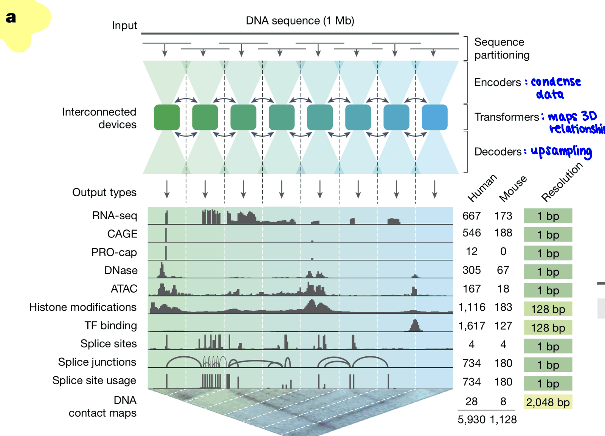

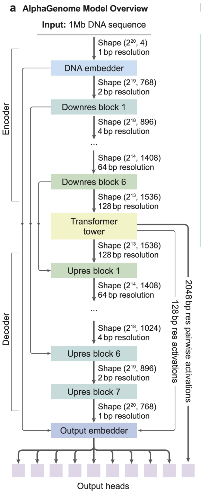

<b>1D, 2D Embeddings의 역할:</b>

U-Net inspired backbone architecture를 사용하여 input sequence를 두가지 sequence representation로 나눈다.

- <ins>one-dimensional embeddings</ins> (1-bp & 128-bp resolutions) → linear genome에서의 representation 확인하기 위함 (예. motifs, genes, splicing sites)
- <ins>two-dimensional embeddings</ins> (2,048-bp resolution) → linear genome 안에서 두가지 다른 section이 3D space에서 어떻게 interact하는지 확인하기 위함.
    - **One-dimensional embeddings**는 **genomic track predictions**의 기초가 되며, **two-dimensional embeddings**는 유전체 구간 사이의 공간적 상호작용인 pairwise interactions (contact maps)를 예측하는 기반이 된다.

<b>Architecture의 구성 요소:</b>

AlphaGenome의 **U-Net** 기반 아키텍처를 순서대로:

 1. **Encoder (Convolutional layers)**: 1-Mb의 긴 DNA 서열을 입력받아 **Convolutional blocks**와 **Max pooling**을 통해 서열을 훑고 압축하며 특징을 추출.

**→ 목표:** 데이터를 압축하면서 중요한 생물학적 특징만 추출하는 과정임. 이 과정에서 해상도가 점점 낮아지며 정보가 농축됨.

2. **Transformer Tower (Transformer blocks)**:
- **작업:** 압축된 정보(128bp)를 바탕으로 서로 멀리 떨어진 요소들 사이의 관계를 계산함.
- **역할:** 유전체 조절의 핵심인 long range dependency을 모델링함.
    - 예를 들어, 멀리 떨어진 enhancer가 어떻게 특정 promoter를 조절하는지 이 단계에서 알아냄.
1. **Decoder (Convolutional layers)**:
- **작업:** Transformer가 계산한 고차원적인 정보를 다시 원래의 해상도로 넓게 펼침(Upres blocks).
- **최종 예측:** 압축을 풀면서 우리가 보고 싶어 하는 데이터(RNA 발현량, ChIP-seq 신호 등)의 형태로 최종 결과물을 내놓음.

1-Mb full sequence를 어떻게 고해상도로 학습?:

- Sequence parallelism: 거대한 데이터를 처리하기 위해 8개의 서로 연결된 TPU (v3) 장치를 활용.
    - **핵심 원리:** 거대한 DNA 한 줄을 8토막으로 자름.
    - **8개의 TPU v3 활용:** 자른 토막들을 8개의 서로 연결된 연산 장치(TPU)에 하나씩 나눠줌.
    - **맥락 보존:** 단순히 자르고 끝나는 게 아니라, 8개의 장치가 서로 자기 구역엔 (예) 이러한 enhancer가 있다고 실시간으로 communication
    - **효과:** 덕분에 메모리 한계를 넘어서면서도 아주 멀리 떨어진 유전체 조절 요소들 사이의 관계를 놓치지 않고 통째로 학습할 수 있음.

Embedding 다음에는?

**Prediction Mechanism**

- **Linear Transformations**: 대부분의 Genomic track 예측은 모델이 생성한 **Sequence embeddings**에 선형 변환을 적용하여 간단하게 산출됨.
    - 이는 각 위치의 특징값을 생물학적 신호 강도로 직접 매핑하는 방식임.
    - <b>왜 간단? </b>이미 이전 단계(Transformer Tower 등)에서 DNA의 복잡한 의미를 다 파악했기 때문에, 마지막 예측 단계에서는 복잡한 계산이 필요 없음. 예) 그냥 이 임베딩 값은 발현량 __이야라고 통역만 해주는 느낌

<b>Splice Junction Prediction — 별도 mechanism!</b>

- **별도 메커니즘 채택**: Splice junction count 예측은 일반적인 genomic track과 달리 다른 메커니즘을 사용.
- **Donor-Acceptor Pairs 상호작용**:
    - 단일 위치의 특성만 보는 것이 아니라, **Donor**(공여 부위)와 **Acceptor**(수용 부위)라는 두 지점의 **1D embeddings** 사이의 상호작용을 직접 포착.
    - 이를 통해 어떤 지점들이 서로 연결되어 intron을 형성할지 예측함.

    

    
<b>Extended data Fig2 a,b</b>

    
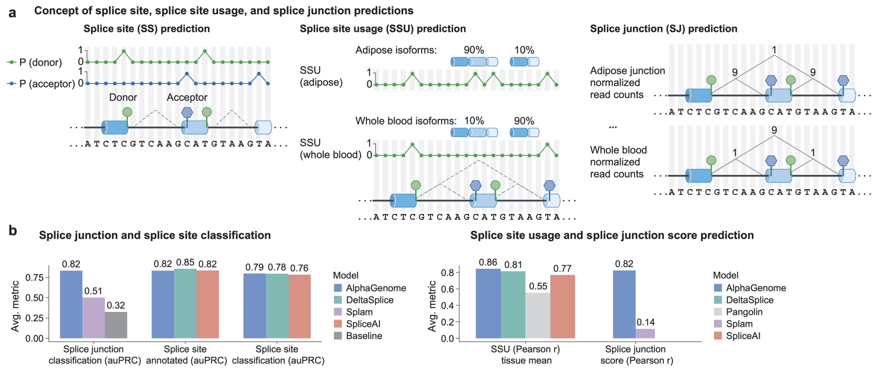

    - Splice site (SS) prediction: 특정 염기가 splice donor나 acceptor로 작동할 확률을 계산.
    - Splice site usage (SSU) prediction: 여러 후보 부위 중 실제 세포가 **어떤 곳을 선택해서 사용하는지** 그 비율을 맞힘.
        - 예를 들어, 지방 조직(Adipose)과 혈액(Whole blood)에서 서로 다른 형태의 유전자(Isoform)가 만들어지는 비율을 맞춤
    - Splice junction (SJ) prediction: 실제로 어떤 인트론이 제거되고 어느 엑손끼리 연결되는지(정규화된 리드 수)를 수치로 예측함.

    

<b>2. Training of AlphaGenome</b>

*Accuracy와 efficiency(빠르기)를 동시에 만족하는 모델을 만들기 위함. — ⁉️may work similarly if we apply distillation to Evo-2?*

**Figure 1b, c**

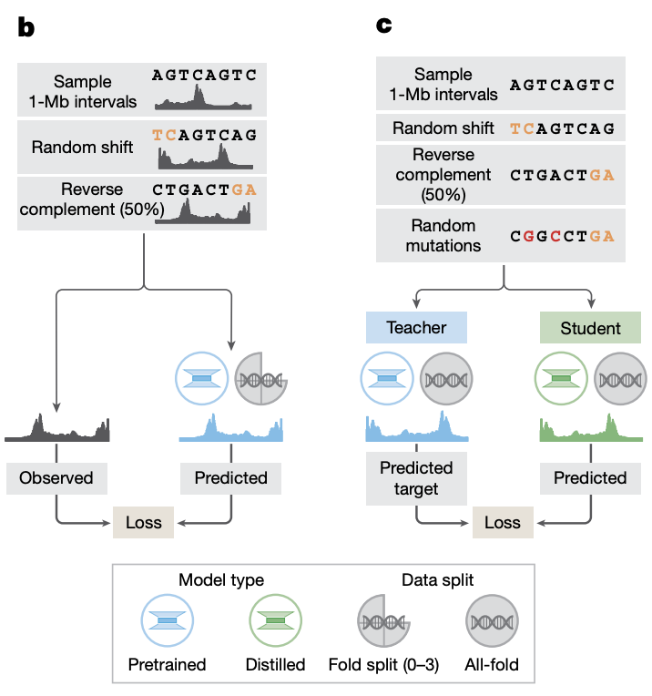

**Stage 1: Pretraining (learning from data)**

- Figure 1b: Pretraining phase — 실제 실험 데이터로부터 genome의 regulatory code를 직접 학습하는 과정!
    - **Data sampling & augmentation:** 먼저 reference genome에서 1Mb 길이의 DNA 구간(intervals)을 샘플링.
        - ‼️이때 모델의 generalization 능력을 높이기 위해 데이터를 무작위로 이동(Random shift)시키거나, Reverse complement로 뒤집는 등의 <b>데이터 Augmentation </b>기법을 적용.‼️
    - **Fold-split:** 전체 genome 데이터를 4개의 그룹(Fold 0-3)으로 나눔.
        - 3개 그룹은 학습에 사용하고 나머지 1개는 테스트에 사용하는 **4-fold 교차 검증** 방식을 통해, 모델이 보지 못한 서열에서도 잘 작동하는지 확인함. 4개의 모델을 각각 다르게 학습시킴
            - **Teacher A:** Fold 1, 2, 3으로 학습 (Fold 0은 안 봄)
            - **Teacher B:** Fold 0, 2, 3으로 학습 (Fold 1은 안 봄)
            - **Teacher C:** Fold 0, 1, 3으로 학습 (Fold 2은 안 봄)
            - **Teacher D:** Fold 0, 1, 2으로 학습 (Fold 3은 안 봄)
        - ‼️단순 memorization을 안 했다는 것을 보여주기 위함‼️
    - **학습 목표:** 모델이 예측한 결과(Predicted)와 실제 실험에서 관찰된 데이터(Observed) 사이의 오차(Loss)를 최소화하도록 학습하여 Teacher들을 만들어냄.

**Stage 2: Distillation phase**

- Figure 1c: 사전 학습된 teacher 모델의 지식을 하나의 효율적인 학생 모델 student에게 전수하는 과정!
    - **Teacher-student 구조**: 앞서 genome 전체 데이터로 학습된 'All-fold' 모델들이 teacher 역할을 수행함. Student 모델은 이 teacher 모델들이 내놓는 예측값을 정답으로 삼아 학습함
    - **Random mutations**: Distillation 과정에서 입력 서열에 무작위 변이를 인위적으로 주입함. → student 모델은 이러한 변이가 포함된 서열에서도 teacher 모델의 예측을 복제하도록 훈련받음. → 이 과정을 통해 variant effect prediction에 대한 robustness를 얻게 됨.
    - **결과**: 이 과정을 거치면 여러 모델을 합친 것보다 더 정확하면서도, 단일 모델로서 매우 빠르게(NVIDIA H100 GPU 기준 1초 미만) 결과를 내놓는 최종 모델이 완성 됨.

<b>3. (Results) Performance overview: Benchmarking against other models</b>

**Figure 1d (전반적인 genome track 예측 성능), c (variant effect prediction으로 확장)**

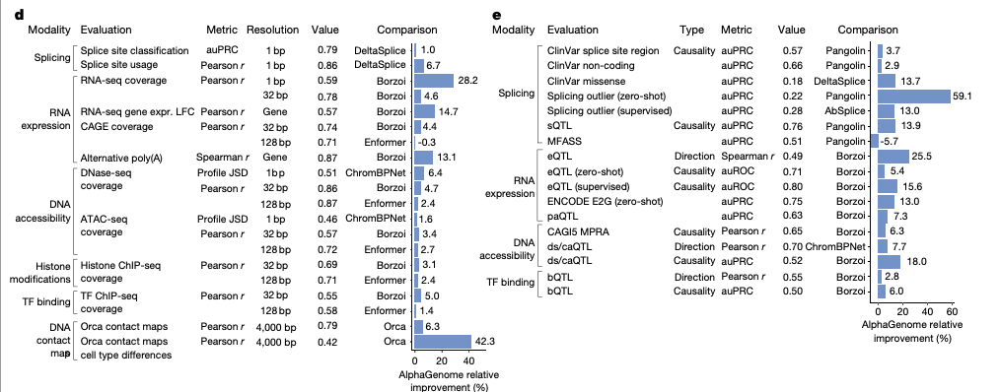

- AlphaGenome은 총 11가지 modality에 걸친 24개의 **genome tracking** 평가에서 기존 외부 모델들과 성능 비교
    - **24개 중 22개 항목에서 더 잘함:** unseen genome sequence에 대한 예측 평가에서 AlphaGenome은 24개 평가 항목 중 22개 항목에서 기존 모델들보다 뛰어난 성능을 보임.

    | **비교 모델** | **분야** | **주요 성과** |
    |---|---|---|
    | **Borzoi** | 유전자 발현 | 세포 유형 특이적 발현 예측(LFC)에서 **+14.7%** 향상. |
    | **Orca** | 3D 게놈 구조 | 접촉 지도(Contact maps)의 상관관계(Pearson r) **+6.3%**, 세포 유형 간 차이 식별 능력 **+42.3%** 향상. |
    | **ProCapNet** | 전사 시작 | 전사 개시 트랙 예측 정확도 **+15%** 향상. |
    | **ChromBPNet** | DNA 접근성 | ATAC-seq 정확도 **+1.6%**, DNase 프로파일의 통계적 정밀도 **+9.5%** 향상. |
- **Variant effect prediction** 평가에서 기존 외부 모델들과 성능 비교
- **변이 예측 성능:** 26개의 변이 효과 예측 벤치마크 중 25개에서 외부 모델과 대등하거나 이를 능가함.
    - Splicing, RNA 발현, DNA 접근성 등 다양한 분야에서 AlphaGenome이 기존 모델(Pangolin, AbSplice 등) 대비 얼마나 높은 정확도를 보이는지 볼 수 있음

<b>4. (Results) Improved track prediction performance</b>

*섹션의 overview: 학습 과정에서 보지 못한 unseen DNA 서열에 대해 모델이 생성한 게놈 트랙의 품질과 정확도를 분석!*

<b>Figure 2a.</b>

**→ human의 19번 염색체 중 1Mb 영역을 대상으로 HepG2 세포주에서 측정한 6가지 이상의 서로 다른 실험 데이터와 모델의 예측치를 비교! (1-Mb 영역의 전체적인 일치도)**

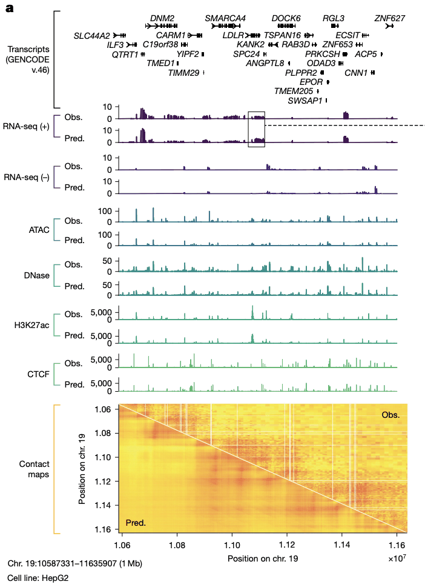

<b><ins>RESULTS 해석 for Fig 2a</ins></b>

#### **선형 트랙 (RNA-seq, ATAC, DNase 등)**

- **시각적 일치:** 그래프를 보면 'Obs'(실제 관찰) 선과 'Pred'(모델 예측) 선의 봉우리(Peak)와 골짜기 위치가 거의 일치!
- **가닥 특이성:** RNA-seq의 경우, DNA의 양쪽 가닥(+, -)에서 발생하는 전사 활동을 구분하여 정확히 예측!
    - <ins>**⁉️왜 DNA (+) (-) strand 구분하는게 중요한가⁉️:**</ins>
        - 만약 가닥을 구분하지 않고 모든 RNA 신호를 하나로 합쳐서 보여준다면, → **중첩 유전자(Overlapping genes):** DNA의 같은 위치인데, (+) 가닥에는 A라는 유전자가 있고 (-) 가닥에는 B라는 유전자가 있는 경우가 있음! 가닥 특이성이 없다면 이 두 유전자의 신호가 뒤섞여 어느 유전자가 얼마나 발현되는지 알 수 없다.  → **정확한 유전자 지도:** AlphaGenome은 RNA-seq 데이터를 예측할 때, 해당 RNA가 어느 가닥에서 유래했는지를 구분하여 **(+) 트랙과 (-) 트랙으로 나누어 표시**함으로써 유전자의 위치와 발현량을 정확히 재현함. 
        - **요약!** AlphaGenome은 DNA의 이중 가닥 정보를 모두 활용하여 어느 쪽 가닥에서 생물학적 사건이 일어나는지까지 정확히 짚어낼 수 있는 고도의 정밀성을 갖춘 모델이다!

#### **3D Contact Maps**

- **공간 구조 예측:** 하단의 열지도는 DNA가 3D 공간에서 어떻게 꼬이고 접히는지 보여줌.
- **대칭성:** 사각형의 대각선을 기준으로 오른쪽 위(Obs)와 왼쪽 아래(Pred)가 대칭을 이룸.
    - AlphaGenome이 **2,048-bp 해상도**에서 게놈의 복잡한 3D 구조를 매우 정확하게 재현했다는 걸 보여줌.

<b>Figure 2b.</b>

**→ LDLR 유전자의 초정밀 분석 (50 kb)**

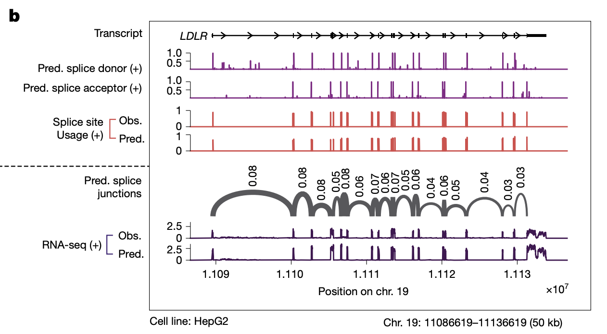

<b><ins>RESULTS 해석 for Fig 2b</ins></b>

간세포(HepG2)에서 cholesterol 조절에 중요한 **LDLR 유전자** 영역(50kb)을 모델이 어떻게 시뮬레이션했는지 보여줌

- **Transcript (맨 위):** 실제 유전자 지도입니다. 두꺼운 블록은 exon, 선은 intron!
- **Pred. splice donor / acceptor (+):** 보라색 그래프는 모델이 1-bp(염기 하나) 단위로 <ins>여기서 잘린다!!</ins>라고 예측한 위치.
- **Splice site Usage (+):** 실제 실험(Obs)과 모델 예측(Pred)이 얼마나 자주 특정 편집점을 사용하는지 비교함. ***→ 두 그래프가 거의 똑같다! 이는 모델이 세포가 유전자를 편집하는 습관을 정확히 안다는 뜻***
- **Pred. splice junctions (회색 아치):** 잘려나간 exon들이 어떻게 연결되는지 보여줌. 아치 위의 숫자(0.08, 0.05 등)는 그 연결이 얼마나 강하게 일어나는지(강도)를 냄..
- **RNA-seq (+):** 최종적으로 만들어진 RNA의 양입니다. Obs(실제)와 Pred(AI 예측)의 봉우리 위치가 일치하며, 특히 엑손 부위에서만 신호가 뾰족하게 솟아오르는 것을 볼 수 있다.

<b>Figure 2c.</b>

**전반적인 예측 정확도! → AlphaGenome이 한두 개의 유전자만 잘 맞추는 게 아니라, 게놈 전체와 다양한 실험 종류에 대해 고르게 뛰어난 성능을 보임을 증명.**

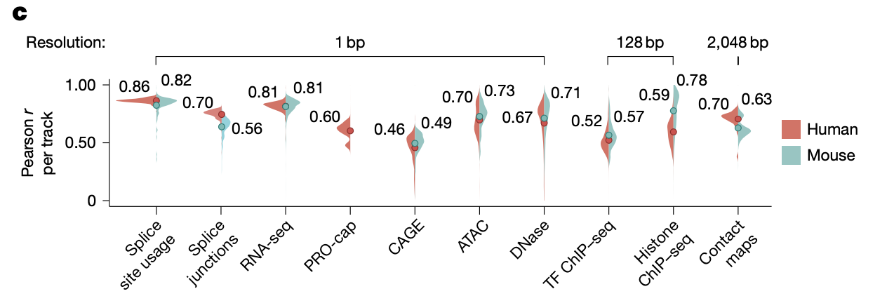

- Human & mouse에서 성능이 높음 → genome의 원리를 잘 학습함.
- **해상도별 분류:**
    - **1 bp (초고정밀):** 스플라이싱, RNA-seq, ATAC(DNA 접근성) 등 미세한 분석이 필요한 항목.
    - **128 bp:** 단백질 결합(ChIP-seq) 데이터
    - **2,048 bp:** 3D 게놈 구조(Contact maps) 데이터

<b>🔥 Figure 2d.</b>

**유전자 발현 예측의 세가지 난이도!**

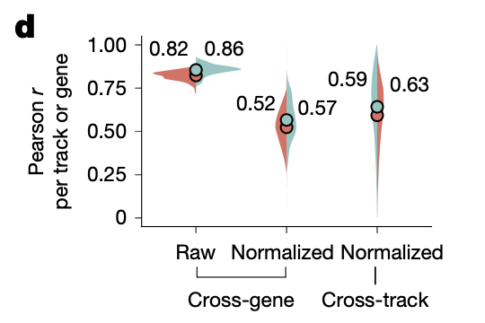

| **분석 종류 (Panel)** | **분석 방향 (데이터 관점)** | **핵심 측정 목표 (Objective)** | **난이도 및 기술적 이유** |
|---|---|---|---|
| **Raw** (왼쪽) | **Per Track** (세로 읽기) | 개별 샘플 내에서 유전자들의 **절대적 발현 강도**를 구분할 수 있는가? | **낮음 (매우 잘함):** 유전자마다 고유한 기초 발현값(Basal level) 차이가 매우 크기 때문에, 모델이 DNA 서열의 기본적인 특징(프로모터 강도 등)만으로도 쉽게 구별함. |
| **Cross-gene** (가운데) | **Per Track** (세로 읽기) | 특정 세포 환경 내에서 유전자들 사이의 상대적 서열(Ranking)이 정확한가? | **보통(잘함):** 전체적인 수치 스케일을 제거(Normalization)하고, 순수하게 해당 세포 내에서의 유전자 간 상대적 차이만 측정하므로 조금 더 정밀한 분석이 요구됨. |
| **Cross-track** (오른쪽) | **Per Gene** (가로 읽기) | **동일한 유전자**가 조직을 옮길 때 발생하는 세포 특이적 발현 변화(Deviation)를 포착하는가? | **매우 높음 (🔥Challenge!):** 유전자의 기본 발현량 정보를 배제하고, 오직 세포별 조절 기전(Enhancer 등)에 의한 미세한 변화량만 골라내야 하므로 가장 고난도 작업임. |

THEREFORE, AlphaGenome이 유전자 발현의 기본 원리는 학습했으나, **세포마다 다른 미세한 차이**를 완벽히 포착하는 것은 still a challenge!

<b>Figure 2e</b>

**조직별 genome에서 splicing 예측**

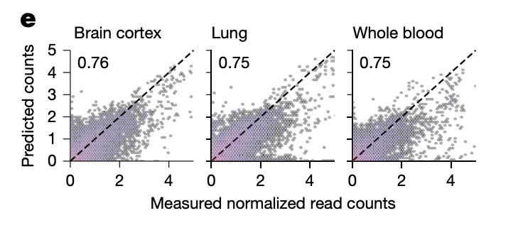

- **X축:** 실제 실험에서 측정된 데이터 수치
- **Y축:** AlphaGenome이 예측한 데이터 수치
- **점(Dot):** 각 점은 하나의 splice 연결 지점을 의미합니다. 점들이 대각선(점선)에 가까이 모여 있을수록 예측이 정확한 것
- **결과:** 뇌, 폐, 혈액처럼 성격이 완전히 다른 조직임에도 불구하고 상관계수가 일정하게 높다. 이는 모델이 **어느 조직에서든 유전자가 어떻게 편집될지를 매우 안정적으로 예측**하고 있음을 보여줌

<b>5. (Results) Improved splicing variant prediction performance</b>

<b>AlphaGenome이 변이(variant)가 유전자에 미치는 영향을 단순히 고장 났다/아니다로 판별하는 것이 아니라 3단계 계층 구조를 통해 분자 수준/splicing 수준에서 정밀하게 추적함. </b>

<b>Fig. 3a</b>

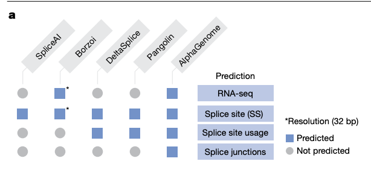

**Splicing modeling: 3단계!**

- **1단계: Splice Site (SS) 예측 (가위질 위치 찾기)**
    - **내용:** DNA 염기서열 중 특정 위치가 '가위질 시작점(Donor)' 혹은 '끝점(Acceptor)'으로 작동할 **확률**을 계산
    - **핵심:** 단순히 GT-AG 같은 염기 서열을 찾는 수준을 넘어, 주변 서열의 맥락을 보고 실제 가위질이 일어날 지점인지 판별
- **2단계: Splice Site Usage (SSU) 예측 (경쟁과 선택)**
    - **내용:** 후보 지점이 여러 개일 때, 세포가 실제로 어느 지점을 **더 자주 선택하는지** 예측.
    - **핵심:** 똑같은 DNA라도 조직에 따라 선택이 달라지는 Alternative Splicing을 포착함. 예를 들어, 지방 조직에서는 90% 쓰이는 지점이 혈액에서는 10%만 쓰일 수 있다.
- **3단계: Splice Junction (SJ) 예측 (최종 연결 지도)**
    - **내용:** 실제로 어떤 인트론이 제거되고 어느 엑손끼리 **최종적으로 결합**했는지를 예측함.
    - **핵심:** 실제 실험 데이터(RNA-seq)에서 관찰되는 read 수를 정량적으로 맞추는 단계이다.

**🔥기존 모델의 한계:** 대부분의 모델은 가위질 위치(SS)만 보거나 결과물(SJ) 중 하나만 본다.

- 그래서 변이가 생겼을 때, 이게 단순히 편집 위치를 바꾸는 건지, 아니면 아예 유전자 발현 자체를 망가뜨리는 건지 구분하기 어려웠음.
- **AlphaGenome의 해법:**
    1. 편집 지점이 바뀌었는가? (SS/SSU)
    2. 그 결과 엑손 연결 구조가 변했는가? (SJ)
    3. 최종적으로 생성된 RNA의 양이 줄었는가? (RNA-seq)

이 네 가지 정보를 동시에 보여줌으로써, 변이가 유발하는 molecular consequence를 볼 수 있다!

**🔥이러한 정밀한 트랙 예측이 왜 임상적으로 중요한가**

→ 이러한 정밀한 트랙 예측 성능은 **질병 유발 변이**를 찾는 결정적인 무기가 됨! 예) 암을 유발하는 어떤 변이가 발생했을 때 AlphaGenome은:

- "이 변이는 가위질 지점(SS)의 확률을 80% 떨어뜨렸고, 그 결과 3번 엑손을 건너뛰는 스플라이스 접합부(SJ)가 생겼으며, 최종 RNA 발현량(RNA-seq)도 절반으로 감소했음."
    - 결국 **Improved track prediction**의 높은 정확도(r = 0.08)가 뒷받침되었기에, 수많은 변이 중 진짜 위험한 변이를 골라내는 **Variant Effect Prediction**이 가능해진 것

<b>Fig. 3b, 3c</b>

<ins>3b - exon skipping mutation 예측 사례</ins>

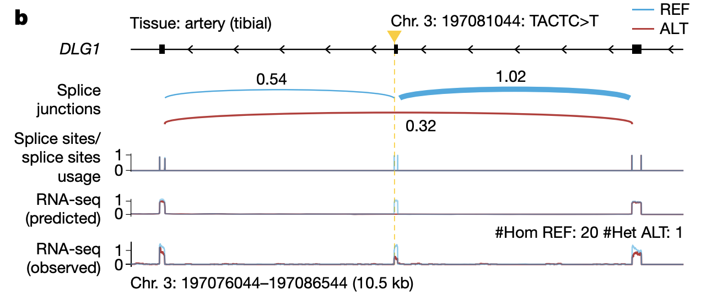

DLG1 gene에서 4개의 염기가 사라진(Deletion) 변이가 실제로 어떤 연쇄 반응을 cause하는지

- **파란색 (REF):** 정상 상태. exon 조각들이 차례대로 잘 연결되어 junction을 그릴 수 있다
- **빨간색 (ALT):** 변이가 생긴 상태.
    - **Junctions:** 가운데 엑손을 연결하던 아치가 사라지고, 이를 통째로 **건너뛰는(Skip)** 커다란 아치가 생김
    - **RNA-seq:** 그래프의 가운데 봉우리가 빨간색 선에서는 거의 사라진 것을 볼 수 있음. 즉, 유전자 조각 하나가 통째로 증발한 것을 모델이 정확히 예측함.

<ins>3c - exon extension 예측 사례</ins>

**🔥Loss of function이 아니라 Gain of function (서열이 하나가 바뀌어서 없던 가위질 지점이 생김)! → 이런 현상은 놓치기 쉬움.**

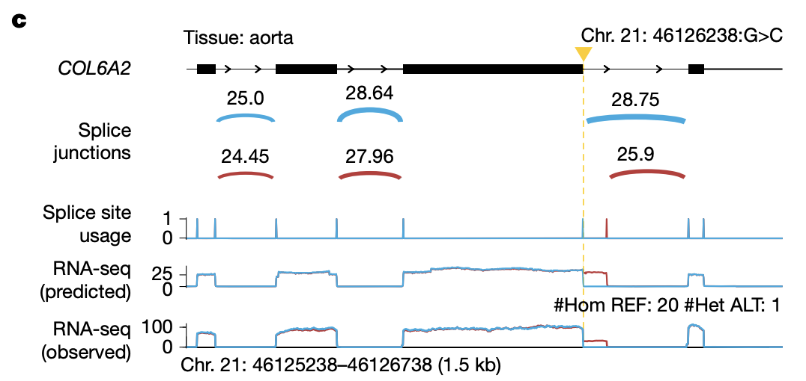

**핵심 질문:** AlphaGenome은 단 하나의 염기 변화(G \> C)가 일으키는 복잡한 스플라이싱 변화를 정확히 시뮬레이션할 수 있는가?

#### **1) 메커니즘: 새로운 Splice site usage 생겼다!!**

- **현상:** 노란색 역삼각형(변이 지점) 바로 옆에 새로운 가위질 신호(빨간색 막대)가 생성되었음
- **의미:** 원래는 무시되던 서열이 변이로 인해 강력한 splicing 지점으로 변했음을 모델이 포착했음

#### **2) 결과: 스플라이스 접합부의 변화 (Splice junctions)**

- **정상 (Blue arches):** 정해진 위치(28.75)에서 연결이 일어남.
- **변이 (Red arches):** 새로 생긴 지점을 따라 새로운 연결선(25.9)이 형성됨.
- **결과물:** 원래 잘려 나가야 할 인트론의 일부가 엑손에 붙어버리는 exon extension이 발생

#### **3) 검증: AI 예측 vs 실제 환자 데이터 (RNA-seq)**

- **Predicted:** AI는 변이된 유전자(빨간색 선)의 RNA 신호가 정상보다 더 길게 이어질 것이라고 예측
- **Observed:** 실제 해당 변이를 가진 환자의 샘플(Het ALT)을 분석한 결과, AI가 예측한 그래프와 **거의 완벽하게 일치하는 발현 패턴**이 관찰 됨.

<b>Fig. 3d</b>

**in silico mutagenesis — 가상 변이 실험! (모델은 서열의 어느 부위를 보고 그렇게 예측할까?)**

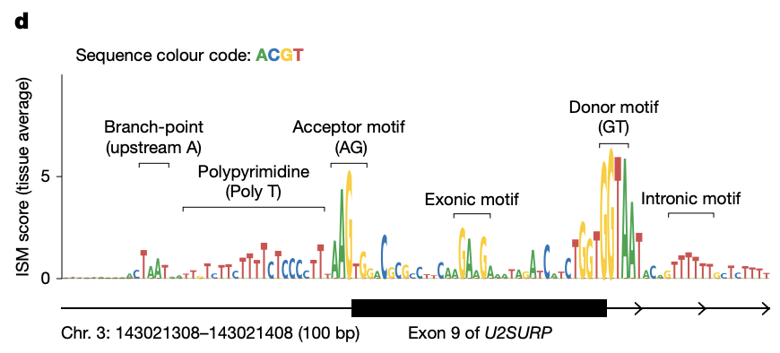

- 모델이 특정 DNA 서열 영역(예: 100bp) 내의 모든 염기를 하나씩 교체하며 결과 변화를 관찰하는 기법
    - Goal: DNA의 어느 글자가 스플라이싱에 가장 결정적인가?를 정량화하여 모델의 **판단 근거**를 시각화
- **데이터 대상:** U2SURP 유전자의 9번 exon 및 인근 intron
    - **Y축 (ISM score):** 기둥(글자)이 높을수록 해당 위치가 변이에 민감하며, 스플라이싱 조절에 **핵심적인 역할**을 함을 의미.
    - **Sequence Logo:** 각 위치에서 어떤 염기(A, C, G, T)가 보존되어야 하는지 크기로 표시
- <b>🔥 </b>모델이 스스로 biological grammar (splicing motifs)를 찾아냈다!
    - **Branch-point (upstream A):** 스플라이싱의 첫 단추를 끼우는 핵심 A 염기.
    - **Polypyrimidine (Poly T):** 가위질 전 단백질이 결합해야 하는 T가 많은 구역.
    - **Acceptor motif (AG):** 인트론이 끝나고 엑손이 시작됨을 알리는 종료 벨
    - **Donor motif (GT):** 엑손이 끝나고 인트론이 시작됨을 알리는 시작 벨
    - **Exonic/Intronic motifs:** 엑손 내부나 인트론에 숨겨진 보조 조절 신호들

<b>🔥 ISM 분석을 굳이 왜 했을까? → Blackbox problem을 해결하기 위해!</b>

#### **1) 모델의 interpretability 확인**

결과는 잘 맞추지만 왜 그렇게 생각했는지 알기 어려움!

- **이유:** ISM을 통해 모델이 중요하게 생각하는 서열(기둥이 높은 곳)을 시각화함으로써, 모델이 **근거 없는 수치**에 의존하는 것이 아니라 **실제 유전 서열의 특징**을 보고 판단한다는 것을 입증함

#### **2) Biological 타당성 검증**

인공지능이 멋대로 예측하는 게 아니라, 실제 생물학 교과서에 나오는 원리를 스스로 깨우쳤는지 확인하는 과정

- **이유:** 그림 3d에서 모델이 높게 점수를 준 부위들이 실제 생물학의 **Donor(GT), Acceptor(AG)** 등과 정확히 일치하는 것을 보여줌으로써 biologically plausible하다는 걸 보여줌

#### **3) 새로운 regulatory sequence 발견할 수 있다**

이미 알려진 모티프 외에, 아직 인간이 잘 모르는 **미세한 조절 부위**를 찾기 위함.

- **이유:** exon motif나 인트론 깊은 곳(Intronic motif)의 작은 기둥들을 통해, "여기가 바뀌면 스플라이싱이 망가질 수 있으니 주의 깊게 봐야 한다"는 가이드라인을 연구자들에게 제시할 수 있음

<b>Fig. 3e, f, g, h, i</b>

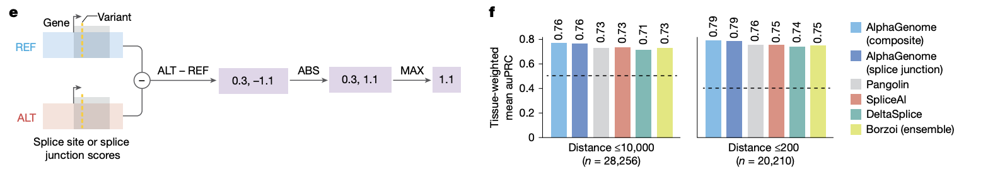

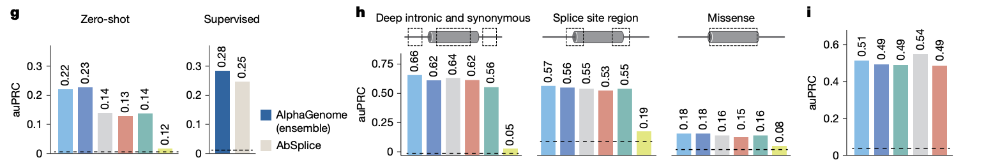

e: AlphaGenome이 variant이 splice-disrupting variant를 어떻게 단일 수치로 계산하는지 과정을 요약함.

- 변화 방향보다 강도가 중요하기 때문에 ABS → 다음에, 그중 가장 크게 변한 수치를 대표 점수로 채택 → 그게 통합 변이 점수 (composite score)가 됨

**f: sQTL 예측 (인구 집단 데이터 검증)**

- sQTL: 인구집단 기준에서 SNP (population단위에서 잘 일어나는 genetic variant)가 스플라이싱 차이를 만드는 지점을 찾는 방법
    - 결과: Splice junction 지표만 사용한 게 모든 모델보다 좋음 (composite와 동일). → 유전자의 최종 연결 상태를 맞추는 것이 변이 해석에 핵심적인 것을 보여줌!

**g, h: 실제 질병에서 관련된 변이를 얼마나 잘 찾아내는지 확인 (ClinVar) (인구 집단 데이터 검증)**

- g: 아주 드물게 나타나는 비정상적 스플라이싱 현상 (outliers) 을 예측하는 데 있어서도 supervised, unsupervised 학습 방법 모두 최고 성능을 보임.
- h: ClinVar 데이터를 사용해서 실제 환자들에게서 발견된 pathogenic (병원성) 변이를 찾아내는 능력<b> </b>
    

    
<b>→ 🔥deep intronic and synonymous & splice site region은 composite이 splice junction only model보다 예측을 더 잘했음. ⁉️왜⁉️</b>

    1. Deep intronic & synonymous: 이 영역의 변이들은 엑손-인트론 경계에서 멀리 떨어져 있거나(Deep intronic), 아미노산을 바꾸지 않아(Synonymous) 겉보기엔 무해해 보인다
        - 왜 composite가 더 잘 맞췄나?: 아직 실제 연결 (junction) 이 일어나기 전이라도, AlphaGenome의 Splice Site(SS)나 Splice Site Usage(SSU) 지표는 이 미세한 잠재적(?) 가위질 신호의 등장을 먼저 감지 → SJ모델은 최종 결과물만 보기 때문에 이 미세한 조짐을 놓칠 수 있지만 Composite는 모든 지표 중 가장 민감한 신호를 잡아채기 때문에 더 높은 성능을 낸다.
    2. Splice site region:
    - 왜 composite가 더 잘 맞췄나?: splicing이 일어나는 바로 그 !!지점!!에서 변이가 생기는 것임
        - 이 위치의 변이는 해당 지점이 Splice site score를 즉각적으로 0에 가깝게 떨어트림.
        - 물론 SJ도 영향을 받을거임. 그렇지만 SS지표가 보여주는 수치적 difference이 훨씬 더 즉각적이고 명확해서 이를 포함하는 composite score가 변이를 더 확실하게 분류할 수 있다.

    

**i: 인공 합성 유전자를 통한 변이 예측 → 진짜 memorization이 아닌지 확인하기 위함**

<b>MFASS란?</b>

- **개념:** 인공적으로 합성한 유전자 조각(**Minigene**)에 수만 개의 가상 변이를 무작위로 발생시켜, 실제 세포 내에서 스플라이싱이 어떻게 일어나는지 한꺼번에 측정하는 **대규모 병렬 기능 분석 실험**
- **Minigene 사용:** 실제 게놈의 복잡성을 줄이고 특정 엑손 주변의 서열 영향력을 집중적으로 분석
- **의의:** 자연 상태(GTEx 등)에서 관찰되지 않는 **극도로 희귀하거나 인공적인 변이**에 대해서도 모델의 순수한 예측 성능을 가늠할 수 있는 테스트

<b>모델별 성능 분석</b>

- **결과:** **Pangolin (0.54) \> AlphaGenome (0.51) \> SpliceAI/DeltaSplice (0.49)**
- **Pangolin 1위의 이유 (Specialist):** Pangolin은 국소적 서열 변화가 스플라이싱에 미치는 영향에 최적화된 모델. 미니진 실험처럼 서열이 짧고 맥락이 단순한 환경에서는 이러한 specialized model의 정밀도가 소폭 높게 나타날 수 있음
- **AlphaGenome:** AlphaGenome은 유전체 전체의 트랙과 구조를 학습한 foundation model. 그럼에도 불구하고 SpliceAI와 최신 모델인 DeltaSplice를 압도하는 강력한 기초 성능을 입증함

- *7개 벤치마크 중 6개 분야에서 SOTA 기록. *

<b>Fig. 4a: 유전자 발현량 (RNA-seq) track에 exon mask를 씌워 실제 단백질로 번역되는 구역의 신호를 집중 분석</b>

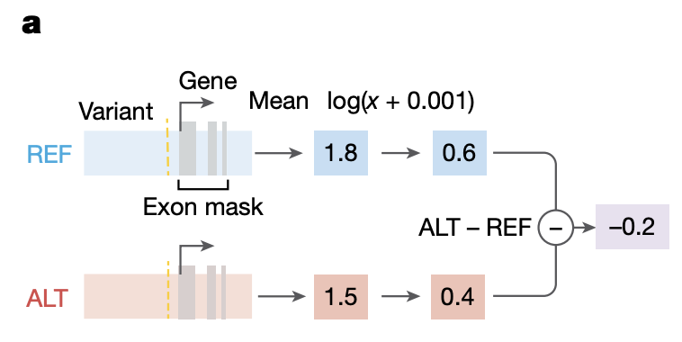

<b>왜 exon mask를 씌우냐?</b>

유전자 전체 영역(수십만 bp)을 다 합치면, 변이와 상관없는 엉뚱한 곳의 수치까지 포함되어 데이터가 오염됨.

1. **좌표 지정:** 모델에게 ***이 유전자의 진짜 설계도(Exon)는 100번부터 200번, 그리고 500번부터 600번 지점이야***라고 알려줌
2. **필터링:** 마스크를 씌우면 나머지 인트론 구역(201\~499번 등)의 그래프 높이는 강제로 **0**이 된다.
3. **합산:** 남은 exon 구역(100\~200, 500\~600)의 모든 지점에서 **Y축 값(신호의 높이)을 전부 더함**

<b>6. (Results) <i>Performance across GENE EXPRESSION tasks</i> - Improved prediction of eQTL effects</b>

<b>Fig. 4b: (Case study): rs9610445 변이 (A &gt; C) 와 APOL4 유전자 (alphagenome이 유전 변이를 어떻게 해석하는지)</b>

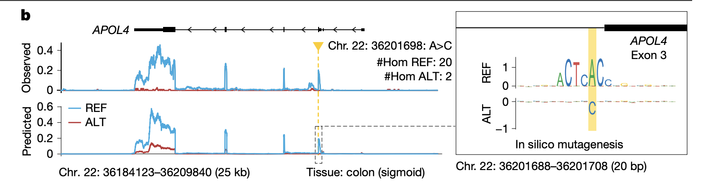

<b>ISM를 통한 기전 규명</b>

**① Inset (Sequence Logo):** **REF ('A'):** 변이 지점 주변의 서열 로고.

- 기둥의 높이가 높다는 것 = 그 위치에 해당 염기가 꼭 있어야 한다는, 즉 <ins>단백질이 결합</ins>하는 중요한 motif임을 뜻함.
    - **ALT ('C'):** 변이가 일어나자마자 서열 로고가 없어짐. 'C'라는 글자가 보이긴 하지만, 주변 기둥의 높이가 낮아졌다는 것은 **단백질이 결합하는 능력이 사라졌다**는 뜻
    - <b>변이 발생: rs9610445 변이(A\>C)가 *APOL4* 유전자의 Splice donor motif (가위질지점!)를 없앰</b> → <b>스플라이싱 오류:</b> 세포 내 편집기가 가위질할 위치를 못 찾아서, aberrant transcript (이상한 전사체?)를 만듬 →  <b>발현량 감소:</b> 우리 몸은 이런 불량 전사체를 즉각 분해해 버리기 때문에, 최종적으로 유전자 발현량이 급감<b> </b>

<b>Fig. 4c, d, e, f</b>

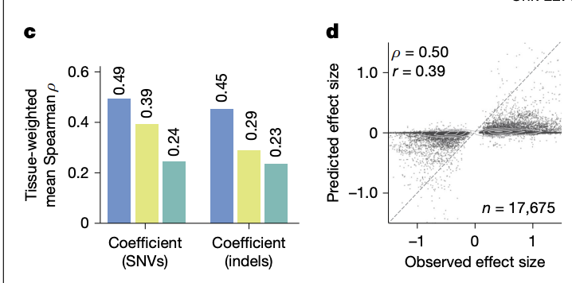

*GTEx란?: genotype-tissue expression의 약자; NIH이 DNA와 실제 RNA 발현량을 조직별로 매칭해놓은 data*

**핵심:** 4b에서 보여준 eQTL예측이 단 하나의 유전자가 아니라, 전체 유전체(GTEx 데이터셋)에서도 일관되게 나타남을 통계적으로 입증함.

- Fig 4c & d:
    - 4c: **지표 (Spearman):** 수치가 높을수록 변이들의 위험도 **순위**를 정확하게 매겼다는 뜻
    - 4d: 데이터(GTEx) 17,675개를 점으로 찍어 AlphaGenome의 예측값과 비교한
        - **의미:** **일치성 -** 발현이 줄어든다고 예측한 변이는 실제로도 줄어들고(3사분면), 늘어난다고 한 변이는 실제로 늘어남(1사분면).
        - **정밀도:** 아주 미세한 변화부터(중심부), 질병을 일으키는 강력한 변화(양 끝단)까지 실제 관찰된 효과 크기를 모델이 거의 비슷하게 재현
- e
    - 지표 (auROC): 변이가 발현을 높일지 아니면 낮출지 맞추는 확률입니다. (0.5는 의미 없음, 1.0은 완벽)
    - 결과: AlphaGenome은 SNV에서 0.80, Indel에서 0.77을 기록했습니다.
- f: 변이와 유전자의 거리가 멀어질수록 발현 예측은 기하급수적으로 어려워짐 → AlphaGenome은 이 한계를 극복
    

    
<b>거리에 따른 결과 분석</b>

    #### **① 0\~3 kb (가까운 거리: 프로모터)**

    - **성능:** AlphaGenome **0.91** vs Borzoi 0.84 vs Enformer 0.77
    - **의미:** 유전자 바로 옆에서 직접적으로 스위치를 끄고 켜는 변이는 거의 완벽(91%)하게 맞춤.

    #### **② 3\~35 kb (중간 거리)**

    - **성능:** 거리가 멀어짐에 따라 모든 모델의 성능이 떨어지기 시작.
    - **차별점:** 타 모델들은 성능 하락 폭이 큰 반면, AlphaGenome은 여전히 **0.77\~0.73** 수준의 높은 신뢰도 유지

    #### **③ \>35 kb (먼 거리: 인핸서)**

    - **성능:** AlphaGenome **0.67** vs Borzoi 0.61 vs Enformer 0.57
    - **발표 핵심 포인트:** **Enformer**는 원래 수백 kb의 장거리 예측을 위해 설계된 모델임에도 불구하고 0.57(거의 찍기 수준)까지 성능이 낮아짐
        - 반면 **AlphaGenome**은 **0.67**을 기록하며, 아주 먼 곳에서 유전자를 원격 조절하는 enhancer mutation에 대해서도 유의미한 예측력을 가진 유일한 모델임을 입증

    
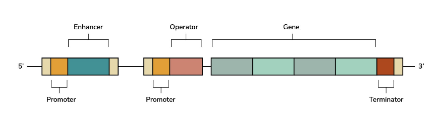

    

<b>Fig. 4g, h, i, j, k: 4e (방향성) & 4f (거리별 성능)의 결과가 실제 질병 연구+임상 현장에서도 이어지는지 확인</b>

<b>Figure g</b>

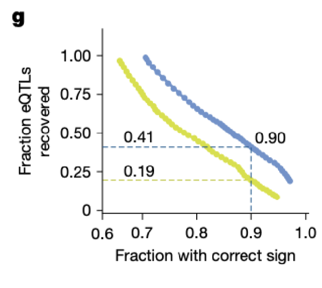

- x축: 정확도(Accuracy); 모델이 변이의 영향력 방향(발현 증가 혹은 감소)을 얼마나 맞췄는지를 나타냄, 오른쪽으로 갈수록 틀릴 확률이 낮은, 매우 신뢰할 수 있는 예측을 의미함.
- y축: 검출률 (recall); 실제 존재하는 전체 eQTL 변이 중 모델이 찾아낸 비율입니다. 위로 갈수록 많은 변이를 놓치지 않고 찾아냈다!를 의미

<b>Figure h: GWAS 변이; “evaluated the ability of AG to assigning a direction of effect to candidate target genes for GWAS credible sets”</b>

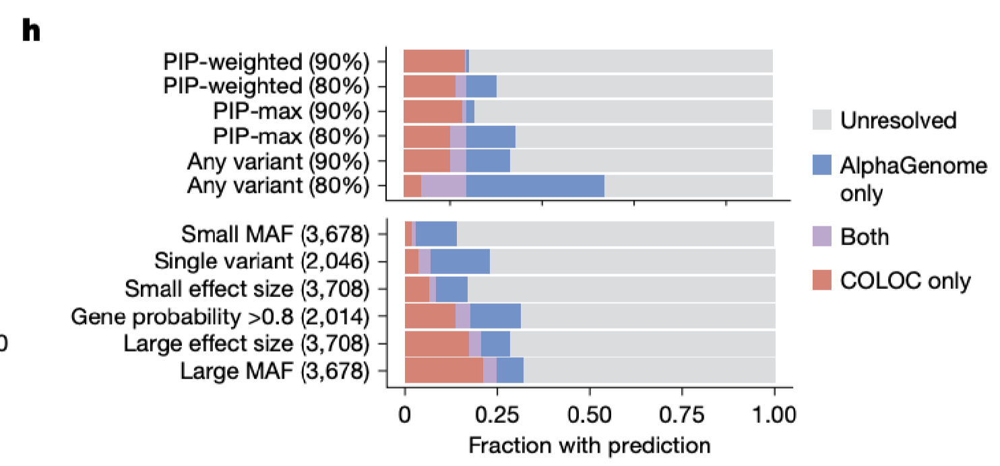

- **개념:** GWAS 연구를 통해 질병 연관 부위를 식별하더라도, linkage disequilibrium으로 인해 수십 개의 변이가 묶여 있는 credible set이 형성됨.
- **문제점:** 해당 군집 내에서 실제 질병을 유발하는 Causal variant를 특정하고, 그 변이가 유전자에 미치는 영향의 방향(증가/감소)을 규명하는 데 기술적 한계가 존재함
- 시사점:
    - **하이브리드 분석 모델의 필요성:** 인구 통계 데이터가 많은 영역은 기존 통계 모델(COLOC)이, 데이터가 부족한 사각지대는 AI 모델(AlphaGenome)이 각각 전담 수사함으로써 질병 원인 규명의 빈틈을 메움
    - **희귀 질환 및 정밀 의료의 확장성:** 데이터 확보가 어려운 희귀 질환이나 특정 소수 인종의 유전체 분석에서 AlphaGenome이 독보적인 성능을 발휘할 수 있음을 입증
    - **기전 기반 가설 제시:** 단순히 질병과 관련 있음을 넘어, <ins>*X 변이가 Y 기전을 파괴하여 발현을 억제(Sign)함*</ins>과 같은 구체적인 분자 생물학적 가설을 생성함으로써 후속 연구의 효율을 획기적으로 높임

<b>Figure 4j: 장거리 조절 (enhancer-gene) 연결 능력</b>

- **Y축 (auPRC):** 정밀도-재현율 곡선 아래 면적(Area Under the Precision-Recall Curve)
    - 예측의 정확도를 나타내며 **값이 1.0에 가까울수록 더 정확하다**는 뜻
    - **X축 (Distance to TSS):** 유전자 시작점(TSS)에서 인핸서까지의 물리적 거리입니다. 4개의 구간으로 나뉘어있음
        - **All:** 모든 거리 구간 통합
        - **0\~3 kb:** 유전자 바로 옆 (프로모터 영역)
        - **10\~100 kb:** 중간 거리
        - **100\~2,500 kb:** **가장 중요한 초장거리 구간.** (수 메가바이트(\$Mb\$) 떨어진 곳)
- INTERPRETATION:
    - **Zero-shot** 결과는 AlphaGenome이 유전체 서열의 **3차원 regulatory grammar를** 이해하고 있음
    - 특히 통계적으로 예측 불가능했던 초장거리 구간(최대 2.5Mb)에서도 유의미한 예측력을 가졌음이 입증
    - **Supervised** 결과는 AlphaGenome의 예측 정보가 기존 전문 모델의 성능을 더욱 향상시키는 **상호 보완적인 character를 가진 걸 보여줌**
    - <b>종합하면:</b> AlphaGenome은 단순히 가까운 유전자 조절뿐만 아니라,<b> 먼 곳(Intergenic region)에 숨겨져 질병을 일으키는 원격 조절 변이</b>까지 정확히 해석할 수 있는 강력한 능력을 갖추었음을 입증함

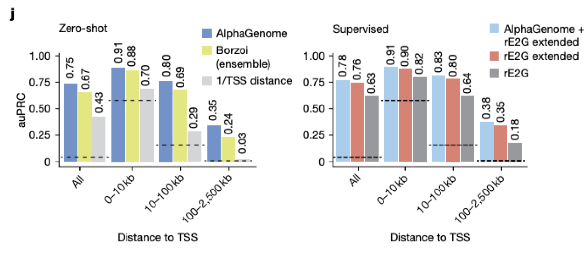

<b>Figure 4k: 만들어진 RNA transcript가 가공되는 미세한 조절 과정</b>

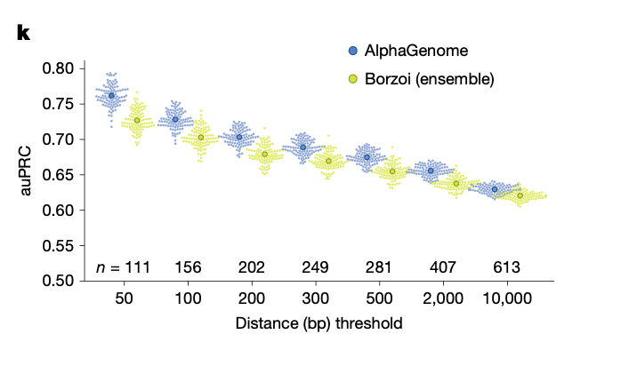

<b>핵심 개념: 폴리아데닐화(Polyadenylation, pA)와 paQTL</b>

- **개념 (Polyadenylation):** pre-mRNA의 3' 끝부분에 수백 개의 아데닌(A) 염기를 붙이는 과정임. 이 과정이 발생하는 위치(**pA 사이트**)에 따라 RNA 조절 영역인 **3' UTR**의 길이가 최종 결정됨.
- **기능 (3' UTR의 역할):** **Long 3' UTR:** miRNA나 RNA 결합 단백질의 표적이 될 확률이 높아져 RNA 분해가 가속화되거나 번역이 억제됨.
- **Short 3' UTR:** 조절 인자들의 결합 부위가 사라져 RNA가 더 안정적으로 유지되며, 결과적으로 단백질 생성량이 증가함.
- **paQTL (Polyade nylation Quantitative Trait Loci):** 유전 변이가 pA 사이트 선택에 영향을 주어 RNA의 길이와 안정성을 변화시키는 현상임. 이는 질병 발생의 주요한 후-전사 조절 기전 중 하나임.

<b><ins>해석</ins></b>

- Figure 4k에서 변이와 pA 사이트 사이의 거리 임계값(Distance threshold)이 커질수록 auPRC가 하락하는 현상은 분석 대상에 Distal variants들이 많아져 예측 난이도가 상승하기 때문.
- 하지만 AlphaGenome은 모든 거리 구간에서 Borzoi를 유의미하게 앞서는 성능을 보임

<b>7. (Results) Improved prediction of chromatin accessibility, DNase sensitivity, and binding QTLs</b>

- 분석의 핵심 목표: 유전 변이가 단순히 유전자 발현량(eQTL)만 바꾸는 것이 아니라, 그 전 단계인 DNA가 **얼마나 열리는지**(caQTL, dsQTL)와 전사 인자가 얼마나 잘 **붙는지**(bQTL)를 얼마나 잘 예측하는지 증명하는 것

| **구분** | **caQTL** | **dsQTL** | **bQTL** |
|---|---|---|---|
| **풀네임** | **Chromatin Accessibility** QTL | **DNase Sensitivity** QTL | **TF Binding** QTL |
| **측정 기술** | **ATAC-seq** | **DNase-seq** | **ChIP-seq** |
| **핵심 질문** | DNA 포장이 얼마나 **느슨하게 풀려** 있는가? | DNA가 **효소(가위)에 의해 얼마나 잘 잘리는가**? | 특정 **전사 인자(단백질)가 실제로 결합**하는가? |
| **생물학적 의미** | 조절 단백질이 접근 가능한 물리적 공간의 확보 여부 판별 | 특정 위치의 조절 활성(Activity) 및 **효소 반응성** 측정 | 변이가 특정 단백질과의 affinity를 바꾸는지 직접 확인 |
| **AlphaGenome의 역할** | 서열 변화가 DNA 구조를 open으로 만드는지 예측 | 변이가 특정 지점의 **조절 부위 활성**을 강화하는지 예측 | 변이가 **전사 인자 결합 모티프**를 생성/파괴하는지 정밀 예측 |

<b>Fig. a,b,c</b>

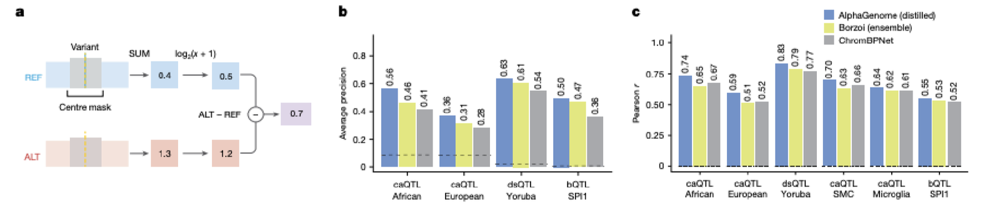

- **\[5a\] 변이 효과 점수화 (Centre-mask scoring)**
    - **방식:** 변이(Variant)가 있는 지점을 중심으로 특정 윈도우 영역을 설정.
    - **계산:** 정상 서열(REF)일 때의 예측값과 변이 서열(ALT)일 때의 예측값의 차이 구함
    - **의미:** 이 수치가 클수록 해당 변이가 DNA의 개방성이나 단백질 결합력에 큰 변화를 준다는 뜻
- **\[5b, 5c\] 모델 간 성능 비교 (SOTA 입증)** AlphaGenome을 기존 모델인 **Borzoi** 및 특정 기능 특화 모델인 **ChromBPNet**과 비교
    - **5b (Causality - 정밀도):** 수많은 변이 중 진짜 원인 변이를 골라내는 능력(Average Precision)에서 AlphaGenome이 모든 인종(아프리카, 유럽, 요루바 인종 등)과 지표(ca, ds, bQTL)에서 가장 높다!
    - **5c (Effect size - 상관관계):** 실제 실험으로 측정된 변화량과 모델의 예측값이 얼마나 일치하는지(Pearson r)를 보여줍니다. 역시 AlphaGenome이 가장 높은 일치율을 보임!

<b>Fig. d,e,f (얼마나 잘 열리는지)</b>

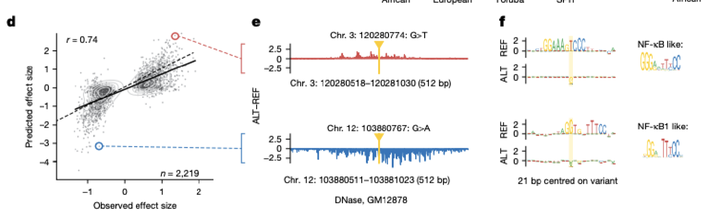

**Step 1. \[Fig. 5d\] 변이 효과의 정량적 정확도 검증**

- **데이터:** 아프리카 인종 caQTL 데이터셋 (n = 2,219) 활용.
- **결과:** 실제 관측된 효과 크기와 모델 예측값 사이의 상관계수 **r = 0.74**달성.
- **의미:** AlphaGenome이 변이의 영향 유무를 넘어, 구조적 변화의 magnitude를 예측
- **사례 추출:** 상관관계 내에서 뚜렷한 **상승(Red circle)** & **하락(Blue circle)** 효과를 보인 두 변이를 선정!

**Step 2. \[Fig. 5e\] 변이 영향의 공간적 해상도 분석 (ALT-REF Delta)**

- **방식:** 변이 서열(ALT)과 정상 서열(REF) 예측값의 차이를 512bp 윈도우 내에서 시각화함.
- **현상:**
    - **상단 (Chr. 3 변이):** 변이 지점을 중심으로 **양(+)의 피크** 형성 → 접근성 **상승**.
    - **하단 (Chr. 12 변이):** 변이 지점을 중심으로 **음(-)의 피크** 형성 → 접근성 **하락**.
    - **의미:** 변이가 주변 크로마틴 구조 전체에 미치는 공간적 영향력을 정확히 시뮬레이션함.

**Step 3. \[Fig. 5f\] ISM 분석을 통한 생물학적 인과관계 규명**

- 두 사례 모두 변이에 의해 기존 chromatin accessibility가 바뀜; 파괴된 전사 인자의 성격에 따라 결과가 반대로 나타남

| **분석 사례** | **변이 전 상태 (REF)** | **변이 후 상태 (ALT)** | **최종 결과 (Access)** |
|---|---|---|---|
| **상단 (Red)** | **억제 인자(Repressor)** 결합 중 | 모티프 파괴  | **상승**  |
| **하단 (Blue)** | **활성 인자(Activator)** 결합 중 | 모티프 파괴  | **하락**  |

<b>Fig. g,h,i (전사 인자(SPI1) 결합력(bQTL) 예측 및 기전)</b>

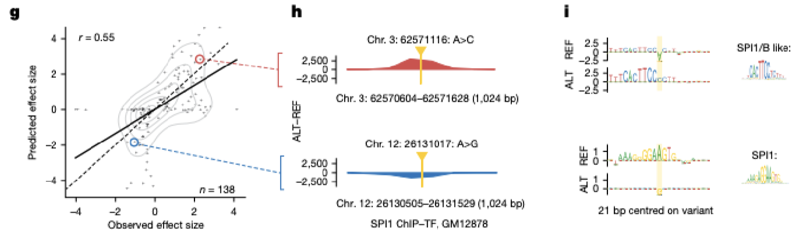

- **분석 대상:** 면역 세포(GM12878)에서 **SPI1** 전사 인자가 결합하는 정도(bQTL, n=138).
- **결과 (r = 0.55):** 실제 ChIP-seq 실험값과 AlphaGenome의 예측값 사이의 상관계수가 0.55를 기록함.
- **의미:** 단백질이 DNA에 결합하는 미세한 물리적 affinity 변화를 모델이 서열만 보고 절반 이상의 확률로 정확히 정량화하고 있음을 보여줌.
- **추출 사례:**
    - <b>빨간색 원: </b>변이가 생기니 SPI1이 더 잘 붙게 된 경우 (<b>상승</b>).
    - **파란 원:** 변이가 생기니 SPI1이 못 붙게 된 경우 (**하락**).
- 5g에서 선택한 변이가 SPI1 결합 트랙을 어떻게 바꾸는지 보여줌
    - **상단:** 변이 지점(노란 삼각형)에서 그래프가 **위로 솟음**. 변이가 SPI1을 불러들이는 역할을 했다는 뜻임.
    - **하단:** 그래프가 **아래로 꺾임**. 변이가 원래 붙어있던 SPI1을 쫓아냈다는 뜻임.

| **구분** | **상단 사례 (Red)** | **하단 사례 (Blue)** |
|---|---|---|
| **타겟 유전자** | Chr. 3: 62571116 (A\>C) | Chr. 12: 26131017 (A\>G) |
| **예측 결과 (5h)** | SPI1 결합량 **상승**  | SPI1 결합량 **하락**  |
| **기전 분석 (5i)** | **Gain** of Motif (신규 생성) | **Loss** of Motif (기존 파괴) |
| **AlphaGenome의 예측** | 서열 변화로 SPI1 자리가 새로 생김 | 서열 변화로 원래 있던 자리가 파괴됨 |

<b>Fig. j (실전 검증: CAGI5 MPRA 챌린지 성능 분석)</b>

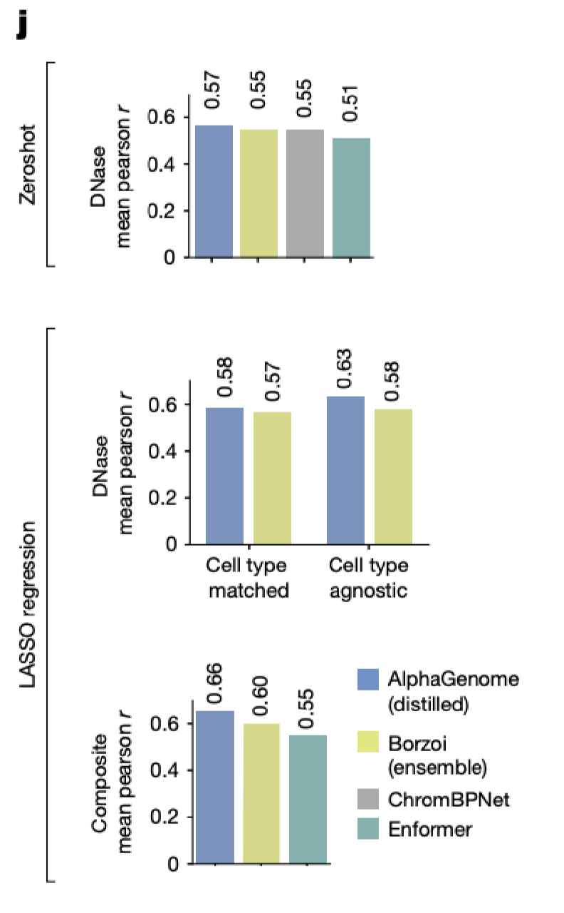

### **MPRA란?**

- **MPRA (실전 테스트):** 인공적으로 수천 개의 DNA 서열을 합성하여 세포에 넣고 → 각 서열이 유전자를 얼마나 켜는지 직접 측정하는 실험입니다.
    - 서열의 regulatory grammar을 모델이 진짜로 이해하는지 확인하는 시험

<b><ins>결과</ins></b>

#### <b>① Zeroshot </b>

- **내용:** 모델이 학습 과정에서 보지 못한 새로운 서열들에 대해, **DNase(접근성)** 정보 하나만으로 즉석 예측한 결과
- **분석:** AlphaGenome(0.57)이 Borzoi(0.55), ChromBPNet(0.55)을 제치고 가장 높은 상관관계
- <b>의미:</b> 모델의 basic<b> 유전체 이해도</b> 자체가 경쟁 모델보다 높음

#### **② LASSO Regression (정보통합)**

- **내용:** 한 종류의 세포 데이터만 쓰는 게 아니라, AlphaGenome이 학습한 **모든 세포 타입의 DNase 정보**를 통계적으로 통합(LASSO)하여 예측한 결과
- **분석:** 특정 세포에 맞춘 것(Cell type matched, 0.58)보다, 모든 세포의 정보를 종합한 것(**Cell type agnostic, 0.63**)이 성능 좋음
- **의미:** 유전 변이의 효과는 하나의 세포 타입만 봐서는 알 수 없으며, **다양한 세포 환경의 데이터를 통합**할 때 더 정교한 예측이 가능.

#### <b>③ Composite LASSO </b>

- **내용:** DNase(접근성) 뿐만 아니라 **RNA(발현량)**, **ChIP(단백질 결합)** 등 모델이 가진 모든 데이터 channel/modality을 하나로 융합한 최종 모델
- **분석:** **0.66**이라는 압도적인 상관관계를 기록하며 현존 SOTA(세계 최고 성능)를 달성
- **의미:** AlphaGenome이 유전체의 열림 정도, 단백질 결합, 최종 RNA을 **입체적으로 연결해서 이해**하고 있다

<b>8. (Results) Multimodal view of variant effects</b>

앞서: Variant를 봤을 때 → chromatin 풀리는지(caQTL), 단백질이 붙는지(bQTL) 봄

이제는: 백혈병에서 TAL1 유전자가 왜 켜졌는지 process를 multimodal하게 본다 (한 눈에)

<b>Fig. a (암 유전자 주변의 전체 지도)</b>

- TAL1 유전자 주변 32.7 kb의 map
- 중요: 핵심 mutation은 하나!
    - **세 가지 변이 그룹:**
        - **오른쪽 (3' neo-enhancer):** 유전자에서 멀리 떨어진 곳에 노란 삼각형이 몰려있음. 변이가 생기면서 새로운 enhancer이 만들어진 곳
        - **가운데 (Intronic SNV):** 유전자 내부(인트론)에 생긴 단일 염기 변이
        - **왼쪽 (5' neo-enhancer)**
    - **결론:** 위치는 다 다르지만 이 모든 변이들은 결국 **TAL1 유전자를 비정상적으로 켜서 백혈병을 일으킨다**는 하나의 결과로 수렴함

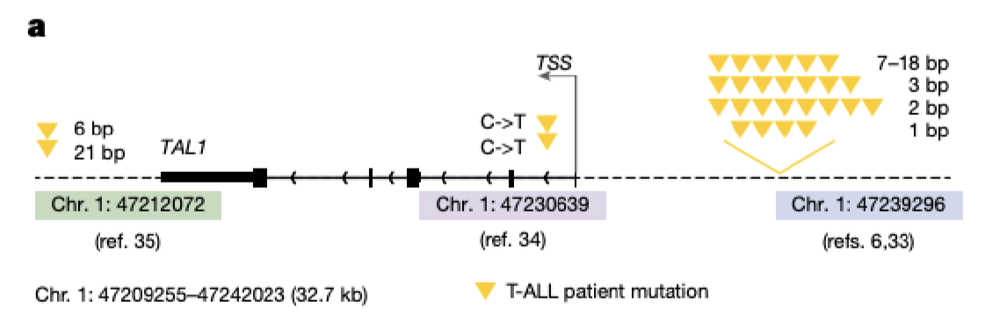

<b>Fig. b (map 속 특정 지점에서 벌어지는 multimodal view mechanism)</b>

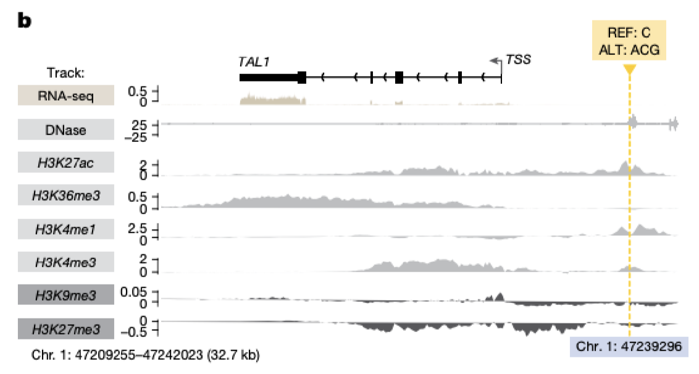

특정 변이(C \> ACG)가 발생했을 때의 변화를 층위별로 예측한 결과

- <b>첫 번째 단계: </b>
    - **DNase:** 변이 지점(노란 점선)에서 peak → DNA 포장이 풀렸음
- <b>두 번째 단계: </b>
    - **H3K27ac & H3K4me1:** active enhancer 마커.
        - 원래는 아무것도 없던 곳에 갑자기 이 두 마커 expression 커짐 → new enhancer for TAL1 gene → 멀리 있는 TAL1 유전자를 강제로 켜서 백혈병을 일으키는 것임을 예측
- **세 번째 단계: 방해 요소 제거 (Removing Repression)**
    - **H3K9me3 & H3K27me3:** 유전자를 못 읽게 억제하는 repressor.
        - TSS (유전자 입구(?)) 근처에서 이 수치들이 낮아지며 **억제가 풀림**을 보여줌
- **마지막 단계: 결과물 출력 (Output)**
    - **H3K36me3 & RNA-seq:** 유전자가 실제로 읽히고 있다는 신호. 먼 곳의 스위치가 켜짐 → 결국 **TAL1 유전자 본체(왼쪽)가 작동**하기 시작

<b>Fig. c (단순히 DNA가 길어지거나 특정 위치에 변이가 생기는 것만으로 암이 유발되는지, 아니면 특정 motif이 있어야만 하는지를 모델이 판별함)</b>

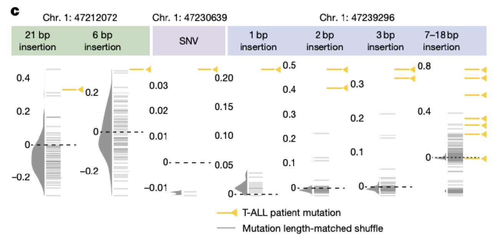

<b>연구 설계</b>

- 본 분석은 T-ALL(T세포 급성 림프구 백혈병) 발암 과정에서 발견된 Non-coding 변이들이 실제 TAL1 oncogene을 과발현시키는 casual variant임을 입증하기 위해 설계됨
- **비교군 설정 (Controls):**
    - **Oncogenic Variants (yellow triangles):** 기존 문헌에서 확인된 T-ALL 환자 유래 발암 변이
    - **Shuffle Controls (회색 산):** 환자 변이와 Length-matched는 동일하게 유지하되 서열 순서(Sequence-shuffled)만 무작위로 뒤섞은 대조군

<b>데이터 해석</b>

- Y축은 AlphaGenome이 예측한 **TAL1 발현량의 변화 정도**를 나타냄 → 수치가 높을수록 암 유발 신호
1. **회색 산 의미: 배경 noise**
    - **형태:** 예측값 0 근처에 밀집된 density plot
        - **해석:** 서열을 무작위로 섞으면 genome의 regulatory grammar이 망가짐 → 대부분의 가짜 변이들은 TAL1 발현에 영향을 주지 못하고 점수가 **0(Neutral)** 근처에 모여 산 모양을 형성
2. **노란색 삼각형의 의미: functional outliers**
- **현상:** 환자 유래 변이들은 회색 분포를 벗어나 극단값(0.4\~0.8)에 위치
- <b>해석:</b> 환자의 mutation effect 우연이 아니라, transcription factor이<b>결합할 수 있는 서열이라는 것을 <b>뜻함. 특히 </b>7–18 bp insertion</b> 구역에서 가장 강력한 활성화(0.8)가 관찰됨

<b>Fig. d (Unsupervised clustering)</b>

많은 변이들을 AlphaGenome이 예측한 9가지 데이터를 기준으로 비슷한 애들끼리 모아본 것

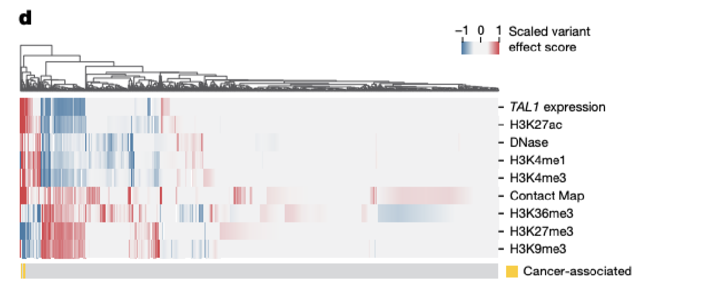

- **X축:** 개별 변이들 (환자 변이 + 무작위 셔플 변이들이 섞여 있음).
- **Y축:** AlphaGenome이 예측하는 서로 다른 데이터 층위 (RNA 발현, 히스톤 마킹, 3D 구조 등).

<b>중요 결과</b>

1. <b>일관된 multimodal mechanism: </b>
- **상승:** TAL1 발현, H3K27ac(활성 스위치), DNase(접근성), H3K4me1/3 등이 모두 red!!
- **하락:** 반대로 유전자를 억제하고 있던 수치들은 파람
1. Contact map 봤을 때 빨감 → 변이 지점이 물리적으로 멀리 떨어진 \$TAL1\$ 유전자와 **3D 공간에서 접촉**하며 직접적으로 조절하기 시작했음을 모델이 예측

###

<b>Fig. e (ISM: AlphaGenome이 왜 TAL1 유전자 주변의 C &gt; ACG 변이를 위험하다고 판단했는지)</b>

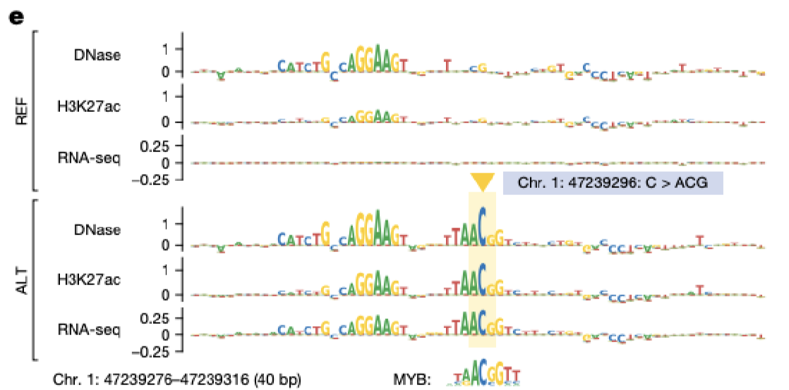

- **정상 서열 (REF):** 변이 지점 주변 TAL1 발현에 영향을 줄 만한 유의미한 서열 특징이 존재하지 않음. → 유전자가 꺼진 상태를 유지함.
- **변이 서열 (ALT):** C가 ACG로 바뀌면서 **MYB 결합 모티프**가 de novo formation됨
    - **연쇄 반응:** 이 모티프가 생성됨과 동시에 **DNase(접근성)** 상승, **H3K27ac(활성 마커)** 증가, 최종적으로 **RNA-seq(발현량)** 상승이 동시에 예측됨.
    - **새로운 발견:** 모델은 기존에 알려진 MYB 외에도 근처의 **ETS-like motif** 변이 서열에서 활성화됨을 추가로 식별함. 이는 모델이 우리가 인지하지 못한 다른 **협력적 조절 기전**까지 포착할 수 있음을 시사함.

<b>Fig. f</b>

**실제 환자의 질병을 일으키는 casual variant를 얼마나 잘 찾아내는지**를 최종 검증함. 수만 개의 무의미한 변이들 사이에서 질병의 핵심 원인을 골라내는 Prioritization 능력을 평가함.

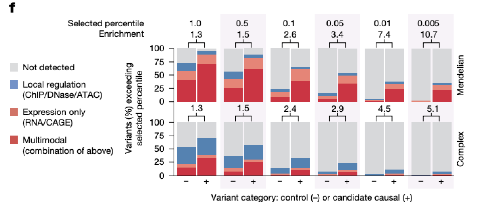

- **Enrichment의 극대화:** 모델이 "매우 위험하다"고 판단한 상위 0.005%의 변이군을 추출했을 때, 그 안에 실제 질병 원인이 포함되어 있을 확률이 무작위 추출 대비 **최대 10.7배(멘델 질환 기준)** 높게 나타남.
- **질환별 성능:** 유전적 원인이 뚜렷한 Mendelian에서 높은 성능을 보였으며, 수많은 유전자가 복합적으로 관여하는 complex에서도 5배 이상의 유의미한 변별력을 증명함.
- **Synergy of multimodal 지표:** 접근성, 히스톤 마커, 발현량을 모두 합친 지표를 활용했을 때, 변이 식별의 정밀도가 가장 높게 나타남 → AlphaGenome이 유전체 조절 시스템을 입체적으로 이해하고 있음을 뜻함.

##

<b>Ablation study — 설계 최적화 & 성능 기여도 분석</b>

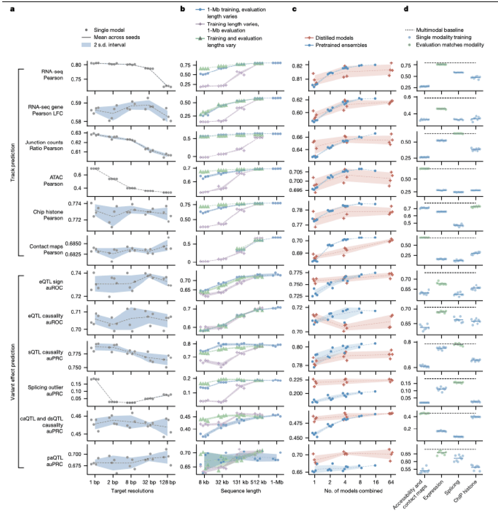

<b>타겟 해상도의 중요성: Fig. 7a</b>

- **분석 내용:** 예측 단위를 1-bp부터 128까지 변화시키며 성능을 측정함.
- **결과:** **1-bp 해상도**로 학습했을 때 가장 높은 성능을 보임.
- 특히 splicing이나 접근성 (ataq)처럼 아주 미세한 서열 변화가 중요한 작업에서는 해상도가 낮아질수록(뭉뚱그릴수록) 성능이 급격히 하락함.
- *반면, 히스톤 마킹(ChIP-seq)이나 3D 구조(Contact maps)처럼 비교적 넓은 범위를 보는 데이터는 해상도 변화에 덜 민감함.*
- **결론: 정밀한 유전체 해석을 위해서는 염기 단위(1-bp)의 고해상도 학습이 필수적임.**

<b>서열 길이와 context: Fig. 7b</b>

- **분석 내용:** 학습 시 사용하는 DNA 길이를 8kb - 1Mb test
- **결과:** **1Mb 컨텍스트**를 모두 사용할 때 성능이 가장 우수함.
    - 짧은 서열(32 kb 이하)로 학습한 모델은 나중에 긴 서열을 보여줘도 성능이 낮았음.  → 학습 단계부터 **긴 유전체 맥락**을 보는 것이 모델의 지능(?)을 높이는 데 결정적임.
    - 재미있는 점! → 1Mb 학습한 모델은 나중에 짧은 서열만 줘도, 처음부터 짧게 학습한 모델보다 더 잘하거나 비슷하게 해냄.
    - **🔥결론:** 유전체 조절의 원거리 상호작용을 포착하기 위해 **1 Mb 이상의 긴 입력값**이 매우 중요함.**🔥**

<b>Distillation model: Fig. 7c</b>

- **분석 내용:** 여러 모델을 동시에 돌리는 ensemble과 여러 모델의 지식을 한 모델에게 압축해 전달하는 distillation을 비교 → distillation이 더 뛰어난 성능
- **결론:** 지식 증류를 통해 **낮은 연산 비용(가벼운 모델)으로도 초고성능**을 낼 수 있음

<b>Multimodal 학습의 중요성: Fig. 7d</b>

- **분석 내용:** RNA, ATAC, ChIP 등 특정 데이터군만 따로 학습시켰을 때와 모두 합쳤을 때를 비교함.
- **결과:** 모든 데이터를 통합한 멀티모달 모델이 거의 모든 작업에서 단일 모달 모델들을 win.
    - 특정 작업(예: eQTL 예측)은 발현량 데이터뿐만 아니라 접근성, 히스톤 마킹 데이터가 합쳐질 때 성능이 비약적으로 상승함.
    - 데이터 간에 중복성이 존재하여 하나를 빼도 성능이 급락하진 않지만, 전체를 합쳤을 때 가장 robust한 예측이 가능함.
- **결론:** 다양한 유전체 데이터를 통합 학습하는 것이 **조절 기전의 전체 그림**을 이해하는 데 핵심임.

<b>Discussion</b>

<b>주요 성과: Alphagenome은 genome의 복잡한 regulatory codes를 해독하기 위해 설계된 multimodal/통합 딥러닝 모델임.</b>

- **통합적 예측 능력:** 1Mb 규모의 긴 DNA 서열로부터 다양한 기능적 유전체 신호를 동시에 예측
- **전문 모델 초월:** 특정 작업에만 특화된 기존 SOTA(최고 성능) 모델들과 대등하거나 그 이상의 성능을 보이며 DNA 조절 원리에 대한 이해력 입증
- **효율적인 멀티모달 추론:** 단 한 번의 연산(Inference pass)으로 유전자 발현, 접근성, 히스톤 마킹 등 모든 데이터를 점수화하여 복잡한 변이 기전(TAL1 사례 등)을 효과적으로 분석
- **스플라이싱 해독:** 새로운 스플라이싱 정션(Splice junction) 모델링 기능을 통해 스플라이싱 오류를 유발하는 변이를 통합적으로 관찰 가능

<b>Future applications!</b>

- **가상 실험 (In silico Experimentation):** wet lab 전 가상 실험을 통해 가설을 생성하고 실험의 우선순위를 정할 수 있음
- **희귀 질환 진단:** 의미가 불분명했던 비부호화 변이(VUS)에 대한 기능적 근거를 제공하여 새로운 진단 경로를 제시
- **서열 디자인 및 치료제 개발:** 조직 특이적 인핸서 설계나 치료용 안티센스 올리고뉴클레오타이드(ASO) 개발 속도를 높이는 데 기여
- **생성형 모델과의 시너지:** 새로운 DNA 서열을 만드는 생성 모델이 만든 서열이 실제로 어떤 기능을 할지 예측하고 검증하는 도구로 쓰일 수 있음 (evo-2??)

<b>🔥Limitations</b>

**1. 조직 및 환경 특이성 (Tissue & condition specificity)**

: DNA 서열만으론 세포의 실시간 변화를 완벽히 따라가는 데 물리적 한계가 있음.

- **정적 서열 vs dynamic 환경:** 모델은 DNA 설계도만 보고 예측함.
    - 하지만 실제 세포는 전사 인자(TF) 농도, 호르몬, 약물, 영양 상태 등에 따라 실시간으로 변함.
    - 특히 염증이나 저산소(hypoxia) 같은 동적인 상태를 100% 반영하긴 어려움.
    - **희귀 세포 데이터 부족:** 학습 데이터가 주로 bulk나 표준 세포주 위주임 → 암 조직 내 극소수인 CSC나 전이 단계의 특수한 세포 상태는 모델이 충분히 학습하지 못했을 가능성이 큼.
    - **질병 상태의 복잡성:** 췌장암처럼 종양 미세환경이 복잡한 경우, 정상 세포에는 없는 이상한 조절 규칙이 생김. 이런 암 특이적 메커니즘을 일반 모델이 완벽히 재현하려면 아직 보완이 필요함.

**2. 데이터 편향성 (data bias: protein-coding vs non-coding)**

- 학습 데이터가 단백질을 만드는 유전자에 쏠려 있어서, 조절 역할을 하는 non coding 예측력은 상대적으로 낮을 수 있음.
- **양적 불균형:** non coding genomic region 영역은 데이터 부족으로 예측 정확도가 떨어지는 편향이 발생함.
- **메커니즘의 차이:** 단백질 유전자(mRNA)와 miRNA 만들어지는 생물학적 기전(예: Dicer 과정)은 아예 다름. 모델이 주로 mRNA 문법으로 학습되어서, **miRNA 특유의 조절 문법**에는 서툴 수 있음. → **🔥암 연구 시 주의사항🔥:** 암 억제나 촉진에 중요한 miRNA, lncRNA를 분석할 때는 모델 점수만 믿지 말고 실제 실험 데이터와 대조해보는 보수적인 접근이 필수임.

<b>Future works?</b>

Single-cell 통합!

→ **무슨 뜻:** 지금의 알파게놈은 여러 세포를 갈아서 만든 bulk 데이터를 주로 씀.  → **왜 하는가:** PDAC처럼 종양 미세환경이 복잡한 경우, 암세포, 면역세포, 섬유아세포가 다 섞여있음. → 싱글셀 데이터를 통합하면 **"이 변이가 암세포에서만 독하게 작동하는지"** 세포 하나하나의 해상도로 정교하게 예측할 수 있게 됨.

