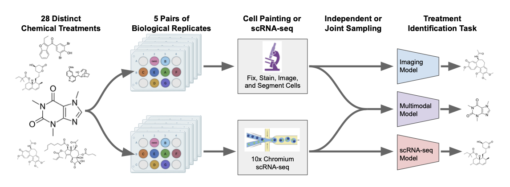

# [지헌] scGeneScope: A Treatment-Matched Single Cell Imaging and Transcriptomics Dataset and Benchmark for Treatment Response Modeling

[🏠 Portfolio](https://github.com/heoneyzi) › [📚 Study](../../../../README.md) › [🧬 Genomics](../../../README.md) › [Season 1 · Functional Genomics](../../README.md) › [Journal club](../README.md) › [Paper proposals](README.md)

> ✍️ **강지헌 (me)** · 📅 week-1 proposal (Feb 2026) · 🗂️ Source: Notion — *Functional Genomics › 저널클럽 논문 제안 › [지헌] scGeneScope*
>
> 🔁 Duplicate in Notion, not reproduced: *Genomics (1) › scGeneScope* (identical); the proposal row *[지헌] scGeneScope* only wraps this page.
>
> 🗳️ Proposal · 1주차 · — not selected · 읽고 싶어요: 지헌

---

Single-cell Multimodal 데이터를 활용하여 특정 약물 처리가 세포에 미친 영향을 분석하고, 이를 바탕으로 어떤 약물이 처리되었는지 맞추는 Task

- 현미경 이미지에서 유전자 발현량을 예측하는 Task인데, Virtual Cell에 친숙하게 다가갈 수 있을 것 같아서 정해봤습니다.
- 파이프라인이 크게 어렵지 않지만, 이러한 형태로 구성하면 어텐션 메커니즘 등을 다른 Task에도 사용할 수 있지 않을까 싶기도 했어요!

이 논문에서 하고 싶은 말

- scRNA-seq가 가장 강력한 지표임은 맞다!
- 범용적인 파운데이션 모델보다 데이터 특화 모델이 더 강력한 Baseline으로 잡힌다.
- 이미지 데이터의 한계는 명확하기는 해서 일반화가 어렵다.
- 단순히 모델을 크게 만들거나 모달리티를 합치는 것보다, 여러 세포의 데이터를 어떻게 잘 묶느냐(DeepSet 등)가 성능 향상의 중요 포인트다.
- 오히려 데이터 특화된 모델이 범용적인 ViT보다 낮게 나오기도 한다… 데이터의 노이즈?
