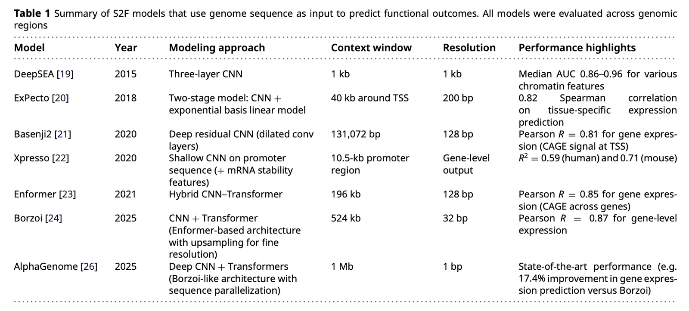
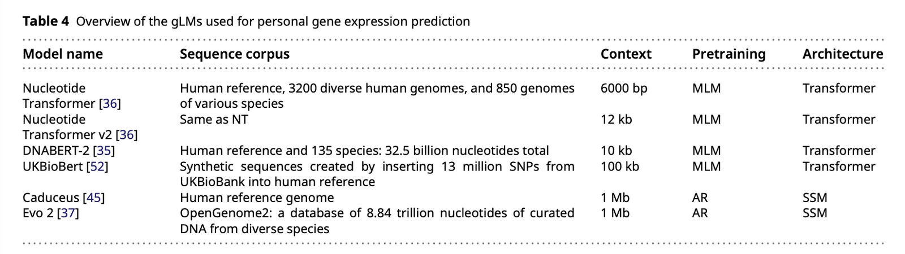
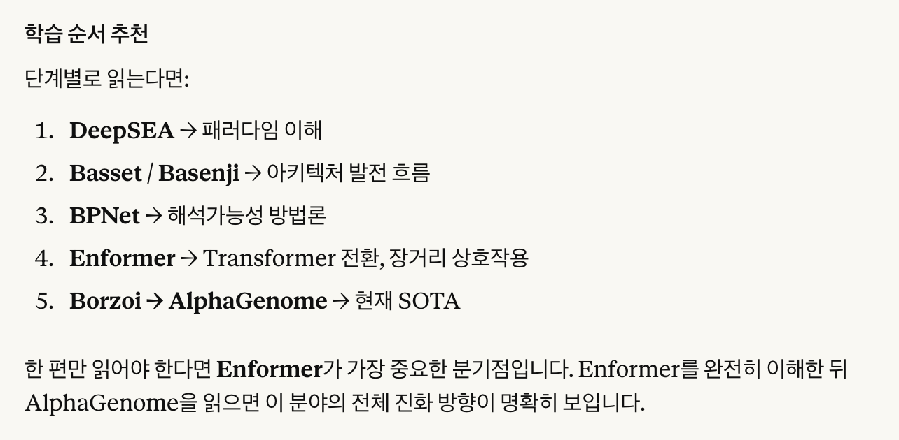

# [윤진] Personalized gene expression prediction in the era of deep learning: a review

[🏠 Portfolio](https://github.com/heoneyzi) › [📚 Study](../../../../README.md) › [🧬 Genomics](../../../README.md) › [Season 1 · Functional Genomics](../../README.md) › [Journal club](../README.md) › [Paper proposals](README.md)

> ✍️ **조윤진 (teammate)** · 📅 week-3 proposal (Feb 2026) · 🗂️ Source: Notion — *Functional Genomics › 저널클럽 논문 제안*
>
> 🗳️ Proposal · 3주차 · — not selected · 읽고 싶어요: 윤진, 수빈

---

링크 : [https://academic.oup.com/bib/article/27/1/bbag022/8445445](https://academic.oup.com/bib/article/27/1/bbag022/8445445)

**1. 선정 이유** :

<ins><b>2026년의 alphagenome을 포함하는 리뷰 논문. </b></ins>

(1) Genome 간의 관계를 학습하는 GLM은 이제 우리가 어느 정도 앎(table 4). <ins>**DNA sequence → gene expression를 바로 예측하는 S2F model**</ins>(sequence to function, table 1)에 대한 배경적 이해가 필요하다고 생각하여 읽어보았으면 좋겠음.

cf) S2F 모델의 가장 최신 SOTA가 바로 alphagenome임. 이거 읽은 뒤에, enformer나 alphagemone, 혹은 알파지놈의 모델구조 기반이 된 Borzoi를 읽으면 좋을듯.

(2) 저자들은 Genome AI 모델(S2F, GLM)이 reference genome 기준에서는 매우 성공적이지만, 개개인의 genome에서 ‘사람마다 어떻게 다르게 작동하는지’는 잘 학습하지 못함을 지적. <ins>**디스커션에서 던지는 질문들이 굉장히 같이 생각해볼만함.**</ins>

- gLM에서도 scaling law가 성립할까? : 그렇다면 지금 가장 큰 병목은 데이터임
- Biological prior를 모델 설계에 반영해야 함
- Causal inference 필요성, interpretability 문제
1. <b>내용 : </b>
    Personalized gene expression prediction 문제에 초점을 두어서, <ins><b>S2F model과 GLM을 순서대로 리뷰하고, 실험하고, 시사점을 다룸. </b></ins>

    저자들은 Gene 간 regulatory mechanism과 개인 간 variant effect mechanism은 본질적으로 다른 정보 구조일 수 있음(<ins>**variant-level perturbation logic을 모델이 배우지 못하였을 수 있음**</ins>)을 주장.

- 📄 [cf)S2F model 계보](07a_s2f_model_lineage.md)

