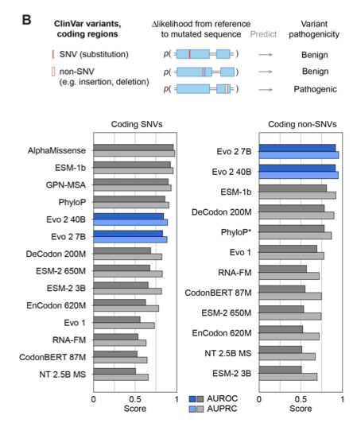
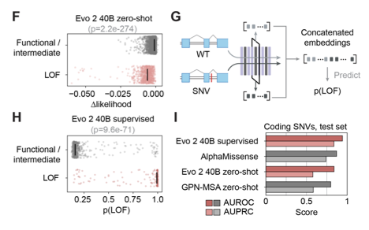
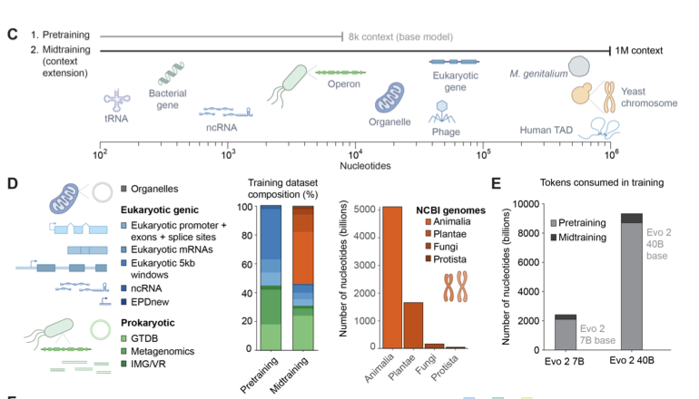

# [유민] Genome modeling and design across all domains of life with Evo 2

[🏠 Portfolio](https://github.com/heoneyzi) › [📚 Study](../../../../README.md) › [🧬 Genomics](../../../README.md) › [Season 1 · Functional Genomics](../../README.md) › [Journal club](../README.md) › [Paper proposals](README.md)

> ✍️ **정유민 (teammate)** · 📅 week-3 proposal (Feb 2026) · 🗂️ Source: Notion — *Functional Genomics › 저널클럽 논문 제안*
>
> 🗳️ Proposal · 3주차 · ✅ read together · 읽고 싶어요: 유민, 지헌, 윤진, 민선, 수빈
>
> ➡️ Became the [week-4 session](../04_week4_evo2.md).

---

[www.biorxiv.org](https://www.biorxiv.org/content/10.1101/2025.02.18.638918v1)

**이 논문의 중요도는 3가지로 요약할 수 있음**

1. <ins>현재 gLM중 zero shot variant effect prediction 성능이 가장 우수함 (왼쪽 coding SNVs는 protein model들이 더 좋은건 당연..)</ins>
    

2. <ins>causal language modeling 으로 generative capability가 있으며 실제 실험해서 viable, highly functional 함을 보임 → </ins><ins>[www.biorxiv.org](https://www.biorxiv.org/content/10.1101/2025.09.12.675911v1)</ins>
3. <ins>supervised finetuning으로 BRCA1 variant effect prediction에 사용할 수 있는 방법까지 method란에 자세히 기술됨: 방법론 익히기에 좋을 것 같음</ins>
    

- All domains of life를 학습데이터로 활용!!하였고 단계적 학습하는 과정이 참고할만 함
    

읽고 토론할 거리도 있음:

- 이러한 Causal LM에서 Prompt(context) engineering으로 보이지 않는 성능을 끌어올릴 수 있는가? 가능하다면 어떻게?
- Evo 2로 생성한 바이러스(bacteriophage) 논문을 보면, 생성을 촉매하기 위해 Evo 2를 특정 바이러스 Family에서 fine-tuning 하는데 이러한 접근이 단순 암기와 다른 지점은 무엇일까?
