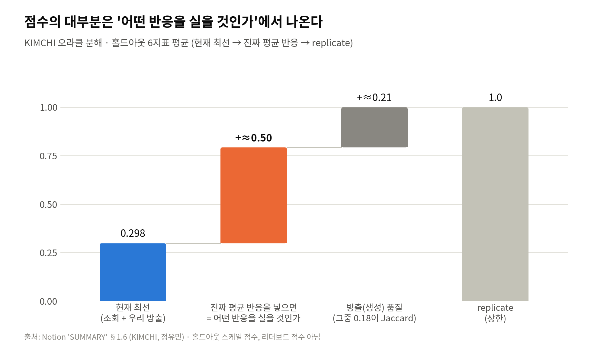

[🏠 Portfolio](https://github.com/heoneyzi) › [📚 Study](../../README.md) › [🧬 Genomics](../README.md) › **Season 2 · Functional Genomics 2**

# Season 2 · Functional Genomics 2 (Jul 2026 – ongoing)

The season I lead: from AI-driven drug discovery to single-cell Perturbation prediction, organised around the Virtual Cell Challenge 2026.

<b>🇰🇷 한국어 요약</b>

시즌 2는 제가 팀장을 맡은 여섯 명의 팀으로, 세포에 약물이나 유전자 억제(CRISPRi) 같은 Perturbation을 가했을 때 세포 전체의 유전자 발현이 어떻게 변하는지를 예측하는 문제에 집중합니다. 첫 세션에서 제가 AI 기반 신약 개발 흐름(Lab-in-the-Loop, PhenoCompass)을 소개했고, 팀원들이 파운데이션 모델의 한계, 최적수송 기반 약물 반응 모델, VCC 2025 수상작 분석을 이어서 발표했습니다. 이후 Virtual Cell Challenge 2026에 참가해, 한 번도 본 적 없는 세포주의 대조군 세포만 보고 300개 유전자 억제 결과를 맞히는 제로샷 과제에 팀원별로 다른 방법을 시도했습니다. 처음 가 보는 도시의 날씨를 비슷한 도시들의 기록으로 추정하는 것처럼, 이미 측정된 다른 세포주의 반응을 잘 옮겨 오는 것이 점수의 대부분을 만든다는 것이 지금까지의 결론입니다. 이 관점을 정리하기 위해 ICML 2026 논문을 리뷰했고, 대회의 최종 순위는 팀 기록 기준 10월 22일 공개되는 테스트셋으로 정해집니다.

| | |
|---|---|
| **Period** | 2026-07-28 (first session) → ongoing (VCC 2026 test set: 2026-10-22, per team notes) |
| **Team** | 6 members — **강지헌 (lead)**, 정유민, 김민석, 김서진, 김서연, 이동현 |
| **My role** | YAI **Functional Genomics Team Lead** (Jun 2026 –) · **VCC 2026 Team Lead** · [first session](sessions/01_fg_overview1_drug_discovery_2026-07-28.md) with [slide notes](sessions/01a_lab_in_the_loop_slide_notes.md), [dataset map](vcc2026/01_datasets_perturb_essentials.md), [frozen-baseline analysis](vcc2026/07_baseline_analysis.md), [representation review](reviews/README.md) |
| **Notes** | 24 |
| **Status** | 🔄 Ongoing |

## 🗺️ Sections

| | Section | What | Highlight |
|---|---|---|---|
|  | [Team sessions](sessions/README.md) | Weekly sessions and meetings (7 notes) | I opened with AI for drug discovery |
|  | [VCC 2026](vcc2026/README.md) | Datasets, baselines and each member's route (13 notes) | validation board 30 / 181 (team, 09-06) |
|  | [Reviews](reviews/README.md) | My representation review series (3 notes) | ICML 2026 paper read through VCC |

Also on the FG2 home page:

| Note | Author | Date | What it is |
|---|---|---|---|
| [모델 참고 · Arc virtual-cell stack](00_arc_model_reference.md) | (quoted) | 2026-07 | Arc Institute's virtual-cell stack as listed in the VCC 2026 announcement: State, Stack, Evo 2, scBaseCount, Proto, CodonFM. |

## 💡 Findings so far (scoped)

- **Most validation targets were already measured.** 272 of the 300 validation targets appear in the Replogle 2022 K562 genome-wide screen, so retrieval beat training a large model (정유民's log: [PROGRESS](vcc2026/08b_progress_day1.md)).
- **Emission details matter.** With the same retrieved signal, four count-emission fixes moved the team's KIMCHI line from 73rd (Overall +0.0113) to **30th of 181 (Overall +0.0876)** on the *validation* leaderboard as of 2026-09-06 ([SUMMARY](vcc2026/08a_summary.md)); the final ranking uses unseen test cell lines.
- **The effect library carries the score; the representation adds little.** In my local proxy runs on public data, moving measured CRISPRi effects gave the big jump (Jiang24: no-effect −1.343 → weighted transfer −0.98 … −0.76), while raw/PCA vs frozen foundation-model embeddings changed little ([Baseline 분석](vcc2026/07_baseline_analysis.md); code in [01_Medical/VCC_2026](https://github.com/heoneyzi/Medical/blob/main/VCC_2026/README.md)).
- **Internal validation can mislead.** A CCLE/Chronos transfer that helped on a held-out line did not carry over to the leaderboard ([김민석](vcc2026/10_ccle_chronos_retrieval.md)).

> [!IMPORTANT]
> VCC 2026 is still running (validation phase). Leaderboard numbers here are validation-board snapshots from teammates' logs, not final results.

---
[← Season 1](../season1_functional_genomics/README.md) · [🧬 Genomics](../README.md) · [Sessions →](sessions/README.md)
