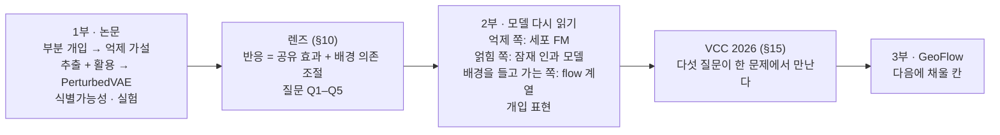
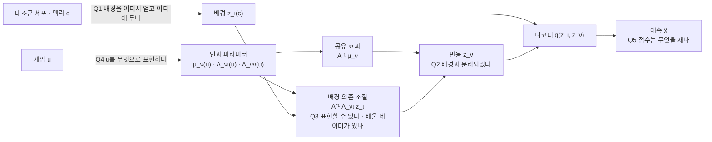
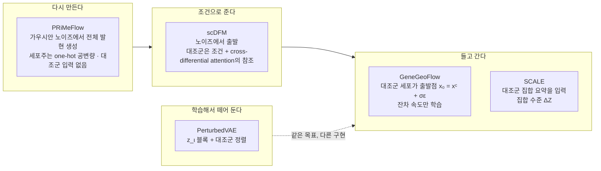
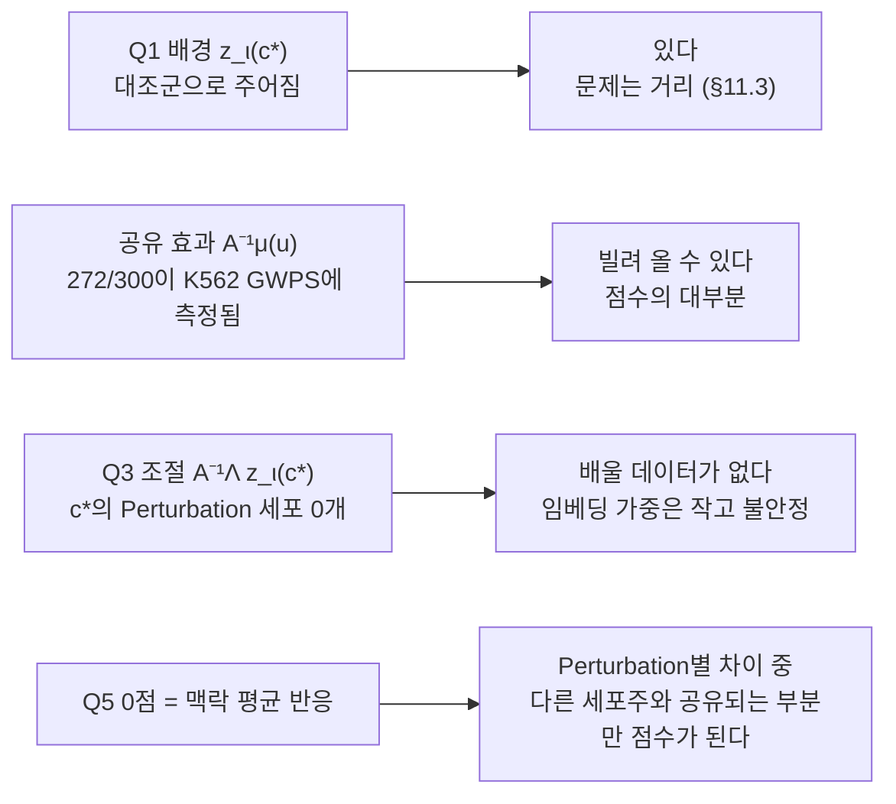

# Perturbation 예측에서 '좋은 표현'이란 무엇인가

[🏠 Portfolio](https://github.com/heoneyzi) › [📚 Study](../../../README.md) › [🧬 Genomics](../../README.md) › [Season 2 · Functional Genomics 2](../README.md) › [Reviews](README.md)

> ✍️ **강지헌 (me)** · 📅 2026-09-27 · 🗂️ Source: local file `FG2_리뷰_What_Makes_a_Representation_Good_통합본.md`
>
> Original file `FG2_리뷰_What_Makes_a_Representation_Good_통합본.md`. Inside the text, sibling files are cited by their original names: *통합본* = this file, *발표구성안* = [02_talk_plan.md](02_talk_plan.md), *임베딩중심* = [03_embedding_centric_review_2026-09-26.md](03_embedding_centric_review_2026-09-26.md). Local `VCC/…` documents it cites belong to [01_Medical/VCC_2026](https://github.com/heoneyzi/Medical/blob/main/VCC_2026/README.md).

---

<b>ICML 2026 *What Makes a Representation Good for Single-Cell Perturbation Prediction?*를 깊게 읽고, 그 관점으로 우리가 본 모델들과 VCC를 다시 읽는다</b>

> **작성** 2026-09-27 · **FG2(Functional Genomics 2) 리뷰 시리즈** VCC 2025·2026 → **이 논문** → 다음 리뷰 GeoFlow(GeneGeoFlow, arXiv 2608.06824)
>
> **논문** Wenkang Jiang, Yuhang Liu(교신), Yichao Cai, Erdun Gao, Jiayi Dong, Ehsan Abbasnejad, Lina Yao, Javen Qinfeng Shi. ICML 2026 (PMLR 306, 서울). arXiv [2605.19343](https://arxiv.org/abs/2605.19343)
>
> **이전 판과의 관계** 2026-09-26 판(`FG2_리뷰_What_Makes_a_Representation_Good_임베딩중심.md`)을 대체한다. 이전 판은 VCC와 모델 비교를 논문과 나란히 놓았다. 이 판은 논문의 논리를 먼저 세우고, 모델과 VCC를 그 논리 안에서 읽는다.

---

## 먼저, 한 문단으로

Perturbation 데이터에서 발현 변동의 대부분은 Perturbation과 무관한 배경(세포 정체성, 세포주기, 대사, 시퀀싱 깊이)이 만들고, Perturbation이 만드는 신호는 소수 유전자에 몰린 희소한 신호다. 논문은 이 비대칭 때문에 배경과 신호를 명시적으로 나누지 않는 표현이 두 방식으로 실패한다고 주장한다. 전체 분포를 맞추는 foundation model은 신호를 눌러 버리고(<b>억제</b>), 잠재 인과 모델은 배경을 인과 변수에 섞는다(<b>얽힘</b>). 처방은 신호를 배경에서 떼어 내고(<b>추출</b>) 개입 구조에 맞게 조직하는(<b>활용</b>) 표현이다. PerturbedVAE는 이것을 배경 블록 $z_\iota$, 반응 블록 $z_\nu$, 대조군 정렬, 잠재 인과 모델로 구현하고 식별가능성까지 보인다. 이 모델의 구조방정식을 풀면 Perturbation 반응이 <b>"배경과 무관한 공유 효과 + 배경에 따라 달라지는 조절"</b>로 나뉜다. 이 식 하나로 우리가 본 모델들이 각각 어느 항을 어떻게 다뤘는지 설명되고, VCC 2026이 왜 어려웠는지도 설명된다. VCC 2026은 새 세포주의 배경(대조군)을 주었고 공유 효과는 다른 세포주에서 빌려 올 수 있게 했다. 그러나 그 세포주만의 조절 항을 배울 데이터는 없었고, 점수의 0점은 Perturbation을 구별하지 않는 '맥락 평균 반응' 기준선에 맞춰져 있었다.

## 이 글을 읽는 순서

**1부**는 논문 자체다. 문제 설정, 가설, 모델, 이론, 실험을 차례로 읽고 어디까지 믿을 수 있는지 따진다. 1부의 끝(§10)에서 논문의 생성 모델을 식 하나로 줄이고, 그 식에서 모든 Perturbation 예측 모델에 던질 수 있는 질문 다섯 개를 뽑는다. **2부**는 그 질문으로 FG2 세션과 VCC에서 만난 모델들을 읽는다. 모델을 하나씩 소개하는 대신 논문이 말한 실패 모드와 처방에 따라 묶는다. 2부의 마지막 절(§15)에서 다섯 질문이 VCC 2026이라는 한 문제에서 만난다. **3부**는 다음 리뷰 GeoFlow로 넘어가는 다리와 정리다.

**차례**

- 1부. 논문 — §1 논문이 묻는 것 · §2 부분 개입과 신호의 비대칭 · §3 억제 가설 · §4 Figure 1 진단 · §5 추출과 활용 · §6 PerturbedVAE · §7 식별가능성 · §8 실험 · §9 비판적으로 읽기 · §10 렌즈
- 2부. 렌즈로 다시 읽기 — §11 배경을 담도록 학습된 표현(세포 FM) · §12 배경을 섞거나 조절을 지운 표현(잠재 인과 모델, scGen·CPA) · §13 배경을 들고 가는 모델(flow 계열) · §14 개입을 무엇으로 표현하나 · §15 VCC 2026은 왜 어려웠나
- 3부. 다음으로 — §16 GeoFlow로 · §17 맺으며
- 부록 A 용어 · 부록 B 수치 출처 · 부록 C 참고문헌

---

# 1부. 논문 — Perturbation 데이터에서 '좋은 표현'의 조건

## 1. 논문이 묻는 것

단일세포 Perturbation 예측의 목표는 유전자를 건드렸을 때(CRISPR 녹아웃·억제·활성화) 세포의 발현이 어떻게 바뀌는지 예측하는 것이다. 보통의 예측 문제와 다른 점은 입력이 시스템 자체를 **바꾼다**는 것이다. 그래서 저자들은 과제를 두 가지로 정리한다. 하나는 **일반화**다. 학습 때 보지 못한 Perturbation, 특히 이미 본 단일 Perturbation을 조합한 이중 Perturbation을 예측해야 한다. 다른 하나는 **해석**이다. Perturbation이 세포의 어떤 프로그램을 어떻게 바꾸는지 설명할 수 있어야 한다.

지금까지의 연구는 두 방향에서 이 과제를 풀어 왔다.

- **인과 표현 학습(causal representation learning, CRL).** 발현 뒤에 몇 개의 고수준 인과 변수(유전자 프로그램)가 있고 Perturbation은 그 변수들에 개입한다고 보는 잠재 인과 생성 모델을 세운 뒤, 그 변수를 데이터에서 복원하려 한다. Discrepancy-VAE, sVAE+, SAMS-VAE, SENA가 여기에 속한다. 인과 구조가 일반화와 해석을 함께 줄 것이라는 기대가 깔려 있다.
- **Foundation model(FM).** 대규모 단일세포 데이터와 큰 모델로 범용 표현을 학습하고, 그 표현을 Perturbation 예측에 옮겨 쓴다. scGPT, scFoundation, Geneformer, UCE 등이다.

제목은 질문이고, 결론 절이 답을 준다. 요약하면 이렇다. *Perturbation 예측에서 FM이 실패하는 것은 주로 규모의 문제가 아니라, 범용 학습 목적과 희소하고 개입으로 만들어지는 Perturbation 데이터 구조 사이의 불일치 때문이다. Perturbation 예측에 좋은 표현은 Perturbation을 인지하고(perturbation-aware) 인과적으로 구조화된 표현이다.*

**읽기 전에 알아 둘 것.** 교신저자 그룹(Adelaide 대학 AIML의 Yuhang Liu 등)은 CRL의 식별가능성 이론을 연구해 온 곳이다. 그래서 이론은 촘촘하고, 생물학적 검증과 평가 지표 설계는 상대적으로 얇다. 모델은 VAE와 잠재 인과 모델의 결합이며 flow matching 모델이 아니다. 본문 9쪽, 부록 A–N 23쪽(PDF 전체 36쪽)이고, 주 데이터는 Norman 2019(K562, CRISPRa), 보조 데이터는 Replogle 2022다. flow matching 논문이 아닌데도 이 리뷰가 FG2 시리즈 한가운데에 이 논문을 두는 이유는, 이 논문이 Perturbation 예측 모델 전체를 읽을 수 있는 **언어**를 주기 때문이다.

## 2. 출발점: 부분 개입과 신호의 비대칭

저자들이 출발점으로 삼는 관찰은 단순하다. 실험·환경·비용의 제약 때문에 Perturbation 신호는 발현 공간의 작은 부분만 차지하고, Perturbation의 영향을 받지 않는 배경 프로그램이 대부분을 차지한다. 대규모 Perturbation 데이터에서도 마찬가지다. 서론의 예시로 Norman 데이터의 서로 다른 Perturbation은 약 284개인데, 측정되는 유전자는 약 19,264개다(실제 실험에서는 5,000개 유전자를 쓴다).

이 관찰을 CRL의 언어로 옮기면 <b>부분 개입(partial intervention)</b>이 된다. 기존 식별가능성 이론 대부분은 <b>모든 잠재 인과 변수가 어떤 환경에서든 한 번은 개입된다</b>고 가정한다(Lachapelle 2022, Zhang 2023, Lopez 2022, de la Fuente 2025). 실제 Perturb-seq는 극히 일부 유전자만 건드린다. 대부분의 유전자와 그것을 지배하는 잠재 변수는 모든 조건에서 그대로다. 이론이 가정하는 데이터와 실제 데이터가 어긋나는 셈이다.

이 비대칭을 그림으로 그리면 세포 하나의 발현 벡터는 크게 두 부분의 합이다.

- **배경.** 세포가 무엇인지(계통, 세포주), 어떤 상태인지(세포주기, 크기, 대사, 스트레스), 얼마나 깊게 읽혔는지(시퀀싱 깊이)가 만드는 변동이다. 수천 개 유전자에 걸쳐 크게 나타나고, Perturbation과 무관하다.
- **Perturbation 신호.** 표적 유전자와 그 하류 프로그램에 몰린 변화다. 소수 유전자에 걸쳐 작게 나타난다.

> **비유.** 오케스트라 녹음에서 트라이앵글 한 번을 찾는 상황이다. 녹음 전체를 잘 압축하도록 학습한 코덱은 현악기(배경)를 충실히 보존하지만 트라이앵글(Perturbation 신호)은 뭉개 버린다. 압축 품질 점수는 높아도 트라이앵글을 찾는 데는 쓸모가 없다. 반대로 트라이앵글 소리만 담으라고 만든 채널이 있는데 현악기를 담을 채널이 따로 없으면, 그 채널은 현악기 소리로 가득 차게 된다.

비유의 앞 절반이 FM의 실패이고, 뒤 절반이 CRL의 실패다. 다음 절이 이것을 가설로 정리한다.

## 3. 가설: Perturbation Suppression Hypothesis

> **Perturbation Suppression Hypothesis.** Perturbation과 무관한 변동이 데이터를 지배할 때, 불변 정보와 Perturbation 특이 정보를 명시적으로 분리하지 않는 접근은 체계적으로 실패한다.

실패하는 방식은 두 가지다.

**얽힘(entanglement) — 잠재 인과 모델의 실패.** CRL 모델은 'Perturbation과 관련된' 잠재 변수를 두고 그 위에 인과 구조를 세운다. 그런데 재구성 목적은 발현 전체를 설명하라고 요구하므로, 배경을 설명할 자리가 따로 없으면 배경은 그 잠재 변수로 흘러 들어간다. 인과 변수의 의미가 오염되고, 오염된 변수 위에 세운 인과 모델은 새로운 Perturbation으로 일반화하지 못한다. 저자들은 이것도 넓은 의미의 억제로 본다. Perturbation 관련 표현의 고유한 신호가 배경에 묻히기 때문이다.

**억제(suppression) — foundation model의 실패.** FM은 전체 데이터 분포를 맞추도록 학습된다. 불변 정보가 지배적이면 이런 목적은 공유되는 불변 구조를 먼저 인코딩한다. 발현 공간의 작은 부분만 차지하는 Perturbation 신호는 학습된 표현에서 **덜 접근 가능해진다**. 논문은 "사라진다"가 아니라 "덜 접근 가능하다(less accessible)"라고 쓴다. 정보가 지워졌다기보다 꺼내 쓰기 어려운 형태로 묻혔다는 뜻이다.

두 실패는 거울상이다. CRL에서는 신호를 담을 공간이 배경에 오염되고, FM에서는 배경을 담는 공간이 신호를 삼킨다. 원인은 하나다. **배경을 담을 자리와 신호를 담을 자리가 나뉘어 있지 않다.**

목적함수가 왜 배경을 먼저 담는지는 간단한 셈으로 볼 수 있다(설명을 위해 지어낸 숫자다). 어떤 데이터에서 발현 분산의 95%가 배경에서, 5%가 Perturbation에서 온다고 하자. 발현을 재구성하는 목적은 설명한 분산만큼 보상하므로, 배경만 완벽하게 맞히는 표현도 95점을 받는다. 용량이 한정된 모델이 Perturbation 신호를 담으려고 용량을 나눠 쓰면 배경 재구성이 조금이라도 나빠질 수 있으니, 신호를 버리는 편이 손해가 적다. Perturbation 신호가 소수 유전자에 몰려 있을수록 이 계산은 더 기울어진다.

## 4. 진단: Figure 1, 선형 probe

가설을 확인하기 위해 저자들은 FM 표현을 <b>고정(frozen)</b>한 채 Perturbation 조건 $u$를 대리 라벨(surrogate label)로 삼아 선형 분류기를 학습하고 정확도를 잰다. 정보가 "꺼내 쓸 수 있는 형태로" 들어 있는지 보는 표준 진단이다. 비교 대상은 원 발현에 바로 적용한 PCA, scFoundation, Geneformer, UCE, 그리고 PerturbedVAE다.

*출처: Jiang et al., ICML 2026, Figure 1. y축은 seed 평균 정확도이고, 점 하나는 Perturbation 조건 하나로 보인다(논문에 명시되지 않음). 빨간 점선이 평균이다.*

| 표현 | 평균 정확도 (그림에서 읽은 근삿값, ±0.01) |
|---|---:|
| PCA (원 발현) | ≈ 0.36 |
| PerturbedVAE | ≈ 0.35 |
| scFoundation | ≈ 0.34 |
| Geneformer | ≈ 0.26 |
| UCE | ≈ 0.20 |

**저자의 해석.** PCA는 관측된 발현에 바로 적용된다. 그런데 FM 표현이 PCA보다 못하다면, Perturbation 정보는 **데이터에 존재하지만 범용 FM 목적으로 인코딩된 뒤에는 덜 접근 가능해진다**는 뜻이다. 억제 가설과 맞는 증거다.

그림을 직접 보면 본문 요약에서 잘 드러나지 않는 점이 세 가지 있다.

1. **PerturbedVAE는 PCA를 넘지 않는다.** 저자의 표현도 "competitive"다. 이 진단이 보여주는 것은 "FM < PCA"이지 "PerturbedVAE > PCA"가 아니다.
2. **FM끼리 차이가 크다.** scFoundation은 PCA와 거의 같고 Geneformer와 UCE가 크게 떨어진다. UCE는 정확도가 0 근처인 Perturbation 조건이 많다.
3. **모든 표현이 무작위 수준보다는 훨씬 높다.** 105개 클래스라면 무작위 정확도는 약 1%다. 정보가 사라진 것이 아니라 선형으로 꺼내기 어려워진 것이다.

그리고 한 가지를 조심해야 한다. 논문은 probe의 분류기 종류, 데이터 분할, PCA 차원, 그리고 **PerturbedVAE의 어떤 표현을 probing했는지**를 적지 않았다. 뒤에서 보겠지만 PerturbedVAE의 반응 블록 $z_\nu$는 추론할 때 $u$를 입력으로 받는다. $z_\nu$를 probing했다면 라벨을 넣은 표현에서 라벨을 읽는 순환 구조가 된다. 공정한 비교 대상은 $u$를 보지 않는 공유 인코더의 은닉 표현이다.

FM 사이의 순서는 논문이 설명하지 않는다. 아래 두 해석은 이 리뷰의 것이다.

**해석 1 — 발현량을 얼마나 버리는가.** 각 모델이 발현을 어떻게 입력받고 무엇을 목적으로 학습하는지 나란히 놓으면 순서가 설명된다.

| 표현 | 발현량을 넣는 방식 | 사전학습 목적 | Fig. 1 |
|---|---|---|---:|
| PCA | 연속값 그대로 선형 투영 | 분산 최대화 | ≈ 0.36 |
| scFoundation | 연속값 임베딩(이산화 없음), 시퀀싱 깊이 인지 | 가려진 **발현값 회귀** | ≈ 0.34 |
| Geneformer | **순위**: 발현 순서대로 유전자 토큰을 나열 | 가려진 **유전자 토큰 예측** | ≈ 0.26 |
| UCE | 발현량에 비례해 유전자 1,024개를 뽑은 'bag of RNA'. 크기는 뽑힌 빈도로만 남는다 | 유전자가 **발현되었는지(이진)** 예측. 종을 넘나드는 세포 정체성 표현이 목표 | ≈ 0.20 |

발현 크기를 보존하고 그것을 목적함수로 맞추는 모델일수록 PCA에 가깝고, 크기를 순위나 추출 빈도로 바꾸고 목적도 크기를 맞추지 않는 모델일수록 떨어진다. Norman의 CRISPRa는 일부 유전자의 **발현 크기를 바꾸는** 개입이다. 크기를 버리는 인코딩은 그 신호부터 버린다.

**해석 2 — FM은 배경을 담도록 학습되었다.** 선형 probe 정확도가 낮다는 것은 그 표현이 Perturbation에 대해 **불변에 가깝다**는 뜻이기도 하다. 논문의 말로 바꾸면, FM 표현은 배경 $z_\iota$에 가까운 것을 담고 있다. UCE의 목적은 종과 데이터셋을 넘나드는 세포 정체성, 즉 Perturbation과 무관한 정보를 표현하는 것이고, probe 정확도도 가장 낮다. 이 해석은 2부에서 중요해진다. FM이 Perturbation을 읽는 데는 나쁘더라도 배경을 담는 데는 쓸 수 있다면, 다음 질문은 "그 배경 표현의 **거리**가 무엇을 재는가"가 되기 때문이다(§10, §11).

진단은 고정 표현에서 끝나지 않는다. 뒤의 Table 2(§8.3)에서 저자들은 FM들을 권장 프로토콜대로 **파인튜닝**해 이중 Perturbation을 예측하게 했는데, STATE를 포함한 네 FM 모두 KNN·ElasticNet·RandomForest보다 RMSE가 컸다.

## 5. 처방: 추출과 활용

논문은 가설에서 곧바로 처방으로 넘어간다. Perturbation 예측의 핵심 과제는 Perturbation 특이 정보를 어떻게 **추출**하고 **활용**하는가다.

- **추출(Extraction).** Perturbation 특이 정보를 지배적인 불변 정보로부터 명시적으로 떼어 낸다. 희소한 신호를 보존하므로 FM의 억제에 대한 처방이고, 배경이 Perturbation 표현에 섞이는 것을 막으므로 CRL의 얽힘에 대한 처방이기도 하다. 두 실패 모드 모두에 대한 답이다.
- **활용(Utilization).** 떼어 낸 정보를 인과 구조를 가진 표현 공간에 조직해, 미관측·조합 Perturbation으로의 일반화와 해석을 지원한다. CRL이 원래 약속했던 것을 깨끗하게 떼어 낸 신호 위에서 되살리는 일이다.

두 가지를 갖춘 표현을 저자들은 **perturbation-aware representation**이라 부른다. 논문 3장의 제목이 *A Heuristic Framework*인 데서 알 수 있듯이, 저자들은 먼저 구현에 묶이지 않은 개념 틀을 내놓고, 4장의 이론으로 그 틀이 어떤 구체적인 형태여야 하는지 정당화하는 순서를 밟는다.

이 리뷰의 말로 한 번 더 풀어 두면, 추출은 <b>"배경을 어디에 둘 것인가"</b>의 문제이고 활용은 <b>"개입 $u$가 반응을 어떻게 바꾸는지를 무엇으로 표현할 것인가"</b>의 문제다. 2부에서 모델들을 읽을 때 이 두 축을 그대로 쓴다.

## 6. PerturbedVAE — 처방을 모델로

### 6.1 생성 모델: 잠재 공간을 둘로 나눈다

*출처: 논문 Figure 2. $u$에서 나온 화살표는 반응 변수의 잡음($n_{\nu,i}$), 반응 변수 사이의 간선, 그리고 $z_\iota \to z_\nu$ 간선으로 들어간다. $z_\iota$로는 들어가지 않는다.*

관측된 발현 $x$는 잠재 변수 $z$에서 알 수 없는 비선형 사상으로 만들어진다고 가정한다. Perturbation은 대리 변수 $u$로 표시한다. 단일 Perturbation이면 one-hot, 이중 Perturbation이면 two-hot 벡터다. 저자들은 이 점을 강조한다. Perturbation의 생화학적 메커니즘은 몰라도 되고, **어떤 조건이 적용됐는지만** 알면 된다.

잠재 공간은 두 블록으로 나뉜다.

- **Perturbation 불변 변수 $z_\iota \in \mathbb R^{d_\iota}$.** 모든 세포가 공유하는 배경 프로그램이다. Perturbation 조건이 바뀌어도 분포가 그대로다.
- **Perturbation 반응 변수 $z_\nu \in \mathbb R^{d_\nu}$.** Perturbation에 따라 값이 바뀌고 Perturbation 효과를 담는다. 성분들 사이에는 알려지지 않은 인과 구조가 있고, 그 구조는 방향 비순환 그래프(DAG)로 제한된다.

각 잠재 변수는 독립적인 외생 잡음을 하나씩 가진다($z_\iota$에는 $n_\iota$, $z_{\nu,i}$에는 $n_{\nu,i}$). 사전분포는 다음처럼 분해된다(Eq. 1).

$$
p(z_\nu, z_\iota \mid u) = p(z_\nu \mid u, z_\iota)\; p(z_\iota)
$$

이 한 줄에 설계가 두 가지 들어 있다. **배경은 Perturbation과 독립이다.** 그리고 **반응은 Perturbation과 배경 둘 다에 의존한다.** 두 번째 성질이 이 리뷰 전체의 열쇠다.

### 6.2 구조방정식: 반응은 세 조각으로 나뉜다

이론 분석을 위해 저자들은 생성 과정을 선형 구조방정식(SCM)으로 파라미터화한다(Eq. 6–9).

$$
\begin{aligned}
z_\iota &:= \lambda_{\iota\iota}\, z_\iota + n_\iota, && n_\iota \sim \mathcal N(\mu_\iota, \operatorname{diag}\beta_\iota) \\
z_\nu &:= \lambda_{\nu\iota}(u)\, z_\iota + \lambda_{\nu\nu}(u)\, z_\nu + n_\nu, && n_\nu \sim \mathcal N(\mu_\nu(u), \operatorname{diag}\beta_\nu(u)) \\
x &:= g(z), && z = (z_\iota, z_\nu)
\end{aligned}
$$

변수를 $z_\iota$, $z_\nu$ 순서로 늘어놓으면 전체 λ 행렬은 **엄격한 하삼각**이다. 각 변수는 자기보다 앞 순서의 변수만 부모로 가지므로 순환이 없다. Perturbation $u$가 바꾸는 것은 반응 쪽의 메커니즘 $\lambda_{\nu\iota}(u)$, $\lambda_{\nu\nu}(u)$, $\mu_\nu(u)$, $\beta_\nu(u)$뿐이다. $z_\iota$의 방정식에는 $u$가 없다.

반응 변수의 방정식을 $z_\nu$에 대해 풀고 기댓값을 취하면 다음을 얻는다. $A(u) = I - \Lambda_{\nu\nu}(u)$로 둔다.

$$
\mathbb E[z_\nu \mid z_\iota, u]
= \underbrace{A(u)^{-1}\mu_\nu(u)}_{\text{① 배경과 무관한 공유 효과}}
+ \underbrace{A(u)^{-1}\Lambda_{\nu\iota}(u)\, z_\iota}_{\text{② 배경에 따라 달라지는 조절}}
$$

논문은 이 식을 이렇게 풀어 쓰지 않지만, 이 리뷰에서 가장 많이 쓸 식이다. 반응은 세 조각으로 읽힌다.

- **① 공유 효과 $\mu_\nu(u)$.** Perturbation $u$가 반응 프로그램을 직접 미는 양이다. 어떤 배경의 세포에서든 똑같이 작용한다.
- **② 배경 의존 조절 $\Lambda_{\nu\iota}(u)\,z_\iota$.** 같은 Perturbation이라도 세포의 배경 상태에 따라 효과가 달라지는 부분이다. 예를 들어 표적 유전자가 원래 거의 발현되지 않는 세포에서는 CRISPRi로 더 낮출 여지가 없고, 이미 높게 발현된 유전자는 CRISPRa로 더 올릴 여지가 작다. 같은 개입이 배경에 따라 다른 결과를 내는 가장 단순한 경우다.
- **③ 전파 $A(u)^{-1} = I + \Lambda_{\nu\nu} + \Lambda_{\nu\nu}^2 + \cdots$.** 반응 프로그램 사이의 하류 연쇄다. 하삼각 행렬은 거듭제곱하면 언젠가 0이 되므로 이 급수는 유한하다. 표적 프로그램이 움직이면 그 아래 프로그램들이 따라 움직인다.

여기서 하나를 기억해 두자. Norman 데이터는 K562 한 세포주다. 그러므로 이 논문에서 $z_\iota$가 담는 것은 **한 세포주 안**의 세포 간 차이(세포주기, 크기, 스트레스 상태 등)이고, 조절 항 ②는 세포주 안에서 반응이 세포마다 다른 정도를 표현한다. 세포주 **사이**의 조절은 이 논문이 한 번도 시험하지 않은 영역이다. 2부에서 이 차이가 결정적으로 중요해진다.

### 6.3 추론 모델의 비대칭

사후분포는 다음처럼 근사한다(Eq. 2).

$$
q(z_\nu, z_\iota \mid x, u) = q(z_\nu \mid x, u)\; q(z_\iota \mid x)
$$

- $z_\iota$는 **발현 $x$만 보고** 추론한다. 그래서 테스트 때 대조군 세포만으로 배경을 얻을 수 있다.
- $z_\nu$는 **$x$와 $u$를 함께 보고** 추론한다. 반응 표현에는 라벨이 입력으로 들어간다. §4에서 probe의 순환성을 걱정한 이유가 이것이다.

### 6.4 ELBO와 사전분포

학습은 조건부 우도 $\log p(x \mid u)$의 하한(ELBO)을 최대화한다. 부록 G의 구현은 β-VAE 형태다(Eq. 54).

$$
\mathcal L_\text{ELBO}
= \mathbb E_q\big[\log p(x \mid z_\nu, z_\iota)\big]
- \beta_\nu\, D_\text{KL}\big(q(z_\nu \mid x,u)\,\|\,p(z_\nu \mid u, z_\iota)\big)
- \beta_\iota\, D_\text{KL}\big(q(z_\iota \mid x)\,\|\,\mathcal N(0,I)\big)
$$

배경 블록의 사전분포는 $\mathcal N(0,I)$로 단순하게 둔다. 이론상 배경은 블록 단위로만 식별되면 되기 때문이다(§7). 반응 블록의 사전분포는 SCM에서 유도된 가우시안이다(Eq. 59).

$$
p(z_\nu \mid u, z_\iota) = \mathcal N\!\Big(A(u)^{-1}\big(\Lambda_{\nu\iota}(u) z_\iota + \mu_\nu(u)\big),\; A(u)^{-1}\operatorname{diag}(\beta_\nu(u))\,A(u)^{-\top}\Big)
$$

구현은 역행렬을 직접 구하지 않고 삼각 선형계를 풀어서 DAG 제약을 자연스럽게 지킨다. 반응 사후분포는 DAG 순서를 따르는 autoregressive 가우시안이다(Eq. 61–62).

### 6.5 대조군 정렬 — 추출을 맡는 장치

**문제.** ELBO만으로는 가설이 해결되지 않는다. 배경이 지배적이면 배경만 잘 모델링해도 재구성의 대부분을 달성할 수 있다. 그러면 $z_\nu$는 덜 복원되고 Perturbation 신호는 버려진다. §3의 셈이 모델 안에서 그대로 일어나는 것이다.

**해결.** perturbed 세포 $(x, u)$마다 대조군 세포 $x^{(u_0)}$를 하나 뽑아, 두 세포의 불변 표현이 같아지도록 만든다(Eq. 4). 구현은 사후 평균끼리 비교한다(Algorithm 1).

$$
\mathcal L_\text{contrast} = \big\lVert z_\iota - z_\iota^{(u_0)} \big\rVert_2^2
\qquad(\text{구현: } \lVert \mu'_{\iota,1} - \mu'_{\iota,2} \rVert_2^2)
$$

**직관.** 배경을 $z_\iota$에 못 박으면 재구성에서 배경을 설명할 책임이 $z_\iota$로 넘어간다. 저자들의 표현으로는 그러면 $z_\nu$가 "배경 구조를 모델링하는 일에서 풀려나" 남은 잔차, 즉 Perturbation이 만든 변화를 담게 된다. 대조군이 **배경의 명시적 기준점** 역할을 하는 것이다. 이름에 contrastive가 붙어 있지만 음성 쌍(negative pair)은 없다. 양성 쌍을 당기기만 하는 순수 정렬 항이다.

**[분석] 무작위로 짝지은 대조군이 실제로 하는 일.** 논문 서술대로라면 대조군 세포는 **무작위로** 뽑는다(매칭 방법에 대한 언급이 없다). perturbed 세포 $x \sim P$와 대조군 세포 $x' \sim Q$가 독립이면, 불변 인코더의 평균 $f$에 대해 정렬 손실의 기댓값은 정확히 세 항으로 나뉜다.

$$
\mathbb E\,\lVert f(x) - f(x') \rVert^2
= \underbrace{\lVert \mathbb E_P f - \mathbb E_Q f \rVert^2}_{\text{두 집단의 평균 차이}}
+ \underbrace{\operatorname{tr}\operatorname{Cov}_P(f)}_{\text{perturbed 집단 내 분산}}
+ \underbrace{\operatorname{tr}\operatorname{Cov}_Q(f)}_{\text{대조군 집단 내 분산}}
$$

첫 항은 의도한 효과다. perturbed 집단과 대조군 집단의 배경 분포를 맞춘다. 나머지 두 항은 **$z_\iota$의 세포 간 변동 자체를 줄이라는** 의도하지 않은 압력이다. $\mathcal N(0,I)$ 사전분포와의 KL도 평균을 0으로 당기므로, $z_\iota$에 세포별 배경 차이를 남기는 힘은 재구성 항 하나뿐이다.

이론(부록 Lemma D.3)은 이와 달리 **같은 배경 잡음 $n_\iota$를 공유하는 쌍**을 전제한다. "이 세포가 Perturbation을 받지 않았다면"이라는 반사실적 쌍인데, scRNA-seq는 측정할 때 세포를 파괴하므로 이런 쌍은 관측할 수 없다. K562처럼 균질한 세포주에서는 이 간극의 피해가 작을 수 있다. 그러나 여러 세포 유형이나 세포주가 섞인 데이터에서 무작위로 짝지으면 $z_\iota$가 담아야 할 정체성 정보까지 지워진다. 여러 맥락에 이 방법을 쓰려면 같은 맥락 안에서 짝을 짓거나 최적 수송(OT)으로 짝을 지어야 한다. scRNA-seq의 unpaired 문제가 이 논문에도 그대로 걸려 있는 셈이다.

### 6.6 최종 목적함수와 학습 알고리즘

$$
\mathcal L = -\mathcal L_\text{ELBO} + \alpha\, \mathcal L_\text{contrast}
$$

*출처: 논문 Figure 3. perturbed 세포 $x$는 반응 블록 $z_\nu$(성분별 식별)를 학습하는 데 쓰이고, 대조군 세포 $x^{(u_0)}$는 불변 블록 $z_\iota$(블록 식별)의 정렬에 쓰인다.*

Algorithm 1을 순서대로 적으면 다음과 같다.

1. perturbed 세포 $x$와 라벨 $u$, 대조군 세포 $x^{(u_0)}$를 뽑는다.
2. 공유 인코더로 $h_1 = f_\text{enc}(x)$, $h_2 = f_\text{enc}(x^{(u_0)})$를 얻는다.
3. 반응 사후: $g_\nu(h_1, u) \to (\mu'_\nu, \sigma'_\nu)$. **$u$가 입력으로 들어간다.**
4. 배경 사후: $g_\iota(h_1)$, $g_\iota(h_2)$. $u$를 보지 않는다.
5. 재매개화로 반응 잡음 $\tilde z_\nu$와 배경 $z_\iota^{(1)}, z_\iota^{(2)}$를 샘플링한다.
6. $u$에서 인과 파라미터를 만든다: $\Lambda_{\nu\nu}(u) \leftarrow f_{\nu\nu}(u)$(엄격 하삼각), $\Lambda_{\nu\iota}(u) \leftarrow f_{\nu\iota}(u)$, $\mu_\nu(u) \leftarrow f_\mu(u)$.
7. 삼각계를 풀어 $z_\nu = (I - \Lambda_{\nu\nu}(u))^{-1}\big(\tilde z_\nu + \Lambda_{\nu\iota}(u) z_\iota^{(1)} + \mu_\nu(u)\big)$를 얻는다.
8. $\hat x = f_\text{dec}([z_\nu, z_\iota^{(1)}])$. **디코더는 $u$를 받지 않는다.**
9. 손실 = 재구성 + $\beta_\nu$·KL$_\nu$ + $\beta_\iota$·KL$_\iota$(perturbed·대조군 양쪽) + $\alpha \lVert \mu'_{\iota,1}-\mu'_{\iota,2} \rVert^2$. 가중치는 annealing한다.

**설계의 요점.** 디코더가 $u$를 직접 받지 않으므로, Perturbation이 출력에 닿는 **유일한 경로는 잠재 인과 메커니즘**이다. 저자들이 조합 예측을 "원리적"이라고 부르는 근거가 여기에 있다.

**하이퍼파라미터(실데이터, 부록 Table 7).** batch 64, 100 epoch, lr 1e-4, $\beta_\nu = \beta_\iota = 10^{-2}$, hidden 256, 총 잠재 차원 $\dim(z) \in \{10, 35, 75, 105\}$, $\alpha = 0.05$. 가장 좋았던 분할은 $(d_\nu, d_\iota) = (20, 85)$로, **배경 블록이 반응 블록보다 네 배 넘게 크다**(§8.10).

### 6.7 테스트 때의 예측과 two-hot 외삽

1. 대조군 세포에서 배경을 얻는다: $z_\iota \sim q(z_\iota \mid x^{(u_0)})$.
2. perturbed 세포가 없으므로 사후가 아니라 **사전분포에서** 반응을 만든다: $z_\nu \sim p_\theta(z_\nu \mid z_\iota, u)$.
3. $(z_\iota, z_\nu)$를 디코딩한다.

이중 Perturbation OOD 실험에서는 학습을 단일 Perturbation(one-hot)으로만 하고, 테스트에서 한 번도 본 적 없는 **two-hot $u$를 그대로** $f_{\nu\nu}, f_{\nu\iota}, f_\mu$에 넣는다. 조합 일반화가 나올 수 있는 곳은 세 군데다. (a) $f(\cdot)$가 two-hot 입력에서 어떻게 외삽하는가, (b) $u$에 대해 비선형인 삼각계 역행렬 $A(u)^{-1}$, (c) 비선형 디코더다. 논문은 $f(\cdot)$의 구조를 명시하지 않고, 조합성이 셋 중 어디서 오는지도 분석하지 않는다.

> **PerturbedVAE를 한 줄로.** 배경은 대조군과 정렬한 큰 블록 $z_\iota$(85차원)에 가두고, Perturbation은 one-hot $u$에서 만든 인과 파라미터 $(\mu_\nu, \Lambda_{\nu\iota}, \Lambda_{\nu\nu})$를 통해서만 작은 블록 $z_\nu$(20차원)를 움직이며, 디코더는 두 블록만 보고 발현을 만든다.

## 7. 이론 — 식별가능성

### 7.1 식별가능성은 "잠재 변수에 이름을 붙여도 되는가"의 문제다

> **질문.** 두 사람이 같은 데이터를 똑같이 잘 설명하는 모델을 각각 학습했을 때, 두 모델의 잠재 변수는 같은 것을 가리키는가?

그렇지 않다면 "이 축은 배경 프로그램이다", "이 블록은 Perturbation 반응이다" 같은 해석은 의미가 없다. 칵테일 파티 문제에 빗댈 수 있다. 여러 목소리가 비선형으로 섞인 녹음을 i.i.d. 데이터만으로 분리하려 하면 똑같이 그럴듯한 분리 방법이 무한히 많다(Hyvärinen & Pajunen 1999). 해결책은 <b>보조 변수 $u$<b>다. 환경이 바뀔 때 잠재 변수의 분포가 충분히 다양하게 바뀌면, 가능한 해가 순서를 바꾸거나 단위를 바꾸는 정도의 사소한 변환으로 좁혀진다(iVAE, Khemakhem et al. 2020). 이 논문은 그 틀을 </b>일부 변수만 개입되는</b> Perturbation 데이터로 넓힌다.

표현의 관점에서 식별가능성은 **배경 블록과 반응 블록의 분리가 학습의 우연이 아니라 데이터로부터 결정된다**는 보장이다. 실용적인 의미도 있다. 분리가 데이터로 정해져야 "새 맥락에서는 배경 블록만 다시 계산하고 반응 메커니즘은 그대로 쓴다" 같은 모듈식 전이가 말이 된다. 분리가 우연이라면 새 맥락에서 무엇을 바꾸고 무엇을 유지해야 하는지 정할 수 없다. 이 문장은 2부에서 VCC를 읽을 때 다시 쓴다.

### 7.2 가정 네 개

**(i) 가역성과 매끄러움.** 잠재에서 관측으로 가는 사상 $g$가 매끄럽고 가역이다. 생성 과정에서 잠재 정보가 되돌릴 수 없게 사라지지 않는다는 뜻이다. 발현 차원(5,000)이 잠재 차원(최대 105)보다 훨씬 크니 단사는 그럴듯하지만, dropout과 측정 잡음 때문에 정확한 가역성은 성립하지 않는다. 비선형 ICA의 표준 가정이다.

**(ii) 환경 충분성.** 대조군 $u_0$와 비교해 $2d_\nu$개의 환경에서 반응 잡음의 자연 파라미터 변화가 full rank다. 가우시안 $\mathcal N(\mu, \beta)$를 지수족으로 쓰면 자연 파라미터는 $\eta = (\mu/\beta,\ -1/(2\beta))$이고, $\Delta\eta(u)$는 대조군 대비 그 변화다.

$$
\Delta\eta(u) = \begin{pmatrix} \dfrac{\mu_\nu(u)}{\beta_\nu(u)} - \dfrac{\mu_\nu(u_0)}{\beta_\nu(u_0)} \\[2mm] -\dfrac12\Big(\dfrac{1}{\beta_\nu(u)} - \dfrac{1}{\beta_\nu(u_0)}\Big) \end{pmatrix} \in \mathbb R^{2d_\nu}
$$

손잡이가 $d_\nu$개 있고 손잡이마다 평균과 분산 두 값이 있으므로, 이들을 서로 구별하려면 **서로 다른 방향으로 흔든 실험이 최소 $2d_\nu$개** 필요하다. Norman 설정은 $d_\nu = 20$이라 40개가 필요한데 단일 Perturbation이 105개 있다. 개수 조건은 충족하지만 rank 조건 자체는 검증할 수 없다. 이 가정이 말하는 요지는 넓게 쓸 수 있다. **어떤 잠재 구조를 배우려면 그 구조를 서로 다른 방향으로 흔든 데이터가 충분히 있어야 한다.**

**(iii) 최적 정렬.** 정렬 손실이 전역 최솟값에 도달해 $f_\iota(x^{(u)}) = f_\iota(x^{(u_0)})$가 거의 확실하게 성립한다. 대조 학습 이론에서 가져온 모집단 수준 가정이다(Von Kügelgen et al. 2021). 앞에서 봤듯이 이론은 배경 잡음을 공유하는 반사실적 쌍을 전제한다.

**(iv) 개입 충분성.** 각 반응 변수 $z_i$마다, 모든 부모의 가중치가 $\lambda_{j,i} = 0$이 되는 환경이 하나는 있다. 변수마다 상위 영향이 완전히 끊기는 실험이 있다는 뜻으로 hard intervention과 비슷하다. CRISPRa로 유전자를 강제로 켜면 그 유전자는 상위 조절에서 풀려난다는 직관과 맞지만, 가정은 유전자가 아니라 **잠재 변수** 수준에 걸려 있다.

### 7.3 결론 두 가지

$$
\text{① } z_\nu = P_\nu\, \hat z_\nu + c_\nu \quad (P_\nu:\ \text{순열·스케일 행렬})
\qquad
\text{② } z_\iota = A_\iota\, \hat z_\iota + c_\iota \quad (A_\iota:\ \text{가역 행렬})
$$

- **반응 블록은 성분별로 식별된다.** 학습된 반응 축 하나하나가 실제 반응 변수 하나에 대응하고, 순서와 단위만 임의다. 가장 강한 형태의 식별이다.
- **배경 블록은 블록 단위로 식별된다.** 블록 안의 축은 섞일 수 있지만, 배경이 하나의 부분공간으로서 반응과 깨끗하게 분리된다는 목적에는 충분하다.

### 7.4 증명의 핵심 — 배경은 환경 간 비교에서 약분된다

증명(부록 D, F)은 다섯 단계로 이루어진다. 이 리뷰의 주제와 가장 가까운 것은 두 번째 단계다.

1. **Lemma D.1.** DAG이므로 $I - \Lambda(u)$는 대각이 모두 1인 하삼각 행렬이고 행렬식이 1이다. 잠재 변수와 잡음 사이의 변환은 부피를 바꾸지 않는 전단사다.
2. **환경 간 로그비에서 배경이 사라진다.** 두 파라미터가 같은 $p(x \mid u)$를 낸다고 놓고 환경 $u_\ell$과 대조군 $u_0$의 로그비를 취한다.

$$
\log \frac{p(n \mid u_\ell)}{p(n \mid u_0)}
= \log \frac{p(n_\iota)\,p(n_\nu \mid u_\ell)}{p(n_\iota)\,p(n_\nu \mid u_0)}
= \log \frac{p(n_\nu \mid u_\ell)}{p(n_\nu \mid u_0)}
$$

   배경 잡음의 분포 $p(n_\iota)$는 $u$와 무관하므로 약분된다. **이론 속에서 '대조군을 빼는' 단계**다. 이 약분은 불변 블록이 정말로 $u$와 무관할 때만 성립하고, 그 조건을 구현에서 보장하는 장치가 정렬이다.

3. **Lemma D.2.** 가우시안 충분통계량 $(n_\nu, n_\nu^2)$의 선형 관계를 $2d_\nu$개 환경에 대해 쌓으면, (ii)의 full rank 조건 덕분에 역변환이 가능하다. 그러면 각 $n_{\nu,j}$는 $\hat n$의 2차 이하 다항식이 되고, 독립성과 가우시안성 때문에 좌표 하나에만 의존해야 한다(Sorrenson et al. 2020의 논법). 순열과 스케일까지 식별된다.
4. **Lemma D.3–D.4.** 정렬이 거의 확실하게 성립하면 불변 추정치는 $n_\nu$에 의존할 수 없다. 의존한다면 어떤 편미분이 0이 아니고, 그 근방에서 단조가 되어 두 독립 추출이 양의 확률로 다른 값을 내므로 모순이다. 가우시안의 score 함수가 affine이므로 변환도 affine이 되고, 선형 블록 식별이 따라온다.
5. **마무리.** 구조방정식으로 합치면 $z = M\hat z + c$이고, $g$와 $\hat g$가 $u$와 무관하므로 $M$도 $u$와 무관하다. (iv)를 쓰면 반응 블록 사이의 비대각 성분이 0으로 강제된다(Liu et al. 2026c의 Step III를 차용).

두 번째 단계를 기억해 두면 2부가 쉬워진다. 우리가 볼 모델들은 모두 어떤 방식으로든 이 "빼기"를 한다. 데이터 공간에서 빼는 모델(delta 예측), 대조군에서 출발하는 모델(anchor), 집합끼리 빼는 모델(set-level delta), attention 안에서 빼는 모델이 있다. 어디서 어떻게 빼는지가 모델의 성격을 정한다.

### 7.5 이론이 구현을 정하는 방식

- 가정 (iii)이 **대조군 정렬**의 존재 이유다. 저자들은 기존 CRL 방법들이 바로 이 조건을 놓쳤다고 본다.
- 반응 블록의 사전·사후분포는 **$u$에 의존하는 선형 가우시안 SCM**이어야 한다. 환경마다 분포가 달라져야 식별되기 때문이다.
- 배경 블록은 블록 식별만 필요하므로 <b>단순한 $\mathcal N(0,I)$</b>로 둔다.
- 이론은 모집단 수준의 최적 정렬을 가정한다. 저자들도 부록 B에서 이 가정들이 실제 생물 데이터에서는 **검증할 수 없다**고 인정한다.

## 8. 실험 — 수치와 읽는 법

### 8.1 시뮬레이션 (Table 1)

설정은 $x$ 500차원, $z_\nu$ 4차원, $z_\iota$ 7차원, $u$ 12차원, 학습 3,000개와 테스트 1,000개다.

| 대조군 정렬 | MCC ($z_\nu$, 성분별) | $R^2$ ($z_\nu$ 블록) | $R^2$ ($z_\iota$ 블록) |
|---|---:|---:|---:|
| 없음 | 0.81 ± 0.031 | 0.93 ± 0.012 | 0.66 ± 0.028 |
| **있음** | **0.86 ± 0.029** | **0.95 ± 0.002** | **0.97 ± 0.008** |

MCC는 학습된 성분과 실제 성분을 최적으로 1:1 매칭한 뒤 절대 상관을 평균한 값이다. 가장 크게 변한 것은 <b>배경 블록의 복원(0.66 → 0.97)</b>이다. 정렬이 없으면 배경이 제대로 분리되지 않는다는 이론의 예측과 맞는다.

### 8.2 실데이터 설정 — Norman 2019

K562(만성골수성백혈병 유래 세포주) 105,528개 세포에 CRISPRa로 표적 유전자 112개를 켠 데이터다. 단일 Perturbation 조건 105개, 이중 Perturbation 조건 131개가 있고 조건당 세포는 50–2,000개, 특성은 5,000개 유전자다. 프로토콜은 Discrepancy-VAE(Zhang et al. 2023)를 따른다. 학습에는 모든 대조군 세포와 단일 Perturbation 105개를 쓴다. 단일 Perturbation 테스트는 세포가 800개를 넘는 14개 조건에서 96개씩 미리 떼어 두고, 이중 Perturbation 테스트는 112개 조건을 학습에서 **완전히 제외**한다(zero-shot 조합). 지표는 RMSE와 population-level $R^2$(생성 세포의 평균 발현 벡터와 관측 평균 벡터 사이의 회귀 $R^2$)다.

### 8.3 FM 및 단순 모델과의 비교 (Table 2, 이중 Perturbation)

FM들은 모델마다 권장된 파인튜닝·추론 프로토콜을 따랐다.

| Method | RMSE ↓ | $R^2$ ↑ |
|---|---:|---:|
| scFoundation | 0.5714 ± 0.0105 | 0.9844 ± 0.006 |
| UCE | 0.5634 ± 0.0039 | 0.9857 ± 0.0006 |
| Geneformer | 0.6132 ± 0.0322 | 0.9728 ± 0.0015 |
| STATE | 0.4981 ± 0.0046 | 0.9475 ± 0.0021 |
| RandomForest | 0.4931 ± 0.0003 | 0.9800 ± 0.0005 |
| ElasticNet | 0.4929 ± 0.0000 | 0.9795 ± 0.0000 |
| KNN | 0.4894 ± 0.0000 | 0.9843 ± 0.000 |
| **PerturbedVAE** | **0.4474 ± 0.0007** | **0.9865 ± 0.0009** |

RMSE로는 PerturbedVAE가 가장 낮다(KNN 대비 약 −8.6%). 더 눈여겨볼 것은 **FM들이 KNN·ElasticNet·RandomForest보다도 RMSE가 높다**는 점이다. 파인튜닝을 해도 그렇다. 반면 $R^2$는 KNN(0.9843)과 PerturbedVAE(0.9865)가 거의 같고, 대부분이 0.97–0.99에 몰려 있다. 이 지표가 무엇을 재는지는 §9에서 따진다. STATE의 $R^2$(0.9475)가 표에서 가장 낮다는 점도 적어 둔다. 2부에서 STATE는 여러 번 같은 모습으로 나타난다.

### 8.4 기존 잠재 인과 모델과의 비교 (Table 4)

총 잠재 차원 $\dim(z) = 105$ 기준 RMSE(5 seed 평균 ± 표준편차)다.

| Method | 단일 Perturbation | 이중 Perturbation |
|---|---:|---:|
| Discrepancy-VAE | 0.5558 ± 0.0022 | 0.6082 ± 0.0045 |
| SENA | 0.5837 ± 0.0074 | 0.8483 ± 0.0248 |
| sVAE+ | 0.5002 ± 0.0022 | 0.5664 ± 0.0012 |
| SAMS-VAE | 0.4123 ± 0.0029 | 0.4629 ± 0.0014 |
| PerturbedVAE (정렬 없음) | 0.4155 ± 0.0038 | 0.4623 ± 0.0041 |
| **PerturbedVAE** | **0.3995 ± 0.0013** | **0.4474 ± 0.0007** |

가장 강한 기존 모델 SAMS-VAE 대비 개선폭은 단일 약 −3.1%, 이중 약 −3.3%다. 그런데 **정렬을 뺀 버전이 이미 SAMS-VAE와 비슷하다.** 개선분의 대부분이 정렬, 즉 추출 장치에서 나온다는 뜻이다. Figure 4의 $R^2$는 단일 약 0.99, 이중 약 0.98이고 잠재 차원이 바뀌어도 안정적이다. 표기에 주의할 점이 하나 있다. Table 4의 열(10/35/75/105)은 부록 Table 7과 Figure 4 기준으로 **총 잠재 차원**인데, 캡션에는 "numbers of perturbed genes"라고 적혀 있다.

### 8.5 Additive baseline (Table 3, 부록 M) — 가장 중요한 대목

Ahlmann-Eltze et al.(2025)는 이중 Perturbation 효과를 두 단일 효과의 합으로 예측하는 additive 선형 모델이 딥러닝 모델들과 대등하거나 낫다고 보고했다. 저자들도 이 비교를 넣었다. 본문 Table 3은 전체 유전자 세포 수준 RMSE(Additive 0.4424, PerturbedVAE 0.4494)와 $R^2$(Additive 음수, PerturbedVAE 0.9840)만 싣고, 전체 결과는 부록 M에 있다.

**Table 14** (전체 5,000 유전자, 단일 Perturbation으로 학습 → 이중 Perturbation OOD)

| Method | L2 ↓ | **Delta Pearson ↑** | RMSE ↓ | $R^2$ ↑ | cell RMSE ↓ | cell $R^2$ ↑ |
|---|---:|---:|---:|---:|---:|---:|
| **Additive** | **2.5407** | **0.9076** | **0.0887** | 0.6431 | **0.4424** | 음수 |
| GEARS | 4.6797 | 0.4631 | 0.1514 | 0.9730 | 0.5861 | 음수 |
| PerturbedVAE | 3.7238 | 0.6869 | 0.1285 | **0.9965** | 0.4494 | **0.9840** |

발현량 상위 1,000개 유전자로 좁힌 Table 15도 같은 패턴이다(Delta Pearson: Additive 0.9101, GEARS 0.5068, PerturbedVAE 0.6936).

조건 수준(pseudobulk)의 L2, RMSE, <b>Delta Pearson(효과 방향)</b>은 모두 Additive가 가장 좋다. 효과 방향에서 0.908 대 0.687은 작은 차이가 아니다. 세포 수준 RMSE도 Additive가 조금 낮다. 저자의 논리는 이렇다. Additive와 GEARS는 세포 수준 $R^2$가 음수, 즉 조건 평균만 내는 자명한 예측기보다 못하고 PerturbedVAE만 0.984를 낸다. Norman의 이중 Perturbation은 대부분 단일 효과의 거의 선형적인 합이라 additive의 귀납 편향이 벤치마크 목적과 정확히 맞는다. PerturbedVAE는 선형성이 깨지는 곳을 위한 구조적 대안이다. GEARS와 비교하면 모든 지표에서 앞선다.

### 8.6 PCA/scVI + Additive (부록 N, Table 16)

| Method | RMSE ↓ | $R^2$ ↑ |
|---|---:|---:|
| PCA + Additive | 0.4907 ± 0.0002 | 음수 |
| scVI + Additive | 0.4735 ± 0.0002 | 음수 |
| **PerturbedVAE** | **0.4474 ± 0.0007** | **0.9865 ± 0.0009** |

**[관찰] 이 표를 Table 14와 함께 보면 가설을 지지하는 증거가 하나 더 나온다.** 같은 덧셈을 어느 공간에서 하느냐로 세포 수준 RMSE를 줄 세우면 다음과 같다.

$$
\underbrace{0.4424}_{\text{원 발현 공간에서 더하기}} \;<\; \underbrace{0.4735}_{\text{scVI 잠재 공간에서 더하기}} \;<\; \underbrace{0.4907}_{\text{PCA 공간에서 더하기}}
$$

범용 압축 공간에서 더하면 원 공간에서 더할 때보다 나빠진다. **범용 압축이 Perturbation 신호를 깎아 낸다**는 가설과 같은 방향이다. 논문은 이 비교를 직접 하지 않는다.

### 8.7 Replogle 2022 교차 확인 (부록 K, Table 10)

단일 Perturbation i.i.d. 설정에서 다른 데이터셋으로 확인한 실험이다. PerturbedVAE가 L2(8.296), ΔPearson(0.192), RMSE(0.4815) 모두 1위이고, 다음은 SAMS-VAE(ΔPearson 0.157)다. 그런데 **ΔPearson의 절대값이 모든 모델에서 낮다**(SENA 0.057, Discrepancy-VAE 0.056, sVAE+ 0.136). 이 계열 모델 모두가 Replogle에서 효과 방향을 잘 맞히지 못한다. 저자들은 모든 baseline의 세포 수준 $R^2$가 음수이고 PerturbedVAE만 양수라고 적었지만 그 수치는 표에 없다.

### 8.8 DE 유전자 분석 (부록 J.2, Figure 10)

*출처: 논문 Figure 10. 주황은 조건별 상위 20개 DE 유전자, 파랑은 전체 유전자.*

단일 Perturbation에서는 DE 유전자의 $R^2$가 전체 유전자 $R^2$와 거의 같다(약 0.99). 그러나 이중 Perturbation에서는 전체 유전자 $R^2$가 약 0.98로 높은 반면, **실제로 변하는 20개 유전자만 보면 $R^2$가 약 0.5에서 1.0 사이로 넓게 퍼진다.** 전체 유전자 지표는 변하지 않는 유전자가 대부분이라 높게 나온다. Perturbation 신호를 보려면 반응하는 유전자만 따로 봐야 한다는 것을 저자 스스로 보여준 셈이다. 이 그림은 부록에 있지만 논문에서 가장 정보가 많은 결과 가운데 하나다.

### 8.9 해석성 — 학습된 인과 그래프 (5.4절, 부록 J.1)

Perturbation 유전자마다 가장 강하게 연결된 잠재 성분을 표시하면(Figure 7) Perturbation들이 7개 프로그램에 나뉘어 대응한다. 반응 변수 사이의 인접행렬을 가중치 임계값 0.25로 가지치기하면 희소한 그래프가 남고(Figure 8), 각 프로그램에 "개입 효과가 가장 큰" 표적 유전자의 이름을 붙이면 알려진 관계가 보인다(Figure 5). TGF-β 수용체 TGFBR2에서 상피-중간엽 전환(EMT)을 일으키는 전사인자 SNAI1로 가는 축, p53 계열 TP73에서 세포주기 브레이크 CDKN1A(p21)로 가는 축, MAPK 신호를 끄는 탈인산화효소 DUSP9가 c-Jun(JUN)을 억제하는 관계다. 다만 부록 Table 9를 보면 프로그램 하나에 Perturbation 표적이 9–35개씩 묶여 있어서(Program 1만 DUSP9 하나), 간선의 이름은 프로그램을 대표 유전자 하나로 부른 것이다. 저자들도 포괄적인 생물학적 검증은 아니라고 밝힌다.

### 8.10 Ablation (부록 L) — 배경에는 큰 방이 필요하다

**용량 배분(Table 12).** 총 105차원을 $(d_\nu, d_\iota)$로 나누는 방식을 바꿨다.

| 분할 | 단일 RMSE | 이중 RMSE | 이중 $R^2$ |
|---|---:|---:|---:|
| $d_\nu = d_\iota$ | 0.4084 | 0.4627 | 0.9649 |
| $d_\nu > d_\iota$ | 0.4084 | 0.4627 | 0.9649 |
| **$d_\nu < d_\iota$** (20, 85) | **0.3995** | **0.4474** | **0.9865** |

$d_\nu \ge d_\iota$인 설정은 정렬을 뺀 결과(Table 13: 단일 0.4083, 이중 0.4626)와 사실상 같다(넷째 자리에서 0.0001 차이). 저자 설명대로라면 이 설정들에서는 $z_\iota$가 **붕괴해** 정보를 거의 담지 않고(KL$_\iota$ → 0), 모델이 사실상 $z_\nu$ 하나로 돌아간다. 정렬을 켜고($\alpha = 0.05$) 배경 블록을 크게 줬을 때만 배경 블록이 살아난다.

> **표현 관점의 시사점.** Perturbation 예측에서 표현 용량의 대부분(85/105)은 **Perturbation을 설명하는 데가 아니라 배경을 붙잡아 두는 데** 쓰여야 했다. 배경을 담을 곳이 따로 없으면 배경이 반응 표현으로 새어 들어간다. §3의 가설을 구조 설계로 뒤집어 놓은 결과다.

**MMD 변형(Table 11).** 정렬 대신 Discrepancy-VAE식 MMD를 쓰면 성능이 Discrepancy-VAE 수준으로 돌아간다(단일 RMSE 0.5485 대 0.5558). 저자의 결론은 "이득은 손실 함수의 형태가 아니라 분리 구조와 정렬에서 온다"이다. 이 변형의 정확한 구성은 자세히 적혀 있지 않다.

## 9. 비판적으로 읽기

확정된 결함이라기보다 원문과 코드로 확인해야 할 질문이다. 먼저 무게를 나눠 두면 이렇다. **강하게 받아들여도 되는 것**은 선형 probe에서 FM ≤ PCA라는 관찰, 시뮬레이션에서 정렬이 배경 블록 복원을 0.66에서 0.97로 끌어올린다는 결과, 배경 블록에 큰 용량을 줘야 한다는 ablation, 그리고 Norman RMSE 기준으로 기존 잠재 인과 모델보다 낫다는 결과다. **조심해서 받아들일 것**은 조합 OOD에서의 우위(효과 방향에서는 additive에 크게 밀린다), 세포 수준 $R^2$를 근거로 한 additive 대비 우위, 학습된 인과 그래프의 생물학적 의미, 그리고 K562 밖으로의 일반화다.

**평가 설계**

- **주 지표가 논문의 가설과 부딪힌다.** 전 유전자 $R^2$는 5,000개 유전자의 평균 발현 벡터를 회귀한 값이라, 유전자마다 원래 발현 수준이 다르다는 사실에 지배된다. 가설대로 발현 변동이 배경에 지배된다면 **이 지표 역시 배경에 지배된다.** 실제로 KNN과 PerturbedVAE를 포함한 대부분이 0.97–0.99에 몰려 있고, "아무 변화 없음" baseline은 보고되지 않았다. 정보가 많은 분석(Figure 10)은 부록에 있다. 대조군 baseline, Delta Pearson, DE 유전자 한정 지표를 본문에 함께 실었어야 한다.
- **Additive 대비 결론의 근거가 약하다.** 저자는 세포 수준 $R^2$로 우위를 주장하는데 계산식이 본문에 없다. 부록 M의 설명은 조건마다 예측 평균 하나를 그 조건의 관측 세포들과 비교한다는 것인데, 같은 관측 세포에 대해 RMSE가 더 낮은 예측의 $R^2$가 음수라는 조합은 두 지표가 같은 분모와 같은 집계를 쓴다면 나올 수 없다. 조건 수준에서도 additive는 L2·RMSE·Delta Pearson이 가장 좋으면서 $R^2$는 0.64로 가장 낮다. 집계 방식이 서로 다르다는 뜻인데 무엇인지 알 수 없다. 비선형 이점을 주장하려면 Norman 원 논문이 분류한 **비상가적 상호작용 쌍만 따로** 평가해야 한다.
- **probe 프로토콜이 명시되지 않았다**(§4). $z_\nu$를 probing했다면 순환이고, $z_\iota$를 probing했다면 정확도가 높을수록 오히려 불변성이 실패했다는 뜻이다.

**메커니즘과 이론–구현 간극**

- **무작위 대조군 쌍.** §6.5에서 봤듯이 무작위 쌍의 정렬 손실은 배경 표현의 분산을 줄이는 압력을 포함하고, 이론이 원하는 반사실적 쌍은 관측할 수 없다.
- **정렬이 붕괴를 막는 이유가 설명되지 않는다.** 모든 세포에서 $z_\iota$를 상수로 두면 정렬 손실은 0이고 KL$_\iota$도 최소다. **붕괴 상태가 두 항 모두의 전역 최솟값**이다. 그런데 저자는 정렬이 없으면 붕괴하고 있으면 살아난다고 보고한다. 손실 구조만 보면 정렬은 붕괴를 막는 힘이 아니므로, 이것은 최적화 동역학(annealing 등)에서 나온 경험적 관찰로 봐야 한다. 대조 학습에서도 음성 쌍 없이 붕괴가 일어나지 않는 현상(SimSiam, BYOL)은 따로 설명이 필요했던 문제다.
- **불변성의 증거가 한쪽뿐이다.** 부록 I의 t-SNE에서 Perturbation 조건별 세포가 섞여 보인다는 것만으로는 "불변이면서 정보가 있는 $z_\iota$"와 "붕괴해서 정보가 없는 $z_\iota$"를 구별할 수 없다. $z_\iota$로 $u$를 읽으면 무작위 수준이어야 하고, **동시에** 세포주기 단계나 시퀀싱 깊이 같은 배경 변수를 읽으면 높아야 한다.

**범위**

- **맥락이 하나뿐이다.** 실험은 K562(Norman)와 Replogle 단일 Perturbation 확인이 전부다. 배경과 반응의 분리가 가장 중요해지는 곳은 맥락을 넘는 전이인데, 그 설정은 시험되지 않았다. 저자도 부록 B에서 세포 유형 간 일반화는 주장하지 않는다고 적었다.
- **개입 표현이 one-hot이다.** 부록 B의 문장을 그대로 옮기면, $u$는 식별자형 조건 벡터라서 유전자 사이의 생물학적 기하도, 미관측 표적의 기능·경로·조절 맥락·서열 정보도 담지 않는다. 그래서 새 유전자의 좌표는 학습된 지지(support)가 없고, 미관측 유전자 예측은 추가 정보 없이는 통계적으로 결정되지 않는다. 저자들은 GO/pathway 주석, 유전자 임베딩, 조절 네트워크 특징, 서열 기반 표현으로 $u$를 보강하라고 제안한다.
- **"규모의 문제가 아니다"라는 결론.** 모델 규모를 변수로 둔 실험은 없다. FM < PCA라는 관찰에서 나온 추론이다.
- **인과 그래프의 생물학.** 간선은 여러 Perturbation이 묶인 프로그램을 대표 유전자 하나로 부른 것이고, 제시된 간선도 사후에 골랐다. STRING이나 TRRUST 같은 데이터베이스와 비교하고 간선 순열로 만든 귀무분포에 대해 검정해야 체계적인 검증이 된다.

## 10. 논문이 준 렌즈 — 식 하나와 질문 다섯

한 발 떨어져서 보면 PerturbedVAE는 하나의 모델이면서, **Perturbation 예측 모델이라면 어떤 식으로든 채워야 하는 부품의 목록**이기도 하다. 맥락 $c$의 세포에 Perturbation $u$를 가했을 때, 논문의 생성 모델은 예측을 다음처럼 쓴다.

$$
\hat x(c, u) \;=\; g\Big(\,\underbrace{z_\iota(c)}_{\text{배경}}\,,\;\; \underbrace{A(u)^{-1}\mu_\nu(u)}_{\text{공유 효과}} \;+\; \underbrace{A(u)^{-1}\Lambda_{\nu\iota}(u)\,z_\iota(c)}_{\text{배경 의존 조절}} \;+\; \text{잡음}\Big)
$$

논문에서 $z_\iota$는 K562 안의 세포 하나의 배경이다. 이 리뷰는 같은 식을 **맥락 수준**으로 넓혀 쓴다. 맥락 $c$는 세포 하나일 수도, 세포주나 공여자나 배치일 수도 있고, $z_\iota(c)$는 그 맥락의 배경 상태다. 이 확장은 논문이 한 것이 아니라 이 리뷰의 것이다. 이 식에서 모든 Perturbation 예측 모델에 던질 수 있는 질문 다섯 개가 나온다.

**Q1. 배경은 어디에 있는가.** 모델은 배경 $z_\iota(c)$를 어디서 얻고 어디에 두는가. 답은 크게 셋이다. 학습해서 따로 떼어 둔다(PerturbedVAE의 $z_\iota$). 대조군을 출발점이나 조건으로 **들고 간다**. 노이즈에서 발현 전체를 **다시 만든다**. 새로운 맥락이 들어왔을 때 그 배경이 들어올 입력 통로가 있는지도 이 질문에 속한다.

**Q2. 신호는 어떻게 꺼내는가(추출).** 학습 목적이 Perturbation 신호를 배경에서 떼어 놓는가, 아니면 배경에 묻히게(억제) 하거나 섞이게(얽힘) 하는가. §7.4의 "빼기"를 어디서 하는가.

**Q3. 조절 항을 표현할 수 있고, 그것을 배울 데이터가 있는가.** 모델 구조가 배경에 따라 반응이 달라지는 것을 허용하는가($\Lambda_{\nu\iota} \ne 0$). 허용한다면, 그 의존성을 정할 만큼 배경이 다양한 Perturbation 데이터가 있는가. §7.2의 가정 (ii)가 말했듯이 어떤 구조를 배우려면 그 구조를 여러 방향으로 흔든 데이터가 필요하다.

**Q4. 개입은 무엇으로 표현하는가(활용).** $\mu_\nu(u)$와 $\Lambda(u)$를 $u$의 어떤 함수로 만드는가. one-hot이면 본 개입만 다룰 수 있다. 새 유전자나 새 조합으로 가려면 $u$ 자체가 정보를 가져야 한다.

**Q5. 점수는 무엇을 재는가.** 평가 지표가 희소한 Perturbation 신호를 재는가, 배경을 재는가. §9에서 본 전 유전자 $R^2$의 천장 문제가 이 질문의 예다.

PerturbedVAE 자신의 답을 적어 두면 2부의 기준이 된다. Q1은 대조군과 정렬한 큰 배경 블록, Q2는 정렬과 용량 배분, Q3은 선형 조절 항 $\Lambda_{\nu\iota}(u)\,z_\iota$를 K562 한 세포주 안의 세포 간 차이로 학습, Q4는 one-hot $u$에서 만드는 인과 파라미터, Q5는 배경에 지배되는 RMSE·전 유전자 $R^2$(DE 유전자 분석은 부록)다.

### 10.1 렌즈를 한 걸음 더 — 맥락 사이의 거리

Q1과 Q3을 합치면, 논문이 직접 다루지 않은 질문 하나에 식으로 답할 수 있다. **두 맥락의 반응이 비슷하려면 두 맥락의 배경이 어떤 의미에서 비슷해야 하는가?** 아래 유도는 이 리뷰의 것이다.

위 식에서 반응의 기댓값은 배경에 조절 항을 통해서만 의존한다. 그러므로 두 배경 $z_\iota, z_\iota'$이 **모든 Perturbation에 대해 같은 반응을 낼 조건**은 다음과 같다.

$$
\Lambda_{\nu\iota}(u)\,(z_\iota - z_\iota') = 0 \quad \forall u
\quad\Longleftrightarrow\quad
z_\iota - z_\iota' \in \bigcap_u \ker \Lambda_{\nu\iota}(u)
$$

(이것은 잠재 반응 $z_\nu$ 수준의 이야기다. 발현 수준의 반응은 디코더 $g$를 한 번 더 거치므로, 디코더가 배경에 따라 다르게 휘는 만큼의 차이가 더해진다. 논지는 바뀌지 않는다.) 배경의 차이 가운데 이 교집합(핵)에 속하는 방향은 잠재 반응에 아무 영향이 없다. 논문의 출발점인 부분 개입, 즉 **배경의 대부분은 Perturbation과 무관하다**는 전제가 맞다면 이 핵은 크다. 그러면 범용 거리 $\lVert z_\iota - z_\iota' \rVert$는 반응과 무관한 방향이 지배한다. 반응을 옮겨 오는 데 필요한 거리는 반응과 관련된 방향만 본 거리다.

$$
d_R(c,c') = \mathbb E_u\,\big\lVert A(u)^{-1}\Lambda_{\nu\iota}(u)\,\big(z_\iota(c) - z_\iota(c')\big) \big\rVert
$$

여기에 Theorem 1의 결론 ②를 겹치면 한 가지가 더 보인다. 배경 블록은 **가역 선형 변환까지만** 식별된다. 배경 표현을 아무리 잘 배워도 그 공간의 유클리드 거리나 cosine은 임의의 선형 변환만큼 찌그러져 있을 수 있다는 뜻이다. 배경 공간에서 의미 있는 거리는 표현 자체가 정해 주지 않고, **반응 메커니즘 $\Lambda_{\nu\iota}$를 통해서만** 정해진다. 그리고 $\Lambda_{\nu\iota}$는 배경이 다양한 Perturbation 데이터에서만 배울 수 있다.

> **정리.** 좋은 배경 표현이 곧 좋은 맥락 거리는 아니다. 맥락 사이의 거리는 "반응이 배경의 어느 방향에 기대는가"를 알아야 정해지고, 그것은 Perturbation 데이터가 알려 준다. §4의 해석 2대로 FM이 배경을 잘 담는다고 해도, FM의 거리가 $d_R$일 이유는 없다.

---

# 2부. 렌즈로 다시 읽기 — 우리가 본 모델과 실험

FG2 세션 다섯 주 동안, 그리고 VCC 2025·2026 실험과 세 편의 flow 논문(scDFM, GeneGeoFlow, SCALE)을 거치며 여러 모델을 만났다. 2부는 그 모델들을 §10의 다섯 질문으로 읽는다. 묶는 방식은 논문의 논리를 따른다. §11은 배경을 담도록 학습된 표현, 즉 억제 쪽이다. §12는 분리를 시도했지만 배경을 Perturbation 표현에 섞었거나 조절 항을 0으로 둔 모델들, 즉 얽힘 쪽과 이전 세대의 통계적 분리다. §13은 배경을 학습하는 대신 들고 가는 flow 계열이다. §14는 개입 표현, 즉 활용의 문제다. §15에서 다섯 질문이 모두 VCC 2026이라는 한 문제에서 만난다.

## 11. 배경을 담도록 학습된 표현 — 세포 foundation model

### 11.1 목적함수가 기하를 정한다

1주차에 본 PhenoCompass는 세포 이미지와 화합물 구조를 한 임베딩 공간에 정렬했다. 그때 얻은 교훈은 **정렬 목적이 표현의 기하를 정한다**는 것이었다. 단일세포 FM에서 그 목적은 거의 언제나 "세포 전체의 발현(또는 세포의 라벨)을 맞혀라"이다. 우리가 논문과 VCC에서 쓴 FM들의 입력과 목적을 나란히 놓으면 이렇다.

| 모델 | 발현을 넣는 방식 | 사전학습 목적과 규모 | 목적이 주로 보상하는 것 (이 리뷰의 해석) |
|---|---|---|---|
| Geneformer | 발현 순위대로 유전자 토큰을 나열 | 가려진 유전자 토큰 예측, 약 3천만 세포 | 세포마다 어떤 유전자가 상대적으로 높은가 |
| scGPT | 세포 안에서 발현값을 구간으로 나눈 토큰 | 가려진 발현값 생성, 약 3,300만 세포 | 세포 전체의 발현 패턴 |
| scFoundation | 연속값 임베딩, 시퀀싱 깊이 인지 | 가려진 발현값 회귀, 약 5천만 세포, 19,264 유전자 | 발현 크기 (PCA에 가장 가깝다) |
| UCE | 발현에 비례해 뽑은 유전자 1,024개, ESM2 유전자 토큰, 유전체 순서 | 유전자가 발현되었는지(이진) 예측, 3,600만 세포·8종, 33층 6.5억 파라미터, 1,280차원 | 종을 넘는 세포 정체성 |
| TranscriptFormer | ESM-2 유전자 토큰과 raw count, 발현 인지 attention | 유전자와 count를 차례로 생성하는 autoregressive 목적. Sapiens 3.68억 파라미터·5,700만 세포(Metazoa는 12종 1.12억 세포) | 세포 타입. 1주차 정리로는 세포 임베딩 공간에서 세포 타입이 분산의 95% 이상을 설명했다(팀 노트) |
| scPRINT-2 | ESM3 기반 유전자 토큰, 유전체 위치, GNN 발현 인코딩, 세포당 약 3,200 유전자 | 잡음 제거 + 9개 라벨 계층 분류(세포 타입, 질병, 생물종, 나이, 조직, 민족, 성별, assay, 배양 여부) + 병목, 3.5억 세포·16종 | 라벨 9개가 모두 배경 변수다 |
| STATE-SE | 범용 세포 임베딩 모델 | 관측 세포 약 1.7억 개로 학습 (State의 전이 모델 ST는 Perturbation 세포 1억 개 이상으로 따로 학습) | 세포 상태 전반 |
| Stack | 세포 × 유전자 표를 보는 transformer, gene module 토큰, 세포를 프롬프트로 쓰는 in-context 구조 | scBaseCount 1.49억 세포 사전학습 + 5,500만 세포 후학습 | 프롬프트 세포들과 닮은 세포를 만드는 것 |

공통점이 보인다. 모든 목적은 세포 한 개(또는 세포 집합)의 발현 전체나 세포의 정체성 라벨을 맞히라고 요구한다. Perturbation 신호가 발현 분산의 작은 부분이라면 이 목적들은 §3의 셈대로 배경을 먼저 담는다. scPRINT-2는 그 방향이 가장 분명하다. 맞히라고 주는 9개 라벨이 세포 타입, 질병, 조직, 성별, 민족, assay 같은 **배경 변수 그 자체**다. 이 모델은 설계상 좋은 $z_\iota$ 인코더가 되도록 학습된다.

그래서 FM 표현은 §4의 해석 2대로 **배경 표현**으로 읽는 것이 자연스럽다. 같은 배경 표현이라도 Perturbation 예측에서 어떻게 쓰이느냐에 따라 실패의 모습이 달라진다. 예측기로 쓰면 억제가 보이고(§11.2), 맥락 사이의 거리를 재는 데 쓰면 잘못된 거리가 보인다(§11.3).

### 11.2 예측기로 쓸 때 — 억제

억제의 증거는 여러 곳에서 같은 방향으로 모인다.

- **이 논문.** 고정 표현의 probe에서 FM ≤ PCA(Figure 1)였고, 파인튜닝한 FM으로 이중 Perturbation을 예측해도 KNN보다 RMSE가 컸다(Table 2, 0.56–0.61 대 0.489).
- **scDFM의 Norman additive 프로토콜(Table 1).** Pearson Δ로 Additive 0.9024, scDFM 0.8853, CellFlow 0.8678에 비해 사전학습 가중치를 쓴 Geneformer는 0.7732였다. 같은 표의 scGPT(0.5304)와 STATE(−0.0108)는 사전학습 없이 처음부터 학습한 설정이라 사전학습 표현에 대한 증거로 쓰면 안 된다.
- **2주차 *Current Gap in Genomic FM*.** 단순 PCA 파이프라인(SC-TOP)이 FM과 대등하거나 더 나았다. "PCA baseline을 항상 먼저 돌려라"가 그 주의 결론이었다. 이 논문이 인용한 Bendidi et al.(2024)의 제목도 *one PCA still rules them all*이다.

가장 극적인 사례는 STATE다. STATE의 전이 모델(ST)은 대조군 세포 집합과 Perturbation을 받아 perturbed 세포 집합을 내는 transformer이고, Perturbation 실험 세포 1억 개 이상으로 학습되었다. 그런데 서로 다른 출처가 같은 모습을 보고했다.

- **SCALE(Replogle–Nadig 네 세포주).** SCALE 저자들은 먼저 이 데이터에서 **세포주 사이의 발현 차이가 각 세포주 안의 CRISPR 효과보다 훨씬 크다**는 것을 보였다(SCALE Fig. 2d). 그리고 이런 데이터에서는 모델이 "세포주 평균과 평균 Perturbation 효과를 배워 전체 오차를 줄이면서 표적 특이적 변화는 놓칠 수 있다"고 적었다. 실제로 256개 조건의 STATE 표현은 좁은 영역에 뭉쳤고(Fig. 2k), 세포주·처리 평균을 뺀 잔차 PCC는 0.05(SCALE 0.33), 상위 100개 반응 유전자의 방향 정확도는 0.57(SCALE 0.88)이었다. 세포주 평균 반응(공유 효과)의 PCC는 0.082(SCALE 0.871), 세포주별 편차(조절)의 PCC는 0.049(SCALE 0.332)였다.
- **이 논문 Table 2.** STATE의 $R^2$가 0.9475로 가장 낮았다.
- **KIMCHI(정유민).** VCC 2026에서 STATE(SE-600M 고정 + ST 116M을 Replogle 세 세포주 약 70만 세포로 학습)를 학습시키는 시도는 control을 그대로 복제한 제출보다도 못해 폐기되었다. 진단 결과가 억제 가설을 그대로 보여준다. 처음 보는 세포주(Jurkat)에서 예측과 실제의 상관은 +0.056, 효과 크기는 6.43배 과대였고, 예측 변화의 68.0%가 모든 Perturbation에 공통인 성분이었다(실제는 9.3%). 팀 기록의 표현으로는 "실제 Perturbation 효과는 유전자당 0.04 수준인데 세포 간 변이가 훨씬 커서, energy 분포 손실이 Perturbation 신호를 압도했다."

SCALE 저자들의 문장은 억제 가설을 **예측기의 출력 공간**에서 다시 쓴 것이다. 배경(세포주)이 지배적인 데이터에서 오차를 줄이는 가장 쉬운 길은 배경 평균과 평균 반응을 맞히는 것이고, Perturbation마다 다른 부분은 버려진다. 출처마다 STATE를 쓴 방식(ST 예측기, SE 인코더, 처음부터 학습)이 다르므로 같은 실험의 반복은 아니지만, 가리키는 방향은 같다.

Stack을 예측기로 쓴 경우도 비슷하게 읽힌다. Stack은 다른 세포 맥락에서 관찰된 Perturbation 결과를 프롬프트로 주고 새 맥락의 대조군 세포에 그 효과를 옮기는 모델이다. 김서진이 공식 checkpoint로 공식 Belinostat 예제를 돌려 보니, Stack은 **DE 유전자를 실제보다 많이** 예측하는 경향이 있었다. in-context 생성은 프롬프트로 준 세포들과 닮은 세포, 즉 그럴듯한 배경을 만드는 데 강하다. 하지만 Perturbation 특이 신호의 크기와 범위가 맞는지는 별개의 문제이고, 오차는 희소한 신호가 사는 곳(DE 유전자 집합)에서 드러났다. Stack은 개입을 명시적으로 표현하지 않고 프롬프트 예시로만 전달한다는 점(Q4)도 기억해 둘 만하다.

### 11.3 맥락 인코더로 쓸 때 — 잘못된 거리

VCC 2026에서 우리는 FM을 다른 방식으로 썼다. 새 세포주의 **대조군만** 주어지므로, FM으로 대조군의 배경을 인코딩하고 "어느 source 세포주가 holdout을 닮았는가"를 재서 그 세포주들의 효과를 가중 평균해 옮겨 왔다. 렌즈의 말로 쓰면, 조절 항을 **배경 유사도로 가중한 최근접 이웃 추정**으로 대신한 것이다.

$$
\hat\Delta(c^*, g) = \sum_{c} w_c\, \Delta(c, g), \qquad w_c = \operatorname{softmax}_c\Big(\tfrac{1}{\tau}\cos\big(\phi(c^*), \phi(c)\big)\Big)
$$

frozen-baseline 실험의 설계는 이 질문을 깨끗하게 시험했다. 효과 라이브러리(source 세포주에서 잰 logFC. Jiang24 LOCO에서는 A549·HAP1·HT29·K562·MCF7 다섯 세포주, strict 실험에서는 Replogle K562·RPE1), count 생성기(multinomial), seed, 세포 수, 채점기(`cell-eval2==0.16.0`의 `vcc2026` 6축)를 모두 고정하고, **닮음을 재는 임베딩 공간 $\phi$ 하나만** 바꿨다.

| 표현 $\phi$ | Jiang24 PDS | Jiang24 Jaccard | **Jiang24 Overall** | GSE270828 Overall | strict Overall |
|---|---:|---:|---:|---:|---:|
| scPRINT2 | 0.221 | **−2.363** | **−0.760** | 0.631 | −0.182 |
| PCA | 0.224 | −4.999 | −0.927 | **0.753** | −0.579 |
| raw | **0.390** | −4.981 | −0.979 | 0.664 | **−0.145** |
| *raw / no_effect* | −0.098 | −6.929 | *−1.343* | *0.606* | — |
| UCE | 0.257 | −7.522 | −1.381 | 0.737 | −0.220 |
| TranscriptFormer | 0.188 | −8.498 | −1.427 | 0.671 | −0.253 |
| STATE | 0.112 | −8.404 | −1.475 | 0.664 | −0.246 |
| STACK | 0.149 | −10.110 | −1.703 | 0.556 | −0.210 |

*Jiang24는 IFNG 조건의 여섯 세포주 가운데 BxPC3를 통째로 뺀 설정(처음 보는 세포주), GSE270828은 rep3 배치를 뺀 설정(새 배치), strict는 Replogle K562·RPE1만 source로 쓰고 Jiang24 표적 중 두 source 모두에 있는 8개로 계산한 설정이다. 모두 `gwps_weighted`, τ = 0.1, seed 2026, 표적당 50세포이며, 공개 채점기를 외부 데이터에 돌린 dataset-local 점수다(챌린지 공식 점수가 아니다). MSE 축은 정규화 뒤 모든 행이 0으로 같아 표에서 뺐다. GSE270828의 표적은 유전자가 아니라 HAR 조절요소 184개라 DE 계열 네 축(MSE·NMAE·reach·Jaccard)이 정의되지 않고 0으로 채워진다. 그래서 GSE270828의 Overall은 사실상 PDS와 fidelity 두 축으로 만들어지며, 두 데이터셋의 점수를 한 자로 비교하면 안 된다.*

렌즈로 읽으면 다섯 가지가 보인다.

1. **어떤 인코더도 raw·PCA를 일관되게 넘지 못했다.** 세 설정의 1위가 scPRINT2, PCA, raw로 모두 다르다. 수억 세포로 학습한 인코더가 로그 발현 평균보다 나은 거리를 주지 못했다.
2. **이득이 작고 불안정했다.** Jiang24에서 scPRINT2의 1위는 Jaccard 한 축에서 나왔고, τ나 seed를 바꾸면 사라졌다. 다섯 τ에서 1위가 모두 달랐고, 네 seed 모두에서 1위를 지킨 표현은 없었다.
3. **표현들이 두 진영으로 갈렸다.** raw·PCA·UCE·TranscriptFormer는 BxPC3가 **A549**를 닮았다고 봤고, scPRINT2·STATE·STACK은 **HT29**를 닮았다고 봤다. 같은 라이브러리와 생성기를 쓰는데도 "가장 가까운 맥락"에 대한 판단이 갈렸다.
4. **다른 방식의 배경 유사도도 마찬가지였다.** 김민석의 CCLE·Chronos 라우팅은 대조군 profile을 CCLE 약 1,400개 세포주와 상관시켜 새 세포주가 K562와 RPE1 중 어디에 가까운지 추정했다. 내부 검증에서는 좋았지만 실제 리더보드에서는 판별 지표의 **부호까지 반대로** 나왔고, 뚜렷한 버그는 찾지 못했다.
5. **Perturbation을 구별하지 않는 평균이 이미 강했다.** 같은 실험의 방법 비교에서 효과를 옮기지 않은 no_effect는 −1.343이었지만, source 세포주들의 평균 효과를 모든 Perturbation에 똑같이 옮긴 global_mean은 −0.846이었다. Perturbation별 가중 전이 가운데 global_mean을 넘은 것은 scPRINT2(−0.760) 하나뿐이었고, 유사도 없이 효과를 그대로 옮긴 gwps_direct는 −1.540으로 no_effect보다도 나빴다. STATE·STACK은 가장 닮은 source 하나만 쓰는 nearest(둘 다 −0.989)가 여럿을 섞는 weighted(−1.475, −1.703)보다 나았다. 유사도 신호가 약하면 섞을수록 잘못된 맥락의 효과가 스며든다.

§10.1의 식이 이 네 가지를 한꺼번에 설명한다. 인코더마다 배경의 **전 방향**에 대해 서로 다른 범용 거리를 잰다. 반응이 기대는 방향($\Lambda_{\nu\iota}$의 핵 바깥)이 배경 전체에서 작은 부분이라면, 어떤 맥락이 "가깝게" 보이는지는 반응과 무관한 방향이 정한다. 그러니 인코더마다 판단이 갈리고(두 진영), 작은 설정 변화에 흔들리고(τ·seed), 다른 데이터에서는 방향이 뒤집힐 수도 있다(CCLE). SCALE의 관찰(세포주 차이 ≫ CRISPR 효과)은 배경이 지배한다는 가설의 전제가 세포 수준뿐 아니라 **맥락 수준에서도** 성립한다는 뜻이다. 여기에 부분 개입의 전제를 맥락으로 옮겨, 세포주 사이 배경 차이의 대부분이 반응을 조절하지 않는다고 가정하면 결론이 하나 더 나온다. 세포주 차이를 충실하게 잡도록 학습된 인코더일수록 반응과 무관한 방향을 더 충실하게 잰다.

표의 PDS 열에도 작은 평행이 있다. PDS는 서로 다른 Perturbation의 예측이 구별되는지를 보는 축으로, 이 논문의 선형 probe와 같은 질문을 예측 결과에 던진다. 여기서도 raw가 가장 높았다(0.390). 우리 파이프라인에서 임베딩은 source 가중치만 정하므로 메커니즘은 Figure 1과 다르지만, 방향은 같다.

> **정리.** FM이 VCC 맥락 인코더로 raw·PCA를 넘지 못한 것은 FM이 배경을 못 담아서가 아니다. 배경을 담는 방식이 반응과 정렬되어 있지 않아서다. 반응과 정렬된 거리 $d_R$을 얻으려면 반응 메커니즘을 알아야 하고, 그것은 대조군만으로는 알 수 없다.

## 12. 배경을 섞거나 조절을 지운 표현 — 잠재 인과 모델과 이전 세대의 분리

### 12.1 얽힘 — 논문이 비교한 잠재 인과 모델들

논문의 두 번째 비교 대상은 Perturbation을 잠재 공간의 메커니즘 변화로 모델링하는 모델들이다. Discrepancy-VAE(Zhang et al. 2023)는 Perturbation이 잠재 인과 변수에 소프트 개입을 한다고 보고, 생성한 개입 분포와 관측 분포의 차이(MMD)를 줄인다. SENA(de la Fuente et al. 2025)는 그 해석 가능한 변형으로, 잠재 요인을 경로(pathway) 단위의 유전자 집합에 묶는다. sVAE+(Lopez et al. 2022)는 Perturbation마다 소수의 잠재 변수만 바뀐다는 희소 메커니즘 이동을 가정한다. SAMS-VAE(Bereket & Karaletsos 2023)는 세포를 기저(basal) 잠재와 Perturbation별 희소 이동의 **합**으로 쓴다.

렌즈로 보면 이들의 공통점은 두 가지다. 첫째, 배경을 대조군 세포에 맞춰 붙잡아 두는 장치가 없다. SAMS-VAE처럼 기저 잠재가 있어도 그 잠재는 perturbed 세포 자신에게서 추론되므로 Perturbation 효과와 배경이 어느 쪽으로든 섞일 수 있다(Q2의 얽힘). 둘째, 이동은 대부분 배경과 무관하게 더해진다(Q3의 조절 항 0). Discrepancy-VAE 계열의 식별가능성 이론은 **모든 잠재 변수가 개입된다**는 가정 위에 서 있는데, 부분 개입 데이터에서는 개입되지 않는 배경 변수들이 갈 곳을 잃는다.

증거는 §8에서 봤다. PerturbedVAE에서 정렬만 빼면 SAMS-VAE와 거의 같아지고(이중 Perturbation 0.4623 대 0.4629), 정렬을 넣으면 앞선다(0.4474). 차이를 만든 것이 모델 구조의 세부가 아니라 **배경을 붙잡는 장치 하나**였다는 뜻이다. Replogle에서는 이 계열 전부가 효과 방향을 잘 맞히지 못했다(ΔPearson 0.056–0.192).

### 12.2 이전 세대의 분리 — scGen과 CPA: 추출은 했지만 조절은 0으로

3주차에 CMonge와 함께 본 scGen과 chemCPA, 그리고 chemCPA의 바탕인 CPA는 이 논문보다 앞서 배경과 Perturbation을 나누려 한 모델들이다. 논문은 부록 A에서 이들을 두고 "분리를 인과적으로가 아니라 통계적으로 다룬다"고 평가한다.

**scGen**(Lotfollahi et al. 2019)은 VAE 잠재 공간에서 Perturbation 효과를 평균 차이 $\delta = \bar z_\text{pert} - \bar z_\text{ctrl}$로 구하고, 새 세포 유형의 대조군 잠재에 $\delta$를 더해 디코딩한다. 흥미롭게도 scGen이 풀려던 문제는 **"처음 보는 세포 유형의 대조군만 보고 Perturbation 반응을 예측하라"**, 즉 VCC 2026과 같은 구조의 문제였다. 렌즈로 읽으면 scGen은 Q1에서 새 맥락의 배경을 대조군 잠재로 들고 오고, Q2에서 잠재 평균의 차이로 신호를 꺼낸다. 그리고 Q3에서 **잠재 공간의 조절 항을 0으로 둔다.** $\delta$는 모든 세포 유형에 똑같이 더해지고, 맥락에 따른 차이는 디코더의 비선형성에서만 나온다. Q4의 개입 표현은 따로 없다. 관측된 $\delta$ 벡터 자체가 개입이다.

**CPA**(Lotfollahi et al. 2023)는 인코더가 만든 기저 잠재에서 적대적 분류기로 Perturbation·공변량 정보를 지우고, 거기에 학습된 Perturbation 임베딩(용량으로 조절)과 공변량 임베딩을 **더해** 디코딩한다. **chemCPA**(Hetzel et al. 2022)는 Perturbation 임베딩을 분자 구조 인코더로 바꿔 처음 보는 약물로 넘어간다. Q2의 추출은 적대적 제거라는 통계적 방식으로 하고, Q3의 조절은 역시 가산 구조라 잠재 공간에서는 0이다.

이 두 모델은 VCC 2026에서 우리가 쓴 전략의 조상이기도 하다. 측정된 효과(source 세포주나 Replogle GWPS)를 새 세포주로 옮기는 우리 frozen-baseline 방식, 그리고 KIMCHI의 조회 방식은 **scGen의 $\delta$를 잠재 공간 대신 발현 공간에서, 모델 대신 측정값으로 하는 것**이다. 공유 효과만 옮기고 조절 항은 0으로 두거나(단순 조회), 배경 유사도 가중으로 흉내 낸다(§11.3). §15에서 이 전략이 점수의 대부분을 만들었으면서도 0점 선을 크게 넘지 못한 이유를 본다.

## 13. 배경을 들고 가는 모델 — flow 계열

PerturbedVAE의 추출은 배경을 **학습해서** $z_\iota$에 떼어 두는 방식이었다. 다른 길도 있다. 배경을 학습하지 않고 **들고 가는** 것이다. FG2 4주차와 이번 발표에서 본 flow matching 모델들은 이 선택에서 서로 다른 자리에 선다. flow matching은 출발 분포를 목표 분포로 옮기는 속도장을 배우는 방법이므로, 핵심 설계는 **흐름이 어디서 출발하는가**와 **대조군이 어디로 들어오는가**다.

### 13.1 노이즈에서 전체를 다시 만드는 모델 — PRiMeFlow

PRiMeFlow(Altos, arXiv 2604.13986)는 latent로 압축하면 세부 차이가 사라진다는 문제의식에서 **전체 발현 공간**에서 flow를 학습한다. 출발점은 가우시안 노이즈이고, 속도장은 U-Net이다. 입력은 사인파로 인코딩한 발현값과 학습되는 유전자 identity 임베딩, 조합 가능한 one-hot Perturbation, 그리고 **세포주를 포함한 one-hot 공변량**이다. 대조군 세포는 입력으로 들어가지 않는다. 짝짓기는 독립 샘플링을 쓰는데, OT 짝짓기는 도움이 되지 않았다고 보고한다. 약 700만 세포의 atlas로 사전학습했고, VCC 2025의 H1 세포에서 일곱 지표의 평균 순위가 가장 좋은 generalist였다.

렌즈로 보면 PRiMeFlow는 배경을 **노이즈에서 매번 다시 만든다**(Q1). 배경이 무엇인지는 one-hot 공변량 하나가 알려 준다. 학습 때 충분히 본 맥락이라면 공변량 임베딩이 그 배경을 외울 수 있으니 문제가 없다. VCC 2025는 H1 한 맥락에서 150개 Perturbation이 공개된 문제였고, PRiMeFlow가 강했던 곳이 바로 거기다. 반면 처음 보는 세포주는 새 one-hot 좌표일 뿐이라 그 배경이 들어올 통로가 없다. 대조군만 주어지는 VCC 2026 방식의 문제는 구조상 풀 수 없다. 또 발현 전체를 다시 만드는 목적은 배경 재구성에 지배되므로(Q2), 논문이 말한 억제의 조건에 그대로 놓인다. 한 맥락 안에서 데이터와 용량이 충분하면 이겨 낼 수 있지만, 구조가 도와주지는 않는다.

### 13.2 대조군을 조건과 참조로 주는 모델 — scDFM

scDFM(ICLR 2026)도 노이즈에서 출발해 perturbed 발현을 생성하지만, 대조군 세포 $c_x$를 조건으로 받는다. 저자들의 표현으로 대조군 상태는 "세포주 정체성을 알려 주는" 입력이다. 백본인 PAD-Transformer는 각 층에서 Perturbation 임베딩을 주입하고, **cross-differential attention**으로 대조군 표현 $h_c$를 참조한다. differential attention은 두 softmax의 차 $A_1 - \lambda A_2$로 attention을 계산해 두 경로에 공통인 성분을 상쇄한다. 공발현 그래프로 attention 마스크를 만들고, 생성한 세포 집합과 실제 집합을 MMD로 맞춘다.

렌즈로 보면 scDFM은 배경을 조건으로 준다(Q1). 새 맥락의 대조군이 들어올 통로가 있다는 점에서 PRiMeFlow와 다르다. 다만 흐름은 여전히 노이즈에서 출발하므로 배경을 다시 만들어야 한다. 추출(Q2)은 attention 안에서 **부드럽게** 일어난다. 대조군을 참조로 공통 성분을 빼고 차이를 강조하는 설계인데, 분리가 된다는 보장은 없다. 조절 항(Q3)은 구조상 표현할 수 있지만, 실험은 Norman(K562)과 ComboSciPlex 두 데이터셋에서 각각 한 맥락 안에서 이루어졌고, 저자들도 여러 세포주에 걸친 데이터로의 확장은 앞으로의 과제로 남겼다.

### 13.3 대조군에서 출발하는 모델 — GeneGeoFlow

GeneGeoFlow(다음 리뷰)는 한 걸음 더 나간다. **대조군 세포 자체가 흐름의 출발점**이다: $x_0 = x^c + \sigma\epsilon$ ($\sigma = 0.2$). 모델은 대조군에서 perturbed 세포까지의 **잔차 속도**만 배운다. 대조군과 perturbed 세포는 조건마다 OT(헝가리안 할당)로 짝짓고, 예측한 조건 수준 변화와 관측 변화의 방향을 맞추는 Δ-correlation 손실을 더한다.

렌즈로 보면 GeneGeoFlow는 배경을 **들고 간다**(Q1). 모델이 배경을 재구성할 필요가 아예 없으니 억제가 일어날 여지가 구조적으로 줄어든다(Q2). 논문의 정렬이 배우려던 것을 설계로 해결한 셈이다. 그런데 GeneGeoFlow 자신의 ablation이 이 해결의 한계도 보여준다. 대조군 앵커와 잔차 흐름을 그대로 둔 채 유전자 기하를 빼면(graph-free) Norman strict holdout의 Pearson Δ가 **0.1450**에 그친다. 배경을 들고 가면 신호가 배경에 묻히지는 않지만, **신호를 만들어 내지는 못한다.** 신호는 개입 표현(Q4)에서 와야 한다(§14).

### 13.4 집합끼리 빼는 모델 — SCALE

SCALE(arXiv 2603.17380)은 개별 세포를 짝짓지 않는다. 대조군 **집합**을 순열 불변 인코더로 요약해 입력하고, 조건부 DiT가 잠재 공간에서 perturbed 집합의 종점을 예측한다. 신호는 집합 수준의 차이 $\Delta Z = Z_1 - Z_0$로 다룬다. 집합의 요약은 짝짓기와 무관하게 정해지므로 unpaired 문제를 피한다.

렌즈로 보면 SCALE은 새 맥락의 배경이 대조군 집합으로 들어오고(Q1), 빼기는 집합 수준에서 한다(Q2). 조절 항(Q3)은 구조상 표현할 수 있고, SCALE은 그것을 **측정**했다는 점에서 우리가 본 논문 중 가장 멀리 갔다. Replogle–Nadig에서 세포주 평균 반응(공유 효과)의 PCC가 0.871, 세포주별 편차(조절)의 PCC가 0.332였다(STATE 0.082, 0.049). 다만 이 설정은 테스트 세포주의 **다른 Perturbation 일부를 학습에 포함**한다. 대상 맥락의 Perturbation 데이터가 조금이라도 있을 때 조절이 배워진다는 뜻이다. sci-Plex에서는 학습에서 뺀 세포주로 단일 약물 반응을 옮기는 실험도 했고, 평가한 모델 중 조건 수준 Δ Pearson 중앙값이 가장 높았다. 이 두 결과는 §15에서 다시 쓴다.

### 13.5 수송으로 옮기는 모델 — CellOT와 CMonge

3주차에 본 CMonge(Conditional Monge Gap)와 그 앞의 CellOT는 대조군 분포를 perturbed 분포로 옮기는 최적 수송 사상 $T(x) = x + V(x)$를 배운다. CellOT는 Perturbation마다 사상을 하나씩 배우고, CMonge는 약물 임베딩과 용량을 조건으로 받는 조건부 사상을 Monge gap 정규화로 배운다. 렌즈로 보면 이동량 $V(x)$가 **세포 상태 $x$에 따라 달라지므로** 세포 수준의 조절 항을 구조적으로 가진다(Q3). 대조군 분포에서 출발하므로 배경은 들고 간다(Q1). CMonge의 가장 큰 교훈은 Q4에 있는데, §14에서 다룬다.

### 13.6 어디서 빼는가, 어떻게 짝짓는가

§7.4에서 Theorem 1의 증명이 환경 간 로그비에서 배경 분포를 약분한다고 했다. 지금까지 본 모델들은 모두 이 "빼기"를 어딘가에서 한다. PerturbedVAE는 잠재 공간의 정렬로, scGen과 우리 효과 라이브러리는 평균 차이로, CPA는 적대적 제거로, scDFM은 attention 안에서, GeneGeoFlow는 데이터 공간의 앵커로, SCALE은 집합 수준 차이로, CellOT와 CMonge는 대조군 분포에서의 수송으로 뺀다. 어디서 빼는지가 달라지면 무엇을 잃는지도 달라진다. 평균 차이는 세포 간 이질성과 조절을 잃고, 앵커는 짝짓기가 필요하며, 집합 차이는 개별 세포의 대응을 포기하고, 정렬은 무작위 쌍의 분산 수축과 붕괴 위험을 떠안는다.

짝짓기도 같은 틀로 정리된다. PerturbedVAE는 무작위 대조군과 짝짓는다. §6.5의 분해대로 이것은 배경 표현의 분산을 줄이는 압력을 만든다. GeneGeoFlow와 CellOT는 OT로 가장 가까운 쌍을 고르므로 그 분산 항을 줄이고, 이론이 원하는 반사실적 쌍에 무작위 쌍보다 가깝다. 그래도 GeneGeoFlow 저자들 스스로 이 짝은 계보가 아니라 학습을 위한 구성이라고 밝힌다. SCALE은 짝을 짓지 않고, PRiMeFlow와 scDFM은 노이즈에서 출발한다. **scRNA-seq는 같은 세포의 전후를 볼 수 없다**는 한 가지 사실이 모든 모델에 서로 다른 모양으로 걸려 있다.

## 14. 개입을 무엇으로 표현하나 — 활용의 문제

§13에서 배경을 들고 가는 모델도 신호는 만들어 내지 못한다는 것을 봤다. 신호의 출처는 개입 표현이다. PerturbedVAE의 $u$는 one-hot이고, 저자들은 부록 B에서 새 유전자는 추가 정보 없이 다룰 수 없다고 적었다. 이 빈칸을 우리가 본 모델들은 서로 다른 재료로 채웠다. 재료를 **반응에서 먼 것부터 가까운 것 순서로** 놓으면 이렇다.

1. **식별자(one-hot, 학습된 lookup).** PerturbedVAE, STATE의 ST, CPA, PRiMeFlow가 쓴다. 학습 때 본 개입만 다룰 수 있다. STATE는 어휘 밖 유전자에 임베딩이 없어서, 우리 repo에서는 ESM-2 최근접 유전자로 대신하는 `esm2_knn`을 붙였다.
2. **서열(단백질 언어모델).** VCC 2025 2위 팀은 pseudobulk 변화량을 예측하면서 ESM2 유전자 임베딩을 썼다. UCE, TranscriptFormer, scPRINT의 유전자 토큰도 ESM 계열이다. 모든 유전자에 정의되지만, 서열이 비슷하다고 반응이 비슷하다는 보장은 없다.
3. **지식 그래프(GO, 공발현).** GEARS는 GO 그래프 위의 GNN으로 Perturbation 임베딩을, 공발현 그래프 위의 GNN으로 유전자 임베딩을 만들고, 조합은 Perturbation 임베딩을 더해서 만든다. GO에 연결된 유전자라면 처음 보는 Perturbation도 다룰 수 있다. GeneGeoFlow는 GO(Jaccard)와 대조군 공발현(Pearson 상관의 절댓값) 그래프의 라플라시안 고유벡터 32개(저주파 16 + 고주파 16)를 SignNet으로 인코딩해 유전자 좌표를 만들고, Perturbation마다 **스케일 라우터**와 **그래프 소스 라우터**가 두 그래프·두 주파수 대역을 섞어 $Z_p$를 만든다.
4. **화학 구조.** chemCPA의 분자 인코더, CMonge의 RDKit 기술자(194차원)가 약물 쪽의 예다.
5. **반응 유래.** CMonge의 MoA 임베딩은 관측된 반응 분포들 사이의 Wasserstein 거리를 10차원으로 MDS한 것이다. 우리 GWPS 효과 라이브러리와 KIMCHI 조회는 한 걸음 더 나가, **측정된 반응 자체**를 개입 표현으로 쓴다.

증거는 한 방향을 가리킨다. **반응에 가까운 표현일수록 잘 일반화한다.** CMonge에서는 MoA 임베딩이 처음 보는 약물에 가장 잘 일반화했다. GeneGeoFlow의 Norman strict holdout(fold마다 12개 유전자를 학습에서 제외)에서 반응 백본을 고정하고 유전자 표현만 바꾸면, 정렬된 유전자 기하가 Pearson Δ **0.8153**, 좌표를 유전자끼리 뒤섞은 기하가 0.4387, 학습된 유전자 ID가 0.3981, 그래프 없는 버전이 0.1450이었다. Perturbation별 라우팅은 정적 기하보다 평균 0.0357을 더했다.

이 숫자에는 논문의 Figure 1과 같은 교훈이 들어 있다. 뒤섞은 기하는 정렬된 기하와 **정보의 양이 같다**. 같은 고유벡터를 유전자에 다르게 배정했을 뿐이다. 그런데 점수는 절반 가까이로 떨어진다. 중요한 것은 표현에 정보가 얼마나 있느냐가 아니라 **표현의 기하가 반응의 기하와 맞물려 있느냐**다. Figure 1이 "정보는 있지만 꺼내기 어렵다"를 보여줬다면, GeneGeoFlow의 이 비교는 "같은 정보라도 정렬되어 있어야 쓸 수 있다"를 보여준다.

KIMCHI 작업에서도 같은 순서가 나왔다. GWPS에 없는 표적 28개를 예측하려고 특징 공간을 비교했더니, 패널 평균을 뺀 뒤에는 GO(+0.183, 무작위의 17배), STRING(+0.160, 15배), ESM2(+0.081, 7배), 무작위(+0.011) 순이었다. 평균을 빼기 전에는 모든 특징 공간이 무작위와 구별되지 않았다. 모든 Perturbation이 공유하는 공통 스트레스 방향이 판별을 덮었기 때문인데, 이것은 Q2의 추출 문제가 개입 표현의 평가에도 그대로 걸린다는 뜻이다.

반응 유래 표현에는 한계가 있다. **측정된 개입에만** 존재한다. 그래서 설계 문제는 "측정되지 않은 개입에 대해 반응과 정렬된 표현을 어떻게 얻는가"로 바뀐다. 서열·텍스트·그래프처럼 싸게 얻을 수 있는 특징을 **반응 공간으로 옮기는 함수**를 측정된 효과로 학습하는 방향이 자연스럽고, GeneGeoFlow의 Perturbation별 라우팅은 그 함수를 게이트 형태로 배우는 한 가지 방법으로 볼 수 있다.

**조합.** 개입 표현의 두 번째 역할은 조합이다. PerturbedVAE는 two-hot $u$를 인과 파라미터 함수에 그대로 넣고, 조합성이 어디서 오는지는 분석하지 않았다. Norman에서는 단순 합(additive)이 효과 방향에서 가장 강했고(Delta Pearson 0.908), Perturbation 임베딩을 더하는 GEARS(0.463)나 PerturbedVAE(0.687)보다 앞섰다. GeneGeoFlow도 Norman additive 프로토콜에서 0.8979로 Additive(0.9024)에 조금 못 미쳤다. 반면 SCALE은 sci-Plex에서 학습에서 뺀 약물 쌍 다섯 개 모두에서 단순 합보다 Δ Pearson이 0.23–0.46 높았다. 조합 구조의 가치는 데이터가 비상가적일 때만 드러나고, Norman은 대부분 상가적이다.

**어느 질문이 병목인가는 무엇이 새로운가가 정한다.** VCC 2025는 H1이라는 한 맥락에서 150개 Perturbation을 보여 주고 처음 보는 유전자를 묻는 문제였다. 병목은 Q4였고, ESM2 임베딩을 쓴 2위 팀이 강했으며 PRiMeFlow도 H1 데이터에서 가장 고른 성능을 보였다. Norman의 조합 실험과 GeneGeoFlow의 strict holdout도 맥락은 K562 하나로 고정하고 개입만 새로 만든다. 반대로 VCC 2026은 유전자는 대부분 측정된 것(300개 중 272개가 K562 GWPS에 있다)이고 **맥락이 새롭다.** 병목이 Q4에서 Q1·Q3으로 옮겨 간 것이다. FG2 흐름을 한 줄로 줄이면, VCC 2025는 Q4를, VCC 2026은 Q1·Q3을, 이 논문은 Q2와 조합을, 다음 리뷰 GeoFlow는 다시 Q4를 다룬다.

### 14.1 §11–§14 정리

| 모델 | Q1 배경을 두는 곳 | Q2 빼는 곳 | 짝짓기 | Q3 조절 항 | Q4 개입 표현 |
|---|---|---|---|---|---|
| PerturbedVAE | 학습한 $z_\iota$ (대조군 정렬) | 잠재 정렬 | 무작위 대조군 | 선형 $\Lambda_{\nu\iota}z_\iota$, 한 세포주 안에서 학습 | one-hot |
| SAMS-VAE 등 CRL | perturbed 세포에서 추론한 잠재 | 가산 분해 | 없음 | 대부분 0 (가산) | 학습 임베딩 |
| scGen | 새 맥락 대조군의 잠재 | 잠재 평균 차 | 평균 | 0 (디코더 비선형만) | 관측된 $\delta$ |
| CPA / chemCPA | 적대적으로 정리한 기저 잠재 | 적대적 제거 | 없음 | 0 (가산) | lookup / 분자 인코더 |
| STATE (ST) | 대조군 세포 집합 | 집합 전이 | 집합 대 집합 | 표현 가능, 평균으로 붕괴 관찰 | lookup |
| Stack | 대조군 세포(쿼리) | in-context | 프롬프트 예시 | 표현 가능 | 프롬프트 예시 |
| PRiMeFlow | 노이즈에서 재생성, 세포주는 one-hot 공변량 | 없음 | 독립 샘플링 | 본 세포주만 | one-hot 조합 + 유전자 ID |
| scDFM | 대조군을 조건·참조로 | differential attention | 노이즈 출발 + MMD | 표현 가능 | 유전자 ID 임베딩 |
| GeneGeoFlow | 대조군이 출발점 | 잔차(앵커) | 조건별 OT | 표현 가능, 한 맥락씩 평가 | GO·공발현 스펙트럼 좌표 + 라우팅 |
| SCALE | 대조군 집합 요약 | 집합 수준 $\Delta Z$ | 불필요 | 표현하고 측정함 (PCC 0.332) | 조건 토큰 |
| CellOT / CMonge | 대조군 분포 | 수송 | OT | 세포 상태에 따른 이동 | 조건별 사상 / RDKit·MoA |
| 우리 frozen-baseline 전이 | holdout 대조군 (임베딩) | logFC | 평균 | 배경 유사도 가중 | source 세포주에서 측정된 효과 (+ ESM-2 KNN) |

## 15. 다섯 질문이 한 문제에서 만났다 — VCC 2026은 왜 어려웠나

지금까지 모은 것으로 VCC 2026을 읽을 수 있다. VCC 2026은 새 세포주(검증용 세 개)의 **대조군 세포만** 주고, 300개 표적 유전자에 Perturbation을 가했을 때의 세포를 18,533개 유전자의 raw count로 예측하라는 문제였다. §10의 식에 VCC 2026이 준 것과 주지 않은 것을 표시하면 이렇다.

$$
\hat x(c^*, u) \;=\; g\Big(\,\underbrace{z_\iota(c^*)}_{\text{대조군으로 관측됨}}\,,\;\; \underbrace{A(u)^{-1}\mu_\nu(u)}_{\text{다른 세포주에서 빌려 올 수 있음}} \;+\; \underbrace{A(u)^{-1}\Lambda_{\nu\iota}(u)\,z_\iota(c^*)}_{c^*\text{의 Perturbation 데이터 없음}}\Big)
$$

그리고 채점은 각 축을 **Perturbation을 구별하지 않는 '맥락 평균 반응' 기준선이 0, split-half 재현 상한이 1**이 되도록 정규화하고, 여섯 축(PDS, MSE, NMAE, fidelity, reach, Jaccard)을 가중치 없이 평균했다(우리가 쓴 공개 채점기 `cell-eval2==0.16.0`의 `vcc2026` 프리셋 기준). 식의 항마다 따라가 보면 어려움이 어디서 왔는지 보인다.

### 15.1 공유 효과는 빌려 올 수 있었고, 점수의 대부분이 거기서 나왔다

정유민의 KIMCHI 작업이 이 항의 크기를 보여줬다. 300개 표적 가운데 **272개가 이미 Replogle K562 GWPS에 측정되어** 있었고, 오라클 분해에서 점수의 **0.50은 source와 평균 반응**에서, **0.21만 생성 품질**에서 나왔다. 측정된 효과를 조회해 옮기는 방식으로 validation 리더보드 181팀 중 73위(Overall +0.0113)였고, 같은 조회 신호에서 카운트를 만드는 마지막 단계만 고쳐 30위(+0.0876)가 되었다. 우리 frozen-baseline 실험에서도 가장 크고 확실한 도약은 효과를 옮기지 않는 no_effect에서 source 세포주의 측정 효과를 옮기는 단계였다(Jiang24 −1.343 → −0.98 ~ −0.76). 김서진이 확인한, 효과를 전혀 넣지 않은 대조군 baseline의 공식 Overall은 −0.312였다.

렌즈로 보면 당연한 결과다. 공유 효과는 정의상 배경과 무관한 항이고, 그래서 **맥락을 건너 옮길 수 있는 유일한 항**이다. §7.1에서 식별가능성의 실용적 의미를 "배경만 새로 계산하고 반응 메커니즘은 재사용하는 모듈식 전이"라고 적었는데, VCC 2026의 조회 전략은 그 전이의 가장 단순한 형태다. 반응 메커니즘을 측정값으로 그대로 가져오고, 조절 항은 0으로 두는 것이다.

### 15.2 조절 항에는 데이터가 없었다

문제는 두 번째 항이다. 논문에서 $\Lambda_{\nu\iota}$가 어떻게 학습되는지 다시 보자. K562 세포들은 세포주기나 크기 같은 배경이 서로 다르고, 그 세포들이 **Perturbation을 받은 상태로** 관측된다. 배경이 다른 perturbed 세포들이 있으니 "배경에 따라 반응이 어떻게 달라지는가"를 배울 수 있다. 그 대신 $z_\iota$의 지지(support)는 K562 한 세포주 안의 범위다. VCC 2026의 새 세포주는 그 범위 밖에 있다. **$\Lambda_{\nu\iota}$를 명시적으로 가진 PerturbedVAE조차, 새 세포주에서는 학습 범위 밖으로 외삽해야 한다.** 식의 모양이 맞는 것과 그 식을 채울 데이터가 있는 것은 다른 문제다.

세포주 **사이**의 조절을 배울 데이터는 얼마나 있었나. 우리가 가진 source 가운데 같은 표적을 여러 세포주에서 잰 대규모 CRISPRi 데이터는 Replogle 계열(K562·RPE1, 그리고 Jurkat·HepG2까지 더한 Replogle–Nadig의 네 세포주) 정도였고, 우리 strict 분석에서 K562와 RPE1은 같은 표적에 대한 효과의 cosine이 약 **0.11**, 부호 일치율이 약 **0.54**(무작위 0.5)였다. 같은 유전자를 눌러도 두 세포주의 반응이 거의 일치하지 않는다. 이것이 진짜 조절이 큰 탓인지 측정 잡음 탓인지는 split-half 재현성을 재야 가를 수 있다(§17). 하지만 어느 쪽이든 VCC에 주는 결론은 같다. **맥락 두세 개로는 고차원 배경에서 조절로 가는 함수를 정할 수 없다.** §7.2의 가정 (ii)가 반응 블록 하나를 식별하는 데도 서로 다른 방향으로 흔든 환경이 $2d_\nu$개 필요하다고 말했던 것을 떠올리면, 배경의 여러 방향이 반응에 어떻게 작용하는지 정하려면 배경이 서로 다른 맥락이 그만큼 많이 필요하다고 보는 것이 자연스럽다(엄밀한 정리가 아니라 비유다).

이 빈칸을 메우려 한 것이 맥락 임베딩 가중과 CCLE 라우팅이었다. §11.3에서 봤듯이 둘 다 배경의 범용 거리로 $d_R$을 대신하려 했고, 이득은 작고 불안정했으며 부호가 뒤집히기도 했다. KIMCHI에서 STATE를 학습시키려던 시도가 실패한 것도 같은 자리에서 읽힌다. 대상 세포주의 Perturbation 데이터가 없으면 큰 모델도 조절을 배울 곳이 없고, §11.2의 평균 붕괴로 빠지기 쉽다.

SCALE의 결과가 이 해석을 뒷받침한다. SCALE이 조절 성분을 PCC 0.332로 예측한 Replogle 설정은 테스트 세포주의 **다른 Perturbation 일부를 학습에 넣은** 설정이었다. 대상 맥락의 Perturbation 데이터가 조금이라도 있으면 조절은 배울 수 있다. VCC 2026은 그 "조금"이 0인 문제였다.

### 15.3 추출도 대상 세포주 안에서는 할 수 없었다

논문의 추출 장치는 **같은 맥락의** perturbed 세포와 대조군 세포를 짝지어 배경을 맞추는 것이었다. VCC 2026의 대상 세포주에는 대조군만 있다. 그러니 배경을 빼고 신호를 꺼내는 일은 source 세포주들에서만 할 수 있고, 꺼낸 신호가 대상 세포주로 넘어가려면 다시 조절 항을 거쳐야 한다. scRNA-seq에서 짝짓기 문제는 원래 한 겹이었다. 같은 세포의 전후를 볼 수 없다는 것이다. VCC 2026에서는 두 겹이 된다. **같은 맥락의 전후를 볼 수 없다.**

### 15.4 점수도 같은 가설 아래 있었다 (Q5)

VCC 2026 채점의 0점이 "Perturbation을 구별하지 않는 맥락 평균 반응"이라는 것은, 렌즈로 보면 **억제 가설을 평가에 반영한 설계**다. 논문의 전 유전자 $R^2$는 배경에 지배되어 모두가 0.97–0.99에 몰렸다. Systema가 제안하고 scDFM이 따른, 훈련 Perturbation 평균을 기준으로 한 Pearson Δ̂도 같은 생각이다. 공통된 평균 반응을 빼고 **Perturbation마다 다른 부분만** 점수로 센다.

그렇게 보면 0점 선을 넘기 어려웠던 이유가 분명해진다. 조절 항을 믿을 만하게 추정할 수 없었으니, 0점 위의 점수는 사실상 Perturbation별로 다른 반응 가운데 **다른 세포주에서 빌려 올 수 있는 부분**, 즉 공유 효과의 Perturbation별 차이에서만 나온다. K562와 RPE1이 같은 표적에 대해 cosine 0.11로만 일치했다는 것은, 적어도 이 두 세포주 사이에서는 그 부분이 크지 않다는 뜻이다. 공식 validation에서 30위의 점수가 +0.0876이었다는 사실이 이 헤드룸의 크기를 말해 준다.

우리 Jiang24 실험의 global_mean 행이 같은 이야기를 숫자로 보여준다. source 세포주들의 평균 효과를 모든 Perturbation에 똑같이 옮기면 −0.846인데, 0점 기준선은 **대상 세포주 자신의** 평균 반응을 쓴다. 그 차이는 Perturbation별 정보가 아니라 "이 세포주가 평균적으로 어떻게 반응하는가"를 모르는 대가이고, Perturbation별 가중 전이가 이 평균을 넘은 경우는 scPRINT2 하나뿐이었다. 반대로 공통 성분을 빼면 Perturbation별 신호가 드러난다. KIMCHI-3에서 필수유전자 패널이 공유하는 공통 스트레스 방향을 60% 제거하자 raw PDS가 0.790에서 0.869로 올랐다. 모든 Perturbation에 공통인 성분을 빼야 Perturbation별 차이가 보인다는 논문의 추출 원리가 채점에서 그대로 작동한 예다.

여섯 축이 서로 다른 것을 재는 것도 불안정성을 키웠다. PDS는 Perturbation끼리 구별되는지를 보므로 논문의 probe와 같은 질문을 던진다. MSE는 우리 실험에서 정규화 뒤 모든 행이 0이었다. NMAE 같은 절대오차 계열은 대부분의 유전자가 변하지 않는 데이터에서 변화를 작게 예측하는 쪽에 유리해지기 쉽다. Jiang24에서 NMAE가 가장 좋았던 STACK·TranscriptFormer 행이 Overall에서는 하위권이었던 것처럼, 축마다 좋은 예측의 모양이 다르다. Jaccard는 DE 유전자 집합의 겹침이라 DE를 몇 개나 부르느냐에 민감하다. Jiang24에서 Jaccard의 폭(−2.363 ~ −10.110)은 다른 축보다 훨씬 넓었고, scPRINT2의 1위는 이 한 축에서 나왔다. 김서진이 본 Stack의 DE 과다 예측도 바로 이 축에서 벌점을 받는 종류의 오류다. 가중치 없는 평균에서는 폭이 가장 넓은 축이 순위를 정하므로, τ나 seed처럼 작은 설정 변화가 1위를 바꿨다. VCC 2025에서 3위 팀이 PDS의 스케일링을 이용한 일, 4주차에 읽은 PDS 비판 논문이 크기가 아니라 방향으로 비교해야 한다고 주장한 일도 같은 교훈이다. **지표가 희소한 신호를 재도록 설계되어도, 축 하나하나가 배경이나 DE 호출 수 같은 부수적인 양에 흔들리면 순위는 불안정해진다.**

### 15.5 한 문단으로

VCC 2026에서 배경은 주어졌고(Q1), 공유 효과는 측정값으로 빌려 올 수 있었다(Q4). 그래서 점수의 대부분은 거기서 나왔다. 그러나 새 세포주만의 조절 항(Q3)은 그 세포주의 Perturbation 데이터 없이는 배울 수 없었고, 배경의 범용 거리로 그것을 대신하려는 시도는 논문의 식이 예측하는 대로 작고 불안정한 이득만 냈다. 신호를 꺼내는 일(Q2)도 대상 세포주 안에서는 할 수 없었다. 그리고 점수의 0점(Q5)은 Perturbation을 구별하지 않는 평균 반응에 맞춰져 있어서, 공유 효과 가운데 Perturbation별로 다른 부분만 점수가 되었다. **VCC 2026이 어려웠던 것은 모델이 작거나 임베딩이 약해서가 아니라, 새 맥락이 유일하게 결정하는 항에 데이터가 없었기 때문이다.**

---

# 3부. 다음으로

## 16. GeoFlow로 — 렌즈가 가리키는 다음 칸

저자들은 부록 B에서 $u$를 보강할 재료로 GO/pathway 주석, 유전자 임베딩, 조절 네트워크 특징, 서열 기반 표현을 꼽았다. 다음 리뷰의 GeoFlow(GeneGeoFlow, Li et al., arXiv 2608.06824)는 이 목록의 앞쪽 재료로 개입 표현을 만든 논문이다. GO와 대조군 공발현 그래프(조절 네트워크의 대리)를 유전자 좌표로 바꾸고, 그 좌표를 Perturbation마다 다르게 섞는다. 다섯 질문으로 미리 읽어 두면 이렇다.

- **Q1·Q2.** 대조군을 출발점으로 들고 가고($x_0 = x^c + \sigma\epsilon$), 잔차만 배우며, 조건별 OT와 Δ-correlation으로 신호의 방향을 맞춘다. 배경을 학습해서 분리하는 PerturbedVAE와 달리 **배경을 설계로 비켜 가는** 방식이다. 그러나 그래프 없는 버전의 0.1450이 보여주듯 이것만으로는 신호가 생기지 않는다.
- **Q4.** 이 논문이 비워 둔 칸이다. 정렬된 유전자 기하 0.8153, 뒤섞은 기하 0.4387, 학습된 유전자 ID 0.3981(Norman strict holdout)이라는 비교는 "정보의 양보다 정렬"을 보여주는 깔끔한 대조 실험이다.
- **Q3.** 시험되지 않았다. Norman(K562)과 ComboSciPlex(A549)에서 각각 **한 맥락씩** 평가했다.
- **Q5.** Norman additive 프로토콜에서 Pearson Δ 0.8979로 Additive(0.9024)에 조금 못 미치고 scDFM(0.8853)보다는 높다. ComboSciPlex에서는 0.9088(명시적 전파 변형 0.8636, 그래프 없는 버전 0.5169)이다.

렌즈에서 나오는 아이디어가 하나 있다. GeneGeoFlow는 공발현 그래프를 **대조군 세포**로 만든다. VCC 2026 같은 문제에서도 새 세포주의 대조군은 주어진다. 그렇다면 **새 세포주의 대조군으로 공발현 그래프를 다시 만들어** 그 세포주에 맞는 유전자 기하를 얻을 수 있다. 그 세포주의 Perturbation 데이터 없이 계산할 수 있으면서, "이 세포주에서 어떤 유전자들이 함께 움직이는가"라는 배경 정보를 유전자 좌표에 싣는 방법이다. 조절 항 $\Lambda_{\nu\iota}(u)\,z_\iota$의 일부를 Q4의 통로로 들여오는 셈이라, Q4와 Q3을 잇는 다리가 될 수 있다. 다만 같은 경고가 여기에도 걸린다. 대조군의 공발현은 세포주기 같은 **배경의 공변동**을 반영하므로, 그 구조가 Perturbation 반응이 퍼지는 경로와 맞물린다는 보장은 없다. 배경 유사도가 반응 유사도가 아니었듯이, 배경 공발현이 반응 전파라는 보장도 없다. 모델 없이 먼저 확인할 수 있다(§17의 네 번째 확인).

GeoFlow 리뷰에서 확인할 질문을 적어 둔다.

1. **들고 가기 대 떼어 두기.** 대조군 앵커는 억제를 구조적으로 피한다. 정렬로 배경을 떼어 두는 PerturbedVAE와 비교할 때, 무엇을 얻고 무엇을 잃는가. 앵커는 짝짓기를 요구하고, 정렬은 붕괴 위험을 떠안는다.
2. **짝짓기.** 조건별 OT는 §6.5 분해의 분산 항을 줄이는 쌍을 고른다. 이론이 원하는 반사실적 쌍에 얼마나 가까운가.
3. **전파는 어느 층위에서 쓸모 있나.** GeneGeoFlow에서 유전자 그래프 위의 명시적 전파는 일관된 이득이 없었다(Norman +0.0101, ComboSciPlex −0.0452). PerturbedVAE는 잠재 프로그램 사이의 전파 $A(u)^{-1}$를 둔다. 유전자 수준과 프로그램 수준 중 어디서 전파가 의미 있는지, 아니면 GeneGeoFlow가 시험한 저랭크 연산자만의 문제인지 따져 볼 만하다.
4. **맥락을 바꾸면.** 공발현 그래프를 다른 세포주의 대조군으로 다시 만들면 좌표가 얼마나 바뀌고, 그 변화가 반응 변화와 맞물리는가.

## 17. 맺으며 — "임베딩이 중요하다"를 정확하게

FG2 세션과 VCC를 거치며 팀이 얻은 결론은 "임베딩이 중요하다"였다. 이 논문을 거치면 그 문장을 네 개로 나눌 수 있다.

1. **배경을 둘 자리가 먼저다(Q1·Q2).** 배경을 학습해서 떼어 두든(PerturbedVAE는 표현 용량의 85/105를 배경에 줬다), 대조군으로 들고 가든(GeneGeoFlow, SCALE), 배경의 자리가 따로 있어야 신호가 묻히지도 섞이지도 않는다. 세포 FM이 Perturbation 예측에서 PCA를 넘지 못한 것은 배경의 자리가 따로 없는 표현에서 생기는 억제다. 대조군을 입력으로 받는 STATE도 평균으로 붕괴했다는 것은, 목적함수가 배경과 평균 반응에 지배되면 입력에 배경이 있어도 억제가 일어날 수 있다는 뜻이다.
2. **개입 표현은 반응과 정렬되어야 한다(Q4).** 반응에서 유도한 표현(MoA, 측정된 효과)이 가장 잘 일반화하고, 같은 정보라도 정렬이 깨지면 쓸 수 없다(GeneGeoFlow의 뒤섞은 기하). 측정되지 않은 개입에는 싼 특징을 반응 공간으로 옮기는 함수가 필요하다.
3. **새 맥락으로 가려면 맥락의 거리가 반응과 정렬되어야 한다(Q3).** 반응과 관련된 거리 $d_R$은 조절 메커니즘 $\Lambda_{\nu\iota}$를 알아야 정해지고, 그것은 배경이 다양한 Perturbation 데이터에서만 배울 수 있다. 범용 FM 임베딩은 배경의 거리를 잴 뿐 $d_R$을 재지 않는다. VCC 2026이 어려웠던 핵심이 여기에 있다.
4. **점수는 배경을 빼고 재야 한다(Q5).** 전 유전자 $R^2$는 배경에 지배되고, 맥락 평균 반응을 0점으로 두는 VCC 2026 채점은 그 반대편의 설계다. 그래도 축마다 부수적인 양에 흔들리면 순위는 불안정해진다.

그리고 한 문장을 더 붙일 수 있다. **어느 임베딩이 중요한지는 무엇이 새로운가가 정한다.** 새 유전자가 문제면 개입 표현이, 새 조합이 문제면 조합 구조가, 새 맥락이 문제면 반응과 정렬된 맥락 표현과 그것을 배울 다맥락 Perturbation 데이터가 병목이다.

**다음에 확인할 것.** 모두 이미 있는 VCC repo와 데이터로 할 수 있고, 임의의 임계값 대신 순열 검정이나 무작위 대조 분포를 기준으로 삼도록 설계했다.

- **맥락 인코더의 반응 정렬성.** Jiang24의 여섯 세포주(A549, BxPC3, HAP1, HT29, K562, MCF7)와 공유 표적 56개로, 세포주 쌍마다 효과 벡터의 cosine $S_R$과 임베딩의 cosine $S_\phi$를 구하고 둘의 Spearman 상관 $\mathcal A(\phi)$를 잰다. 세포주가 여섯 개면 순열이 720개뿐이라 전부 열거하는 정확 Mantel 검정이 가능하다. BxPC3에 대해 $\arg\max_c S_R(\text{BxPC3}, c)$를 보면 A549 진영과 HT29 진영 중 어느 쪽이 맞았는지도 알 수 있다. 표현을 고르는 데는 source 세포주 쌍만 쓰고, BxPC3가 들어간 쌍은 사후 진단으로만 쓴다.
- **헤드룸 분해.** 여러 맥락에서 잰 표적의 효과를 $\Delta(c,g) = s(g) + m(c,g)$(공유 + 조절)로 나누고, 조건마다 세포를 반으로 나눠 두 성분의 split-half 신뢰도 $r_s, r_m$을 구한다. $m$의 재현 가능한 비율이 **어떤 맥락 인코더든 얻을 수 있는 이득의 상한**이다. K562↔RPE1의 cosine 0.11이 진짜 조절 때문인지 잡음 때문인지도 이것으로 가른다. 전이 가중치를 손으로 고르는 대신 $w = r_m$으로 두는 shrinkage도 바로 나온다.
- **반응 부분공간 위의 맥락 임베딩.** GWPS 효과 행렬(표적 × 유전자)을 SVD해 반응이 움직이는 유전자 방향 $U_k$를 얻고, 맥락 벡터를 $v_c = U_k^\top(\bar x_c - \bar x)$로 만든다. 대조군과 다른 세포주의 효과만으로 $d_R$을 근사하는 가장 싼 방법이다. 같은 차원의 무작위 부분공간들로 귀무분포를 만들어 "차원이 줄어서 좋아진 것"과 "반응 방향이라서 좋아진 것"을 구분한다.
- **개입 표현의 반응 정렬성.** K562 GWPS에서 표적 쌍의 반응 cosine과, ESM2·GenePT·GO 스펙트럼 좌표·대조군 공발현 스펙트럼 좌표(세포주마다 따로 만든 것 포함)·RPE1 효과 프로파일 각각의 cosine을 비교한다(유전자 라벨 순열 Mantel 검정). GWPS에 없는 VCC 표적 28개를 대체할 표현을 미리 고를 수 있고, GeoFlow의 0.8153 대 0.4387을 모델 없이 설명할 수 있는지도 본다.

이 논문은 PerturbedVAE라는 모델보다 **Perturbation 데이터를 보는 방식**을 남긴다. 발현은 거대한 배경 위의 작은 신호이고, 좋은 표현은 그 둘에 각자의 자리를 주며, 새 맥락으로의 전이는 배경의 어느 방향이 반응에 기대는지를 아는 만큼만 가능하다. VCC 2026은 그 마지막 조건을 데이터 없이 요구한 문제였다.

---

## 부록 A. 용어

| 용어 | 뜻 |
|---|---|
| Perturb-seq | CRISPR로 유전자를 건드린 세포들의 전사체를 단일세포 수준에서 읽는 실험. 가이드 RNA 바코드로 세포마다 받은 Perturbation을 안다 |
| CRISPRa / CRISPRi | 자르지 않는 dCas9에 활성화(a) 또는 억제(i) 도메인을 붙여 표적 유전자를 켜거나(Norman) 끈다(Replogle) |
| K562 | 만성골수성백혈병 환자에서 유래한 세포주. Perturb-seq의 표준 세포주 |
| 대조군 (NTC) | 아무 유전자도 겨냥하지 않는 가이드를 받은 세포. Perturbation 전 상태의 대리 |
| 맥락 (context) | 반응을 조건 짓는 배경의 단위. 세포, 세포주, 공여자, 배치 등. 이 리뷰에서는 주로 세포주 |
| pseudobulk | 조건별로 세포 발현을 평균낸 벡터 |
| logFC / delta | perturbed 조건과 대조군 사이의 (로그) 발현 차이 |
| DE 유전자 | Perturbation 후 발현이 통계적으로 유의하게 변한 유전자 |
| 선형 probe | 표현을 고정하고 선형 분류기만 학습해, 정보가 선형으로 꺼낼 수 있는 형태로 있는지 보는 진단 |
| 억제 / 얽힘 | 이 논문의 두 실패 모드. Perturbation 신호가 배경에 묻히는 것 / 배경이 Perturbation 표현에 섞이는 것 |
| 추출 / 활용 | 이 논문의 두 처방. 신호를 배경에서 떼어 내는 것 / 떼어 낸 신호를 개입 구조에 맞게 조직하는 것 |
| 식별가능성 | 데이터를 똑같이 잘 설명하는 두 모델의 잠재 변수가 사소한 변환(순서, 단위, 블록 안의 선형 변환)을 빼면 같다는 성질 |
| SCM / DAG | 구조적 인과 모델(각 변수 = 부모의 함수 + 자기 잡음) / 순환이 없는 방향 그래프 |
| ELBO / KL | 변분 추론에서 최대화하는 우도의 하한 / 두 분포의 차이 |
| MCC | 학습된 성분과 실제 성분을 최적 1:1 매칭한 뒤 절대 상관을 평균한 값 |
| Pearson Δ (Delta Pearson) | (예측 − 대조군)과 (실제 − 대조군)의 유전자 방향 상관. 효과 방향을 맞혔는지 본다 |
| flow matching | 출발 분포에서 목표 분포로 가는 속도장을 배워, ODE를 풀어 샘플을 옮기는 생성 모델 |
| OT (최적 수송) | 전체 이동 비용이 최소가 되도록 두 분포(또는 두 세포 집합)를 대응시키는 방법 |
| MMD | 두 표본 집합의 분포 차이를 커널로 재는 거리 |
| Mantel 검정 | 두 거리(유사도) 행렬의 상관을 객체 라벨 순열로 검정하는 방법 |
| split-half 신뢰도 | 조건마다 세포를 반으로 나눠 두 번 추정했을 때 두 추정의 일치도. 측정의 재현 가능한 부분을 잰다 |
| LOCO / zero-shot 맥락 | 세포주 하나를 통째로 빼고 평가하는 분할 / 평가 세포주의 Perturbation 반응을 하나도 보지 않고 대조군만 보고 예측하는 설정 |

## 부록 B. 수치 출처

| 수치 | 출처 |
|---|---|
| Fig. 1 평균 정확도 근삿값 | 논문 Figure 1. 렌더링 이미지에서 평균선 위치를 축 눈금에 맞춰 읽음(±0.01) |
| 논문 Table 1–4, 10–16, Fig. 10 | 논문 5장, 부록 J.2·K·L·M·N |
| Jiang24·GSE270828·strict 점수, 두 진영, τ·seed 민감도, K562↔RPE1 cosine·부호 일치율 | 로컬 `FuntionalGenomics2/VCC/VCC2026_실험_종합해설_및_메트릭이해_1.md` |
| frozen 인코더 차원과 실험 설계, 채점 정규화 | 로컬 `VCC/README.md`, `docs/EXTERNAL_FROZEN_MODELS.md`, `docs/SHADOW_VCC.md`, `docs/STATE_STACK.md`, `docs/TWO_DATASET_SIX_METRIC.md` |
| KIMCHI 272/300, 0.50/0.21, 30위/181팀, STATE 학습 실패 | Notion VCC 2026 DB (정유민) |
| CCLE·Chronos 라우팅 | Notion VCC 2026 DB (김민석) |
| Stack DE 과다 예측, 대조군 baseline −0.312 | Notion VCC 2026 DB (김서진) |
| FG2 세션 내용 (PhenoCompass, TranscriptFormer 95%, SC-TOP, CMonge, VCC 2025, PRiMeFlow) | Notion FG2 팀 세션 DB |
| SCALE 수치와 인용 | SCALE arXiv 2603.17380v3, 2.2–2.3절, Figure 2–3 |
| scDFM 수치와 baseline 설정 | scDFM arXiv 2602.07103 (ICLR 2026), Table 1과 4.1절 |
| GeneGeoFlow 수치 | GeneGeoFlow arXiv 2608.06824v1, 5장, Table 1–4, Figure 2 |
| FM 인코딩 방식과 규모 | 각 모델 논문(UCE, scPRINT/scPRINT-2, TranscriptFormer, State, Stack, Geneformer, scGPT, scFoundation) |
| CMonge의 RDKit·MoA, PRiMeFlow 설계 | Driessen et al. arXiv 2504.08328, Yan et al. arXiv 2604.13986 |

## 부록 C. 참고문헌

**이 논문**
- Jiang, W., Liu, Y., Cai, Y., Gao, E., Dong, J., Abbasnejad, E., Yao, L., Shi, J. Q. *What Makes a Representation Good for Single-Cell Perturbation Prediction?* ICML 2026. [arXiv 2605.19343](https://arxiv.org/abs/2605.19343)

**이번 시리즈의 flow 모델**
- Yu, C., Wang, C., Liao, B., Wu, T. *scDFM: Distributional Flow Matching for Robust Single-Cell Perturbation Prediction.* ICLR 2026. [arXiv 2602.07103](https://arxiv.org/abs/2602.07103)
- Li, Q. et al. *Control-Anchored Residual Flow Matching Conditioned on Gene Geometry for Virtual Cell Perturbation Modeling* (GeneGeoFlow). [arXiv 2608.06824](https://arxiv.org/abs/2608.06824)
- Chen, S. et al. *SCALE: Scalable Conditional Atlas-Level Endpoint Transport for virtual cell perturbation prediction.* [arXiv 2603.17380](https://arxiv.org/abs/2603.17380)
- Yan et al. *PRiMeFlow: Capturing Complex Expression Heterogeneity in Perturbation Response Modelling.* [arXiv 2604.13986](https://arxiv.org/abs/2604.13986)

**세포 foundation model과 Perturbation 모델**
- Adduri, A. K. et al. *Predicting cellular responses to perturbation across diverse contexts with State.* [bioRxiv 2025.06.26.661135](https://www.biorxiv.org/content/10.1101/2025.06.26.661135v1)
- *Stack: In-Context Learning of Single-Cell Biology.* [bioRxiv 2026.01.09.698608](https://www.biorxiv.org/content/10.64898/2026.01.09.698608v1.full)
- Rosen, Y. et al. *Universal Cell Embeddings: A Foundation Model for Cell Biology.* [bioRxiv 2023.11.28.568918](https://www.biorxiv.org/content/10.1101/2023.11.28.568918v1.full)
- Kalfon, J. et al. *scPRINT: pre-training on 50 million cells allows robust gene network predictions.* [Nat. Commun. 2025](https://www.nature.com/articles/s41467-025-58699-1)
- Pearce, J. D. et al. *A Cross-Species Generative Cell Atlas Across 1.5 Billion Years of Evolution: The TranscriptFormer Single-cell Model.* bioRxiv 2025.
- Theodoris, C. V. et al. *Transfer learning enables predictions in network biology* (Geneformer). Nature 2023.
- Cui, H. et al. *scGPT: toward building a foundation model for single-cell multi-omics using generative AI.* Nat. Methods 2024.
- Hao, M. et al. *Large-scale foundation model on single-cell transcriptomics* (scFoundation). Nat. Methods 2024.
- Roohani, Y., Huang, K., Leskovec, J. *Predicting transcriptional outcomes of novel multigene perturbations with GEARS.* Nat. Biotechnol. 2024.
- Lotfollahi, M., Wolf, F. A., Theis, F. J. *scGen predicts single-cell perturbation responses.* Nat. Methods 2019.
- Lotfollahi, M. et al. *Predicting cellular responses to complex perturbations in high-throughput screens* (CPA). Mol. Syst. Biol. 2023.
- Hetzel, L. et al. *Predicting cellular responses to novel drug perturbations at a single-cell resolution* (chemCPA). NeurIPS 2022.
- Bunne, C. et al. *Learning single-cell perturbation responses using neural optimal transport* (CellOT). Nat. Methods 2023.
- Driessen, A. et al. *Conditional Monge Gap enables generalizable single-cell perturbation modelling* (CMonge). [Nat. Mach. Intell. 2026](https://www.nature.com/articles/s42256-026-01242-8) · [arXiv 2504.08328](https://arxiv.org/abs/2504.08328)

**잠재 인과 모델과 식별가능성**
- Zhang, J. et al. *Identifiability guarantees for causal disentanglement from soft interventions* (Discrepancy-VAE). NeurIPS 2023.
- de la Fuente, J. et al. *Interpretable causal representation learning for biological data in the pathway space* (SENA). ICLR 2025.
- Lopez, R. et al. *Learning causal representations of single cells via sparse mechanism shift modeling* (sVAE+). 2022.
- Bereket, M., Karaletsos, T. *Modelling cellular perturbations with the sparse additive mechanism shift variational autoencoder* (SAMS-VAE). NeurIPS 2023.
- Khemakhem, I. et al. *Variational autoencoders and nonlinear ICA: a unifying framework* (iVAE). AISTATS 2020.

**벤치마크와 평가**
- Ahlmann-Eltze, C., Huber, W., Anders, S. *Deep-learning-based gene perturbation effect prediction does not yet outperform simple linear baselines.* Nat. Methods 2025.
- Bendidi, I. et al. *Benchmarking transcriptomics foundation models for perturbation analysis: one PCA still rules them all.* [arXiv 2410.13956](https://arxiv.org/abs/2410.13956)
- Viñas Torné, R. et al. *Systema: a framework for evaluating genetic perturbation response prediction beyond systematic variation.*

**데이터와 챌린지**
- Norman, T. M. et al. *Exploring genetic interaction manifolds constructed from rich single-cell phenotypes.* Science 2019.
- Replogle, J. M. et al. *Mapping information-rich genotype-phenotype landscapes with genome-scale Perturb-seq.* Cell 2022.
- [Virtual Cell Challenge 2026 (Arc Institute)](https://arcinstitute.org/news/virtual-cell-challenge-2026)
