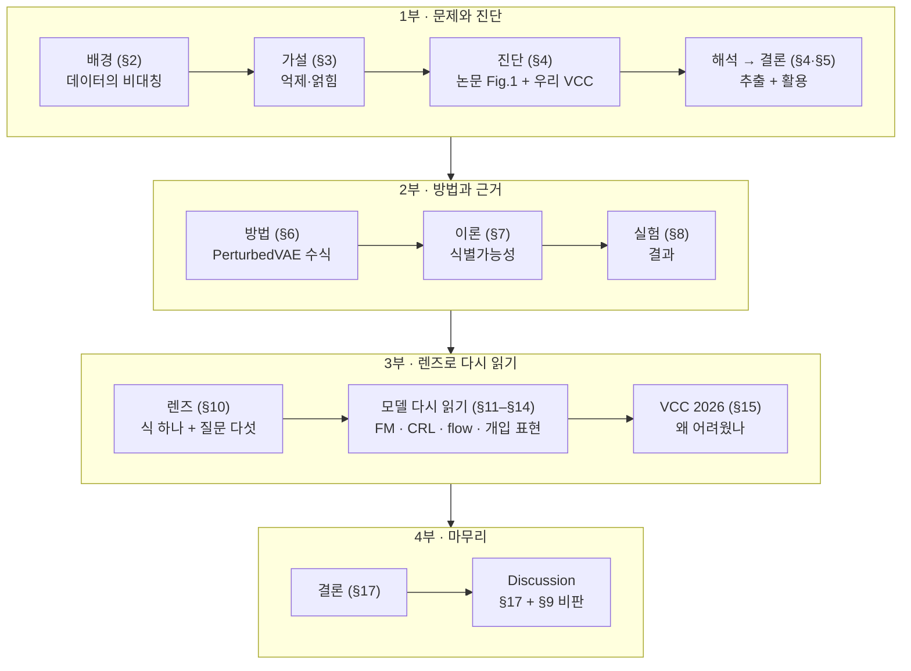
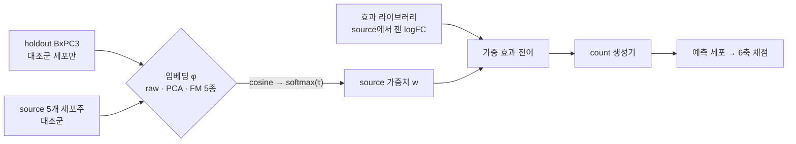
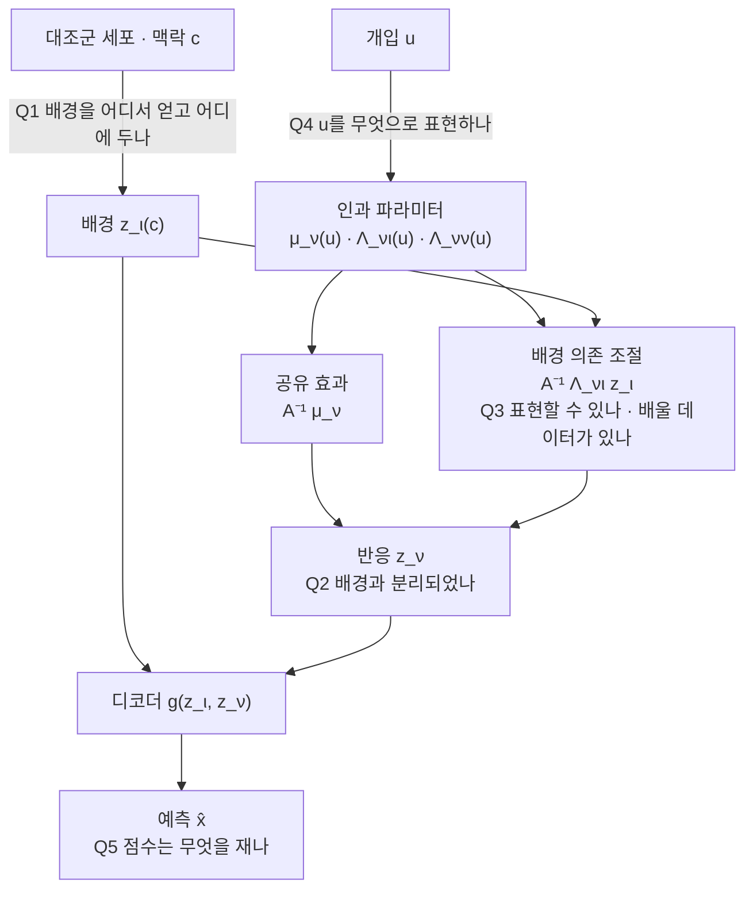
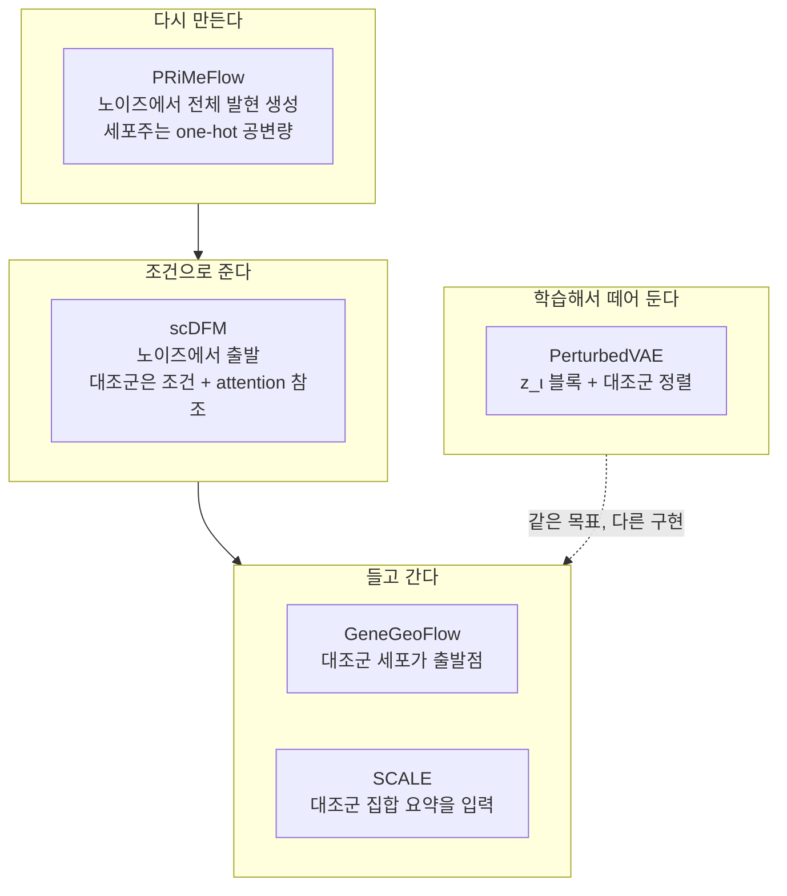
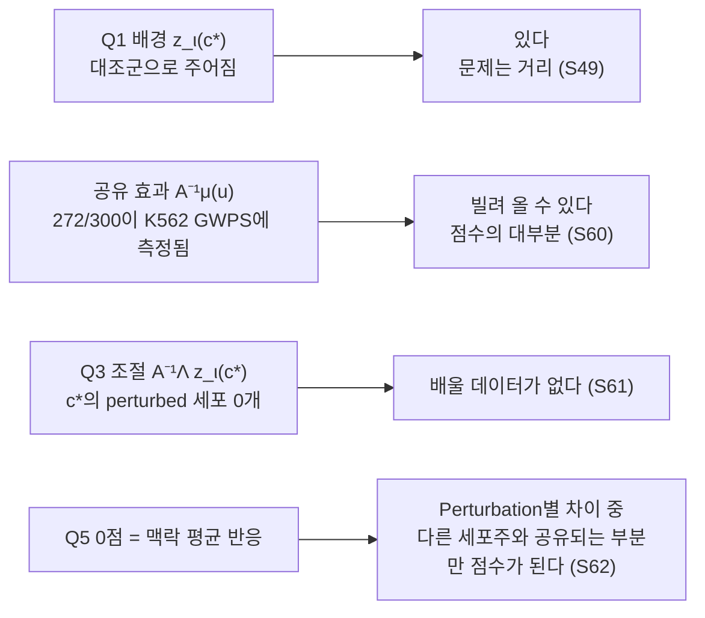

# 발표 구성안 — Perturbation 예측에서 '좋은 표현'이란 무엇인가

[🏠 Portfolio](https://github.com/heoneyzi) › [📚 Study](../../../README.md) › [🧬 Genomics](../../README.md) › [Season 2 · Functional Genomics 2](../README.md) › [Reviews](README.md)

> ✍️ **강지헌 (me)** · 📅 2026-09 (FG2 review session) · 🗂️ Source: local file `FG2_발표구성안_What_Makes_a_Representation_Good.md`
>
> Original file `FG2_발표구성안_What_Makes_a_Representation_Good.md`; *통합본 §n* refers to [01](01_what_makes_a_representation_good.md). Chart files named in the plan are in [`review_assets/charts/`](review_assets/charts/); the TranscriptFormer overview figure it mentions is not included.

---

**ICML 2026 *What Makes a Representation Good for Single-Cell Perturbation Prediction?* 리뷰 발표 · 슬라이드별 설계도**

> **발표** FG2(Functional Genomics 2) 리뷰 세션 · 발표자 강지헌
>
> **논문** Jiang, Liu(교신), Cai, Gao, Dong, Abbasnejad, Yao, Shi. ICML 2026 (PMLR 306). arXiv [2605.19343](https://arxiv.org/abs/2605.19343)
>
> **바탕 자료** ① `FG2_리뷰_What_Makes_a_Representation_Good_통합본.md`(아래에서 "통합본 §"로 표기) ② 논문 PDF(본문·부록) ③ 로컬 `VCC/VCC2026_실험_종합해설_및_메트릭이해_1.md`, `VCC/docs/SHADOW_VCC.md`, `VCC/docs/TWO_DATASET_SIX_METRIC.md` ④ Notion FG2: 'Baseline 분석'(강지헌), 'SUMMARY'(KIMCHI, 정유민), '하윙'(김서진), 'CCLE & Chronos'(김민석), 'VCC 2025 정리', 'FG 개요 1', 'FG 개요 3'

---

## 0. 이 문서를 쓰는 법

- 슬라이드마다 **핵심 메시지 → 화면 구성 → 슬라이드 문구 → 시각 자료 → 발표 노트(쉬운 설명) → 다음으로** 순서로 적었다. 슬라이드에는 "슬라이드 문구"만 올리고, 설명은 발표 노트로 말한다.
- §6 수식 슬라이드는 **수식 → 기호 → 한 줄 뜻 → 쉬운 비유 → 5번(추출·활용)과의 연결**을 따로 적었다.
- §10 렌즈 슬라이드는 **우리 실험과 어떻게 이어지는지**를 따로 적었다.
- 슬라이드 제목 옆 <b>[핵심]</b>은 빼면 흐름이 끊기는 슬라이드, <b>[선택]</b>은 시간이 부족할 때 빼거나 백업으로 돌려도 되는 슬라이드다. 맨 끝에 <b>축약 경로</b>를 적어 두었다.
- 태그로 출처를 구분한다. **[논문]** 논문 내용, **[우리 VCC]** 강지헌의 frozen-baseline 실험(VCC_jiheon), **[팀]** 다른 팀원의 VCC 작업, **[리뷰]** 이 리뷰의 해석·유도(논문의 주장이 아님).

<b>표기 규칙.</b> 이 문서는 번역어 대신 <b>Perturbation</b>이라는 용어를 그대로 쓴다. Perturbation을 받은 세포는 <b>perturbed 세포</b>, 아무 유전자도 건드리지 않은 가이드를 받은 세포는 <b>대조군(control)</b>, 유전자 두 개를 동시에 건드린 조건은 <b>이중 Perturbation(double)</b>이라고 쓴다.

---

## 1. 디자인 규칙 — 쉽고, 한눈에 보이게

**① 한 슬라이드에는 메시지 하나.** 제목을 주제어가 아니라 **결론 문장**으로 쓴다. "Figure 1 결과"가 아니라 "FM은 PCA보다 Perturbation을 덜 읽어 낸다"처럼 쓴다. 청중이 제목만 읽어도 흐름을 따라올 수 있게 한다.

**② 글은 적게, 그림은 크게.** 본문은 3–4줄, 한 줄은 짧게. 긴 설명은 발표 노트로 옮긴다. 화면의 절반 이상을 그림·표·도식이 차지하게 한다.

**③ 색은 의미로만, 덱 전체에서 같게.** 아래 네 가지 개념색을 모든 도식·수식 슬라이드에서 똑같이 쓴다. 청중이 색만 보고도 "이건 배경 이야기구나"를 알게 된다.

| 개념 | 색 | 어디에 |
|---|---|---|
| 배경(Perturbation과 무관한 변동, $z_\iota$) | **회색** | 배경 블록, 대조군, 배경 지배 지표 |
| Perturbation 신호·반응($z_\nu$) | **주황** | 반응 블록, 신호, 우리가 맞혀야 할 것 |
| 공유 효과 $A^{-1}\mu_\nu(u)$ | **파랑** | 세포주를 건너 옮길 수 있는 부분 |
| 배경 의존 조절 $A^{-1}\Lambda_{\nu\iota}(u)z_\iota$ | **보라** | 맥락마다 다른 부분, VCC 2026의 빈칸 |
| 전파 $A(u)^{-1}$ | **초록** | 반응 프로그램 사이의 하류 연쇄 (S20에서만) |

차트는 따로 규칙을 둔다. **강조할 한 항목만 주황, 나머지 기본은 파랑, 기준·비교용은 회색.** 차트 속 글자는 검정·회색으로만 쓰고 색으로 칠하지 않는다.

<b>④ 숫자는 크게.</b> 한 슬라이드의 결론이 숫자 하나면 표 대신 <b>큰 숫자 카드(stat tile)</b>로 보여 준다. 예: "모든 Perturbation에 공통인 변화 — 예측 68.0% / 실제 9.3%".

**⑤ 표는 줄여서.** 슬라이드 표는 4–5행 × 3–4열까지만. 원래 표는 백업 슬라이드나 부록으로 보낸다. 강조할 칸 하나만 굵게 또는 주황 테두리.

**⑥ 렌즈 바(Q1–Q5).** §10에서 질문 다섯 개를 소개한 뒤부터(§11–§15) 모든 슬라이드 오른쪽 위에 작은 아이콘 다섯 개(Q1 배경 · Q2 추출 · Q3 조절 · Q4 개입 · Q5 점수)를 두고, 그 슬라이드가 다루는 질문만 색을 칠한다. 청중이 지금 무슨 질문을 보고 있는지 길을 잃지 않는다.

**⑦ 출처는 하단 한 줄.** 슬라이드 아래에 작은 글씨로 "논문 Fig. 1", "Notion SUMMARY(KIMCHI)", "VCC 문서 §4.1"처럼 적는다. 수치 슬라이드는 "dataset-local 점수, 공식 점수 아님" 같은 단서도 여기에 둔다.

---

## 2. 발표 전체 흐름

이야기의 뼈대는 한 문장이다. **"Perturbation 데이터는 거대한 배경 위의 작은 신호다 → 배경과 신호에 각자의 자리를 주는 표현이 필요하다 → 그 관점으로 보면 우리 VCC 실험의 결과와 어려움이 설명된다."**

---

## 3. 슬라이드 목록

| # | 제목(결론 문장) | 통합본 | 구분 |
|---|---|---|---|
| 0 | 표지 — 오늘의 질문 | — | 핵심 |
| 1 | Perturbation 예측은 "대조군 + 개입 → 개입 후 발현"을 맞히는 문제다 | §1–§2 | 핵심 |
| 2 | Perturbation 신호는 작고, 발현의 대부분은 배경이다 | §2 | 핵심 |
| 3 | 배경과 신호를 나누지 않으면 두 가지 방식으로 실패한다 | §3 | 핵심 |
| 4 | 학습 목적은 배경부터 담는다 — 우리 팀도 이미 봤다 | §3 | 핵심 |
| 5 | [논문] FM은 PCA보다 Perturbation을 덜 읽어 낸다 | §4 | 핵심 |
| 6 | [논문] 그림을 자세히 보면 — 세 가지 관찰과 한 가지 주의 | §4 | 선택 |
| 7 | [우리 VCC] 같은 질문을 다른 방식으로: FM을 '닮음 계산기'로만 쓴 통제 실험 | §11.3 | 핵심 |
| 8 | [우리 VCC] 어떤 FM도 raw·PCA를 안정적으로 넘지 못했다 | §11.3 | 핵심 |
| 9 | [우리 VCC] 점수는 '효과를 옮기는 것'이 만들고, 임베딩의 몫은 작다 | §11.3, §15.4 | 핵심 |
| 10 | [우리 VCC] 표현들이 "누가 닮았나"를 두고 두 진영으로 갈렸다 | §11.3 | 핵심 |
| 11 | [우리 VCC] 1등은 온도·seed·세포 수에 따라 바뀐다 | §11.3, §15.4 | 핵심 |
| 12 | [우리 VCC] 새 배치는 쉽고, 새 세포주는 어렵다 — 가장 엄격한 설정에서도 raw가 1위 | §11.3 | 선택 |
| 13 | 논문의 probe와 우리 실험은 다른 질문에서 같은 결론에 닿았다 | §4, §11.3 | 핵심 |
| 14 | 해석 ① FM 사이의 순서는 '발현 크기를 얼마나 버리는가'와 맞물린다 | §4 | 선택 |
| 15 | 해석 ② FM은 배경을 담도록 학습되었다 — 그래서 '거리'가 문제다 | §4, §11.1 | 핵심 |
| 16 | 결론: 좋은 표현 = 추출 + 활용 | §5 | 핵심 |
| 17 | PerturbedVAE 한 장 요약 — 추출과 활용은 어디에 있나 | §6 | 핵심 |
| 18 | 식 ① 배경은 개입과 독립, 반응은 개입과 배경 모두에 의존 | §6.1 | 핵심 |
| 19 | 식 ② 개입이 바꾸는 것은 반응 쪽 메커니즘뿐 (구조방정식) | §6.2 | 핵심 |
| 20 | 식 ③ 반응 = 공유 효과 + 배경 의존 조절 (+ 전파) | §6.2 | 핵심 |
| 21 | 식 ④ 배경은 발현만 보고, 반응은 개입까지 보고 읽는다 | §6.3 | 핵심 |
| 22 | 식 ⑤ ELBO와 사전분포 — 인과 구조를 사전분포에 싣는다 | §6.4 | 핵심 |
| 23 | 식 ⑥ 대조군 정렬 — 추출을 맡는 장치 | §6.5 | 핵심 |
| 24 | 식 ⑥-분석 무작위로 짝지으면 배경까지 줄어든다 | §6.5 | 핵심 |
| 25 | 식 ⑦ 최종 목적함수와 학습 알고리즘 — 디코더는 개입을 모른다 | §6.6 | 핵심 |
| 26 | 식 ⑧ 테스트 때: 대조군에서 배경, 개입에서 반응 | §6.7 | 핵심 |
| 27 | 수식 지도 — 어느 식이 추출이고 어느 식이 활용인가 | §6 | 선택 |
| 28 | 식별가능성: 칸 나누기가 우연이 아니라는 보장 | §7.1 | 핵심 |
| 29 | 가정 네 개는 §6의 부품 네 개와 짝을 이룬다 | §7.2 | 핵심 |
| 30 | 증명의 핵심: 이론 속에서도 '대조군을 뺀다' | §7.3–§7.5 | 핵심 |
| 31 | [논문] 시뮬레이션: 정렬이 배경 블록을 살린다 | §8.1 | 핵심 |
| 32 | [논문] 실데이터: 파인튜닝한 FM도 KNN을 못 넘는다 | §8.2–§8.3 | 핵심 |
| 33 | [논문] 기존 잠재 인과 모델보다 낫고, 그 차이는 정렬에서 온다 | §8.4 | 핵심 |
| 34 | [논문] 효과 방향에서는 단순 합(additive)이 이긴다 | §8.5–§8.6 | 핵심 |
| 35 | [논문] 전체 유전자 지표는 높지만, 변하는 유전자만 보면 흩어진다 | §8.7–§8.8 | 선택 |
| 36 | [논문] 배경에는 큰 방이 필요하다 + 학습된 인과 그래프 | §8.9–§8.10 | 핵심 |
| 37 | 렌즈: 모든 Perturbation 모델이 채워야 하는 부품 목록 | §10 | 핵심 |
| 38 | Q1 배경은 어디에 있는가 | §10 | 핵심 |
| 39 | Q2 신호는 어떻게 꺼내는가 | §10 | 핵심 |
| 40 | Q3 조절 항을 표현할 수 있고, 배울 데이터가 있는가 | §10 | 핵심 |
| 41 | Q4 개입은 무엇으로 표현하는가 | §10 | 핵심 |
| 42 | Q5 점수는 무엇을 재는가 | §10 | 핵심 |
| 43 | PerturbedVAE 자신의 답 — 기준표 | §10 | 선택 |
| 44 | 좋은 배경 표현이 곧 좋은 맥락 거리는 아니다 | §10.1 | 핵심 |
| 45 | 렌즈 → 우리 실험·모델 연결 지도 | §10 → §11–§15 | 핵심 |
| 46 | 세포 FM의 목적함수는 배경을 보상한다 | §11.1 | 핵심 |
| 47 | 예측기로 쓰면: 억제의 증거가 여러 곳에서 모인다 | §11.2 | 핵심 |
| 48 | STATE와 Stack: 두 가지 모양의 억제 | §11.2 | 핵심 |
| 49 | 맥락 인코더로 쓰면: 거리가 반응과 정렬되어 있지 않다 | §11.3 | 핵심 |
| 50 | 얽힘: 배경을 붙잡는 장치가 없는 잠재 인과 모델들 | §12.1 | 핵심 |
| 51 | scGen·CPA: 추출은 했지만 조절은 0으로 뒀다 | §12.2 | 핵심 |
| 52 | flow 모델은 '흐름이 어디서 출발하는가'로 갈린다 | §13 | 핵심 |
| 53 | PRiMeFlow와 scDFM: 다시 만들기 vs 조건으로 주기 | §13.1–§13.2 | 핵심 |
| 54 | GeneGeoFlow·SCALE·CellOT/CMonge: 들고 가기와 집합으로 빼기 | §13.3–§13.5 | 핵심 |
| 55 | 어디서 빼는가, 어떻게 짝짓는가 | §13.6 | 선택 |
| 56 | 개입 표현은 반응에 가까울수록 잘 일반화한다 | §14 | 핵심 |
| 57 | 정렬이 정보량보다 중요하다 + 조합 | §14 | 핵심 |
| 58 | 어느 질문이 병목인가는 '무엇이 새로운가'가 정한다 | §14, §14.1 | 핵심 |
| 59 | VCC 2026을 논문의 식으로 쓰면 | §15 | 핵심 |
| 60 | 공유 항은 빌려 올 수 있었고, 점수의 대부분이 거기서 나왔다 | §15.1 | 핵심 |
| 61 | 조절 항에는 데이터가 없었다 | §15.2 | 핵심 |
| 62 | 추출도 대상 세포주 안에서는 할 수 없었고, 0점은 평균 반응이었다 | §15.3–§15.4 | 핵심 |
| 63 | 여섯 축이 서로 다른 것을 재서 순위가 흔들렸다 | §15.4 | 선택 |
| 64 | 한 문단으로: VCC 2026은 왜 어려웠나 | §15.5 | 핵심 |
| 65 | "임베딩이 중요하다"를 네 문장으로 | §17 | 핵심 |
| 66 | 다음에 확인할 것 네 가지 | §17 | 핵심 |
| 67 | Discussion ① 이 논문에서 믿을 것과 조심할 것 | §9, §17 | 핵심 |
| 68 | Discussion ② 평가: 논문도 Q5에 걸려 있다 | §9 | 핵심 |
| 69 | Discussion ③ 추출 장치의 약점 — 짝짓기와 붕괴 | §9 | 핵심 |
| 70 | Discussion ④ 논문의 한계가 곧 VCC 2026이 요구한 것 | §9, §15, §17 | 핵심 |
| 71 | Discussion ⑤ 함께 토론할 질문 | — | 선택 |

---

## 4. 그림·표 자료

모든 경로는 `Representation_Review` 폴더 기준이다.

| 파일 | 내용 | 쓰는 슬라이드 |
|---|---|---|
| `review_assets/fig1_linear_probe.png` | 논문 Figure 1 (선형 probe) | 5, 6 |
| `review_assets/fig2_graphical_model.png` | 논문 Figure 2 (생성 모델 그래프) | 18 |
| `review_assets/fig3_framework.png` | 논문 Figure 3 (PerturbedVAE 구조) | 17, 25 |
| `review_assets/table1_simulation.png` | 논문 Table 1 (시뮬레이션) | 31 |
| `review_assets/table2_fm_vs_simple.png` | 논문 Table 2 (FM·단순 모델 비교) | 32 |
| `review_assets/table4_crl_rmse.png` | 논문 Table 4 (잠재 인과 모델 비교) | 33 |
| `review_assets/fig4_r2_by_dim.png` | 논문 Figure 4 (잠재 차원별 $R^2$) | 33 |
| `review_assets/table14_additive.png` | 논문 Table 14 (additive 비교) | 34 |
| `review_assets/fig10_de_gene_r2_double.png` | 논문 Figure 10 (DE 유전자 $R^2$) | 35 |
| `review_assets/fig5_causal_graph.png` | 논문 Figure 5 (학습된 인과 그래프) | 36 |
| `review_assets/charts/*.png` | 이 구성안에 맞춰 만든 차트 8장 (아래 각 슬라이드에 파일명 표기) | 5, 8, 9, 11, 34, 48, 56, 60 |
| `VCC/external/transcriptformer/assets/model_overview.png` | TranscriptFormer 공식 개요 그림 (TF-Metazoa: 12종, 1.12억 세포) | 46 |

---

# 슬라이드별 설계

## Part 0. 표지

### S0. 표지 — 오늘의 질문 [핵심]

**핵심 메시지** 오늘은 논문을 깊게 읽고, 그 관점으로 우리 VCC 경험을 다시 설명한다.

**화면 구성** 제목과 부제를 위에, 가운데에 "오늘의 질문"을 가장 크게. 아래에 작은 시리즈 타임라인(VCC 2025·2026 → **이 논문** → GeoFlow).

**슬라이드 문구**
- 제목: Perturbation 예측에서 '좋은 표현'이란 무엇인가
- 부제: ICML 2026 논문의 관점으로 우리 VCC 실험과 모델들을 다시 읽기
- 오늘의 질문: **수억 개 세포로 학습한 세포 임베딩이, 왜 우리 VCC 실험에서 raw·PCA를 넘지 못했을까?**
- 논문 정보: Jiang et al., ICML 2026 (arXiv 2605.19343) · 발표 강지헌 · FG2

**발표 노트** "오늘은 순서가 두 단계입니다. 먼저 논문을 제대로 이해하고, 그다음 이 논문이 주는 관점, 저는 이걸 '렌즈'라고 부를 건데요, 그 렌즈로 우리가 VCC에서 겪은 일을 다시 설명해 보겠습니다."

---

## Part 1. 배경 (통합본 §2)

### S1. Perturbation 예측은 "대조군 + 개입 → 개입 후 발현"을 맞히는 문제다 [핵심]

**핵심 메시지** 입력이 시스템 자체를 바꾸는 예측 문제이고, 일반화와 해석이 과제다.

**화면 구성** 왼쪽에 입력→출력 도식, 오른쪽에 과제 두 개와 연구 흐름 두 개를 작은 카드로.

**슬라이드 문구**
- 목표: 대조군 세포 + 개입 $u$(어떤 유전자를 켜거나 껐나) → 개입 후 발현
- 과제 ① 일반화: 처음 보는 개입, 이미 본 개입의 조합(이중 Perturbation)
- 과제 ② 해석: 어떤 세포 프로그램이 어떻게 바뀌나
- 두 흐름: **CRL**(잠재 인과 변수를 복원) · **FM**(대규모 데이터로 범용 표현)

**시각 자료** 도식: [대조군 세포(회색)] + [개입 $u$] → [모델] → [perturbed 세포(회색 + 주황 점 몇 개)]. 카드: CRL 예시 Discrepancy-VAE·sVAE+·SAMS-VAE·SENA / FM 예시 scGPT·scFoundation·Geneformer·UCE.

**발표 노트(쉬운 설명)** Perturb-seq는 CRISPR로 유전자를 건드린 세포 수만 개의 전사체를 한 번에 읽는 실험이다. 가이드 RNA 바코드로 어느 세포가 무엇을 받았는지 안다. CRISPRa는 유전자를 켜고 CRISPRi는 끈다. 대조군은 아무 유전자도 겨냥하지 않는 가이드를 받은 세포로, "개입 전 상태"의 대리다. 보통의 예측과 다른 점은 입력(개입)이 시스템을 바꾼다는 것이다.

**다음으로** "그런데 이 문제를 어렵게 만드는 데이터의 성질이 하나 있습니다."

### S2. Perturbation 신호는 작고, 발현의 대부분은 배경이다 [핵심]

**핵심 메시지** 발현 변동의 대부분은 개입과 무관한 배경이고, Perturbation 신호는 소수 유전자에 몰린 작은 신호다.

**화면 구성** 가운데 큰 가로 막대 하나를 "발현 변동 전체"로 두고, 대부분을 회색(배경), 끝의 작은 조각을 주황(Perturbation 신호)으로 칠한다. 오른쪽에 숫자 카드 두 장.

**슬라이드 문구**
- 배경: 세포 정체성, 세포주기, 크기, 대사, 시퀀싱 깊이 → 수천 유전자, **크다**
- Perturbation 신호: 표적과 그 하류 프로그램 → 소수 유전자, **작다**
- 숫자 카드: 서로 다른 Perturbation **≈ 284개** vs 측정 유전자 **≈ 19,264개** (Norman 2019, 논문 서론의 예시)
- **부분 개입**: 기존 CRL 이론은 "모든 잠재 변수가 언젠가 한 번은 개입된다"고 가정 ↔ 실제로는 극히 일부만 개입된다

**시각 자료** 개념 막대(비율은 예시라고 표기) + 숫자 카드 2장. 선택으로 오케스트라 아이콘.

**발표 노트(쉬운 설명)** 오케스트라 녹음에서 트라이앵글 한 번을 찾는 상황을 떠올리면 된다. 녹음 전체를 잘 압축하도록 만든 코덱은 현악기(배경)는 충실히 남기지만 트라이앵글(신호)은 뭉갠다. 반대로 트라이앵글 전용 채널만 있고 현악기 채널이 없으면 그 채널이 현악기 소리로 가득 찬다. 앞의 경우가 FM, 뒤의 경우가 CRL의 실패다. 실제 실험은 5,000개 유전자를 쓴다.

**다음으로** "이 비대칭에서 논문의 가설이 나옵니다."

---

## Part 2. 가설 (통합본 §3)

### S3. 배경과 신호를 나누지 않으면 두 가지 방식으로 실패한다 [핵심]

**핵심 메시지** Perturbation Suppression Hypothesis — 원인은 하나, "배경의 자리와 신호의 자리가 나뉘어 있지 않다".

**화면 구성** 위에 가설 문장을 크게. 아래에 좌우 도식 두 칸, 가운데 아래에 원인 한 줄.

**슬라이드 문구**
- 가설: 배경이 데이터를 지배할 때, 배경과 Perturbation 특이 정보를 **명시적으로 나누지 않는** 접근은 체계적으로 실패한다
- **얽힘 (CRL)**: 배경을 둘 자리가 없어 '인과 변수'로 흘러든다 → 의미 오염 → 새 Perturbation으로 일반화 실패
- **억제 (FM)**: 전체 분포를 맞추는 목적 → 배경부터 담는다 → 신호가 "덜 접근 가능"해진다
- 두 실패는 거울상이다

**시각 자료** 왼쪽 "얽힘": 주황 상자(신호 자리) 안에 회색이 번진 그림. 오른쪽 "억제": 큰 회색 상자 안에 작은 주황 점이 묻힌 그림.

**발표 노트(쉬운 설명)** 억제는 신호가 "사라진다"가 아니라 "꺼내 쓰기 어려워진다(less accessible)"는 뜻이다. 논문의 표현 그대로다. 저자들은 CRL의 얽힘도 넓은 의미의 억제로 본다. 신호 칸의 '신호다움'이 배경에 묻히기 때문이다.

**다음으로** "그런데 왜 학습 목적은 배경부터 담을까요?"

### S4. 학습 목적은 배경부터 담는다 — 우리 팀도 이미 봤다 [핵심]

**핵심 메시지** 재구성 목적은 설명한 분산만큼 보상하므로 배경을 맞히는 쪽이 가장 이득이고, 우리 팀의 STATE 학습에서도 그 일이 일어났다.

**화면 구성** 왼쪽 절반은 설명용 셈, 오른쪽 절반은 [팀] 사례 카드.

**슬라이드 문구**
- (설명용 숫자) 발현 분산의 95%가 배경, 5%가 신호라면 → **배경만 맞혀도 95점**
- 용량이 한정되면 신호를 버리는 편이 손해가 적다
- 신호가 소수 유전자에 몰릴수록 계산은 더 기운다
- [팀] KIMCHI-1 · STATE 학습 진단: 모든 Perturbation에 공통인 변화 **예측 68.0% / 실제 9.3%**
- 팀 기록: "실제 Perturbation 효과는 유전자당 0.04 수준인데 세포 간 변이가 훨씬 커서, energy 분포 손실이 Perturbation 신호를 압도했다"

**시각 자료** 왼쪽: 95/5 막대(가상 숫자 표기). 오른쪽: 큰 숫자 카드 두 장(68.0% vs 9.3%)과 인용 박스.

**발표 노트(쉬운 설명)** 95/5는 설명을 위해 지어낸 숫자라고 먼저 말한다. KIMCHI-1은 STATE(SE-600M 고정 + ST 116M)를 Replogle 세 세포주 약 70만 세포로 학습한 시도였다. 처음 보는 세포주(Jurkat)에서 예측과 실제의 상관은 +0.056, 효과 크기는 6.43배 과대였고, 대조군을 그대로 복제한 제출보다도 못해 폐기되었다(Notion SUMMARY). 모델이 "모든 Perturbation에 공통인 평균 변화"로 무너진 것이다. 이 사례는 S48에서 다시 본다.

**다음으로** "논문은 이 가설을 어떻게 확인했을까요?"

---

## Part 3. 진단 실험과 우리 실험 (통합본 §4 + VCC_jiheon)

### S5. [논문] FM은 PCA보다 Perturbation을 덜 읽어 낸다 — Figure 1 [핵심]

**핵심 메시지** 고정된 FM 표현에서 Perturbation 조건을 선형으로 읽어 보면 PCA보다 못하다.

**화면 구성** 왼쪽 2/3에 그림, 오른쪽 1/3에 설정 세 줄과 결론 한 줄.

**슬라이드 문구**
- 설정: 표현을 **고정**하고, Perturbation 조건 $u$를 **선형 분류기**로 맞힌다
- 평균 정확도: PCA **0.36** · PerturbedVAE 0.35 · scFoundation 0.34 · Geneformer 0.26 · UCE **0.20** (그림에서 읽은 근삿값, ±0.01)
- 저자 해석: 정보는 데이터에 있지만, 범용 FM 목적으로 인코딩된 뒤 **꺼내기 어려워진다**

**시각 자료** `review_assets/charts/chart_fig1_probe_means.png`(평균만 뽑은 막대, 한눈에 보기용) 또는 원본 `review_assets/fig1_linear_probe.png`(조건별 점까지 보이는 원 그림). 발표용으로는 막대 차트를 크게, 원 그림은 작게 곁들이는 구성을 권한다.

**발표 노트(쉬운 설명)** 선형 probe는 표현은 그대로 두고 그 위에 선형 분류기 하나만 얹어 보는 시험이다. "정보가 꺼내 쓸 수 있는 형태로 들어 있는가"를 본다. PCA는 원 발현에 바로 적용한 것이다. PCA보다 못하다는 것은 FM이 인코딩하는 과정에서 Perturbation 정보가 묻혔다는 뜻이다.

**다음으로** "그림을 조금 더 자세히 보면 요약에 드러나지 않는 점이 있습니다."

### S6. [논문] 그림을 자세히 보면 — 세 가지 관찰과 한 가지 주의 [선택]

**핵심 메시지** "FM < PCA"는 맞지만 "PerturbedVAE > PCA"는 아니고, probe 설정에는 확인할 점이 남아 있다.

**화면 구성** Figure 1 원 그림 위에 번호 주석 세 개, 오른쪽 아래에 "주의" 박스.

**슬라이드 문구**
- ① PerturbedVAE도 PCA를 넘지 않는다 (저자 표현도 "competitive")
- ② FM끼리 차이가 크다: scFoundation ≈ PCA, UCE는 정확도 0 근처인 조건이 많다
- ③ 모두 무작위(105개 클래스라면 약 1%)보다 훨씬 높다 → 정보가 사라진 게 아니라 **선형으로 꺼내기 어렵다**
- 주의: 분류기·분할·PCA 차원·**PerturbedVAE의 어떤 표현을 probe했는지** 논문에 없다. 반응 블록 $z_\nu$는 $u$를 입력으로 받으므로 $z_\nu$를 probe했다면 순환이다

**시각 자료** `review_assets/fig1_linear_probe.png` + 주석(① PerturbedVAE와 PCA의 평균선 ② UCE의 바닥 점들 ③ 무작위 수준 선).

**발표 노트** 파인튜닝한 FM도 단순 모델(KNN)보다 오차가 컸다는 결과는 S32에서 보여 준다. 공정한 probe 대상은 $u$를 보지 않는 공유 인코더의 은닉 표현이다.

**다음으로** "우리도 VCC에서 같은 질문을 다른 모양으로 던졌습니다."

### S7. [우리 VCC] 같은 질문을 다른 방식으로 — FM을 '닮음 계산기'로만 쓴 통제 실험 [핵심]

**핵심 메시지** 다른 모든 것을 고정하고 "처음 보는 세포주가 어느 source를 닮았는가"를 재는 임베딩 하나만 바꿨다.

**화면 구성** 가운데 파이프라인 도식을 크게. 왼쪽 위에 질문 한 줄, 오른쪽에 설정 카드.

**슬라이드 문구**
- 질문: FM 표현이 처음 보는 세포주의 "닮은 이웃"을 더 잘 골라 주는가?
- **모두 고정**(효과 라이브러리·생성기·seed·세포 수·채점기), **닮음을 재는 임베딩 하나만** 교체
- Jiang24 IFNG (CRISPRi 표적 56개): source A549·HAP1·HT29·K562·MCF7 → holdout **BxPC3** (처음 보는 세포주, 대조군만 사용)
- 비교한 표현: raw · PCA · STATE · STACK · UCE · TranscriptFormer · scPRINT-2
- 채점: `cell-eval2` `vcc2026` 6축 평균 · **0 = BxPC3의 실제 평균 반응을 모든 Perturbation에 똑같이 준 기준선, 1 = replicate 수준**

**시각 자료** 아래 도식과 전이 식.

$$
\hat\Delta(c^*, g) = \sum_{c} w_c\, \Delta(c, g), \qquad w_c = \operatorname{softmax}_c\Big(\tfrac{1}{\tau}\cos\big(\phi(c^*), \phi(c)\big)\Big)
$$

**발표 노트(쉬운 설명)** "FM에게 반응까지 생성하게 하면, 점수 차이가 표현 때문인지 생성 방식 때문인지 구분할 수 없습니다. 그래서 FM은 '닮음'만 재게 하고 나머지는 모두 똑같이 두었습니다." 기본 조건은 `gwps_weighted`, τ = 0.1, seed 2026, 표적당 50세포다. 임베딩 차원은 STATE 1,034 · STACK 1,600 · UCE-4L 1,280 · TranscriptFormer-Sapiens 2,048 · scPRINT-2 small-v2 424. scGPT·scFoundation은 checkpoint가 없어 제외했고, 표적별 반응을 이미 아는 모델(Geneformer-deletion 등)은 통제를 깨므로 뺐다. 모든 점수는 공개 채점기를 외부 데이터에 돌린 **dataset-local 점수**이고 챌린지 공식 점수가 아니다. **말할 때 주의**: 방법 이름에 `gwps_`가 붙어 있고 VCC 문서 앞부분(요약·용어)도 라이브러리를 "Replogle GWPS"라고 적었지만, 이 LOCO 실험의 라이브러리는 **source 다섯 세포주에서 잰 logFC**다(VCC 문서 §3.3 1단계, `docs/STRICT_ZERO_SHOT.md`: "LOCO hides BxPC3 responses but transfers measured responses from five other Jiang24 cell lines"). Replogle K562·RPE1만 쓰는 것은 S12의 strict 보조 실험이다. (출처: VCC 문서 §2–§3, `docs/SHADOW_VCC.md`, Notion 'Baseline 분석')

**다음으로** "결과부터 보겠습니다."

### S8. [우리 VCC] 어떤 FM도 raw·PCA를 안정적으로 넘지 못했다 [핵심]

**핵심 메시지** 처음 보는 세포주에서는 모든 표현이 기준선 아래였고, FM의 우위는 한 축에서만 나왔다.

**화면 구성** 왼쪽에 Overall 가로 막대 차트, 오른쪽에 "축별 1등" 작은 표 3행.

**슬라이드 문구**
- **모든 Overall이 음수** → 기준선(0)보다 낮다. 처음 보는 세포주는 정말 어렵다
- scPRINT2 1위(−0.760)는 **Jaccard 한 축** 덕분 (다른 표현은 −5 ~ −10)
- STACK: fidelity 1위(0.735)인데 Overall 꼴찌(Jaccard −10.110)
- raw: PDS 1위(0.390)

**시각 자료** `review_assets/charts/chart_jiang24_overall.png`. 오른쪽 작은 표:

| 축 | 1위 | 값 |
|---|---|---:|
| PDS (Perturbation 구별) | raw | 0.390 |
| fidelity | STACK | 0.735 |
| Jaccard (DE 집합 겹침) | scPRINT2 | −2.363 |

**백업 슬라이드용 전체 표** (Jiang24, τ = 0.1, seed 2026, 표적당 50세포, `gwps_weighted`)

| 표현 | PDS | NMAE | fidelity | reach | Jaccard | Overall |
|---|---:|---:|---:|---:|---:|---:|
| scPRINT2 | 0.221 | −2.508 | 0.310 | −0.218 | −2.363 | −0.760 |
| PCA | 0.224 | −1.447 | 0.626 | 0.032 | −4.999 | −0.927 |
| raw | 0.390 | −1.881 | 0.567 | 0.029 | −4.981 | −0.979 |
| raw / no_effect | −0.098 | −1.287 | 0.590 | −0.336 | −6.929 | −1.343 |
| UCE | 0.257 | −1.589 | 0.542 | 0.027 | −7.522 | −1.381 |
| TranscriptFormer | 0.188 | −0.751 | 0.674 | −0.175 | −8.498 | −1.427 |
| STATE | 0.112 | −1.128 | 0.599 | −0.027 | −8.404 | −1.475 |
| STACK | 0.149 | −0.723 | 0.735 | −0.271 | −10.110 | −1.703 |

(MSE 축은 정규화 뒤 모든 행이 0이라 뺐다.)

**발표 노트(쉬운 설명)** PDS는 "Perturbation A의 예측이 A의 정답에 다른 표적의 정답보다 더 가까운가", 즉 표적끼리 구별되는지를 보는 축이다. 논문의 probe와 같은 질문을 예측 결과에 던지는 셈인데, 여기서도 raw가 1위였다. Jaccard는 예측한 DE 유전자 집합과 실제 DE 집합의 겹침이다.

**다음으로** "그렇다면 점수는 어디에서 나왔을까요?"

### S9. [우리 VCC] 점수는 '효과를 옮기는 것'이 만들고, 임베딩의 몫은 작다 [핵심]

**핵심 메시지** 가장 큰 도약은 측정된 효과를 옮기는 단계였고, Perturbation을 구별하지 않는 평균만 옮겨도 대부분의 가중 전이보다 나았다.

**화면 구성** 왼쪽에 방법별 계단 차트, 오른쪽에 "2단계 분해" 박스.

**슬라이드 문구**
- 1단계(큰 도약): 효과를 옮기지 않음(no_effect **−1.343**) → 측정된 효과를 옮김(**−0.98 ~ −0.76**)
- 2단계(작고 조건 의존): raw·PCA의 닮음 vs FM의 닮음
- Perturbation을 구별하지 않는 **평균 효과(global_mean)만 옮겨도 −0.846** → 이를 넘은 가중 전이는 scPRINT2(−0.760) 하나뿐
- 닮음 없이 그대로 옮기면(gwps_direct) −1.540, 오히려 no_effect보다 나쁘다

**시각 자료** `review_assets/charts/chart_jiang24_method_ladder.png` (global_mean만 주황으로 강조, 0선에 "기준선" 라벨). 오른쪽 박스는 Notion 'Baseline 분석'의 두 단계 문장을 그대로 인용.

**발표 노트(쉬운 설명)** STATE·STACK은 가장 닮은 source 하나만 쓰는 nearest(둘 다 −0.989)가 여러 source를 섞는 weighted(−1.475, −1.703)보다 나았다. 닮음 신호가 약하면 섞을수록 엉뚱한 세포주의 효과가 스며든다. 그리고 global_mean(−0.846)과 0점 사이의 거리가 무엇을 뜻하는지는 VCC 파트(S61)에서 다시 설명한다고 예고한다. (출처: VCC 문서 부록 A)

**다음으로** "표현들은 도대체 무엇을 두고 갈렸을까요?"

### S10. [우리 VCC] 표현들이 "누가 닮았나"를 두고 두 진영으로 갈렸다 [핵심]

**핵심 메시지** 같은 라이브러리와 생성기를 쓰는데도 "BxPC3와 가장 닮은 세포주" 판단이 갈렸고, 그 판단 차이가 점수 차이의 정체다.

**화면 구성** 가운데에 BxPC3, 왼쪽에 A549 진영, 오른쪽에 HT29 진영을 화살표로 잇는 도식. 아래에 작은 표.

**슬라이드 문구**
- **A549 진영**: raw · PCA · UCE · TranscriptFormer
- **HT29 진영**: scPRINT2 · STATE · STACK
- τ는 이 판단을 "얼마나 확신하나"의 손잡이: τ를 키우면 여러 세포주를 고르게 섞는다

**시각 자료** 진영 도식 + 아래 표(VCC 문서 Q5).

| 표현 | 가장 닮은 source | 최대 가중치 (τ 0.01 → 1.0) | 유효 source 수 (τ 0.01 → 1.0) |
|---|---|---|---|
| raw | A549 | 0.802 → 0.220 | 1.47 → 4.97 |
| PCA | A549 | 1.000 → 0.328 | 1.00 → 4.43 |
| UCE | A549 | 0.999 → 0.226 | 1.00 → 4.96 |
| TranscriptFormer | A549 | 0.980 → 0.218 | 1.04 → 4.98 |
| scPRINT2 | HT29 | 0.668 → 0.215 | 1.80 → 4.98 |
| STATE | HT29 | 0.888 → 0.230 | 1.25 → 4.93 |
| STACK | HT29 | 0.999 → 0.246 | 1.00 → 4.88 |

**발표 노트(쉬운 설명)** "모두 BxPC3가 누구와 닮았는지 답했는데, 답이 둘로 갈렸습니다. 어느 쪽이 옳았는지는 BxPC3의 실제 반응과 각 세포주의 반응을 비교하면 판정할 수 있습니다. 이건 마지막에 '다음에 확인할 것'으로 남겨 두겠습니다(S66)."

**다음으로** "이 결과가 얼마나 단단한지도 확인했습니다."

### S11. [우리 VCC] 1등은 온도·seed·세포 수에 따라 바뀐다 [핵심]

**핵심 메시지** 표현 사이의 차이는 설정을 조금만 바꿔도 뒤집힐 만큼 작고 불안정하다.

**화면 구성** 위쪽에 τ별·seed별 1등을 한 줄씩(칩 형태로), 아래쪽에 세포 수 차트.

**슬라이드 문구**
- τ 다섯 값에서 **1등이 모두 다르다**: STACK(0.01) · STATE(0.03) · scPRINT2(0.1) · PCA(0.3) · UCE(1.0)
- seed 네 개 **모두에서 1등을 지킨 표현은 없다**
- 세포 수 25 → 100: NMAE는 좋아지고(−6.0 → 0 근처), Jaccard는 무너진다(−15 ~ −17)
- Jaccard 한 축을 빼면 12개 조건 중 **11개에서 1등이 바뀐다**

**시각 자료** `review_assets/charts/chart_jiang24_cells_tradeoff.png` (NMAE·Jaccard·Overall 세 칸, scPRINT2와 PCA). 위쪽 칩:

| 조건 | 0.01 | 0.03 | **0.1** | 0.3 | 1.0 |
|---|---|---|---|---|---|
| τ별 1등 (Overall) | STACK −0.494 | STATE −0.792 | **scPRINT2 −0.760** | PCA −0.984 | UCE −0.648 |

| 조건 | 2024 | 2025 | **2026** | 2027 |
|---|---|---|---|---|
| seed별 1등 (Overall) | TranscriptFormer −0.752 | STACK −0.515 | **scPRINT2 −0.760** | scPRINT2 −1.079 |

**발표 노트(쉬운 설명)** 제출하는 세포 수는 중립적인 선택이 아니다. Jaccard는 Wilcoxon 검정으로 DE 유전자를 부르기 때문에 세포가 많을수록 "틀린 DE 집합"을 더 잘 잡아낸다. 그래서 세포를 늘리면 크기 오차(NMAE)는 좋아지지만 Jaccard는 나빠진다. 이 강건성 확장은 정답을 본 뒤의 사후 탐색이라 "가장 좋은 τ·세포 수"를 새 정답으로 선언하면 안 된다. (출처: VCC 문서 §6)

**다음으로** "다른 두 설정도 짧게 보겠습니다."

### S12. [우리 VCC] 새 배치는 쉽고, 새 세포주는 어렵다 — 가장 엄격한 설정에서도 raw가 1위 [선택]

**핵심 메시지** 같은 실험의 새 배치는 기준선을 넘지만 처음 보는 세포주는 넘지 못하고, 외부 반응만 쓰면 raw가 가장 낫다.

**화면 구성** 좌우 카드 두 장. 왼쪽 카드에는 경고 스티커 하나.

**슬라이드 문구**
- **GSE270828 (새 배치 rep3)**: Overall 모두 양수 0.556–0.753, PCA 1위(0.753)
  - 경고: 표적이 유전자가 아닌 HAR 조절요소 184개 → DE 계열 4축이 정의되지 않음 → 사실상 PDS·fidelity 두 축 점수
- **strict Replogle-only** (Jiang24 표적 중 K562·RPE1 두 source에 모두 있는 8개): raw 1위(−0.145), PCA 꼴찌(−0.579)
  - K562↔RPE1 효과 cosine **≈ 0.11**, 부호 일치율 **≈ 0.54** (무작위 0.5), 전이할 효과 크기로 선택된 전역 배율 **0.25**
- 두 데이터셋 점수는 자(anchor)가 달라 직접 비교하지 않는다

**시각 자료** 카드 두 장. 오른쪽 카드에 strict 순위 표(raw −0.145 · scPRINT2 −0.182 · STACK −0.210 · UCE −0.220 · STATE −0.246 · TranscriptFormer −0.253 · PCA −0.579).

**발표 노트(쉬운 설명)** 같은 유전자를 눌러도 K562와 RPE1의 반응은 거의 일치하지 않았다(cosine 0.11). 옮길 효과의 크기를 고르는 절차에서 원래의 4분의 1(배율 0.25)이 선택되었다는 것도 세포주 사이 전이가 근본적으로 약하다는 신호다. 이 숫자는 S61에서 핵심 근거로 다시 쓴다.

**다음으로** "이제 논문과 우리 실험을 나란히 놓아 보겠습니다."

### S13. 논문의 probe와 우리 실험은 다른 질문에서 같은 결론에 닿았다 [핵심]

**핵심 메시지** 질문은 달랐지만 둘 다 "FM ≤ raw·PCA"였고, 뿌리는 하나다.

**화면 구성** 2열 비교표를 크게, 아래에 결론 한 줄을 굵게.

**슬라이드 문구**

| | 논문의 선형 probe | 우리 VCC 실험 |
|---|---|---|
| 묻는 것 | perturbed 세포 표현에서 $u$를 읽을 수 있나 | 대조군 표현의 거리로 반응을 옮길 source를 고를 수 있나 |
| 입력 | perturbed 세포의 표현 | 대조군(배경)의 표현 |
| 필요한 것 | 신호가 선형으로 남아 있을 것 | 표현의 거리가 반응의 거리와 맞물릴 것 |
| 결과 | FM ≤ PCA | FM ≤ raw·PCA, 그마저 불안정 |

- 결론: **범용 목적은 표현의 기하를 데이터의 지배적인 축, 즉 Perturbation과 무관한 배경을 따라 짠다**

**시각 자료** 표 자체. 결과 행만 주황 테두리.

**발표 노트** 두 실험이 다른 질문을 던졌다는 점을 먼저 짚고, 그런데도 같은 쪽을 가리킨다는 점을 강조한다. 2주차 발표(Current Gap in Genomic FM)의 "PCA baseline을 항상 먼저 돌려라"와도 같은 방향이다.

**다음으로** "왜 그런지 두 가지로 해석해 보겠습니다."

---

## Part 4. 4번 실험의 해석 (통합본 §4 해석)

### S14. 해석 ① FM 사이의 순서는 '발현 크기를 얼마나 버리는가'와 맞물린다 [선택] [리뷰]

**핵심 메시지** 발현 크기를 보존하고 맞히는 모델일수록 PCA에 가깝고, 크기를 버리는 모델일수록 낮다.

**화면 구성** 4행 표를 가운데에, 표 위로 왼쪽 "크기 보존" → 오른쪽 "크기 버림" 화살표.

**슬라이드 문구**

| 표현 | 발현을 넣는 방식 | 사전학습 목적 | Fig. 1 |
|---|---|---|---:|
| PCA | 연속값 그대로 선형 투영 | 분산 최대화 | 0.36 |
| scFoundation | 연속값 임베딩, 시퀀싱 깊이 인지 | 가려진 발현값 **회귀** | 0.34 |
| Geneformer | 발현 **순위**대로 유전자 토큰 나열 | 가려진 유전자 토큰 예측 | 0.26 |
| UCE | 발현에 비례해 뽑은 유전자 1,024개 | 유전자가 발현되었는지(**이진**) 예측 | 0.20 |

- CRISPRa는 발현 **크기**를 바꾸는 개입 → 크기를 버리는 인코딩은 그 신호부터 버린다

**발표 노트** 논문은 FM 사이의 순서를 설명하지 않는다. 이건 이 리뷰의 해석이라고 분명히 말한다.

**다음으로** "더 중요한 두 번째 해석이 있습니다."

### S15. 해석 ② FM은 배경을 담도록 학습되었다 — 그래서 '거리'가 문제다 [핵심] [리뷰]

**핵심 메시지** probe 정확도가 낮다는 것은 FM이 Perturbation에 거의 불변인 배경 표현이라는 뜻이고, 그렇다면 문제는 "그 배경의 거리가 반응의 거리인가"로 옮겨 간다.

**화면 구성** 왼쪽에 "FM이 잘 담는 것: 세포 정체성(배경)" 개념 그림(회색 점들이 세포 타입별로 모인 공간), 오른쪽에 "우리가 필요한 것: 반응이 비슷한 맥락끼리 가까운 공간"(주황), 가운데 큰 "≠".

**슬라이드 문구**
- probe가 낮다 = Perturbation에 거의 **불변** = 배경($z_\iota$)에 가까운 표현
- UCE: 목표가 종을 넘는 세포 정체성 → probe 최하위
- TranscriptFormer: 세포 임베딩 분산의 **95% 이상**을 세포 타입이 설명 (1주차 정리)
- 우리 VCC는 FM을 정확히 **배경 인코더**로 썼다 → 질문: "배경의 거리 = 반응의 거리인가?"

**발표 노트(쉬운 설명)** "FM이 쓸모없다는 게 아닙니다. 배경은 잘 담습니다. 그런데 우리가 VCC에서 필요했던 건 '반응이 비슷한 세포주끼리 가깝게 놓인 공간'이었습니다. 두 진영으로 갈리고 설정마다 1등이 바뀐 것은 이 두 거리가 다르다는 신호입니다. 이 질문의 정식 답은 렌즈 파트(S44)에서 식으로 보여 드리겠습니다."

**다음으로** "그러면 무엇이 필요할까요?"

---

## Part 5. 4번 실험의 결론 (통합본 §5)

### S16. 결론: 좋은 표현 = 추출 + 활용 [핵심]

**핵심 메시지** 배경과 신호에 각자의 자리를 주고(추출), 신호를 개입 구조에 맞게 조직해야(활용) 한다.

**화면 구성** 큰 박스 두 개가 화살표로 "PerturbedVAE"에 모인다. 박스마다 질문 한 줄을 크게.

**슬라이드 문구**
- **추출 (Extraction)** — "배경을 어디에 둘 것인가": Perturbation 특이 정보를 지배적인 배경에서 명시적으로 떼어 낸다 → 억제(FM)와 얽힘(CRL) 모두에 대한 답
- **활용 (Utilization)** — "개입이 반응을 어떻게 바꾸는지를 무엇으로 표현할 것인가": 떼어 낸 정보를 인과 구조로 조직한다 → 처음 보는·조합 Perturbation 일반화와 해석
- 근거: probe(FM < PCA) → 신호를 꺼내는 장치가 필요 / 우리 VCC(배경 거리 ≠ 반응 거리) → 배경과 반응의 관계를 모델 안에 둬야 한다

**시각 자료** 박스 두 개(추출=회색과 주황이 분리된 그림, 활용=주황 노드들이 화살표로 이어진 작은 DAG).

**발표 노트** 논문 3장의 제목이 "A Heuristic Framework"다. 개념 틀을 먼저 내놓고, 4장의 이론이 그 틀의 구체적인 모양을 정당화하는 순서다. "이 두 원칙이 수식으로 어떻게 구현되는지 보겠습니다."

**다음으로** PerturbedVAE 파트.

---

## Part 6. PerturbedVAE — 수식으로 읽기 (통합본 §6) ★ 가장 중요한 파트

수식 슬라이드는 모두 같은 틀로 만든다. **위: 수식(크게) → 가운데: 기호 풀이(작게) → 아래: 한 줄 뜻 + [추출]/[활용] 태그.** 수식 속 배경 관련 기호는 회색, 반응·개입 관련 기호는 주황으로 칠해 두면 청중이 "어느 칸의 이야기인지"를 색으로 따라온다.

### S17. PerturbedVAE 한 장 요약 — 추출과 활용은 어디에 있나 [핵심]

**핵심 메시지** 배경 칸($z_\iota$)과 반응 칸($z_\nu$)을 나누고, 배경은 대조군으로 고정하며(추출), 반응은 개입이 바꾸는 인과 메커니즘으로 만든다(활용).

**화면 구성** Figure 3을 크게 놓고, 위에 태그 두 개를 덧씌운다. 대조군 정렬과 불변 블록 쪽에 **[추출]**, 개입 라벨과 반응 블록 쪽에 **[활용]**.

**슬라이드 문구**
- 두 칸: 배경 $z_\iota$ (85차원) · 반응 $z_\nu$ (20차원, 성분 사이 DAG)
- [추출] 대조군 세포와 배경 칸을 정렬 → 배경을 $z_\iota$에 못 박는다
- [활용] 개입 $u$ → 인과 파라미터 → 반응 칸 $z_\nu$
- 디코더는 $u$를 모른다 → 개입이 출력에 닿는 길은 **잠재 인과 메커니즘 하나뿐**

**시각 자료** `review_assets/fig3_framework.png` + 태그 오버레이.

**쉬운 비유** 사진 편집의 레이어와 같다. 배경 레이어와 변화 레이어를 따로 두고, 개입 버튼은 변화 레이어만 움직인다.

**발표 노트** "지금부터 이 그림의 부품을 수식 하나씩으로 보겠습니다. 수식마다 추출 쪽인지 활용 쪽인지 태그를 붙여 두었습니다."

### S18. 식 ① 배경은 개입과 독립, 반응은 개입과 배경 모두에 의존 [핵심] [추출·활용의 전제]

**수식** (Eq. 1)

$$
p(z_\nu, z_\iota \mid u) = p(z_\nu \mid u, z_\iota)\; p(z_\iota)
$$

**기호**
- $x$: 관측 발현(5,000차원) · $u$: Perturbation 라벨(단일은 one-hot, 이중은 two-hot)
- $z_\iota \in \mathbb R^{d_\iota}$: Perturbation-invariant 변수 = **배경**
- $z_\nu \in \mathbb R^{d_\nu}$: Perturbation-responsive 변수 = **반응** (성분 사이에 DAG 인과 구조)
- $n$: 변수마다 하나씩 붙는 외생 잡음

**한 줄 뜻** 배경의 분포는 $u$와 무관하고, 반응의 분포는 $u$와 배경 둘 다로 정해진다.

**쉬운 비유** 같은 약($u$)을 줘도 사람(배경)마다 반응이 다르다. 하지만 약을 준다고 그 사람의 체질이 바뀌지는 않는다.

**5번과의 연결**
- [추출] $u$가 닿지 않는 **배경 전용 칸**($z_\iota$)을 따로 만든 것이 추출의 출발점이다
- [활용] $u$가 작용하는 곳을 $z_\nu$로 한정하고, 그 안에 인과 구조(DAG)를 둔 것이 활용의 출발점이다

**화면 구성** 왼쪽에 Figure 2(`review_assets/fig2_graphical_model.png`, $z_\iota$ 원은 회색·$z_\nu$ 원은 주황으로 다시 칠하면 좋다), 오른쪽에 수식과 두 태그.

**발표 노트** 저자들은 Perturbation의 생화학적 메커니즘은 몰라도 된다고 강조한다. 어떤 조건이 적용됐는지만 알면 된다. "두 번째 성질, 반응이 배경에 의존한다는 점이 오늘 후반부의 열쇠입니다."

### S19. 식 ② 개입이 바꾸는 것은 반응 쪽 메커니즘뿐 — 구조방정식 [핵심] [활용]

**수식** (Eq. 6–9)

$$
\begin{aligned}
z_\iota &:= \lambda_{\iota\iota}\, z_\iota + n_\iota, && n_\iota \sim \mathcal N(\mu_\iota, \operatorname{diag}\beta_\iota) \\
z_\nu &:= \lambda_{\nu\iota}(u)\, z_\iota + \lambda_{\nu\nu}(u)\, z_\nu + n_\nu, && n_\nu \sim \mathcal N(\mu_\nu(u), \operatorname{diag}\beta_\nu(u)) \\
x &:= g(z), && z = (z_\iota, z_\nu)
\end{aligned}
$$

**기호**
- λ 행렬: 변수를 $z_\iota, z_\nu$ 순서로 놓으면 **엄격한 하삼각** → 순환이 없다(DAG). 다음 슬라이드부터는 행렬임을 강조해 대문자 $\Lambda$로 쓴다($\Lambda_{\nu\iota} = \lambda_{\nu\iota}$, $\Lambda_{\nu\nu} = \lambda_{\nu\nu}$)
- $\lambda_{\nu\iota}(u)$: 배경 → 반응 간선의 세기 · $\lambda_{\nu\nu}(u)$: 반응 → 반응 간선
- $\mu_\nu(u), \beta_\nu(u)$: 반응 잡음의 평균·분산 · $g$: 알려지지 않은 비선형 사상(디코더)

**한 줄 뜻** $u$는 반응 쪽의 네 가지 메커니즘($\lambda_{\nu\iota}, \lambda_{\nu\nu}, \mu_\nu, \beta_\nu$)만 바꾸고, 배경의 방정식에는 등장하지 않는다. 개입 = **메커니즘 이동**이다.

**쉬운 비유** 레시피의 일부 단계만 바뀌고, 재료 창고(배경)는 그대로다.

**5번과의 연결**
- [활용] 떼어 낸 신호를 "개입에 따라 바뀌는 인과 메커니즘"이라는 형태로 조직한다
- [추출] 배경의 식에 $u$가 아예 없도록 구조로 못 박는다

**화면 구성** 세 줄 수식에서 $u$가 들어간 항만 주황, 배경 식은 회색.

**발표 노트** 선형 SCM은 논문 4장의 이론 분석을 위한 파라미터화다. 발현으로 가는 $g$는 비선형이다.

### S20. 식 ③ 반응 = 공유 효과 + 배경 의존 조절 (+ 전파) [핵심] [활용] — 오늘 가장 중요한 식

**수식** (식 ②를 $z_\nu$에 대해 풀고 기댓값을 취한 것. 논문은 이렇게 풀어 쓰지 않는다 — [리뷰])

$$
\mathbb E[z_\nu \mid z_\iota, u]
= \underbrace{A(u)^{-1}\mu_\nu(u)}_{\text{① 공유 효과}}
+ \underbrace{A(u)^{-1}\Lambda_{\nu\iota}(u)\, z_\iota}_{\text{② 배경 의존 조절}},
\qquad A(u) = I - \Lambda_{\nu\nu}(u)
$$

$$
A(u)^{-1} = I + \Lambda_{\nu\nu} + \Lambda_{\nu\nu}^2 + \cdots \quad (\text{③ 전파, 하삼각이라 유한 급수})
$$

**한 줄 뜻** 반응은 ① 어떤 배경에서든 같은 **공유 효과**, ② 배경 상태에 따라 달라지는 **조절**, ③ 반응 프로그램 사이로 번지는 **전파**로 나뉜다.

**쉬운 비유** 같은 비료를 줘도 ① 모든 밭에서 공통으로 느는 수확량이 있고, ② 토양에 따라 달라지는 추가분이 있으며, ③ 한 작물이 자라면 옆 작물에도 영향이 번진다. 생물학 예: 원래 거의 발현되지 않는 유전자는 CRISPRi로 더 낮출 여지가 없고, 이미 높은 유전자는 CRISPRa로 더 올릴 여지가 작다. 같은 개입이 배경에 따라 다른 결과를 내는 가장 단순한 경우다.

**5번과의 연결**
- [추출] 추출이 제대로 되어야 $z_\iota$가 순수한 배경이고, 그래야 ②가 진짜 "조절"을 뜻한다
- [활용] 활용이란 결국 $\mu_\nu, \Lambda_{\nu\iota}, \Lambda_{\nu\nu}$를 $u$의 함수로 만드는 일이다

**꼭 짚을 점** Norman 데이터는 K562 **한 세포주**다. 이 논문에서 $z_\iota$는 세포주 **안**의 세포 간 차이(세포주기, 크기, 스트레스)이고, ②도 세포주 안의 조절이다. 세포주 **사이**의 조절은 시험하지 않았다. → 렌즈(§10)와 VCC 분석(§15)이 이 식에서 출발한다.

**화면 구성** 수식의 세 부분을 **파랑(공유) · 보라(조절) · 초록(전파)** 박스로 감싼다. 오른쪽에 비료 비유를 작은 그림으로. 제목 옆에 "오늘 가장 중요한 식" 배지.

**발표 노트** "이 식 하나를 기억해 주세요. 뒤에서 우리 VCC가 왜 어려웠는지를 이 식의 항 하나하나로 설명할 겁니다."

### S21. 식 ④ 배경은 발현만 보고, 반응은 개입까지 보고 읽는다 [핵심] [추출]

**수식** (Eq. 2)

$$
q(z_\nu, z_\iota \mid x, u) = q(z_\nu \mid x, u)\; q(z_\iota \mid x)
$$

**한 줄 뜻** 인코더가 비대칭이다. 배경은 $u$ 없이 발현만 보고 추론하고, 반응은 $u$까지 보고 추론한다.

**쉬운 비유** 사진 속 배경은 무슨 일이 있었는지 몰라도 알아볼 수 있지만, 무엇이 달라졌는지는 사건 정보를 알아야 해석할 수 있다.

**5번과의 연결**
- [추출] 배경 칸에 $u$ 정보가 새어 들어가지 못하게 막는다. 그래서 테스트 때 **대조군 세포만으로 배경을 계산**할 수 있다
- 부작용: 반응 칸에는 라벨이 입력으로 들어가므로, $z_\nu$로 $u$를 probe하면 순환이 된다(S6의 주의)

**화면 구성** 인코더 두 갈래 도식: $x \to q(z_\iota \mid x)$(회색), $(x, u) \to q(z_\nu \mid x, u)$(주황).

### S22. 식 ⑤ ELBO와 사전분포 — 인과 구조를 사전분포에 싣는다 [핵심] [활용]

**수식** (Eq. 3, 54, 59)

$$
\mathcal L_\text{ELBO}
= \mathbb E_q\big[\log p(x \mid z_\nu, z_\iota)\big]
- \beta_\nu\, D_\text{KL}\big(q(z_\nu \mid x,u)\,\|\,p(z_\nu \mid u, z_\iota)\big)
- \beta_\iota\, D_\text{KL}\big(q(z_\iota \mid x)\,\|\,\mathcal N(0,I)\big)
$$

$$
p(z_\nu \mid u, z_\iota) = \mathcal N\!\Big(A(u)^{-1}\big(\Lambda_{\nu\iota}(u) z_\iota + \mu_\nu(u)\big),\; A(u)^{-1}\operatorname{diag}(\beta_\nu(u))\,A(u)^{-\top}\Big)
$$

**기호** $\beta_\nu = \beta_\iota = 10^{-2}$ · 배경 사전분포 $\mathcal N(0,I)$ · 반응 사전분포는 구조방정식에서 유도된 가우시안

**한 줄 뜻** 발현을 잘 재구성하되, 반응은 인과 구조가 정한 모양을 따르고 배경은 단순한 표준정규를 따르도록 묶는다.

**쉬운 비유** "설명은 잘하되, 변화를 설명할 때는 정해진 인과 문법으로만 말하라"는 규칙.

**5번과의 연결**
- [활용] 반응 사전분포가 인과 조직을 강제하는 장치다(구현은 역행렬 대신 삼각 선형계, 사후분포는 DAG 순서의 autoregressive 가우시안)
- 그러나 **ELBO만으로는 추출이 안 된다.** 배경만 잘 맞혀도 재구성의 대부분이 달성되므로, S4의 셈이 모델 안에서 그대로 일어나 $z_\nu$가 덜 복원된다 → 다음 식이 필요하다

**화면 구성** 세 항을 세 칸으로 나눠 "재구성 / 반응은 인과 문법대로 / 배경은 단순하게"라는 짧은 라벨.

### S23. 식 ⑥ 대조군 정렬 — 추출을 맡는 장치 [핵심] [추출]

**수식** (Eq. 4)

$$
\mathcal L_\text{contrast} = \big\lVert z_\iota - z_\iota^{(u_0)} \big\rVert_2^2
\qquad(\text{구현: 사후 평균끼리 } \lVert \mu'_{\iota,1} - \mu'_{\iota,2} \rVert_2^2)
$$

**한 줄 뜻** perturbed 세포마다 대조군 세포를 하나 뽑아, 두 세포의 배경 표현을 같게 만든다.

**쉬운 비유** 같은 방에서 찍은 사진 두 장의 배경을 겹쳐 맞추면 달라진 것(사람)만 남는다. 대조군이 **배경의 기준 사진**이다.

**5번과의 연결**
- [추출] **이것이 추출 그 자체다.** 배경을 $z_\iota$에 못 박으면 배경을 설명할 책임이 $z_\iota$로 넘어가고, $z_\nu$는 "배경을 모델링하는 일에서 풀려나" Perturbation이 만든 변화만 담는다(저자 표현)
- 이름은 contrastive지만 음성 쌍은 없다. 양성 쌍을 당기기만 하는 순수 정렬 항이다

**근거 예고** 시뮬레이션에서 배경 블록 복원 0.66 → 0.97(S31), 정렬을 빼면 기존 모델 SAMS-VAE 수준으로 돌아감(S33).

**화면 구성** 왼쪽에 perturbed 세포와 대조군 세포 그림, 두 그림의 회색 배경 영역을 화살표로 겹치는 도식. 오른쪽에 수식.

### S24. 식 ⑥-분석 무작위로 짝지으면 배경까지 줄어든다 [핵심] [추출] [리뷰]

**수식** (perturbed 세포 $x \sim P$, 대조군 세포 $x' \sim Q$가 독립일 때, 불변 인코더의 평균 $f$에 대해)

$$
\mathbb E\,\lVert f(x) - f(x') \rVert^2
= \underbrace{\lVert \mathbb E_P f - \mathbb E_Q f \rVert^2}_{\text{의도: 두 집단의 배경 맞추기}}
+ \underbrace{\operatorname{tr}\operatorname{Cov}_P(f) + \operatorname{tr}\operatorname{Cov}_Q(f)}_{\text{부작용: 배경의 세포 간 차이를 줄이는 압력}}
$$

**한 줄 뜻** 무작위 쌍의 정렬 손실에는 의도한 항 하나와, 배경 표현의 개인차를 뭉개려는 의도하지 않은 항 두 개가 들어 있다.

**쉬운 비유** 아무 두 사람의 사진을 골라 "배경이 같아야 한다"고 우기면, 배경을 흐릿하게 뭉개는 것이 가장 쉬운 해법이 된다.

**5번과의 연결**
- [추출] 추출이 현실 데이터에서 치르는 비용이다. 이론(Lemma D.3)은 **같은 배경 잡음을 공유하는 반사실적 쌍**("이 세포가 개입을 안 받았다면")을 전제하는데, scRNA-seq는 세포를 파괴하므로 그런 쌍은 관측할 수 없다
- 여러 맥락이 섞인 데이터라면 세포 정체성까지 지워질 수 있다 → 같은 맥락 안에서 짝짓기, 또는 최적 수송(OT)으로 짝짓기

**뒤와의 연결** 짝짓기 방식 비교(S55), VCC의 대상 세포주에는 짝지을 perturbed 세포가 아예 없다는 문제(S62).

**화면 구성** 세 항을 막대 세 개로 분해한 그림. 첫 막대는 주황 "의도", 나머지 둘은 회색 "부작용".

**발표 노트** 논문의 주장이 아니라 이 리뷰의 분석이라고 밝힌다. K562처럼 균질한 세포주에서는 피해가 작을 수 있다.

### S25. 식 ⑦ 최종 목적함수와 학습 알고리즘 — 디코더는 개입을 모른다 [핵심] [추출 + 활용]

**수식** (Eq. 5)

$$
\mathcal L = -\mathcal L_\text{ELBO} + \alpha\, \mathcal L_\text{contrast}, \qquad \alpha = 0.05
$$

**알고리즘 다섯 줄 요약** (Algorithm 1)
1. perturbed 세포 $x$, 라벨 $u$, 대조군 세포 $x^{(u_0)}$를 뽑아 공유 인코더에 넣는다
2. 반응 사후분포는 $(h, u)$로, 배경 사후분포는 $h$만으로 만든다
3. $u$에서 인과 파라미터를 만든다: $\Lambda_{\nu\nu}(u)$(엄격 하삼각), $\Lambda_{\nu\iota}(u)$, $\mu_\nu(u)$
4. 삼각계를 풀어 $z_\nu$를 얻는다
5. 디코더는 $[z_\nu, z_\iota]$만 받는다(**$u$ 없음**). 손실 = 재구성 + β·KL + α·정렬, 가중치는 annealing

**하이퍼파라미터** batch 64 · 100 epoch · lr 1e-4 · β = 1e-2 · hidden 256 · 총 잠재 차원 {10, 35, 75, 105} · 최적 분할 $(d_\nu, d_\iota) = (20, 85)$

**한 줄 뜻** 재구성·인과 사전분포·정렬을 한 손실로 묶고, 개입이 출력에 닿는 유일한 길을 잠재 인과 메커니즘으로 제한한다.

**쉬운 비유** 결과를 그리는 화가(디코더)에게는 어떤 약을 줬는지 알려 주지 않는다. 약의 효과는 반드시 '반응 레이어'를 거쳐서만 그림에 나타난다.

**5번과의 연결** [추출] α 항 + 배경에 큰 용량(85/105) / [활용] 인과 사전분포 + $u$를 모르는 디코더. 저자들이 조합 예측을 "원리적"이라고 부르는 근거가 이 구조다.

**화면 구성** Figure 3 재사용 + 손실의 세 항을 색 박스로(재구성=검정, KL=주황, 정렬=회색).

### S26. 식 ⑧ 테스트 때: 대조군에서 배경, 개입에서 반응 [핵심] [추출 + 활용]

**수식**

$$
z_\iota \sim q(z_\iota \mid x^{(u_0)}), \qquad z_\nu \sim p_\theta(z_\nu \mid z_\iota, u), \qquad \hat x = g(z_\iota, z_\nu)
$$

**한 줄 뜻** perturbed 세포 없이, 대조군 세포와 개입 라벨만으로 예측한다.

**이중 Perturbation** 학습은 단일(one-hot)만 쓰고, 테스트에서 처음 보는 two-hot $u$를 그대로 넣는다. 조합 일반화가 나올 수 있는 곳은 세 군데다. (a) $f(\cdot)$가 two-hot 입력을 어떻게 외삽하나 (b) $u$에 대해 비선형인 $A(u)^{-1}$ (c) 비선형 디코더. 논문은 셋 중 어디서 오는지 분석하지 않았다.

**쉬운 비유** 조립이다. 배경 부품은 대조군에서, 변화 부품은 개입 설명서에서 가져와 붙인다.

**5번과의 연결** 추출(대조군에서 배경을 읽음)과 활용(개입에서 메커니즘을 만듦)을 **조립하는 단계**다. 이 조립 구조가 그대로 §10 렌즈의 틀이 된다.

**화면 구성** 조립 도식: [대조군 세포] → $z_\iota$(회색) / [$u$] → 인과 파라미터 → $z_\nu$(주황) / 둘이 디코더로 → $\hat x$.

### S27. 수식 지도 — 어느 식이 추출이고 어느 식이 활용인가 [선택]

**핵심 메시지** 수식 파트를 한 장으로 정리한다.

| 식 | 하는 일 | 역할 | 남는 한계 |
|---|---|---|---|
| ① 사전분포 분해 | 배경과 반응의 칸 나누기 | 추출·활용의 전제 | — |
| ② 구조방정식 | 개입 = 메커니즘 이동 | 활용 | 선형 가정 |
| ③ 반응 분해 | 공유 · 조절 · 전파 | 활용(추출이 전제) | 한 세포주 안의 조절만 학습 |
| ④ 비대칭 추론 | 대조군으로 배경 읽기 | 추출 | $z_\nu$ probe의 순환 |
| ⑤ ELBO·사전분포 | 인과 구조를 사전분포에 | 활용 | 단독으로는 억제 |
| ⑥ 대조군 정렬 | 배경 고정 | 추출 | 무작위 쌍의 분산 수축, 반사실 쌍 불가 |
| ⑦ 목적함수 | 결합, 디코더는 $u$를 모름 | 둘 다 | 배경에 큰 용량 필요 |
| ⑧ 테스트 | 조립 | 둘 다 | 조합성의 출처 미분석 |

**발표 노트** 시간이 부족하면 생략하고, 질문이 나오면 백업으로 띄운다.

---

## Part 7. 이론 — 식별가능성 (통합본 §7, §6과 연결)

### S28. 식별가능성: 칸 나누기가 우연이 아니라는 보장 [핵심]

**핵심 메시지** 이론은 "배경/반응 분리가 학습의 우연이 아니라 데이터로 결정된다"를 보장하고, 그래야 모듈식 전이가 말이 된다.

**화면 구성** 위에 질문 한 줄을 크게, 가운데 칵테일 파티 그림, 아래에 "그래서 무엇이 가능해지나" 한 줄.

**슬라이드 문구**
- 질문: 같은 데이터를 똑같이 잘 설명하는 두 모델의 잠재 변수는 **같은 것을 가리키는가?**
- i.i.d. 데이터만으로는 불가능(비선형 ICA) → <b>보조 변수 $u$</b>가 해법(iVAE)
- 이 논문: 그 틀을 **일부 변수만 개입되는** Perturbation 데이터로 넓혔다
- 의미: "새 맥락에서는 배경만 다시 계산하고 반응 메커니즘은 재사용한다"는 **모듈식 전이**가 가능해진다

**쉬운 비유** 칵테일 파티에서 여러 목소리가 섞인 녹음 한 개로는 분리 방법이 무한히 많다. 그런데 사람들이 자리를 바꿔 가며(환경 $u$) 여러 번 녹음하면 분리가 하나로 정해진다.

**§6과의 연결** §6에서 만든 블록 분리, $u$에 의존하는 구조방정식, 대조군 정렬이 이론의 가정과 하나씩 짝을 이룬다(다음 슬라이드).

**뒤와의 연결** 모듈식 전이는 VCC 2026의 "측정된 효과를 조회해 옮기기" 전략의 이론적 모습이다(S60).

### S29. 가정 네 개는 §6의 부품 네 개와 짝을 이룬다 [핵심]

**핵심 메시지** 가정마다 §6의 어느 부품을 정당화하는지, Perturb-seq에서 얼마나 그럴듯한지를 본다.

**슬라이드 문구**

| 가정 | 쉬운 뜻 | §6의 부품 | Perturb-seq에서 |
|---|---|---|---|
| (i) $g$가 매끄럽고 가역 | 잠재 → 발현에서 정보가 사라지지 않는다 | 디코더 $x = g(z)$ (식 ②) | 5,000 ≫ 105 차원이라 그럴듯, dropout 때문에 정확하진 않음 |
| (ii) 환경 충분성 | Perturbation들이 반응 분포를 서로 다른 방향으로 충분히 흔든다 | 반응 잡음의 $\mu_\nu(u), \beta_\nu(u)$ (식 ②) | $d_\nu = 20$ → 40개 필요, 단일 105개 → 개수는 충분, rank는 검증 불가 |
| (iii) 최적 정렬 | 배경 인코더가 perturbed와 대조군에 같은 값을 준다 | 대조군 정렬 (식 ⑥) | 반사실 쌍을 전제 → 관측 불가 |
| (iv) 개입 충분성 | 변수마다 부모 영향이 완전히 끊기는 실험이 하나는 있다 | $u$에 따라 바뀌는 $\lambda(u)$ (식 ②) | CRISPRa 강제 활성의 직관과 맞지만, 가정은 잠재 변수 수준 |

(ii)의 자연 파라미터: $\eta = (\mu/\beta,\ -1/(2\beta))$. 손잡이가 $d_\nu$개, 손잡이마다 평균과 분산 두 값이 있으니 서로 다른 방향으로 흔든 실험이 **최소 $2d_\nu$개** 필요하다.

**핵심 문장(굵게)** "어떤 구조를 배우려면, 그 구조를 여러 방향으로 흔든 데이터가 필요하다." → 렌즈의 Q3(S40)과 VCC의 조절 항(S61)에서 다시 쓴다.

**화면 구성** 표를 크게, "(ii)" 행만 주황 테두리.

### S30. 증명의 핵심: 이론 속에서도 '대조군을 뺀다' [핵심]

**핵심 메시지** 반응 블록은 성분 하나하나까지, 배경 블록은 부분공간으로 식별되며, 그 증명의 핵심은 환경 간 비교에서 배경이 약분되는 것이다.

**수식**

$$
\text{① } z_\nu = P_\nu\, \hat z_\nu + c_\nu \;(\text{순열·스케일}) \qquad \text{② } z_\iota = A_\iota\, \hat z_\iota + c_\iota \;(\text{가역 선형})
$$

$$
\log \frac{p(n \mid u_\ell)}{p(n \mid u_0)}
= \log \frac{p(n_\iota)\,p(n_\nu \mid u_\ell)}{p(n_\iota)\,p(n_\nu \mid u_0)}
= \log \frac{p(n_\nu \mid u_\ell)}{p(n_\nu \mid u_0)}
$$

**슬라이드 문구**
- 반응 블록: **성분별 식별**(가장 강한 형태) / 배경 블록: **블록 식별**(부분공간으로 깨끗이 분리)
- 증명의 핵심: 환경과 대조군의 로그비에서 배경 분포 $p(n_\iota)$가 **약분**된다 = 이론 속 "대조군 빼기"
- 약분이 성립하려면 $z_\iota$가 정말 $u$와 무관해야 한다 → 구현에서 그걸 보장하는 장치가 **대조군 정렬**
- 이론 → 구현: 정렬(가정 iii), $u$ 의존 선형 가우시안 SCM, 배경은 $\mathcal N(0,I)$. 가정들은 실제 데이터에서 **검증할 수 없다**(저자 인정, 부록 B)

**쉬운 비유** 같은 조명 아래 찍은 두 사진의 밝기 **비율**을 보면 공통 조명(배경)은 나눗셈에서 지워진다.

**화면 구성** 로그비 식에서 분자·분모의 $p(n_\iota)$에 회색 취소선을 긋는 애니메이션(약분).

**발표 노트** 증명 단계(Lemma D.1 단위 야코비안 → 로그비 → D.2 Sorrenson 논법 → D.3–D.4 정렬로 affine → (iv)로 마무리)는 백업 슬라이드로 둔다. "모든 모델은 어디선가 이 '빼기'를 합니다. 어디서 빼는지가 모델의 성격을 정한다는 걸 S55에서 보겠습니다."

---

## Part 8. 실험 결과 (통합본 §8)

### S31. [논문] 시뮬레이션: 정렬이 배경 블록을 살린다 [핵심]

**핵심 메시지** 대조군 정렬을 켜면 배경 블록 복원이 0.66에서 0.97로 뛴다.

**화면 구성** 왼쪽에 Table 1 이미지, 오른쪽에 큰 숫자 카드 "배경 블록 $R^2$ **0.66 → 0.97**".

**슬라이드 문구**
- 설정: $x$ 500차원 · $z_\nu$ 4 · $z_\iota$ 7 · $u$ 12 · 학습 3,000 / 테스트 1,000
- 반응 성분 MCC 0.81 → 0.86 · 반응 블록 $R^2$ 0.93 → 0.95 · **배경 블록 $R^2$ 0.66 → 0.97**

**시각 자료** `review_assets/table1_simulation.png`.

**발표 노트(쉬운 설명)** MCC는 학습된 축과 실제 축을 1:1로 가장 잘 짝지은 뒤 상관을 평균한 값이다. 가장 크게 변한 것이 배경 블록이라는 점이 핵심이다. 정렬이 없으면 배경이 제대로 분리되지 않는다는 이론의 예측과 맞는다.

### S32. [논문] 실데이터: 파인튜닝한 FM도 KNN을 못 넘는다 [핵심]

**핵심 메시지** Norman 이중 Perturbation에서 PerturbedVAE가 RMSE 최저이고, 권장 프로토콜대로 파인튜닝한 FM들은 단순 모델보다도 오차가 크다.

**화면 구성** 왼쪽에 데이터 설정 카드, 오른쪽에 Table 2 이미지(PerturbedVAE 행과 FM 행을 색 테두리로).

**슬라이드 문구**
- Norman 2019: K562 105,528 세포 · CRISPRa 표적 112개 · 단일 105 + 이중 131 조건 · 유전자 5,000
- 학습 = 대조군 + 단일 Perturbation / 이중 112 조건은 학습에서 **완전히 제외**
- RMSE: **PerturbedVAE 0.4474** < KNN 0.4894 < ElasticNet 0.4929 < RandomForest 0.4931 < STATE 0.4981 < UCE 0.5634 < scFoundation 0.5714 < Geneformer 0.6132
- $R^2$는 대부분 0.97–0.99에 몰려 구분력이 약하다(천장) → Discussion(S68)

**시각 자료** `review_assets/table2_fm_vs_simple.png`.

**발표 노트** KNN 대비 약 8.6% 낮은 오차다. STATE의 $R^2$(0.9475)가 가장 낮았다는 점도 짚어 둔다. STATE는 뒤에서 여러 번 같은 모습으로 나타난다(S48).

### S33. [논문] 기존 잠재 인과 모델보다 낫고, 그 차이는 정렬에서 온다 [핵심]

**핵심 메시지** 정렬을 빼면 가장 강한 기존 모델(SAMS-VAE)과 같아진다. 개선의 대부분은 추출 장치에서 나온다.

**화면 구성** 위에 Table 4 이미지(105열 강조), 아래 작게 Figure 4.

**슬라이드 문구** (총 잠재 차원 105, 이중 Perturbation RMSE)
- SAMS-VAE **0.4629** · PerturbedVAE(정렬 없음) **0.4623** · PerturbedVAE **0.4474**
- 정렬만 빼면 SAMS-VAE와 사실상 같다 → 개선은 <b>정렬(추출)</b>에서
- $R^2$ 단일 ≈ 0.99, 이중 ≈ 0.98, 잠재 차원이 바뀌어도 안정

**시각 자료** `review_assets/table4_crl_rmse.png`, `review_assets/fig4_r2_by_dim.png`.

**발표 노트** 표기 주의: Table 4의 열(10/35/75/105)은 부록 Table 7과 Figure 4 기준으로 **총 잠재 차원**인데, 캡션에는 "numbers of perturbed genes"라고 적혀 있다.

### S34. [논문] 효과 방향에서는 단순 합(additive)이 이긴다 [핵심]

**핵심 메시지** 이중 Perturbation의 효과 방향(Delta Pearson)은 단일 효과를 더하기만 하는 모델이 가장 잘 맞힌다.

**화면 구성** 왼쪽에 Delta Pearson 막대 차트(Additive 강조), 오른쪽에 저자 논리와 [리뷰] 관찰 박스.

**슬라이드 문구**
- Delta Pearson: **Additive 0.908** > PerturbedVAE 0.687 > GEARS 0.463 (상위 1,000 유전자: 0.910 / 0.694 / 0.507)
- L2·RMSE도 Additive가 가장 좋다
- 저자 논리: 세포 수준 $R^2$는 Additive·GEARS가 음수, PerturbedVAE 0.984. Norman의 이중 Perturbation은 대부분 단일 효과의 선형 합이라 additive에 유리하다
- [리뷰] 같은 덧셈도 범용 압축 공간에서 하면 나빠진다: 세포 수준 RMSE **원 공간 0.4424 < scVI 0.4735 < PCA 0.4907** → 억제 가설과 같은 방향

**시각 자료** `review_assets/charts/chart_additive_delta_pearson.png`, 백업으로 `review_assets/table14_additive.png`.

**발표 노트(쉬운 설명)** Delta Pearson은 (예측 − 대조군)과 (실제 − 대조군)의 유전자 방향 상관, 즉 "변화의 방향을 맞혔나"다. 세포 수준 $R^2$의 계산 방식이 본문에 없고 RMSE 순서와도 맞지 않는 문제는 Discussion(S68)에서 다룬다.

### S35. [논문] 전체 유전자 지표는 높지만, 변하는 유전자만 보면 흩어진다 [선택]

**핵심 메시지** 변하지 않는 유전자가 대부분이면 전체 지표는 저절로 높다. 신호는 변하는 유전자에서만 보인다.

**화면 구성** Figure 10을 크게, 오른쪽에 Replogle 결과 작은 표.

**슬라이드 문구**
- 이중 Perturbation: 전체 유전자 $R^2$ ≈ **0.98** vs 상위 20개 DE 유전자 $R^2$ **0.5 ~ 1.0**
- 단일 Perturbation: 둘 다 ≈ 0.99
- Replogle(단일, Table 10): PerturbedVAE ΔPearson **0.192**가 1위지만 모든 모델이 낮다 (SAMS-VAE 0.157 · sVAE+ 0.136 · SENA 0.057 · Discrepancy-VAE 0.056)

**시각 자료** `review_assets/fig10_de_gene_r2_double.png`.

**발표 노트** 이 결과가 렌즈의 Q5(점수는 무엇을 재는가, S42)를 예고한다.

### S36. [논문] 배경에는 큰 방이 필요하다 + 학습된 인과 그래프 [핵심]

**핵심 메시지** 표현 용량의 85/105를 배경에 주고 정렬을 켰을 때만 배경 블록이 살아남는다. 가설을 설계로 뒤집은 결과다.

**화면 구성** 왼쪽에 용량·정렬 ablation 표, 오른쪽에 Figure 5. (시간이 넉넉하면 두 슬라이드로 나눈다.)

**슬라이드 문구**

| 설정 | 이중 RMSE | 이중 $R^2$ |
|---|---:|---:|
| $d_\nu = d_\iota$ | 0.4627 | 0.9649 |
| $d_\nu > d_\iota$ | 0.4627 | 0.9649 |
| **$d_\nu < d_\iota$ (20, 85)** | **0.4474** | **0.9865** |
| 정렬 없음 ($\alpha = 0$) | 0.4626 | 0.9650 |

- $d_\nu \ge d_\iota$이거나 정렬이 없으면 배경 블록이 **붕괴**한다(KL$_\iota$ → 0)
- 정렬 대신 MMD를 쓰면 Discrepancy-VAE 수준(0.5485 vs 0.5558) → 이득은 분리 구조와 정렬에서
- 학습된 그래프(Figure 5): TGFBR2 → SNAI1(EMT) · TP73 → CDKN1A(p21, 세포주기 멈춤) · DUSP9 ⊣ JUN(MAPK 신호 끄기)

**시각 자료** `review_assets/fig5_causal_graph.png`.

**발표 노트(쉬운 설명)** "Perturbation을 예측하는 모델인데, 표현 용량의 대부분은 Perturbation이 아니라 배경을 붙잡는 데 써야 했습니다. 배경을 담을 방이 없으면 배경이 반응 칸으로 새어 들어가기 때문입니다." 인과 그래프 주의: 프로그램 하나에 표적이 9–35개씩 묶여 있어(Program 1만 DUSP9 하나) 간선의 이름은 대표 유전자 하나로 부른 것이고, 저자들도 포괄적인 생물학적 검증은 아니라고 밝힌다.

---

## Part 9. 렌즈 — 식 하나와 질문 다섯 (통합본 §10) ★ 핵심, 우리 실험과 잇는 준비

이 파트의 목표는 두 가지다. ① 논문의 모델을 "모든 Perturbation 모델에 대 볼 수 있는 자"로 바꾸고, ② 그 자의 눈금 하나하나가 <b>우리 실험의 어디에 닿는지</b> 미리 짚어 둔다. 여기서부터 슬라이드 오른쪽 위에 <b>렌즈 바(Q1–Q5)</b>를 붙인다.

### S37. 렌즈: 모든 Perturbation 모델이 채워야 하는 부품 목록 [핵심]

**핵심 메시지** PerturbedVAE의 조립 구조(S26)를 일반화하면, 어떤 Perturbation 모델에도 던질 수 있는 식 하나와 질문 다섯이 나온다.

**수식**

$$
\hat x(c, u) \;=\; g\Big(\,\underbrace{z_\iota(c)}_{\text{배경}}\,,\;\; \underbrace{A(u)^{-1}\mu_\nu(u)}_{\text{공유 효과}} \;+\; \underbrace{A(u)^{-1}\Lambda_{\nu\iota}(u)\,z_\iota(c)}_{\text{배경 의존 조절}} \;+\; \text{잡음}\Big)
$$

**슬라이드 문구**
- 부품 넷: **배경**(회색) · **공유 효과**(파랑) · **배경 의존 조절**(보라) · **개입 표현 → 인과 파라미터**
- 맥락 $c$는 세포 하나일 수도, **세포주·공여자·배치**일 수도 있다 ([리뷰] 논문은 세포 수준, 맥락 수준으로 넓힌 건 이 리뷰)
- 질문 다섯: Q1 배경 · Q2 추출 · Q3 조절 · Q4 개입 · Q5 점수

**시각 자료** 아래 도식을 개념색으로 다시 그린다. 이 슬라이드에서 렌즈 바 아이콘 다섯 개를 처음 소개한다.

**쉬운 비유** 건강검진 체크리스트와 같다. 어떤 모델이 와도 같은 다섯 항목으로 점검한다.

**발표 노트** "이제부터 이 식을 자로 씁니다. 다음 다섯 장은 자의 눈금 하나하나이고, 각 눈금이 우리 실험의 어디에 닿는지도 같이 짚겠습니다."

### S38. Q1 배경은 어디에 있는가 [핵심]

**핵심 메시지** 모델마다 배경을 다루는 방식이 다르고, 새 맥락의 배경이 들어올 입력 통로가 있는지가 갈림길이다.

**슬라이드 문구**
- 모델은 배경 $z_\iota(c)$를 **어디서 얻고 어디에 두는가?**
- 답은 셋: ① **학습해서 떼어 둔다**(PerturbedVAE) ② 대조군을 출발점·조건으로 **들고 간다**(GeneGeoFlow, SCALE, scDFM) ③ 노이즈에서 발현 전체를 **다시 만든다**(PRiMeFlow)
- 덧붙여: 처음 보는 맥락의 배경이 **들어올 통로**가 있는가?

**우리 실험과의 연결**
- VCC 2026은 새 세포주의 **대조군을 준다** → 배경은 데이터로 주어진다
- 우리 frozen-baseline은 "그 배경을 어떤 인코더로 표현해야 좋은가"를 시험한 실험이었다 → S49
- PRiMeFlow는 새 세포주의 배경이 들어올 통로가 없다 → S53

**시각 자료** 세 갈래 아이콘(학습·들고 가기·다시 만들기)과 각 아이콘 아래 대표 모델 이름.

### S39. Q2 신호는 어떻게 꺼내는가 [핵심]

**핵심 메시지** 학습 목적이 신호를 배경에서 떼어 놓는지, 묻히게 하는지(억제), 섞이게 하는지(얽힘)를 본다. 모든 모델은 어디선가 "대조군 빼기"를 한다.

**슬라이드 문구**
- 목적이 신호를 **떼어 놓는가 / 묻히게 하는가(억제) / 섞이게 하는가(얽힘)**
- "빼기"를 어디서 하나: 잠재 정렬 · 평균 차이(delta) · 대조군에서 출발(anchor) · 집합끼리 빼기 · attention 안에서 · 대조군 분포에서 수송

**우리 실험과의 연결**
- STATE 학습이 모든 Perturbation에 공통인 변화로 무너짐(KIMCHI-1: 68.0% vs 실제 9.3%) → S48
- Stack이 DE 유전자를 과다 예측 → S48
- KIMCHI-3에서 공통 스트레스 방향을 빼자 PDS 상승(0.790 → 0.869) → S62

**시각 자료** "빼기" 여섯 가지를 아이콘 한 줄로(각 아이콘 아래 대표 모델).

### S40. Q3 조절 항을 표현할 수 있고, 배울 데이터가 있는가 [핵심]

**핵심 메시지** 조절 항은 구조가 허용해야 하고(표현), 그것을 정할 만큼 배경이 다양한 Perturbation 데이터가 있어야 한다(데이터). 둘 다 필요하다.

**슬라이드 문구**
- (a) **표현**: 구조가 배경에 따라 반응이 달라지는 것을 허용하는가? ($\Lambda_{\nu\iota} \ne 0$)
- (b) **데이터**: 그 의존성을 정할 만큼 **배경이 서로 다른 Perturbation 데이터**가 있는가?
- 가정 (ii)의 교훈: 어떤 구조를 배우려면 그 구조를 여러 방향으로 흔든 데이터가 필요하다

**우리 실험과의 연결**
- VCC 2026의 대상 세포주에는 **perturbed 세포가 0개** → (b)가 막혀 있다
- 같은 표적을 여러 세포주에서 잰 데이터는 소수이고, K562↔RPE1은 cosine 0.11 → S61
- SCALE은 대상 세포주의 데이터가 일부 있을 때 조절을 배웠다(PCC 0.332) → S54

**시각 자료** 식 ③의 보라 항을 확대하고, 옆에 체크박스 두 개: "☐ 표현할 수 있나" "☐ 배울 데이터가 있나".

### S41. Q4 개입은 무엇으로 표현하는가 [핵심]

**핵심 메시지** 개입 표현이 정보를 가져야 처음 보는 유전자와 조합으로 갈 수 있다. 반응에 가까운 표현일수록 강하다.

**슬라이드 문구**
- $\mu_\nu(u)$와 $\Lambda(u)$를 **$u$의 어떤 함수로** 만드는가?
- one-hot이면 **본 개입만** 다룰 수 있다 → 새 유전자·새 조합에는 $u$ 자체에 정보(서열·그래프·반응)가 필요하다
- 조합은 어떻게 만드는가: 더하기 · 평균 · 학습된 함수

**우리 실험과의 연결**
- VCC 2026 표적 300개 중 **272개가 K562 GWPS에 측정**되어 있었다 → 측정된 반응 자체를 개입 표현으로 조회(KIMCHI) → S60
- 나머지 28개는 ESM-2 KNN, GO·STRING 그래프 특징으로 → S56
- VCC 2025는 "처음 보는 유전자"가 문제였다 → S58

**시각 자료** 스펙트럼 막대: 식별자 → 서열 → 그래프 → 화학 구조 → 반응 유래 (오른쪽으로 갈수록 반응에 가깝다).

### S42. Q5 점수는 무엇을 재는가 [핵심]

**핵심 메시지** 지표가 배경을 재면 모두가 비슷해 보이고, 신호를 재야 모델이 갈린다.

**슬라이드 문구**
- 배경에 지배되는 지표: 전 유전자 $R^2$, 절대오차(MAE) → 변하지 않는 유전자가 대부분이라 **"아무것도 안 하기"가 유리**해질 수 있다
- 신호를 재는 지표: Delta Pearson(효과 방향), DE 유전자 한정 지표, PDS(Perturbation끼리 구별)

**우리 실험과의 연결**
- 논문의 전 유전자 $R^2$는 0.97–0.99에 몰렸다(S32, S35)
- VCC 2026은 0점을 "그 맥락의 실제 평균 반응을 모든 Perturbation에 똑같이 준 예측"으로 뒀다 → **공통 반응을 뺀 채점** → S62
- 그래도 축마다 흔들렸다(Jaccard 지배, 세포 수 민감, 리더보드 전이율) → S63

**시각 자료** 저울 그림: 왼쪽 접시 "배경 지배 지표"(회색), 오른쪽 접시 "신호 지표"(주황).

### S43. PerturbedVAE 자신의 답 — 기준표 [선택]

**핵심 메시지** 2부에서 모든 모델을 채점할 기준 양식이다.

| 질문 | PerturbedVAE의 답 |
|---|---|
| Q1 배경 | 대조군과 정렬한 큰 배경 블록 (85/105) |
| Q2 추출 | 대조군 정렬 + 용량 배분 |
| Q3 조절 | 선형 조절 항 $\Lambda_{\nu\iota}(u)z_\iota$, **K562 한 세포주 안**의 세포 간 차이로 학습 |
| Q4 개입 | one-hot $u$ → 인과 파라미터 (이중은 two-hot) |
| Q5 점수 | RMSE·전 유전자 $R^2$ (배경 지배), DE 분석은 부록 |

**발표 노트** "앞으로 나오는 모델도 이 다섯 칸을 채우는 방식으로 비교합니다."

### S44. 좋은 배경 표현이 곧 좋은 맥락 거리는 아니다 [핵심] [리뷰]

**핵심 메시지** 반응은 배경의 일부 방향에만 기대므로, 맥락 사이의 "쓸모 있는 거리"는 반응 메커니즘을 알아야 정해진다.

**수식** (잠재 반응 수준)

$$
\text{모든 } u\text{에 같은 반응} \iff z_\iota - z_\iota' \in \bigcap_u \ker \Lambda_{\nu\iota}(u)
$$

$$
d_R(c,c') = \mathbb E_u\,\big\lVert A(u)^{-1}\Lambda_{\nu\iota}(u)\,\big(z_\iota(c) - z_\iota(c')\big) \big\rVert
$$

**슬라이드 문구**
- 배경의 차이 중 **핵(ker)에 속하는 방향**은 반응에 영향이 없다
- 부분 개입의 전제대로 배경 대부분이 반응과 무관하다면 → 범용 거리 $\lVert z_\iota - z_\iota' \rVert$는 **반응과 무관한 방향이 지배**한다
- 게다가 배경 블록은 **가역 선형 변환까지만** 식별된다(Theorem 1 ②) → 배경 공간의 거리·cosine 자체가 임의로 찌그러질 수 있다
- 의미 있는 거리 $d_R$은 **$\Lambda_{\nu\iota}$를 통해서만** 정해지고, $\Lambda_{\nu\iota}$는 **배경이 다양한 Perturbation 데이터**에서만 배울 수 있다

<b>쉬운 비유</b> 두 도시의 날씨가 비슷할지 판단할 때 인구나 건물 수(배경의 대부분)로 재면 틀린다. 위도·고도·바다와의 거리처럼 <b>날씨에 영향을 주는 방향</b>만 봐야 한다. 그리고 어떤 요인이 날씨에 중요한지는 <b>날씨 기록(반응 데이터)</b>을 봐야 안다.

**시각 자료** 2차원 그림: 큰 회색 타원(배경 공간) 안에 짧은 보라 축(반응에 영향을 주는 방향). 두 맥락 점 사이의 거리를 회색 점선(전체 거리)과 보라 실선(보라 축으로 투영한 거리)으로 나란히 보여 준다. 두 점이 회색 거리로는 멀어도 보라 거리로는 가까울 수 있음을 강조.

**발표 노트** 이것은 잠재 반응 수준의 이야기다. 발현 수준에서는 디코더가 배경에 따라 다르게 휘는 만큼의 차이가 더해지지만 논지는 같다. 논문이 아니라 이 리뷰의 유도라고 밝힌다. "S15에서 던진 질문, '배경의 거리가 반응의 거리인가'의 답이 이것입니다."

### S45. 렌즈 → 우리 실험·모델 연결 지도 [핵심]

**핵심 메시지** 우리가 해 온 실험과 리뷰한 모델이 각각 어느 질문을 시험한 것인지 한 장으로 정리하고, 2부로 넘어간다.

| 우리가 본 것 | 주로 걸린 질문 | 다루는 슬라이드 |
|---|---|---|
| 우리 frozen-baseline (VCC_jiheon, 강지헌) | Q1 배경 인코더 · Q3 닮음으로 조절 흉내 · Q5 축 | S49, S61, S63 |
| KIMCHI 조회 (정유민) | Q4 측정된 반응 = 개입 표현 · Q2 공통 성분 제거 · Q5 전이율 | S60, S62, S63 |
| KIMCHI-1 STATE 학습 | Q2 평균으로 붕괴 | S48 |
| CCLE·Chronos 라우팅 (김민석) | Q3 배경 유사도로 조절 추정 | S49, S61 |
| Stack 추론 (김서진) | Q2 DE 과다 · Q4 프롬프트 | S48 |
| 세포 FM 7종 | Q1 · Q2 | S46–S49 |
| 잠재 인과 모델, scGen·CPA | Q2 · Q3 | S50–S51 |
| flow 모델 (PRiMeFlow, scDFM, GeneGeoFlow, SCALE) | Q1 · Q2 · Q3 | S52–S55 |
| 개입 표현 (CMonge, GEARS, GeneGeoFlow, ESM2) | Q4 | S56–S58 |
| VCC 2026 전체 | Q1–Q5 전부 | S59–S64 |

**발표 노트** "이제 이 자로 하나씩 재 보겠습니다."

---

## Part 10. 배경을 담도록 학습된 표현 — 세포 foundation model (통합본 §11)

### S46. 세포 FM의 목적함수는 배경을 보상한다 [핵심] · 렌즈 Q1 Q2

**핵심 메시지** FM의 목적은 모두 "세포 전체의 발현이나 정체성 라벨을 맞혀라"이고, Perturbation 신호가 작은 데이터에서 그 목적은 배경부터 담는다.

**화면 구성** 왼쪽에 5행 표, 오른쪽에 TranscriptFormer 개요 그림. 표에서 scPRINT-2 행을 주황 테두리.

**슬라이드 문구**

| 모델 | 발현을 넣는 방식 | 사전학습 목적 | 주로 보상하는 것 [리뷰] |
|---|---|---|---|
| Geneformer | 발현 순위대로 유전자 토큰 | 가려진 유전자 토큰 예측 (약 3천만 세포) | 어떤 유전자가 상대적으로 높은가 |
| scFoundation | 연속값, 시퀀싱 깊이 인지 | 가려진 발현값 회귀 (약 5천만 세포) | 발현 크기 |
| UCE | 발현 비례 추출 1,024개, ESM2 토큰 | 발현 여부(이진) 예측 (3,600만 세포·8종) | 종을 넘는 세포 정체성 |
| TranscriptFormer | ESM-2 토큰 + raw count | 유전자와 count를 차례로 생성 | 세포 타입 (분산의 95% 이상) |
| **scPRINT-2** | ESM3 기반 토큰, 유전체 위치, GNN 발현 인코딩 | 잡음 제거 + **라벨 9개 분류** + 병목 (3.5억 세포·16종) | **라벨 9개가 모두 배경 변수** |

- scPRINT-2가 맞히라고 받는 라벨: 세포 타입 · 질병 · 생물종 · 나이 · 조직 · 민족 · 성별 · assay · 배양 여부
- 백업: STATE-SE(관측 세포 약 1.7억), Stack(scBaseCount 1.49억 + 5,500만 후학습, in-context), scGPT(값 구간 토큰, 약 3,300만 세포)

**시각 자료** `VCC/external/transcriptformer/assets/model_overview.png` (TranscriptFormer 공식 개요 — ESM-2 유전자 토큰으로 다음 유전자와 count를 예측하는 구조, TF-Metazoa 12종·1.12억 세포).

**발표 노트(쉬운 설명)** 1주차 PhenoCompass에서 얻은 교훈이 "정렬 목적이 표현의 기하를 정한다"였다. 세포 FM도 같다. scPRINT-2는 설계상 좋은 배경($z_\iota$) 인코더가 되도록 학습된다. 같은 배경 표현이라도 **예측기로 쓰면 억제**가 보이고(S47–S48), **거리를 재는 데 쓰면 잘못된 거리**가 보인다(S49).

### S47. 예측기로 쓰면: 억제의 증거가 여러 곳에서 모인다 [핵심] · 렌즈 Q2

**핵심 메시지** 다른 팀, 다른 데이터, 다른 지표에서 같은 방향의 결과가 나왔다.

**화면 구성** 2×2 증거 카드. 카드마다 출처 태그와 숫자 하나를 크게.

**슬라이드 문구**
- **[논문]** 고정 표현 probe FM ≤ PCA, 파인튜닝해도 RMSE 0.56–0.61 > KNN 0.489
- **[scDFM Table 1]** Norman additive 프로토콜 Pearson Δ: Additive 0.9024 · scDFM 0.8853 · CellFlow 0.8678 · **Geneformer(사전학습) 0.7732**
- **[2주차]** 단순 PCA 파이프라인(SC-TOP) ≥ FM · Bendidi et al. 2024 "*one PCA still rules them all*"
- **[SCALE]** Replogle–Nadig 네 세포주에서 **세포주 사이 차이 ≫ 세포주 안의 CRISPR 효과** (Fig. 2d) → 가설이 맥락 수준에서도 성립

**발표 노트** scDFM 표의 scGPT(0.5304)와 STATE(−0.0108)는 사전학습 없이 처음부터 학습한 설정이라 사전학습 표현의 증거로 쓰지 않는다.

### S48. STATE와 Stack: 두 가지 모양의 억제 [핵심] · 렌즈 Q2

**핵심 메시지** STATE는 평균으로 무너지고, Stack은 그럴듯한 세포를 만들지만 희소 신호(DE 집합)를 과하게 부른다.

**화면 구성** 좌우 두 칸. 왼쪽 STATE는 차트 + 숫자 카드, 오른쪽 Stack은 설명 카드.

**슬라이드 문구 — 왼쪽 STATE**
- [SCALE] STATE vs SCALE: 공유 효과 PCC **0.082 vs 0.871** · 조절(세포주별 편차) PCC **0.049 vs 0.332** · 평균을 뺀 잔차 PCC 0.05 vs 0.33 · 상위 100 유전자 방향 정확도 0.57 vs 0.88
- [SCALE] 256개 조건의 STATE 표현이 **좁은 영역에 뭉친다**
- [팀 KIMCHI-1] 처음 보는 세포주에서 공통 변화 **68.0% (실제 9.3%)** · 예측-실제 상관 **+0.056** · 효과 **6.43배** 과대
- [논문] Table 2 $R^2$ 0.9475로 최하위

**슬라이드 문구 — 오른쪽 Stack**
- [팀 김서진] 다른 맥락에서 관찰된 Perturbation 결과를 **프롬프트**로 주고, 새 맥락의 대조군에 그 효과를 옮기는 in-context 모델
- 공식 Belinostat 예제: 반복 생성(T=5)이 효과를 더 잘 맞췄지만 **DE 유전자를 실제보다 많이** 예측
- → 그럴듯한 세포(배경)를 만드는 능력 ≠ 희소 신호를 맞히는 능력 / 개입은 명시적 표현 없이 프롬프트 예시로만(Q4)

**시각 자료** `review_assets/charts/chart_scale_vs_state.png` (지표 네 개에서 STATE와 SCALE을 나란히) + 숫자 카드 "68.0% vs 9.3%".

**발표 노트(쉬운 설명)** SCALE 저자들의 문장이 핵심이다. "세포주 차이가 큰 데이터에서는, 모델이 세포주 평균과 평균 Perturbation 효과를 배워 전체 오차를 줄이면서 표적 특이적 변화는 놓칠 수 있다." 이것은 억제 가설을 **예측기의 출력**에서 다시 쓴 것이다. 출처마다 STATE를 쓴 방식이 다르므로(ST 예측기, SE 인코더, 처음부터 학습) 같은 실험의 반복은 아니지만 방향은 같다. 김서진이 공식 서버에 제출한 "효과 없는 대조군 baseline"의 Overall은 −0.312였다(S60에서 다시).

### S49. 맥락 인코더로 쓰면: 거리가 반응과 정렬되어 있지 않다 [핵심] · 렌즈 Q1 Q3

**핵심 메시지** S8–S12에서 본 우리 실험의 결과 네 가지는 S44의 식 하나로 설명된다.

**화면 구성** 왼쪽에 관찰 네 개(체크 아이콘), 오른쪽에 S44의 2차원 그림을 다시 띄우고 "설명" 박스.

**슬라이드 문구 — 관찰**
- ① 어떤 인코더도 raw·PCA를 일관되게 넘지 못했다
- ② 이득이 작고 τ·seed에 따라 뒤집혔다
- ③ 두 진영(A549 vs HT29)으로 갈렸다
- ④ CCLE 라우팅(김민석)은 리더보드에서 판별 지표의 **부호까지 반대** — "대상 세포주가 더 낯설어서"라는 가설도 CCLE 기준으로 기각됨

**슬라이드 문구 — 설명**
- 인코더마다 배경의 **모든 방향**에 대해 서로 다른 범용 거리를 잰다
- 반응이 기대는 방향(핵의 바깥)이 작다면, "누가 가깝나"는 **반응과 무관한 방향**이 정한다
- 결론: **FM이 배경을 못 담아서가 아니라, 배경을 담는 방식이 반응과 정렬되어 있지 않아서다**

**시각 자료** S44의 그림 + 두 진영 도식(S10)을 작게.

**발표 노트** SCALE이 보인 "세포주 차이 ≫ CRISPR 효과"는 배경이 맥락 수준에서도 지배한다는 뜻이다. 여기에 "세포주 사이 배경 차이의 대부분은 반응을 조절하지 않는다"는 가정(부분 개입을 맥락으로 옮긴 것)을 더하면, 세포주 차이를 충실히 잡도록 학습된 인코더일수록 반응과 무관한 방향을 더 충실히 잰다는 결론이 나온다. CCLE 유사도가 실패의 원인조차 설명하지 못했다는 점도 같은 이야기다.

---

## Part 11. 배경을 섞거나 조절을 지운 표현 (통합본 §12)

### S50. 얽힘: 배경을 붙잡는 장치가 없는 잠재 인과 모델들 [핵심] · 렌즈 Q2 Q3

**핵심 메시지** 논문이 비교한 잠재 인과 모델들은 배경을 대조군에 맞춰 붙잡는 장치가 없고, 그 장치 하나가 차이를 만들었다.

**화면 구성** 위에 모델 네 개 카드(한 줄 설명), 아래에 공통점 세 개와 근거 숫자.

**슬라이드 문구**
- Discrepancy-VAE: 잠재 인과 변수에 소프트 개입, 생성 분포와 관측 분포의 차이(MMD)를 줄인다
- SENA: 그 해석 가능한 변형, 잠재 요인을 경로(pathway) 단위 유전자 집합에 묶는다
- sVAE+: Perturbation마다 소수의 잠재 변수만 바뀌는 희소 메커니즘 이동
- SAMS-VAE: 기저(basal) 잠재 + Perturbation별 희소 이동의 **합**
- 공통점: ① 배경을 대조군에 맞춰 붙잡는 장치 없음 → **얽힘** ② 이동이 대부분 배경과 무관하게 더해짐 → **조절 0** ③ 이론은 "모든 잠재 변수가 개입된다"는 가정 위
- 근거: 정렬만 빼면 SAMS-VAE와 같다(0.4623 vs 0.4629), 정렬을 넣으면 0.4474 · Replogle에서는 모두 효과 방향을 잘 못 맞힌다(ΔPearson 0.056–0.192)

**발표 노트** SAMS-VAE처럼 기저 잠재가 있어도 그 잠재는 perturbed 세포 자신에게서 추론되므로 배경과 Perturbation 효과가 어느 쪽으로든 섞일 수 있다. 부분 개입 데이터에서는 개입되지 않는 배경 변수들이 갈 곳을 잃는다.

### S51. scGen·CPA: 추출은 했지만 조절은 0으로 뒀다 [핵심] · 렌즈 Q2 Q3

**핵심 메시지** 이전 세대 모델은 배경과 Perturbation을 통계적으로 나눴지만 배경 의존 조절은 0으로 두었고, 우리 VCC 전략도 같은 뿌리를 가진다.

**화면 구성** 식 ③을 띄우고 보라 항 위에 "= 0" 도장. 아래에 두 모델 카드와 "우리 전략의 조상" 화살표.

**슬라이드 문구**
- **scGen**: $\delta = \bar z_\text{pert} - \bar z_\text{ctrl}$를 새 세포 유형의 대조군 잠재에 더한다
  - 풀려던 문제: "**처음 보는 세포 유형의 대조군만 보고** 반응을 예측하라" = VCC 2026과 같은 구조
  - Q1 대조군 잠재로 배경 / Q2 잠재 평균 차 / Q3 **조절 0**(디코더 비선형만) / Q4 관측된 $\delta$ 자체
- **CPA / chemCPA**: 적대적 분류기로 기저 잠재에서 Perturbation·공변량 정보를 지우고, 학습된 Perturbation 임베딩(용량 조절)을 **더한다**. chemCPA는 분자 구조 인코더로 처음 보는 약물까지
  - Q2 적대적 제거 / Q3 가산 → **조절 0**
- 우리 frozen-baseline과 KIMCHI 조회 = **scGen의 $\delta$를 발현 공간에서, 측정값으로** 한 것 → 공유 효과만 옮기거나, 닮음 가중으로 조절을 흉내 낸다

**발표 노트** 3주차(FG 개요 3)에서 "세포 타입 A의 델타를 세포 타입 B에 더해 반응을 예측한다"고 정리했던 그 모델이다. 논문은 부록 A에서 이런 모델들을 "분리를 인과적으로가 아니라 통계적으로 다룬다"고 평가한다. "이 전략이 점수의 대부분을 만들었지만 0점 선을 크게 넘지 못한 이유는 VCC 파트(S60–S61)에서 봅니다."

---

## Part 12. 배경을 들고 가는 모델 — flow 계열 (통합본 §13)

### S52. flow 모델은 '흐름이 어디서 출발하는가'로 갈린다 [핵심] · 렌즈 Q1 Q2

**핵심 메시지** 배경을 다시 만들지, 조건으로 줄지, 들고 갈지, 학습해서 떼어 둘지가 모델의 성격을 정한다.

**화면 구성** 아래 도식을 가로로 크게. 네 칸에 각각 한 줄 설명.

**발표 노트(쉬운 설명)** flow matching은 출발 분포에서 목표 분포로 옮기는 "속도장"을 배우는 방법이다. 그래서 핵심 설계는 **흐름이 어디서 출발하는가**, **대조군이 어디로 들어오는가** 두 가지다.

### S53. PRiMeFlow와 scDFM: 다시 만들기 vs 조건으로 주기 [핵심] · 렌즈 Q1 Q2 Q3

**핵심 메시지** PRiMeFlow는 본 맥락에선 강하지만 새 맥락의 배경이 들어올 통로가 없고, scDFM은 대조군을 조건으로 받아 attention 안에서 부드럽게 뺀다.

**화면 구성** 좌우 비교 카드. 각 카드 아래에 렌즈 판정 한 줄.

**슬라이드 문구 — PRiMeFlow (4주차, VCC 2025 Generalist Prize)**
- 전체 발현 공간 · 가우시안 노이즈에서 출발 · U-Net 속도장
- 입력: 발현값 + 유전자 identity 임베딩 + one-hot Perturbation 조합 + **세포주를 포함한 one-hot 공변량** · **대조군 입력 없음**
- OT 대신 독립 샘플링 · 약 700만 세포 사전학습 → H1 미세조정
- 렌즈: Q1 배경을 매번 **다시 만든다** → 본 맥락(H1)은 공변량이 외울 수 있지만 **새 세포주는 들어올 통로가 없다** / Q2 발현 전체를 다시 만드는 목적은 배경 재구성에 지배된다

**슬라이드 문구 — scDFM (ICLR 2026)**
- 노이즈에서 출발 + **대조군 세포를 조건**으로 받음("세포주 정체성을 알려 주는 입력")
- cross-differential attention: $A_1 - \lambda A_2$로 두 경로의 **공통 성분을 상쇄**하고 대조군 표현을 참조
- 공발현 그래프 attention 마스크 + 분포 수준 MMD
- 렌즈: Q1 새 맥락의 대조군이 들어올 통로가 있다 / Q2 attention 안의 **부드러운 추출**(보장은 없다) / Q3 표현 가능하지만 실험은 Norman(K562)·ComboSciPlex에서 각각 한 맥락 안

**발표 노트** 팀 관점도 곁들인다. KIMCHI 분석에서는 flow matching이 주로 건드리는 몫(생성·방출 품질)이 0.21뿐이고 지배적인 0.50은 "어떤 반응을 실을 것인가"의 문제라서 PRiMeFlow류를 후보에서 뺐다(S60).

### S54. GeneGeoFlow·SCALE·CellOT/CMonge: 들고 가기와 집합으로 빼기 [핵심] · 렌즈 Q1 Q2 Q3

**핵심 메시지** 배경을 들고 가면 억제는 피하지만 신호가 생기지는 않고, 조절은 대상 맥락의 데이터가 조금이라도 있을 때 배워진다.

**화면 구성** 카드 세 장. GeneGeoFlow 카드에는 숫자 "0.1450"을, SCALE 카드에는 "0.332"를 크게.

**슬라이드 문구**
- **GeneGeoFlow** (다음 리뷰): $x_0 = x^c + \sigma\epsilon$ ($\sigma = 0.2$), **대조군이 출발점**, 잔차 속도만 학습, 조건별 OT(헝가리안) 짝짓기, Δ-correlation 손실
  - 렌즈: 배경을 들고 가니 억제의 여지가 구조적으로 줄어든다. 그러나 유전자 기하를 빼면(graph-free) Pearson Δ **0.1450** → **들고 가기는 신호를 만들지 못한다.** 신호는 개입 표현(Q4)에서 온다 → S56
- **SCALE**: 대조군 **집합**을 순열 불변 인코더로 요약, 잠재 공간에서 종점 예측, 집합 수준 $\Delta Z = Z_1 - Z_0$(짝짓기 불필요)
  - 렌즈: 조절을 표현하고 **측정**했다 — 세포주별 조절 PCC **0.332**(STATE 0.049). 단, 테스트 세포주의 **다른 Perturbation 일부를 학습에 넣은** 설정 → 대상 맥락의 데이터가 조금이라도 있으면 조절은 배워진다. sci-Plex에서 학습에서 뺀 세포주로의 전이는 Δ Pearson 중앙값 최고
- **CellOT / CMonge** (3주차): $T(x) = x + V(x)$, 이동량이 **세포 상태에 따라** 달라진다 → 세포 수준의 조절을 구조로 가진다, 대조군 분포에서 출발(들고 가기)

**발표 노트** GeneGeoFlow의 0.1450은 "대조군 앵커와 잔차 흐름은 그대로 두고 유전자 기하만 뺀" 결과라는 점을 분명히 한다.

### S55. 어디서 빼는가, 어떻게 짝짓는가 [선택] · 렌즈 Q2

**핵심 메시지** 모든 모델은 Theorem 1의 "대조군 빼기"(S30)를 서로 다른 곳에서 구현하고, 그 자리에 따라 잃는 것이 다르다.

| 모델 | 빼는 곳 | 짝짓기 | 잃는 것 |
|---|---|---|---|
| PerturbedVAE | 잠재 정렬 | 무작위 대조군 | 분산 수축, 붕괴 위험 |
| scGen · 우리 효과 전이 | 평균 차이 | 평균 | 세포 간 이질성, 조절 |
| CPA | 적대적 제거 | 없음 | 학습 불안정, 보장 없음 |
| scDFM | attention 안 | 노이즈 출발 + MMD | 분리 보장 없음 |
| GeneGeoFlow | 데이터 공간 앵커 | 조건별 OT | 짝이 실제 계보는 아님 |
| SCALE | 집합 수준 차이 | 불필요 | 개별 세포의 대응 |
| CellOT · CMonge | 대조군 분포에서 수송 | OT | 실제 생물학적 경로는 아님 |
| PRiMeFlow | 없음 | 독립 샘플링 | 새 맥락의 통로 |

**발표 노트** "scRNA-seq는 같은 세포의 전후를 볼 수 없다"는 한 가지 사실이 모든 모델에 서로 다른 모양으로 걸려 있다. 무작위 짝짓기의 비용은 S24에서 봤다.

---

## Part 13. 개입을 무엇으로 표현하나 — 활용의 문제 (통합본 §14)

### S56. 개입 표현은 반응에 가까울수록 잘 일반화한다 [핵심] · 렌즈 Q4

**핵심 메시지** one-hot에서 반응 유래 표현까지, 개입 표현이 반응에 가까울수록 처음 보는 개입으로 잘 넘어간다.

**화면 구성** 위에 가로 스펙트럼, 아래에 근거 차트 두 칸.

**슬라이드 문구 — 스펙트럼 (왼쪽: 반응에서 멀다 → 오른쪽: 가깝다)**
- 식별자(one-hot, lookup): PerturbedVAE · STATE-ST · CPA · PRiMeFlow → **본 개입만**
- 서열(단백질 언어모델 ESM2): VCC 2025 2위 · UCE·TF·scPRINT의 유전자 토큰 · 우리 `esm2_knn`
- 지식 그래프(GO, 공발현): GEARS · GeneGeoFlow
- 화학 구조: chemCPA · CMonge-RDKit(194차원)
- **반응 유래**: CMonge-MoA(관측 반응 분포 사이 Wasserstein 거리를 10차원으로) · 우리 효과 라이브러리 · KIMCHI 조회(**측정된 반응 자체**)

**슬라이드 문구 — 근거**
- CMonge: MoA 임베딩이 처음 보는 약물에 가장 잘 일반화 (3주차)
- GeneGeoFlow (Norman strict holdout, fold마다 유전자 12개 제외): 정렬된 유전자 기하 **0.8153** · 뒤섞은 기하 0.4387 · 학습된 유전자 ID 0.3981 · 그래프 없음 0.1450
- KIMCHI (GWPS에 없는 표적 28개, 패널 평균을 뺀 뒤 반응 상관): **GO +0.183 (무작위의 17배)** · STRING +0.160 (15배) · ESM2 +0.081 (7배) · 무작위 +0.011

**시각 자료** `review_assets/charts/chart_intervention_alignment.png` (왼쪽 KIMCHI 특징 공간, 오른쪽 GeneGeoFlow 유전자 표현).

**발표 노트** GeneGeoFlow는 Perturbation별 라우팅이 정적 기하보다 평균 +0.0357을 더했다.

### S57. 정렬이 정보량보다 중요하다 + 조합 [핵심] · 렌즈 Q4 Q2

**핵심 메시지** 같은 정보라도 반응과 맞물리게 배정되어야 쓸 수 있고, 조합 구조의 가치는 데이터가 비상가적일 때만 드러난다.

**화면 구성** 왼쪽에 막대 두 개(정렬 0.8153 vs 뒤섞음 0.4387)를 크게, "같은 정보, 다른 배정" 라벨. 오른쪽에 조합 결과 카드.

**슬라이드 문구**
- 뒤섞은 기하 = 같은 고유벡터를 유전자에 **다르게 배정**한 것 → 정보량은 같은데 점수는 절반 가까이
- Figure 1과 같은 교훈: "정보가 있느냐"보다 **"기하가 반응과 맞물리느냐"**
- KIMCHI: 패널 평균(공통 스트레스 방향)을 빼기 **전에는 모든 특징 공간이 무작위와 구별되지 않았다** → Q2(추출)가 개입 표현을 평가할 때도 걸린다
- 반응 유래 표현은 **측정된 개입에만** 있다 → 싼 특징(서열·그래프)을 반응 공간으로 옮기는 함수를 측정된 효과로 배워야 한다
- 조합: Norman에선 단순 합이 효과 방향 최강(Additive 0.908 > PerturbedVAE 0.687 > GEARS 0.463, GeneGeoFlow 0.8979 vs Additive 0.9024) · SCALE은 sci-Plex 약물 쌍 다섯 개 모두에서 단순 합보다 **+0.23–0.46**

**발표 노트** GeneGeoFlow의 Perturbation별 라우팅은 "싼 특징을 반응 공간으로 옮기는 함수"를 게이트 형태로 배우는 한 가지 방법으로 볼 수 있다.

### S58. 어느 질문이 병목인가는 '무엇이 새로운가'가 정한다 [핵심] · 렌즈 Q1 Q3 Q4

**핵심 메시지** 새 유전자가 문제면 Q4, 새 맥락이 문제면 Q1·Q3이 병목이다. VCC 2025에서 2026으로 가며 병목이 옮겨 갔다.

**슬라이드 문구**

| 설정 | 새로운 것 | 이미 본 것 | 병목 |
|---|---|---|---|
| VCC 2025 (H1) | 처음 보는 유전자 (300개: 학습 150 · 검증 50 · 테스트 100) | 맥락 H1 | **Q4** (+ Q5: MAE 함정, PDS 허점) |
| Norman 조합 | 조합 | K562, 단일 Perturbation | Q4 (조합 구조) |
| GeneGeoFlow strict | 유전자 | K562 | Q4 |
| **VCC 2026** | **맥락** (대조군만) | 표적 대부분 (272/300 측정) | **Q1 · Q3** |

- 한 줄로: **VCC 2025 = Q4 · VCC 2026 = Q1·Q3 · 이 논문 = Q2와 조합 · 다음 리뷰 GeoFlow = Q4**

**발표 노트** VCC 2025(4주차 정리): 2위는 pseudobulk 변화량을 예측하는 FC 네트워크에 ESM2 임베딩과 UMI 지표를 결합했고, 3위는 PDS의 수학적 허점(예측을 선형으로 키우면 PDS가 오르는 문제)을 이용했다. 백업 슬라이드로 통합본 §14.1의 12개 모델 × Q1–Q4 정리표를 준비한다.

---

## Part 14. 다섯 질문이 한 문제에서 만났다 — VCC 2026 (통합본 §15)

### S59. VCC 2026을 논문의 식으로 쓰면 [핵심] · 렌즈 Q1–Q5

**핵심 메시지** VCC 2026은 식의 배경 항은 주고, 공유 항은 빌려 올 수 있게 했지만, 조절 항에는 데이터를 주지 않았다.

**화면 구성** 위에 과제 카드, 가운데에 색칠한 식(가장 크게), 아래에 도식.

**슬라이드 문구**
- 과제: 익명 세포주 A/B/C(validation)의 **대조군 세포만** · 300개 CRISPRi 표적 × 400세포 × 3맥락 = 36만 행 × 18,533 유전자(raw count) · 학습 세트 없음
- 최종 순위: 10/22 공개 test set(맥락 D/E/F, **새 300개 패널**)
- 채점: `cell-eval2` `vcc2026` 6축(PDS, MSE, NMAE, fidelity, reach, Jaccard) 비가중 평균 · **0 = 그 맥락의 실제 평균 반응을 모든 Perturbation에 똑같이 준 기준선**, 1 = replicate

$$
\hat x(c^*, u) \;=\; g\Big(\,\underbrace{z_\iota(c^*)}_{\text{대조군으로 관측됨}}\,,\;\; \underbrace{A(u)^{-1}\mu_\nu(u)}_{\text{다른 세포주에서 빌려 옴}} \;+\; \underbrace{A(u)^{-1}\Lambda_{\nu\iota}(u)\,z_\iota(c^*)}_{c^*\text{의 Perturbation 데이터 없음}}\Big)
$$

**시각 자료** 식의 세 항을 회색(✓ 주어짐) · 파랑(✓ 빌려 옴) · 보라(✗ 데이터 없음)로 칠한다.

**발표 노트** 과제·채점 정보의 출처는 Notion 'SUMMARY'(KIMCHI)와 우리 VCC 문서다. "이제 식의 항을 하나씩 따라가 보겠습니다."

### S60. 공유 항은 빌려 올 수 있었고, 점수의 대부분이 거기서 나왔다 [핵심] · 렌즈 Q4

**핵심 메시지** 측정된 반응을 옮기는 것만으로 점수의 대부분이 나왔고, 생성 품질의 몫은 작았다.

**화면 구성** 왼쪽에 KIMCHI 오라클 분해 폭포 차트, 오른쪽에 순위 배지와 우리 실험 숫자.

**슬라이드 문구**
- 300개 중 <b>272개(91%)</b>가 Replogle K562 GWPS에 이미 측정되어 있었다(KIMCHI)
- 측정된 반응 조회: **73위(+0.0113)** → 같은 조회 신호에서 카운트 생성 단계만 고쳐 **30위/181(+0.0876)**
- 오라클 분해(KIMCHI 홀드아웃): 현재 최선 0.298 → 진짜 평균 반응 + 우리 방출 0.793 → replicate 1.0
  - **≈0.50 = "어떤 반응을 실을 것인가"** · **≈0.21 = 방출(생성) 품질**(그중 0.18이 Jaccard)
- 우리 실험도 같다: 효과를 옮기는 단계가 가장 큰 도약(−1.343 → −0.98 ~ −0.76)
- 효과를 전혀 넣지 않은 대조군 baseline의 공식 Overall: **−0.312**(김서진)

**시각 자료** `review_assets/charts/chart_kimchi_oracle.png` + 배지 "73위 → 30위".

**발표 노트(쉬운 설명)** 공유 효과는 정의상 배경과 무관한 항이라 **맥락을 건너 옮길 수 있는 유일한 항**이다. S28에서 말한 "배경만 새로 계산하고 반응 메커니즘은 재사용하는 모듈식 전이"의 가장 단순한 형태가 바로 이 조회 전략이다. KIMCHI 팀 기록의 결론: "생성 모델링이 아니라 무엇을 실을지가 점수의 3분의 2를 결정한다."

### S61. 조절 항에는 데이터가 없었다 [핵심] · 렌즈 Q3

**핵심 메시지** 새 세포주만의 조절 항은 그 세포주의 Perturbation 데이터 없이는 배울 수 없었고, 그것을 대신하려던 시도는 모두 작거나 불안정했다.

**화면 구성** 가운데에 식 ③의 보라 항 + 빨간 "데이터 없음" 도장. 오른쪽에 숫자 카드 세 장, 아래에 global_mean 대 0점 작은 막대.

**슬라이드 문구**
- 논문은 $\Lambda_{\nu\iota}$를 **K562 세포들의 배경 차이 + perturbed 상태**로 배웠다 → 배경의 범위는 K562 안 → 새 세포주는 범위 밖이라 $\Lambda_{\nu\iota}$를 가진 PerturbedVAE조차 외삽해야 한다
- 세포주 **사이**를 배울 데이터: 같은 표적을 여러 세포주에서 잰 대규모 CRISPRi는 Replogle 계열 몇 개뿐 · K562↔RPE1 **cosine ≈ 0.11**, **부호 일치 ≈ 0.54**(무작위 0.5)
- 대신하려던 시도: 임베딩 닮음 가중(작고 불안정) · CCLE 라우팅(부호 반전) · STATE 학습(처음 보는 세포주 상관 **+0.056**)
- SCALE은 대상 세포주 데이터가 **일부** 있을 때 조절 PCC 0.332 → "조금이라도 있으면 배운다. **VCC 2026은 그 조금이 0**"
- 숫자로: Perturbation을 구별하지 않는 source 평균 효과(global_mean) **−0.846** vs 0점(**대상 세포주 자신의** 평균 반응) → 이 차이는 Perturbation별 정보가 아니라 "이 세포주가 평균적으로 어떻게 반응하는가"를 모르는 대가

**시각 자료** 숫자 카드 3장(cos 0.11 / 부호 일치 0.54 / Jurkat 상관 0.056). global_mean −0.846과 0점을 나란히 둔 작은 막대(S9 차트를 잘라 써도 된다).

**발표 노트** 가정 (ii)가 반응 블록 하나를 식별하는 데도 서로 다른 방향으로 흔든 환경이 $2d_\nu$개 필요하다고 말한 것을 떠올리면(S29), 배경의 여러 방향이 반응에 어떻게 작용하는지 정하려면 배경이 서로 다른 맥락이 그만큼 많이 필요하다. 엄밀한 정리가 아니라 비유라고 밝힌다. K562↔RPE1의 낮은 일치가 진짜 조절 때문인지 잡음 때문인지는 split-half 재현성으로 가를 수 있다(S66).

### S62. 추출도 대상 세포주 안에서는 할 수 없었고, 0점은 평균 반응이었다 [핵심] · 렌즈 Q2 Q5

**핵심 메시지** 대상 세포주에는 짝지을 perturbed 세포가 없었고, 채점의 0점은 이미 평균 반응을 알고 있었다. 그래서 공유 효과 중 Perturbation별로 다른 부분만 점수가 되었다.

**화면 구성** 위에 "두 겹의 짝짓기 문제" 도식, 아래에 0점 설명과 PDS 전후 숫자 카드.

**슬라이드 문구**
- 논문의 추출 = **같은 맥락의** perturbed + 대조군 짝 → 대상 세포주에는 대조군만 → 추출은 source에서만, 옮기려면 다시 조절 항을 거쳐야
- 짝짓기 문제가 **두 겹**이 된다: 같은 세포의 전후를 볼 수 없고(scRNA-seq), **같은 맥락의 전후도** 볼 수 없다(VCC 2026)
- 0점 = "모든 Perturbation에 같은 평균 반응" → 억제 가설을 **평가에 반영한 설계**(Systema·scDFM의 Pearson Δ̂와 같은 생각)
- 채점기 코드의 설명(`cell-eval2` `baseline.py`): 0점 기준선은 **평가 대상인 실제 Perturbation들에서 평균낸 반응**을 모든 Perturbation에 똑같이 내는 **oracle 비교기**이고, 실제 제출물은 그 데이터에 접근할 수 없다 → 0점 아래는 "표적별 실력의 증거가 없다"는 뜻
- 그래서 0점 위의 점수는 사실상 **다른 세포주에서 빌려 온 공유 효과의 Perturbation별 차이**에서만 나온다 → 30위가 +0.0876
- KIMCHI-3: 필수유전자 패널의 **공통 스트레스 방향 60%를 제거**하자 raw PDS **0.790 → 0.869** → "공통 성분을 빼야 차이가 보인다"는 추출 원리가 채점에서 그대로 작동

**시각 자료** 두 겹 도식(세포 쌍 ✗ / 맥락 쌍 ✗) + 숫자 카드 "PDS 0.790 → 0.869". 0점 설명 옆에 작은 인용 상자: "ORACLE comparator … no real submission has access to that data" (cell-eval2 `baseline.py`).

**발표 노트** Systema와 scDFM은 훈련 Perturbation 평균을 기준으로 한 Pearson Δ̂를 쓴다. 공통된 평균 반응을 빼고 Perturbation마다 다른 부분만 센다는 점에서 VCC 2026의 0점과 같은 생각이다.

### S63. 여섯 축이 서로 다른 것을 재서 순위가 흔들렸다 [선택] · 렌즈 Q5

**핵심 메시지** 지표가 희소한 신호를 재도록 설계되어도, 축 하나하나가 DE 호출 수 같은 부수적인 양에 흔들리면 순위는 불안정하다.

**슬라이드 문구**
- Jiang24: **Jaccard가 크기와 순위를 모두 지배** — 96개 결과 중 85개에서 절대 수준의 지배축, Jaccard를 빼면 12개 조건 중 11개에서 1등 교체
- GSE270828: 크기는 fidelity가, 순위는 PDS가 만든다
- KIMCHI 홀드아웃 → 리더보드 전이율: **PDS 79% · FID 57% · REACH 24% · JAC 0% · NMAE −16%** → 유의성 호출 수에 의존하는 축일수록 옮겨 가지 않는다
- VCC 2025의 교훈: MAE는 "아무것도 안 하는" 예측이 강할 수 있었고, 3위 팀은 PDS의 허점을 이용했으며, PDS 비판 논문은 크기보다 방향(cosine) 비교가 맞다고 주장했다

| 축 | 홀드아웃 변화 | 리더보드 변화 | 전이율 |
|---|---:|---:|---:|
| PDS | +0.0868 | +0.0685 | 79% |
| FID | +0.1445 | +0.0828 | 57% |
| REACH | +0.1644 | +0.0391 | 24% |
| JAC | −0.0380 | +0.0001 | 0% |
| NMAE | −0.0660 | +0.0107 | −16% |

**발표 노트** 전이율이 낮은 원인은 검정력 차이다. KIMCHI 홀드아웃은 200세포 × 8,783유전자, 실제 채점은 400세포 × 18,533유전자였다. 우리 실험에서 세포 수를 바꾸면 축들이 반대로 움직였던 것(S11)과 같은 현상이다.

### S64. 한 문단으로: VCC 2026은 왜 어려웠나 [핵심] · 렌즈 Q1–Q5

**핵심 메시지** 모델이 작거나 임베딩이 약해서가 아니라, 새 맥락이 유일하게 결정하는 항에 데이터가 없었기 때문이다.

**화면 구성** 식 ③을 크게 띄우고, 각 항 옆에 ✓/✗. 아래에 결론 한 문장을 가장 크게.

**슬라이드 문구**
- 배경은 주어졌다(Q1 ✓) · 공유 효과는 측정값으로 빌려 올 수 있었다(Q4 ✓) → 점수의 대부분
- 새 세포주만의 조절 항은 배울 데이터가 없었다(Q3 ✗) · 배경의 범용 거리로 대신하려는 시도는 작고 불안정했다
- 신호를 꺼내는 일도 대상 세포주 안에서는 할 수 없었다(Q2 ✗)
- 0점은 이미 평균 반응을 알고 있었다(Q5) → 공유 효과 중 Perturbation별로 다른 부분만 점수가 되었다
- **"모델이 작거나 임베딩이 약해서가 아니라, 새 맥락이 유일하게 결정하는 항에 데이터가 없었기 때문이다."**

---

## Part 15. 결론 (통합본 §17)

### S65. "임베딩이 중요하다"를 네 문장으로 [핵심]

**핵심 메시지** 팀이 얻은 결론 "임베딩이 중요하다"를 이 논문의 언어로 정확하게 나누면 네 문장이 된다.

**화면 구성** 카드 네 장(각 카드에 렌즈 태그). 아래에 한 줄 결론.

**슬라이드 문구**
1. **배경을 둘 자리가 먼저다 (Q1·Q2)** — 학습해서 떼어 두든(85/105), 대조군으로 들고 가든. 자리가 없으면 억제된다(FM의 probe, STATE의 평균 붕괴)
2. **개입 표현은 반응과 정렬되어야 한다 (Q4)** — 반응 유래 표현이 가장 강하고, 같은 정보라도 정렬이 깨지면 쓸 수 없다(0.8153 vs 0.4387)
3. **새 맥락으로 가려면 맥락의 거리가 반응과 정렬되어야 한다 (Q3)** — $d_R$은 조절 메커니즘을 알아야 정해지고, 그건 배경이 다양한 Perturbation 데이터에서만 배운다. 범용 FM 임베딩은 배경의 거리를 잴 뿐이다 → VCC 2026의 핵심 어려움
4. **점수는 배경을 빼고 재야 한다 (Q5)** — 전 유전자 $R^2$는 배경에 지배되고, VCC 2026의 0점은 그 반대편 설계다. 그래도 축이 흔들리면 순위는 불안정하다
- 한 줄: **어느 임베딩이 중요한지는 무엇이 새로운가가 정한다**

### S66. 다음에 확인할 것 네 가지 [핵심]

**핵심 메시지** 모두 지금 있는 VCC repo와 데이터로 할 수 있고, 임의의 임계값 대신 순열 검정이나 무작위 대조 분포로 판정하도록 설계했다.

**화면 구성** 카드 네 장(질문 / 데이터 / 판정 기준 / 얻는 것).

**슬라이드 문구**
1. **맥락 인코더의 반응 정렬성** — Jiang24 여섯 세포주 · 공유 표적 56개로, 세포주 쌍마다 반응 cosine과 임베딩 cosine의 Spearman 상관. 세포주 6개면 순열 720개뿐이라 **정확 Mantel 검정**. BxPC3의 실제 반응으로 A549 진영과 HT29 진영 중 **어느 쪽이 맞았는지** 판정
2. **헤드룸 분해** — $\Delta(c,g) = s(g) + m(c,g)$(공유 + 조절)로 나누고 split-half 신뢰도 $r_s, r_m$을 잰다. $m$의 재현 가능한 비율 = **어떤 맥락 인코더든 얻을 수 있는 이득의 상한**. K562↔RPE1의 0.11이 조절인지 잡음인지 판정
3. **반응 부분공간 위의 맥락 임베딩** — GWPS 효과 행렬을 SVD해 반응이 움직이는 유전자 방향 $U_k$를 얻고 $v_c = U_k^\top(\bar x_c - \bar x)$. 대조군과 다른 세포주 효과만으로 $d_R$을 근사. 같은 차원의 무작위 부분공간과 비교
4. **개입 표현의 반응 정렬성** — K562 GWPS에서 표적 쌍의 반응 cosine과 ESM2·GenePT·GO·대조군 공발현(세포주별 포함)·RPE1 효과의 cosine 비교. GWPS에 없는 **28개 표적**을 대체할 표현을 미리 고르고, GeoFlow의 0.8153 vs 0.4387을 모델 없이 설명
- 덧붙여: 10/22 test set은 새 300개 패널 → 측정된 표적 비율이 떨어지면 **Q4가 다시 병목**이 될 수 있다(KIMCHI 기록도 같은 위험을 적어 둠)

---

## Part 16. Discussion (통합본 §17 + §9 비판적 검토)

### S67. Discussion ① 이 논문에서 믿을 것과 조심할 것 [핵심]

**핵심 메시지** 믿을 수 있는 부분은 우리 VCC 경험과 맞아떨어지는 부분이고, 조심할 부분은 VCC가 더 요구했던 부분이다.

**화면 구성** 좌우 2열(믿을 것 ✓ / 조심할 것 !), 아래에 연결 문장 한 줄.

**슬라이드 문구**

| 믿을 것 | 조심할 것 |
|---|---|
| probe에서 FM ≤ PCA — 우리 VCC·2주차·Bendidi와 같은 방향 | 조합 OOD의 우위 — 효과 방향은 additive 0.908 vs 0.687 |
| 정렬이 배경 복원을 0.66 → 0.97로 | 세포 수준 $R^2$를 근거로 한 additive 대비 우위 |
| 배경에 큰 용량이 필요(85/105), 없으면 붕괴 | 학습된 인과 그래프의 생물학적 의미(사후 해석) |
| Norman RMSE로 기존 잠재 인과 모델보다 낫다 | K562 밖으로의 일반화(시험하지 않음) |

- 연결: **믿을 수 있는 부분 = 억제와 추출의 가치** / **조심할 부분 = 맥락 사이의 조절과 지표** — 정확히 VCC 2026이 더 요구한 것

### S68. Discussion ② 평가: 논문도 Q5에 걸려 있다 [핵심]

**핵심 메시지** 논문의 주 지표 자체가 배경에 지배되고, 일부 결론은 계산 방식이 불분명하다.

**슬라이드 문구**
- **전 유전자 $R^2$의 천장**: 대부분 0.97–0.99, "변화 없음" baseline 미보고, 정보가 많은 DE 분석은 부록에
- **Additive vs 세포 수준 $R^2$의 모순**: 같은 관측 세포에 대해 RMSE가 더 낮은 예측의 $R^2$가 음수 → 같은 분모·같은 집계라면 나올 수 없다 · 조건 수준에서도 additive는 L2·RMSE·Delta Pearson 최고인데 $R^2$는 0.64로 최저 → 집계 방식이 다른데 무엇인지 알 수 없다
- **probe 프로토콜 미기재**: 분류기·분할·어떤 표현을 probe했는지
- 우리와 연결: VCC 2026의 0점 설계는 논문 평가에 없던 <b>"배경 빼기"</b>를 한 것 · 그래도 축 불안정(Jaccard 지배, 전이율 0%) → 지표 설계는 여전히 어렵다

**토론 질문** 우리 shadow-CV의 기본 지표를 무엇으로 둘까? (여러 seed 평균 ± 불확실성, 축별 보고, leave-one-axis-out)

### S69. Discussion ③ 추출 장치의 약점 — 짝짓기와 붕괴 [핵심]

**핵심 메시지** 추출 장치는 반사실적 쌍을 전제하고, 붕괴를 막는 이유가 설명되지 않았으며, 불변성의 증거가 한쪽뿐이다.

**슬라이드 문구**
- **무작위 쌍**: 배경 표현의 분산까지 줄이는 압력(S24), 이론이 원하는 반사실적 쌍은 관측 불가
- **붕괴 수수께끼**: 모든 세포에서 $z_\iota$를 상수로 두면 정렬 손실 0 + KL 최소 = 두 항의 전역 최솟값. 그런데 "정렬이 있으면 붕괴하지 않는다"고 보고 → 손실 구조가 아니라 최적화 동역학(annealing 등)에서 나온 경험적 관찰로 봐야 한다(SimSiam·BYOL도 따로 설명이 필요했던 문제)
- **불변성의 증거가 한쪽뿐**: t-SNE에서 조건별 세포가 섞인다는 것만으로는 "불변이면서 정보 있음"과 "붕괴해서 정보 없음"을 구별할 수 없다 → 양방향 probe가 필요($z_\iota$로 $u$는 무작위 수준, 세포주기·시퀀싱 깊이 같은 배경 변수는 높게)
- 우리와 연결: VCC에서는 대상 세포주에 짝지을 perturbed 세포가 아예 없다 → 추출은 source에서, 짝짓기는 맥락 안·OT·집합 수준(SCALE) 중 무엇으로?

### S70. Discussion ④ 논문의 한계가 곧 VCC 2026이 요구한 것 [핵심]

**핵심 메시지** 논문이 스스로 인정한 한계 목록이, 우리가 VCC 2026에서 부딪힌 벽의 목록과 겹친다.

**슬라이드 문구**

| 논문의 한계 | VCC 2026이 요구한 것 | 우리가 본 증거 |
|---|---|---|
| 맥락 하나(K562), 세포 유형 간 일반화는 주장 안 함 | 세포주 사이의 조절 (Q3) | cos 0.11, 두 진영, CCLE 부호 반전, global_mean −0.846 vs 0 |
| 개입이 one-hot, 새 유전자는 결정 불가(부록 B) | 측정 안 된 표적의 표현 (Q4) | 28개 표적: GO 17배 · STRING 15배 · ESM2 7배 · test set 새 패널 |
| 전 유전자 $R^2$ 중심의 평가 | 배경을 뺀 점수 (Q5) | 0점 = 평균 반응, 축 불안정 |
| "규모의 문제가 아니다"(규모 실험은 없음) | — | STATE 학습 실패(KIMCHI-1) |

- 종합: 논문이 준 것 = **언어(렌즈)와 추출 원리** / VCC 2026이 더 요구한 것 = (a) 여러 맥락의 Perturbation 데이터에서 배운 **반응 정렬된 맥락 거리** (b) 측정 안 된 표적의 **반응 정렬된 개입 표현** (c) 배경을 **안정적으로 빼는 지표**

### S71. Discussion ⑤ 함께 토론할 질문 [선택]

**슬라이드 문구**
- 몇 개의 맥락이 있어야 조절 항을 배울 수 있을까? (Replogle–Nadig 네 세포주, Jiang24 여섯 세포주로 시험 가능)
- 대조군만으로 $d_R$에 가까운 거리를 만들 수 있을까? (반응 부분공간 투영, S66-3)
- test set 새 패널에서 측정된 표적 비율이 떨어지면 Q4가 다시 병목인가? → 다음 리뷰 **GeoFlow**(유전자 기하로 개입 표현)
- 우리 평가의 기본 지표는 무엇으로 둘까?
- 마무리 한 줄: **이 논문은 PerturbedVAE라는 모델보다 "Perturbation 데이터를 보는 방식"을 남긴다. 발현은 거대한 배경 위의 작은 신호이고, 좋은 표현은 그 둘에 각자의 자리를 준다.**

---

## 5. 축약 경로 (약 45장)

시간이 부족할 때는 [선택] 슬라이드(6, 12, 14, 27, 35, 43, 55, 63, 71)를 백업으로 돌리고, 아래를 추가로 합친다.

- S10(두 진영)과 S11(강건성)을 한 장으로: 진영 도식 + "τ·seed마다 1등이 바뀐다" 한 줄
- S21(비대칭 추론)을 S18에 합친다
- S38–S42(질문 다섯)를 두 장으로: Q1·Q2 / Q3·Q4·Q5
- S50–S51을 한 장으로: "얽힘과 조절 0"
- S53–S54를 한 장으로: flow 네 모델 비교표

---

## 6. 수치 출처 요약

| 수치 | 출처 |
|---|---|
| Figure 1 평균(±0.01), Table 1·2·4·10·12·13·14·15·16, Figure 4·5·10 | 논문 본문 5장, 부록 J·K·L·M·N (근삿값은 그림에서 읽음) |
| Jiang24·GSE270828·strict 점수, 방법 비교(global_mean 등), 두 진영, τ·seed·세포 수 민감도, 지배축 | `VCC/VCC2026_실험_종합해설_및_메트릭이해_1.md` §3–§6, 부록 A·B |
| 실험 설계(LOCO: A549·HAP1·HT29·K562·MCF7 → BxPC3, 표적 56개), 채점 정의 | `VCC/docs/SHADOW_VCC.md`, `VCC/docs/TWO_DATASET_SIX_METRIC.md` |
| LOCO 라이브러리 = 다섯 source 세포주의 측정 반응, strict = 외부 반응만 | `VCC/docs/STRICT_ZERO_SHOT.md` 첫 문단, VCC 문서 §3.3 |
| 0점 기준선 = 평가 대상 실제 Perturbation들의 평균 반응(oracle 비교기) | `cell-eval2` 0.16.0 `baseline.py` 모듈 설명 (VCC 폴더의 가상환경에 설치된 채점기) |
| 두 단계 분해(효과 라이브러리 vs 표현) | Notion 'Baseline 분석' (강지헌) |
| 272/300, 73위 → 30위, 오라클 0.298 → 0.793, STATE 진단(68.0% vs 9.3%, +0.056, 6.43배), 공통 방향 제거(PDS 0.790 → 0.869), 전이율, GO/STRING/ESM2 비교, 과제 규격, test set 일정 | Notion 'SUMMARY' (KIMCHI, 정유민) |
| Stack(Belinostat 예제의 DE 과다), 대조군 baseline −0.312 | Notion '하윙' (김서진) |
| CCLE·Chronos 라우팅, 부호 반전, "더 낯설어서" 가설 기각 | Notion 'CCLE & Chronos' (김민석) |
| VCC 2025 과제·지표·수상작, PRiMeFlow 요약, PDS 비판 논문 | Notion 'VCC 2025 정리' (4주차) |
| TranscriptFormer 세포 타입 95% | Notion 'FG 개요 1' (1주차) |
| scGen 델타 설명 | Notion 'FG 개요 3' (3주차) |
| SCALE 수치 | SCALE arXiv 2603.17380v3, 2.2–2.3절 |
| scDFM 수치와 baseline 설정 | scDFM arXiv 2602.07103 (ICLR 2026), Table 1, 4.1절 |
| GeneGeoFlow 수치 | GeneGeoFlow arXiv 2608.06824v1, 5장 |
