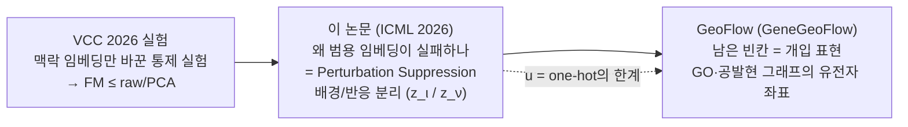
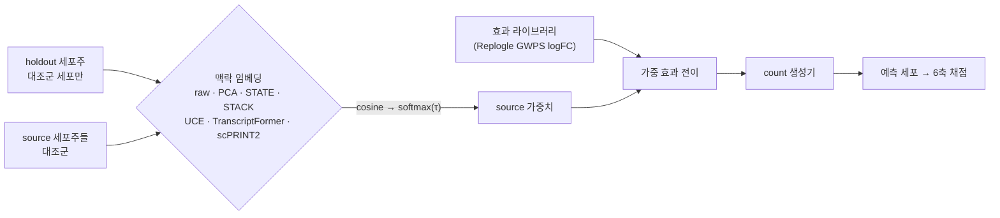
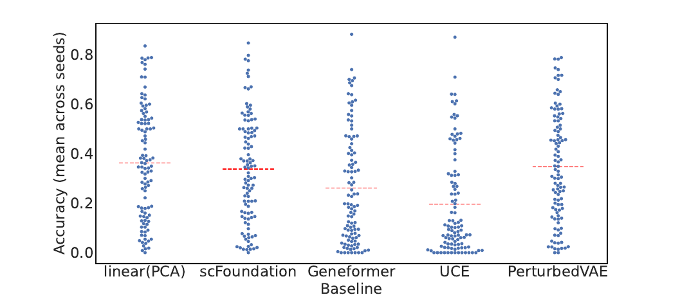
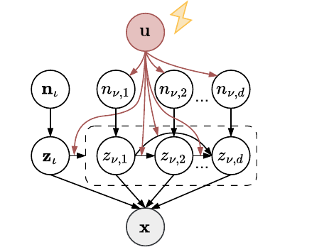
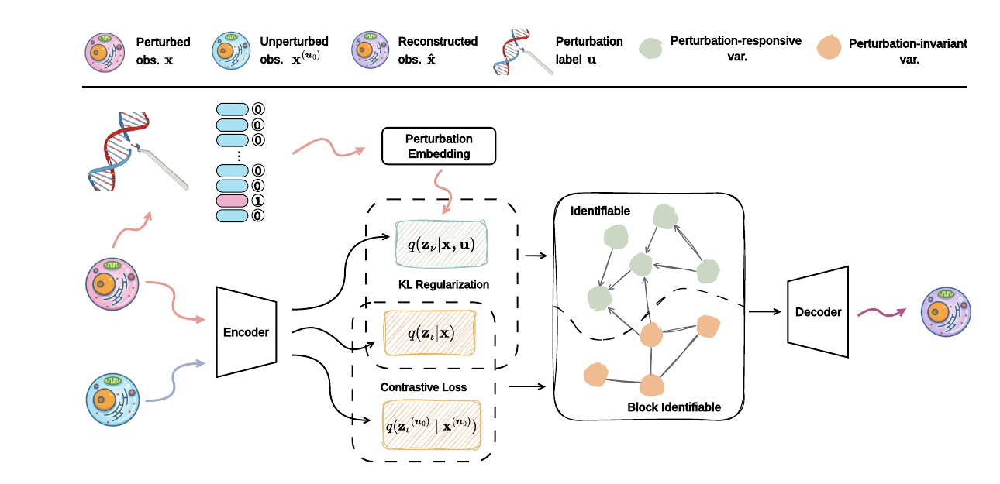
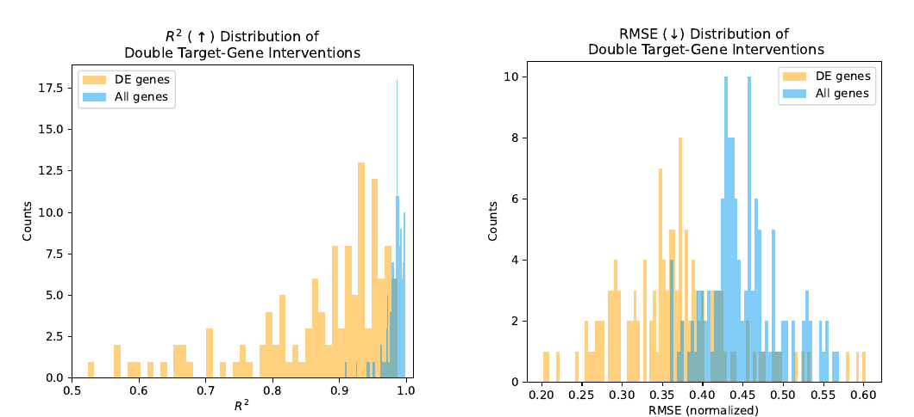
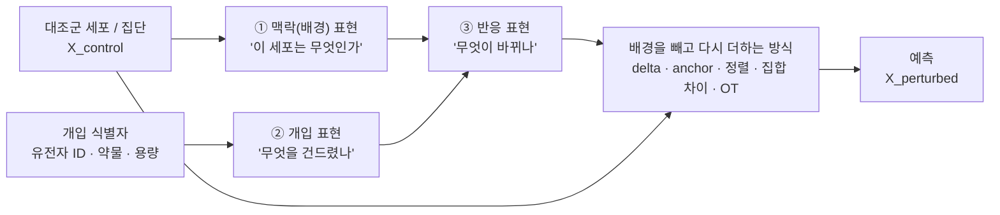
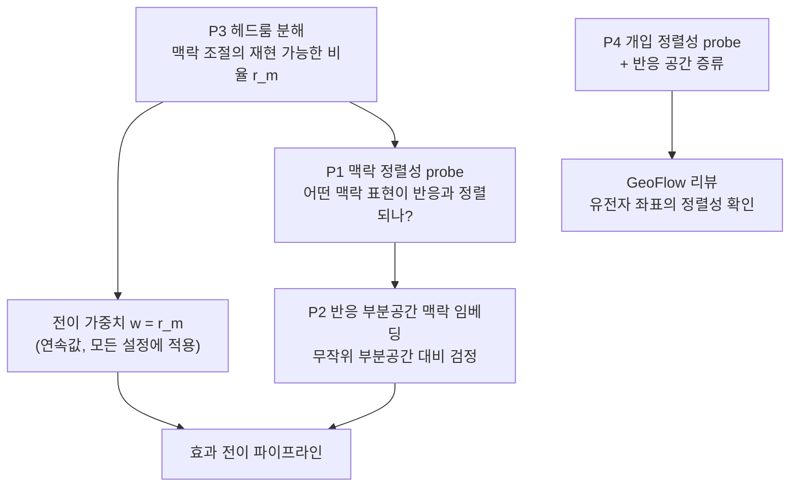
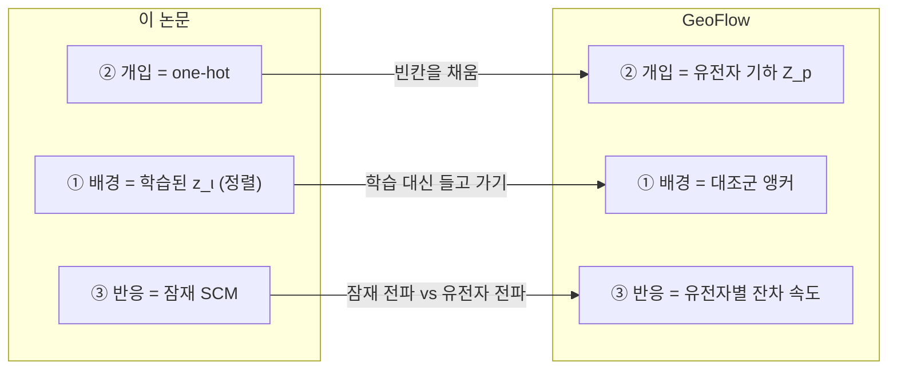

# 임베딩 중심 리뷰 — *What Makes a Representation Good for Single-Cell Perturbation Prediction?* (ICML 2026)

[🏠 Portfolio](https://github.com/heoneyzi) › [📚 Study](../../../README.md) › [🧬 Genomics](../../README.md) › [Season 2 · Functional Genomics 2](../README.md) › [Reviews](README.md)

> ✍️ **강지헌 (me)** · 📅 2026-09-26 (superseded by 01) · 🗂️ Source: local file `FG2_리뷰_What_Makes_a_Representation_Good_임베딩중심.md`
>
> Original file `FG2_리뷰_What_Makes_a_Representation_Good_임베딩중심.md` — the 2026-09-26 edition, superseded by [01](01_what_makes_a_representation_good.md).

---

### VCC 2025·2026 실험과 FG2 세션에서 다룬 모델을 한 좌표계에 놓고 읽기, 그리고 다음 리뷰 GeoFlow로

> **작성일** 2026-09-26 · **대상** Functional Genomics 2 (FG2) 세션
> **앞선 흐름** FG 개요 1–3 → VCC 2025 정리 → VCC 2026 frozen-baseline 실험
> **다음 리뷰** GeoFlow = GeneGeoFlow (*Control-Anchored Residual Flow Matching Conditioned on Gene Geometry*, arXiv 2608.06824)
> **논문** Jiang, Liu, Cai, Gao, Dong, Abbasnejad, Yao, Shi. ICML 2026 (PMLR 306), arXiv [2605.19343](https://arxiv.org/abs/2605.19343)

---

## 0. 한 페이지 요약

### 0.1 논문을 한 문장으로

> 섭동(perturbation) 데이터에서는 **섭동과 무관한 배경 신호가 발현 변동의 대부분을 차지하고 섭동 신호는 희소**하다. 그래서 배경과 섭동 신호를 명시적으로 분리하지 않은 표현은 두 신호를 섞어 버리거나(인과 표현 학습 계열), 섭동 신호를 눌러 버린다(foundation model 계열). 저자들은 배경 블록 $z_\iota$와 반응 블록 $z_\nu$를 나누고, 대조군 세포와의 정렬(alignment)로 배경을 $z_\iota$에 고정한 뒤, $z_\nu$를 섭동 라벨 $u$가 바꾸는 잠재 인과 모델로 조직하는 **PerturbedVAE**를 제안한다.

### 0.2 이 리뷰의 주장 — "임베딩이 중요하다"를 더 정확하게

FG2 세션과 VCC 실험을 거치며 얻은 결론은 "임베딩이 중요하다"였다. 이 논문을 거치면 그 문장을 세 개로 쪼갤 수 있다.

1. **섭동 예측 모델은 성격이 다른 표현 세 가지를 필요로 한다.** 이 세포가 무엇인지(**맥락 표현**), 무엇을 건드렸는지(**개입 표현**), 무엇이 바뀌는지(**반응 표현**)다. 우리가 본 실패 대부분은 이 셋을 하나의 범용 임베딩에 맡긴 데서 나왔다.
2. **좋은 표현의 기준은 "정보가 많은가"가 아니라 "기하 구조가 반응과 정렬되어 있는가"다.** 범용 세포 임베딩은 배경(세포 정체성)의 유사도를 잰다. 반응을 옮겨 오려면 반응의 유사도가 필요하다. 우리 VCC 실험에서 FM 임베딩이 raw·PCA를 안정적으로 넘지 못한 이유를 이 논문의 가설이 그대로 설명한다.
3. **이 논문은 세 표현 중 두 개(맥락과 반응)의 분리를 이론과 실험으로 정식화했고, 개입 표현은 one-hot으로 남겨 두었다.** 저자 스스로 미관측 유전자는 다룰 수 없다고 인정한다(부록 B). 그 빈칸을 유전자 기하(gene geometry)로 채우는 논문이 다음 리뷰 GeoFlow다.

### 0.3 핵심 takeaway 다섯 개

| # | 내용 | 근거 위치 |
|---|---|---|
| 1 | 선형 probing에서 FM 표현은 PCA보다 섭동 라벨을 덜 읽어낸다(PCA ≈ 0.36, scFoundation ≈ 0.34, Geneformer ≈ 0.26, UCE ≈ 0.20; 그림에서 읽은 근삿값). PerturbedVAE도 PCA와 같은 수준(≈ 0.35)이지 PCA를 넘지는 않는다 | §3.3 |
| 2 | 우리 VCC 실험(맥락 표현만 바꾼 통제 실험)의 결론인 "점수는 효과 라이브러리가 만들고 임베딩의 추가 기여는 작고 불안정하다"는 이 논문의 가설과 같은 현상을 다른 각도에서 본 것이다 | §1.2, §3.5 |
| 3 | PerturbedVAE의 구조방정식은 VCC 문제의 분해 $\Delta(c,g)=\Delta_\text{shared}(g)+\Delta_\text{context}(c,g)$와 항 단위로 대응한다. $\mu_\nu(u)$는 공유 효과, $\Lambda_{\nu\iota}(u)\,z_\iota$는 맥락 조절 항이다 | §4.2 |
| 4 | 평가는 이 논문의 약점이다. 전 유전자 $R^2$는 거의 모든 방법이 0.97–0.99로 천장에 붙어 있고, 효과 방향 지표(Delta Pearson)에서는 단순 additive(0.908)가 PerturbedVAE(0.687)를 크게 앞선다 | §6.4, §7 |
| 5 | 이 논문에서 곧바로 나오는, 우리 코드와 데이터로 할 수 있는 실험이 있다. 임베딩의 **반응 정렬성**을 직접 재는 probe(정확 순열검정)와 반응 부분공간 위의 맥락 임베딩이다 | §9, §10 |

---

## 목차

1. [출발점 — 우리가 이미 본 것](#1-출발점--우리가-이미-본-것)
2. [논문 기본 정보와 읽는 관점](#2-논문-기본-정보와-읽는-관점)
3. [핵심 가설 — Perturbation Suppression](#3-핵심-가설--perturbation-suppression)
4. [방법 — PerturbedVAE를 세 가지 표현으로 해부](#4-방법--perturbedvae를-세-가지-표현으로-해부)
5. [이론 — 식별가능성 (Theorem 1)](#5-이론--식별가능성-theorem-1)
6. [실험 — 정확한 수치와 읽는 법](#6-실험--정확한-수치와-읽는-법)
7. [비판적 검토](#7-비판적-검토)
8. [넓은 비교 — 우리가 다룬 모델을 한 좌표계에](#8-넓은-비교--우리가-다룬-모델을-한-좌표계에)
9. [종합 — 좋은 표현의 조건은 반응 정렬성이다](#9-종합--좋은-표현의-조건은-반응-정렬성이다)
10. [제안 — 우리 코드와 데이터로 할 수 있는 실험 네 개](#10-제안--우리-코드와-데이터로-할-수-있는-실험-네-개)
11. [다음 리뷰 GeoFlow로 가는 다리](#11-다음-리뷰-geoflow로-가는-다리)
12. [발표용 압축본과 예상 질문](#12-발표용-압축본과-예상-질문)
- [부록 A. 용어 사전](#부록-a-용어-사전) · [부록 B. 수치 출처](#부록-b-수치-출처) · [부록 C. 참고문헌](#부록-c-참고문헌)

---

## 1. 출발점 — 우리가 이미 본 것

이 논문은 따로 떨어진 한 편이 아니다. FG2에서 다섯 주 동안 다룬 모델과 VCC 실험이 이미 같은 질문을 던지고 있었다. 이 절은 그 질문이 어떻게 좁혀졌는지를 정리한다.

### 1.1 FG2 세션이 남긴, 표현(representation)에 관한 관찰

| 주차 (날짜) | 발표 / 주제 | 표현 관점에서 남은 것 |
|---|---|---|
| 1주차 (07-28) | Lab in the Loop 개요, **PhenoCompass**, **TranscriptFormer** | PhenoCompass는 세포 이미지와 화합물 구조를 한 임베딩 공간에 정렬한다. **정렬 목적이 표현의 기하를 정한다**는 사례다. TranscriptFormer는 ESM2 유전자 임베딩과 발현량 가중 attention을 쓰는데, 세포 임베딩 공간에서 **세포 타입이 분산의 95% 이상을 설명**했다(팀 노트). 배경 정보가 임베딩을 지배하는 전형적인 모습이다. 제로샷 섭동 예측은 불가능하다는 한계도 논의됐다 |
| 2주차 (08-04) | **Current Gap in Genomic FM** | 단순 PCA 파이프라인(SC-TOP)이 FM과 대등하거나 더 낫다. FM은 사실상 probe를 붙여 쓰는 feature extractor다. GEARS처럼 데이터에 맞는 귀납 편향이 규모보다 효과적이다. **"PCA baseline을 항상 먼저 돌려라"** |
| 3주차 (08-08) | <b>CMonge</b> (Conditional Monge Gap, *Nat. Mach. Intell.* 2026; 팀 노트의 'SIMMONS') | 조건(약물) 임베딩을 <b>화학 구조(RDKit)</b>로 만들지 <b>반응에서 유도한 MoA 임베딩</b>으로 만들지에 따라 미관측 약물 일반화가 달라진다. 반응 유래 임베딩이 가장 잘 일반화했다(노트의 'MOE'는 MoA). 조합은 DeepSets 평균 풀링으로 처리한다 |
| 4주차 (08-15) | **VCC 2025 정리**, **PRiMeFlow** | latent로 압축하면 세부 차이가 사라진다는 문제의식에서 PRiMeFlow는 **전체 발현 공간에서 flow matching**을 한다. 2위 팀은 **ESM2 유전자 임베딩과 delta 예측**을 썼다. PDS 비판 논문은 크기 비교가 아니라 방향(cosine) 비교가 맞다고 주장했다 |
| 5주차 (08-22) | **VCC 2026 1차 회의** | 2026은 새 세포주의 **대조군만 주어지는** zero-shot 문제라 **맥락 인코더**의 중요도가 커졌다. GEARS, STATE, DepMap 활용 아이디어가 나왔다 |
| 이후 (09월) | **scDFM · GeneGeoFlow · SCALE** 발표 준비 | 세 flow 계열 모델 모두 **대조군을 기준으로 변화량을 다룬다.** GeneGeoFlow에서는 유전자 좌표를 뒤섞기만 해도 Pearson Δ가 0.8153에서 0.4387로 떨어졌다 |

### 1.2 VCC 2026 frozen-baseline 실험 — "임베딩 하나만 바꾼" 통제 실험

우리 VCC 실험은 사실상 **맥락 임베딩 비교 연구**였다. 설계의 핵심은 모든 행이 같은 것을 쓰고 **"어느 source 세포주가 holdout과 닮았는가"를 재는 임베딩 공간 하나만** 바꾼 데 있다. 같은 것은 Replogle GWPS 효과 라이브러리, 멀티노미얼 생성기, seed, 세포 수, `cell-eval2==0.16.0`의 `vcc2026` 6축 채점기다.

**Jiang24 (IFNG, BxPC3 holdout: 처음 보는 세포주, `gwps_weighted`, τ=0.1, seed 2026, 표적당 50세포)**

| 표현 | PDS | NMAE | fidelity | reach | Jaccard | **Overall** |
|---|---:|---:|---:|---:|---:|---:|
| scPRINT2 | 0.221 | −2.508 | 0.310 | −0.218 | **−2.363** | **−0.760** |
| PCA | 0.224 | −1.447 | 0.626 | 0.032 | −4.999 | −0.927 |
| raw | **0.390** | −1.881 | 0.567 | 0.029 | −4.981 | −0.979 |
| *raw / no_effect* | −0.098 | −1.287 | 0.590 | −0.336 | −6.929 | *−1.343* |
| UCE | 0.257 | −1.589 | 0.542 | 0.027 | −7.522 | −1.381 |
| TranscriptFormer | 0.188 | −0.751 | 0.674 | −0.175 | −8.498 | −1.427 |
| STATE | 0.112 | −1.128 | 0.599 | −0.027 | −8.404 | −1.475 |
| STACK | 0.149 | **−0.723** | **0.735** | −0.271 | −10.110 | −1.703 |

(MSE 축은 정규화 후 전 행 0이라 표에서 뺐다. 모든 값은 외부 데이터에 공개 채점기를 돌린 dataset-local 점수이며, 챌린지 공식 점수가 아니다.)

**GSE270828 (rep3 holdout: 새 배치)** 에서는 PCA가 1위(Overall 0.753)였고 frozen 인코더는 모두 그 아래였다(UCE 0.737 … STACK 0.556). **strict Replogle-only** 보조 실험(Jiang24 표적 가운데 Replogle K562·RPE1 두 source 모두에 있는 8개)에서는 raw가 1위(−0.145)였고 frozen은 모두 그 아래였다(scPRINT2 −0.182 … TranscriptFormer −0.253).

이 실험에서 나온 결론은 세 가지였다.

1. **점수를 만드는 것은 효과 라이브러리(통계)다.** no_effect에서 GWPS 전이로 가는 도약이 가장 크고 확실하다(Jiang24 −1.343 → −0.98 ~ −0.76).
2. **임베딩의 추가 기여는 작고 조건에 따라 뒤집힌다.** Jiang24에서 scPRINT2의 1위는 Jaccard 한 축에서만 나왔고, τ나 seed를 바꾸면 사라졌다(다섯 τ에서 winner가 모두 달랐고, 네 seed 모두에서 winner를 지킨 표현이 없었다).
3. **표현들이 두 진영으로 갈렸다.** raw·PCA·UCE·TranscriptFormer는 BxPC3가 **A549**를 닮았다고 봤고, scPRINT2·STATE·STACK은 **HT29**를 닮았다고 봤다. 같은 라이브러리와 생성기를 쓰는데도 "어느 세포주가 가까운가"에 대한 판단이 달라 점수가 갈린 것이다.

팀원들의 병행 작업도 같은 방향을 가리켰다.

| 팀원 작업 | 관찰 |
|---|---|
| DipMind / KIMCHI (정유민) | 대형 모델 학습(STATE)은 학습 데이터가 0인 과제에서 실패했다. 300개 표적 중 **272개가 Replogle K562 GWPS에 이미 측정**되어 있었고, 오라클 분해에서 점수의 **0.50은 source/평균 반응, 0.21만 생성 품질**에서 나왔다. validation 리더보드 30위/181팀(Overall +0.0876) |
| CCLE & Chronos 라우팅 (김민석) | 대조군 profile을 CCLE 약 1,400개 세포주와 상관시켜 "K562와 RPE1 중 어디에 가까운가"를 추정했다. 내부 검증에서는 좋았지만 **실제 리더보드에서는 판별 지표의 부호까지 반대**로 나왔고, 뚜렷한 버그는 찾지 못했다 |
| STACK 추론 (김서진) | 3090에서 공식 checkpoint로 추론을 확인했다. DE 유전자를 실제보다 **많이 예측**하는 경향이 있었다. 효과 없는 대조군 baseline의 공식 Overall은 −0.312였다 |

### 1.3 그래서 남은 질문

> **비싼 범용 임베딩이 섭동 문제에서는 왜 raw나 PCA를 안정적으로 넘지 못하는가? 그렇다면 섭동 예측에 좋은 표현은 어떤 조건을 갖춰야 하는가?**

이 논문이 던지는 질문이 정확히 이것이다. 제목 그대로 *What makes a representation good for single-cell perturbation prediction?* 이다.

---

## 2. 논문 기본 정보와 읽는 관점

| 항목 | 내용 |
|---|---|
| 제목 | *What Makes a Representation Good for Single-Cell Perturbation Prediction?* |
| 학회 | ICML 2026 (PMLR 306, 서울), arXiv 2605.19343 v1 (2026-05-19) |
| 저자 | Wenkang Jiang, **Yuhang Liu(교신)**, Yichao Cai, Erdun Gao, Jiayi Dong, Ehsan Abbasnejad, Lina Yao, Javen Qinfeng Shi |
| 소속 | Adelaide 대학 AIML 중심, Responsible AI Research Centre, Fudan, Monash, UNSW/CSIRO |
| 분량 | 본문 9쪽, 부록 A–N 23쪽 (PDF 전체 36쪽) |
| 모델 종류 | **VAE + 잠재 인과 모델**. flow matching 모델이 아니다 |
| 주 데이터 | Norman 2019 (K562, CRISPRa), 보조로 Replogle 2022 |

**기여 세 가지 (저자 주장)**

1. Perturbation Suppression Hypothesis와 perturbation-aware representation이라는 관점을 제시한다. 이를 구현한 일반 프레임워크가 PerturbedVAE다(논문 3장).
2. 희소한 섭동 효과를 믿을 만하게 복원할 수 있는 조건을 **식별가능성(identifiability) 분석**으로 제시한다(논문 4장).
3. 여러 설정에서 강한 baseline을 넘고, 특히 **미관측 조합(이중 섭동) OOD 예측**에서 이득이 크다고 보고한다(논문 5장).

**읽는 관점.** 교신저자 그룹은 인과 표현 학습(causal representation learning, CRL)의 식별가능성 이론을 연구해 온 곳이다. 그래서 이론은 탄탄하고, 생물학적 검증과 평가 지표 설계는 상대적으로 얇다. 이 점을 알고 읽으면 강점(§4–5)과 약점(§6–7)이 동시에 보인다. 이 리뷰는 flow matching 모델이 아닌 이 논문을 **세 flow 모델(scDFM·GeneGeoFlow·SCALE)과 VCC 결과를 하나로 묶는 이론적 렌즈**로 쓴다.

---

## 3. 핵심 가설 — Perturbation Suppression

### 3.1 데이터의 비대칭: 부분 개입(partial intervention)

저자들이 출발점으로 삼는 관찰은 단순하다. 실험·환경·비용의 제약 때문에 **섭동 신호는 발현 공간의 작은 부분만 차지**한다. Norman 데이터를 예로 들면 서로 다른 섭동은 약 284개인데, 측정된 유전자는 약 19,264개다(서론의 예시이며, 실제 실험은 5,000개 유전자를 쓴다; §6.2).

이것을 인과 표현 학습의 언어로 옮기면 **부분 개입**이다.

- 기존 식별가능성 이론 대부분은 **모든 잠재 인과 변수가 어떤 환경에서든 한 번은 개입된다**고 가정한다(Zhang et al. 2023, Lopez et al. 2022, de la Fuente et al. 2025 등).
- 실제 Perturb-seq는 **극히 일부 유전자만** 건드리고, 대부분의 유전자(와 그것을 지배하는 잠재 변수)는 모든 조건에서 그대로다.

이 불일치 때문에 불변 배경 정보가 '섭동 관련' 표현으로 흘러들어가고, 그 위에 세운 인과 모델도 부정확해진다는 것이 저자들의 진단이다.

### 3.2 가설과 두 가지 실패 모드

> **Perturbation Suppression Hypothesis.** 불변 변동이 데이터를 지배할 때, 불변 정보와 섭동 특이 정보를 명시적으로 분리하지 않는 접근은 체계적으로 실패한다.

| 계열 | 실패 방식 | 결과 |
|---|---|---|
| 인과 표현 학습 (Discrepancy-VAE, sVAE+, SAMS-VAE, SENA) | **얽힘(entanglement)**: 배경이 '섭동 관련' 잠재 변수에 섞여 들어간다 | 인과 변수의 의미가 오염되고, 그 위에 세운 인과 구조가 일반화하지 못한다 |
| Foundation model (UCE, scFoundation, Geneformer 등) | **억제(suppression)**: 전체 분포를 맞추는 목적이 지배적인 배경 구조에 표현 용량을 몰아준다 | 희소한 섭동 신호가 표현에서 잘 읽히지 않는다 |

> **비유.** 오케스트라 녹음에서 트라이앵글 한 번(섭동 신호)을 찾는 상황이다. 녹음 전체를 잘 압축하도록 학습한 코덱(FM)은 현악기(배경)를 충실히 보존하지만 트라이앵글은 뭉개 버린다. 압축 품질 점수는 높아도 트라이앵글을 찾는 데는 쓸모가 없다.

### 3.3 진단 실험 — Figure 1, 선형 probing

**설정.** 각 모델의 **표현을 고정(frozen)** 한 채 섭동 조건 $u$를 대리 라벨(surrogate label)로 삼아 선형 분류기를 학습하고 정확도를 잰다. "정보가 꺼내 쓸 수 있는 형태로 들어 있는가"를 보는 표준 진단이다. 비교 대상은 원 발현에 바로 적용한 **PCA**, **scFoundation**, **Geneformer**, **UCE**, 그리고 **PerturbedVAE**다.

*출처: Jiang et al., ICML 2026, Figure 1. y축은 seed 평균 정확도이고, 점 하나는 섭동 조건 하나로 보인다(논문에 명시되지 않음). 빨간 점선이 평균이다.*

| 표현 | 평균 정확도 (그림에서 읽은 근삿값, ±0.01) |
|---|---:|
| PCA (원 발현) | ≈ 0.36 |
| **PerturbedVAE** | ≈ 0.35 |
| scFoundation | ≈ 0.34 |
| Geneformer | ≈ 0.26 |
| UCE | ≈ 0.20 |

**저자 해석.** PCA는 관측된 발현에 바로 적용된다. 그런데 FM 표현이 PCA보다 못하다면, 섭동 정보는 **데이터에 존재하지만 범용 FM 목적함수로 인코딩된 뒤에는 덜 접근 가능해진다**는 뜻이다.

그림을 직접 보면 본문 요약에서는 잘 드러나지 않는 점이 세 가지 있다.

1. **PerturbedVAE는 PCA를 넘지 않는다.** 저자 표현도 "competitive"다. 진단 실험이 보여주는 것은 "FM < PCA"이지 "PerturbedVAE > PCA"가 아니다.
2. **FM끼리 차이가 크다.** scFoundation은 PCA와 거의 같고, Geneformer와 UCE가 크게 떨어진다. UCE는 정확도가 0 근처인 섭동 조건이 많다.
3. **모든 표현이 무작위 수준보다는 훨씬 높다.** 105개 클래스 분류라면 무작위 정확도는 약 1%다. 정보가 **사라진 것이 아니라 선형으로 꺼내기 어려워진 것**이다.

### 3.4 [해석] FM 사이의 순서는 "발현량을 얼마나 버리는가"와 맞물린다

논문은 FM 사이의 차이를 설명하지 않는다. 각 모델이 발현을 어떻게 입력받고 무엇을 목적으로 학습하는지 나란히 놓으면 순서가 설명된다. 아래 해석은 이 리뷰의 것이며, 논문의 주장이 아니다.

| 표현 | 발현량을 넣는 방식 | 유전자 토큰 | 사전학습 목적 | Fig. 1 |
|---|---|---|---|---:|
| PCA | 연속값 그대로 선형 투영 | — | 분산 최대화 | ≈ 0.36 |
| scFoundation | 연속값 임베딩(이산화 없음), read-depth-aware | 학습된 유전자 임베딩 | 가려진 **발현값 회귀** | ≈ 0.34 |
| Geneformer | **순위**(rank value encoding): 발현 순서대로 유전자 토큰을 나열 | 학습된 유전자 토큰 | 가려진 **유전자 토큰 예측** | ≈ 0.26 |
| UCE | 발현량에 비례해 유전자 1,024개를 복원추출한 **'bag of RNA'**. 크기는 추출 빈도로만 반영된다 | ESM2 단백질 임베딩 | 유전자가 **발현되었는지(이진)** 예측. 종을 넘나드는 세포 정체성 표현이 목표 | ≈ 0.20 |

**관찰.** 발현량(크기) 정보를 직접 보존하고 그것을 목적함수로 맞추는 모델일수록 PCA에 가깝다. 크기를 순위나 추출 빈도로 바꾸고 목적함수도 크기를 맞추지 않는 모델일수록 떨어진다. Norman의 CRISPRa는 **일부 유전자의 발현 크기를 바꾸는** 개입이다. 크기를 버리는 인코딩은 그 신호부터 버리게 된다. UCE는 여기에 더해 목적 자체가 종과 데이터셋을 넘나드는 **세포 정체성**, 즉 섭동과 무관한 정보를 표현하는 것이다.

이 해석은 지난번에 본 *Rank or Value?* 연구(시퀀싱 깊이가 줄 때 value 인코딩이 rank 인코딩보다 robust했다)와 같은 방향이다. 검증 방법도 분명하다. 각 임베딩에서 **섭동에 반응하는 유전자(상위 DE 유전자)의 log-발현을 선형으로 얼마나 복원할 수 있는지**를 재면, 그 값이 probe 정확도의 순서를 예측해야 한다.

### 3.5 [연결] 우리 VCC 결과를 같은 가설로 다시 읽기 — "배경 유사도 ≠ 반응 유사도"

이 리뷰의 중심 연결고리다. 논문의 probe와 우리 VCC 실험은 겉보기에는 다른 질문을 한다.

| | 이 논문의 선형 probe | 우리 VCC 맥락 인코더 |
|---|---|---|
| 묻는 것 | 교란된 세포의 표현에서 $u$(무엇을 건드렸나)를 읽을 수 있는가 | 두 세포주 **대조군**의 표현 유사도가 두 세포주의 **반응** 유사도를 예측하는가 |
| 필요한 것 | 섭동 신호가 표현에 선형으로 남아 있을 것 | 표현의 기하가 **반응을 결정하는 배경 특성**에 정렬되어 있을 것 |
| 결과 | FM ≤ PCA | FM ≤ raw/PCA, 그마저 불안정 |

두 실패의 원인은 같다. **표현의 기하가 데이터의 지배적인 축, 즉 섭동과 무관한 축(세포 계통, 증식, 대사)을 따라 짜여 있다.** 범용 세포 임베딩이 재는 것은 "두 세포주가 얼마나 비슷한 세포인가"이고, 효과를 옮겨 오는 데 필요한 것은 "같은 유전자를 눌렀을 때 두 세포주가 얼마나 비슷하게 반응하는가"다. 둘은 다른 양이다.

이 주장을 받치는 증거는 여러 곳에서 나왔다.

- **SCALE (Replogle 4개 세포주).** 세포주 사이의 발현 차이가 각 세포주 안의 CRISPR 효과보다 훨씬 컸다(SCALE Fig. 2d). 이 논문의 가설이 세포 수준을 넘어 **맥락 수준에서도 성립**한다는 직접 증거다.
- **우리 strict 실험.** K562와 RPE1 사이 효과 전이의 cosine이 약 0.11, 부호 일치율이 약 0.54였다. 같은 유전자를 눌러도 두 세포주의 반응은 거의 일치하지 않는다. 배경 유사도로 source를 고르는 방식은 옮길 신호 자체가 약하다.
- **두 진영(A549 대 HT29).** 임베딩마다 "가까운 세포주"에 대한 판단이 갈렸다. 배경 유사도는 모델마다 정의가 다르고, 어느 쪽도 반응에 맞춰 학습되지 않았다.
- **CCLE 라우팅의 실패.** 대조군과 CCLE 세포주 사이의 상관도 결국 배경 유사도다. 내부 검증과 실제 채점이 부호까지 어긋난 것은 이 신호가 반응 유사도의 대리 지표로 불안정하다는 뜻으로 읽힌다.

> **정리.** 이 논문의 가설을 "한 데이터셋 안의 세포"에서 "데이터셋을 넘나드는 맥락"으로 끌어올리면, 우리 VCC 결과가 그대로 예측된다. 범용 임베딩이 PCA를 못 넘는 것은 모델이 작아서가 아니라 **재는 유사도의 종류가 과제와 맞지 않기 때문**이다.

---

## 4. 방법 — PerturbedVAE를 세 가지 표현으로 해부

저자들은 좋은 표현이 해야 할 일을 두 가지로 정리한다.

- **Extraction(추출)**: 섭동 특이 정보를 지배적인 불변 정보로부터 명시적으로 분리한다.
- **Utilization(활용)**: 추출한 정보를 미관측·조합 섭동으로의 일반화와 해석을 지원하는 형태, 즉 **인과 구조**로 조직한다.

PerturbedVAE는 이 두 원칙을 구현한 프레임워크다. 논문 3장의 제목이 *A Heuristic Framework*인 데서 알 수 있듯, 먼저 구현에 묶이지 않은 개념 틀로 제시하고 4장의 이론으로 구체적인 형태를 정당화하는 순서를 밟는다.

### 4.1 생성 모델

*출처: 논문 Figure 2. $u$에서 나온 화살표가 반응 변수의 잡음($n_{\nu,i}$), 반응 변수 사이의 간선, 그리고 $z_\iota \to z_\nu$ 간선으로 들어간다. $z_\iota$로는 들어가지 않는다.*

| 기호 | 의미 |
|---|---|
| $x$ | 관측된 발현 벡터 (실험에서는 5,000차원) |
| $u$ | 섭동 라벨. 단일 섭동은 one-hot, 이중 섭동은 two-hot. 생화학적 메커니즘은 모르고 **어떤 조건이 적용됐는지만** 안다 |
| $z_\iota \in \mathbb R^{d_\iota}$ | **섭동 불변 변수**. 모든 세포가 공유하는 배경 프로그램 |
| $z_\nu \in \mathbb R^{d_\nu}$ | **섭동 반응 변수**. 섭동에 따라 값이 바뀌고 내부에 DAG 인과 구조가 있다 |
| $n_\iota, n_\nu$ | 각 잠재 변수의 외생 잡음 |

사전분포는 다음처럼 분해된다(Eq. 1).

$$
p(z_\nu, z_\iota \mid u) = p(z_\nu \mid u, z_\iota)\; p(z_\iota)
$$

$z_\iota$는 섭동과 독립이고, $z_\nu$는 섭동 $u$와 배경 상태 $z_\iota$ 둘 다에 의존한다.

### 4.2 구조방정식과 VCC 분해의 대응 ★

이론 분석을 위해 저자들은 생성 과정을 선형 구조방정식으로 파라미터화한다(Eq. 6–9).

$$
\begin{aligned}
z_\iota &:= \lambda_{\iota\iota}\, z_\iota + n_\iota, && n_\iota \sim \mathcal N(\mu_\iota, \operatorname{diag}\beta_\iota) \\
z_\nu &:= \lambda_{\nu\iota}(u)\, z_\iota + \lambda_{\nu\nu}(u)\, z_\nu + n_\nu, && n_\nu \sim \mathcal N(\mu_\nu(u), \operatorname{diag}\beta_\nu(u)) \\
x &:= g(z), && z = (z_\iota, z_\nu)
\end{aligned}
$$

λ 행렬은 **엄격한 하삼각**이다. 각 변수가 자기보다 앞 순서의 변수만 부모로 가지므로 순환이 없다(DAG). 섭동 $u$가 바꾸는 것은 반응 쪽의 인과 메커니즘 $\lambda_{\nu\iota}(u)$, $\lambda_{\nu\nu}(u)$, $\mu_\nu(u)$, $\beta_\nu(u)$뿐이고, $z_\iota$의 방정식에는 $u$가 없다.

반응 변수의 방정식을 풀어 기댓값을 취하면 다음을 얻는다. 여기서 $A(u) = I - \Lambda_{\nu\nu}(u)$다.

$$
\mathbb E[z_\nu \mid z_\iota, u]
= \underbrace{A(u)^{-1}\mu_\nu(u)}_{\text{배경과 무관한 공유 효과}}
+ \underbrace{A(u)^{-1}\Lambda_{\nu\iota}(u)\, z_\iota}_{\text{배경에 따라 달라지는 조절}}
$$

이 식을 VCC 2026 해설 문서에서 세웠던 분해와 나란히 놓으면 항 단위로 맞아떨어진다.

$$
\Delta(c,g) = \Delta_\text{shared}(g) + \Delta_\text{context}(c,g)
$$

| PerturbedVAE 항 | 의미 | VCC 분해 | 우리 VCC 파이프라인에서 | 다른 논문에서 |
|---|---|---|---|---|
| $A(u)^{-1}\mu_\nu(u)$ | 배경과 무관한 평균 효과 | $\Delta_\text{shared}(g)$ | **GWPS 효과 라이브러리** (K562·RPE1 logFC) | SCALE의 shared-response PCC |
| $A(u)^{-1}\Lambda_{\nu\iota}(u)\,z_\iota$ | 배경 상태에 따라 달라지는 효과 | $\Delta_\text{context}(c,g)$ | **맥락 임베딩으로 source를 고르고 섞는 단계** | SCALE의 context-modulation PCC |
| $A(u)^{-1} = (I-\Lambda_{\nu\nu}(u))^{-1}$ | 반응 프로그램 사이의 전파(하류 연쇄) | 명시적 항 없음 | 없음 | GEARS 그래프 전파, GeneGeoFlow-Prop |
| $z_\iota$ | 배경 프로그램 | 대조군 profile $X^{(c)}_\text{control}$ | holdout 대조군 pseudobulk | SCALE의 $Z_0$, GeneGeoFlow의 anchor $x^c$ |

이 대응에서 두 가지를 읽을 수 있다.

1. **우리 VCC 실험은 두 번째 항의 추정을 시험한 것이었다.** 첫 번째 항(공유 효과)은 GWPS 라이브러리가 이미 강하게 주고 있었고, 맥락 임베딩이 맡은 것은 두 번째 항이었다. 그 항에서 이득이 작고 불안정했다는 것이 §1.2의 결론이다.
2. **이 논문의 두 번째 항은 세포주 하나 안의 조절이다.** Norman은 K562 하나뿐이므로 $z_\iota$가 담는 것은 세포주 **안**의 세포 간 이질성(세포주기, 크기 등)이다. VCC가 요구하는 것은 세포주 **사이**의 조절이다. 형식은 같지만, 이 논문은 맥락을 넘는 전이를 한 번도 시험하지 않았다(§7 C1).

### 4.3 추론 모델의 비대칭

사후분포는 다음처럼 근사한다(Eq. 2).

$$
q(z_\nu, z_\iota \mid x, u) = q(z_\nu \mid x, u)\; q(z_\iota \mid x)
$$

- $z_\iota$는 **발현 $x$만 보고** 추론한다. 그래서 테스트 때 대조군 세포만으로 배경을 얻을 수 있다.
- $z_\nu$는 **$x$와 $u$를 함께 보고** 추론한다. 반응 표현에는 라벨이 입력으로 들어간다는 뜻이다. 이 점은 §7 A3(probe의 순환성)에서 다시 중요해진다.

### 4.4 ELBO와 사전분포

학습은 조건부 우도 $\log p(x \mid u)$의 하한(ELBO)을 최대화한다. 부록 G의 구현은 β-VAE 형태다(Eq. 54).

$$
\mathcal L_\text{ELBO}
= \mathbb E_q\big[\log p(x \mid z_\nu, z_\iota)\big]
- \beta_\nu\, D_\text{KL}\big(q(z_\nu \mid x,u)\,\|\,p(z_\nu \mid u, z_\iota)\big)
- \beta_\iota\, D_\text{KL}\big(q(z_\iota \mid x)\,\|\,\mathcal N(0,I)\big)
$$

- **배경 사전분포** $p(z_\iota) = \mathcal N(0, I)$. 이론상 $z_\iota$는 블록 단위로만 식별되면 되므로(§5) 구조 제약 없이 단순하게 둔다.
- **반응 사전분포**는 SCM에서 유도된 가우시안이다(Eq. 59).

$$
p(z_\nu \mid u, z_\iota) = \mathcal N\!\Big(A(u)^{-1}\big(\Lambda_{\nu\iota}(u) z_\iota + \mu_\nu(u)\big),\; A(u)^{-1}\operatorname{diag}(\beta_\nu(u))\,A(u)^{-\top}\Big)
$$

실제 구현은 역행렬 대신 삼각 선형계를 풀어서 DAG 제약을 자연스럽게 지킨다. 반응 사후분포는 DAG 순서를 따르는 autoregressive 가우시안이다(Eq. 61–62).

### 4.5 Contrastive alignment — 추출(extraction)을 담당하는 장치

**문제.** ELBO만으로는 가설이 해결되지 않는다. 배경이 지배적이면 배경만 잘 모델링해도 재구성의 대부분을 달성할 수 있으므로, $z_\nu$가 덜 복원되고 섭동 신호가 버려진다.

**해결.** 교란 세포 $(x, u)$마다 대조군 세포 $x^{(u_0)}$를 하나 뽑아 둘의 불변 표현이 같아지도록 만든다(Eq. 4). 구현은 사후 평균끼리 비교한다(Algorithm 1, 21행).

$$
\mathcal L_\text{contrast} = \big\| z_\iota - z_\iota^{(u_0)} \big\|_2^2
\qquad(\text{구현: } \|\mu'_{\iota,1} - \mu'_{\iota,2}\|_2^2)
$$

**직관.** 배경을 $z_\iota$에 못 박으면 재구성에서 배경을 설명할 책임이 $z_\iota$로 넘어가고, $z_\nu$는 남은 잔차, 즉 섭동이 만든 변화만 담게 된다.

**[분석] 무작위로 짝지은 대조군이 실제로 하는 일.** 논문 서술로는 대조군 세포를 **무작위로** 뽑는다(매칭 방법에 대한 언급이 없다). 교란 세포 $x \sim P$와 대조군 세포 $x' \sim Q$가 독립이면, 불변 인코더의 평균 $f$에 대해 정렬 손실의 기댓값은 정확히 세 항으로 나뉜다.

$$
\mathbb E\,\|f(x) - f(x')\|^2
= \underbrace{\|\mathbb E_P f - \mathbb E_Q f\|^2}_{\text{두 집단의 평균 차이}}
+ \underbrace{\operatorname{tr}\operatorname{Cov}_P(f)}_{\text{교란 집단 내 분산}}
+ \underbrace{\operatorname{tr}\operatorname{Cov}_Q(f)}_{\text{대조군 집단 내 분산}}
$$

첫 항은 의도한 효과(배경 분포 맞추기)다. 나머지 두 항은 **$z_\iota$의 세포 간 변동 자체를 줄이라는** 의도하지 않은 압력이다. $\mathcal N(0,I)$ 사전분포와의 KL도 평균을 0으로 당기므로, $z_\iota$에 세포별 배경 차이를 남기는 힘은 재구성 항 하나뿐이다.

한편 이론(부록 Lemma D.3)은 **같은 배경 잡음 $n_\iota$를 공유하는 쌍**을 전제한다. 같은 세포의 배경 상태를 공유한 반사실적 쌍인데, scRNA-seq는 세포를 파괴하므로 이런 쌍은 관측할 수 없다. K562처럼 균질한 세포주에서는 이 간극의 피해가 작을 수 있다. 하지만 여러 세포 유형이나 세포주가 섞인 데이터에서 무작위로 짝지으면 $z_\iota$가 담아야 할 정체성 정보가 지워진다. **VCC처럼 맥락이 여러 개인 문제에 이 방법을 옮기려면 같은 맥락 안에서 짝을 짓거나, GeneGeoFlow처럼 OT로 짝을 지어야 한다.** 발표에서 다룬 unpaired 문제(scRNA-seq는 같은 세포의 전후를 볼 수 없다)가 이 논문에도 그대로 걸려 있는 셈이다.

### 4.6 최종 목적함수와 학습 알고리즘

$$
\mathcal L = -\mathcal L_\text{ELBO} + \alpha\, \mathcal L_\text{contrast}
$$

*출처: 논문 Figure 3. 교란 세포 $x$는 반응 블록 $z_\nu$(초록, 성분별 식별)를 학습하는 데 쓰이고, 대조군 세포 $x^{(u_0)}$는 불변 블록 $z_\iota$(주황, 블록 식별)의 정렬에 쓰인다.*

| 단계 (Algorithm 1) | 하는 일 |
|---|---|
| 1 | 교란 세포 $x$, 라벨 $u$, 대조군 세포 $x^{(u_0)}$를 뽑는다 |
| 2 | 공유 인코더로 $h_1 = f_\text{enc}(x)$, $h_2 = f_\text{enc}(x^{(u_0)})$ |
| 3 | 반응 사후: $g_\nu(h_1, u) \to (\mu'_\nu, \sigma'_\nu)$ ← **$u$가 입력** |
| 4 | 배경 사후: $g_\iota(h_1)$, $g_\iota(h_2)$ ← $u$를 보지 않음 |
| 5 | 재매개화로 반응 잡음 $\tilde z_\nu$와 배경 $z_\iota^{(1)}, z_\iota^{(2)}$를 샘플링 |
| 6 | $u$로부터 인과 파라미터 생성: $\Lambda_{\nu\nu}(u) \leftarrow f_{\nu\nu}(u)$(엄격 하삼각), $\Lambda_{\nu\iota}(u) \leftarrow f_{\nu\iota}(u)$, $\mu_\nu(u) \leftarrow f_\mu(u)$ |
| 7 | $z_\nu = (I - \Lambda_{\nu\nu}(u))^{-1}\big(\tilde z_\nu + \Lambda_{\nu\iota}(u) z_\iota^{(1)} + \mu_\nu(u)\big)$ (삼각계 풀기) |
| 8 | $\hat x = f_\text{dec}([z_\nu, z_\iota^{(1)}])$ ← **디코더는 $u$를 받지 않는다** |
| 9 | 손실 = 재구성 + $\beta_\nu$·KL$_\nu$ + $\beta_\iota$·KL$_\iota$(교란·대조 양쪽) + $\alpha \lVert \mu'_{\iota,1}-\mu'_{\iota,2} \rVert^2$, 가중치는 annealing |

**설계 포인트.** 디코더가 $u$를 직접 받지 않으므로, 섭동이 출력에 닿는 **유일한 경로가 잠재 인과 메커니즘**이다. 조합 예측을 "원리적"이라고 주장하는 근거가 여기에 있다.

**하이퍼파라미터 (실데이터, 부록 Table 7).** batch 64, 100 epoch, lr 1e-4, $\beta_\nu = \beta_\iota = 10^{-2}$, hidden 256, 총 잠재 차원 $\dim(z) \in \{10, 35, 75, 105\}$, $\alpha = 0.05$. 가장 좋았던 분할은 $(d_\nu, d_\iota) = (20, 85)$로, **배경 블록이 훨씬 크다**(§6.10).

### 4.7 테스트 시 예측과 two-hot 외삽

1. 대조군 세포에서 배경을 얻는다: $z_\iota \sim q(z_\iota \mid x^{(u_0)})$.
2. 교란 세포가 없으므로 사후가 아니라 **사전분포에서** 반응을 만든다: $z_\nu \sim p_\theta(z_\nu \mid z_\iota, u)$.
3. $(z_\iota, z_\nu)$를 디코딩한다.

**이중 섭동 OOD.** 학습은 단일 섭동(one-hot)만으로 하고, 테스트에서는 한 번도 본 적 없는 **two-hot $u$를 그대로** $f_{\nu\nu}, f_{\nu\iota}, f_\mu$에 넣는다. 조합 일반화가 나올 수 있는 곳은 세 군데다. (a) $f(\cdot)$가 two-hot 입력에서 어떻게 외삽하는가, (b) $u$에 대해 비선형인 삼각계 역행렬 $A(u)^{-1}$, (c) 비선형 디코더다. 논문은 $f(\cdot)$의 구조를 명시하지 않고, 조합성이 셋 중 어디서 오는지도 분석하지 않는다.

### 4.8 정리 — PerturbedVAE의 세 표현

| 표현 | PerturbedVAE에서 | 학습 방식 | 한계 |
|---|---|---|---|
| **맥락(배경)** | $z_\iota$ (최적 $d_\iota = 85$) | 대조군 세포와 정렬, $\mathcal N(0,I)$ 사전분포 | 세포주 하나 안의 이질성만 학습. 무작위 쌍 정렬의 분산 수축 압력 |
| **개입** | $u$ (one-hot) → $f_{\nu\nu}, f_{\nu\iota}, f_\mu$ | 조건별 lookup과 사실상 같음 | **미관측 유전자 불가** (저자 인정, 부록 B) |
| **반응** | $z_\nu$ (최적 $d_\nu = 20$), DAG SCM | $u$에 의존하는 선형 가우시안 SCM | 선형 인과 가정, 조합성의 출처 미분석 |

---

## 5. 이론 — 식별가능성 (Theorem 1)

### 5.1 식별가능성은 "임베딩에 이름을 붙여도 되는가"의 문제다

> **질문.** 두 사람이 같은 데이터를 똑같이 잘 설명하는 모델을 각각 학습했을 때, 두 모델의 잠재 변수는 같은 것을 가리키는가?

그렇지 않다면 "이 축은 배경 프로그램이다", "이 블록은 섭동 반응이다" 같은 해석은 의미가 없다. 칵테일 파티 문제에 비유할 수 있다. 여러 목소리가 비선형으로 섞인 녹음을 데이터가 i.i.d.인 상태에서 분리하려 하면, 똑같이 그럴듯한 분리 방법이 무한히 많다(Hyvärinen & Pajunen 1999). 해결책은 <b>보조 변수 $u$<b>다. 환경이 바뀔 때 잠재 변수의 분포가 충분히 다양하게 바뀌면, 가능한 해가 순서를 바꾸거나 단위를 바꾸는 정도의 사소한 변환으로 좁혀진다(iVAE, Khemakhem et al. 2020). 이 논문은 그 틀을 </b>일부 변수만 개입되는</b> 섭동 데이터로 넓힌다.

임베딩 관점에서 말하면, 식별가능성은 **배경 블록과 반응 블록의 분리가 학습 과정의 우연이 아니라 데이터로부터 결정된다**는 보장이다.

### 5.2 가정 네 개 — 의미와 Perturb-seq에서의 타당성

| 가정 | 내용 | 쉬운 뜻 | Perturb-seq에서 |
|---|---|---|---|
| (i) 가역성·매끄러움 | 미지의 비선형 사상 $g$가 매끄럽고 가역 | 잠재에서 관측으로 갈 때 정보가 사라지지 않는다 | 발현 차원(5,000)이 잠재 차원(≤105)보다 훨씬 커서 단사는 그럴듯하다. 다만 dropout·측정 잡음 때문에 정확한 가역성은 성립하지 않는다. 비선형 ICA의 표준 가정이다 |
| (ii) 환경 충분성 | 대조군 $u_0$ 대비 $2d_\nu$개 환경에서 $L^\top = [\Delta\eta(u_1),\dots,\Delta\eta(u_{2d_\nu})]^\top$가 full rank | 섭동들이 반응 변수의 분포를 **서로 다른 방향으로 충분히** 흔들어야 한다 | 아래 설명 |
| (iii) 최적 정렬 | 정렬 손실이 전역 최솟값에 도달해 $f_\iota(x^{(u)}) = f_\iota(x^{(u_0)})$ (a.s.) | 불변 인코더는 교란 세포와 대조군 세포에 같은 값을 준다 | contrastive 손실이 이것을 구현한다. 이론은 **배경 잡음을 공유하는 반사실적 쌍**을 전제한다(§4.5) |
| (iv) 개입 충분성 | 각 반응 변수 $z_i$마다, 모든 부모의 가중치가 $\lambda_{j,i} = 0$이 되는 환경 $u_i$가 있다 | 변수마다 상위 영향이 완전히 끊기는 실험이 하나는 있다(hard intervention과 비슷) | CRISPRa로 유전자를 강제로 켜면 그 유전자는 상위 조절에서 풀려난다는 직관과 맞는다. 다만 가정은 유전자가 아니라 **잠재 변수** 수준이다 |

**(ii) 자세히 보기.** 가우시안 $\mathcal N(\mu, \beta)$를 지수족으로 쓰면 자연 파라미터는 $\eta = (\mu/\beta,\ -1/(2\beta))$다. $\Delta\eta(u)$는 대조군 대비 이 값의 변화다.

$$
\Delta\eta(u) = \begin{pmatrix} \dfrac{\mu_\nu(u)}{\beta_\nu(u)} - \dfrac{\mu_\nu(u_0)}{\beta_\nu(u_0)} \\[2mm] -\dfrac12\Big(\dfrac{1}{\beta_\nu(u)} - \dfrac{1}{\beta_\nu(u_0)}\Big) \end{pmatrix} \in \mathbb R^{2d_\nu}
$$

손잡이가 $d_\nu$개 있고 손잡이마다 평균과 분산 두 값이 있으므로, 이들을 서로 구별하려면 서로 다른 방향으로 흔든 실험이 최소 $2d_\nu$개 필요하다. Norman 설정은 $d_\nu = 20$이므로 40개가 필요한데 단일 섭동은 105개다. **개수 조건은 충족하지만, rank 조건 자체는 검증할 수 없다.**

### 5.3 결론 두 가지

$$
\text{① } z_\nu = P_\nu\, \hat z_\nu + c_\nu \quad (P_\nu:\ \text{순열·스케일 행렬})
\qquad
\text{② } z_\iota = A_\iota\, \hat z_\iota + c_\iota \quad (A_\iota:\ \text{가역 행렬})
$$

- **반응 블록은 성분별로 식별된다.** 학습된 반응 축 하나하나가 실제 반응 변수 하나에 대응한다. 순서와 단위만 임의다. 가장 강한 형태의 식별이다.
- **배경 블록은 블록 단위로 식별된다.** 블록 안의 축은 섞일 수 있지만, 배경이 부분공간으로서 반응과 깨끗이 분리된다는 목적에는 충분하다.

### 5.4 증명의 핵심 — 배경 항이 약분된다

증명(부록 D, F)에서 이 리뷰의 주제와 가장 가까운 것은 두 번째 단계다.

1. **Lemma D.1.** DAG이므로 $I - \Lambda(u)$는 대각이 모두 1인 하삼각 블록 행렬이고 행렬식이 1이다. 잠재 변수와 잡음 사이의 변환 $z \leftrightarrow n$은 부피를 바꾸지 않는 전단사다.
2. **환경 간 비교에서 배경이 사라진다.** 두 파라미터가 같은 $p(x \mid u)$를 낸다고 놓고 환경 $u_\ell$과 대조군 $u_0$의 로그비를 취한다.

$$
\log \frac{p(n \mid u_\ell)}{p(n \mid u_0)}
= \log \frac{p(n_\iota)\,p(n_\nu \mid u_\ell)}{p(n_\iota)\,p(n_\nu \mid u_0)}
= \log \frac{p(n_\nu \mid u_\ell)}{p(n_\nu \mid u_0)}
$$

   배경 잡음의 분포 $p(n_\iota)$는 $u$와 무관하므로 약분된다. **이론에서 '대조군을 빼는' 단계**에 해당한다. 이 약분은 불변 블록이 정말로 $u$와 무관할 때만 성립하고, 그 조건을 보장하는 것이 정렬이다.

3. **Lemma D.2.** 가우시안 충분통계량 $(n_\nu, n_\nu^2)$의 선형 관계를 $2d_\nu$개 환경에 대해 쌓으면, (ii)의 full rank 조건 덕분에 역변환이 가능하다. 그러면 각 $n_{\nu,j}$는 $\hat n$의 2차 이하 다항식이 되고, 독립성과 가우시안성 때문에 좌표 하나에만 의존해야 한다(Sorrenson et al. 2020의 논법). 그 결과 순열과 스케일까지 식별된다.
4. **Lemma D.3–D.4.** 정렬이 거의 확실하게 성립하면 불변 추정치는 $n_\nu$에 의존할 수 없다(의존한다면 어떤 편미분이 0이 아니고, 그 근방에서 단조가 되어 두 독립 추출이 양의 확률로 다른 값을 내므로 모순이다). 가우시안의 score 함수가 affine이므로 그 변환도 affine이 되고, 선형 블록 식별이 따라온다.
5. **마무리.** 구조방정식으로 합치면 $z = M\hat z + c$이고, $g$와 $\hat g$가 $u$와 무관하므로 $M$도 $u$와 무관하다. (iv)를 쓰면 반응 블록 사이의 비대각 성분이 0으로 강제된다(Liu et al. 2026c의 Step III를 차용).

### 5.5 이론이 구현을 정하는 방식

- 가정 (iii)이 **contrastive alignment**의 존재 이유다. 저자들은 기존 CRL 방법들이 바로 이 조건을 놓쳤다고 본다.
- 반응 블록의 사전·사후분포는 **$u$에 의존하는 선형 가우시안 SCM**이어야 한다(환경마다 분포가 달라져야 식별된다).
- 배경 블록은 블록 식별만 필요하므로 <b>단순한 $\mathcal N(0,I)$</b>로 둔다.
- 이론은 모집단 수준의 최적 정렬을 가정한다. 저자들도 가정들이 실제 생물 데이터에서는 **검증할 수 없다**고 인정한다(부록 B).

---

## 6. 실험 — 정확한 수치와 읽는 법

### 6.1 시뮬레이션 (Table 1)

설정: $x$ 500차원, $z_\nu$ 4차원, $z_\iota$ 7차원, $u$ 12차원, 학습 3,000 / 테스트 1,000.

| Contrastive alignment | MCC ($z_\nu$, 성분별) | $R^2$ ($z_\nu$ 블록) | $R^2$ ($z_\iota$ 블록) |
|---|---:|---:|---:|
| 없음 | 0.81 ± 0.031 | 0.93 ± 0.012 | 0.66 ± 0.028 |
| **있음** | **0.86 ± 0.029** | **0.95 ± 0.002** | **0.97 ± 0.008** |

MCC는 학습된 성분과 실제 성분을 최적으로 1:1 매칭(헝가리안)한 뒤 절대 상관을 평균한 값이다. 가장 큰 변화는 <b>배경 블록의 복원(0.66 → 0.97)</b>이다. 정렬이 없으면 배경이 제대로 분리되지 않는다는 이론의 예측과 맞는다.

### 6.2 실데이터 설정 — Norman 2019

| 항목 | 값 |
|---|---|
| 세포 | K562(만성골수성백혈병 유래 세포주) 105,528개 |
| 개입 | CRISPRa(유전자 과발현), 표적 유전자 112개 |
| 조건 | 단일 105개, 이중 131개. 조건당 세포 50–2,000개 |
| 특성 | 5,000개 유전자 |
| 프로토콜 | Zhang et al. (2023) Discrepancy-VAE 프로토콜 |
| 학습 | 모든 대조군 세포 + 단일 섭동 105개 |
| 단일 섭동 테스트 | 세포가 800개를 넘는 14개 조건에서 96개씩 미리 떼어 둠 |
| 이중 섭동 테스트 | 112개 조건을 학습에서 **완전히 제외** (zero-shot 조합) |
| 지표 | RMSE, population-level $R^2$ (생성 세포의 평균 발현 벡터와 관측 평균 벡터를 선형회귀해 얻은 $R^2$) |

### 6.3 FM 및 단순 모델과의 비교 (Table 2, 이중 섭동)

| Method | RMSE ↓ | $R^2$ ↑ |
|---|---:|---:|
| scFoundation | 0.5714 ± 0.0105 | 0.9844 ± 0.006 |
| UCE | 0.5634 ± 0.0039 | 0.9857 ± 0.0006 |
| Geneformer | 0.6132 ± 0.0322 | 0.9728 ± 0.0015 |
| STATE | 0.4981 ± 0.0046 | 0.9475 ± 0.0021 |
| RandomForest | 0.4931 ± 0.0003 | 0.9800 ± 0.0005 |
| ElasticNet | 0.4929 ± 0.0000 | 0.9795 ± 0.0000 |
| KNN | 0.4894 ± 0.0000 | 0.9843 ± 0.000 |
| **PerturbedVAE** | **0.4474 ± 0.0007** | **0.9865 ± 0.0009** |

**읽는 법.**
- RMSE로는 PerturbedVAE가 가장 낮다(KNN 대비 약 −8.6%).
- **FM 세 개는 KNN·ElasticNet·RandomForest보다도 RMSE가 높다.** Figure 1의 진단과 같은 방향이다.
- 반면 $R^2$는 KNN(0.9843)과 PerturbedVAE(0.9865)가 거의 같고, 대부분의 방법이 0.97–0.99에 몰려 있다. 이 지표의 구분력 문제는 §7 A1에서 다룬다.
- STATE의 $R^2$(0.9475)는 표에서 가장 낮다. 다른 세 논문과 우리 VCC에서도 STATE 쪽 신호가 약했다(§8.7).

### 6.4 Additive baseline (Table 3, 부록 M의 Table 14–15) — 가장 중요한 대목

**Table 14** (전체 유전자, 단일 섭동으로 학습 → 이중 섭동 OOD)

| Method | L2 ↓ | **Delta Pearson ↑** | RMSE ↓ | $R^2$ ↑ | cell RMSE ↓ | cell $R^2$ ↑ |
|---|---:|---:|---:|---:|---:|---:|
| **Additive** | **2.5407** | **0.9076** | **0.0887** | 0.6431 | **0.4424** | 음수 |
| GEARS | 4.6797 | 0.4631 | 0.1514 | 0.9730 | 0.5861 | 음수 |
| PerturbedVAE | 3.7238 | 0.6869 | 0.1285 | **0.9965** | 0.4494 | **0.9840** |

발현량 상위 1,000개 유전자로 좁힌 **Table 15**도 같은 패턴이다(Delta Pearson: Additive 0.9101, GEARS 0.5068, PerturbedVAE 0.6936).

**읽는 법.**
- 조건 수준(pseudobulk)의 L2, RMSE, <b>Delta Pearson(효과 방향)</b>은 모두 Additive가 가장 좋다. 효과 방향에서 0.908 대 0.687은 작은 차이가 아니다.
- 세포 수준 RMSE도 Additive가 조금 낮다(0.4424 대 0.4494).
- 저자의 논리는 이렇다. Additive와 GEARS는 세포 수준 $R^2$가 음수, 즉 조건 평균만 내는 자명한 예측기보다 못하고, PerturbedVAE만 0.984를 낸다. Norman의 이중 섭동은 대부분 단일 효과의 거의 선형적인 합이라 additive의 귀납 편향이 벤치마크 목적과 정확히 맞는다. PerturbedVAE는 선형성이 깨지는 곳을 위한 구조적 대안이다.
- GEARS와 비교하면 모든 지표에서 앞선다.

VCC 2025 정리 때 확인한 교훈("지표 설계가 승자를 정한다")이 여기서도 반복된다. 어떤 지표를 보느냐에 따라 결론이 뒤집힌다.

### 6.5 기존 잠재 인과 모델과의 비교 (Table 4, Figure 4)

$\dim(z) = 105$ 기준 RMSE (평균 ± 표준편차, 5 seed)

| Method | 단일 섭동 | 이중 섭동 |
|---|---:|---:|
| Discrepancy-VAE | 0.5558 ± 0.0022 | 0.6082 ± 0.0045 |
| SENA | 0.5837 ± 0.0074 | 0.8483 ± 0.0248 |
| sVAE+ | 0.5002 ± 0.0022 | 0.5664 ± 0.0012 |
| SAMS-VAE | 0.4123 ± 0.0029 | 0.4629 ± 0.0014 |
| PerturbedVAE (alignment 없음) | 0.4155 ± 0.0038 | 0.4623 ± 0.0041 |
| **PerturbedVAE** | **0.3995 ± 0.0013** | **0.4474 ± 0.0007** |

- 가장 강한 기존 모델인 SAMS-VAE 대비 개선폭은 단일 약 −3.1%, 이중 약 −3.3%다. alignment를 뺀 버전이 이미 SAMS-VAE와 비슷하므로 **개선분의 대부분은 alignment에서 나온다.**
- Figure 4의 $R^2$는 단일 약 0.99, 이중 약 0.98이고, 잠재 차원이 커져도 안정적이다.
- **표기 주의.** Table 4의 열(10/35/75/105)은 부록 Table 7과 Figure 4의 x축에 따르면 **총 잠재 차원** $\dim(z)$다. Table 4 캡션에는 "numbers of perturbed genes"라고 되어 있어 논문 안에서 표기가 어긋난다.

### 6.6 Replogle 2022 교차 확인 (부록 K, Table 10)

단일 섭동 i.i.d. 설정에서 다른 데이터셋으로 확인한 실험이다.

| Method | L2 ↓ | ΔPearson ↑ | RMSE ↓ |
|---|---:|---:|---:|
| SENA | 10.916 | 0.057 | 0.6761 |
| Discrepancy-VAE | 10.862 | 0.056 | 0.6731 |
| sVAE+ | 10.608 | 0.136 | 0.4905 |
| SAMS-VAE | 8.489 | 0.157 | 0.4818 |
| **PerturbedVAE** | **8.296** | **0.192** | **0.4815** |

PerturbedVAE가 1위지만 **ΔPearson 0.192는 절대값이 낮다.** 이 계열 모델 모두가 Replogle에서 효과 방향을 잘 맞히지 못한다. 저자들은 모든 baseline의 세포 수준 $R^2$가 음수이고 PerturbedVAE만 양수라고 적었지만, 그 수치는 표에 없다.

### 6.7 PCA/scVI + Additive (부록 N, Table 16)

| Method | RMSE ↓ | $R^2$ ↑ |
|---|---:|---:|
| PCA + Additive | 0.4907 ± 0.0002 | 음수 |
| scVI + Additive | 0.4735 ± 0.0002 | 음수 |
| **PerturbedVAE** | **0.4474 ± 0.0007** | **0.9865 ± 0.0009** |

**[관찰] 이 표를 Table 14와 함께 보면 이 논문의 가설을 지지하는 증거가 하나 더 나온다.** 세포 수준 RMSE로 줄을 세우면 다음과 같다.

$$
\underbrace{0.4424}_{\text{원 발현 공간에서 더하기}} \;<\; \underbrace{0.4735}_{\text{scVI 공간에서 더하기}} \;<\; \underbrace{0.4907}_{\text{PCA 공간에서 더하기}}
$$

같은 덧셈을 범용 압축 공간에서 하면 원 공간에서 할 때보다 나빠진다. **범용 압축이 섭동 신호를 깎아낸다**는 가설과 같은 방향이다. 논문은 이 비교를 직접 하지 않는다.

### 6.8 DE 유전자 분석 (부록 J.2, Figure 10) — 부록에 있지만 가장 정보가 많은 결과

*출처: 논문 Figure 10. 주황은 조건별 상위 20개 DE 유전자, 파랑은 전체 유전자.*

- **단일 섭동**: DE 유전자의 $R^2$가 전체 유전자 $R^2$와 거의 같고(약 0.99), RMSE는 DE 쪽이 더 낮다(Figure 11).
- **이중 섭동**: 전체 유전자 $R^2$는 약 0.98로 높지만, **실제로 변하는 20개 유전자만 보면 $R^2$가 약 0.5에서 1.0 사이로 넓게 퍼진다.**

전체 유전자 지표는 변하지 않는 유전자가 대부분이라 높게 나온다. 섭동 신호를 보려면 반응하는 유전자만 따로 봐야 한다는 점을 저자 스스로 보여준 셈이다(§7 A1).

### 6.9 해석성 — 학습된 인과 그래프 (5.4절, 부록 J.1)

- **Hit map (Figure 7).** 섭동 유전자마다 가장 강하게 연결된 잠재 성분을 표시한다. 7개 프로그램에 섭동들이 나뉘어 대응한다.
- **인과 그래프 (Figure 8).** 반응 변수 사이의 인접행렬을 가중치 임계값 τ = 0.25로 가지치기하면 희소한 그래프가 남는다.
- **생물학적 해석 (Figure 5, Table 8).** 각 잠재 프로그램에 "개입 효과가 가장 큰" 표적 유전자를 붙이는 휴리스틱으로 그래프에 이름을 달았다.

| 복원된 관계 | 생물학적 의미 |
|---|---|
| TGFBR2 → SNAI1 | TGFBR2는 TGF-β 신호를 받는 수용체이고, SNAI1(Snail)은 **EMT**(상피세포가 세포 간 결합을 풀고 이동성을 얻는 전환으로 암 전이와 관련)를 일으키는 전사인자다 |
| TP73 → CDKN1A | TP73은 p53 계열 종양억제인자이고, CDKN1A(p21)는 세포주기를 멈추는 브레이크다 |
| DUSP9 ⊣ JUN | DUSP9는 MAPK(ERK/JNK)의 인산기를 떼어 신호를 끄는 효소다. 그 결과 c-Jun(AP-1)이 억제된다 |

저자들도 이것이 **포괄적인 생물학적 검증은 아니라고** 밝힌다. 부록 Table 9를 보면 프로그램 하나에 섭동 표적이 9–35개씩 묶여 있어서(Program 1만 DUSP9 하나), 그래프 간선의 이름은 프로그램을 대표 유전자 하나로 부른 것이다(§7 C4).

### 6.10 Ablation (부록 L, Table 11–13)

**① Contrastive alignment (Table 13, 총 잠재 차원 105 고정)**

| Alignment | 단일 RMSE | 단일 $R^2$ | 이중 RMSE | 이중 $R^2$ |
|---|---:|---:|---:|---:|
| 없음 (α = 0) | 0.4083 | 0.9875 | 0.4626 | 0.9650 |
| 있음 (α = 0.05) | **0.3995** | **0.9977** | **0.4474** | **0.9865** |

저자에 따르면 α = 0이면 **$z_\iota$가 붕괴해 정보를 거의 담지 않는다(KL$_\iota$ → 0).** 표현이 사실상 $z_\nu$ 하나로 채워진다.

**② 용량 배분 (Table 12)**

| 분할 | 단일 RMSE | 이중 RMSE | 이중 $R^2$ |
|---|---:|---:|---:|
| $z_\nu = z_\iota$ | 0.4084 | 0.4627 | 0.9649 |
| $z_\nu > z_\iota$ | 0.4084 | 0.4627 | 0.9649 |
| **$z_\nu < z_\iota$** (20, 85) | **0.3995** | **0.4474** | **0.9865** |

$z_\nu \ge z_\iota$인 설정들은 소수점 넷째 자리까지 alignment를 뺀 결과와 같다. 저자 설명대로라면 이 설정들에서도 $z_\iota$가 붕괴해 모델이 $z_\nu$만 쓴다. **배경 블록은 충분히 큰 공간과 alignment가 모두 있어야 살아남고, 반응 블록은 작은 차원으로 충분하다.** 저자들은 병목이 배경 블록이라고 결론짓는다.

> **임베딩 관점의 시사점.** 섭동 예측에서 표현 용량의 대부분(85/105)은 **섭동을 설명하는 데가 아니라 배경을 붙잡아 두는 데** 쓰여야 했다. 배경을 담을 곳이 따로 없으면 배경이 반응 표현으로 새어 들어간다. §3의 가설을 구조 설계로 뒤집어 놓은 결과다.

**③ MMD 변형 (Table 11, 단일 섭동)**

| Method | RMSE | $R^2$ | MMD |
|---|---:|---:|---:|
| Discrepancy-VAE | 0.5558 | 0.9916 | 0.3243 |
| PerturbedVAE (MMD) | 0.5485 | 0.9958 | 0.3077 |

alignment 대신 Discrepancy-VAE식 MMD를 쓰면 성능이 Discrepancy-VAE 수준으로 돌아간다. 저자의 결론은 "이득은 손실 함수의 형태가 아니라 분리 구조와 alignment에서 온다"이다. 이 변형의 정확한 구성은 자세히 적혀 있지 않다.

---

## 7. 비판적 검토

확정된 결함이라기보다 **원문과 코드로 확인해야 할 질문**이다. 세 묶음으로 나눴다.

### 7.0 먼저 — 무엇을 믿고 무엇을 조심할 것인가

| 강하게 받아들여도 되는 것 | 조심해서 받아들일 것 |
|---|---|
| 선형 probing에서 **FM ≤ PCA**. 다른 벤치마크, 2주차 발표, 우리 VCC 결과와 방향이 같다 | **조합 OOD에서의 우위.** FM과 기존 CRL 모델보다는 낫지만, 효과 방향(Delta Pearson)에서는 additive에 크게 밀린다 |
| 시뮬레이션에서 alignment가 **배경 블록 복원을 0.66 → 0.97로** 끌어올린다 | **세포 수준 $R^2$를 근거로 한 additive 대비 우위.** 계산 방식이 명시되지 않았고 RMSE 순서와 맞지 않는다 |
| **배경 블록에 큰 용량**을 줘야 한다(85/105). 없으면 배경 블록이 붕괴한다 | **학습된 인과 그래프의 생물학적 의미.** 프로그램 단위의 사후 해석이다 |
| Norman RMSE 기준으로 기존 잠재 인과 모델(SAMS-VAE 등)보다 낫다 | **K562 밖으로의 일반화.** 맥락을 넘는 실험이 없다 |

### 7.1 평가 설계

**A1. 주 지표가 논문의 가설과 부딪힌다.** 전 유전자 $R^2$는 5,000개 유전자의 평균 발현 벡터를 회귀한 값이라, 유전자마다 원래 발현 수준이 다르다는 사실에 지배된다. 논문의 가설대로 발현 변동이 불변 배경에 지배된다면 **이 지표 역시 불변 배경에 지배된다.** 실제로 KNN(0.9843)과 PerturbedVAE(0.9865)를 포함해 대부분의 방법이 0.97–0.99에 몰려 있다. "아무 변화 없음" baseline은 보고하지 않았다. 정보가 많은 분석(DE 유전자만 본 Figure 10)은 부록에 있다.
→ *해결하려면* 대조군(no-change) baseline, Delta Pearson, DE 유전자 한정 지표를 본문 표에 함께 싣고 Systema 방식으로 평가해야 한다.

**A2. Additive 대비 결론의 근거가 약하다.** Delta Pearson은 0.908 대 0.687이고 RMSE도 additive가 낮다. 저자는 세포 수준 $R^2$(additive 음수, PerturbedVAE 0.984)로 우위를 주장하는데 계산식이 본문에 없다. 게다가 **같은 관측 세포에 대해 RMSE가 더 낮은 예측의 $R^2$가 음수라는 조합은, 두 지표가 같은 분모와 같은 집계를 쓴다면 나올 수 없다.** 조건 수준에서도 additive가 L2·RMSE·Delta Pearson은 가장 좋으면서 $R^2$는 0.64로 가장 낮다. 집계 방식이 서로 다르다는 뜻인데, 그것이 무엇인지 알 수 없다.
→ *해결하려면* 정확한 식과 코드를 공개하고 같은 집계로 두 지표를 보고해야 한다. 비선형 이점을 주장하려면 Norman 원 논문이 분류한 **비상가적(non-additive) 상호작용 쌍만 따로** 평가해야 한다.

**A3. Probe 프로토콜이 명시되지 않았다.** 분류기 종류, 데이터 분할, 클래스 수, PCA 차원, 그리고 **PerturbedVAE의 어떤 표현을 probing했는지**가 없다. $z_\nu$의 사후분포는 $u$를 입력으로 받으므로, $z_\nu$를 probing했다면 라벨을 넣은 표현에서 라벨을 읽는 순환 구조다. $z_\iota$를 probing했다면 정확도가 높을수록 오히려 불변성이 실패했다는 뜻이다. 공정한 비교 대상은 $u$를 보지 않는 공유 인코더 은닉 $h = f_\text{enc}(x)$다.
→ *해결하려면* $h$, $z_\iota$, $z_\nu$를 따로 probing하고 프로토콜을 명시해야 한다.

### 7.2 메커니즘과 이론–구현 간극

**B1. 무작위 대조군 쌍과 이론의 반사실적 쌍.** §4.5에서 봤듯이 무작위 쌍의 정렬 손실은 "평균 차이 + 두 집단 내 분산"으로 나뉘고, 뒤의 두 항은 배경 표현의 분산을 줄이는 압력이다. 이론은 배경 잡음을 공유하는 쌍을 가정하는데, 그런 쌍은 관측할 수 없다.
→ *해결하려면* 같은 맥락 안에서 짝짓기, OT 짝짓기, 무작위 짝짓기를 비교해야 한다.

**B2. alignment가 붕괴를 막는 이유가 설명되지 않는다.** 모든 세포에서 $z_\iota$를 상수로 두면 alignment 손실은 0이고 KL$_\iota$도 최소다. **붕괴 상태가 두 항 모두의 전역 최솟값**이라는 뜻이다. 그런데 저자는 alignment가 없으면 붕괴하고 있으면 살아난다고 보고한다. 손실 구조만 보면 alignment는 붕괴를 막는 힘이 아니므로, 이것은 최적화 동역학(annealing 등)에서 나온 경험적 관찰로 봐야 한다. 대조학습에서도 정렬 손실만으로 붕괴가 일어나지 않는 현상(SimSiam, BYOL)은 따로 설명이 필요했던 문제다.
→ *해결하려면* 학습 중 KL$_\iota$ 궤적을 보고, $z_\iota$의 정보량을 직접 재야 한다(B3).

**B3. 불변성의 증거가 한쪽뿐이다.** 부록 I의 t-SNE에서 섭동 조건별 세포가 섞여 보인다는 것만으로는 "불변이면서 정보가 있는 $z_\iota$"와 "붕괴해서 정보가 없는 $z_\iota$"를 구별할 수 없다.
→ *해결하려면* 양방향 probe가 필요하다. $z_\iota$로 $u$를 읽으면 무작위 수준이어야 하고, **동시에** 알려진 배경 변수(세포주기 단계, 시퀀싱 깊이 등)를 읽으면 높아야 한다.

### 7.3 범위

**C1. 맥락이 하나뿐이다.** 실험은 K562(Norman)와 Replogle 단일 섭동 i.i.d. 확인이 전부다. 배경과 반응의 분리가 가장 중요해지는 곳은 **맥락을 넘는 전이**(VCC 2026)인데, 그 설정은 시험되지 않았다.

**C2. 개입 표현이 one-hot이다.** 미관측 유전자는 다룰 수 없다(저자 인정). 조합 일반화가 $f(u)$의 외삽, 삼각계 역행렬, 디코더 중 어디서 오는지도 분석되지 않았다.

**C3. "규모의 문제가 아니다"라는 결론.** 모델 규모를 변수로 둔 실험은 없다. FM < PCA라는 관찰에서 나온 추론이다.

**C4. 인과 그래프의 생물학.** 간선의 이름은 10–30개 섭동이 묶인 프로그램을 대표 유전자 하나로 부른 것이고, 제시된 간선도 사후에 골랐다. STRING이나 TRRUST 같은 데이터베이스와 비교하고, 간선 순열로 만든 귀무분포에 대해 검정해야 체계적인 검증이 된다.

---

## 8. 넓은 비교 — 우리가 다룬 모델을 한 좌표계에

### 8.1 좌표계: 세 가지 표현과 "배경을 빼는 방식"

모든 섭동 예측 모델은 아래 그림의 부품으로 분해할 수 있다. 모델끼리의 차이는 각 부품을 무엇으로 채우는지, 그리고 대조군(배경)을 어느 단계에서 어떻게 빼는지에서 나온다.

| 축 | 질문 | 좋은 표현의 조건 (이 리뷰의 기준) |
|---|---|---|
| ① 맥락 | 이 세포(세포주)는 무엇인가 | 기하가 **반응을 좌우하는 배경 특성**에 정렬되어 있을 것. 전체 정체성 유사도가 아니다 |
| ② 개입 | 무엇을 건드렸나 | **반응이 비슷한 개입끼리 가깝게** 놓일 것. 미관측 개입에도 정의될 것 |
| ③ 반응 | 무엇이 바뀌나 | 배경과 분리되어 있을 것. 조합과 전파를 표현할 구조가 있을 것 |

### 8.2 섭동 예측 모델 총괄 비교

**(a) 논문 모델** — FG2 세션과 이번 발표에서 다룬 것

| 모델 (어디서 봤나) | 예측 공간 | ① 맥락(배경) | ② 개입 | ③ 반응 | 배경을 빼는 방식 | 짝짓기 가정 |
|---|---|---|---|---|---|---|
| **PerturbedVAE** (이 논문) | VAE 잠재 | $z_\iota$ (대조군과 정렬) | one-hot $u$ → $f(u)$ | $z_\nu$ ($u$ 의존 SCM) | 잠재 정렬 | 무작위 대조군 (이론은 반사실 쌍) |
| **scDFM** (발표) | 발현 공간 flow | 대조군 표현 $h_c$를 cross-differential attention의 참조로 | multi-hot. CRISPR는 유전자 identity 임베딩과 공유, 약물은 별도 테이블 | 노이즈 → 교란 발현 속도장, MMD 종점 정렬 | 참조 attention + differential attention(공통 성분 상쇄) | 노이즈 출발, 분포 정렬 |
| **GeneGeoFlow** (다음 리뷰) | 발현 공간 residual flow | **대조군 세포 자체가 출발점** ($x_0 = x^c + \sigma\epsilon$) | GO·공발현 그래프 스펙트럼 좌표를 섭동별로 라우팅한 $Z_p$ | 유전자별 잔차 속도 | 대조군 앵커 + Δ-correlation | 조건별 OT (헝가리안) |
| **SCALE** (발표) | 집합 인지 잠재 | 대조군 **집합** 요약 (DeepSets) | 모달리티별 조건 토큰 (범주형은 학습 임베딩) | 종점 $\hat Z_1$ 직접 예측 | 집합 수준 차이 $\Delta Z = Z_1 - Z_0$ | 쌍 불필요 |
| **STATE** (5주차, VCC) | SE 임베딩 공간의 세포 집합 | SE 세포 임베딩 | 고정 어휘의 학습된 lookup (사실상 one-hot) | 교란 세포 집합 | 집합 수준 transition | 집합 대 집합 |
| **STACK** (VCC) | 세포 × 유전자 표 | 대조군 세포 (쿼리) | 명시적 표현 없음. 프롬프트의 (대조, 교란) 예시로 전달 | 생성된 세포 | in-context | 프롬프트 예시 |
| **GEARS** (2주차, 5주차) | 발현 공간 | 대조군 평균 + 공발현 그래프 GNN 유전자 임베딩 | **GO 그래프 GNN** 섭동 임베딩 (미관측 유전자 가능) | 유전자별 변화 | delta 예측 | 평균 수준 |
| **CPA / chemCPA** (3주차) | 잠재 | 적대적으로 섭동 정보를 뺀 basal 잠재 | 학습된 섭동 임베딩 (chemCPA는 SMILES 분자 인코더) + 용량 | basal + 섭동 임베딩 (가산) | 적대적 제거 | 쌍 없음 |
| **scGen** (3주차) | VAE 잠재 | 잠재 벡터 | 없음. 관측된 delta 벡터를 씀 | 잠재 산술 delta | 평균 delta | 평균 수준 |
| **CMonge** (3주차, 노트의 'SIMMONS') | 오토인코더 잠재 | 원 세포 상태 $S_i$ | **RDKit(구조)** 또는 **MoA(반응 유래)** + 용량. 조합은 DeepSets | 수송 이동 $V_i$ ($T = S + V$) | 조건부 OT (Sinkhorn + Monge gap) | 분포 대 분포 |
| **PRiMeFlow** (4주차, VCC 2025) | **전체 발현 공간** flow, U-Net | 노이즈 출발 (팀 노트) | one-hot 조건 + 유전자 identity 벡터 (팀 노트) | 속도장 | — | 독립 샘플링, OT 없음 (팀 노트) |
| **VCC 2025 2위** (4주차) | pseudobulk FC | 대조군 평균 | **ESM2** 유전자 임베딩 + UMI 지표 | delta | delta 예측 후 더하기 | 평균 수준 |

**(b) 우리 VCC 방법** — 팀 실험

| 방법 (누가) | ① 맥락 | ② 개입 | ③ 반응 | 관찰 |
|---|---|---|---|---|
| **Frozen baseline D4/F6/F7** (강지헌) | raw / PCA / 5개 FM 임베딩으로 source 유사도 계산 | 없음. GWPS에서 **측정된 효과 자체**를 조회. 미관측은 ESM-2 KNN | 전이된 logFC | 효과 라이브러리가 점수를 만들고, 임베딩 기여는 작고 불안정 |
| **KIMCHI 조회** (정유민) | 대조군 | Replogle K562 GWPS 조회 (300개 중 272개 측정됨) | 전이된 효과 | 점수의 0.50은 source/평균 반응, 0.21만 생성 품질 |
| **CCLE/Chronos 라우팅** (김민석) | CCLE 약 1,400개 세포주와의 대조군 상관 | K562/RPE1 delta 방향 + Chronos 크기 보정 + 자기 knockdown 하한 | 저차원 delta 방향 | 내부 검증과 실제 채점이 부호까지 어긋남 |
| **STACK 추론** (김서진) | 대조군 (쿼리) | 프롬프트 예시 | 생성 세포 | DE 유전자 과다 예측, 크기·DE 수 보정이 필요 |

### 8.3 맥락 표현 비교 — frozen 세포 인코더를 한 표에

| 인코더 | 발현량 인코딩 | 유전자 토큰 | 사전학습 목적 · 데이터 | 우리 차원 | ICML Fig. 1 | Jiang24 Overall | GSE270828 | strict |
|---|---|---|---|---:|---:|---:|---:|---:|
| raw (log1p pseudobulk) | 그대로 | — | — | — | — | −0.979 (PDS 1위) | 0.664 | **−0.145 (1위)** |
| PCA | 선형 투영 | — | 분산 최대화 | 5–50 | ≈ 0.36 | −0.927 | **0.753 (1위)** | −0.579 |
| STATE-SE (SE-100M) | Arc State Embedding | — | 같은 세포 타입끼리 모이는 세포 임베딩 (State 전체: 섭동 1억+ · 관측 약 1.7억 세포) | 1,034 | — | −1.475 | 0.664 | −0.246 |
| STACK-Large | 세포 × 유전자 표 attention, gene module token | — | scBaseCount 1.49억 세포 사전학습 + 5,500만 세포 후학습, in-context | 1,600 | — | −1.703 | 0.556 | −0.210 |
| UCE (우리는 4L) | 발현 비례 추출 'bag of RNA' | ESM2 | 유전자 발현 여부(이진) 예측, 3,600만 세포·8종 | 1,280 | ≈ 0.20 | −1.381 | 0.737 | −0.220 |
| TranscriptFormer-Sapiens | 발현량 가중 attention, autoregressive | ESM2 | 다음 유전자와 발현량 예측 | 2,048 | — | −1.427 | 0.671 | −0.253 |
| scPRINT-2 (small-v2) | 발현 MLP | ESM2 + 유전체 위치 (scPRINT) | 잡음 제거·병목·라벨(세포 타입, 질병, 성별 등) 예측 (scPRINT) | 424 | — | **−0.760 (1위)** | 0.631 | −0.182 |
| scFoundation | 연속값, read-depth-aware | 학습 | 발현값 회귀 | — | ≈ 0.34 | checkpoint 없어 제외 | | |
| Geneformer | 순위 | 학습 | 유전자 토큰 예측 | — | ≈ 0.26 | 표적별 prior로 분류해 제외 | | |
| scGPT | 값 binning | 학습 | 가려진 발현 예측 | — | — | checkpoint 없어 제외 | | |

*Jiang24·GSE270828은 τ=0.1, seed 2026, `gwps_weighted` 기준 Overall. strict는 Replogle-only이며, Jiang24 표적 가운데 Replogle K562·RPE1 두 source 모두에 있는 8개로 계산했다. ICML Fig. 1의 UCE가 몇 층 모델인지는 논문에 없다.*

**읽는 법.**
- **어떤 인코더도 raw·PCA를 일관되게 넘지 못한다.** 세 설정의 1위가 scPRINT2, PCA, raw로 모두 다르다.
- **한 설정의 1위가 다른 설정에서는 하위권이다.** scPRINT2는 Jiang24 1위(Jaccard 한 축 덕분)지만 GSE270828에서는 여섯 번째다. STACK은 fidelity가 가장 좋지만 Overall은 두 데이터셋 모두 꼴찌다.
- **표현들이 서로 다른 '정체성'을 재고 있다.** 두 진영(A549 대 HT29)으로 갈린 것도 같은 현상이다. 이 인코더들은 모두 배경의 서로 다른 측면을 재도록 학습되었고, 반응 유사도에 맞춰 학습된 것은 하나도 없다.
- scPRINT는 사전학습 때 세포 타입·질병·성별·시퀀싱 플랫폼 같은 **라벨을 예측**하도록 학습된다. 이 라벨들은 모두 섭동과 무관한 정보다. 목적함수가 임베딩이 재는 유사도를 정한다는 1주차의 교훈(PhenoCompass)이 여기서도 적용된다.

### 8.4 개입 표현 비교 — "무엇을 건드렸나"를 무엇으로 표현하나

| 개입 표현 | 예시 | 미관측 개입 | 구성상 반응 정렬성 | 우리가 본 증거 |
|---|---|---|---|---|
| one-hot / 학습된 lookup | PerturbedVAE $u$, STATE-ST, CPA, PRiMeFlow(노트) | **불가** | 없음 (학습으로만 얻음) | PerturbedVAE 부록 B. STATE는 어휘 밖 유전자에 임베딩이 없어 우리 repo에서 ESM-2 최근접 대체(`esm2_knn`)를 붙였다 |
| 유전자 identity 임베딩 공유 | scDFM(CRISPR) | 제한적 | 중간 (공발현 마스크로 학습) | — |
| 단백질 언어모델 (ESM2) | VCC 2025 2위, UCE·TF·scPRINT의 유전자 토큰, 우리 `esm2_knn` | 가능 | 낮음–중간 (서열 유사 ≠ 반응 유사) | 유전자 임베딩 벤치마크에서 서열 계열은 쌍 상호작용 예측에서 상대적으로 강했다 |
| 텍스트 / 문헌 | GenePT, GenePT Revisited | 가능 | 중간 (기능 서술 기반) | 기능 예측에서는 최고였지만, 섭동 반응 예측 개선은 약 1.1–1.6%로 작았다 |
| 그래프 (GO / PPI / 공발현) | GEARS(GO GNN), **GeneGeoFlow**(스펙트럼 좌표), scBIG(모듈) | 가능 | 중간–높음 | GeneGeoFlow: 정렬된 좌표 0.8153 대 섞은 좌표 0.4387 |
| 화학 구조 | CMonge RDKit, chemCPA SMILES | 가능 (약물) | 데이터가 적으면 낮음 | CMonge: 학습 약물이 늘면 MoA에 근접 |
| **반응 유래** (MoA, 효과 프로파일) | CMonge MoA, 우리 **GWPS 효과 라이브러리**, KIMCHI 조회 | 측정된 것만 | **정의상 최고** | CMonge: 미관측 약물에 가장 잘 일반화. VCC: 점수의 대부분이 여기서 나온다 |

**이 표에서 나오는 원리.** 개입 표현은 **반응에서 유도될수록 강하다.** 다만 측정된 범위를 벗어나면 쓸 수 없다. 그래서 설계 문제는 "측정되지 않은 개입에 대해 반응 정렬된 표현을 어떻게 얻는가"로 바뀐다. 서열·텍스트·그래프처럼 싸게 얻을 수 있는 특징을 **반응 공간으로 사상하는 함수**를 측정된 효과로부터 학습하는 방향이 자연스럽다(§10 P4). GeneGeoFlow의 섭동별 라우팅은 이 사상을 게이트 형태로 학습하는 한 가지 방법으로 볼 수 있다.

### 8.5 배경을 빼는 방식 비교

| 전략 | 모델 | 가정 | 잃는 것 |
|---|---|---|---|
| 평균 delta 빼기 | scGen, VCC 2025 2위, 우리 GWPS 라이브러리 | 효과가 배경과 무관하게 더해진다 | 세포별 이질성, 맥락 조절 |
| 대조군을 출발점으로 (anchor) | GeneGeoFlow | 교란 세포 = 대조군 + 잔차 | 짝짓기가 필요하다 (OT로 근사) |
| 대조군을 참조로 (attention) | scDFM | 모델이 참조와의 차이를 학습한다 | 분리가 명시적으로 보장되지 않는다 |
| 집합 수준 차이 | SCALE | $S(P_1) - S(P_0)$는 짝짓기와 무관하게 정해진다 | 개별 세포의 대응 |
| 잠재 정렬로 분리 | **PerturbedVAE** | 배경 블록은 조건에 불변이다 | 무작위 쌍의 분산 수축, 붕괴 위험 |
| 적대적 제거 | CPA / chemCPA | 판별자가 섭동을 못 읽으면 분리된 것이다 | 학습 불안정, 식별 보장 없음 |
| 최적 수송 | CellOT, CMonge | 최소 비용 이동이 반응을 근사한다 | 실제 생물학적 경로는 아니다 |
| 조회 / 라이브러리 | 우리 VCC, KIMCHI | 측정된 효과가 새 맥락으로 옮겨 간다 | 미측정 표적, 맥락 조절 |

이 논문의 기여는 이 가운데 **"잠재 정렬로 분리"를 식별가능성 이론 위에 올려놓은 것**이다. 다른 전략들은 분리를 구조나 손실로 유도하지만, 분리가 데이터로부터 결정된다는 보장은 하지 않는다.

### 8.6 어느 표현이 병목인가는 일반화 축이 정한다

| 설정 | 새로운 것 | 이미 본 것 | 병목 표현 | 대표 사례 |
|---|---|---|---|---|
| VCC 2025 (H1) | 섭동 (H1의 미관측 유전자) | 맥락 H1 (150개 섭동 라벨 공개) | **② 개입** (+ H1 적응) | 2위 ESM2, PRiMeFlow |
| **VCC 2026** | **맥락** (처음 보는 세포주) | 유전자 대부분 (300개 중 272개가 GWPS에 있음) | **① 맥락** (반응 정렬된) | 우리 frozen baseline, KIMCHI, CCLE 라우팅 |
| Norman 조합 (PerturbedVAE, scDFM additive) | 조합 | 맥락 K562, 단일 섭동 | **③ 반응의 합성 구조** | PerturbedVAE SCM. additive가 강하다 |
| Norman strict holdout (GeneGeoFlow) | 유전자 | 맥락 K562 | **② 개입** (유전자 좌표) | GeneGeoFlow의 정렬 좌표 |
| SCALE (Replogle 4개 세포주, PBMC) | 맥락 조절 | 유전자 | **① × ②** 상호작용 | SCALE의 shared vs context-modulation 분석 |
| CMonge (sciplex, 약물 제외) | 약물 | 세포주 | **② 개입** (MoA vs RDKit) | MoA가 가장 잘 일반화 |

이 표가 FG2 흐름을 한 줄로 정리해 준다. **VCC 2025는 ②, VCC 2026은 ①, 이 논문은 ③과 ①의 분리, GeoFlow는 ②를 다룬다.** "임베딩이 중요하다"는 결론은 맞지만, 어느 임베딩이 중요한지는 무엇이 새로운지에 따라 달라진다.

### 8.7 여러 출처에서 수렴하는 증거

**주장 1. 범용 FM 임베딩은 섭동 과제에서 PCA·raw를 안정적으로 넘지 못한다.**

| 출처 | 설정 | 결과 |
|---|---|---|
| 이 논문 Fig. 1 | Norman, $u$ 선형 probe | PCA ≈ 0.36 ≥ scFoundation ≈ 0.34 > Geneformer ≈ 0.26 > UCE ≈ 0.20 |
| 이 논문 Table 2 | Norman 이중 섭동 | FM의 RMSE 0.56–0.61 > KNN 0.489 |
| 우리 VCC (Jiang24 / GSE270828 / strict) | 맥락 인코더 | raw·PCA가 최상위권. scPRINT2의 1위는 Jaccard 한 축뿐이고 τ·seed에 따라 사라짐 |
| FG2 2주차 (SC-TOP) | 세포 타입 분류 | PCA 파이프라인이 FM과 대등하거나 우위 |
| Bendidi et al. 2024 (이 논문이 인용) | 전사체 FM의 섭동 분석 | 제목이 *"one PCA still rules them all"* |
| PertEval-scFM (ICML 2025) | zero-shot scFM 임베딩 | 단순 baseline 대비 개선이 제한적, 분포 이동에서 특히 |
| 유전자 임베딩 벤치마크 (38개 방법) | 유전자 기능 예측 | 발현 기반 유전자 임베딩이 가장 낮음 |
| scDFM Table 1 | Norman additive | Geneformer(Pearson Δ 0.7732), scGPT(0.5304)가 Additive(0.9024)·CellFlow(0.8678)보다 낮음 |

**주장 2. STATE의 표현은 섭동 간 차이를 압축한다.**

| 출처 | 결과 |
|---|---|
| 이 논문 Table 2 | STATE의 $R^2$ 0.9475로 최하위 |
| SCALE | 256개 조건의 STATE 잠재 표현이 좁은 영역에 뭉친다. shared-response PCC 0.082 (SCALE 0.871), context-modulation PCC 0.049 (SCALE 0.332) |
| 우리 VCC | STATE 맥락 임베딩 가중 전이 Jiang24 Overall −1.475 (raw −0.979) |
| scDFM Table 1 | STATE Pearson Δ −0.0108 (사전학습 없이 처음부터 학습한 설정) |
| KIMCHI (정유민) | 학습 데이터가 0인 과제에서 STATE 학습 실패 |

*주의: 출처마다 STATE를 쓴 방식이 다르다(ST 예측기, SE 인코더, 처음부터 학습). 같은 방향을 가리키는 증거이지 같은 실험의 반복은 아니다.*

---

## 9. 종합 — 좋은 표현의 조건은 반응 정렬성이다

### 9.1 정의: 반응 정렬성 (response alignment)

§8의 비교를 한 문장으로 줄이면 이렇다. **섭동 예측에 좋은 표현은 정보를 많이 담은 표현이 아니라, 기하가 반응의 기하와 정렬된 표현이다.** 측정 가능한 양으로 적으면 다음과 같다.

**맥락 표현** $\phi$ (세포주 $c, c'$ 사이):

$$
S_R(c,c') = \frac{1}{|G_{cc'}|}\sum_{g \in G_{cc'}} \cos\big(\Delta(c,g),\, \Delta(c',g)\big),
\qquad
S_\phi(c,c') = \cos\big(\phi(c),\, \phi(c')\big)
$$

$$
\mathcal A(\phi) = \rho_\text{Spearman}\big(S_\phi,\ S_R\big) \quad \text{(세포주 쌍에 대해)}
$$

**개입 표현** $\psi$ (한 맥락 $c$ 안의 유전자 $g, g'$ 사이):

$$
\mathcal A(\psi) = \rho_\text{Spearman}\Big(\cos\big(\psi(g), \psi(g')\big),\ \cos\big(\Delta(c,g), \Delta(c,g')\big)\Big) \quad \text{(유전자 쌍에 대해)}
$$

### 9.2 이 논문의 probe가 재는 것과 전이가 요구하는 것은 다르다

| | 이 논문의 선형 probe | 반응 정렬성 $\mathcal A$ |
|---|---|---|
| 입력 | **교란된** 세포의 표현 | **대조군**(맥락) 또는 개입의 표현 |
| 재는 것 | $u$를 선형으로 읽을 수 있는가 | 표현 거리가 반응 거리를 예측하는가 |
| 필요한 과제 | 섭동끼리 구별 (PDS와 비슷) | 효과를 옮겨 오기 (VCC 2026, 미관측 유전자) |

두 양은 서로를 함축하지 않는다. K562 안에서 섭동 정체성을 완벽하게 담은 표현이라도 HT29와 A549가 어떻게 다르게 반응할지는 전혀 말해 주지 못할 수 있다.

**PerturbedVAE 모델 안에서 보면 무엇이 좋은 맥락 표현인지가 식으로 나온다.** §4.2에서 반응의 기댓값은 배경에 다음 경로로만 의존했다.

$$
\mathbb E[z_\nu \mid z_\iota, u] = A(u)^{-1}\mu_\nu(u) + A(u)^{-1}\Lambda_{\nu\iota}(u)\, z_\iota
$$

그러므로 두 맥락 $z_\iota, z_\iota'$이 **모든 섭동에 대해 같은 반응을 낼 조건**은 다음과 같다.

$$
\Lambda_{\nu\iota}(u)\,(z_\iota - z_\iota') = 0 \quad \forall u
\quad\Longleftrightarrow\quad
z_\iota - z_\iota' \in \bigcap_u \ker \Lambda_{\nu\iota}(u)
$$

배경의 차이 가운데 이 교집합(핵)에 속하는 방향은 반응에 아무 영향이 없다. **이 논문의 출발점인 부분 개입 가정, 즉 배경의 대부분은 섭동과 무관하다는 가정이 맞다면, 이 핵은 크다.** 그러면 범용 거리 $\|z_\iota - z_\iota'\|$(또는 어떤 범용 인코더의 거리)는 반응과 무관한 방향이 지배하게 된다. 전이에 필요한 거리는 다음과 같이 반응과 관련된 방향만 본 거리다.

$$
d_R(c,c') = \mathbb E_u\,\big\| A(u)^{-1}\Lambda_{\nu\iota}(u)\,\big(z_\iota - z_\iota'\big) \big\|
$$

> **"배경 유사도 ≠ 반응 유사도"(§3.5)를 이 논문의 모델로 쓴 형식적인 버전이다.** 범용 임베딩이 VCC 맥락 인코더로 실패한 이유는 정보가 부족해서가 아니라, 거리가 반응과 무관한 방향으로 채워져 있기 때문이다.

### 9.3 좋은 표현의 세 조건

| 조건 | 뜻 | 누가 다뤘나 |
|---|---|---|
| ① 반응 정렬 | 표현의 거리가 반응의 거리를 예측한다 | CMonge MoA(개입), GWPS 라이브러리(개입). **맥락 쪽은 우리가 다룬 모델 중에는 없다** |
| ② 배경 분리 | 불변 정보는 별도 공간에 두고 반응 표현을 오염시키지 않는다 | **이 논문** (식별가능성까지), SCALE·GeneGeoFlow·scDFM (구조로) |
| ③ 개입 일반화 | 측정되지 않은 개입에도 표현이 정의된다 | **GeoFlow** (유전자 기하), GEARS (GO), ESM2·GenePT |

---

## 10. 제안 — 우리 코드와 데이터로 할 수 있는 실험 네 개

모두 이미 있는 VCC repo와 데이터에서 출발한다. 임의의 임계값 대신 **정확 순열검정이나 무작위 대조 분포**를 기준으로 삼고, 결과는 효과 크기와 구간으로 보고하도록 설계했다.

### P1. 맥락 인코더의 반응 정렬성 probe

- **가설.** FM 맥락 임베딩의 $\mathcal A(\phi)$는 raw·PCA보다 높지 않다. 그리고 두 진영(A549 대 HT29) 가운데 어느 쪽이 옳았는지는 반응 데이터가 판정할 수 있다.
- **데이터.** Jiang24 IFNG의 6개 세포주(A549, BxPC3, HAP1, HT29, K562, MCF7)와 56개 공유 표적. 이미 LOCO 분할에 들어 있다. 맥락 임베딩은 repo의 `data_experiments/external_frozen_matrix/.../jiang24_embeddings/<model>/<context>/context.npy`를 그대로 쓴다.
- **절차.** ① 세포주별·표적별 $\Delta(c,g)$(pseudobulk logFC)를 구하고 ② 15개 세포주 쌍의 $S_R$, ③ 표현별 $S_\phi$, ④ $\mathcal A(\phi)$를 계산한다.
- **누수 방지.** 표현을 고르는 데는 source 5개 세포주(10쌍)만 쓰고, BxPC3가 포함된 15쌍 분석은 사후 진단으로만 쓴다.
- **귀무분포와 불확실성.** 세포주 라벨을 순열하는 Mantel 검정을 쓴다. 세포주가 6개면 순열이 $6! = 720$개뿐이라 **전부 열거하는 정확 검정**이 가능하다(5개면 120개). 표적을 부트스트랩해 $S_R$의 변동을 반영한 $\mathcal A(\phi)$의 구간을 함께 낸다. 세포주 수가 적어 검정력은 낮으므로 통과·탈락이 아니라 효과 크기와 구간으로 읽는다.
- **덤.** BxPC3의 "오라클 source" $\arg\max_c S_R(\text{BxPC3}, c)$를 보면 A549 진영과 HT29 진영 중 어느 쪽이 맞았는지 알 수 있다.
- **해석.** 각 표현의 $\mathcal A(\phi)$를 순열 분포 안의 백분위와 부트스트랩 구간으로 보고한다. 모든 표현의 값이 순열 분포 한가운데에 몰려 있다면, 이 데이터에서는 맥락 인코더를 바꾸는 경로에 개선 여지가 거의 없다는 뜻이고 투자처는 라이브러리 확장과 P3의 가중치다.

### P2. 반응 부분공간 위의 맥락 임베딩 — 대조군만으로 만드는 perturbation-aware 맥락

- **근거.** §9.2의 식에 따르면 맥락 거리는 반응과 관련된 방향만 봐야 한다. VCC는 새 세포주의 대조군만 주므로 $\Lambda_{\nu\iota}$를 직접 알 수는 없다. 대신 **측정된 효과들이 움직이는 유전자 방향**을 반응 관련 방향의 근사로 쓸 수 있다.
- **절차.** Replogle K562·RPE1의 효과 행렬 $E \in \mathbb R^{T \times G}$(표적 × 유전자 logFC)를 SVD해 상위 $k$개 오른쪽 특이벡터 $U_k$(유전자 공간의 반응 방향)를 얻는다. 맥락 벡터는 $v_c = U_k^\top(\bar x_c - \bar x)$로 만든다. $\bar x_c$는 대조군 log pseudobulk, $\bar x$는 맥락 평균이다. npz로 저장해 `similarity_space: embed`에 넣으면 **기존 파이프라인을 그대로** 쓸 수 있다.
- **$k$ 정하기.** 손으로 고르지 않는다. $k$에 대한 전체 곡선을 보고하거나, 기존 magnitude 선택처럼 K562↔RPE1 내부 교차검증으로 고른다.
- **귀무분포.** 같은 차원의 **무작위 부분공간**(Haar 분포의 직교 $k$-frame)을 여러 번 뽑아 같은 파이프라인으로 채점한다. 반응 부분공간의 점수가 그 분포의 몇 번째 백분위인지를 본다. 이렇게 하면 "차원이 줄어서 좋아진 것"과 "반응 방향이라 좋아진 것"이 구분된다.
- **생물학적 근거.** 발현되지 않는 유전자는 더 떨어질 수 없다. 그래서 반응 유전자들의 기저 발현 수준은 관측 가능한 반응의 크기를 직접 제한한다. 전체 정체성보다 반응 유전자들의 기저 상태가 전이를 더 잘 예측할 이유가 여기에 있다.

### P3. 헤드룸 분해 — 맥락 인코더에 투자하기 전에 상한부터 재기

- **절차.** 여러 맥락에서 측정된 표적에 대해 $\Delta(c,g) = s(g) + m(c,g)$로 나눈다. $s(g)$는 맥락 평균(공유 효과), $m$은 맥락 조절이다. 조건마다 세포를 반으로 나눠 두 번 추정해 $s$와 $m$ 각각의 split-half 신뢰도 $r_s, r_m$을 구한다(Spearman–Brown 보정).
- **읽는 것.** $m$의 분산 가운데 재현 가능한 비율이 **어떤 맥락 인코더든 얻을 수 있는 이득의 상한**이다.
- **바로 쓰는 법.** 데이터에서 유도한 shrinkage $\hat\Delta(c^*, g) = \hat s(g) + w\,\hat m(c_\text{src}, g)$, $w = r_m$을 쓴다. 가중치가 손으로 고른 상수가 아니라 재현성 추정치에서 나온다.
- **데이터.** Jiang24 6개 세포주, Replogle–Nadig(GSE264667: K562·RPE1·Jurkat·HepG2).
- **이 분해가 가르는 것.** 우리 strict 분석의 K562↔RPE1 효과 cosine 약 0.11, 부호 일치율 약 0.54는 두 세포주의 공유 효과가 약하다는 뜻이다. 그런데 그 원인이 **진짜 맥락 조절이 커서**인지(그렇다면 맥락 인코더가 할 일이 많다) **측정 잡음이 커서**인지(그렇다면 할 일이 없다)는 $r_m$을 재야만 가를 수 있다. SCALE이 Replogle 4개 세포주에서 맥락 조절 성분을 PCC 0.332로 예측한 것은, 적어도 그 데이터에는 재현 가능한 조절 신호가 있다는 증거다.

### P4. 개입 표현의 반응 정렬성 probe — GeoFlow 리뷰의 예습

- **절차.** Replogle K562 GWPS에서 표적 쌍의 반응 유사도 $\cos(\Delta(\text{K562},g), \Delta(\text{K562},g'))$를 구하고, 후보 개입 표현마다 $\mathcal A(\psi)$를 계산한다. 후보는 ESM2, GenePT(텍스트), GO 그래프 스펙트럼 좌표, 공발현 스펙트럼 좌표(대조군에서 계산), RPE1 효과 프로파일(다른 맥락의 반응)이다.
- **귀무분포와 불확실성.** 유전자 라벨 순열 Mantel 검정(근사 순열 $10^4$회)과 유전자 부트스트랩 구간.
- **활용 1.** VCC 표적 가운데 Replogle K562 GWPS에 없는 28개를 대체할 임베딩을 **사전에** 고를 수 있다. 지금은 ESM-2 KNN을 쓴다.
- **활용 2.** GeoFlow의 "정렬된 좌표 0.8153 대 섞은 좌표 0.4387" 결과를 **모델 없이** 설명할 수 있는지 확인한다. GO·공발현 좌표의 $\mathcal A(\psi)$가 높게 나와야 한다.
- **확장 — 반응 공간 증류.** 측정된 표적에서 $\psi(g) \mapsto \Delta(\text{K562}, g)$ 회귀를 학습하고, 미측정 표적은 **예측된 반응 프로파일로 표현**한다. 싼 특징(서열·텍스트·그래프)을 반응 정렬된 표현으로 바꾸는 가장 직접적인 방법이고, 평가는 held-out 표적으로 한다.

---

## 11. 다음 리뷰 GeoFlow로 가는 다리

### 11.1 이 논문이 남긴 빈칸

저자들은 부록 B에서 스스로 이렇게 적는다.

> 우리의 섭동 입력 $u$는 식별자형 조건 벡터다. 유전자 사이의 생물학적 기하도, 미관측 표적의 기능·경로 소속·조절 맥락·서열 특성에 대한 정보도 담지 않는다. 따라서 미관측 유전자 예측은 추가 정보 없이 통계적으로 결정되지 않는다. 이를 다루려면 **GO/pathway 주석, 유전자 임베딩, 조절 네트워크 특징, 서열 기반 표현**으로 $u$를 보강해야 한다. 우리는 미관측 유전자나 세포 유형 간 일반화를 주장하지 않는다.

GeoFlow(GeneGeoFlow)는 정확히 이 목록의 앞의 세 가지(GO, 조절 네트워크의 대리로서 공발현, 그것을 유전자 좌표로 바꾼 임베딩)로 개입 표현을 만든 논문이다.

### 11.2 GeoFlow를 세 표현으로 읽기

| 표현 | GeoFlow에서 | PerturbedVAE와 비교 |
|---|---|---|
| ① 맥락(배경) | **대조군 세포 자체가 flow의 출발점**: $x_0 = x^c + \sigma\epsilon$ ($\sigma = 0.2$). 따로 학습한 불변 잠재가 없다 | PerturbedVAE는 배경을 $z_\iota$에 학습해서 담는다. GeoFlow는 배경을 **앵커로 들고 가서** 학습할 필요 자체를 없앤다 |
| ② 개입 | GO(Jaccard)와 공발현(Pearson 상관의 절댓값, 학습 대조군) 그래프의 라플라시안 고유벡터 32개(저주파 16 + 고주파 16), SignNet 인코딩. 섭동별로 **스케일 라우터**와 **그래프 소스 라우터**가 게이트를 정해 $Z_p$를 만든다 | PerturbedVAE는 one-hot. **정확히 이 논문의 빈칸**이다 |
| ③ 반응 | 유전자별 잔차 속도 $v_{\theta,i,g}$. 유전자끼리는 그래프 전파가 아니라 pooled 조건 맥락으로만 정보를 나눈다 | PerturbedVAE는 $z_\nu$의 잠재 SCM($A(u)^{-1}$ 전파) |
| 배경 빼기 | 대조군 앵커 + **조건별 OT 짝짓기**(헝가리안) + Δ-correlation 손실 | 잠재 정렬 + 무작위 짝짓기 |

**미리 볼 숫자 (GeoFlow 논문).** Norman strict holdout 5-fold 평균 Pearson Δ는 그래프 없는 버전 0.1450에서 0.8153으로 오르고, MSE는 0.0167에서 0.0039로 내려간다. 좌표를 **섞으면** 0.4387, 학습된 유전자 ID만 쓰면 0.3981이다. 섭동별 라우팅은 정적 기하 대비 평균 +0.0357을 더한다. 명시적 그래프 전파(Prop)는 Norman에서 평균 +0.0101, ComboSciPlex에서 −0.0452로 일관된 이득이 없다. Norman additive 프로토콜에서는 Pearson Δ 0.8979(Additive 0.9024, scDFM 0.8853)다.

### 11.3 이 논문의 렌즈로 GeoFlow에서 확인할 질문

| # | 질문 | 이 논문과의 연결 |
|---|---|---|
| Q1 | **억제 문제를 앵커로 피하는가?** 대조군을 출발점으로 두면 모델은 잔차만 배운다. 그런데 그래프 없는 버전은 0.1450에 그쳤다. 앵커만으로는 부족하고 개입 표현이 결정적이라는 뜻이다 | 억제(§3)를 피하는 두 방식, 즉 **배경을 학습해 분리**(PerturbedVAE)와 **배경을 들고 가기**(GeoFlow)의 비교 |
| Q2 | **짝짓기.** GeoFlow의 OT 짝짓기는 §4.5 분해의 분산 항을 줄이는 쌍, 즉 가장 가까운 쌍을 고른다. 이론이 원하는 반사실 쌍에 무작위 쌍보다 가깝다. 다만 GeoFlow 저자들도 이 짝은 계보가 아니라 학습용 구성이라고 밝힌다 | Lemma D.3의 가정(§4.5, §7 B1) |
| Q3 | **평가 설계.** "섞은 좌표" 대조군은 정보의 양과 쓸 수 있는 기하를 구분하는 좋은 설계다. P4의 반응 정렬성 probe로 같은 질문을 모델 없이 던질 수 있다 | 선형 probe(§3.3)와 반응 정렬성(§9) |
| Q4 | **맥락 일반화.** GeoFlow는 Norman(K562)과 ComboSciPlex(A549)에서 각각 **한 맥락씩**만 평가했다. VCC 2026의 축은 시험되지 않았다. 흥미로운 점은 공발현 그래프를 **학습 대조군**으로 만든다는 것이다. 새 세포주의 대조군으로 공발현 그래프를 다시 만들면 **맥락을 반영한 유전자 기하**가 되고, 이것은 대조군만 주어지는 VCC에서도 계산할 수 있다. ②(개입)와 ①(맥락)을 잇는 다리가 될 수 있다 | §7 C1, §8.6 |
| Q5 | **전파는 어느 층위에서 쓸모 있나.** GeoFlow에서는 유전자 그래프 위의 명시적 전파가 도움이 되지 않았다. PerturbedVAE는 잠재 프로그램 사이의 전파 $A(u)^{-1}$를 둔다. 유전자 수준 전파와 프로그램 수준 전파 중 어느 쪽이 의미 있는지, GeoFlow가 시험한 저랭크 스펙트럼 연산자만의 문제인지를 따져 볼 필요가 있다 | §4.2의 $A(u)^{-1}$ 항 |

---

## 12. 발표용 압축본과 예상 질문

### 12.1 슬라이드 네 장 구성안

| 장 | 제목 | 내용 | 시각 자료 |
|---|---|---|---|
| 1 | "임베딩이 중요하다"를 세 표현으로 | 맥락·개입·반응. 우리 VCC 실험은 맥락 표현만 바꾼 통제 실험이었고 FM ≤ raw/PCA였다 | §8.1 해부도 + §1.2 Jiang24 표(Overall 열) |
| 2 | Perturbation Suppression | 배경이 지배하고 섭동은 희소하다. 얽힘과 억제. FM < PCA. PerturbedVAE = $z_\iota/z_\nu$ + 정렬 + 잠재 SCM + 식별가능성 | Fig. 1 + Fig. 3 |
| 3 | 결과와 한계 | FM·CRL 대비 우위(Table 2, 4). additive 대비 Delta Pearson 열세(Table 14). 전 유전자 $R^2$ 천장, DE 유전자에서는 넓게 퍼짐(Fig. 10) | 표 두 개 나란히 + Fig. 10 |
| 4 | 종합과 다음 | 좋은 표현 = 반응 정렬 + 배경 분리 + 개입 일반화. 병목은 일반화 축이 정한다. 다음은 GeoFlow(개입 = 유전자 기하) | §8.6 행렬 + §11.3 표 |

### 12.2 예상 질문과 답

**Q. FM이 PCA보다 못하다면 FM은 쓸모가 없다는 뜻인가?**
A. 아니다. 정보는 표현 안에 있지만 선형으로 꺼내기 어려워진 것이다(모두 무작위 수준보다 훨씬 높다). 문제는 목적함수가 반응이 아니라 배경을 맞추도록 짜여 있다는 점이다. 반응에 정렬된 적응(어댑터, 파인튜닝)이나 반응 부분공간 투영(P2) 같은 방법이 필요하다.

**Q. additive보다 효과 방향을 못 맞히는 모델이 왜 ICML에 붙었나?**
A. 기여가 최고 수치가 아니라 가설, 식별가능성 조건, 설계 원칙(배경에 큰 용량, 정렬)에 있기 때문이다. FM과 기존 CRL 모델보다는 분명히 낫다. 다만 "조합 OOD에서 우위"라는 문장은 additive와의 비교까지 넣으면 조건을 달아야 한다.

**Q. $z_\iota$와 $z_\nu$의 차원은 어떻게 정하나?**
A. 이론은 차원을 정해 주지 않는다. 실험적으로 (20, 85)가 가장 좋았고, $z_\nu \ge z_\iota$이면 배경 블록이 붕괴했다. "배경에 큰 방을 줘라"가 실무적 결론이다.

**Q. 이 방법을 VCC에 바로 쓸 수 있나?**
A. 그대로는 어렵다. 개입이 one-hot이고, 한 세포주에서만 학습했으며, 대조군을 무작위로 짝짓는다. 맥락 안에서 짝짓기(또는 OT), 다맥락 데이터(Jiang24, Replogle–Nadig), 개입 표현 교체(ESM2, 유전자 기하, 반응 공간 증류)가 필요하다.

**Q. 식별가능성이 실전에서 왜 중요한가?**
A. 분리가 데이터로부터 결정되어야 "배경 블록만 새 맥락에서 다시 계산하고 반응 메커니즘은 재사용한다" 같은 모듈식 전이가 의미를 가진다. 분리가 우연이라면 새 맥락에서 무엇을 바꿔야 하는지 정할 수 없다.

**Q. probe에서 scFoundation은 PCA와 비슷한데 UCE는 왜 가장 낮나?**
A. §3.4의 해석이다. 발현량을 연속값으로 보존하고 회귀하는 모델일수록 높고, 크기를 순위나 추출 빈도로 바꾸고 목적도 크기를 맞추지 않는 모델일수록 낮다. UCE는 여기에 더해 목적 자체가 종을 넘나드는 세포 정체성, 즉 섭동과 무관한 정보다. 논문의 주장은 아니고 검증 가능한 가설이다.

---

## 부록 A. 용어 사전

| 용어 | 뜻 |
|---|---|
| Perturb-seq | CRISPR로 유전자를 건드린 세포들의 전사체를 단일세포 수준에서 읽는 실험. 가이드 RNA 바코드로 어느 세포가 어떤 섭동을 받았는지 안다 |
| CRISPRa / CRISPRi | 자르지 않는 dCas9에 활성화 도메인(a) 또는 억제 도메인(i)을 붙여 표적 유전자를 켜거나(Norman) 끈다(Replogle, VCC) |
| K562 | 만성골수성백혈병 환자에서 유래한 세포주. Perturb-seq의 표준 세포주 |
| 대조군 (NTC) | 아무 유전자도 겨냥하지 않는 가이드를 받은 세포. 섭동 전 상태의 대리 |
| pseudobulk | 조건별로 세포 발현을 평균낸 벡터 |
| logFC / delta | 교란 조건과 대조군의 (로그) 발현 차이 |
| DE 유전자 | 섭동 후 발현이 통계적으로 유의하게 변한 유전자 |
| 선형 probe | 표현을 고정하고 선형 분류기만 학습해, 정보가 선형으로 꺼낼 수 있는 형태로 있는지 보는 진단 |
| 식별가능성 | 데이터를 똑같이 잘 설명하는 두 모델의 잠재 변수가 사소한 변환(순서, 단위, 블록 회전)을 빼면 같다는 성질 |
| SCM / DAG | 구조적 인과 모델. 각 변수 = 부모의 함수 + 자기 잡음. DAG는 순환이 없는 방향 그래프 |
| ELBO / KL | 변분 추론에서 최대화하는 우도의 하한 / 두 분포의 차이 |
| 재매개화 | 샘플링을 $\mu + \sigma \odot \epsilon$으로 바꿔 역전파가 가능하게 하는 기법 |
| MCC | 학습된 성분과 실제 성분을 최적 1:1 매칭한 뒤 절대 상관을 평균한 값 |
| Pearson Δ (Delta Pearson) | (예측 − 대조군)과 (실제 − 대조군)의 유전자 방향 상관. 효과 방향을 맞혔는지 본다 |
| Mantel 검정 | 두 거리(유사도) 행렬의 상관을 객체 라벨 순열로 검정하는 방법 |
| OT 짝짓기 | 전체 이동 비용이 최소가 되도록 대조군과 교란 세포를 1:1로 짝짓는 것 |
| LOCO | leave-one-cell-line-out. 세포주 하나를 통째로 빼고 평가하는 분할 |
| zero-shot (VCC 2026) | 평가 세포주의 섭동 반응을 하나도 보지 않고, 대조군만 보고 예측하는 설정 |

---

## 부록 B. 수치 출처

| 수치 | 출처 |
|---|---|
| Fig. 1 평균 정확도 근삿값 | 논문 Figure 1. 렌더링 이미지에서 평균선 위치를 축 눈금에 맞춰 측정(±0.01) |
| 논문 Table 1–4, 10–16, Fig. 10 | 논문 본문 5장, 부록 J.2·K·L·M·N |
| Jiang24·GSE270828·strict 6축 점수, 두 진영, τ·seed 민감도 | 로컬 `FuntionalGenomics2/VCC/VCC2026_실험_종합해설_및_메트릭이해_1.md` 4–6장, 부록 A–B |
| frozen 인코더 차원, 실험 설계 | 로컬 `VCC/README.md`, `docs/EXTERNAL_FROZEN_MODELS.md`, `docs/SHADOW_VCC.md`, `docs/STATE_STACK.md` |
| KIMCHI 272/300, 0.50/0.21, 30위/181팀 | Notion VCC 2026 DB, "1st week" (정유민) |
| CCLE·Chronos 라우팅 | Notion VCC 2026 DB, "CCLE & Chronos" (김민석) |
| STACK 대조군 baseline −0.312 | Notion VCC 2026 DB, "하윙" (김서진) |
| FG2 세션 내용 | Notion 팀세션 DB: FG 개요 1–3, VCC 2025 정리, VCC 2026 1차 회의 |
| SCALE 수치 | SCALE arXiv 2603.17380v3, 2.2절과 Figure 2 |
| scDFM 수치 | scDFM (ICLR 2026) Table 1 |
| GeoFlow 수치 | GeneGeoFlow arXiv 2608.06824v1, 5장과 Table 1–4, Figure 2 |
| FM 인코딩 방식 | UCE bioRxiv 2023, scPRINT *Nat. Commun.* 2025, Arc State·Stack 발표 자료 |
| CMonge의 RDKit·MoA | Driessen et al., arXiv 2504.08328 / *Nat. Mach. Intell.* 2026 |

---

## 부록 C. 참고문헌

**이 논문**
- Jiang et al. *What Makes a Representation Good for Single-Cell Perturbation Prediction?* ICML 2026. [arXiv 2605.19343](https://arxiv.org/abs/2605.19343) · [ICML poster](https://icml.cc/virtual/2026/poster/66228)

**이번 발표에서 다룬 flow 모델**
- Yu et al. *scDFM: Distributional Flow Matching for Robust Single-Cell Perturbation Prediction.* ICLR 2026.
- Li et al. *Control-Anchored Residual Flow Matching Conditioned on Gene Geometry for Virtual Cell Perturbation Modeling* (GeneGeoFlow). [arXiv 2608.06824](https://arxiv.org/abs/2608.06824)
- Chen et al. *SCALE: Scalable Conditional Atlas-Level Endpoint Transport.* [arXiv 2603.17380](https://arxiv.org/abs/2603.17380)

**FG2 세션과 VCC에서 다룬 모델**
- Adduri et al. *Predicting cellular responses to perturbation across diverse contexts with State.* [bioRxiv 2025.06.26.661135](https://www.biorxiv.org/content/10.1101/2025.06.26.661135v1) · [Arc State](https://arcinstitute.org/news/virtual-cell-model-state)
- *Stack: In-Context Learning of Single-Cell Biology.* [bioRxiv 2026.01.09.698608](https://www.biorxiv.org/content/10.64898/2026.01.09.698608v1.full) · [Arc Stack](https://arcinstitute.org/news/foundation-model-stack)
- Rosen et al. *Universal Cell Embeddings.* [bioRxiv 2023.11.28.568918](https://www.biorxiv.org/content/10.1101/2023.11.28.568918v1.full)
- Kalfon et al. *scPRINT: pre-training on 50 million cells allows robust gene network predictions.* [Nat. Commun. 2025](https://www.nature.com/articles/s41467-025-58699-1)
- Driessen et al. *Conditional Monge Gap enables generalizable single-cell perturbation modelling.* [Nat. Mach. Intell. 2026](https://www.nature.com/articles/s42256-026-01242-8) · [arXiv 2504.08328](https://arxiv.org/abs/2504.08328)
- Yan et al. *PRiMeFlow: Capturing Complex Expression Heterogeneity in Perturbation Response Modelling.* [arXiv 2604.13986](https://arxiv.org/abs/2604.13986)
- Roohani et al. *GEARS.* Nat. Biotechnol. 2024. · Lotfollahi et al. *CPA* (2023), *scGen* (2019). · Hetzel et al. *chemCPA* (NeurIPS 2022).
- [Virtual Cell Challenge 2026 (Arc)](https://arcinstitute.org/news/virtual-cell-challenge-2026)

**벤치마크와 표현 비교 연구**
- Ahlmann-Eltze et al. *Deep-learning-based gene perturbation effect prediction does not yet outperform simple linear baselines.* Nat. Methods 2025.
- Viñas Torné et al. *Systema.* Nat. Biotechnol. 2026.
- Bendidi et al. *Benchmarking transcriptomics foundation models for perturbation analysis: one PCA still rules them all.* [arXiv 2410.13956](https://arxiv.org/abs/2410.13956)
- *PertEval-scFM.* [ICML 2025 (PMLR v267)](https://proceedings.mlr.press/v267/wenteler25a.html)
- *Benchmarking gene embeddings from sequence, expression, network, and text models.* [bioRxiv 2025.01.29.635607](https://www.biorxiv.org/content/10.1101/2025.01.29.635607v2)
- *GenePT* · *GenePT Revisited* ([bioRxiv 2026](https://www.biorxiv.org/content/10.64898/2026.04.16.718976v1.full.pdf)) · *Rank or Value?* ([Research Square](https://www.researchsquare.com/article/rs-10461235/v1)) · *scBIG* ([arXiv 2602.04901](https://arxiv.org/html/2602.04901v2))

**이론과 데이터**
- Zhang et al. *Identifiability guarantees for causal disentanglement from soft interventions* (Discrepancy-VAE). NeurIPS 2023.
- Khemakhem et al. *Variational autoencoders and nonlinear ICA: a unifying framework* (iVAE). AISTATS 2020.
- Norman et al. *Exploring genetic interaction manifolds constructed from rich single-cell phenotypes.* Science 2019.
- Replogle et al. *Mapping information-rich genotype-phenotype landscapes with genome-scale Perturb-seq.* Cell 2022.

