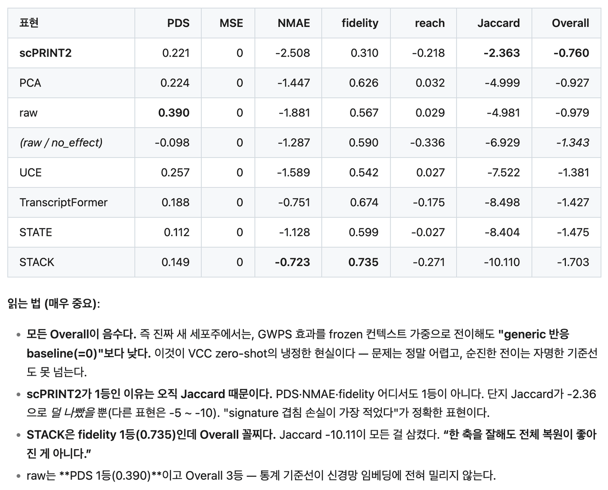
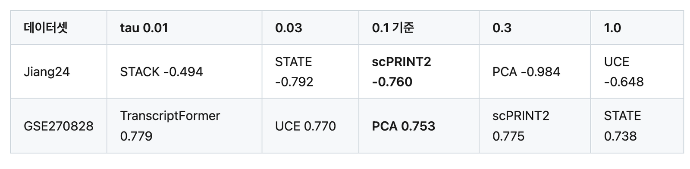
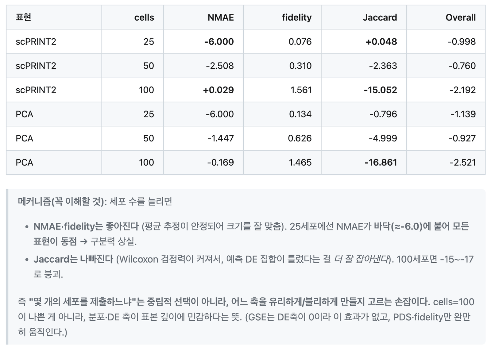

# Baseline 분석 — frozen-baseline analysis

[🏠 Portfolio](https://github.com/heoneyzi) › [📚 Study](../../../README.md) › [🧬 Genomics](../../README.md) › [Season 2 · Functional Genomics 2](../README.md) › [VCC 2026](README.md)

> ✍️ **강지헌 (me)** · 📅 2026-09 · 🗂️ Source: Notion — *Functional Genomics 2 › Virtual Cell Challenge 2026*
>
> Local proxy evaluation on public data (Jiang24, GSE270828, strict Replogle-only) — **not** VCC leaderboard scores. Code and full results: [01_Medical/VCC_2026](https://github.com/heoneyzi/Medical/blob/main/VCC_2026/README.md).

---

두 단계로 분해해 보면 명확하다.

1. **1단계 — 효과 라이브러리의 가치(큰 도약)**: `no_effect`/`global_mean` → 아무 GWPS 전이.
    - Jiang24: no_effect -1.343 → weighted 전이 -0.98\~-0.76 (**뚜렷한 개선**).
    - GSE270828: no_effect 0.606 → nearest 0.753 (**뚜렷한 개선**).
    - 이 도약이 **가장 크고 확실한 신호**다. “이미 측정된 CRISPRi 효과를 옮기는 것” 자체의 가치.
2. **2단계 — 표현의 추가 가치(작고 조건 의존)**: raw/PCA(통계 유사도) vs frozen(신경망 유사도).
    - Jiang24 기준: scPRINT2가 raw/PCA를 근소하게 앞서지만 Jaccard 한 축·특정 조건에 한함.
    - GSE270828: **PCA(통계)가 최고**, frozen 전부 아래.
    - strict Replogle-only: **raw(통계)가 최고**, frozen 전부 아래.
