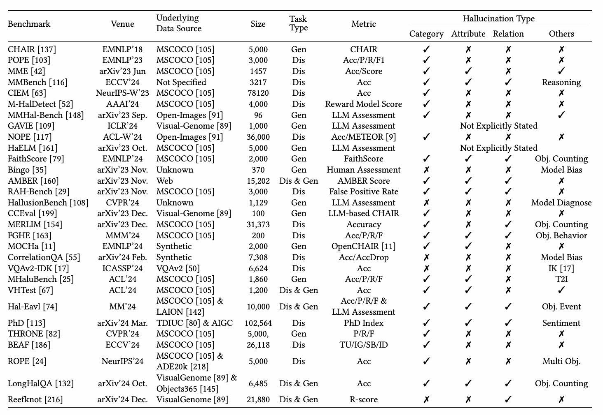

# Hallucination of Multimodal Large Language Models: A Survey — 정리

[🏠 Portfolio](https://github.com/heoneyzi) › [📚 Study](../../README.md) › [🌀 Hallucination](../README.md) › [01 · Foundations](README.md)

> 🗓️ 2025-05 · LVLM 객체 환각 스터디 (1단계, 팀 프로젝트)

### Hallucination의 종류

첫째, 객체 환각(Category hallucination)은 이미지에 존재하지 않는 객체를 모델이 생성하는 경우이다.

둘째, 속성 환각(Attribute hallucination)은 존재하는 객체의 속성을 잘못 묘사하는 경우를 일컫는다.

셋째, 관계 환각(Relation hallucination)은 객체 간의 관계나 상호작용을 부정확하게 설명하는 것이다.

### **MLLM의 구조적 구현 방식**

1. **Interface-based (사전학습 모델을 잇는 방식)**
- **Pretrained Vision Encoder + Pretrained LLM** 연결
- 중간에 연결 모듈(interface)을 두어 시각 특징을 언어 모델에 맞게 변환
    **ㄱ) Learnable Query-based**

    - 예: Q-Former (BLIP-2, MiniGPT-4 등에서 사용)
    - 구조: 학습 가능한 쿼리 토큰들이 Cross-Attention으로 이미지 정보를 추출
    - 장점: 정보 선택적으로 추출, 고차원 표현 가능

    **ㄴ) Projection-based**

    - 예: LLaVA, Shikra 등
    - 구조: Vision encoder의 출력을 <b>선형 변환(MLP 등)</b>하여 LLM 입력 공간에 맞춤
    - 장점: 구현 간단, 파라미터 적음
1. **End-to-End 방식**
- 예: **Fuyu-8B, Gemini**
- 특징:
    - **사전학습된 비전 인코더 없이**, 이미지 패치(raw pixels)를 직접 입력
    - **초기부터 통합된 학습 구조** 사용
    - 현재 대부분 <b>비공개(closed-source)</b>임

### Hallucination의 원인

환각 문제는 멀티모달 모델의 전체 파이프라인, 즉 입력 데이터부터 훈련, 그리고 추론 단계까지 여러 요인이 상호작용한 결과로 발생한다.

1. 데이터 측면
    ㄱ) 데이터 양 부족

    ㄴ) 데이터 질 부족

    - 노이즈 → 이미지 자체를 처리하지 못할 때
    - 다양성 부족 → Positive Instruction만 줘서, 실제로 모델이 Yes라고 답하는 편향을 가지게 됨. **Negative instruction**에 대한 고민 필요
    - 세부 묘사 수준 → 세부 묘사 부족: Grounding 실패, 과잉: 파악 불가한 정보까지 있어서 Hallucination → 열린 문제이며 다양한 연구가 일어나는 중임

    ㄷ) 통계적 편향

    - 데이터를 통째로 암기하는 버릇 → 객체 빈도 편향 or 공동 출현 편향
1. 모델 구조 측면

대부분의 MLLM은 다음 세 요소로 구성:

- Pretrained Vision Model
- Pretrained Language Model (LLM)
- Alignment Module (Interface)

각각에 따른 문제점이 있을 수 있음.

ㄱ) **Weak Vision Model**

- 비전 인코더가 객체를 잘못 분류하거나 시각 개념을 오해할 경우
    → 이후 언어 모델에 잘못된 정보 전달 → 환각 발생

ㄴ) **Language Model Prior**

- 대부분의 MLLM에서 **LLM이 Vision Model보다 훨씬 강력함** → 결과적으로 모델은 시각 정보보다 언어 기반 지식에 더 의존
- LLM이 너무 강하면 시각 정보 무시 → 언어 prior 기반 환각

ㄷ) **Weak Alignment Interface**

- 비전 인코더와 LLM을 연결하는 **정렬 모듈**(예: projection layer, Q-former)이 핵심적인 역할 수행
- 정렬 품질이 낮으면 **cross-modal interaction** 실패 → 환각 유발
    **Projection Layer 방식 (예: LLaVA)**

    - 시각 피처를 선형변환하여 LLM 임베딩 공간으로 투사
    - 문제: 정보는 대체로 유지되지만, 투사 후 feature가 여전히 **언어 공간과 분포 차이 존재** (distribution mismatch) , supervision 부족으로 **학습이 약함**

    **Learnable Query 방식 (예: Q-Former in BLIP-2)**

    - 학습 가능한 쿼리 토큰들이 시각 피처를 요약해 LLM에 전달
    - 문제: **다양한 supervision은 좋으나**, 쿼리로 인해 **세밀한 시각 정보 손실** 가능

1. 훈련 과정
    ㄱ) Token-level Loss의 한계

    - 다음 토큰 출력에 용이하지만, 이미지 정보 파악에는 불리한 형식

    ㄴ) Sequence-level Supervision 부족

    - 문장 전체의 일치도나 관계성 파악에 불리

    ㄷ) RLHF의 부재

    - LLM은 RLHF로 인간 중심 튜닝이 가능한 반면, MLLM은 그게 없어 더 쉽게 환각을 범함 
2. 추론 및 생성 단계

Attention 편향과 시각 토큰의 왜곡이 이의 핵심 원인으로 보통 지목된다.

ㄱ) **시각 정보 주의 결핍**

- 시퀀스가 길어질수록 **자기회귀 attention은 앞서 생성된 텍스트 토큰에 집중**하게 됨 → **시각 정보에 대한 주의(attention)는 희석됨**

생성 중 attention map을 분석해보면, **시각 토큰보다는 기호나 구두점 같은 이전 텍스트 토큰**에 집중하는 현상이 관찰된다고 함

ㄴ) **함정 시각 토큰**

- **Attention 집중 불균형**
    - 일부 시각 토큰만 **과도한 attention**을 받고, 실제 중요한 세부 정보를 가진 토큰들은 **주의를 받지 못함**
    - 미세한 객체 속성이 필요한 작업에서 **치명적임**
- 노이즈 민감성
    - Vision encoder가 생성한 일부 시각 토큰은 **이미지 노이즈에 매우 민감함 → representation space에 outlier 토큰**이 생기고, 이는 attention 및 생성 결과에 **큰 영향을 주며 환각을 유발**
- **소수 토큰 영향 과대**
    - 소수의 시각 토큰이 **전체 생성 결과를 지배**할 수 있으며, **이러한 토큰 하나만으로도 환각이 유발**될 수 있음

### Hallucination의 평가와 벤치마크

환각 평가는 모델에서 생성된 콘텐츠에 환각이 얼마나 포함됐는지, 혹은 모델이 환각 여부를 얼마나 잘 분별하는지 두 축으로 나뉜다.

### Hallucination 완화 전략

환각 완화는 환각 발생의 원인 별로 맞춤형 전략을 도입하는 것이 핵심이다.

1. 데이터 기반
    - **Negative Data**
        - **negative instructions를 추가해 정밀하게 반응하도록 만들기**
    - **Counterfactual Data**
        - 접근 1: 여러 MLLM 응답 간 **일관성 기반 검출** → 환각 데이터 제거
        - 접근 2: **Counterfactual Instruction 생성**으로 편향 교정
            - 예: 냉장고 있는 이미지에 전자레인지 존재 질문 → 오답 유도 → 학습 데이터에 반영
        - 방법 3: **텍스트를 의도적으로 왜곡**하여 언어 prior 유도
            - 훈련 중:
                - 시각 정보와 충돌하는 텍스트 삽입
                - 모델이 시각 정보에 집중하도록 유도
    - **Reasoning Data**
        - Rationale 추론 학습 도입
            - 정답/오답 + 이유(rationale) 데이터 제공
            - 지시문 → 응답 + 왜 그렇게 답했는지 설명

            **모델의 reasoning 과정 내재화** → 신중하고 근거 기반 응답 유도
    - **Clean Data**
        - 기존 데이터의 caption 품질을 **자동 재작성**
            - Step 1: 핵심 단어(명사, 동사, 형용사) 추출
            - Step 2: LLM으로 새로운 caption 생성
        - 모델이 **지각 한계를 넘기기 전에** 텍스트 생성을 중단하도록 유도
            - 너무 복잡하거나 세부묘사가 과한 학습 데이터를 **필터링**
            - 모델이 **실제로 인지 가능한 것까지만 묘사하도록** 학습
2. 모델 기반
    - Scale-up Resolution
        - 해상도를 높이면 더 풍부한 시각 정보 확보 → 더 정확한 객체 인식 → 환각 감소
    - **다양한 시각 인코더 조합**
        **CLIP-ViT** 인코더를 사용하지만, 순수 시각 모델(e.g., **DINO ViT**) 대비 **세부 정보 손실** 발생 가능

        - **Feature Fusion**
        - **Visual Expert 기반 구조**
        - **Vision Tool Integration** 
    - **환각 제어 특화 모듈 추가**
        **LLM의 언어 prior가 시각 정보를 덮어씌움**

        - **Contrastive 학습 데이터** 사용 (언어 기반 vs 시각 기반)
        - **𝜖 제어 파라미터**로 “언어 기반 ↔ 시각 기반” 조절

        시각 피처와 텍스트 프롬프트 간 **semantic gap**

        - 가상 토큰 (virtual tokens)을 이미지 피처와 텍스트 사이에 삽입하고, 이 토큰들을 학습시켜 **양쪽을 정렬**
3. 학습 기반
    - Auxiliary Supervision (보조 감독 신호 도입)
        - 기존 **CrossEntropy 기반의 token-level loss**만으로는 시각 정보의 복잡성을 반영하기 어렵다는 문제를 해결하고자 함
    - Reinforcement Learning (강화학습 기반 환각 완화)
        - 자동화된 메트릭 최적화 (Automatic Metric-based RL)
        - AI Feedback 기반 RL (RLAIF)
        - Human Feedback 기반 RL (RLHF)
        - T2I 기반 Feedback (Visual Generative Feedback)
    - Unlearning (망각 유도)
        - 특정 환각적 응답을 **역방향 gradient (gradient ascent)** 방식으로 “잊게” 만들자
            - CLIP 기반 positive vs hallucinated sample 생성 → 서브문장 단위 unlearning loss 적용
4. 추론 기반
    - **Generation Intervention**
        - **Contrastive Decoding**: distorted input(예: 이미지, 프롬프트)를 사용해 biased 분포를 만들어 원본 분포와 비교하며 디코딩.
        - **Guided Decoding**: 객체 grounding, CLIPScore 기반 신뢰도 스코어링 등으로 디코딩 가이드
        - **Visual Amplification**: 이미지 정보 비중을 명시적으로 높이는 디코딩 전략
        - **Over-trust Mitigation**: attention이 특정 summary token에만 집중되는 현상 보정
        - **Token-level 전략**: hallucination 유발 토큰(예: \\n\\n)을 피하거나 요약 기반 토큰 보정
        - **Latent Space Editing**: hallucination token 또는 object를 latent space에서 제거
        - **Causal Inference**: modality prior를 confounder로 보고 counterfactual 생성
    - **Visual Prompting**
        - 이미지 자체를 조작하거나 object-mask를 활용해 attention을 유도
        - [arxiv.org](https://arxiv.org/pdf/2404.16375)
    - **RAG (Retrieval-Augmented Generation)**
        - 모델 확신이 낮은 시점에 외부 지식을 retrieval
    - **Ensembling**
        - 다양한 시점/경로/모델 결과를 종합해 안정적 추론
    - **Post-hoc Correction**
        - 텍스트 출력 후 시각 grounding 등을 통해 사후 수정

---
[← Hallucination 목차](../README.md) · [📑 목차](../README.md) · [할루시네이션 개요 ① — Visual Attention 관련 →](02_visual_attention_overview.md)
