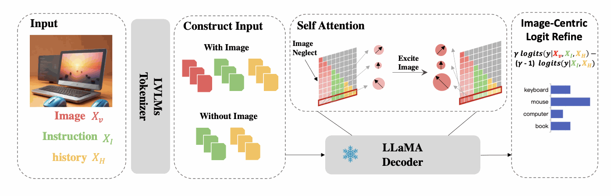
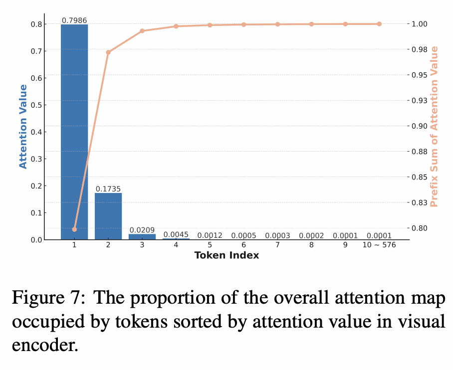
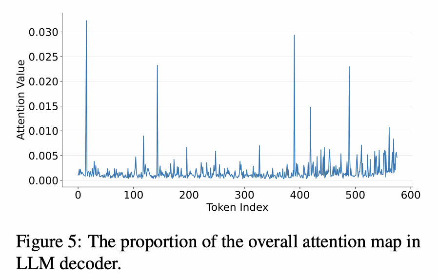
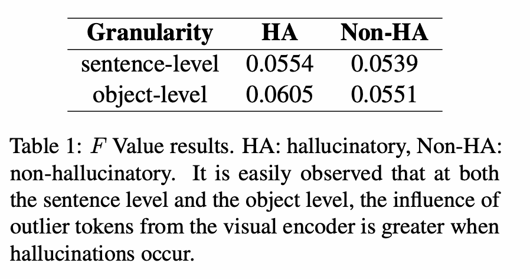

# 할루시네이션 개요 ① — Visual Attention 관련

[🏠 Portfolio](https://github.com/heoneyzi) › [📚 Study](../../README.md) › [🌀 Hallucination](../README.md) › [01 · Foundations](README.md)

> 🗓️ 2025-05 · LVLM 객체 환각 스터디 (1단계, 팀 프로젝트)

먼저 LVLM에서 어텐션을 건드려서 할루시네이션을 완화하려는 시도들을 알아봤었는데, 그것들을 정리해보도록 하겠다.

그전에! 어텐션을 건드린다는 것을 좀 명확히 이해하기 위해서 LVLM에 사용되는 어텐션의 구성을 알아봐야한다.

> 💡 LVLM 구조 (어텐션을 중심으로)
>
> 이미지 + 텍스트 프롬프트가 입력으로 들어와서, $`y_t`$ 토큰을 디코딩하는 과정이라고 가정.
>
> 1. 이미지와 텍스트가 각각 인코더를 통해 인코딩 된다. (이미지 패치수만큼, 텍스트 토큰 수만큼 나오겠지..?)
> 2. 이미지 특징과 텍스트 특징을 Projection이후에 Concat한다. (BLIP-2에서는 Q-former로 이미지 특징을 패치수에서 줄여서 합치는데, 이는 ViT 특징간의 **Cross-Attention**으로 이루어진다.)
> 3. $`y_1`$에서 $`y_{t-1}`$까지 **Self-Attention**과, $`y_1`$에서 $`y_{t-1}`$까지를 Concat한 입력 특징과 **Cross-Attention**으로 $`y_t`$가 추출된다.
>
> 3-1. Concat한 입력 특징과 $`y_1`$에서 $`y_{t-1}`$까지를 하나의 시퀀스로 보고 **Self-Attention**만 진행한다. (Decoder only 구조)

일단 내가 현재까지 이해하기론 대게의 LVLM에서 할루시네이션은 $`y_t`$가 길어지면서 생긴다. 많은 토큰이 생성되면, LLM으로 정렬하는 과정에서 생기는 구조적인 한계점처럼 이미지에 집중하지 못하게 된다.  (**Self-Attention**의 영향력이 커진다고 생각해도 되나..? 그래서 관성적으로 이전 토큰의 영향으로만 토큰 생성을 하는거지..!)

그래서 다른 연구들은 어떻게 Attention을 건드렸는지 알아보자.

#### 1. Attention의 비율을 강제하자!

**PAI (ECCV 2024):  Paying More Attention to Image: A Training-Free Method for Alleviating Hallucination in LVLMs** [https://arxiv.org/pdf/2407.21771](https://arxiv.org/pdf/2407.21771)

LVLM은 Vision Encoder을 LLM에 정렬시킨 형태를 사용해서 텍스트 생성 능력을 극대화한다. → 이미지와 텍스트의 스케일 불균형을 일으킴

문제점: Text Inertia (텍스트 관성) 이미지가 있든 없든 비슷한 텍스트를 생성하는 현상 = 이미지를 보지 않는 현상

해결 방안: PAI (Paying more Attention to Image)

- 이미지 토큰의 Attention 가중치를 강제로 늘리자!
- 이미지 유무의 텍스트 생성 차이를 이용해 LLM의 편향을 빼자!

참고로 LLaMA는 Decoder Only 구조로 No Cross-Attention

**어텐션 조정 방법:**

$`\text{Attention}(Q, K, V) = \text{softmax}\left(\frac{QK^T}{\sqrt{d}}\right)V`$ 라는 기존의 Attention을,

$`(QK^T){i,j} \leftarrow \begin{cases} \alpha \cdot (QK^T){i,j}, & \text{if } j \in \text{image token index} \\ (QK^T)_{i,j}, & \text{otherwise} \end{cases}`$로 해서 가중치를 더 주겠다는 간단한 방식

추가적으로 Text Inertia를 잡기 위해서 이미지가 있을 경우와 없을 경우의 Logit (Softmax 직전의 사실상의 Score)을 비교해서 조정한다.

$`\text{logits}{\text{final}} = \gamma \cdot \text{logits}{\text{with image}} - (\gamma - 1) \cdot \text{logits}_{\text{without image}}`$

여기서 PAI는 Projection 이후의 이미지 특징을 다룬다. 즉 LLM에 들어가기 위해 후처리를 진행한 것에 집중한다.

> 💡 어텐션에 강제적으로 수치를 주는 간단한 방식이지만, 어텐션을 건드렸다는 의의가 있고 Training-Free이다.
>
> 근데 단순하게 $`\alpha`$를 통해서 가중치를 주는 것은 디코더에서 출력 토큰을 많이 만들어내면 이미지를 덜 보게되는 기본적인 구조를 못 고친 것 아닌가 하는 생각을 했다.

#### 2. 불필요한 지역의 Attention을 감소시키자!

**DAMRO (EMNLP 2024):  Dive into the Attention Mechanism of LVLM to Reduce Object Hallucination**

[https://arxiv.org/pdf/2410.04514](https://arxiv.org/pdf/2410.04514) 

ViT의 Self-Attention에서

<table><tr>
<td align="center" width="50%"></td>
<td align="center" width="50%"></td>
</tr></table>

<table><tr>
<td align="center" width="50%"></td>
<td align="center" width="50%"></td>
</tr></table>

$`H_i = \frac{\left| S_v(i) \cap S_l(i) \right|}{i}`$

$`F = \frac{ \sum_{j=1}^{3} ATT(L_v(j)) }{ \sum_{i=0}^{n-1} ATT(i) }`$

 • Vision Transformer(ViT)의 분류 토큰(CLS)을 활용해 <b>이미지 배경에 대한 비정상적으로 높은 어텐션을 갖는 “이상치 토큰”</b>들을 식별하고 필터링합니다 . 이렇게 찾아낸 배경 토큰들은 생성 과정에서 **부정적 토큰**으로 간주되어 텍스트 생성 시 그 영향력이 제거됩니다 . 이는 **추론 단계의 대조적 디코딩 전략**으로, 시각적으로 중요하지 않은 정보에 모델이 집중하는 현상을 억제합니다.  • **자기 어텐션** 기반 ViT 인코더와 LLM 디코더의 **크로스 모달 어텐션** 분포를 분석합니다. 저자들은 **시각 인코더와 LLM 디코더의 어텐션 분포가 일치하며** 둘 다 이미지의 대상 객체보다 특정 배경 패치들에 집중하는 현상을 발견했습니다 . 이러한 **배경 정보에 대한 과도한 어텐션**을 **ViT의 CLS 토큰 어텐션 맵**으로 감지하고, 디코더에서는 해당 토큰들의 기여를 제거하여 환각을 줄였습니다. 

** PAINT (arXiv 2025):  Paying Attention to INformed Tokens to Mitigate Hallucination in LVLMs **

[https://arxiv.org/pdf/2501.12206v3](https://arxiv.org/pdf/2501.12206v3)

- **어텐션 조정 방법:** 심층 분석을 통해 **환각이 발생하는 원인** 중 하나가 **디코더 심층 레이어에서 시각 정보에 대한 어텐션 약화**임을 확인하였습니다 . 이를 해결하기 위해, **이미지 인코더 출력 중 중요한 두 종류의 토큰**에 주목합니다: (1) **로컬 토큰** – 이미지 내 개별 객체들의 상세 정보를 담은 토큰들, (2) **요약 토큰**– 이미지 전체 장면을 요약한 토큰(예: ViT의 CLS 토큰) . 제안 기법 **PAINT**는 LLM 디코더의 **자기 어텐션 과정에 개입**하여 **이 두 종류의 토큰에 대한 어텐션 가중치를 선택적으로 증강**합니다 . 각 토큰 타입의 중요도에 따라 **증강 비율을 다르게 설정**함으로써, 객체별 세부 정보와 전체 문맥 정보 모두 충분히 반영되도록 했습니다 .
- **사용된 어텐션 구조:** Vicuna 등의 **디코더 내부 자기어텐션** 메커니즘에 **토큰 가중치 조정 모듈**을 삽입한 **플러그앤플레이 방식**입니다 . 모델을 재학습하지 않고도, **디코딩 단계마다 어텐션 행렬을 후처리**하여 선택된 로컬/요약 토큰에 추가 가중치를 부여합니다. 이를 통해 **시각적 정보의 전달 경로를 강화**하고, 텍스트 토큰에만 치우치는 일부 어텐션 헤드를 보완합니다. (초기 연구에서는 어텐션 헤드별로 시각 민감도를 측정해 증폭하는 방안도 논의되었으나, 최종 PAINT에서는 토큰 유형별 증강에 집중하였습니다.) 

** IMCCD (arXiv 2025):  Inter-Modality Correlation Calibration Decoding**

[https://arxiv.org/pdf/2501.01926](https://arxiv.org/pdf/2501.01926) 

- **어텐션 조정 방법:** 이미지와 텍스트 사이의 **스퓨리어스(Spurious) 상관관계**로 인한 환각을 줄이기 위해 **인터모달 상관관계 보정 디코딩(IMCCD)** 기법을 제안합니다 . 이는 두 단계로 구성되며, **추론 단계에서의 개입으로 동작**합니다. 첫째, **크로스-모달 값 강화 디코딩(CMVED)** 단계에서는 *왜곡된 분포*를 생성할 때 **특정 이미지-텍스트 간 어텐션 가중치가 높은 부분의 value 벡터를 마스킹**하여, 부적절한 상관관계나 언어 편향을 억제합니다 . 쉽게 말해, 텍스트 토큰이 이미지의 한 부분에 과도하게 집중해 잘못된 추론을 일으킬 경우 일시적으로 그 연결을 끊고 대조적으로 출력 분포를 조정하는 것입니다. 둘째, **콘텐트 기반 어텐션 정제(CDAR)** 모듈을 통해 **크로스-어텐션 가중치를 재조정**합니다 . 이 모듈은 **이미지 내 중요한 시각 콘텐츠에 모델이 집중**하도록 어텐션 지도를 미세 조정하여, 최종 출력이 실제 이미지 내용과 부합하도록 유도합니다 .
- **사용된 어텐션 구조:** CLIP 등 **이미지 인코더의 출력**과 LLM 디코더 사이의 **크로스 어텐션 메커니즘**을 직접 다룹니다. 디코딩 과정에서 **텍스트-이미지 어텐션 행렬**을 실시간으로 모니터링하여, **비정상적으로 높은 상관관계를 보이는 어텐션 경로를 차단**(value masking)한 후 올바른 경로로 **가중치를 재분배**하는 방식입니다. 이러한 **대조적 어텐션 재분배**는 별도 학습 없이 적용되며, 기존 모델의 **멀티헤드 어텐션 층에 외부 모듈**로 개입합니다.

** Attention Calibration (ICML 2025):  Mitigating Object Hallucinations via Attention Calibration** [https://arxiv.org/pdf/2502.01969](https://arxiv.org/pdf/2502.01969)

- **어텐션 조정 방법:** **LVLM의 시각 토큰 어텐션 분포에 내재된 공간적 편향(SPB)** 문제를 해결하기 위해 **어텐션 보정** 기법 두 가지를 제안합니다 . 첫째, <b>Uniform Attention Calibration (UAC)</b>은 **학습 없이** 적용되는 방법으로, **의미 없는 빈 이미지**를 입력해 얻은 시각 어텐션 분포(모델의 편향 패턴)를 추정하고 이를 **보정 행렬**로 활용합니다 . 실제 이미지의 어텐션 맵에 이 보정값을 적용하여, 특정 위치에 쏠린 어텐션을 **균일하게 완화**합니다. 즉, 모델이 **특정 공간 위치(예: 이미지 하단 등)에만 주의가 치우치는 현상**을 교정합니다 . 둘째, <b>Dynamic Attention Calibration (DAC)</b>은 **경량 모듈을 학습**하여 어텐션을 동적으로 교정하는 방법입니다 . 추가로 학습되는 **플러그인 모듈**이 자기어텐션 층에 통합되어, **객체의 이미지 내 위치가 달라져도 일관된 응답을 내도록** 대조학습으로 훈련됩니다 . 이를 통해 모델이 **어떤 위치의 객체든 고르게 주시**하도록 만들어, 편향으로 인한 환각을 감소시킵니다.
- **사용된 어텐션 구조:** LLM 디코더 내 **시각 토큰에 대한 자기어텐션 분포**에 직접 개입합니다. **UAC는 사전 실험으로 계산한 보정 행렬을 어텐션 스코어에 곱하여** 특정 위치에 치중된 가중치를 완화하고 , **DAC는 자기어텐션 계산 과정에 모듈을 추가**하여 **실시간으로 어텐션 맵을 조정**합니다 . 두 방법 모두 **시각 모달리티의 어텐션 분포를 평탄화 및 재분배**하는 역할을 하며, DAC의 경우 **자체어텐션 구조에 learnable parameter를 삽입**해 미세튜닝합니다.

UNDERSTANDING AND MITIGATING HALLUCINATION IN LARGE VISION-LANGUAGE MODELS VIA MODU- LAR ATTRIBUTION AND INTERVENTION

** 환각 유발 어텐션 헤드 완화 (ICLR 2025) – Yang** 

[https://openreview.net/pdf?id=Bjq4W7P2Us](https://openreview.net/pdf?id=Bjq4W7P2Us)

- **어텐션 조정 방법:** 모델 내부에서 **환각에 기여하는 특정 어텐션 헤드**를 식별하고 표적 개입하는 접근입니다. 저자들은 **모듈 단위의 인과 분석**을 통해, LVLM의 **멀티헤드 어텐션(MHA) 모듈이 MLP 모듈보다 환각 발생 확률에 더 큰 영향**을 미치며 특히 몇몇 **특정 헤드(“hallucination heads”)가 환각의 주범**임을 밝혀냈습니다 . 이러한 헤드들은 **모델 심층부에 몰려 있고 텍스트 토큰에 치우친 편향적 어텐션 패턴**을 보였습니다 . 이에 따라 두 가지 완화 기법을 제안합니다. (1) **추론 단계에서의 헤드 억제:** 추가 학습 없이, **발견된 환각 헤드들의 어텐션 출력에 가중치 페널티**를 주거나 아예 **해당 헤드를 프루닝(pruning)하여 무시**함으로써, 디코딩 시 이들 헤드가 내놓는 잘못된 영향(텍스트 편향)을 감소시킵니다 . (2) **미세 튜닝을 통한 헤드 교정:** 모델을 부분적으로 재학습하여, 문제되는 헤드들이 **시각 토큰에도 주목하도록 유도**합니다 . 예컨대, 환각 헤드들의 **어텐션 대상에 페널티를 거는 추가 손실**을 줘서 훈련하거나, 해당 헤드의 출력을 약화시키는 방향으로 파인튜닝합니다. 두 방법 모두 **환각 헤드의 텍스트 의존도를 낮추고 시각 의존도를 높이는** 데 집중합니다 .
- **사용된 어텐션 구조:** **트랜스포머 디코더의 멀티헤드 어텐션** 모듈 내부를 들여다봅니다. 각 층의 여러 어텐션 헤드 중 **환각과 상관성이 높은 헤드**를 **층별로 식별**하여, **디코딩 시 해당 헤드의 어텐션 행렬/출력을 조정 또는 제거**합니다. 이는 모델 내부 **어텐션 행위의 미세 수준 제어**로, 어텐션 헤드별로 다른 처리를 가할 수 있습니다. 또한 파인튜닝 기법은 **해당 헤드의 query/key 가중치를 업데이트**하여, 추후에도 그 헤드가 시각정보를 놓치지 않게 만듭니다. 요약하면, **헤드 단위의 어텐션 pruning/재가중** 전략입니다.

---
[← Hallucination of Multimodal Large Language Models: A Survey — 정리](01_mllm_hallucination_survey.md) · [📑 목차](../README.md) · [할루시네이션 개요 ② — Language Prior 관련 →](03_language_prior_overview.md)
