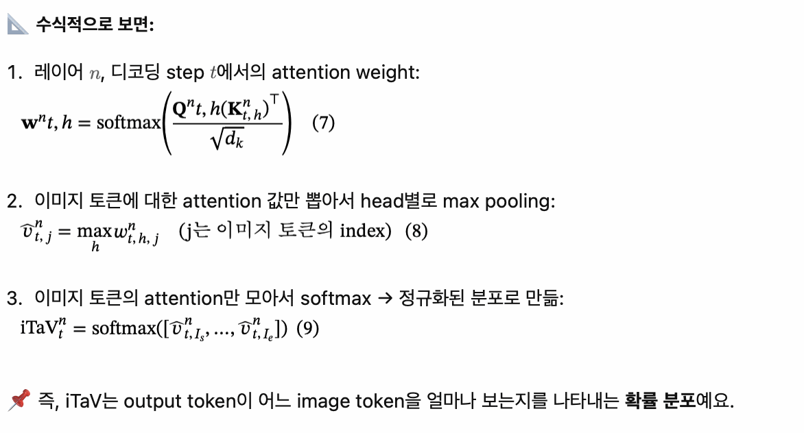
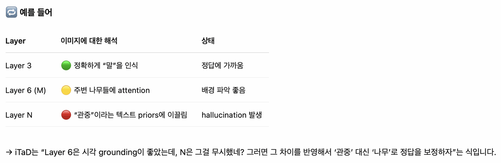
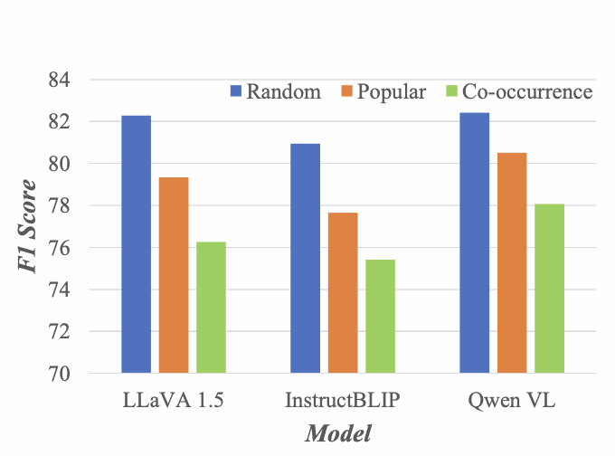
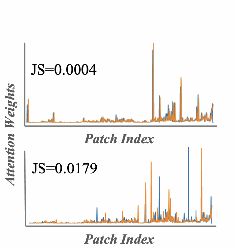
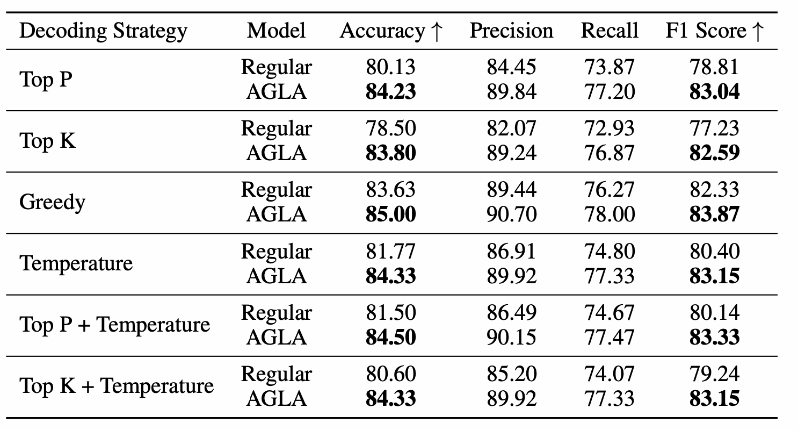

# 할루시네이션 개요 ② — Language Prior 관련

[🏠 Portfolio](https://github.com/heoneyzi) › [📚 Study](../../README.md) › [🌀 Hallucination](../README.md) › [01 · Foundations](README.md)

> 🗓️ 2025-06 · LVLM 객체 환각 스터디 (1단계, 팀 프로젝트)

### **Mitigating Visual Forgetting via Take-along Visual Conditioning** (2024)

최근 LLM의 추론 능력이 Chain-of-Thought(CoT)에서 OpenAI o1과 같은 제품 지향 방식으로 발전하고 있지만, 멀티모달 LLM(Multimodal LLM)은 시각 정보가 중요한 문제(예: 도형 문제)에서 **추론이 길어질수록 이미지 정보를 점점 잊고 텍스트에만 의존하는 경향**이 있음.

이를 검증하기 위해, 연구진은 reasoning 도중 이미지를 제거해 보았고, **정답률이 고작 2%만 하락**하는 것을 관찰함. 즉, 모델이 시각 정보 없이도 대부분의 reasoning을 수행하고 있다는 뜻.

**🔧 해결책: Take-along Visual Conditioning (TVC)**

중요한 reasoning 단계마다 이미지를 **다시 제공하고**, 불필요한 시각 토큰은 **동적으로 압축(Pruning)** 하여 **시각 정보에 대한 주의를 끝까지 유지**하도록 유도함.

**LLMs**는 Chain-of-Thought(CoT) 방식에서 출발하여, 최근에는 **OpenAI o1, DeepSeek-R1, Qwen-QVQ**와 같은 **제품 수준의 다중 단계 추론 모델**로 발전함.

이런 텍스트 기반 CoT의 발전은 MLLM(Multimodal LLM) 영역으로도 확장되고 있음.

- MLLM의 **Visual Forgetting**을 해결하기 위해 **시각 정보를 reasoning 중간에도 재주입(Re-activation)** 하는 방식 제안
- 인간이 문제를 풀 때 이미지나 도표를 **계속해서 들여다보며 추론하는 방식**을 모방

### **Mitigating Hallucinations in Multi-modal LLMs via Image Token Attention-Guided Decoding** (2025)

아이디어

Hallucination이 생겼다? → 이미지를 잘 보지 못했다. → 이를 레이어별로 해석

레이어가 깊어질수록 이미지를 잘 안보는 경향이 있음. + 결국 마지막까지 통합된 마지막 레이어의 이미지에 대한 어텐션을 바꿔보자. 가장 마지막 레이어와 가장 다른 이미지 어텐션을 가진 레이어를 섞어서 새로운 이미지에 대한 어텐션을 만든다.

### **Mitigating Hallucinations in Vision-Language Models through Image-Guided Head Suppression**

LVLM에서 Attention Head에 대한 연구가 많이 없다.

Hallucination에 가담하는 (이미지를 적게 보는) Head를 제압하는 것만으로도 성능 향상에 일조했다.

### **OPERA: Alleviating Hallucination in MLLMs via Over-Trust Penalty and Retrospection-Allocation** (2024)

Summary Token에 집중되는 현상을 막자. 좀 풀어내자. 해당 토큰에 집중되는 정도가 임계값 이하일 때까지 다시 만들기.

희재 형이 정리함 이미

### **Multi-Modal Hallucination Control by Visual Information Grounding** (2024)

M3ID 기법. 시간이 지남에 따라 계수를 올려서 집중되는 경향을 올려주기

희재 형이 이미 정리함

**중요!!!**

### **AGLA: Mitigating Object Hallucinations in LVLMs with Assembly of Global and Local Attention** (2024)

LVLM이 질문과 관련 없는 global 이미지 특징만 보고 환각 발생

→ attention이 local, prompt-relevant features에 부족하기 때문으로 생각

→  Global (생성용) + Local (구분용) feature를 동시에 조합 (AGLA)

학습 필요없음!

원래는 무엇을 물어보든 Image에는 비슷하게 어텐션이 걸린다. → 내용과 무관하게 같은 곳에 집중한다는 의미

AGLA는 Prompt-Aware하다는 의미임

Prompt-relevant 정보를 반영한 “local attention”을 추가하여, 기존의 global attention 기반 생성 과정에 보완을 줘서, object hallucination을 줄이자는 아이디어

그림처럼 마스킹을 해서 나온 값을 이용하겠다는 의미

**3 Preliminary Study**

<table><tr>
<td align="center" width="33%"> 복잡한 이미지일수록 더 환각이 발생함.</td>
<td align="center" width="33%"> 자주 같이 등장(co-occurrence)하는 객체들에서 더 많이 환각이 발생함.</td>
<td align="center" width="33%">  실제 있는 객체와 없는 객체를 물었을 때 차이가 없음. </td>
</tr></table>

표2의 이유:

LVLM이 **pretraining 과정에서 학습한 통계적 연관성**(e.g., road ↔ car)에 의존하기 때문. → prompt에 없는데도 **연관 객체를 생성해버리는 bias**로 이어짐.

→ 이것들이 AGLA의 이유 → 우리도 비슷하지 않을까 하는 생각

**Image-Prompt Matching (IPM) 방법 (이것도 이해해봐야함… 아직 못 읽어봄)**

---

**4. Correlation Score 계산 (수식 2)**

$`\text{cor}(j) = \frac{1}{H} \sum_{i=1}^{M} \sum_{h=1}^{H} \max\left( 0, \frac{\partial \text{sim}(v, t)}{\partial C_{ij}^{(h)}} \right) C_{ij}^{(h)}`$

결국 이 식이 핵심이다.

패치의 중요도를 전체 유사도가 미치는 영향으로 파악해버리기

- attention 값이 클수록, 그리고 그것이 유사도에 더 민감하게 작용할수록 → cor 점수가 높음

즉, 텍스트-이미지 유사도에 **직접적이고 강한 영향을 준 patch**를 식별

---

**5. Adaptive Masking**

sim(v,t)/2 의 비율로 마스킹

반영 방법

둘의 로짓을 일정 비율로 합해서 softmax를 한 것을 그대로 쓰는 것이 아니라

$`\mathcal{V}{\text{token}}(y{<i}) = \{ y_i \in \mathcal{V} : p_\theta(y_i | v, t, y_{<i}) \ge \beta \max_w p_\theta(w | v, t, y_{<i}) \}p_{\text{AGLA}}(y_i | \cdot) = 0,\quad \text{if } y_i \notin \mathcal{V}{\text{token}}(y{<i})`$

를 통해서 걸러냄 → 원본 이미지에 대한 강한 믿음

Ablation

디코딩 방법

---

아직 못 읽어봄… ㅎ

**Mitigating Object Hallucinations in Large VLMs through Visual Contrastive Decoding** (2023)

**Mitigating Hallucinations in Large VLMs with Instruction Contrastive Decoding** (2024)

---
[← 할루시네이션 개요 ① — Visual Attention 관련](02_visual_attention_overview.md) · [📑 목차](../README.md) · [코드 할루시네이션 (번외) →](04_code_hallucination.md)
