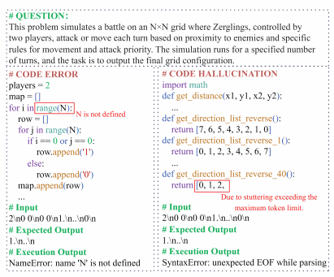

# CodeHalu — Investigating Code Hallucinations in LLMs via Execution-based Verification

[🏠 Portfolio](https://github.com/heoneyzi) › [📚 Study](../../README.md) › [🌀 Hallucination](../README.md) › [01 · Foundations](README.md)

> 🗓️ 날짜 미상 · 번외 — 코드 LLM의 환각

### Abstract

실제로는 기대한  대로 실행되지 않거나 주어진 명세를 충족하지 못하는 경우 → code hallucination

실행 검증(execution verification) 기반 환각 분류 체계

네 가지 유형  - Mapping, Naming, Resource, Logic

모델 간 코드 생성 정확도 및 신뢰도 차이 존재 .

### Introduction

코드 생성 분야의 모델 환각 문제는 아직 본격적으로 다뤄지지 않음.

모델에 의해 작성된 코드는 실제로 정상 실행 및 테스트 통과 시 가치 존재. → 실행 검증을 통해 타당성 입증.

코드와 자연어 간 본질 차이 존재 → 다른 환각 정의 및 적용 필요

코드 환각 : 최종적으로 기대대로 실행되지 않거나 명세 요구사항 충족 못하는 현상.

코드 생성 과정에서 환각 능동 탐지. 동적 탐지 알고리즘 CodeHalu

여러 LLM이 공통적으로 생성하는 코드 패턴 식별. 반복적 나타남 → 공통적 코드 환각

실행기반 검증 방식 → 2단계 휴리스틱 탐지 방식 결합.

네가지 유형 탐지 : Mapping, Naming, Resource, Logic

CodeHaluEval : 평가 벤치마크 제안.   → 벤치 마크 중점으로 살펴볼 것.

> 💡 t2i에서의 hallucination?

→ 할루시네이션과 에러의 차이점(모든 분야에서)

### Related Work

코드 환각을 체계적 정의, 탐지 분류 및 정량화 위한 CodeHalu 제안.

### Code Hallucination

**Code Hallucination:** 문법적으로는 올바르지만 기대한대로 실행되지 않음 및 명시된 요구사항 충족 x

**Code Errors:** 코드 오류, 프로그램 실행을 중단.

코드 오류는 코드 환각의 하위 유형. → 모든 환각이 오류로 표현되는 것은 아님.

우측은 논리 붕괴로 인한 동일 함수의 반복 호출 → 표면적으로는 문법 오류지만 논리적 환각.

코드 환각 : 왜 잘못된 출력을 생성했는지에 초점.

### CodeHalu Algorithm

LLM이 생성한 코드의 hallucination을 감지 및 정량화 목적 → CodeHalu 동적 탐지 알고리즘

---
[← 코드 할루시네이션 (번외)](04_code_hallucination.md) · [📑 목차](../README.md) · [DAMRO — Dive into the Attention Mechanism of LVLM to Reduce Object Hallucination →](../02_paper_reviews/01_damro.md)
