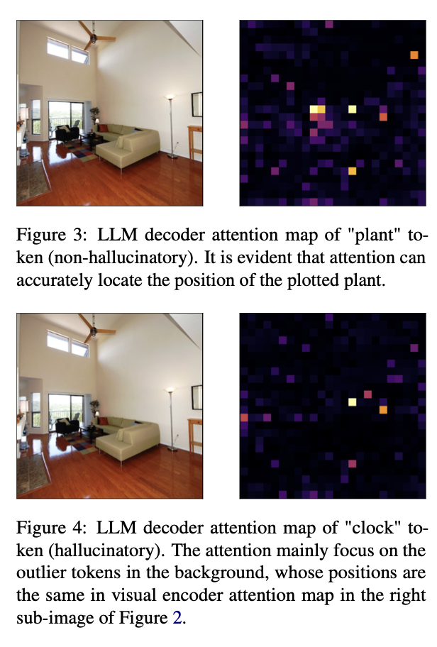
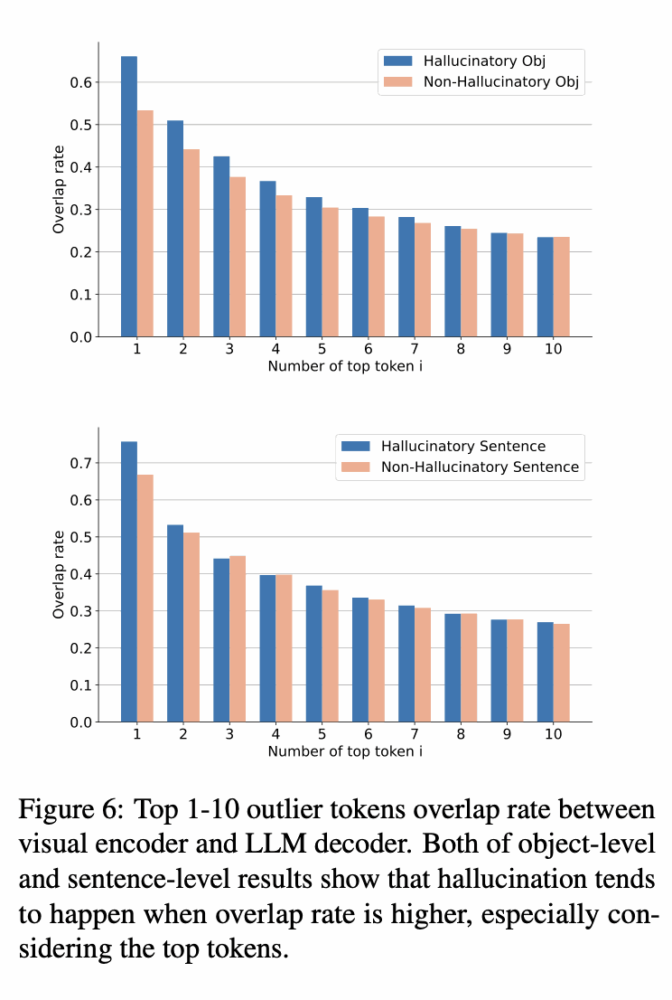
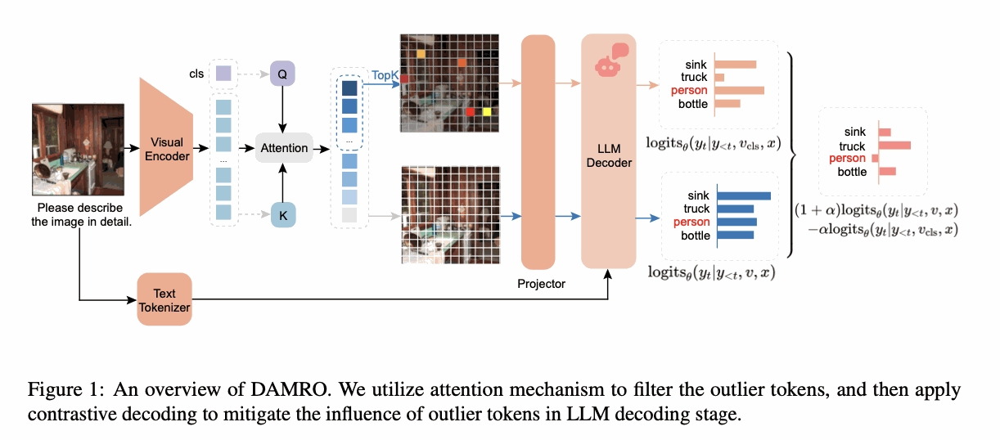

# DAMRO — Dive into the Attention Mechanism of LVLM to Reduce Object Hallucination

[🏠 Portfolio](https://github.com/heoneyzi) › [📚 Study](../../README.md) › [🌀 Hallucination](../README.md) › [02 · Paper reviews](README.md)

> 🗓️ 2025-05 · LVLM 객체 환각 스터디 (1단계, 팀 프로젝트)

[https://arxiv.org/pdf/2410.04514](https://arxiv.org/pdf/2410.04514)

### Abstract

LVLM은 좋은 성능을 냄에도 불구하고, 환각 문제가 발생함.

이미지 인코더인 ViT와 LLM의 디코더에서 모두 Attention 기반인데, Background에 과도한 집중을 한다는 것을 발견.

이러한 Attention 편향이 Object Hallucination을 일으킨다고 생각해서 DARMO라는 방법을 제시함.

### Introduction

다른 다양한 연구들과 달리 이 연구는 ViT에 직접적으로 문제성을 제기함.

ViT의 Attention Map (Self-Attention)을 보면 주로 Background의 일부 토큰에 과도하게 집중하는 것을 발견함. LLaVA등 Decoder Only 구조에서는 Self-Attention 만으로 토큰을 추출하기 때문에 자연스럽게 이 ViT의 Attention 편향 문제가 디코더에서도 적용될 수 밖에 없음.

이를 해결하고자 DARMO는 ViT의 CLS Attention을 분석해 high-norm outlier 토큰을 제거하고, contrastive decoding을 통해 그 영향력을 차감하는 방법을 제안한다.

### Motivation

#### **Problem Formulation**

LVLM의 작동과정

- LVLM에서 이미지는 인코더를 통해 먼저 특징을 뽑아낸다. 대게 ViT를 사용하며 패치만큼의 특징이 뽑아진다.
- Projection Layer을 통해 LLM에 넣을 수 있도록 변환한다.
- LLM에서 디코딩이 이루어진다.

위 과정에서 현재 연구는 ViT에서 패치 단위로 뽑히는 특징에 중점을 둔다.

#### **Drawbacks of ViT**

[https://openreview.net/pdf?id=2dnO3LLiJ1](https://openreview.net/pdf?id=2dnO3LLiJ1) 에 의하면 ViT의 표현력은 좋지만, Attention Weight가 비정상적으로 큰 몇개의 토큰들이 있음을 알 수 있다. 이 토큰은 주로 Background 영역에 존재한다.

ViT의 Self-Attention을 알아보기 위해서 CLS 토큰을 활용해서 알아본다.

<table><tr>
<td align="center" width="50%"></td>
<td align="center" width="50%"></td>
</tr></table>

Figure2를 보면 알 수 있다. 몇개의 토큰에만 집중하여 Attention이 이루어졌음을 알 수 있다. 그렇다면 이 ViT에서의 Attention 편향성이 LLM의 디코더에도 영향을 준다고 말할 수 있을까? 이를 증빙하기 위해 먼저 정성적으로 확인 한 것이 Figure 3,4이다. 여기서는 Hallucination 유무를 통해서 Attention의 분포도를 보았다. Hallucination이 일어난 시점에서 Figure2처럼 몇개의 Background에만 유사하게 Attention이 이루어졌음을 알 수 있다.

<table><tr>
<td align="center" width="50%"></td>
<td align="center" width="50%"></td>
</tr></table>

실제로 토큰별로 Attention 정도를 확인한 그래프이다. Figure7는 Visual Encoder인 ViT에서 토큰별 집중 정도이다. Top3개의 토큰에 Attention이 거의 몰렸다는 것을 확인할 수 있다. 실제로 99%이상이 3개의 토큰에 집중되어있다고 한다.

Figure5는 Context-Aware한 경우인 LLM Decoder에서 토큰을 추출할 때의 Attention Map이다. 당연하게도 Self-Attention이 이루어질 때 이미지 이외에도 입력 텍스트나 추출 토큰들의 영향으로 ViT에서 보다는 분산이 되기도 하지만, 그럼에도 몇몇 토큰에는 집중되어있다는 것을 확인할 수 있다. 그러나 여기서 몇몇 토큰에 집중되는 것이 과연 Hallucination과 관련이 있는지는 확인할 필요가 있다.

#### **Outlier Tokens Cause Hallucination** 

그렇다면 ViT에서 몇개의 집중된 토큰이 Hallucination일 때와 아닐 때의 영향력의 차이점을 알고자 다음과 같은 실험을 했다.

$`F = \frac{ \sum_{j=1}^{3} ATT(L_v(j)) }{ \sum_{i=0}^{n-1} ATT(i) }`$를 통해서 상위 3개의 토큰이 가지는 Attention 정도를 확인해본 것이다. 실제로 Hallucination 문장에서가 더 많은 의존성을 지님을 알 수 있다.

> 💡 여기서 개인적인 질문
>
> - 저 차이 과연 유효할 정도로 큰 것인가?
>
> Figure3,4에서 말하는 정도의 차이가 나려면 완전히 Top3의 비율이 낮아져야할 것 같은데…왜냐하면 이미지끼지 본 99%의 어텐션이 어쨌든 5%대까지 줄어든 것이니까 이미 잘 분배되었다고 볼 수도 있는 것이 아닐까..? 그러면 여기서 여러가지 해석을 할 수 있다.. 먼저 저정도면 차이가 극명하게 나는 것이라는 것이다. 저 차이를 비짚고 들어가는 것이 이 연구의 핵심이고, 실제로 결과를 낸 것이니까.  혹은 Background 토큰을 보는 것이 영향을 주지 않는다면? 즉 Background 토큰을 보더라도 답을 생성할 수 있는 능력을 가졌거나(단순히 벤치마크에는 영향을 못 미치는 환각이거나?), Background 토큰을 봐서 정보를 못 얻어도 Text Prior이 주는 정보와 LLM의 능력이 이를 커버해줬다.

추가적으로 이는 이제 Hallucination과 아닐 때의 토큰 오버랩 비율을 의미한다.

$`H_i = \frac{\left| S_v(i) \cap S_l(i) \right|}{i}`$를 통해서 즉 ViT의 Attention 토큰과 LLM의 Attention 토큰이 겹치는 비율을 본 것이다.

결국 논문에서는 Hallucination에서가 아닐 때보다 더 오버랩의 비율이 높기 때문에 이를 줄이는 것이 도움을 준다고 해석하였다.

> 💡 여기서 개인적인 질문2
>
> - 이게 과연 다일까?
>
> Hallucination일 때가 Non-Hallucination일 때보다 높다 = 맞는 말
>
> 그렇지만 Non-Hallucination일 때도 ViT의 가장 높은 비율을 가진 토큰 (Background 중 하나)가 여전히 60%이상의 비율로 겹친다면, 아직 완전히 이상적인 형태의 환각을 이겨내지 못했다고 말할 수 있지 않을까? 물론 정확한 수치가 아닌 Top-K로 했으니 아닐 수도 있지만 그럼에도 순위가 바뀌어서 타겟의 object의 이미지 패치 토큰이 더 높게 나와야하는게 아닐까 하는 생각이 들었다. 이는 위에서 말한 2가지 가설인
>
> “”” Background 토큰을 보는 것이 영향을 주지 않는다. 즉 Background 토큰을 보더라도 답을 생성할 수 있는 능력을 가졌거나, Background 토큰을 봐서 정보를 못 얻어도 Text Prior이 주는 정보와 LLM의 능력이 이를 커버해줬다.
>
> “””
>
> 에 더 큰 힘을 실어주는 것이 아닐까?
>
> → 개인적으로 여기서 아이디어를 얻어서 내 아이디어가 나오게 됨

### Methods

#### **Outlier Tokens Selection**

위에서 언급한 것처럼 CLS 토큰을 이용해서 이미지의 Self-Attention 값을 계산한다.

$`A_\text{cls} = \text{softmax}\left(\frac{Q_{\text{cls}} K^T}{\sqrt{d}}\right)`$

→ 이는 결국 CLS 토큰에서 토큰이 얼마나 집중하는지 보는 Attention Map

이 중에서 가장 높은 Top-K를 선택한다.

> - CLS로 보는거 과연 괜찮을까..?
>
> 타당성이 떨어지진 않지만… Attention 쏠림이 CLS의 문제가 아니라고 단정할 수 있나?

#### **Contrastive Decoding**

디코딩 단계에서 배경 토큰의 영향력을 약화시켜 LLM이 fine-grained object 정보에 더 집중한다.

 $`p_t = \text{softmax} \left( (1+\alpha)\log p_\text{origin} - \alpha \log p_\text{negative} \right)`$

$`p_\text{origin}`$은 전체 토큰을 다 사용한 logit, $`p_\text{negative}`$는 Top-K의 토큰만 사용한 logit으로 이 둘을 사용해서 많은 Attention을 가진 토큰을 감소시키는 역할로 사용한다.

$`V_{\text{head}}(y_{<t}) = \left\{ y_t \in V : p_\theta(y_t | v, x, y_{<t}) \geq \beta \cdot \max_{w \in V} p_\theta(w | v, x, y_{<t}) \right\}`$

그러나 너무 Aggressive해지는 것을 방지하기 위해서, 원래 확률 분포에서 최고 확률의 β배 이상인 것만 허용해서 Contrastive Decoding을 진행한다.

전체적인 파이프라인은 다음과 같다.

---
[← CodeHalu — Investigating Code Hallucinations in LLMs via Execution-based Verification](../01_foundations/05_codehalu.md) · [📑 목차](../README.md) · [AGLA — Mitigating Object Hallucinations in LVLMs with Assembly of Global and Local Attention →](02_agla.md)
