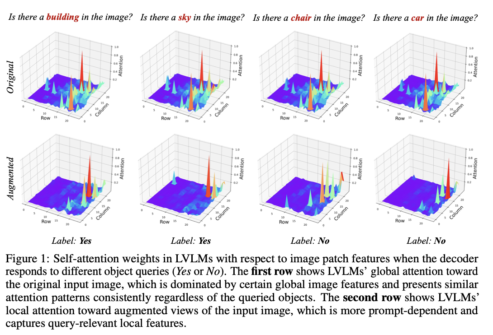
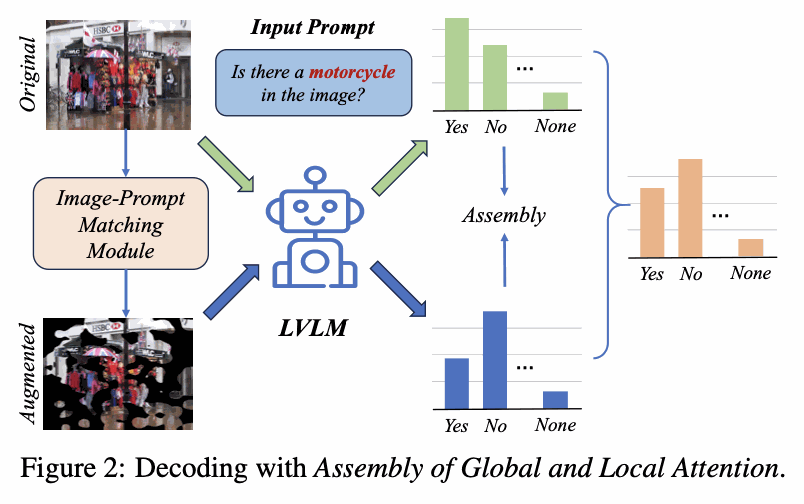
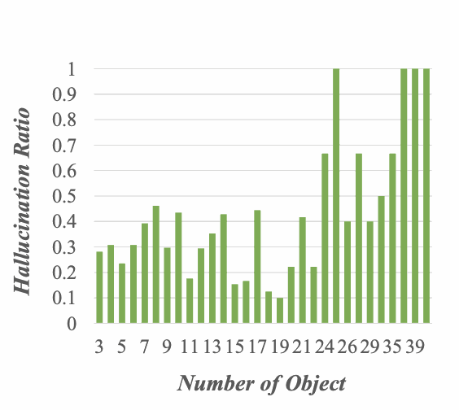
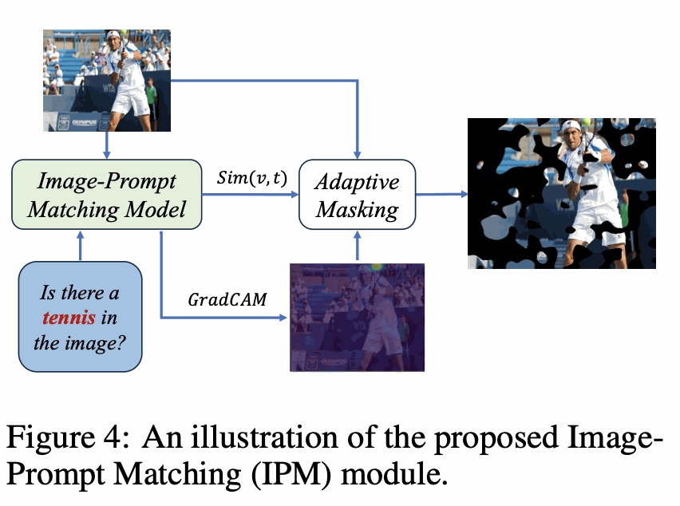
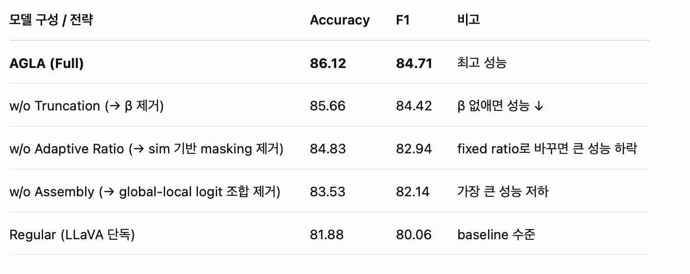

# AGLA — Mitigating Object Hallucinations in LVLMs with Assembly of Global and Local Attention

<sub>[🏠 Portfolio](https://github.com/heoneyzi) › [📚 Study](../../README.md) › [🌀 Hallucination](../README.md) › [02 · Paper reviews](README.md)</sub>

> 🗓️ 2025-06 · LVLM 객체 환각 스터디 (1단계, 팀 프로젝트)

LVLM이 질문과 관련 없는 global 이미지 특징만 보고 환각 발생

→ attention이 local, prompt-relevant features에 부족하기 때문으로 생각

→  Global (생성용) + Local (구분용) feature를 동시에 조합 (AGLA)

학습 필요없음!

<p align="center"></p>

원래는 무엇을 물어보든 Image에는 비슷하게 어텐션이 걸린다. → 내용과 무관하게 같은 곳에 집중한다는 의미

AGLA는 Prompt-Aware하다는 의미임

Prompt-relevant 정보를 반영한 “local attention”을 추가하여, 기존의 global attention 기반 생성 과정에 보완을 줘서, object hallucination을 줄이자는 아이디어

<p align="center"></p>

<p align="center"><sub>그림처럼 마스킹을 해서 나온 값을 이용하겠다는 의미</sub></p>

**3 Preliminary Study**

<table><tr>
<td align="center" width="33%"><br><sub>복잡한 이미지일수록 더 환각이 발생함.</sub></td>
<td align="center" width="33%"><br><sub>자주 같이 등장(co-occurrence)하는 객체들에서 더 많이 환각이 발생함.</sub></td>
<td align="center" width="33%"><br><sub><br>실제 있는 객체와 없는 객체를 물었을 때 차이가 없음.<br></sub></td>
</tr></table>

표2의 이유:

LVLM이 **pretraining 과정에서 학습한 통계적 연관성**(e.g., road ↔ car)에 의존하기 때문. → prompt에 없는데도 **연관 객체를 생성해버리는 bias**로 이어짐.

→ 이것들이 AGLA의 이유 → 우리도 비슷하지 않을까 하는 생각

**Image-Prompt Matching (IPM) 방법 (이것도 이해해봐야함… 아직 못 읽어봄)**

<p align="center"></p>

---

**4. Correlation Score 계산**

$`\text{cor}(j) = \frac{1}{H} \sum_{i=1}^{M} \sum_{h=1}^{H} \max\left( 0, \frac{\partial \text{sim}(v, t)}{\partial C_{ij}^{(h)}} \right) C_{ij}^{(h)}`$

결국 이 식이 핵심이다.

패치의 중요도를 전체 유사도가 미치는 영향으로 파악해버리기

- attention 값이 클수록, 그리고 그것이 유사도에 더 민감하게 작용할수록 → cor 점수가 높음

즉, 텍스트-이미지 유사도에 **직접적이고 강한 영향을 준 patch**를 식별

---

**5. Adaptive Masking**

sim(v,t)/2 의 비율로 마스킹

반영 방법

둘의 로짓을 일정 비율로 합해서 softmax를 한 것을 그대로 쓰는 것이 아니라

$`\mathcal{V}{\text{token}}(y{<i}) = \{ y_i \in \mathcal{V} : p_\theta(y_i | v, t, y_{<i}) \ge \beta \max_w p_\theta(w | v, t, y_{<i}) \}p_{\text{AGLA}}(y_i | \cdot) = 0,\quad \text{if } y_i \notin \mathcal{V}{\text{token}}(y{<i})`$

를 통해서 걸러냄 → 원본 이미지에 대한 강한 믿음

Ablation

<p align="center"></p>

디코딩 방법

<p align="center"></p>

---

## 코드 파헤치기

augmentation.py에 IPM에 대한 내용이 있음

```python
from lavis.models.blip_models.blip_image_text_matching import compute_gradcam

with torch.set_grad_enabled(True):
    gradcams, _ = compute_gradcam(
        model=model,
        visual_input=image,
        text_input=question,
        tokenized_text=tokenized_text,
        block_num=6
    )
```

여기서 gradcam에 대한 내용이 이루어짐을 알 수 있었다.

나머지 내용은 나온 값을

---
<sub>[← DAMRO — Dive into the Attention Mechanism of LVLM to Reduce Object Hallucination](01_damro.md) · [📑 목차](../README.md) · [ARGUS — Vision-Centric Reasoning with Grounded Chain-of-Thought →](03_argus.md)</sub>
