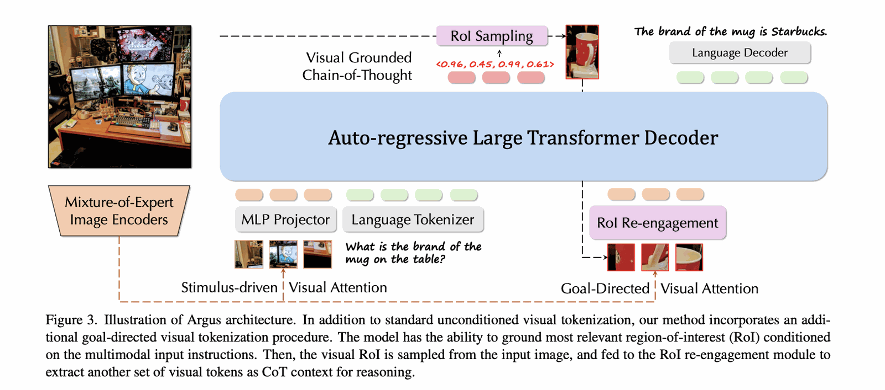

# ARGUS — Vision-Centric Reasoning with Grounded Chain-of-Thought

[🏠 Portfolio](https://github.com/heoneyzi) › [📚 Study](../../README.md) › [🌀 Hallucination](../README.md) › [02 · Paper reviews](README.md)

> 🗓️ 2025-06 · LVLM 객체 환각 스터디 (1단계, 팀 프로젝트)

> 1. **Mixture-of-Expert Image Encoders**
>     - 다양한 이미지 인코더 (예: CLIP, EVA-02 등)를 혼합하여 사용.
>     - 이미지 전체를 시각적으로 인코딩하고, **Stimulus-driven Visual Attention**을 수행.
> 2. **MLP Projector + Language Tokenizer**
>     - 이미지 feature를 텍스트 공간으로 사상(mapping).
>     - 언어 입력(“What is the brand of the mug on the table?”)도 동시에 토크나이징됨.
> 3. **Visual Grounded Chain-of-Thought**
>     - 언어 프롬프트에 따라, **중요한 시각 영역을 ROI Sampling** 모듈이 추출 (예: 머그컵 박스).
>     - → ROI 점수 예: \<0.96, 0.45, 0.99, 0.61\>처럼 객체의 중요도/정확도를 내포한 스코어와 함께 박스가 샘플링됨.
> 4. **RoI Re-engagement**
>     - 선택된 박스를 crop하여 다시 시각 인코더에 넣음 (or attention 기반으로 샘플링된 시각 토큰만 사용).
>     - 이때는 **Goal-Directed Visual Attention**으로, “머그컵의 브랜드”라는 질문 목적에 맞춰 초점을 다시 맞춤.
>     - 즉, **시각적 Chain-of-Thought 맥락**을 구성함.
> 5. **Auto-regressive Large Transformer Decoder**
>     - 이제 이 재활용된 시각 토큰들과 기존 텍스트 토큰을 합쳐 최종적으로 답변을 생성.
>     - 예: "The brand of the mug is Starbucks."

---
[← AGLA — Mitigating Object Hallucinations in LVLMs with Assembly of Global and Local Attention](02_agla.md) · [📑 목차](../README.md) · [5/28 미팅 (할루시네이션) →](../03_research_log/01_meeting_0528.md)
