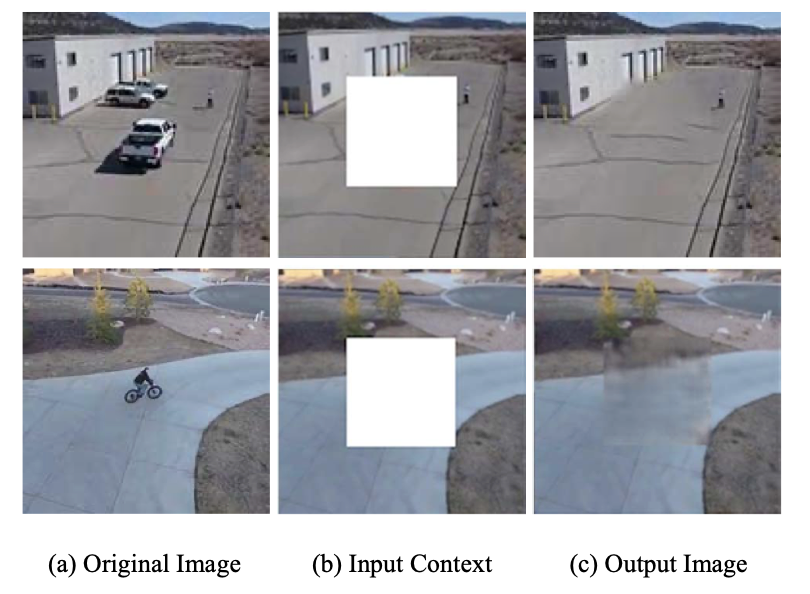

# Background Feature 다루기

[🏠 Portfolio](https://github.com/heoneyzi) › [📚 Study](../../README.md) › [🌀 Hallucination](../README.md) › [03 · Research log](README.md)

> 🗓️ 2025-05 · LVLM 객체 환각 스터디 (1단계, 팀 프로젝트)

일단 현재 방향성

→ 사람처럼 이미지를 확인하자 → 다양한 object를 segment해서 각 타겟에 맞는 B-box에 어텐션을 시키자 → 그럼 타겟 object가 아닌 (즉, 배경)에 대한 특징은 어떻게 사용할까?

---

Background (배경) = Target Object를 제외한 영역.

왜 중요할까? → 다양한 이미지에 대한 맥락 파악 가능

& 우리의 Task에선 Target Object에 집중해야하는지 척도로 삼을 가능성도 있다고 생각

DE-ViT

[arxiv.org](https://arxiv.org/pdf/2309.12969)

Classification 문제였기 때문에 Class에 대한 학습으로 다가갔고, 배경에 맞는 배경 클래스를 따로 처리함 (길, 차도, 신호등 등등). 이에 맞는 특징을 따로 클래스마다 학습. 배경 클래스에 들어가지 않는 정보는 외면.

→ 사실상 우리가 생각하는 것과 다름. 외면된 아이에 대한 정보가 필요한 것

Motion Background Modeling with Context-Encoder

[mengyu-fu.github.io](https://mengyu-fu.github.io/pdfs/AIPR2016.pdf?utm_source=chatgpt.com)

배경을 복원해서 사용해버림

**Scene (Background) Embedding**

---
[← 5/28 미팅 (할루시네이션)](01_meeting_0528.md) · [📑 목차](../README.md) · [6/5 피드백 — “사람처럼 보자” 아이디어 →](03_feedback_0605.md)
