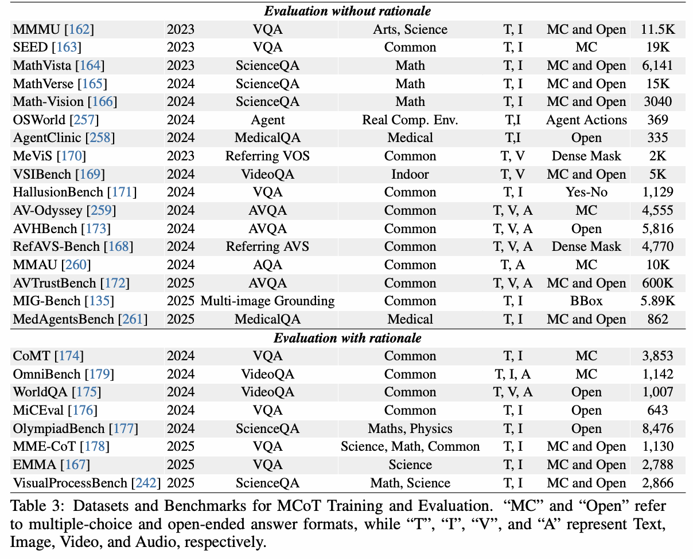

# MCoT (Multimodal Chain-of-Thought)

[🏠 Portfolio](https://github.com/heoneyzi) › [📚 Study](../../README.md) › [🌀 Hallucination](../README.md) › [04 · MCoT & attention](README.md)

> 🗓️ 2025-09 · Multimodal CoT · 어텐션 기법 조사 (2단계)

MCoT 학습·평가용 데이터셋/벤치마크 표 (원 논문 Table 3 캡처)

- 📄 [MCoT 후보](02_mcot_candidates.md)

- 📄 [AttentionMap 후보](03_attention_map_candidates.md)

- 📄 [MLLM Hallucination Benchmark](04_mllm_hallucination_benchmarks.md)

---
[← Attention Map 시각화](../03_research_log/07_attention_map_visualization.md) · [📑 목차](../README.md) · [MCoT 후보 →](02_mcot_candidates.md)
