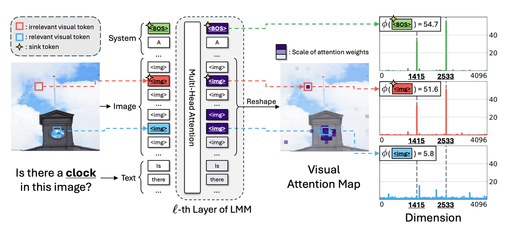
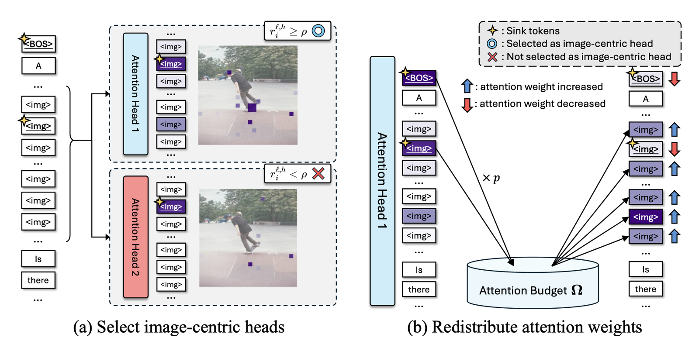
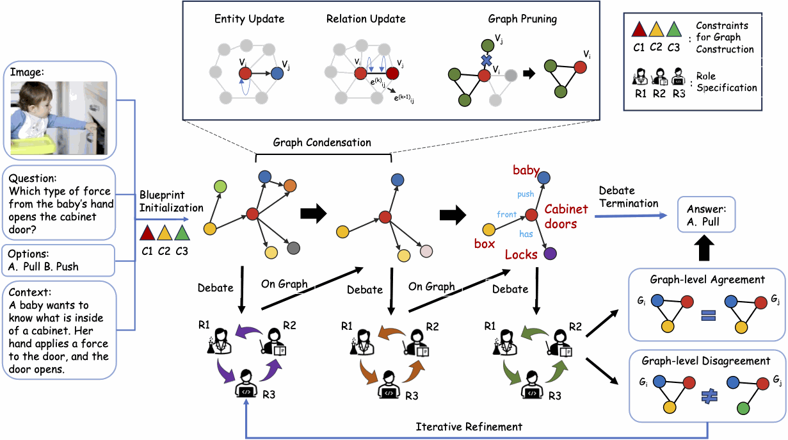
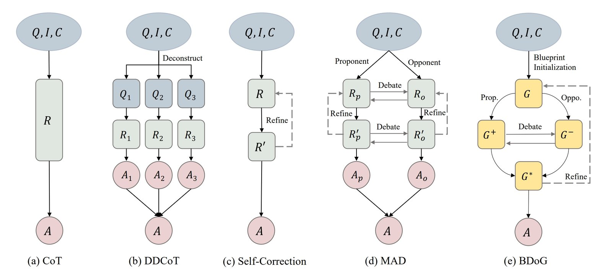
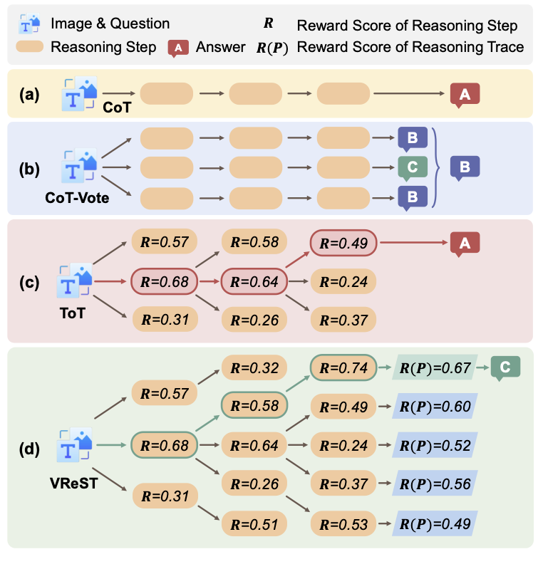
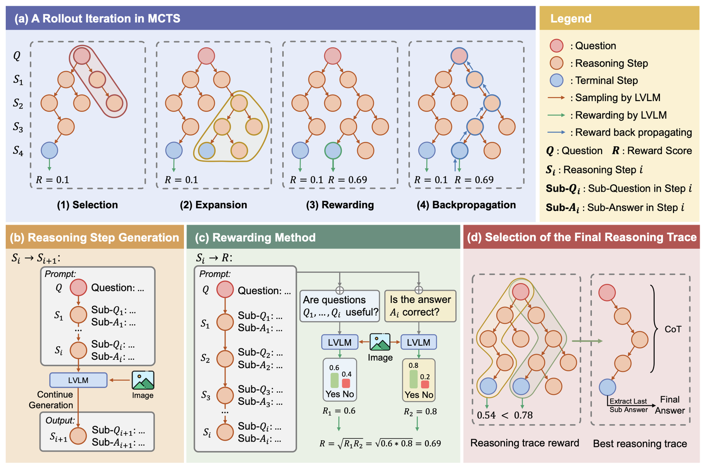
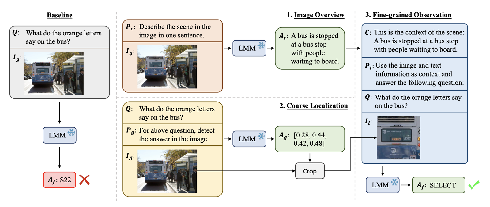
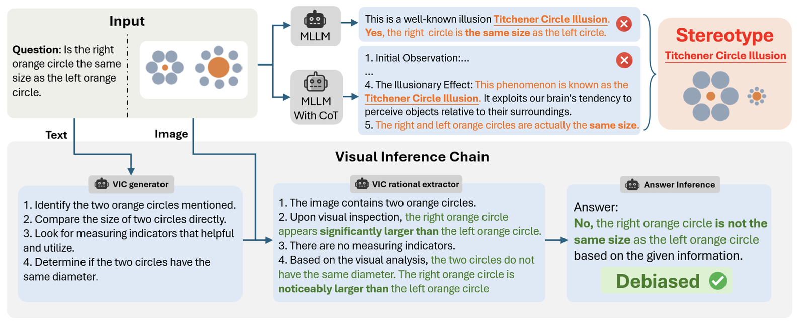
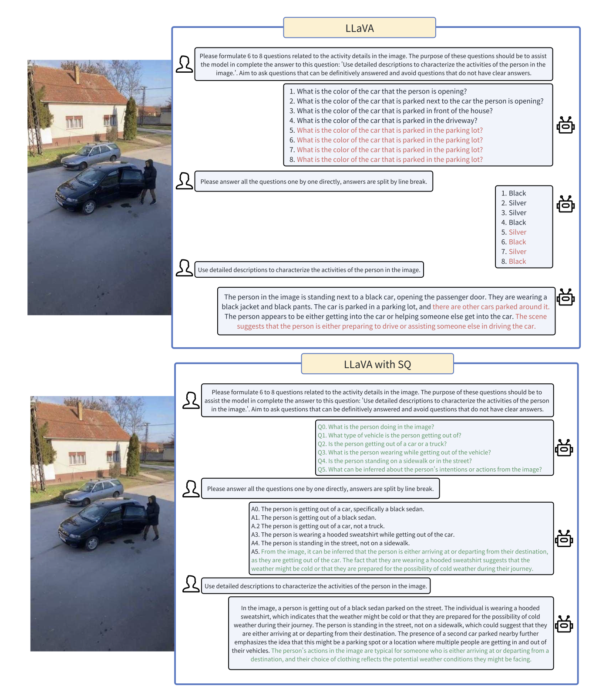

# MCoT 후보

[🏠 Portfolio](https://github.com/heoneyzi) › [📚 Study](../../README.md) › [🌀 Hallucination](../README.md) › [04 · MCoT & attention](README.md)

> 🗓️ 2025-09 ~ 2026-01 · Multimodal CoT · 어텐션 기법 조사 (2단계)

marine

[arxiv.org](https://arxiv.org/pdf/2402.08680)

$`P_{final}=Softmax(Logits_{original}+λ⋅Mask_{grounding})`$

SAM으로 Masking 진행. → word bag을 만들고 그 속에서 단어가 나오려고 할때만 masking 진행

---

SEE WHAT YOU ARE TOLD: VISUAL ATTENTION SINK IN LARGE MULTIMODAL MODELS

<a href="https://arxiv.org/pdf/2503.03321">SEE WHAT YOU ARE TOLD: VISUAL ATTENTION SINK IN LARGE MULTIMODAL MODELS, 2025.03, Seil Kang</a>

Attention Sink에 대한 최근 연구에서는 흥미로운 결과를 보여줬습니다.  위 그림을 보시면, 텍스트의 Sink 토큰이 초록 박스로 있는 것을 확인할 수 있습니다. 그리고 빨강 박스로 입력 쿼리와 무관한 이미지의 Sink 토큰을 볼 수 있죠. 그리고 입력 쿼리와 연관된 파란 박스의 토큰도 확인할 수 있습니다.

하필 특정 이미지 토큰에 많은 어텐션이 걸리는 이유를 Massive Activation으로 설명했습니다. 트랜스포머 내부의 Feed-Forward Network(FFN)를 통과하면서, 특정 시각 토큰들의 은닉 상태 값의 일부 차원이 비정상적으로 큰 절댓값을 가지게 된 것입니다. 위에서 말한 것처럼 어텐션 연산은 Q와 K의 내적을 기반으로 이루어지는데, K 벡터의 특정 차원 값이 비정상적으로 크다면 내적 결과 역시 커지게 됩니다. 이는 또 지수 함수를 사용하는 Softmax 함수에서 증폭되고, 비정상적으로 큰 값을 할당받는 결과로 나옵니다.

이를 통해서 Sink 토큰을 찾아낼 수 있었습니다. 이를 통해서 연구는 잘못된 곳으로 흐르는 어텐션을 차단하고, 이를 유의미한 토큰으로 돌려야 한다고 생각했습니다. 그래서 VAR(Visual Attention Redistribution)을 제안합니다.

VAR의 핵심은 Visual Sink Token을 Visual Non-sink Token으로 재분배하는 것입니다. 학습 없이 Inference 단계에서 어텐션만 건드리는 것으로 조작되기 때문에 부작용을 최소화하기 위해서 조심스러운 단계로 토큰을 건드립니다.

먼저 이미지 중심 헤드(Image-Centric Heads)를 식별합니다. 트랜스포머는 각자 다른 역할을 수행하는 많은 어텐션 헤드를 사용합니다. 어떤 헤드는 문법적 관계를 파악하기 위한, 또 어떤 헤드는 문맥 유지를 위한 용도 등으로 사용됩니다. 모든 헤드를 다 건드리는 것은 언어 능력을 훼손할 수 있기 때문에, 이미지 처리에 특화된 헤드를 집중했습니다. 특정 레이어에서 20%이상의 이미지 어텐션 스코어를 가진 헤드로 이를 정의했습니다.

이후에 선별된 이미지 중심 헤드 내에서, 어떤 토큰이 Sink 토큰인지 판별해야 합니다. Sink 토큰을 텍스트 입력과 무관하게 항상 높은 활성화를 보이는 토큰들을 싱크로 정의하였습니다. Attention Score 분포를 분석하여 상위 k%에 해당하거나, 특정 임계값을 초과하는 토큰 중 의미적 연관성이 낮은 토큰들을 식별했습니다.

마지막으로 Sink 토큰이 식별되면, 일반 시각 토큰(Visual Non-sink Tokens)에게 재분배합니다. 이를 Recycling Attention Budget이라 부릅니다. 먼저 Sink 토큰에 해당하는 위치의 Score는 마스킹이나 음의 무한대로 보내버려서 억제합니다. 그리고 그 이후에 Softmax를 다시 계산하거나, 혹은 기존 Sink 토큰의 확률 질량을 기존 비율에 맞게 비례적으로 더해주는 과정으로 이루어집니다.

---

**A Picture Is Worth a Graph: A Blueprint Debate Paradigm for Multimodal Reasoning**

[arxiv.org](https://arxiv.org/pdf/2403.14972)

<table><tr>
<td align="center" width="50%"></td>
<td align="center" width="50%"></td>
</tr></table>

MLLM에게 그래프(대상 + 관계)를 그려달라함. → Multi Agent로 풀기.

---

[arxiv.org](https://arxiv.org/pdf/2506.08691)

<table><tr>
<td align="center" width="50%"></td>
<td align="center" width="50%"></td>
</tr></table>

ToT와 유사하지만 이미지 친화적으로 새로운 보상설계를 통해서 전진

---

[arxiv.org](https://arxiv.org/pdf/2404.09797)

LMM에게 크롭해라고 시켜서 답을 함께 얻기

---

[arxiv.org](https://arxiv.org/pdf/2411.12591)

Text+ Image에서 Text를 보고 먼저 무엇에 집중해야할지를 고르고 시작함.

---

DetToolChain: A New Prompting Paradigm to Unleash Detection Ability of MLLM

[arxiv.org](https://arxiv.org/pdf/2403.12488)

SAM이나 DINO를 통해 더 잘 Object Detection을 하게 하는 Prompting 기법

---

[arxiv.org](https://arxiv.org/pdf/2406.09403)

sketchpad를 만들어줆 → 중간과정에서 그리기를 해줌으로써 미세한 위치를 잡음

---

[arxiv.org](https://arxiv.org/pdf/2501.02964)

SubQ로 나눠서 성능 향상

---

DCoT: Dual Chain-of-Thought Prompting for Large Multimodal Models

[proceedings.neurips.cc](https://proceedings.neurips.cc/paper_files/paper/2023/file/108030643e640ac050e0ed5e6aace48f-Paper-Conference.pdf)

expert Ai 사용

---
[← MCoT (Multimodal Chain-of-Thought)](01_mcot_overview.md) · [📑 목차](../README.md) · [AttentionMap 후보 →](03_attention_map_candidates.md)
