# AttentionMap 후보

[🏠 Portfolio](https://github.com/heoneyzi) › [📚 Study](../../README.md) › [🌀 Hallucination](../README.md) › [04 · MCoT & attention](README.md)

> 🗓️ 2025-10 · Multimodal CoT · 어텐션 기법 조사 (2단계)

<b><b>Accelerating Multimodal Large Language Models by Searching Optimal Vision Token Reduction</b></b>

[arxiv.org](https://arxiv.org/pdf/2412.00556)

- No Github
- No Training
- 키포인트: LLaVA에서 그냥 셀프어텐션을 크로스어텐션으로 본다. & 1 layer을 제외하면 사실 중요한 비전 토큰의 순서는 변하지 않더라.

<b><b>MMFuser: Multimodal Multi-Layer Feature Fuser for Fine-Grained Vision-Language Understanding</b></b>

[arxiv.org](https://arxiv.org/pdf/2410.11829)

- Yes Github
- Yes Training
    
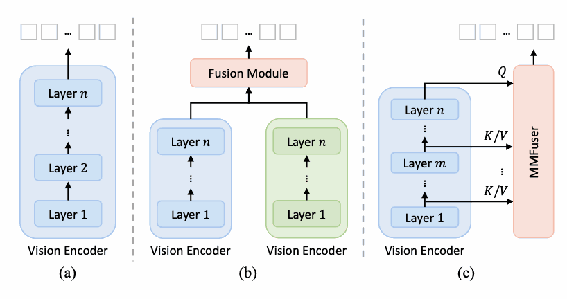

- 키포인트: LLaVA에서 CLIP ViT에서 Deep layer = Query이고 Shallow/Intermediate = Key/Value로 학습. 왜? Shallow layer은 Edge, Texture, 작은 패턴을 가짐 

<b><b>ATP-LLaVA: Adaptive Token Pruning for Large Vision Language Models</b></b>

[arxiv.org](https://arxiv.org/pdf/2412.00447)

- Yes Github
- Yes Training
    
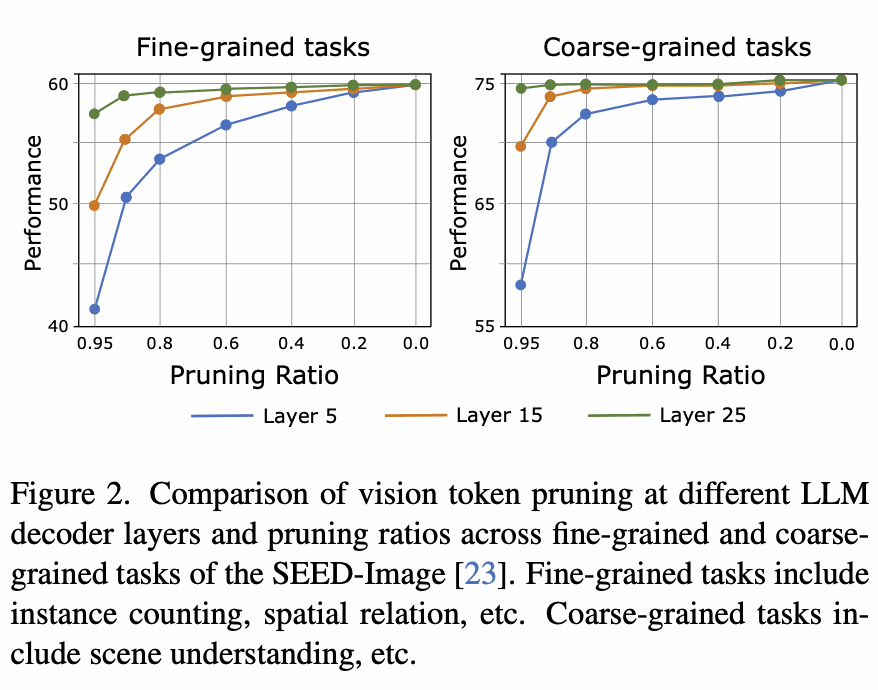

- 키포인트: 효과적인 메모리 사용을 위해, 선택된 이미지 토큰만 사용. 동일 레이어에서 비전 토큰이 다른 비전 토큰들로부터 받는 어텐션과 텍스트 토큰들이 해당 비전 토큰에 주는 주의 어텐션의 평균을 점수로 사용해서 학습함. 아무튼 shallow일 때 너무 많이 자르는 것은 성능에 큰 영향을 줌. 이는 1번 논문과 맥락적으로 일치     

<b><b>MITIGATING MODALITY PRIOR-INDUCED HALLUCI- NATIONS IN MULTIMODAL LARGE LANGUAGE MOD- ELS VIA DECIPHERING ATTENTION CAUSALITY</b></b>

[arxiv.org](https://arxiv.org/pdf/2410.04780)

- Yes Github
- No Training
    
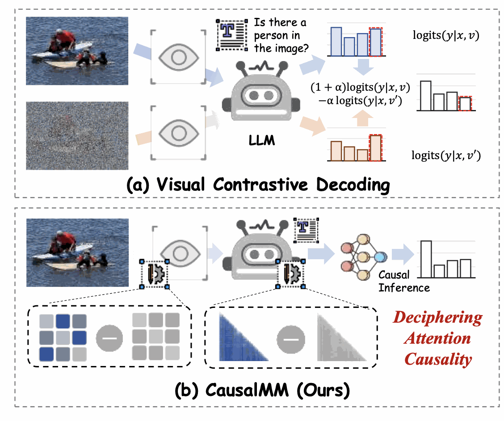

- 키 포인트
    - Modality Prior이 MLLM의 환각으로 이어진다.
    - 대개 어텐션의 변화에 신경을 쓰는 정도지만, 더 깊이 이해하려는 연구 → 애초에 이미 어텐션에서부터 편향이 있다는 뜻. 그것의 변화량은 이미 훼손된 상태에서 찾는것이라는 의미.
    - SCM이라는 모듈을 사용하는데, 보정을 통해서 modality prior의 영향을 차단하고, Attention이 Output에 직접 미친 효과만 계산하는 것.
    - **반사실(counterfactual) 어텐션 맵**을 만듦.
        - 무작위(random), 균등(uniform), 역전(reversed), 셔플(shuffled) 등으로 attention을 개입(intervention)시킴.
        - 이렇게 얻은 반사실 출력(logits)과 실제 출력(logits)을 비교.
        - 둘의 차이에서 순수한 attention 인과효과(ACE, average causal effect)를 추출해서 로짓을 최종적으로 선정해서 사용함.

<b><b>AGLA: Mitigating Object Hallucinations in Large Vision-Language Models with Assembly of Global and Local Attention</b></b>

[arxiv.org](https://arxiv.org/pdf/2406.12718v1)

- Yes Github
- No Training
- 키포인트: [AGLA 리뷰 노트](../02_paper_reviews/02_agla.md)
- Gradcam 사용해서 필요부분만 보는 연구

<b><b>Paying More Attention to Image: A Training-Free Method for Alleviating Hallucination in LVLMs</b></b>

[arxiv.org](https://arxiv.org/pdf/2407.21771)

- Yes Github
- No Training
    
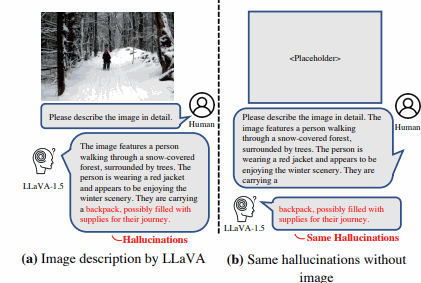

-  강제로 계수를 조정하자

→ [PAI 정리: 할루시네이션 개요 ①](../01_foundations/02_visual_attention_overview.md)

<b><b>DAMRO: Dive into the Attention Mechanism of LVLM to Reduce Object Hallucination</b></b>

[aclanthology.org](https://aclanthology.org/2024.emnlp-main.439.pdf)

- No Github
- No Training

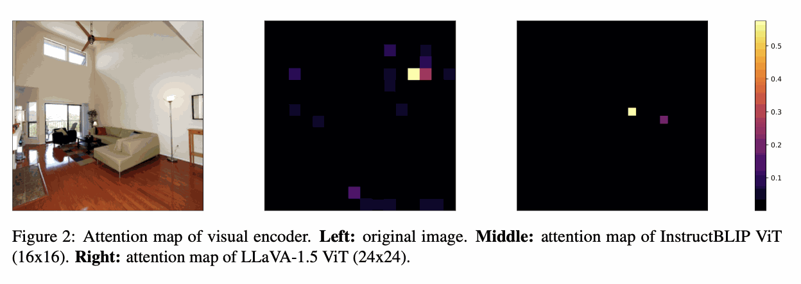

- Vision Transformer(ViT)의 분류 토큰(CLS)을 활용해 이미지 배경에 대한 비정상적으로 높은 어텐션을 갖는 이상치 토큰들을 식별하고 필터링한다 . 이렇게 찾아낸 배경 토큰들은 생성 과정에서 **부정적 토큰**으로 간주되어 텍스트 생성 시 그 영향력이 제거된다
- 이는 **추론 단계의 대조적 디코딩 전략**으로, 시각적으로 중요하지 않은 정보에 모델이 집중하는 현상을 억제한다.
- **자기 어텐션** 기반 ViT 인코더와 LLM 디코더의 **크로스 모달 어텐션** 분포를 분석한다. 저자들은 **시각 인코더와 LLM 디코더의 어텐션 분포가 일치하며** 둘 다 이미지의 대상 객체보다 특정 배경 패치들에 집중하는 현상을 발견했습니다 . 이러한 **배경 정보에 대한 과도한 어텐션**을 **ViT의 CLS 토큰 어텐션 맵**으로 감지하고, 디코더에서는 해당 토큰들의 기여를 제거하여 환각을 줄였다.

<b><b>Mitigating Hallucinations in Multi-modal LLMs via Image Token Attention-Guided Decoding</b></b>

[aclanthology.org](https://aclanthology.org/2025.naacl-long.75.pdf)

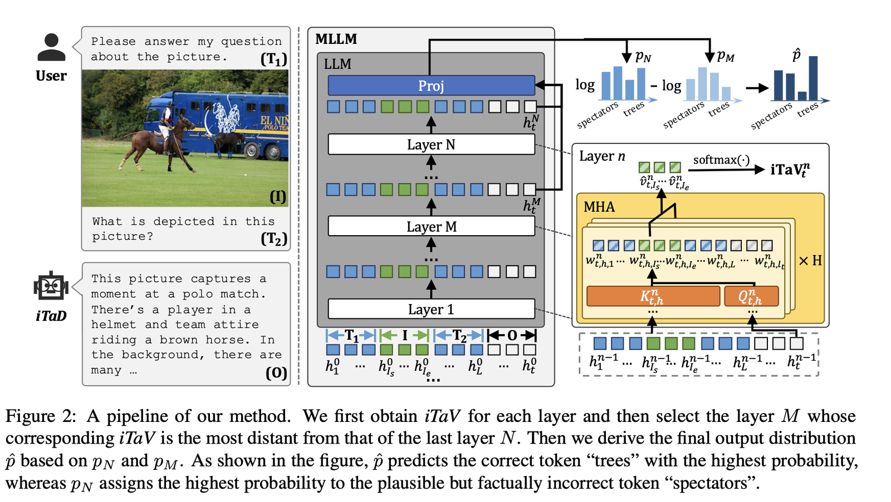

- Hallucination이 생겼다? → 이미지를 잘 보지 못했다. → 이를 레이어별로 해석
- 레이어가 깊어질수록 이미지를 잘 안보는 경향이 있음. + 결국 마지막까지 통합된 마지막 레이어의 이미지에 대한 어텐션을 바꿔보자. 가장 마지막 레이어와 가장 다른 이미지 어텐션을 가진 레이어를 섞어서 새로운 이미지에 대한 어텐션을 만든다.

<b><b>Mitigating Object Hallucinations in Large Vision-Language Models via Attention Calibration</b></b>

[arxiv.org](https://arxiv.org/pdf/2502.01969)

- No Github
- Yes Training
- 공간적 위치와 고정적으로 상관되는 Spatial Perception Bias (SPB) 에 신경씀
    - UAC -  **의미 없는 이미지**를 입력해 모델이 생성하는 **비전 토큰 주의맵**에서 **SPB**를 추정. 이 편향으로부터 **행렬 C**를 계산. 추론 시 **각 디코더 계층의 Self-Attention에서 비전 토큰 슬라이스에 C를 곱하는 형태**로 **주의 가중**을 **균등화**.
    - DAC - 대조학습으로 동적 작용해서 로짓 조정

<b><b>Don’t Miss the Forest for the Trees: Attentional Vision Calibration for Large Vision Language Models</b></b>

[arxiv.org](https://arxiv.org/pdf/2405.17820)

- Yes Github
- No training

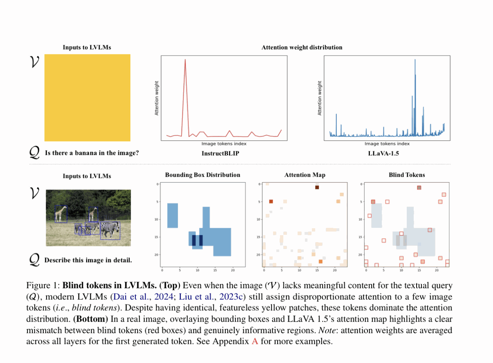

- 몇몇 튀는 토큰들이 있다. 이 토큰을 임의의 이미지를 통해 잡아낸 뒤에 그것을 제거하고 실험을 진행하니 환각 현상이 줄었다.
    - 이미지를 많이 보는 몇 레이어만 선택해서 그 중에서 튀는 토큰을 잡을 수 있게 한다.

<b><b>MAP: Mitigating Hallucinations in Large Vision-Language Models with Map-Level Attention Processing</b></b>

[www.arxiv.org](https://www.arxiv.org/pdf/2508.01653)

- No github
- No Training

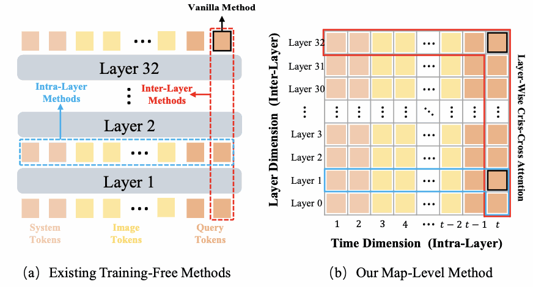

- 레이어별로도 특징을 찾고, 각 토큰을 레이어마다 보면서 특징도 찾는다.
- 특정 수식을 사용해서 변화점을 감지하고, 로젯을 더욱 잘 표현하게 바꾼다

<b>DO YOU KEEP AN EYE ON WHAT I ASK? MITIGATING MULTIMODAL HALLUCINATION VIA ATTENTION-GUIDED ENSEMBLE DECODING</b>

[openreview.net](https://openreview.net/pdf?id=ziw5bzg2NO)

- No Github
- No Training
    
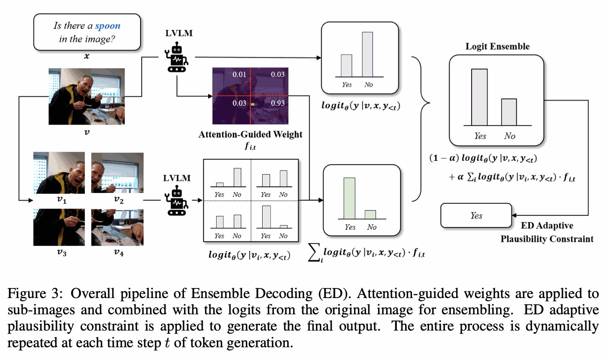

- 키포인트
    - 이미지의 정교화된 어텐션맵을 얻자
    - 이미지를 그리드 형태로 몇 개를 잘라서 이를 라바를 태워서 세밀회된 패치 내에서 특징을 얻게 하고, 이를 본래 이미지의 어텐션맵과 합하여 최종적인 로짓을 구한다.
    - 이때 사용하는 레이어는 최종 레이어 부근 몇개를 사용하는게 제일 좋았다고 함.

<b><b>Mitigating Hallucination in Large Vision-Language Models via Adaptive Attention Calibration</b></b>

[arxiv.org](https://arxiv.org/pdf/2505.21472v2)

- Yes Github
- No Training
    
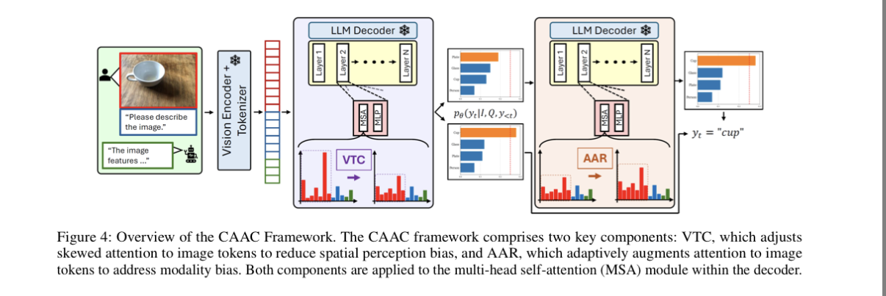

- 키포인트
    - 우리와 맞게 긴 텍스트 추출하는 테스크에 집중 → langauge prior에 집중하는 모습
    - 먼저 특정 토큰에 집중된다는 것은 그냥 정규화시켜버림…(VTC 단계)
        - 앞쪽 레이어만 하는게 효과적이었다
    - Language Prior이 일어난다는 것은 모델의 신뢰도를 사용. 신뢰도가 낮다? 그러면 그냥 전체적인 이미지 어텐션을 높여버림
        - 모든 레이어

<b><b>Mitigating Hallucination for Large Vision Language Model by Inter-Modality Correlation Calibration Decoding</b></b>

[arxiv.org](https://arxiv.org/pdf/2501.01926)

- Yes Github
- No Training
- 키포인트
    - 텍스트-이미지의 어텐션 값이 잘못된 경우에 집중
    - 텍스트와 이미지 어텐션 값에서 세게 걸린것만 두고 나머지를 마스킹하고, 남은 것의 Value를 평균내고 이를 사용한것과 contrastive decoding (CMVED)
    - 라바의 구조상 텍스트 뒤에 이미지토큰이 붙기 때문에, 텍스트가 가까운 이미지 토큰에 어텐션이 많이 걸리는 문제점읗 해결하고자 함→ 위치 인덱스를 정규화 시키기 + 그리고 이를 원래꺼랑 합침 (CDAR)
        - 첫 레이어에만 썻다는데, 개입 최소화에다가 컨텐츠의 맥락을 얻는데 힘쓴다는 의미라고 함

<b>SEE WHAT YOU ARE TOLD: VISUAL ATTENTION SINK IN LARGE MULTIMODAL MODELS</b>

[arxiv.org](https://arxiv.org/pdf/2503.03321)

- No Github
- No training
    
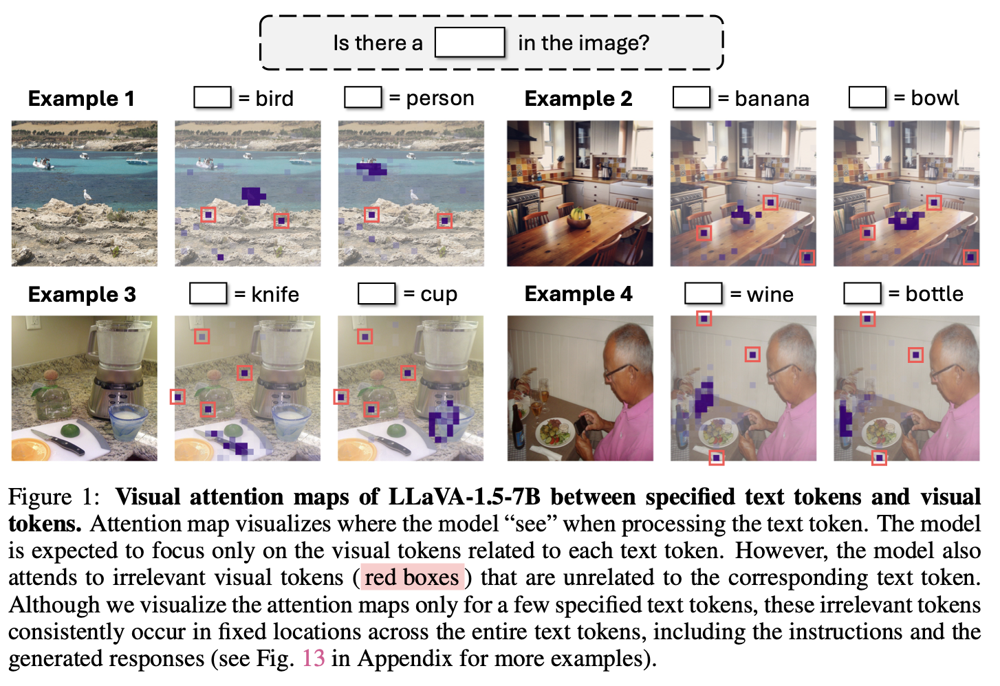

- 키포인트
    - 별 의미없이 어텐션을 잡아먹는 토큰을 제거하자
    - 무엇을 보던 튀는 sink token을 찾기 → 단순 전체 양 중에 비율이 특정 임계값 이상일때
    - 모든 head는 안됨 → 성능이 0으로 감
        - 시각을 많이 보는 헤드만 고르자 → 시각 어텐션의 합이 0.2 이상일때 & 그중 sink의 비율 고려
        - 이로 로짓 재분배

<b>Attention Prompting on Image for Large Vision-Language Models</b>

[www.ecva.net](https://www.ecva.net/papers/eccv_2024/papers_ECCV/papers/04374.pdf)

- No Github
- No Training
    
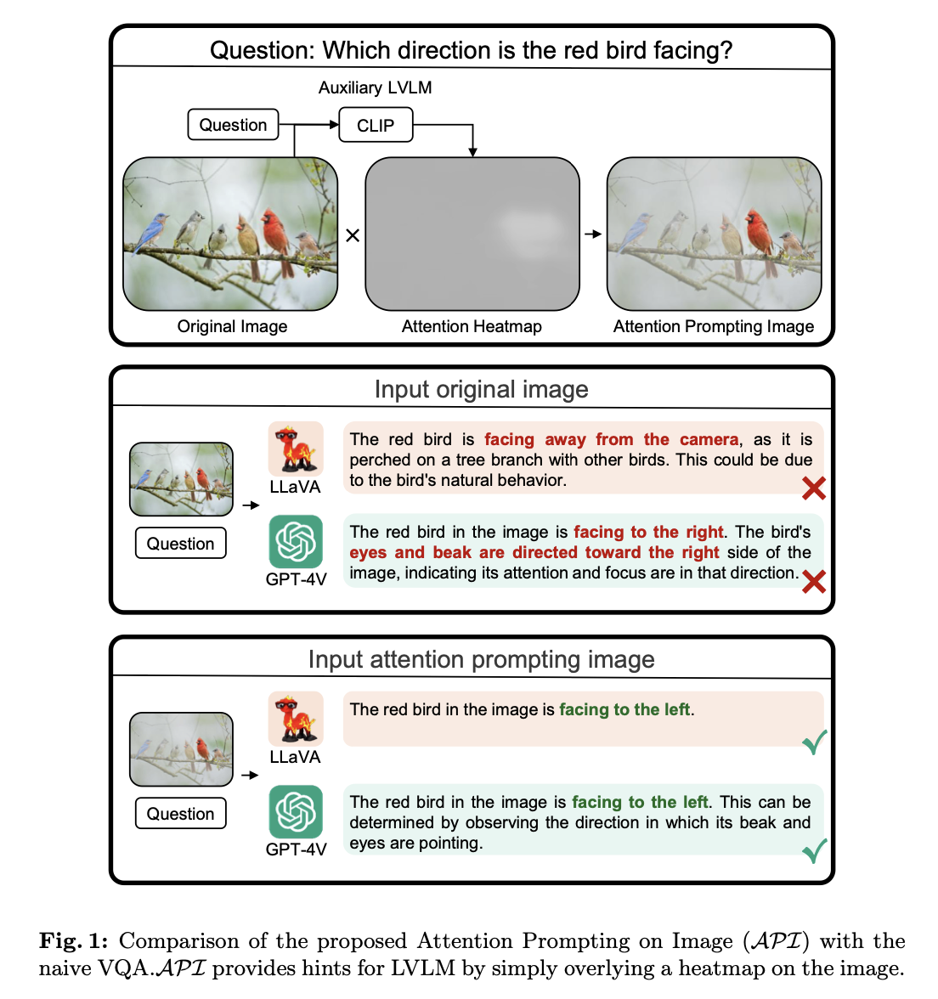

- 키포인트
    - text aware 한 heatmap을 만들자.
    - CLS 토큰을 사용 → 패치별 중요도
        - 각 패치가 각 레이어에서 CLS에 주는 영향성을 구하고 이를 text와 유사도를 구함
        - 배경도 억제하고 보완하며 히트맵을 만들고 이를 원 이미지와 결합

 

 

---
[← MCoT 후보](02_mcot_candidates.md) · [📑 목차](../README.md) · [MLLM Hallucination Benchmark →](04_mllm_hallucination_benchmarks.md)
