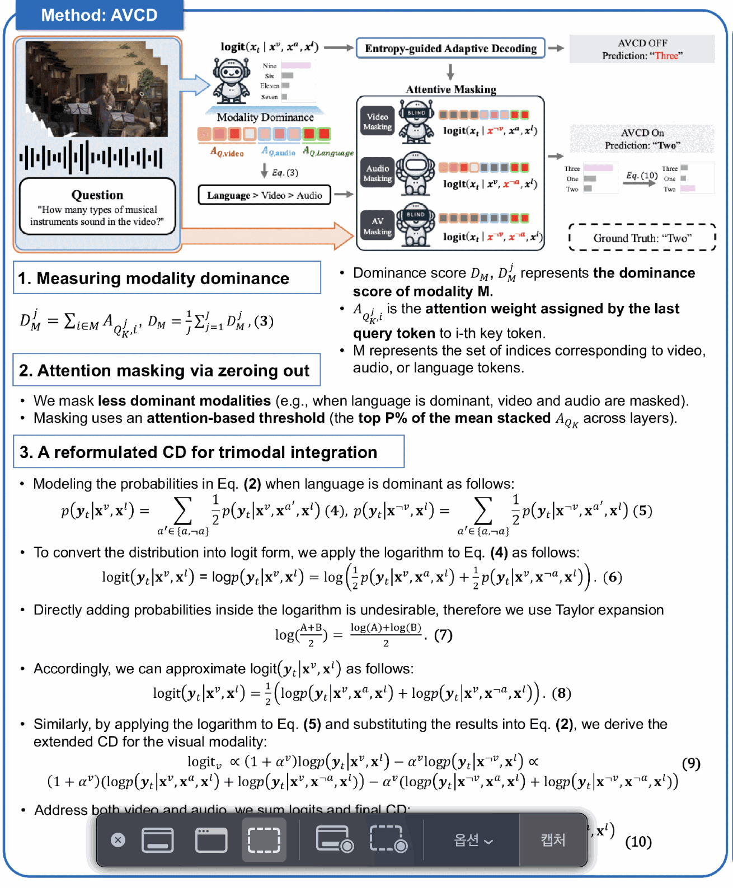
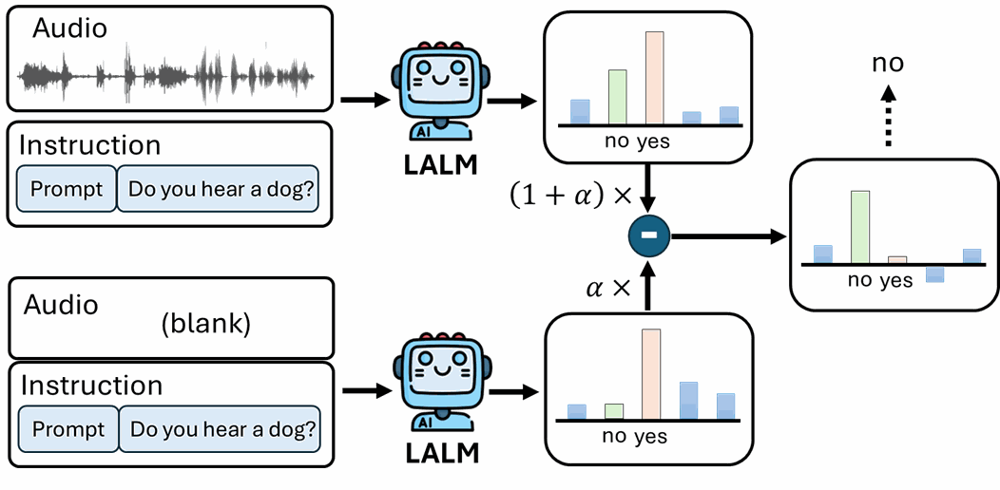
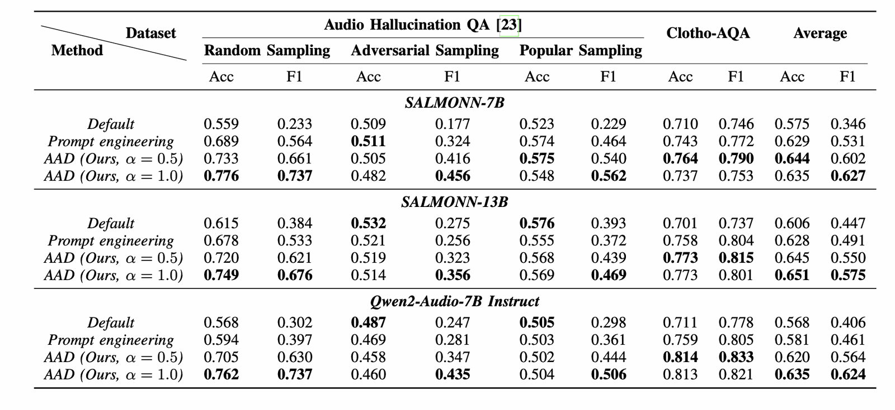

# Video-Audio LLM Hallucination — AVCD 분석과 방향 전환

[🏠 Portfolio](https://github.com/heoneyzi) › [📚 Study](../../README.md) › [🌀 Hallucination](../README.md) › [05 · Audio-visual](README.md)

> 🗓️ 2026-01 · Audio-Visual LLM 환각 (3단계)

결국 비전에서 벗어나자.

→ 비디오(Vision+Audio)를 사용할 것이냐? or 오디오를 사용할 것이냐?

1. 비디오를 사용하자

핵심: V-A-L의 비율을 어떻게 정할 것인가?

[NeurIPS Poster AVCD: Mitigating Hallucinations in Audio-Visual Large Language Models through Contrastive Decoding](https://neurips.cc/virtual/2025/loc/san-diego/poster/119986)

해당 논문은 Contrastive Decoding을 염두해서 사용

원래 모델을 돌려서 각각 L,V,A의 어텐션 비율을 측정한다.

다음 토큰 생성시 L\>\>V,A라면 환각일 가능성이 높다고 간주 → 어텐션 차이만큼 V와 A에 각각 점수를 더 부여.

각각 마스킹을 진행함. V마스킹, A마스킹, VA마스킹 (마스킹은 많이 나온 어텐션의 특정 P%를 0으로 만드는 행위로 zeroing함)→ 그 이후에 위에 줬던 점수만큼 곱해서 Negative로 사용하기

그래서 원래의 값에서 Negative를 빼서 로짓을 생성함

이 와중에 그럼 모델을 4번 돌리는 게 맞냐하는 의문이 드는데… 이들은 Confidence가 너무 높으면 Pass하기

→ 이렇게 해서 안나올 수가 없는 구조;; 모델도 4번 돌리고 하이퍼파라미터도 몇개여

#### AVLLM 평가

- **MUSIC-AVQA**:
    - **특징**: 악기 연주 영상과 오디오를 포함하며, "영상의 어떤 악기에서 이 소리가 나는가?"와 같이 **오디오와 비주얼의 정렬(Alignment)** 능력을 집중적으로 테스트합니다.
    - **평가 요소**: 비디오와 오디오 데이터가 일치하는지, 두 모달리티를 동시에 이해하고 있는지를 측정합니다.
- **AVHBench (Audio-Visual Hallucination Benchmark)**:
    - **특징**: Audio-Visual LLM의 **환각 현상**을 전문적으로 측정하기 위해 설계된 벤치마크입니다.
    - **평가 요소**: 모델이 존재하지 않는 소리를 들었다고 하거나, 보이지 않는 사물을 언급하는지 등을 정교하게 평가합니다. 'AVHBench-Cap'은 캡셔닝(설명) 능력에서의 환각을 별도로 점수화한 것으로 보입니다.

---

#### 일반 비디오 QA 데이터셋 (Video-LLMs 평가)

| 데이터셋 | 영상 특징 | 주요 질문 내용 |
|---|---|---|
| **MSVD-QA** | 약 10\~20초 내외의 짧은 유튜브 클립 | 주로 사물, 동작, 사람에 대한 직접적인 질문 |
| **ActivityNet-QA** | 평균 2분 정도의 긴 영상 | 복잡한 인간의 활동 및 사건의 흐름에 대한 추론 |

내 생각

- 질문 자체에 오디오냐 비디오냐 하는 느낌이 많이 있을 것 같음. 그래서 이를 활용하자. 질문 분석을 하자.
- Layer 단에서 건드리기?
1. Audio를 사용하자

[Reducing Object Hallucination in Large Audio- Language Models via Audio-Aware Decoding](https://arxiv.org/html/2506.07233v1)

가장 기본적인 Contrastive Decoding임에도 불구하고 2025년 하반기에 나옴 (오히려 개꿀일지도)

그닥 큰 연구가 나온 게 많이는 없는 것 같음.

벤치마크를 봐도 그럼…!

#### **① Audio Hallucination QA (\[23\])**

이 벤치마크는 Kuan et al. (2024)의 "Understanding Sounds, Missing the Questions" 논문에서 제안된 **오디오 객체 존재 여부 판별** 데이터셋입니다. AudioCaps 데이터셋의 오디오를 기반으로 "이 오디오에 \[객체\] 소리가 있나요?"라는 Yes/No 질문을 던집니다.

특히 할루시네이션의 원인을 분석하기 위해 세 가지 **샘플링 전략**을 사용했습니다:

- **Random Sampling:** 오디오에 없는 객체를 무작위로 뽑아 질문합니다. (가장 쉬움)
- **Adversarial Sampling (대조 샘플링):** 실제 들리는 객체와 훈련 데이터에서 자주 함께 등장하지만, **현재 오디오에는 없는** 객체를 뽑습니다. (예: 개 짖는 소리가 들릴 때 '풀밭'이나 '공'이 있냐고 질문). 모델이 오디오보다 문맥적 연관성(Prior)에 의존하는지 테스트합니다.
- **Popular Sampling:** 전체 데이터셋에서 가장 자주 등장하는 객체(예: 배경 소음, 말소리 등)를 뽑아 질문합니다. 모델의 통계적 편향을 테스트합니다.

#### **② Clotho-AQA**

Lipping et al. (2022)이 구축한 일반적인 오디오 질의응답 데이터셋입니다. 할루시네이션 측정용이 아니라, 제안한 방법(AAD)이 <b>일반적인 오디오 이해 능력(General QA)</b>을 떨어뜨리지 않는지 검증하기 위한 '성능 유지용' 지표로 사용되었습니다.

→ 나의 아이디어: 노이징을 단계별로 주자

---

2024년 Survey 논문 기준이지만,

V-L은 어느정도 선방을 하지만 A-L이 엉망이다. → 그래서 VAL이 다 들어간 경우는 A의 비율에 따라 환각의 정도가 정해진다.

그냥 전체적으로 Audio에 대한 연구가 주로 된 경우가 없다는 것을 확인할 수 있었음…

---
[← MLLM Hallucination Benchmark](../04_mcot_attention/04_mllm_hallucination_benchmarks.md) · [📑 목차](../README.md) · [video-SALMONN 2+ 환경 세팅 →](02_video_salmonn2plus_setup.md)
