# Video · Audio Hallucination 논문 서베이

[🏠 Portfolio](https://github.com/heoneyzi) › [📚 Study](../../README.md) › [🌀 Hallucination](../README.md) › [05 · Audio-visual](README.md)

> 🗓️ 2026-03 · Audio-Visual LLM 환각 (3단계)

### Video 관련

[SEASON: Mitigating Temporal Hallucination in Video Large Language Models via Self-Diagnostic Contrastive Decoding](https://arxiv.org/html/2512.04643v1)

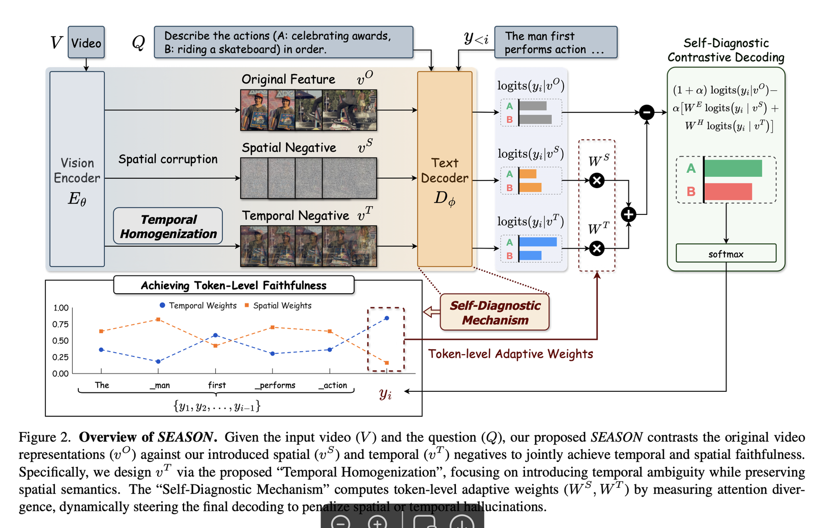

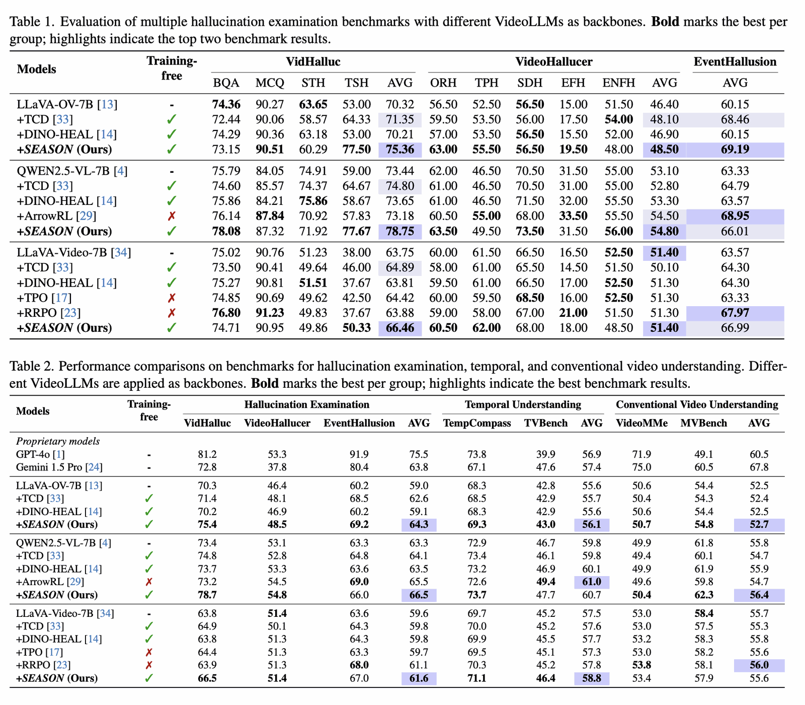

> - 비디오의 각 프레임을 평균해서 구한 것은 전체 동영상을 대변할 수 있다?  - season에서는 각 레이어별로 구해서 프레임 크기 \* 레이어 개수로 구했음
> - 비디오에서 노이즈를 씌우면 공간정보 대비 시간정보를 더 많이 남겼다고 할 수 있다?
> - 특정 레이어들의 패치마다 멀티 헤드 어텐션을 평균내고, 이 패치를 모두 합한 점수가 하나의 프레임에 대한 중요도를 의미할 수 있을까? - 70% 5번 프레임, 25% 13번 프레임 등으로 말이다. - season에서는 20,21,22,23번 레이어의 평균을 썼는데, 흥미로운 대목이었다.
> - 8프레임만 사용해도 되는걸까? -season은 그렇게 함

---

[Mitigating Hallucinations in Video Large Language Models via Spatiotemporal-Semantic Contrastive Decoding](https://arxiv.org/html/2601.22574v1)

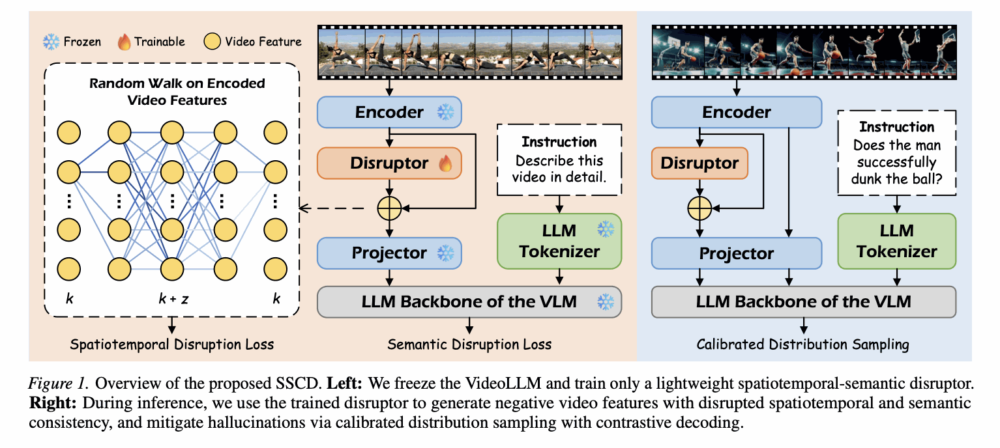

Disruptor → 최대한 hallucination이 많이 생기게 만들자

---

[VIDHALLUC: Evaluating Temporal Hallucinations in Multimodal Large Language Models for Video Understanding](https://pmc.ncbi.nlm.nih.gov/articles/PMC12408113/)

---

[https://arxiv.org/pdf/2409.16597](https://arxiv.org/pdf/2409.16597)

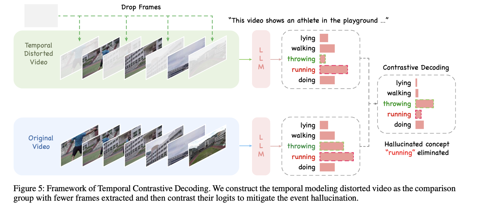

---

### Audio 관련

[Reducing Object Hallucination in Large Audio- Language Models via Audio-Aware Decoding](https://arxiv.org/html/2506.07233v1)

가장 기본적인 Contrastive Decoding임에도 불구하고 2025년 하반기에 나옴 (오히려 개꿀일지도)

---

Audio Contrastive Decoding (ACD)

[arxiv.org](https://arxiv.org/pdf/2603.09232)

오디오 모델에서 발생하는 환각은 지식의 부족보다는 오디오 무시가 주원임

그럼에도 무작정 기법(CD)을 적용하기 전에, **사용 중인 모델의 에러 프로필(Error Profile)을 먼저 분석해야 한다.**

- **CD로 치료 가능한 증상:**
    - **Audio Blindness (오디오 맹목):** 모델이 오디오 신호를 무시하고 텍스트 데이터의 편향에만 의존해 답변하는 경우.
    - **Uncertainty (불확실성):** 모델이 확신이 없어 갈팡질팡하다가 엉뚱한 토큰을 뱉는 경우.
- **CD로 치료하기 어려운 증상:**
    - **Flawed Reasoning (추론 오류):** 오디오는 잘 알아들었지만, 논리적으로 생각하는 과정 자체가 틀린 경우.
    - **Confident Misassertions (근거 없는 자신감):** 모델이 아주 확고하게 틀린 정보를 사실인 양 주장하는 경우 (강한 환각).

> - 가우시안 필터
> - 스펙트로그램 제거
> - 다운샘플링

**Adaptive Audio Steering (AVS)**

[arxiv.org](https://arxiv.org/pdf/2603.06854)

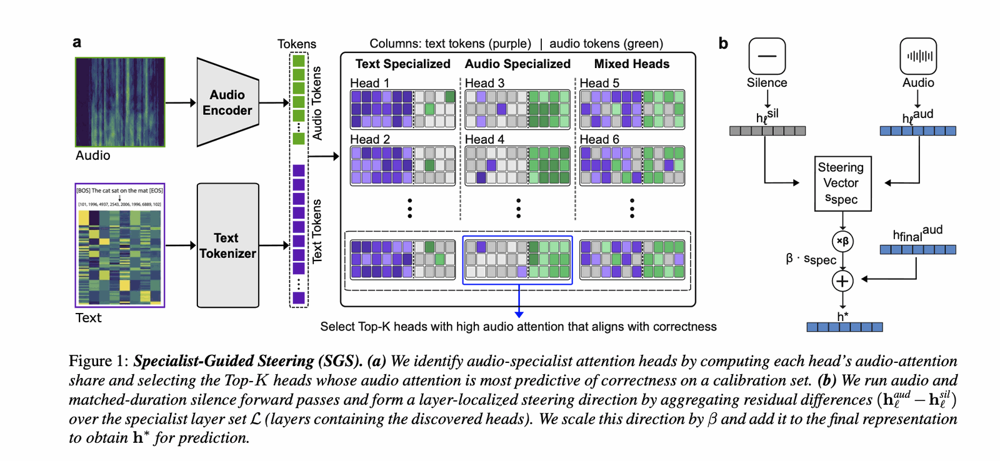

Functional Attention Control

[arxiv.org](https://arxiv.org/pdf/2510.10285v1)

### 벤치마크

[VidHalluc 논문 PDF (PMC)](https://pmc.ncbi.nlm.nih.gov/articles/PMC12408113/pdf/nihms-2082863.pdf)

videohalluc

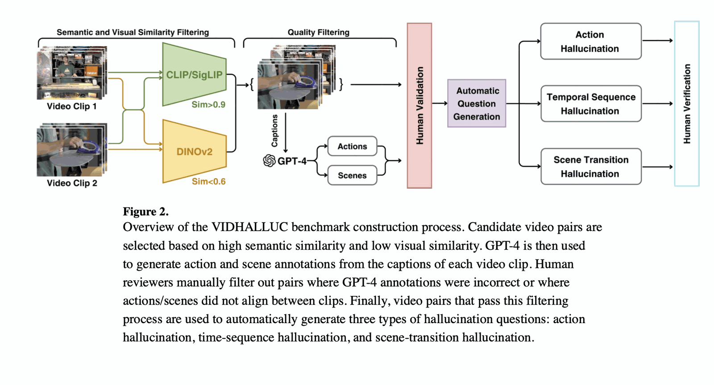

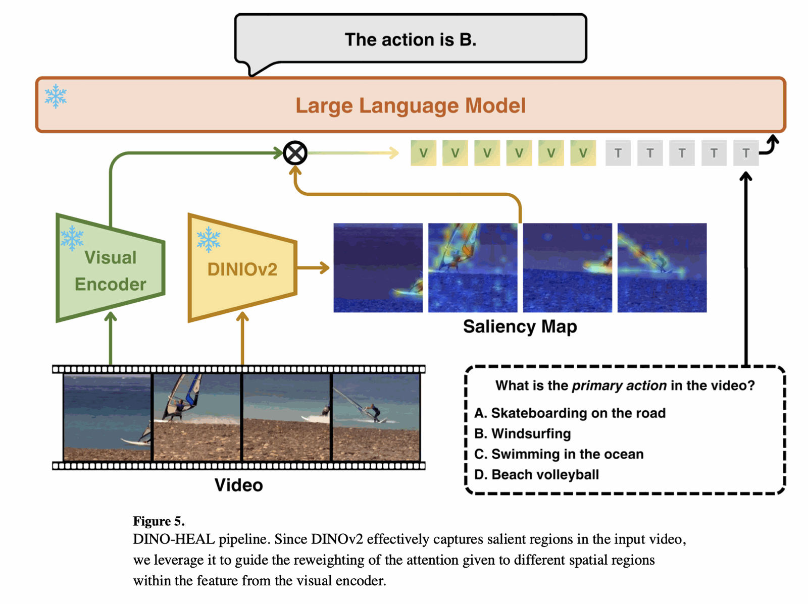

---

[openreview.net](https://openreview.net/pdf?id=YxsfxAvJv4)

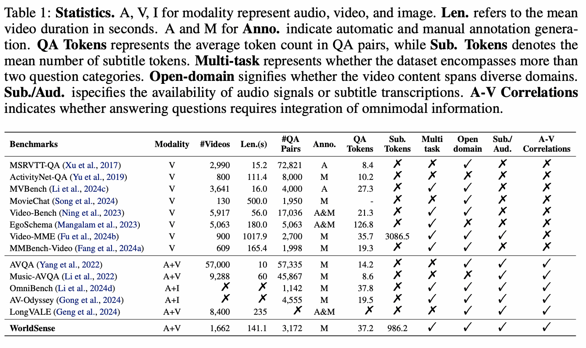

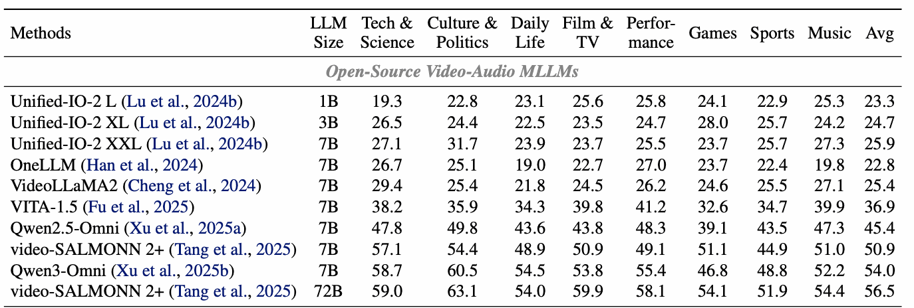

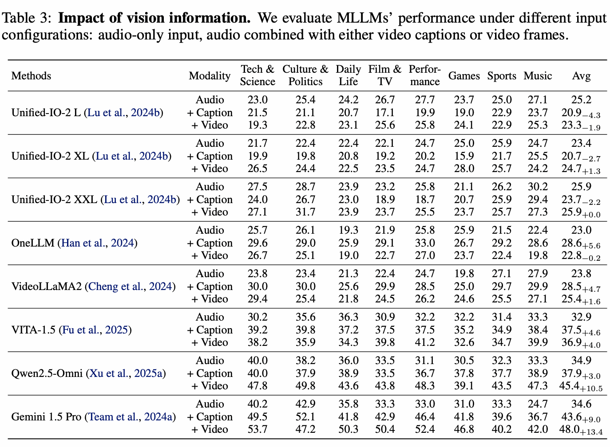

[kuanhuggingface/Audio-Hallucination_Object-Attribute_CompA-Attribute · Datasets at Hugging Face](https://huggingface.co/datasets/kuanhuggingface/Audio-Hallucination_Object-Attribute_CompA-Attribute)

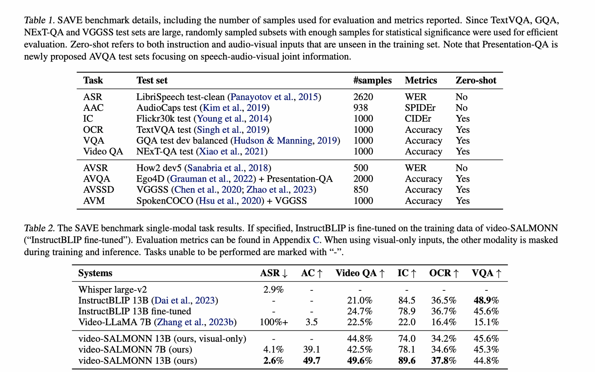

어떤 장면이 나올때 들리는 소리 / 어떤 소리가 들릴 때 나오는 장면

[arxiv.org](https://arxiv.org/pdf/2501.02135)

---
[← video-SALMONN 2+ 1차 결과 분석](03_video_salmonn2plus_first_results.md) · [📑 목차](../README.md) · [Benchmark Ideation →](05_benchmark_ideation.md)
