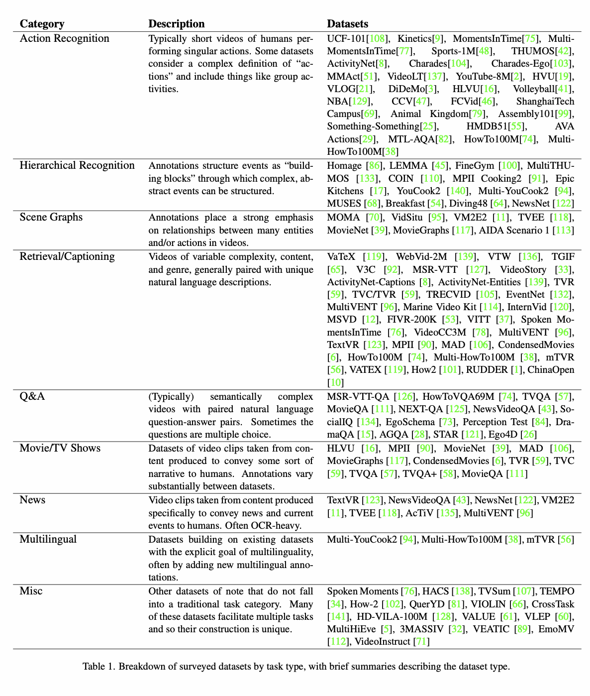
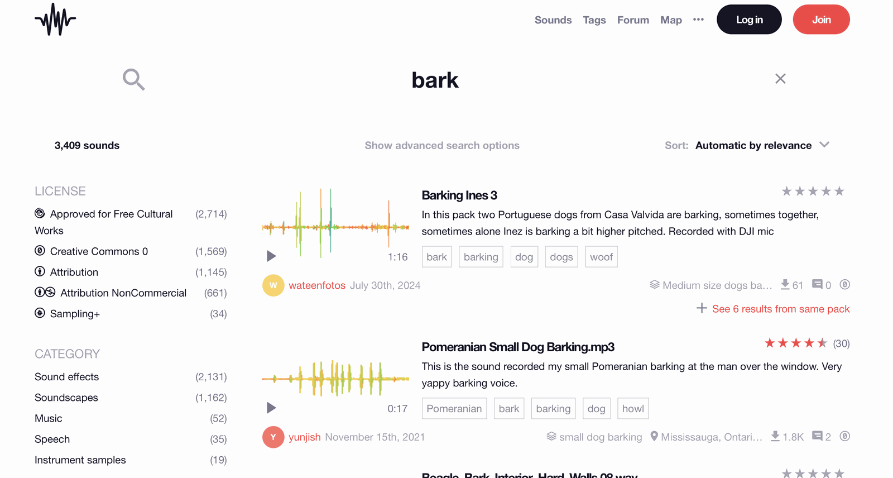
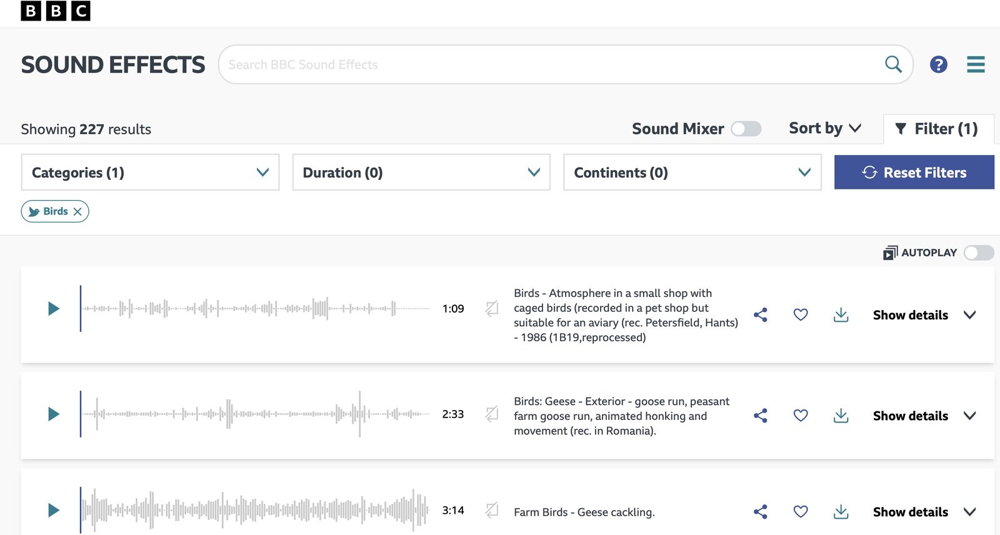
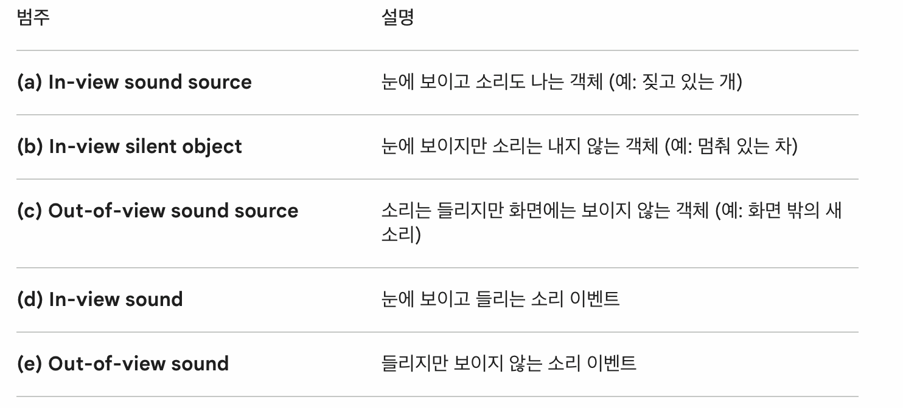

# 오디오 관련 데이터셋

<sub>[🏠 Portfolio](https://github.com/heoneyzi) › [📚 Study](../../README.md) › [🌀 Hallucination](../README.md) › [05 · Audio-visual](README.md)</sub>

> 🗓️ 2026-04 · Audio-Visual LLM 환각 (3단계)

[friedrichor/ActivityNet_Captions · Datasets at Hugging Face](https://huggingface.co/datasets/friedrichor/ActivityNet_Captions/viewer/default/train)

1분정도

[GitHub - Guaranteer/VidSTG-Dataset: This repository provides the dataset introduced by the paper "Where Does It Exist: Spatio-Temporal Video Grounding for Multi-Form Sentences"](https://github.com/Guaranteer/VidSTG-Dataset?tab=readme-ov-file)

\{"vid": "7771650716", "fps": 29.97002997002997, "frame_count": 1805, "used_segment": \{"begin_fid": 0, "end_fid": 479\}, "width": 640, "height": 360, "subject/objects": \[\{"tid": 0, "category": "dog"\}, \{"tid": 1, "category": "dog"\}, \{"tid": 2, "category": "dog"\}, \{"tid": 3, "category": "dog"\}, \{"tid": 4, "category": "car"\}, \{"tid": 5, "category": "car"\}, \{"tid": 6, "category": "adult"\}, \{"tid": 7, "category": "adult"\}\], "used_relation": \{"subject_tid": 0, "object_tid": 7, "predicate": "in_front_of", "begin_fid": 0, "end_fid": 390\}, "temporal_gt": \{"begin_fid": 0, "end_fid": 390\}, "captions": \[\{"description": "a dog with a rope walks in front of a man in white.", "type": "object", "target_id": 0\}\], "questions": \[\{"description": "what walks in front of a man in white?", "type": "object", "target_id": 0\}\]\}…

[PRIOR](https://prior.allenai.org/projects/charades)

c077 12.10 18.00;c079 11.80 17.30;c080 13.00 18.00;c076 11.80 17.50;c075 5.40 14.10

10\~35초정도

가정적인 동영상들

[friedrichor/DiDeMo at main](https://huggingface.co/datasets/friedrichor/DiDeMo/tree/main/raw_data)

"description": "we pan right off the mural and on to a building.", "reference_description": "", "times": \[\[3, 3\], \[3, 3\], \[3, 3\], \[3, 4\]\], "video": "52198061@N00_4175539607_26669cd634.mp4",

[gijs/tacos-captioning · Datasets at Hugging Face](https://huggingface.co/datasets/gijs/tacos-captioning)

What is happening in this audio from 0.0s to 24.4s?

[https://zenodo.org/records/7269161](https://zenodo.org/records/7269161)

```
    "audio_id": "Yy1saVTXsKwc.wav",
    "tokens": "a dog whimpers and a woman briefly talks",
    "phrases": [
        {
            "phrase": "a dog whimpers",
            "start_index": 0,
            "end_index": 2,
            "segments": [
                [
                    0.437,
                    2.3810000000000002
                ],
                [
                    3.848,
                    10.02
                ]
            ]
        },
```

[arxiv.org](https://arxiv.org/pdf/2406.09646)

<p align="center"></p>

[Freesound - Search](https://freesound.org/search/?q=bark&f=&s=Automatic+by+relevance&si_tags=0&si_name=0&si_description=0&si_packname=0&si_sound_id=0&si_username=0&d0=0&d1=*&ig=0&r=0&g=1&dp=0&cm=0&mm=0)

<p align="center"></p>

[BBC Sound Effects](https://sound-effects.bbcrewind.co.uk/search?cat=Birds)

<p align="center"></p>

비슷한 논문

[arxiv.org](https://arxiv.org/pdf/2407.01851)

Alignment?

[arxiv.org](https://arxiv.org/pdf/2410.18325)

<p align="center"></p>

---
<sub>[← Benchmark Ideation](05_benchmark_ideation.md) · [📑 목차](../README.md) · [최신 AVLM 목록 →](07_latest_avlms.md)</sub>
