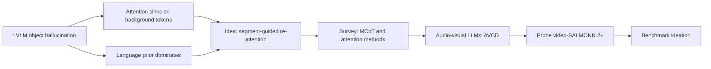

<sub>[🏠 Portfolio](https://github.com/heoneyzi) › [📚 Study](../README.md) › **Hallucination**</sub>

<div align="center">

# 🌀 Hallucination — when multimodal models report what isn't there

**Where does a multimodal LLM's attention go when it describes an object it cannot see, or a sound it never heard — and can we steer it back to the evidence?**


[📰 Newsletter #95](https://stib.ee/lq1I) · [📰 #114](https://stib.ee/eXmJ) · [📰 #125](https://stib.ee/7npK) · [🧪 Experiments](experiments/README.md) · [📑 Reading order](#-reading-order)

</div>

> [!TIP]
> **TL;DR** — About a year of study on why multimodal LLMs hallucinate, moving from attention-based fixes for object hallucination in image–text models (a May–Jun 2025 team project with Heejae Yang) to audio-visual LLMs. The folder holds 26 study notes in Korean (a survey, 3 paper reviews, meeting logs and Jiheon's own method ideas) plus two pilot experiments on video-SALMONN 2+. On 12 AVHBench videos the model called 4 of 6 mismatched audio–video pairs "matching". On 50 DAVE samples it scored 46 % on audio-visual alignment (chance 20 %), and on the 9 items whose answer was "none of the above" it never once chose that option.

<details>
<summary><b>🇰🇷 한국어 요약</b></summary>

멀티모달 LLM이 이미지·영상·소리에 없는 내용을 지어내는 할루시네이션(환각)을 약 1년 동안 파고든 스터디 기록입니다. 2025년 5–6월에는 팀원 양희재와 CVPR 제출을 목표로 LVLM의 객체 환각을 다뤘습니다. 어텐션이 배경 토큰에 쏠리는 문제(DAMRO)와 언어 사전지식(language prior)에 기대는 문제(AGLA 등)를 정리했고, 사람처럼 객체 단위로 훑어보도록 Segment 기반으로 어텐션을 재분배하는 아이디어를 직접 제안했습니다. 이후 Multimodal CoT·어텐션 조작 기법·환각 벤치마크를 조사했고, 2026년에는 오디오-비주얼 LLM으로 넘어가 AVCD(NeurIPS 2025)를 분석한 뒤 video-SALMONN 2+로 직접 실험했습니다. AVHBench 파일럿에서는 모델이 답을 고르는 순간 영상·소리보다 질문 텍스트에 훨씬 많은 어텐션을 주는 모습을 시각화했습니다. DAVE 50문항 평가에서는 '해당 없음'이 정답인 9문항에서 모델이 한 번도 '해당 없음'을 고르지 않았습니다. 비유하자면, 그림을 보지 않고 문제 문장만 읽고 그럴듯한 답을 찍는 학생을 관찰한 셈입니다. 노트는 원문(한국어) 그대로 두고, 읽는 순서와 요약을 이 README에 정리했습니다.

</details>

| | |
|---|---|
| **Period** | May 2025 – May 2026 (dated from note screenshots and script timestamps) |
| **Team** | Phase 1 (May–Jun 2025): Jiheon Kang with teammate Heejae Yang (양희재); the 5/28 meeting set CVPR as the target · Phases 2–3: individual study |
| **My role** | Wrote all notes; proposed the segment-guided "look like a human" attention idea (6/5 and 6/21 notes); set up video-SALMONN 2+ and wrote the AVHBench attention-logging and DAVE evaluation scripts |
| **Stack** | PyTorch · 🤗 Transformers / Datasets · video-SALMONN 2+ (Qwen2.5-VL backbone, Whisper audio encoder) · FlashAttention-2 · Liger kernels |
| **Status** | 🔬 Exploratory study, no paper. Both experiments are small pilots |

<p align="center"></p>
<p align="center"><sub>video-SALMONN 2+ 7B answers "Yes, they do match" for a <b>mismatched</b> audio–video pair (AVHBench 00402). At the answer token, last-layer attention goes mostly to the text prompt (green); video (red) rises only later, on object words. From <a href="05_audio_visual/03_video_salmonn2plus_first_results.md">note 22</a>.</sub></p>

## 🧭 Why it matters

Multimodal LLMs answer questions about pictures, videos and sounds, but they *hallucinate*: they mention objects that are not in the frame or sounds that were never played. An LVLM (large vision-language model) turns an image into tokens and lets a language model read them. When the language side dominates, the model answers from habit ("roads usually have cars") rather than from the evidence.

Attention (how much each generated word looks back at image, audio or text tokens) is a cheap, training-free lens on this. Most mitigation methods studied here (PAI, DAMRO, AGLA, VAR, AVCD) work by reshaping attention or contrasting output distributions at inference time. That makes attention the natural first thing to measure on a new model.

## 🗺️ Research arc



- **Phase 1 · LVLM object hallucination (team).** The team followed two explanations: vision-side attention sinks and a language-side prior. Both fed into Jiheon's proposal: attend to segmented objects the way a person scans a scene.
- **Phase 2 · Methods and benchmarks.** He triaged 16 attention-intervention papers by code availability and training need, collected 10 multimodal chain-of-thought (MCoT) methods, and listed 12 hallucination benchmarks.
- **Phase 3 · Audio-visual LLMs.** He analysed AVCD, measured where video-SALMONN 2+ attends (E1), evaluated it on DAVE (E2), and sketched a temporal audio–video benchmark.

## 🗓️ Timeline

| When | Phase | What happened | Notes |
|---|---|---|---|
| Oct – Nov 2024 | Prelude | [M3ID paper review](https://github.com/heoneyzi/Deep_Daiv/blob/main/Project/Multimodal/notes/01_m3id_hallucination_review/README.md) for the deep daiv. multimodal track | — |
| May – Jun 2025 | 1 · LVLM (team) | Survey and two overviews; DAMRO, AGLA and ARGUS reviews; meetings 5/28, 6/5, 6/12; ideation 6/21 | 1–15 |
| 2025-06-11 | Newsletter | [#95 "AI의 목격자 진술, 과연 믿을 수 있을까"](https://stib.ee/lq1I): LVLM hallucination types, causes, PAI | — |
| Sep 2025 – Jan 2026 | 2 · Methods | MCoT candidates, attention-map candidates, benchmark list | 16–19 |
| 2025-10-22 | Newsletter | [#114 "LVLM의 환각은 어떻게 측정할까?"](https://stib.ee/eXmJ): VCD, prompt-dependency measure, POPE, CHAIR | — |
| 2026-01-07 | Newsletter | [#125 "Attention Mechanism의 함정"](https://stib.ee/7npK): attention sinks and VAR (cf. the VAR write-up in note 17) | — |
| Jan 2026 | 3 · AV pivot | AVCD (NeurIPS 2025) analysed; audio-LLM hallucination | 20 |
| Mar 2026 | 3 · Probe | video-SALMONN 2+ set up; AVHBench attention probe; video/audio paper survey | 21–23 · [E1](experiments/E1_avhbench_attention/README.md) |
| ≈ Apr 2026 | 3 · Design | Temporal audio–video benchmark ideation; dataset scouting | 24–26 |
| May 2026 | 3 · Evaluate | DAVE 7-task evaluation, 50 samples | [E2](experiments/E2_dave_eval/README.md) |

## 📑 Reading order

**01 · Foundations** ([folder](01_foundations/README.md))

| # | Note | What it covers | Date |
|---|---|---|---|
| 1 | [MLLM hallucination survey](01_foundations/01_mllm_hallucination_survey.md) | Object, attribute and relation hallucination; causes across data, model, training and inference; evaluation and mitigation families | 2025-05 |
| 2 | [Overview ① Visual attention](01_foundations/02_visual_attention_overview.md) | How attention is wired in an LVLM; six attention interventions (PAI, DAMRO, PAINT, IMCCD, attention calibration, hallucination heads) with his critique | 2025-05 |
| 3 | [Overview ② Language prior](01_foundations/03_language_prior_overview.md) | Visual forgetting (TVC), attention-guided decoding, head suppression, OPERA, M3ID; AGLA marked as the key paper | 2025-06 |
| 4 | [Code hallucination (side track)](01_foundations/04_code_hallucination.md) | Reading-list stub for hallucination in code LLMs | — |
| 5 | [CodeHalu](01_foundations/05_codehalu.md) | Execution-based definition and a four-type taxonomy (mapping, naming, resource, logic) | — |

**02 · Paper reviews** ([folder](02_paper_reviews/README.md))

| # | Note | What it covers | Date |
|---|---|---|---|
| 6 | [DAMRO](02_paper_reviews/01_damro.md) | ViT and LLM attention both pile onto a few background "outlier" tokens; three critical questions of his own that seeded his idea | 2025-05 |
| 7 | [AGLA](02_paper_reviews/02_agla.md) | Prompt-aware local attention from Grad-CAM image–prompt matching, assembled with global attention; code walk-through | 2025-06 |
| 8 | [ARGUS](02_paper_reviews/03_argus.md) | Grounded visual chain-of-thought: ROI sampling and re-engagement | 2025-06 |

**03 · Research log**, LVLM team project ([folder](03_research_log/README.md))

| # | Note | What it covers | Date |
|---|---|---|---|
| 9 | [5/28 meeting](03_research_log/01_meeting_0528.md) | Kick-off with Heejae: CVPR target; split into ViT-side and LLM-side attention | 2025-05-28 |
| 10 | [Background features](03_research_log/02_background_features.md) | What to do with everything outside the segmented objects | 2025-05 |
| 11 | [6/5 feedback: "look like a human"](03_research_log/03_feedback_0605.md) | **His idea:** segment n objects plus the background, and let each token pick which of the n+1 parts to attend to | 2025-06-05 |
| 12 | [6/12 meeting](03_research_log/04_meeting_0612.md) | CoT for re-looking, keeping the story consistent, an LLM-only comparison, decoding choices | 2025-06-12 |
| 13 | [Ideation (6/21)](03_research_log/05_ideation_0621.md) | **His plan:** prompt-aware segment selection (after AGLA) and two triggers for re-injecting segments | 2025-06-21 |
| 14 | [To-do](03_research_log/06_todo.md) | Segmentation model, benchmark inference, box and class conditioning | — |
| 15 | [Attention-map visualisation](03_research_log/07_attention_map_visualization.md) | First try with VLM-Visualizer | — |

**04 · MCoT & attention** ([folder](04_mcot_attention/README.md))

| # | Note | What it covers | Date |
|---|---|---|---|
| 16 | [MCoT overview](04_mcot_attention/01_mcot_overview.md) | Entry page: MCoT benchmark table and links | 2025-09 |
| 17 | [MCoT candidates](04_mcot_attention/02_mcot_candidates.md) | 10 grounding and reasoning methods (MARINE, VAR attention sink, Blueprint Debate, DetToolChain, Visual Sketchpad …) | 2025-09 – 2026-01 |
| 18 | [Attention-map candidates](04_mcot_attention/03_attention_map_candidates.md) | 16 attention-intervention papers triaged by code availability and training need | 2025-10 |
| 19 | [MLLM hallucination benchmarks](04_mcot_attention/04_mllm_hallucination_benchmarks.md) | 12 benchmarks (POPE, NOPE, AMBER, FaithScore, THRONE, HallusionBench …) and when each is the right evidence | — |

**05 · Audio-visual** ([folder](05_audio_visual/README.md))

| # | Note | What it covers | Date |
|---|---|---|---|
| 20 | [Video–audio LLM hallucination](05_audio_visual/01_video_audio_llm_hallucination.md) | Why move beyond vision; AVCD dissected and critiqued; AV benchmarks; audio-LLM decoding (AAD) | 2026-01 |
| 21 | [video-SALMONN 2+ setup](05_audio_visual/02_video_salmonn2plus_setup.md) | Environment, frame and pixel budgets (up to 29,205 video tokens at default settings), prompt token layout | 2026-03 |
| 22 | [video-SALMONN 2+ first results](05_audio_visual/03_video_salmonn2plus_first_results.md) | 33 AVHBench answers with layer-wise and per-token modality attention, top audio segments and video patches (65 plots) | 2026-03 |
| 23 | [Video & audio hallucination survey](05_audio_visual/04_video_audio_hallucination_survey.md) | SEASON, spatiotemporal contrastive decoding, VidHalluc, AAD, ACD error profiles, audio steering | 2026-03 |
| 24 | [Benchmark ideation](05_audio_visual/05_benchmark_ideation.md) | **His design:** a temporal audio–video matching benchmark (question types, data construction, open questions) | 2026 |
| 25 | [Audio datasets](05_audio_visual/06_audio_datasets.md) | Candidate grounding datasets and sound-effect libraries | 2026-04 |
| 26 | [Latest AVLMs](05_audio_visual/07_latest_avlms.md) | Shortlist of audio-visual models to evaluate | 2026 |

## 🖼️ Key figures

<table><tr>
<td align="center" width="50%"><br><sub>Layer-wise attention share (AVHBench 00104_1, 7B): text-prompt tokens get more attention than video or audio tokens at every layer.</sub></td>
<td align="center" width="50%"><br><sub>Most-attended video patch for the same question: it lies on the background flag, not the speaker. This is the background-sink pattern from the DAMRO notes.</sub></td>
</tr></table>

<p align="center"></p>
<p align="center"><sub>E2: DAVE accuracy per task (50 samples, EPIC-KITCHENS split), generated from <code>experiments/E2_dave_eval/results/dave_results.json</code>.</sub></p>

## 💡 What Jiheon learned and proposed

**Learned**
- Hallucination has causes at every stage (data, model, training, inference). Inference-time fixes fall into a few families: re-weighting image attention (PAI), suppressing outlier or sink tokens (DAMRO, AvisC, VAR), prompt-aware local attention (AGLA), head-level intervention, and contrastive decoding (VCD, AVCD). *(notes 1–3, 16–19)*
- Reading critically: in the DAMRO review he asked whether the top-3 attention gap is large enough to explain hallucination, and whether CLS-based outlier selection is valid. He notes that his own idea started from these questions. *(note 6)*
- Audio is the weak link. A 2024 survey he read found audio–language grounding much weaker than vision–language grounding. Contrastive decoding treats audio blindness and uncertainty, but not flawed reasoning or confident misassertions. *(notes 20, 23)*

**Proposed**
- **"Look like a human" (6/5):** segment n objects plus one background region, and let each generated token select which of the n+1 parts to attend to (a one-hot mask). Alternatives: amplify the chosen object's patches, re-encode its crop, or enforce an image/text attention ratio inside selected heads. *(note 11)*
- **Ideation (6/21):** choose segments with a prompt-aware Grad-CAM over self-attention text features (after AGLA). Re-inject them either through a CoT-style re-check at hallucination-prone words (after ARGUS and M3ID) or when image attention shifts during decoding. *(note 13)*
- **Audio-visual phase:** read the question to see which modality it targets; intervene at the layer level; build contrastive negatives by degrading the audio step by step. For AVCD he noted the cost: four forward passes and several hyperparameters. He also sketched a temporal audio–video matching benchmark with single-modality probes and masking ablations. *(notes 20, 23, 24)*

## 🔬 Experiments

| # | Question | Setup | Key result | Folder |
|---|---|---|---|---|
| E1 | Where does video-SALMONN 2+ look when it answers AVHBench questions? | 7B · 12 videos (6 original / mismatched pairs) · 33 questions · attention per layer and per token | 20 / 27 yes-no answers matched the label; 4 of 6 mismatched pairs called "matching"; answer tokens draw mostly on the text prompt | [E1](experiments/E1_avhbench_attention/README.md) |
| E2 | How does video-SALMONN 2+ 3B do on DAVE's diagnostic tasks? | DAVE `epic` split · 50 random samples (seed 0) · 7 tasks · greedy decoding | AV alignment **0.46** (23/50, chance 0.20); audio classification 0.68; temporal ordering 0.10; **0 / 9** on "none of the above" items | [E2](experiments/E2_dave_eval/README.md) |

## 🙋 Contribution & credits

- **Jiheon Kang**: all 26 notes, the ideas above, the video-SALMONN 2+ setup and all experiment scripts.
- **Heejae Yang (양희재)**: teammate in phase 1. In the 5/28 split, Heejae covered LLM-side attention and papers that modify the ViT, and Jiheon covered ViT attention and papers that act after the projection layer. Heejae's summaries of OPERA and M3ID are referenced in note 3 but are not part of this folder.
- The 6/12 note also records an idea from a discussion with 성배 (an older peer): recast the problem as an LLM-only comparison against image captions.
- Upstream work: [video-SALMONN 2](https://github.com/bytedance/video-SALMONN-2) (Tsinghua University & ByteDance, Apache-2.0), [DAVE](https://huggingface.co/datasets/gorjanradevski/dave) (Radevski et al., MIT), [AVHBench](https://github.com/kaist-ami/AVHBench) (Sung-Bin et al., ICLR 2025).

## 🗂️ Repository map

```text
Hallucination/
├── README.md                 ← you are here
├── assets/hero.png
├── 01_foundations/           ← survey, two overviews, code-hallucination side track (notes 1–5)
├── 02_paper_reviews/         ← DAMRO, AGLA, ARGUS (6–8)
├── 03_research_log/          ← team meetings, feedback, ideation, to-do (9–15)
├── 04_mcot_attention/        ← MCoT and attention-map candidates, benchmarks (16–19)
├── 05_audio_visual/          ← AVCD analysis, video-SALMONN 2+ setup and results, surveys, benchmark design (20–26)
└── experiments/
    ├── E1_avhbench_attention/  ← per-modality attention logging (AVHBench)
    └── E2_dave_eval/           ← DAVE 7-task evaluation, results JSON, chart
```

## ♻️ Reproduce

```bash
git clone https://github.com/bytedance/video-SALMONN-2
# environment: see note 21 (torch 2.7.1, flash-attn 2.7.4.post1, transformers 4.51.3, liger_kernel 0.5.10)
cp experiments/E2_dave_eval/eval_dave*.py video-SALMONN-2/
cd video-SALMONN-2 && python eval_dave.py --split epic --max-samples 50 --seed 0
```
Data and weights are not included. DAVE downloads from Hugging Face (`gorjanradevski/dave`), AVHBench comes from its [repository](https://github.com/kaist-ami/AVHBench), and checkpoints download from `tsinghua-ee/…`. See each experiment README for details.

> [!IMPORTANT]
> **Scope notes**
> - These are study notes and pilots, not a paper. No mitigation method was implemented or evaluated.
> - E1 covers 12 hand-picked videos and 33 questions. It shows patterns, not rates. The per-layer 7B variant and the plotting code were not preserved; the included script logs last-layer attention with the 3B checkpoint.
> - E2 covers 50 random samples from one DAVE split and one seed. It is not comparable with the full-benchmark numbers in the DAVE paper. "Audio only" and "text only" still receive video input (the model always takes a video file).
> - The notes are kept in Korean and edited only lightly (titles, markup fixes, one personal aside removed). Paper figures in the notes are screenshots from the cited papers.

## 🔗 Links

- deep daiv. newsletter by Jiheon (pen name 져니): [#95 LVLM hallucination](https://stib.ee/lq1I) ([draft](https://github.com/heoneyzi/Deep_Daiv/blob/main/Contents/NewsLetter/archive/095_lvlm-hallucination.md)) · [#114 Measuring LVLM hallucination](https://stib.ee/eXmJ) ([draft](https://github.com/heoneyzi/Deep_Daiv/blob/main/Contents/NewsLetter/archive/114_hallucination-measurement.md)) · [#125 Attention sinks](https://stib.ee/7npK) · [newsletter index](https://github.com/heoneyzi/Deep_Daiv/blob/main/Contents/NewsLetter/README.md)
- Papers central to this study: [AVCD (NeurIPS 2025)](https://arxiv.org/abs/2505.20862) · [DAVE](https://arxiv.org/abs/2503.09321) · [AVHBench](https://arxiv.org/abs/2410.18325) · [video-SALMONN 2](https://arxiv.org/abs/2506.15220)
- Related in this portfolio: [FTF-VTG](https://github.com/heoneyzi/Paper/blob/main/FTFVTG/README.md) (video-language paper co-authored with Heejae Yang) · [Bi-CoT](https://github.com/heoneyzi/Paper/blob/main/Bi-CoT/README.md) (chain-of-thought with verification) · [Multimodal track](https://github.com/heoneyzi/Deep_Daiv/blob/main/Project/Multimodal/README.md) and its [M3ID hallucination review](https://github.com/heoneyzi/Deep_Daiv/blob/main/Project/Multimodal/notes/01_m3id_hallucination_review/README.md) (Oct–Nov 2024)

---
<sub>[← Prev: BU-Net](https://github.com/heoneyzi/Medical/blob/main/Bu-net/README.md) · [🏠 Portfolio](https://github.com/heoneyzi) · [Next: Genomics →](../Genomics/README.md)</sub>
