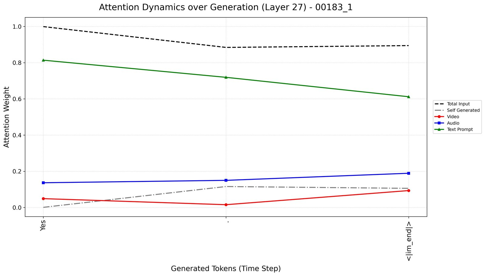
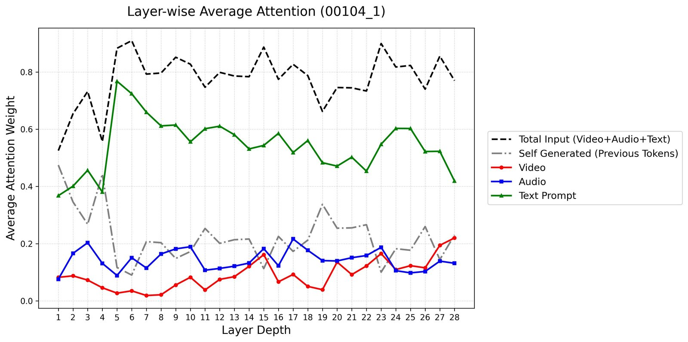
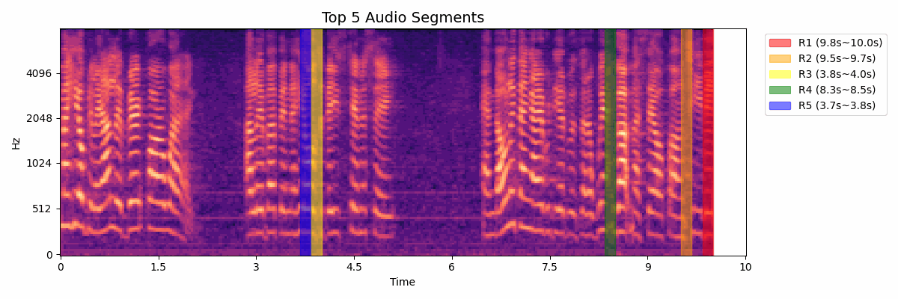
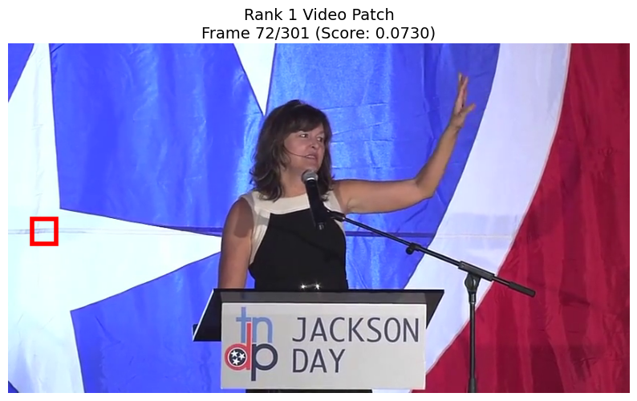

<sub>[🏠 Portfolio](https://github.com/heoneyzi) › [📚 Study](../../../README.md) › [🌀 Hallucination](../../README.md) › [🧪 Experiments](../README.md) › **E1 · AVHBench attention probe**</sub>

# 🔬 E1 · AVHBench attention probe — where does video-SALMONN 2+ look?

> **Question —** When an audio-visual LLM answers a hallucination-probing question, how much of each generated token's attention goes to video, audio and text-prompt tokens? And does that look different when it hallucinates?

<details>
<summary><b>🇰🇷 한국어 요약</b></summary>

AVHBench의 영상 12개(원본/불일치 대조 6쌍), 질문 33개에 대해 video-SALMONN 2+ 7B가 답을 만들 때 생성 토큰마다 영상·오디오·텍스트 중 어디에 어텐션을 주는지 기록한 파일럿입니다. 소리·물체 존재 여부를 묻는 단일 모달리티 질문은 17개 중 15개를 맞혔습니다. 반면 영상과 소리가 서로 맞는지 묻는 질문은 10개 중 5개만 맞혔고, 불일치 쌍 6개 중 4개를 '일치한다'고 답했습니다. 이 네 경우 모두 'Yes'를 말하는 순간의 어텐션은 대부분 질문 텍스트에 있었고, 영상 어텐션은 뒤이어 물체 이름을 말할 때에야 올라갔습니다. 다만 정답을 맞힌 경우에도 텍스트 쏠림이 보여 환각 판별 신호라고 보기는 어렵고, 표본이 작아 경향만 보여 줍니다.

</details>

| | |
|---|---|
| **Status** | ✅ Pilot done (Mar 2026); full analysis in [note 22](../../05_audio_visual/03_video_salmonn2plus_first_results.md) |
| **Model / data** | video-SALMONN 2+ **7B** for the analysis (max frames 768 → 128; clips ≈ 10 s) · AVHBench: 12 videos = 6 original / mismatched pairs, 33 questions |
| **Compute** | not recorded |
| **Headline** | 20 / 27 yes-no answers matched the label; **4 of the 6 mismatched audio–video pairs were called "matching"** |

## Setup

- **Benchmark.** [AVHBench](https://github.com/kaist-ami/AVHBench) (ICLR 2025) probes cross-modal hallucination with four task types. "Is the X making sound in the audio?" tests video-driven audio hallucination; "Is the X visible in the video?" tests audio-driven video hallucination. The other two are "Are the contexts of audio and visual content matching?" and a one-sentence audio-visual caption.
- **Measurement.** For every generated token, the attention weights (averaged over heads) are summed over video tokens, audio tokens, text-prompt tokens and previously generated tokens. The note plots this per layer (all 28 layers) and per token (last layer, index 27). It also shows the five most-attended audio windows on the spectrogram and the three most-attended video patches.
- **Script.** `avhbench_attention_log.py` is the logging script as preserved in Jiheon's folder. It runs the **3B** checkpoint with 16 frames × 20,000 max pixels, keeps the **last layer only**, and writes one JSON set per question. The per-layer 7B variant behind the note's plots and the plotting code were not preserved.

## Results

Tally of the colour-coded answers in note 22 (label vs. generated answer):

| Question type | Items | Matched label | Misses |
|---|---|---|---|
| Is the X making sound in the audio? | 12 | 10 | microphone (label No → "Yes"), truck (label Yes → "No") |
| Is the X visible in the video? | 5 | 5 | — |
| Are the audio and visual contexts matching? | 10 | 5 | 4 of 6 mismatched pairs → "Yes"; 1 of 4 matched pairs → "No" |
| Describe what you see and hear | 6 | — | free-form; 2 marked acceptable, 4 only partly right (e.g. siren and motorcycle missed) |

<table><tr>
<td align="center" width="50%"><br><sub>00183_1, a mismatched pair answered "Yes." (wrong): the answer token draws mostly on the text prompt.</sub></td>
<td align="center" width="50%"><br><sub>00104_1 (correct "Yes"): text-prompt tokens lead at every one of the 28 layers.</sub></td>
</tr><tr>
<td align="center" width="50%"><br><sub>Five most-attended audio windows for 00104_1.</sub></td>
<td align="center" width="50%"><br><sub>Most-attended video patch for 00104_1: background flag, not the speaker.</sub></td>
</tr></table>

## Takeaway

- **Cross-modal matching is where it breaks.** Single-modality existence questions were almost all right (15 / 17). Audio–video matching was a coin flip (5 / 10), and the misses were mostly "Yes" answers to mismatched pairs.
- **The answer comes with little attention on the video.** In all four "matching" hallucinations (00105, 00183, 00298, 00402), the answer token "Yes" took most of its last-layer attention from the text prompt, with video the smallest share. Video attention rose only afterwards, on object words such as "fish", "tank" and "toilet".
- **Not a detector (yet).** Correct answers (e.g. 00104_1) show the same text dominance, so in this pilot it is a general tendency rather than a hallucination signal. Twelve hand-picked videos support patterns, not rates.
- The most-attended video patch in 00104 sits on the background, echoing the background-token finding of DAMRO (note 6) in an audio-visual model.

## Files

| File | What it is |
|---|---|
| [`avhbench_attention_log.py`](avhbench_attention_log.py) | Loads AVHBench `QA.json` and runs video-SALMONN 2+ with `output_attentions=True`. Per question it writes `main_result_with_log.json` (answer plus per-token video / audio / text / self attention) and top-10 token logs per modality |
| [note 22](../../05_audio_visual/03_video_salmonn2plus_first_results.md) | The analysis with all 65 plots |
| [`../LICENSE-video-SALMONN-2`](../LICENSE-video-SALMONN-2) | Upstream Apache-2.0 licence |

## Run

```bash
git clone https://github.com/bytedance/video-SALMONN-2
cp avhbench_attention_log.py video-SALMONN-2/video_SALMONN2_plus/   # it imports the local qwenvl package
cd video-SALMONN-2/video_SALMONN2_plus
python avhbench_attention_log.py --qa-json /path/to/AVHBench/QA.json --video-dir /path/to/AVHBench/videos
```
Environment: [note 21](../../05_audio_visual/02_video_salmonn2plus_setup.md). AVHBench videos and QA come from its [repository](https://github.com/kaist-ami/AVHBench) and are not included.

---
<sub>[← Experiments](../README.md) · [📑 Hallucination index](../../README.md) · [E2 · DAVE evaluation →](../E2_dave_eval/README.md)</sub>
