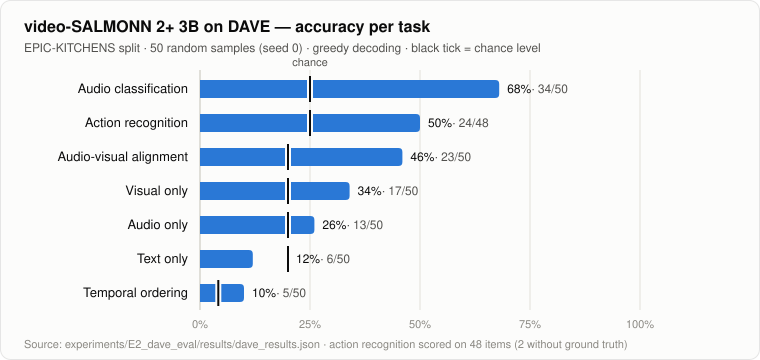

<sub>[🏠 Portfolio](https://github.com/heoneyzi) › [📚 Study](../../../README.md) › [🌀 Hallucination](../../README.md) › [🧪 Experiments](../README.md) › **E2 · DAVE evaluation**</sub>

# 🔬 E2 · video-SALMONN 2+ on DAVE — which audio-visual sub-skill breaks?

> **Question —** Can video-SALMONN 2+ link a sound to the action happening when it is heard, and if not, is the failure in vision, audio, or timing?

| | |
|---|---|
| **Status** | ✅ Done (May 2026, from file timestamps) |
| **Model / data** | `tsinghua-ee/video-SALMONN2_plus_3B_full` · [DAVE](https://huggingface.co/datasets/gorjanradevski/dave) `epic` split (EPIC-KITCHENS), 50 random samples, seed 0 |
| **Compute** | 1,675 s wall-clock for 50 samples × 7 tasks (`elapsed_sec` in the results file); GPU not recorded |
| **Headline** | Audio-visual alignment **0.46** (23 / 50) vs 0.20 chance; **0 / 9** on items whose answer is "none of the above" |

## What DAVE tests

[DAVE](https://arxiv.org/abs/2503.09321) (Radevski et al., NeurIPS 2025 Datasets & Benchmarks) overlays a sound effect on an egocentric kitchen video during one of four actions. The main question asks what the person is doing when the sound is heard, which needs both modalities. Six atomic tasks split the failure apart: visual only, audio only, text only, temporal ordering, action recognition and audio classification. In the five-option tasks, option (E) "none of the above" is correct when the overlaid sound corresponds to none of the four events.

## Setup

- `eval_dave.py` loads DAVE from Hugging Face and builds the dataset-card prompts. It routes media per task (video with the overlaid audio and `use_audio=True`, or the silent video), generates greedily (max 32 new tokens), parses the answer, and writes `results/dave_results.json`.
- Visual budget: up to 768 frames and 61,250 max pixels, FlashAttention-2, bf16.
- Scoring is an exact letter match. Temporal ordering must match all four positions. Action recognition compares with the first listed answer, as in the dataset-card example. Items without ground truth are skipped (2 action-recognition items).

## Results

| Task | Input given to the model | Accuracy | Correct / scored | Chance |
|---|---|---|---|---|
| Audio-visual alignment | video + overlaid audio | **0.46** | 23 / 50 | 0.20 |
| Visual only | silent video | 0.34 | 17 / 50 | 0.20 |
| Audio only | video + overlaid audio ¹ | 0.26 | 13 / 50 | 0.20 |
| Text only | event narrations + silent video ¹ | 0.12 | 6 / 50 | 0.20 |
| Temporal ordering | silent video | 0.10 | 5 / 50 | ≈ 0.04 (1/24) |
| Action recognition | video + overlaid audio | 0.50 | 24 / 48 | 0.25 |
| Audio classification | video + overlaid audio | 0.68 | 34 / 50 | 0.25 |

<sub>¹ video-SALMONN 2+ always takes a video file, so "audio only" still sees the frames and "text only" still sees the silent video. Source: `results/dave_results.json` (`accuracy`, `correct`, `total`).</sub>

<p align="center"></p>
<p align="center"><sub>Accuracy per task, sorted; black tick = chance level. Generated from <code>results/dave_results.json</code> during portfolio curation.</sub></p>

**Diagnostics derived from `per_sample`** (re-computable with the snippet below)

| Check | Result |
|---|---|
| Items whose answer is (E) "none of the above" | 9 / 50 samples, the same 9 in all four 5-option tasks |
| Model answered (E) | 0× in AV alignment, visual only and audio only; 2× in text only (1 correct) |
| AV alignment on the other 41 samples | 23 / 41 (0.56) |
| Letter distribution, 300 single-letter answers | D 101 · B 90 · C 63 · A 44 · E 2 |
| Action recognition, items with two valid answers | 13 / 48; crediting either answer gives 25 / 48 (0.52) instead of 24 / 48 |
| Temporal ordering | 50 / 50 outputs are valid permutations; 5 are the correct order |

## Takeaway

- **Above chance where both modalities meet, but far from solved.** AV alignment is 0.46 against 0.20 chance. The model names the overlaid sound more often (0.68) than it links that sound to the concurrent action (0.46), and it rarely orders the actions correctly (0.10).
- **It never abstains.** When no listed action matches the sound, it still picks one (0 / 9 on "none of the above"). In the terms of this study, that is a forced audio-visual match: a hallucination-style failure that plain accuracy hides.
- **Text alone does not give the answer away** (0.12, below chance), consistent with DAVE's aim that both modalities are needed.
- **Limits:** 50 samples, one split, one seed, the 3B model, and prompts that always include video. These are pilot numbers, not comparable with the DAVE paper's full-benchmark results.

<details>
<summary><b>Snippet: recompute the diagnostics</b></summary>

```python
import json, re, collections
r = json.load(open("results/dave_results.json"))
ps = r["per_sample"]
letter = lambda p: (m := re.search(r"\(?([A-E])\)?", p, re.I)) and "ABCDE".index(m.group(1).upper())
five = ["audio_visual_alignment", "visual_only", "audio_only", "text_only"]
for t in five:
    none = [s["tasks"][t] for s in ps if s["tasks"][t]["ground_truth"] == 4]
    picked_e = sum(letter(s["tasks"][t]["prediction"]) == 4 for s in ps)
    print(t, "gt=E:", len(none), "correct:", sum(d["correct"] for d in none), "answered E:", picked_e)
av_rest = [s["tasks"]["audio_visual_alignment"] for s in ps if s["tasks"]["audio_visual_alignment"]["ground_truth"] != 4]
print("AV alignment without E items:", sum(d["correct"] for d in av_rest), "/", len(av_rest))
tasks = five + ["action_recognition", "audio_classification"]
print(collections.Counter("ABCDE"[letter(s["tasks"][t]["prediction"])] for t in tasks for s in ps))
ar = [s["tasks"]["action_recognition"] for s in ps if s["tasks"]["action_recognition"]["ground_truth"] is not None]
print("multi-answer:", sum(len(d["ground_truth"]) > 1 for d in ar),
      "any-of correct:", sum(letter(d["prediction"]) in d["ground_truth"] for d in ar), "/", len(ar))
```

</details>

## Files

| File | What it is |
|---|---|
| [`eval_dave.py`](eval_dave.py) | 7-task DAVE evaluation; produced `results/dave_results.json` (originally `eval_dave_ssh.py`) |
| [`eval_dave_attention.py`](eval_dave_attention.py) | The same evaluation, plus per-token video / audio / text attention logs (eager attention, 16 frames, last layer). No outputs were preserved |
| [`results/dave_results.json`](results/dave_results.json) | Accuracy, counts, and per-sample prompts, predictions and ground truth (138 KB) |
| [`assets/dave_accuracy.svg`](assets/dave_accuracy.svg) | Chart generated from the results file |

## Run

```bash
git clone https://github.com/bytedance/video-SALMONN-2
cp eval_dave.py eval_dave_attention.py video-SALMONN-2/
cd video-SALMONN-2
python eval_dave.py --split epic --max-samples 50 --seed 0            # add --cache-dir <hf-cache> if needed
python eval_dave_attention.py --split epic --max-samples 50            # optional attention logs
```
Environment: [note 21](../../05_audio_visual/02_video_salmonn2plus_setup.md). The DAVE videos download through the Hugging Face dataset loader and are not included. If the dataset cache was built on another machine, remap its stored paths with `--path-remap OLD_PREFIX NEW_PREFIX`.

---
<sub>[← E1 · AVHBench attention probe](../E1_avhbench_attention/README.md) · [📑 Hallucination index](../../README.md) · [🧪 Experiments](../README.md)</sub>
