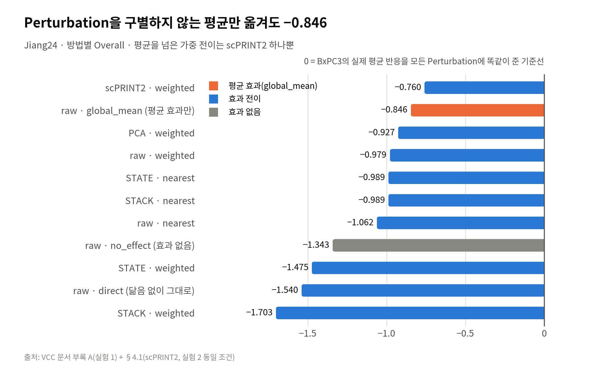
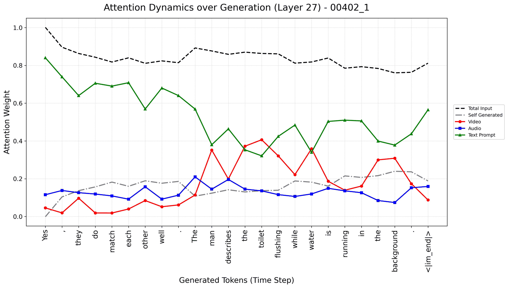

[🏠 Jiheon Kang](https://github.com/heoneyzi) › **📚 Study**

# 📚 Study

**How I learn a field: read the papers, write them up, argue about them in a team — then turn the open questions into experiments.**

  

Two long-running study tracks, exported from Notion with every figure and author kept. The notes stay in their original Korean; each folder has an English guide with a reading order, a timeline and one-line descriptions of every note.

<b>🇰🇷 한국어 요약</b>

노션에 쌓아 온 공부 기록 두 갈래를 옮겨 왔습니다. **Genomics**는 YAI Functional Genomics 팀의 두 시즌 기록(CAFA 6 → 유전체 언어모델 저널클럽 → Perturbation 생물학과 VCC 2026)으로, 팀원들의 노트까지 작성자를 밝혀 모두 담았습니다. **Hallucination**은 멀티모달 LLM이 없는 것을 있다고 말하는 이유를 약 1년간 파고든 기록으로, 이미지-텍스트 모델의 어텐션 기반 완화 기법에서 시작해 오디오-비디오 LLM(video-SALMONN 2+) 파일럿 실험까지 이어집니다. 노트 원문은 한국어 그대로 두었고, 각 폴더의 README가 읽는 순서와 요약을 안내합니다.

<table>
<tr>
<td width="50%" valign="top">

 <b><a href="Genomics/README.md">🧬 Genomics</a></b>
 69 notes from two seasons of YAI Functional Genomics: CAFA 6, a genome-LM journal club (which led to GDTR) and single-cell Perturbation biology for VCC 2026.
 <b>Study notes · Jan 2026 – ongoing</b>
</td>
<td width="50%" valign="top">

 <b><a href="Hallucination/README.md">🌀 Hallucination</a></b>
 A year on why multimodal LLMs report what isn’t there — attention-based fixes for LVLMs, then pilot experiments on an audio-visual LLM (video-SALMONN 2+).
 <b>Study notes + 2 pilots · 2025 – 2026</b>
</td>
</tr>
</table>

## 🔄 From study to research

| Study question | Where it went |
|---|---|
| Do genome LMs really beat one-hot baselines? At which layer does a DNA model "decide"? | [📄 02_Paper/GDTR](https://github.com/heoneyzi/Paper/blob/main/GDTR/README.md) · [🧬 01_Medical/GDTR](https://github.com/heoneyzi/Medical/blob/main/GDTR/README.md) |
| Which representation helps zero-shot Perturbation prediction? | [🧫 01_Medical/VCC_2026](https://github.com/heoneyzi/Medical/blob/main/VCC_2026/README.md) |
| Why do vision-language models describe objects that aren't there? | [📰 Newsletter #95, #114, #125](https://github.com/heoneyzi/Deep_Daiv/blob/main/Contents/NewsLetter/README.md) · [🎥 Multimodal track](https://github.com/heoneyzi/Deep_Daiv/blob/main/Project/Multimodal/README.md) |

> [!NOTE]
> Notes written by teammates are published with their names in each note's header; AI-generated text that was pasted into the original pages (meeting auto-summaries, chatbot answers) is marked as such.

---
[🏠 Jiheon Kang](https://github.com/heoneyzi) · [Next: Hallucination →](Hallucination/README.md)

---

[Medical](https://github.com/heoneyzi/Medical) · [Paper](https://github.com/heoneyzi/Paper) · [Study](https://github.com/heoneyzi/Study) · [Deep_Daiv](https://github.com/heoneyzi/Deep_Daiv)

[Research website](https://heoneyzi.github.io/) · [CV (PDF)](https://heoneyzi.github.io/Jiheon_Kang_CV.pdf) · [Original repository archive](https://github.com/heoneyzi/Portfolio-Archive)
